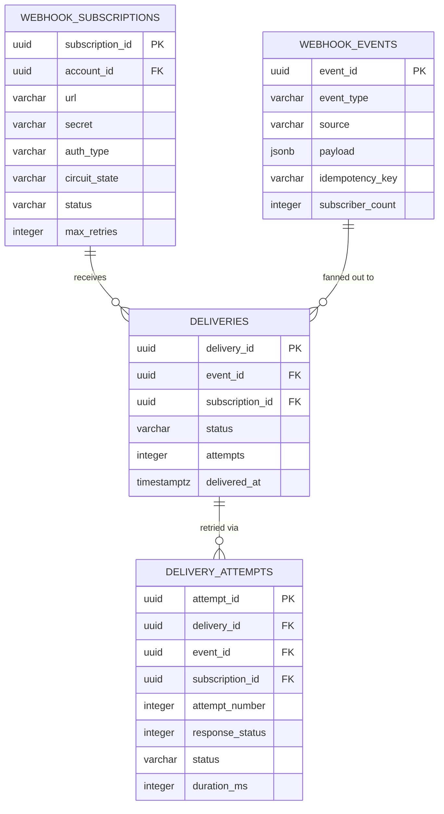
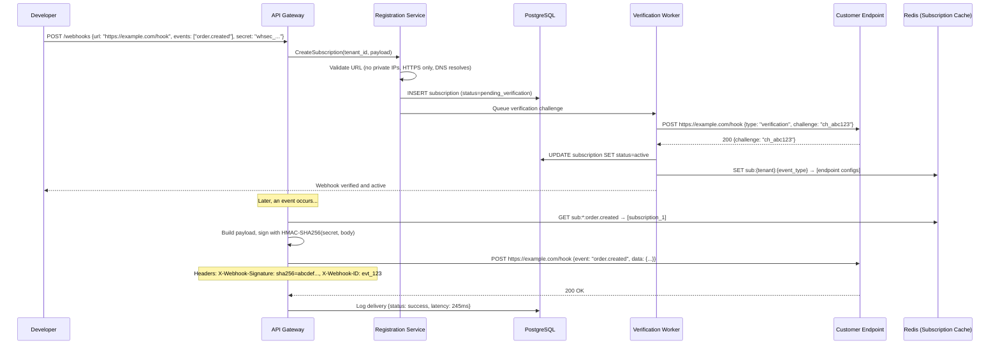
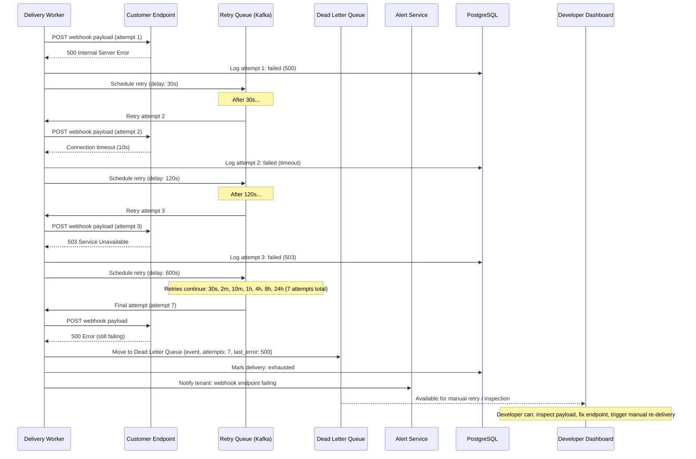

# Webhook Delivery Platform System Design

## 1. Functional Requirements

### Core Features
- **Webhook Registration**: Register endpoint URLs with event filters and secrets
- **Reliable Delivery**: At-least-once delivery with exponential backoff retry
- **Delivery Verification**: HMAC-SHA256 signing for payload authenticity
- **Fan-Out**: Single event triggers delivery to many subscribers
- **Rate Limiting**: Per-endpoint throttling to protect subscriber services
- **Circuit Breaker**: Automatic disable for consistently failing endpoints
- **Delivery Logs**: Full audit trail with replay capability
- **Dead Letter Queue (DLQ)**: Store persistently failed deliveries for manual retry
- **Ordering Guarantees**: Per-resource ordering using partitioning

### Out of Scope
- Webhook consumer/receiver implementation
- Event generation (source systems)
- Billing per delivery

## 2. Non-Functional Requirements

| Requirement | Target |
|-------------|--------|
| Delivery Latency (p50) | <1s from event to first attempt |
| Delivery Latency (p99) | <5s from event to first attempt |
| Availability | 99.99% |
| Throughput | 1M events/sec ingestion, 10M deliveries/sec (fan-out) |
| Delivery Success Rate | >99.5% (excluding permanently dead endpoints) |
| At-Least-Once Guarantee | 100% (no lost webhooks) |
| Retry Window | Up to 72 hours before DLQ |
| Ordering | Per-resource strict ordering (configurable) |
| Deduplication Window | 24 hours |
| Payload Size | Up to 1MB per webhook |

## 3. Capacity Estimation

### Scale
- Registered webhooks: 50M endpoints
- Active subscriptions (receiving events): 10M
- Events generated: 1M/sec
- Average fan-out: 10 subscribers per event → 10M deliveries/sec
- Retry rate: 5% of deliveries need ≥1 retry
- Average payload size: 2KB

### Storage
- Event payloads: 1M/sec × 2KB × 86400 = 172TB/day (retained 7 days = 1.2PB)
- Delivery logs: 10M/sec × 500B × 86400 = 432TB/day (retained 30 days)
  - Compressed + aggregated: ~50TB retained
- Webhook configs: 50M × 2KB = 100GB
- DLQ: ~1% of deliveries × 2KB = sustained 2TB

### Compute
- Delivery workers: 10M deliveries/sec ÷ 1000 deliveries/worker/sec = 10,000 workers
- With connection pooling and async I/O: ~2000 workers (5000 req/s each)
- Event router (fan-out): 500 instances
- Circuit breaker manager: 50 instances

### Bandwidth
- Outbound: 10M/sec × 2KB = 20GB/s
- Inbound (events): 1M/sec × 2KB = 2GB/s
- Internal (Kafka): ~40GB/s (replication)

## 4. Data Modeling

### Entity-Relationship Diagram



```sql
-- Webhook subscriptions (endpoints)
CREATE TABLE webhook_subscriptions (
    subscription_id     UUID PRIMARY KEY DEFAULT gen_random_uuid(),
    account_id          UUID NOT NULL, -- owning account
    name                VARCHAR(255),
    -- Endpoint config
    url                 VARCHAR(2000) NOT NULL,
    http_method         VARCHAR(10) DEFAULT 'POST',
    headers             JSONB DEFAULT '{}', -- custom headers to include
    -- Security
    secret              VARCHAR(500) NOT NULL, -- HMAC signing secret
    secret_version      INTEGER DEFAULT 1,
    auth_type           VARCHAR(20) DEFAULT 'hmac', -- hmac, basic, bearer, oauth2
    auth_config         JSONB, -- auth-type-specific config
    -- Event filtering
    event_types         TEXT[] NOT NULL, -- ["order.created", "payment.*"]
    filter_expression   TEXT, -- JSONPath or CEL filter on payload
    -- Delivery config
    timeout_ms          INTEGER DEFAULT 30000,
    max_retries         INTEGER DEFAULT 10,
    retry_strategy      VARCHAR(20) DEFAULT 'exponential', -- exponential, linear, fixed
    content_type        VARCHAR(100) DEFAULT 'application/json',
    -- Rate limiting
    rate_limit_per_sec  INTEGER DEFAULT 100,
    rate_limit_burst    INTEGER DEFAULT 200,
    -- Ordering
    ordered_delivery    BOOLEAN DEFAULT FALSE,
    ordering_key_path   VARCHAR(500), -- JSONPath to extract ordering key from payload
    -- Circuit breaker
    circuit_state       VARCHAR(20) DEFAULT 'closed', -- closed, open, half_open
    circuit_opened_at   TIMESTAMPTZ,
    failure_count       INTEGER DEFAULT 0,
    success_count       INTEGER DEFAULT 0,
    consecutive_failures INTEGER DEFAULT 0,
    -- Health
    health_score        FLOAT DEFAULT 1.0, -- 0 to 1
    last_delivery_at    TIMESTAMPTZ,
    last_success_at     TIMESTAMPTZ,
    last_failure_at     TIMESTAMPTZ,
    last_failure_reason TEXT,
    -- Status
    status              VARCHAR(20) DEFAULT 'active', -- active, paused, disabled
    disabled_reason     TEXT,
    created_at          TIMESTAMPTZ DEFAULT NOW(),
    updated_at          TIMESTAMPTZ DEFAULT NOW(),
    CONSTRAINT fk_account FOREIGN KEY (account_id) REFERENCES accounts(account_id)
);

CREATE INDEX idx_subscriptions_account ON webhook_subscriptions(account_id, status);
CREATE INDEX idx_subscriptions_event_types ON webhook_subscriptions USING GIN(event_types);
CREATE INDEX idx_subscriptions_circuit_open ON webhook_subscriptions(circuit_state) WHERE circuit_state = 'open';

-- Events (source events before fan-out)
CREATE TABLE webhook_events (
    event_id            UUID PRIMARY KEY DEFAULT gen_random_uuid(),
    event_type          VARCHAR(255) NOT NULL,
    source              VARCHAR(255) NOT NULL, -- originating service
    payload             JSONB NOT NULL,
    payload_size_bytes  INTEGER NOT NULL,
    idempotency_key     VARCHAR(255) UNIQUE, -- deduplication
    resource_id         VARCHAR(255), -- for ordering (e.g., order_id)
    resource_type       VARCHAR(100),
    -- Metadata
    trace_id            VARCHAR(64),
    occurred_at         TIMESTAMPTZ NOT NULL, -- when event actually happened
    received_at         TIMESTAMPTZ NOT NULL DEFAULT NOW(),
    -- Fan-out tracking
    subscriber_count    INTEGER DEFAULT 0,
    delivered_count     INTEGER DEFAULT 0,
    failed_count        INTEGER DEFAULT 0,
    -- Retention
    expires_at          TIMESTAMPTZ NOT NULL DEFAULT (NOW() + INTERVAL '7 days')
);

CREATE INDEX idx_events_type_time ON webhook_events(event_type, received_at DESC);
CREATE INDEX idx_events_resource ON webhook_events(resource_type, resource_id, occurred_at);
CREATE INDEX idx_events_idempotency ON webhook_events(idempotency_key) WHERE idempotency_key IS NOT NULL;

-- Delivery attempts (audit log)
CREATE TABLE delivery_attempts (
    attempt_id          UUID PRIMARY KEY DEFAULT gen_random_uuid(),
    delivery_id         UUID NOT NULL,
    event_id            UUID NOT NULL,
    subscription_id     UUID NOT NULL,
    attempt_number      INTEGER NOT NULL,
    -- Request
    request_url         VARCHAR(2000) NOT NULL,
    request_headers     JSONB,
    request_body_hash   VARCHAR(64), -- SHA-256 of payload (not stored for space)
    -- Response
    response_status     INTEGER,
    response_headers    JSONB,
    response_body       TEXT, -- first 4KB of response
    -- Timing
    started_at          TIMESTAMPTZ NOT NULL,
    completed_at        TIMESTAMPTZ,
    duration_ms         INTEGER,
    -- Result
    status              VARCHAR(20) NOT NULL, -- success, failed, timeout, error
    error_message       TEXT,
    -- Next retry
    next_retry_at       TIMESTAMPTZ,
    CONSTRAINT fk_event FOREIGN KEY (event_id) REFERENCES webhook_events(event_id)
);

CREATE INDEX idx_attempts_delivery ON delivery_attempts(delivery_id, attempt_number);
CREATE INDEX idx_attempts_subscription ON delivery_attempts(subscription_id, started_at DESC);
CREATE INDEX idx_attempts_retry ON delivery_attempts(next_retry_at) WHERE status = 'failed' AND next_retry_at IS NOT NULL;

-- Delivery records (one per event × subscriber pair)
CREATE TABLE deliveries (
    delivery_id         UUID PRIMARY KEY DEFAULT gen_random_uuid(),
    event_id            UUID NOT NULL,
    subscription_id     UUID NOT NULL,
    -- Status
    status              VARCHAR(20) DEFAULT 'pending', -- pending, in_progress, delivered, failed, dlq
    attempts            INTEGER DEFAULT 0,
    max_attempts        INTEGER NOT NULL,
    -- Timing
    created_at          TIMESTAMPTZ DEFAULT NOW(),
    first_attempt_at    TIMESTAMPTZ,
    delivered_at        TIMESTAMPTZ,
    next_attempt_at     TIMESTAMPTZ,
    expires_at          TIMESTAMPTZ,
    -- Ordering
    ordering_key        VARCHAR(255),
    sequence_number     BIGINT, -- monotonic per ordering_key
    -- DLQ
    dlq_at              TIMESTAMPTZ,
    dlq_reason          TEXT,
    CONSTRAINT fk_event FOREIGN KEY (event_id) REFERENCES webhook_events(event_id),
    CONSTRAINT fk_subscription FOREIGN KEY (subscription_id) REFERENCES webhook_subscriptions(subscription_id)
);

CREATE INDEX idx_deliveries_pending ON deliveries(next_attempt_at) WHERE status IN ('pending', 'failed');
CREATE INDEX idx_deliveries_subscription ON deliveries(subscription_id, status);
CREATE INDEX idx_deliveries_ordering ON deliveries(subscription_id, ordering_key, sequence_number);
CREATE INDEX idx_deliveries_dlq ON deliveries(subscription_id) WHERE status = 'dlq';

-- Dead Letter Queue
CREATE TABLE dead_letter_queue (
    dlq_id              UUID PRIMARY KEY DEFAULT gen_random_uuid(),
    delivery_id         UUID NOT NULL,
    event_id            UUID NOT NULL,
    subscription_id     UUID NOT NULL,
    -- Original event data (preserved even after event expiry)
    event_type          VARCHAR(255) NOT NULL,
    payload             JSONB NOT NULL,
    -- Failure context
    total_attempts      INTEGER NOT NULL,
    last_error          TEXT,
    last_response_status INTEGER,
    -- Replay
    replayed            BOOLEAN DEFAULT FALSE,
    replayed_at         TIMESTAMPTZ,
    replay_delivery_id  UUID,
    -- Admin
    acknowledged        BOOLEAN DEFAULT FALSE,
    acknowledged_by     UUID,
    created_at          TIMESTAMPTZ DEFAULT NOW(),
    CONSTRAINT fk_delivery FOREIGN KEY (delivery_id) REFERENCES deliveries(delivery_id)
);

CREATE INDEX idx_dlq_subscription ON dead_letter_queue(subscription_id, created_at DESC) WHERE NOT acknowledged;
```

### Redis Schemas

```redis
# Rate limiting per endpoint (sliding window)
# Using Redis sorted set for sliding window rate limiting
ZADD ratelimit:{subscription_id} {timestamp_ms} {delivery_id}
ZREMRANGEBYSCORE ratelimit:{subscription_id} 0 {window_start}
ZCARD ratelimit:{subscription_id}

# Circuit breaker state
HSET circuit:{subscription_id} state closed failures 0 successes 0 last_failure_ts 0

# Delivery ordering: in-flight tracker per ordering key
SET ordering:inflight:{subscription_id}:{ordering_key} {delivery_id} EX 300

# Sequence number generator (per subscription + ordering key)
INCR sequence:{subscription_id}:{ordering_key}

# Deduplication (idempotency check)
SET dedup:{idempotency_key} 1 EX 86400

# Active delivery tracking (prevent duplicate processing)
SET delivery:lock:{delivery_id} {worker_id} EX 60 NX

# Health score (exponentially weighted moving average)
HSET health:{subscription_id} score 0.95 last_success_ts {ts} window_successes 95 window_total 100
```

### Kafka Topics

```yaml
topics:
  webhook.events.inbound:
    partitions: 256
    replication: 3
    retention: 7d
    key: event_type  # Spread events across partitions
    
  webhook.deliveries:
    partitions: 512
    replication: 3
    retention: 3d
    key: subscription_id  # Ensure per-subscriber ordering
    
  webhook.deliveries.priority:
    partitions: 64
    replication: 3
    retention: 1d
    key: subscription_id
    
  webhook.deliveries.retry:
    partitions: 128
    replication: 3
    retention: 7d
    key: subscription_id
    
  webhook.dlq:
    partitions: 32
    replication: 3
    retention: 30d
    key: subscription_id
    
  webhook.events.ordered:
    partitions: 256
    replication: 3
    retention: 3d
    key: ordering_key  # Partition by resource for ordering
```

## 5. High-Level Design (HLD)

```
┌─────────────────────────────────────────────────────────────────────────────────────┐
│                         EVENT SOURCES                                                │
│  ┌──────────┐  ┌──────────┐  ┌──────────┐  ┌──────────┐  ┌────────────────────┐   │
│  │ Orders   │  │ Payments │  │ Users    │  │ Inventory│  │  Any Service       │   │
│  │ Service  │  │ Service  │  │ Service  │  │ Service  │  │  (via SDK/API)     │   │
│  └────┬─────┘  └────┬─────┘  └────┬─────┘  └────┬─────┘  └────────┬───────────┘   │
└───────┼──────────────┼─────────────┼──────────────┼─────────────────┼───────────────┘
        │              │             │              │                  │
        ▼              ▼             ▼              ▼                  ▼
┌─────────────────────────────────────────────────────────────────────────────────────┐
│                         EVENT INGESTION API                                          │
│  ┌─────────────────────────────────────────────────────────────────────────────┐    │
│  │  Validation │ Deduplication │ Schema Validation │ Event Enrichment          │    │
│  └─────────────────────────────────────────────────────────────────────────────┘    │
└─────────────────────────────────────────────────────────────────────────────────────┘
                              │
                              ▼
┌─────────────────────────────────────────────────────────────────────────────────────┐
│                         KAFKA (Event Store & Router)                                 │
│  ┌────────────────────────────────────────────────────────────────────────────┐     │
│  │  webhook.events.inbound (partitioned by event_type)                        │     │
│  └────────────────────────────────────────────────────────────────────────────┘     │
└─────────────────────────────────────────────────────────────────────────────────────┘
                              │
                              ▼
┌─────────────────────────────────────────────────────────────────────────────────────┐
│                         FAN-OUT SERVICE                                              │
│                                                                                     │
│  ┌───────────────────────────────────────────────────────────────────────────┐      │
│  │  1. Match event_type against subscriptions (inverted index)               │      │
│  │  2. Apply filter expressions per subscription                             │      │
│  │  3. Generate delivery records (event × matching subscribers)              │      │
│  │  4. Sign payload with subscriber's secret (HMAC-SHA256)                   │      │
│  │  5. Route to appropriate delivery queue (priority/ordered/normal)         │      │
│  └───────────────────────────────────────────────────────────────────────────┘      │
└─────────────────────────────────────────────────────────────────────────────────────┘
         │                    │                               │
         ▼                    ▼                               ▼
┌──────────────────┐ ┌──────────────────────────┐  ┌──────────────────────────────┐
│ Priority Queue   │ │ Ordered Delivery Queue   │  │ Standard Delivery Queue      │
│ (Premium subs)   │ │ (Per-resource partition)  │  │ (Best effort ordering)       │
└────────┬─────────┘ └───────────┬──────────────┘  └──────────────┬───────────────┘
         │                       │                                  │
         ▼                       ▼                                  ▼
┌─────────────────────────────────────────────────────────────────────────────────────┐
│                         DELIVERY WORKER POOL                                        │
│                                                                                     │
│  ┌───────────────┐  ┌───────────────┐  ┌───────────────┐  ┌───────────────┐       │
│  │  Worker Pod   │  │  Worker Pod   │  │  Worker Pod   │  │  Worker Pod   │       │
│  │               │  │               │  │               │  │               │       │
│  │ - HTTP client │  │ - HTTP client │  │ - HTTP client │  │ - HTTP client │       │
│  │ - Rate limit  │  │ - Rate limit  │  │ - Rate limit  │  │ - Rate limit  │       │
│  │ - Circuit brk │  │ - Circuit brk │  │ - Circuit brk │  │ - Circuit brk │       │
│  │ - Retry logic │  │ - Retry logic │  │ - Retry logic │  │ - Retry logic │       │
│  │ - Timeout mgmt│  │ - Timeout mgmt│  │ - Timeout mgmt│  │ - Timeout mgmt│       │
│  └───────────────┘  └───────────────┘  └───────────────┘  └───────────────┘       │
│                                                                                     │
│  Features:                                                                          │
│  - Connection pooling per destination domain                                        │
│  - Async HTTP with configurable concurrency                                         │
│  - Back-pressure: slow consumption when downstream overwhelmed                      │
│  - Graceful shutdown: drain in-flight deliveries before termination                 │
└─────────────────────────────────────────────────────────────────────────────────────┘
         │                       │                                  │
         ▼                       ▼                                  ▼
┌─────────────────────────────────────────────────────────────────────────────────────┐
│                         RESULT PROCESSING                                           │
│                                                                                     │
│  ┌─────────────┐  ┌────────────────┐  ┌────────────────┐  ┌─────────────────┐     │
│  │  Success    │  │  Retry         │  │  Circuit       │  │  DLQ            │     │
│  │  Handler    │  │  Scheduler     │  │  Breaker       │  │  Manager        │     │
│  │             │  │                │  │  Manager       │  │                 │     │
│  │ - Log       │  │ - Exp backoff  │  │                │  │ - Store failed  │     │
│  │ - Update    │  │ - Schedule     │  │ - Track fails  │  │ - Alert         │     │
│  │   health    │  │   next attempt │  │ - Open/close   │  │ - Replay API    │     │
│  │ - ACK       │  │ - Jitter       │  │ - Health score │  │                 │     │
│  └─────────────┘  └────────────────┘  └────────────────┘  └─────────────────┘     │
└─────────────────────────────────────────────────────────────────────────────────────┘
```

## 6. Low-Level Design (LLD) - APIs

### Register Webhook API

```http
POST /api/v1/webhooks
Content-Type: application/json
Authorization: Bearer {token}

{
  "name": "Order Events Webhook",
  "url": "https://api.customer.com/webhooks/orders",
  "events": ["order.created", "order.updated", "order.shipped", "order.cancelled"],
  "filter": "$.payload.total_amount > 100",
  "secret": "whsec_auto_generated_or_user_provided",
  "config": {
    "timeout": 30000,
    "maxRetries": 10,
    "retryStrategy": "exponential",
    "rateLimitPerSec": 50,
    "orderedDelivery": true,
    "orderingKeyPath": "$.payload.order_id",
    "contentType": "application/json",
    "customHeaders": {
      "X-Custom-Source": "platform-v2"
    }
  },
  "auth": {
    "type": "hmac",
    "algorithm": "sha256"
  }
}
```

**Response:**
```json
{
  "id": "wh_sub_abc123",
  "name": "Order Events Webhook",
  "url": "https://api.customer.com/webhooks/orders",
  "events": ["order.created", "order.updated", "order.shipped", "order.cancelled"],
  "status": "active",
  "secret": "whsec_k3j4h5g6f7d8s9a0...",
  "signingKeyId": "sk_live_abc123",
  "healthScore": 1.0,
  "circuitState": "closed",
  "createdAt": "2024-03-18T10:00:00Z",
  "testUrl": "https://api.platform.com/webhooks/test/wh_sub_abc123"
}
```

### Webhook Delivery Payload Format

```http
POST https://api.customer.com/webhooks/orders
Content-Type: application/json
X-Webhook-ID: evt_xyz789
X-Webhook-Timestamp: 1710756000
X-Webhook-Signature: v1=5257a869e7ecebeda32affa62cdca3fa51cad7e77a0e56ff536d0ce8e108d8bd
X-Webhook-Delivery-ID: del_abc123
X-Webhook-Sequence: 42
X-Webhook-Attempt: 1
User-Agent: PlatformWebhooks/2.0

{
  "id": "evt_xyz789",
  "type": "order.created",
  "created": "2024-03-18T10:00:00Z",
  "data": {
    "order_id": "ord_12345",
    "customer_id": "cust_67890",
    "total_amount": 299.99,
    "currency": "USD",
    "items": [
      {"sku": "WIDGET-001", "quantity": 2, "price": 149.99}
    ],
    "status": "confirmed"
  },
  "metadata": {
    "source": "checkout-service",
    "version": "2024-03-01",
    "idempotencyKey": "idem_abc123"
  }
}
```

### Replay Webhook API

```http
POST /api/v1/webhooks/{subscription_id}/replay
Content-Type: application/json
Authorization: Bearer {token}

{
  "eventIds": ["evt_001", "evt_002", "evt_003"],
  "since": "2024-03-17T00:00:00Z",
  "until": "2024-03-18T00:00:00Z",
  "eventTypes": ["order.created"],
  "replayFromDlq": true,
  "dlqIds": ["dlq_abc", "dlq_def"]
}
```

**Response:**
```json
{
  "replayId": "replay_xyz",
  "status": "queued",
  "eventsToReplay": 45,
  "estimatedCompletion": "2024-03-18T10:05:00Z",
  "statusUrl": "/api/v1/replays/replay_xyz"
}
```

## 7. Deep Dives

### Deep Dive 1: Reliable Delivery with Retry

```python
import asyncio
import hashlib
import hmac
import time
import random
from dataclasses import dataclass
from typing import Optional
from enum import Enum

class DeliveryStatus(Enum):
    PENDING = "pending"
    IN_PROGRESS = "in_progress"
    DELIVERED = "delivered"
    FAILED = "failed"
    DLQ = "dlq"

@dataclass
class RetryConfig:
    max_retries: int = 10
    initial_delay_sec: int = 5
    max_delay_sec: int = 28800  # 8 hours
    backoff_multiplier: float = 2.0
    jitter_factor: float = 0.3  # ±30% jitter

class WebhookDeliveryWorker:
    """
    Reliable webhook delivery with:
    - Exponential backoff with jitter
    - Circuit breaker integration
    - Rate limiting per endpoint
    - HMAC signature generation
    - Idempotency key in payload for subscriber deduplication
    """
    
    def __init__(self, http_client, redis, db):
        self.http = http_client
        self.redis = redis
        self.db = db
    
    async def deliver(self, delivery: dict) -> dict:
        """Execute a single delivery attempt."""
        subscription = await self._get_subscription(delivery['subscription_id'])
        
        # Check circuit breaker
        if await self._is_circuit_open(subscription['subscription_id']):
            return {'status': 'circuit_open', 'retry': True}
        
        # Check rate limit
        if not await self._check_rate_limit(subscription):
            return {'status': 'rate_limited', 'retry': True, 'retry_after': 1}
        
        # Build request
        payload = delivery['payload']
        timestamp = int(time.time())
        signature = self._sign_payload(payload, subscription['secret'], timestamp)
        
        headers = {
            'Content-Type': subscription.get('content_type', 'application/json'),
            'X-Webhook-ID': delivery['event_id'],
            'X-Webhook-Timestamp': str(timestamp),
            'X-Webhook-Signature': f"v1={signature}",
            'X-Webhook-Delivery-ID': delivery['delivery_id'],
            'X-Webhook-Attempt': str(delivery['attempt_number']),
            'User-Agent': 'PlatformWebhooks/2.0',
            **(subscription.get('headers', {}))
        }
        
        # Add sequence number for ordered deliveries
        if delivery.get('sequence_number'):
            headers['X-Webhook-Sequence'] = str(delivery['sequence_number'])
        
        # Execute HTTP request
        start_time = time.monotonic()
        try:
            response = await asyncio.wait_for(
                self.http.post(
                    subscription['url'],
                    json=payload,
                    headers=headers
                ),
                timeout=subscription.get('timeout_ms', 30000) / 1000
            )
            
            duration_ms = int((time.monotonic() - start_time) * 1000)
            
            if 200 <= response.status_code < 300:
                # Success
                await self._record_success(subscription['subscription_id'])
                return {
                    'status': 'delivered',
                    'response_status': response.status_code,
                    'duration_ms': duration_ms
                }
            else:
                # Non-2xx response
                await self._record_failure(subscription['subscription_id'], 
                                           f"HTTP {response.status_code}")
                return {
                    'status': 'failed',
                    'response_status': response.status_code,
                    'response_body': response.text[:4096],
                    'duration_ms': duration_ms,
                    'retry': response.status_code >= 500 or response.status_code == 429
                }
        
        except asyncio.TimeoutError:
            duration_ms = int((time.monotonic() - start_time) * 1000)
            await self._record_failure(subscription['subscription_id'], "timeout")
            return {'status': 'timeout', 'duration_ms': duration_ms, 'retry': True}
        
        except Exception as e:
            await self._record_failure(subscription['subscription_id'], str(e))
            return {'status': 'error', 'error': str(e), 'retry': True}
    
    def _sign_payload(self, payload: dict, secret: str, timestamp: int) -> str:
        """
        Generate HMAC-SHA256 signature.
        Format: HMAC(secret, "{timestamp}.{json_payload}")
        """
        import json
        signed_content = f"{timestamp}.{json.dumps(payload, separators=(',', ':'))}"
        return hmac.new(
            secret.encode(),
            signed_content.encode(),
            hashlib.sha256
        ).hexdigest()
    
    async def _check_rate_limit(self, subscription: dict) -> bool:
        """Sliding window rate limiter using Redis sorted set."""
        sub_id = subscription['subscription_id']
        limit = subscription.get('rate_limit_per_sec', 100)
        now_ms = int(time.time() * 1000)
        window_ms = 1000  # 1 second window
        
        pipe = self.redis.pipeline()
        pipe.zremrangebyscore(f"ratelimit:{sub_id}", 0, now_ms - window_ms)
        pipe.zcard(f"ratelimit:{sub_id}")
        pipe.zadd(f"ratelimit:{sub_id}", {f"{now_ms}:{random.random()}": now_ms})
        pipe.expire(f"ratelimit:{sub_id}", 2)
        
        results = await pipe.execute()
        current_count = results[1]
        
        return current_count < limit


class RetryScheduler:
    """
    Schedules retries with exponential backoff + jitter.
    
    Retry timeline (default config):
    Attempt 1: immediate
    Attempt 2: ~5s
    Attempt 3: ~10s
    Attempt 4: ~20s
    Attempt 5: ~40s (with jitter: 28-52s)
    Attempt 6: ~80s
    Attempt 7: ~160s (~2.5 min)
    Attempt 8: ~320s (~5 min)
    Attempt 9: ~640s (~10 min)
    Attempt 10: ~1280s (~21 min)
    ... up to max 8 hours between attempts
    Total retry window: ~72 hours then → DLQ
    """
    
    def calculate_next_retry(self, attempt: int, config: RetryConfig) -> float:
        """Calculate next retry time with exponential backoff + jitter."""
        delay = config.initial_delay_sec * (config.backoff_multiplier ** (attempt - 1))
        delay = min(delay, config.max_delay_sec)
        
        # Add jitter: ±jitter_factor
        jitter_range = delay * config.jitter_factor
        jitter = random.uniform(-jitter_range, jitter_range)
        
        return max(1, delay + jitter)
    
    async def schedule_retry(self, delivery: dict, config: RetryConfig):
        """Schedule next retry or move to DLQ."""
        attempt = delivery['attempts']
        
        if attempt >= config.max_retries:
            # Move to DLQ
            await self._move_to_dlq(delivery)
            return
        
        delay = self.calculate_next_retry(attempt, config)
        next_attempt_at = time.time() + delay
        
        # Update delivery record
        await self.db.execute("""
            UPDATE deliveries SET 
                status = 'failed', 
                attempts = $1, 
                next_attempt_at = to_timestamp($2)
            WHERE delivery_id = $3
        """, attempt, next_attempt_at, delivery['delivery_id'])
        
        # Schedule in delay queue (Kafka with timestamp or Redis sorted set)
        await self.redis.zadd(
            "retry:schedule",
            {delivery['delivery_id']: next_attempt_at}
        )
```

### Deep Dive 2: Fan-Out Architecture

```python
class FanOutService:
    """
    Event fan-out: routes one event to all matching subscribers.
    
    Architecture:
    event → Kafka (inbound) → Fan-out consumers → match subscriptions 
            → generate deliveries → Kafka (deliveries, partitioned by subscriber)
            → delivery workers
    
    Challenges:
    - 1 event with 10K subscribers must generate 10K delivery records
    - Must not block inbound pipeline
    - Must handle subscription changes (new/deleted) gracefully
    """
    
    def __init__(self, kafka_producer, subscription_index, redis):
        self.producer = kafka_producer
        self.subscription_index = subscription_index  # In-memory inverted index
        self.redis = redis
    
    async def process_event(self, event: dict):
        """
        Fan out a single event to all matching subscribers.
        Uses inverted index for O(1) event_type → subscribers lookup.
        """
        event_type = event['event_type']
        
        # Deduplication check
        if event.get('idempotency_key'):
            if await self.redis.set(
                f"dedup:{event['idempotency_key']}", 1, 
                ex=86400, nx=True
            ) is None:
                return  # Duplicate, already processed
        
        # Find matching subscriptions
        matching_subs = self.subscription_index.match(event_type)
        
        # Apply per-subscription filters
        deliveries = []
        for sub in matching_subs:
            if sub['status'] != 'active':
                continue
            
            # Apply JSONPath filter if configured
            if sub.get('filter_expression'):
                if not self._evaluate_filter(event['payload'], sub['filter_expression']):
                    continue
            
            # Check circuit breaker (skip delivery creation if circuit is open)
            if await self._is_circuit_open(sub['subscription_id']):
                continue
            
            # Generate delivery
            delivery = {
                'delivery_id': generate_uuid(),
                'event_id': event['event_id'],
                'subscription_id': sub['subscription_id'],
                'payload': event['payload'],
                'attempt_number': 1,
                'max_attempts': sub.get('max_retries', 10),
            }
            
            # Handle ordering
            if sub.get('ordered_delivery'):
                ordering_key = self._extract_ordering_key(
                    event['payload'], sub['ordering_key_path']
                )
                delivery['ordering_key'] = ordering_key
                delivery['sequence_number'] = await self.redis.incr(
                    f"sequence:{sub['subscription_id']}:{ordering_key}"
                )
            
            deliveries.append(delivery)
        
        # Produce to delivery topic (batched)
        # Key = subscription_id ensures per-subscriber ordering in Kafka
        for delivery in deliveries:
            topic = self._select_topic(delivery)
            await self.producer.produce(
                topic=topic,
                key=delivery['subscription_id'],
                value=delivery
            )
    
    def _select_topic(self, delivery: dict) -> str:
        """Route to appropriate queue based on delivery characteristics."""
        if delivery.get('priority') == 'high':
            return 'webhook.deliveries.priority'
        if delivery.get('ordering_key'):
            return 'webhook.events.ordered'
        return 'webhook.deliveries'


class SubscriptionIndex:
    """
    In-memory inverted index: event_type → List[subscription].
    Supports wildcard patterns: "order.*" matches "order.created", "order.updated".
    Refreshed from DB every 30 seconds.
    """
    
    def __init__(self):
        self.exact_index = {}  # {"order.created": [sub1, sub2, ...]}
        self.pattern_index = []  # [(compiled_pattern, sub), ...]
    
    def match(self, event_type: str) -> list:
        """Find all subscriptions matching this event type."""
        results = []
        
        # Exact matches
        results.extend(self.exact_index.get(event_type, []))
        
        # Wildcard matches
        for pattern, sub in self.pattern_index:
            if pattern.match(event_type):
                results.append(sub)
        
        return results
    
    async def refresh(self):
        """Reload subscriptions from database."""
        subs = await self.db.fetch("""
            SELECT * FROM webhook_subscriptions WHERE status = 'active'
        """)
        
        new_exact = {}
        new_pattern = []
        
        for sub in subs:
            for event_type in sub['event_types']:
                if '*' in event_type:
                    pattern = re.compile(event_type.replace('.', r'\.').replace('*', '.*'))
                    new_pattern.append((pattern, sub))
                else:
                    new_exact.setdefault(event_type, []).append(sub)
        
        self.exact_index = new_exact
        self.pattern_index = new_pattern
```

### Deep Dive 3: Ordering Guarantees

```python
class OrderedDeliveryManager:
    """
    Guarantees per-resource ordering for webhook deliveries.
    
    Mechanism:
    1. Kafka partitioning by ordering_key (resource_id) ensures order in topic
    2. Single consumer per partition ensures processing order
    3. In-flight tracking: only one delivery per ordering_key active at a time
    4. Failed delivery blocks subsequent deliveries for same key (head-of-line)
    5. Sequence numbers for subscriber-side out-of-order detection
    
    Trade-off: Ordering reduces throughput (can't parallelize same-resource events)
    Mitigation: Only resources with same ordering_key are serialized; different
                resources are fully parallel.
    """
    
    def __init__(self, redis, delivery_worker):
        self.redis = redis
        self.worker = delivery_worker
    
    async def process_ordered_delivery(self, delivery: dict):
        """
        Process delivery with ordering guarantee.
        Only proceeds if no other delivery for same ordering_key is in-flight.
        """
        sub_id = delivery['subscription_id']
        ordering_key = delivery['ordering_key']
        lock_key = f"ordering:inflight:{sub_id}:{ordering_key}"
        
        # Try to acquire ordering lock
        acquired = await self.redis.set(
            lock_key, delivery['delivery_id'], 
            ex=300,  # 5 min max lock (safety timeout)
            nx=True  # Only if not already locked
        )
        
        if not acquired:
            # Another delivery for same key is in-flight
            # Check if it's a stale lock
            current_lock = await self.redis.get(lock_key)
            if current_lock and await self._is_delivery_complete(current_lock):
                # Previous delivery completed, release stale lock
                await self.redis.delete(lock_key)
                acquired = await self.redis.set(lock_key, delivery['delivery_id'], ex=300, nx=True)
            
            if not acquired:
                # Re-queue with short delay
                await self._requeue_after(delivery, delay_sec=1)
                return
        
        try:
            # Execute delivery
            result = await self.worker.deliver(delivery)
            
            if result['status'] == 'delivered':
                # Release lock, allow next delivery for this key
                await self.redis.delete(lock_key)
            elif result.get('retry'):
                # Failed but retryable: keep lock, schedule retry
                # This blocks subsequent deliveries (head-of-line blocking)
                # This is intentional: maintains order
                retry_delay = self._calculate_retry_delay(delivery['attempt_number'])
                await self._schedule_retry_with_lock(delivery, retry_delay, lock_key)
            else:
                # Permanent failure: release lock, move to DLQ
                await self.redis.delete(lock_key)
                await self._move_to_dlq(delivery, result)
        except Exception as e:
            # Unexpected error: release lock safely
            await self.redis.delete(lock_key)
            raise
    
    async def handle_out_of_order_detection(self, subscription_id: str, 
                                             ordering_key: str, 
                                             expected_seq: int, 
                                             received_seq: int):
        """
        Subscriber reports out-of-order delivery.
        This shouldn't happen with our ordering guarantees, but handle gracefully.
        
        Recovery:
        1. Pause delivery for this ordering_key
        2. Fetch all pending deliveries for this key
        3. Sort by sequence number
        4. Redeliver in correct order
        """
        # Log the anomaly
        await self._log_ordering_violation(subscription_id, ordering_key, 
                                           expected_seq, received_seq)
        
        # Fetch pending deliveries and reorder
        pending = await self.db.fetch("""
            SELECT * FROM deliveries 
            WHERE subscription_id = $1 AND ordering_key = $2 
              AND status IN ('pending', 'failed')
            ORDER BY sequence_number ASC
        """, subscription_id, ordering_key)
        
        # Re-queue in correct order
        for delivery in pending:
            await self._requeue_ordered(delivery)
```

## 8. Component Optimization

### Connection Pooling

```python
class ConnectionPoolManager:
    """
    Maintain connection pools per destination domain.
    Reuse HTTP connections (keep-alive) for high-volume subscribers.
    """
    
    MAX_CONNECTIONS_PER_HOST = 100
    IDLE_TIMEOUT = 60  # seconds
    
    pools = {}  # domain → aiohttp.TCPConnector
    
    def get_pool(self, url: str):
        from urllib.parse import urlparse
        domain = urlparse(url).netloc
        
        if domain not in self.pools:
            self.pools[domain] = aiohttp.TCPConnector(
                limit=self.MAX_CONNECTIONS_PER_HOST,
                ttl_dns_cache=300,
                keepalive_timeout=self.IDLE_TIMEOUT,
                enable_cleanup_closed=True
            )
        return self.pools[domain]
```

### Circuit Breaker Implementation

```python
class CircuitBreaker:
    """
    Per-endpoint circuit breaker with three states:
    
    CLOSED: Normal operation, deliveries flow through
      → Opens after 5 consecutive failures
    
    OPEN: All deliveries short-circuited (queued for later)
      → After 60s, transitions to HALF_OPEN
    
    HALF_OPEN: Allow single test delivery
      → Success → CLOSED
      → Failure → OPEN (reset timer)
    """
    
    FAILURE_THRESHOLD = 5
    RECOVERY_TIMEOUT = 60  # seconds
    HALF_OPEN_MAX_REQUESTS = 3
    
    async def record_success(self, subscription_id: str):
        await self.redis.hmset(f"circuit:{subscription_id}", {
            'state': 'closed',
            'failures': 0,
            'successes': await self.redis.hincrby(f"circuit:{subscription_id}", 'successes', 1),
            'last_success_ts': int(time.time())
        })
    
    async def record_failure(self, subscription_id: str, error: str):
        failures = await self.redis.hincrby(f"circuit:{subscription_id}", 'failures', 1)
        consecutive = await self.redis.hincrby(f"circuit:{subscription_id}", 'consecutive_failures', 1)
        
        if consecutive >= self.FAILURE_THRESHOLD:
            await self.redis.hmset(f"circuit:{subscription_id}", {
                'state': 'open',
                'opened_at': int(time.time()),
                'last_error': error
            })
            # Alert webhook owner
            await self._notify_owner(subscription_id, 'circuit_opened', error)
    
    async def should_allow(self, subscription_id: str) -> bool:
        state = await self.redis.hgetall(f"circuit:{subscription_id}")
        
        if state.get('state') == 'closed':
            return True
        
        if state.get('state') == 'open':
            opened_at = int(state.get('opened_at', 0))
            if time.time() - opened_at > self.RECOVERY_TIMEOUT:
                # Transition to half-open
                await self.redis.hset(f"circuit:{subscription_id}", 'state', 'half_open')
                return True
            return False
        
        if state.get('state') == 'half_open':
            # Allow limited requests to test recovery
            return True
        
        return True
```

### Back-Pressure Handling

```yaml
back_pressure:
  # Kafka consumer lag triggers
  consumer_lag_threshold: 10000  # messages behind
  action_on_high_lag:
    - pause_low_priority_subscriptions
    - increase_worker_count
    - alert_ops
  
  # Per-subscriber back-pressure
  per_subscriber_queue_limit: 10000
  action_on_queue_full:
    - drop_oldest (if configured)
    - block_producer (default)
    - move_to_overflow_storage
```

## 9. Observability

### Metrics

```yaml
metrics:
  - name: webhook_delivery_duration_seconds
    type: histogram
    labels: [subscription_id_bucket, status, attempt]
    buckets: [0.1, 0.5, 1, 2, 5, 10, 30]
  
  - name: webhook_deliveries_total
    type: counter
    labels: [status, event_type] # delivered, failed, timeout, circuit_open
  
  - name: webhook_fanout_latency_seconds
    type: histogram
    labels: [subscriber_count_bucket]
    buckets: [0.01, 0.05, 0.1, 0.5, 1.0]
  
  - name: webhook_retry_queue_depth
    type: gauge
    labels: [priority]
  
  - name: webhook_circuit_breaker_state
    type: gauge
    labels: [subscription_id_bucket, state] # 1=closed, 0=open
  
  - name: webhook_dlq_depth
    type: gauge
    labels: [subscription_id_bucket]
  
  - name: webhook_rate_limit_rejections_total
    type: counter
    labels: [subscription_id_bucket]
  
  - name: webhook_endpoint_health_score
    type: gauge
    labels: [subscription_id_bucket]
  
  - name: webhook_events_ingested_total
    type: counter
    labels: [event_type, source]
  
  - name: webhook_ordering_violations_total
    type: counter
    labels: [subscription_id_bucket]
```

### Alerting

```yaml
alerts:
  - name: HighDLQRate
    expr: rate(webhook_deliveries_total{status="dlq"}[5m]) > 100
    severity: warning
    description: "High rate of deliveries going to dead letter queue"
    
  - name: FanOutLatencyHigh
    expr: histogram_quantile(0.99, webhook_fanout_latency_seconds) > 5
    severity: critical
    
  - name: ManyCircuitsOpen
    expr: count(webhook_circuit_breaker_state{state="open"} == 1) > 1000
    severity: warning
    description: "Over 1000 endpoints have tripped circuit breakers"
    
  - name: DeliverySuccessRateLow
    expr: rate(webhook_deliveries_total{status="delivered"}[5m]) / rate(webhook_deliveries_total[5m]) < 0.95
    severity: warning
    
  - name: RetryQueueGrowing
    expr: delta(webhook_retry_queue_depth[30m]) > 100000
    severity: warning
```

### Distributed Tracing

```
Trace: EventToDelivery
├── event_ingestion.receive (1ms)
├── event_ingestion.deduplicate (2ms, redis)
├── event_ingestion.validate_schema (1ms)
├── kafka.produce_inbound (3ms)
├── fanout.consume (1ms)
├── fanout.match_subscriptions (2ms, 15 matches)
├── fanout.apply_filters (1ms, 12 passed)
├── fanout.generate_deliveries (3ms)
├── kafka.produce_deliveries (5ms, 12 messages)
├── delivery_worker.consume (1ms)
├── delivery_worker.check_circuit (1ms, redis)
├── delivery_worker.check_rate_limit (1ms, redis)
├── delivery_worker.sign_payload (0.5ms)
├── delivery_worker.http_post (250ms) ← most time spent here
├── delivery_worker.record_attempt (3ms, db)
└── delivery_worker.update_health (1ms, redis)
Total: ~273ms (dominated by subscriber response time)
```

## 10. Considerations

### Idempotency for Subscribers

```
Problem: At-least-once delivery means subscribers may receive duplicates.

Solution: Include deduplication key in every webhook:
- X-Webhook-ID header (event_id) - unique per event
- X-Webhook-Delivery-ID (delivery_id) - unique per delivery attempt

Subscriber responsibility: 
- Store processed event_ids for deduplication window (24h recommended)
- Use idempotent processing (e.g., database upserts, conditional writes)

Our contribution:
- Never send truly duplicate events (dedup at ingestion)
- Include sequence numbers for ordering verification
- Provide replay API with deterministic delivery IDs
```

### Webhook Security Best Practices

```
1. HMAC Signature Verification (primary)
   - Timestamp + payload signed with shared secret
   - Subscriber verifies before processing
   - Replay protection: reject if timestamp > 5 min old

2. Mutual TLS (enterprise)
   - Client certificate for our servers
   - Subscriber validates our cert

3. IP Allowlisting
   - Publish our IP ranges
   - Subscriber restricts ingress

4. Secret Rotation
   - Support multiple active secrets during rotation
   - Old secret valid for 24h after new secret activated
   - API for secret rotation without downtime
```

### Scalability Patterns

```
Fan-out optimization for high-subscriber events:
- Event with 100K subscribers (e.g., platform-wide announcement)
- Naive: 100K Kafka messages → overwhelm single partition
- Optimized: 
  1. Produce to "broadcast" topic
  2. N workers each handle slice of subscriptions
  3. Each worker produces to delivery topic with subscriber key
  
This converts O(1) produce to O(K) where K = subscription shards, not individual subs
```

## 11. Failure Scenarios & Recovery

| Failure | Impact | Mitigation |
|---------|--------|------------|
| Kafka broker failure | Event delivery delayed | Multi-broker, ISR replication, auto-failover |
| Delivery worker crash | In-flight deliveries lost | Lock timeout (60s) → re-queued automatically |
| Redis failure (rate limiter) | Burst of deliveries | Fail-open with degraded rate limiting, or fail-closed |
| Subscriber returns 429 | Over-delivery | Respect Retry-After header, apply back-pressure |
| Subscription index stale | Events routed to deleted endpoints | Periodic refresh (30s), eventual consistency acceptable |
| DLQ overflow | Lost context for failures | DLQ has no size limit (stored in object storage if needed) |
| Ordering key hot spot | Head-of-line blocking | Auto-detect hot keys, suggest subscriber splits ordering |

---

---

## 12. Sequence Diagrams

### 12.1 Webhook Registration + First Delivery



### 12.2 Retry with Exponential Backoff + Dead Letter Queue



### Caching Strategy

| Layer | Technology | Data Cached | TTL | Invalidation |
|-------|-----------|-------------|-----|--------------|
| Subscription lookup | Redis Cluster | event_type → [subscription configs] | 30s | On subscription CRUD |
| Endpoint health | Redis | endpoint:{url_hash} → {status, failure_count} | 5 min | On delivery result |
| Rate limit counters | Redis | ratelimit:{tenant}:{window} | Window size | Auto-expire |
| Signature keys | Local (per worker) | tenant → signing secret | 5 min | On secret rotation event |
| DNS resolution | Local DNS cache | endpoint domain → IP | 60s | Standard DNS TTL |

**Key Caching Patterns:**
- **Subscription fan-out cache**: On event publish, lookup which subscriptions match without DB query
- **Circuit breaker state**: Cached in Redis, shared across workers — if endpoint fails 5x consecutively, open circuit (skip delivery, queue for later)
- **Negative cache for disabled endpoints**: Don't attempt delivery to known-disabled subscriptions

### Infrastructure Components

```
┌─────────────────────────────────────────────────────────────────────────┐
│                        Webhook Delivery Platform                         │
├─────────────────────────────────────────────────────────────────────────┤
│                                                                          │
│  ┌──────────────┐   ┌──────────────────────────────────────────────┐   │
│  │ API Gateway   │   │  Kafka Cluster (3 brokers, RF=3)             │   │
│  │ (Kong/Envoy)  │   │  - events topic (partitioned by tenant)      │   │
│  │ - Rate limit  │   │  - retry topic (delayed delivery)            │   │
│  │ - Auth        │   │  - dlq topic (exhausted deliveries)          │   │
│  └──────────────┘   └──────────────────────────────────────────────┘   │
│                                                                          │
│  ┌──────────────────────────────┐  ┌───────────────────────────────┐   │
│  │ Delivery Workers (stateless)  │  │  Redis Cluster (6 nodes)      │   │
│  │ - 50 workers per AZ           │  │  - Subscription cache         │   │
│  │ - HTTP client pool (keep-alive│  │  - Rate limiting              │   │
│  │ - 10s connect, 30s read timeout│ │  - Circuit breaker state      │   │
│  │ - Mutual TLS support          │  │  - Deduplication (idempotency)│   │
│  └──────────────────────────────┘  └───────────────────────────────┘   │
│                                                                          │
│  ┌──────────────────────────────┐  ┌───────────────────────────────┐   │
│  │ PostgreSQL (Primary + 2 Read) │  │  Observability                │   │
│  │ - Subscriptions               │  │  - Prometheus (delivery metrics│   │
│  │ - Delivery logs (partitioned) │  │  - Grafana dashboards         │   │
│  │ - Tenant configs              │  │  - PagerDuty (SLA alerts)     │   │
│  └──────────────────────────────┘  └───────────────────────────────┘   │
│                                                                          │
│  Deployment: Kubernetes (3 AZs), HPA on queue depth                     │
│  Networking: NAT Gateway (static egress IPs for customer whitelisting)  │
└─────────────────────────────────────────────────────────────────────────┘
```

