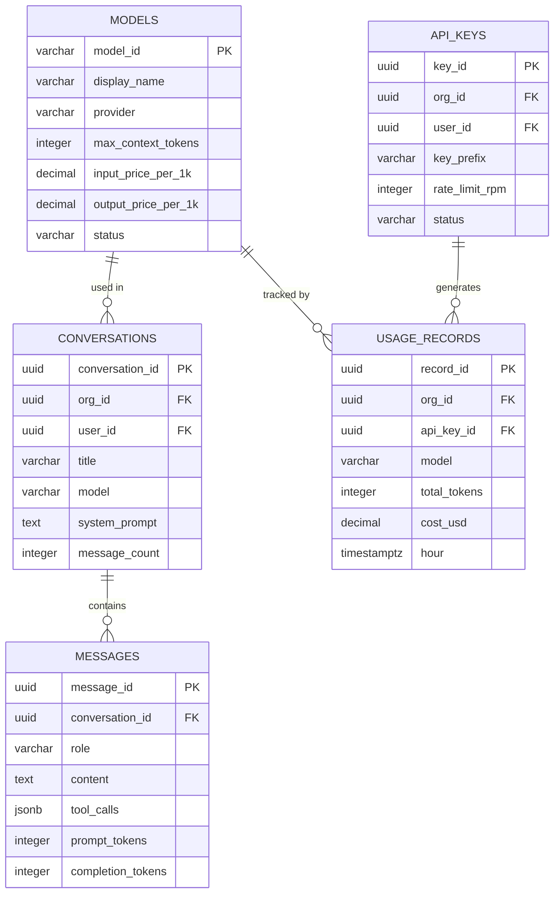
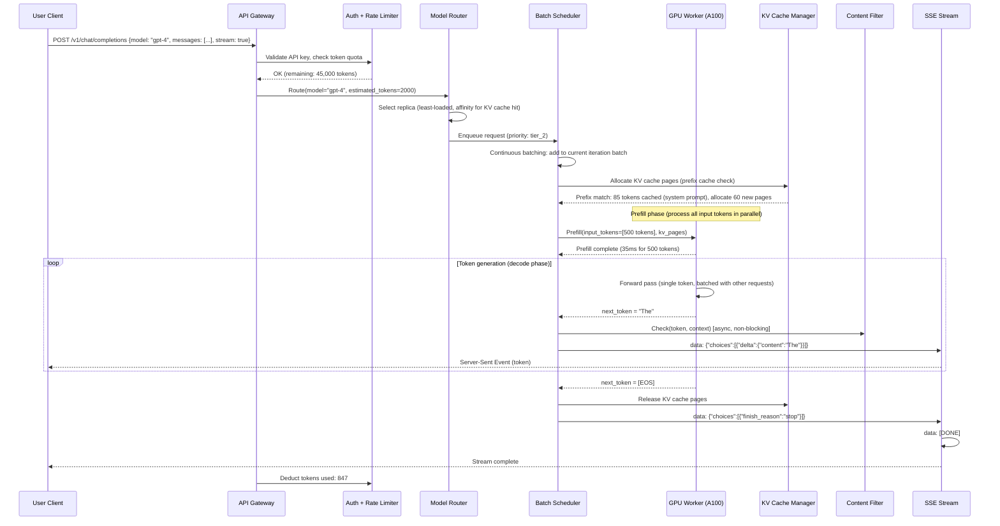
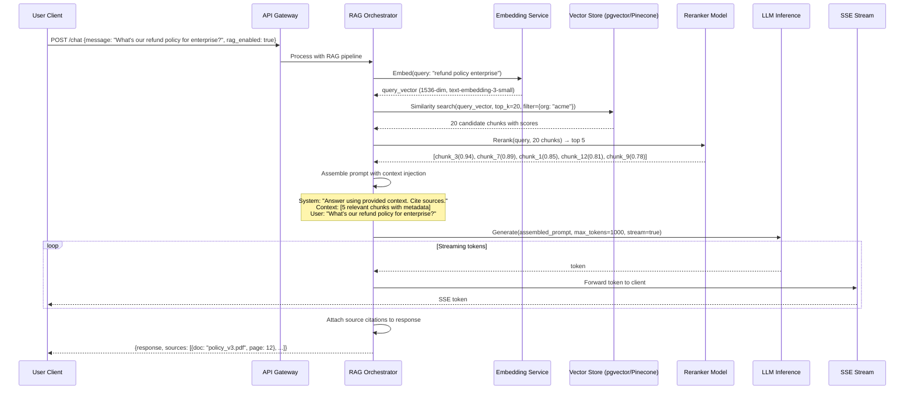
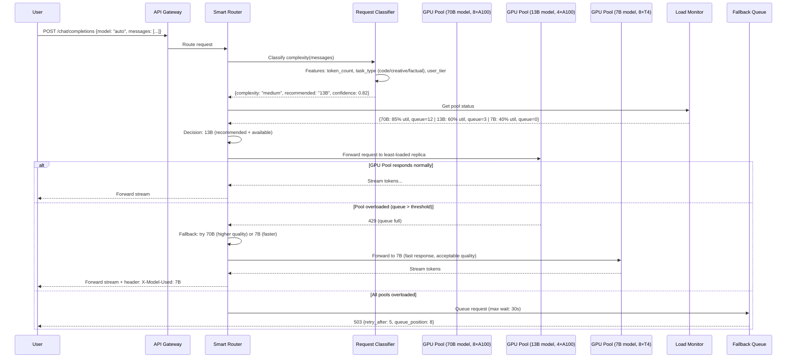

# LLM Inference Platform (ChatGPT-style Assistant) System Design

## 1. Functional Requirements

### Core Features
- **Conversation Management**: Multi-turn chat with context window management
- **Model Serving**: Efficient GPU cluster for large language model inference
- **Streaming Response**: Token-by-token streaming via SSE/WebSocket
- **Prompt Engineering**: System prompts, RAG context injection, few-shot examples
- **Rate Limiting & Abuse Prevention**: Per-user/org quotas, content filtering
- **Fine-Tuned Model Routing**: Route to specialized models per task
- **Function Calling / Tool Use**: Model invokes external tools/APIs
- **Content Safety Filtering**: Input/output moderation
- **Cost Tracking**: Per-token billing, usage analytics

### Out of Scope
- Model training / fine-tuning pipeline
- Data labeling and RLHF
- Mobile app client implementation

## 2. Non-Functional Requirements

| Requirement | Target |
|-------------|--------|
| Time to First Token (TTFT) | <500ms (p50), <2s (p99) |
| Token Generation Rate | 50-100 tokens/sec per stream |
| Availability | 99.9% (degraded mode with smaller models: 99.99%) |
| Concurrent Conversations | 10M active |
| Throughput | 100K requests/sec |
| Context Window | Up to 128K tokens |
| GPU Utilization | >80% average |
| Content Safety | <0.01% harmful content pass-through |
| Cost Efficiency | <$0.01 per 1K output tokens |

## 3. Capacity Estimation

### Traffic
- 100K requests/sec peak (50K avg)
- Average request: 500 input tokens, 300 output tokens
- Token throughput: 100K × 800 = 80M tokens/sec
- Streaming connections: 100K concurrent WebSocket/SSE
- Function calling: 20% of requests invoke tools (adds 200ms latency)

### Compute (GPU)
- Model: 70B parameter (requires ~140GB in FP16, ~35GB in INT4)
- Single A100 (80GB): can serve INT4 model with KV cache room
- Tokens/sec per GPU: ~100 output tokens/sec (batch of 32)
- GPUs needed: 80M tokens/sec ÷ 100 tokens/GPU/sec = 800K GPUs?
  - With batching (32 concurrent): 800K / 32 = 25,000 GPUs
  - With INT4 quantization + optimizations: ~5,000 A100s
  - Tensor parallelism (4-way): ~1,250 nodes of 4×A100

### Storage
- Conversation history: 10M active × 10 turns × 2KB = 200GB (hot, Redis)
- Full history: 1B conversations × 20KB = 20TB (PostgreSQL)
- Model weights: 70B × 4 models × 35GB (INT4) = 560GB per node
- KV cache per request: 128K context × 2 bytes × 64 layers × 128 heads = ~2GB max
- Vector store (RAG): 100M documents × 1.5KB embedding = 150GB

### Bandwidth
- Inbound (prompts): 100K/sec × 2KB = 200MB/s
- Outbound (streaming tokens): 100K × 300 tokens × 4 bytes/token = 120MB/s
- GPU ↔ GPU (tensor parallel): 100GB/s NVLink per pair
- Model loading: 35GB per deploy (infrequent)

## 4. Data Modeling

### Entity-Relationship Diagram



```sql
-- Users / API keys
CREATE TABLE api_keys (
    key_id          UUID PRIMARY KEY DEFAULT gen_random_uuid(),
    key_hash        VARCHAR(64) UNIQUE NOT NULL, -- SHA-256 of actual key
    key_prefix      VARCHAR(10) NOT NULL, -- first 8 chars for identification
    org_id          UUID NOT NULL,
    user_id         UUID,
    name            VARCHAR(255),
    -- Permissions
    allowed_models  TEXT[], -- NULL = all
    rate_limit_rpm  INTEGER DEFAULT 60,
    rate_limit_tpm  INTEGER DEFAULT 100000, -- tokens per minute
    -- Usage
    total_tokens_used BIGINT DEFAULT 0,
    total_requests  BIGINT DEFAULT 0,
    -- Status
    status          VARCHAR(20) DEFAULT 'active',
    expires_at      TIMESTAMPTZ,
    created_at      TIMESTAMPTZ DEFAULT NOW(),
    last_used_at    TIMESTAMPTZ
);

-- Conversations
CREATE TABLE conversations (
    conversation_id UUID PRIMARY KEY DEFAULT gen_random_uuid(),
    org_id          UUID NOT NULL,
    user_id         UUID,
    title           VARCHAR(500),
    model           VARCHAR(100) NOT NULL,
    -- Configuration
    system_prompt   TEXT,
    temperature     FLOAT DEFAULT 0.7,
    max_tokens      INTEGER DEFAULT 4096,
    top_p           FLOAT DEFAULT 1.0,
    -- Context
    total_tokens    INTEGER DEFAULT 0,
    message_count   INTEGER DEFAULT 0,
    -- Tools
    tools_enabled   JSONB, -- list of available tools/functions
    -- Metadata
    created_at      TIMESTAMPTZ DEFAULT NOW(),
    updated_at      TIMESTAMPTZ DEFAULT NOW(),
    last_message_at TIMESTAMPTZ,
    is_archived     BOOLEAN DEFAULT FALSE
);

CREATE INDEX idx_conversations_user ON conversations(user_id, updated_at DESC);
CREATE INDEX idx_conversations_org ON conversations(org_id, created_at DESC);

-- Messages within conversations
CREATE TABLE messages (
    message_id      UUID PRIMARY KEY DEFAULT gen_random_uuid(),
    conversation_id UUID NOT NULL,
    -- Content
    role            VARCHAR(20) NOT NULL, -- system, user, assistant, tool
    content         TEXT, -- NULL for tool_calls messages
    -- Function/tool calling
    tool_calls      JSONB, -- [{id, type, function: {name, arguments}}]
    tool_call_id    VARCHAR(100), -- for tool response messages
    -- Token counts
    prompt_tokens   INTEGER,
    completion_tokens INTEGER,
    -- Metadata
    model           VARCHAR(100),
    finish_reason   VARCHAR(20), -- stop, length, tool_calls, content_filter
    latency_ms      INTEGER,
    -- Safety
    moderation_result JSONB, -- {flagged: bool, categories: {...}}
    -- Timestamps
    created_at      TIMESTAMPTZ DEFAULT NOW(),
    CONSTRAINT fk_conversation FOREIGN KEY (conversation_id) REFERENCES conversations(conversation_id)
);

CREATE INDEX idx_messages_conversation ON messages(conversation_id, created_at);

-- Usage tracking (per-hour aggregation)
CREATE TABLE usage_records (
    record_id       UUID PRIMARY KEY DEFAULT gen_random_uuid(),
    org_id          UUID NOT NULL,
    user_id         UUID,
    api_key_id      UUID,
    model           VARCHAR(100) NOT NULL,
    -- Tokens
    prompt_tokens   INTEGER NOT NULL,
    completion_tokens INTEGER NOT NULL,
    total_tokens    INTEGER NOT NULL,
    -- Cost
    cost_usd        DECIMAL(10,6) NOT NULL,
    -- Context
    request_type    VARCHAR(50), -- chat, completion, embedding, moderation
    hour            TIMESTAMPTZ NOT NULL, -- truncated to hour
    request_count   INTEGER DEFAULT 1,
    -- Aggregation
    created_at      TIMESTAMPTZ DEFAULT NOW()
);

CREATE INDEX idx_usage_org_time ON usage_records(org_id, hour DESC);
CREATE INDEX idx_usage_model ON usage_records(model, hour DESC);

-- Model registry
CREATE TABLE models (
    model_id        VARCHAR(100) PRIMARY KEY,
    display_name    VARCHAR(255) NOT NULL,
    provider        VARCHAR(50) NOT NULL, -- internal, openai, anthropic
    version         VARCHAR(50),
    -- Capabilities
    max_context_tokens INTEGER NOT NULL,
    max_output_tokens INTEGER NOT NULL,
    supports_vision BOOLEAN DEFAULT FALSE,
    supports_tools  BOOLEAN DEFAULT FALSE,
    supports_streaming BOOLEAN DEFAULT TRUE,
    -- Pricing
    input_price_per_1k  DECIMAL(8,6) NOT NULL,
    output_price_per_1k DECIMAL(8,6) NOT NULL,
    -- Deployment
    min_replicas    INTEGER DEFAULT 1,
    max_replicas    INTEGER DEFAULT 100,
    gpu_type        VARCHAR(50), -- a100, h100
    gpus_per_replica INTEGER,
    tensor_parallel_degree INTEGER DEFAULT 1,
    -- Status
    status          VARCHAR(20) DEFAULT 'active',
    deprecated_at   TIMESTAMPTZ,
    created_at      TIMESTAMPTZ DEFAULT NOW()
);

-- RAG document store
CREATE TABLE rag_documents (
    document_id     UUID PRIMARY KEY DEFAULT gen_random_uuid(),
    org_id          UUID NOT NULL,
    collection_id   UUID NOT NULL,
    -- Content
    content         TEXT NOT NULL,
    content_hash    VARCHAR(64) NOT NULL,
    chunk_index     INTEGER DEFAULT 0,
    -- Embedding
    embedding       vector(1536), -- pgvector extension
    -- Metadata
    source_url      VARCHAR(2000),
    title           VARCHAR(500),
    metadata        JSONB,
    token_count     INTEGER,
    created_at      TIMESTAMPTZ DEFAULT NOW()
);

CREATE INDEX idx_rag_embedding ON rag_documents USING ivfflat (embedding vector_cosine_ops) WITH (lists = 1000);
CREATE INDEX idx_rag_collection ON rag_documents(collection_id, created_at);
```

### Redis Schemas

```redis
# Rate limiting (sliding window)
ZADD ratelimit:rpm:{api_key_id} {timestamp} {request_id}
ZADD ratelimit:tpm:{api_key_id} {timestamp} {token_count_request_id}

# Conversation context cache (avoid DB reads for active conversations)
HSET conv:context:{conversation_id} messages {json_messages} total_tokens {count} model {model}
EXPIRE conv:context:{conversation_id} 3600

# Active streaming connections
HSET stream:active:{request_id} user_id {uid} started_at {ts} tokens_generated {count}

# Model routing (load info)
HSET model:load:{model_id}:{replica_id} active_requests {count} gpu_util {pct} queue_depth {count}

# KV cache state per GPU node
HSET kv_cache:{node_id} used_blocks {count} total_blocks {count} active_sequences {count}

# Content filter cache (avoid re-checking same prompts)
SET safety:cache:{content_hash} {result_json} EX 300
```

### Kafka Topics

```yaml
topics:
  inference.requests:
    partitions: 256
    replication: 3
    retention: 24h
    key: org_id
  inference.completions:
    partitions: 128
    replication: 3
    retention: 7d
    key: conversation_id
  inference.usage:
    partitions: 64
    replication: 3
    retention: 90d
    key: org_id
  inference.moderation:
    partitions: 32
    replication: 3
    retention: 30d
    key: request_id
  inference.tool_calls:
    partitions: 64
    replication: 3
    retention: 7d
    key: conversation_id
```

## 5. High-Level Design (HLD)

```
┌─────────────────────────────────────────────────────────────────────────────────────────┐
│                              CLIENT LAYER                                                │
│  ┌──────────────┐  ┌──────────────┐  ┌──────────────┐  ┌──────────────────────────┐   │
│  │  Chat UI     │  │  API Client  │  │  Mobile App  │  │  SDK (Python/Node/etc)   │   │
│  │  (React)     │  │  (REST/SSE)  │  │              │  │                          │   │
│  └──────┬───────┘  └──────┬───────┘  └──────┬───────┘  └──────────┬───────────────┘   │
└─────────┼──────────────────┼─────────────────┼──────────────────────┼───────────────────┘
          │                  │                  │                      │
          ▼                  ▼                  ▼                      ▼
┌─────────────────────────────────────────────────────────────────────────────────────────┐
│                         API GATEWAY                                                      │
│  ┌─────────────────────────────────────────────────────────────────────────────────┐    │
│  │  Auth (API Key) │ Rate Limit │ Request Validation │ Model Routing │ SSE/WS     │    │
│  └─────────────────────────────────────────────────────────────────────────────────┘    │
└─────────────────────────────────────────────────────────────────────────────────────────┘
          │                                                │
          ▼                                                ▼
┌──────────────────────────┐                    ┌──────────────────────────────────┐
│  Content Safety Filter   │                    │  Conversation Manager            │
│  (Input Moderation)      │                    │                                  │
│                          │                    │  - Context assembly              │
│  - Toxicity detection    │                    │  - History retrieval             │
│  - PII detection         │                    │  - Token counting               │
│  - Injection prevention  │                    │  - Context window management     │
│  - Jailbreak detection   │                    │  - Tool/function registration    │
└───────────┬──────────────┘                    └────────────────┬─────────────────┘
            │                                                    │
            ▼                                                    ▼
┌─────────────────────────────────────────────────────────────────────────────────────────┐
│                         INFERENCE ORCHESTRATOR                                           │
│                                                                                         │
│  ┌─────────────────────────────────────────────────────────────────────────────────┐    │
│  │  1. Assemble prompt (system + history + RAG context + user message)             │    │
│  │  2. Select model replica (load-aware routing)                                   │    │
│  │  3. Submit to inference queue                                                   │    │
│  │  4. Stream tokens back to client                                                │    │
│  │  5. Handle tool calls (pause → execute tool → resume generation)                │    │
│  │  6. Output safety filter                                                        │    │
│  │  7. Log usage + cost                                                            │    │
│  └─────────────────────────────────────────────────────────────────────────────────┘    │
└─────────────────────────────────────────────────────────────────────────────────────────┘
          │                    │                               │
          ▼                    ▼                               ▼
┌──────────────────┐ ┌──────────────────────────┐  ┌──────────────────────────────────┐
│  RAG Pipeline    │ │  Tool Execution Engine   │  │  GPU Inference Cluster            │
│                  │ │                          │  │                                  │
│  - Query embed   │ │  - Function registry     │  │  ┌────────────────────────────┐  │
│  - Vector search │ │  - Sandboxed execution   │  │  │  Model Serving (vLLM)      │  │
│  - Context rank  │ │  - Result formatting     │  │  │                            │  │
│  - Inject to     │ │  - Timeout + retry       │  │  │  - Continuous batching     │  │
│    prompt        │ │  - Auth per tool         │  │  │  - PagedAttention          │  │
│                  │ │                          │  │  │  - KV cache management     │  │
│  ┌────────────┐  │ │  Tools:                  │  │  │  - Tensor parallelism      │  │
│  │  Vector DB │  │ │  - Web search            │  │  │  - Speculative decoding    │  │
│  │  (Pinecone/│  │ │  - Code interpreter      │  │  │                            │  │
│  │   Qdrant)  │  │ │  - API calls             │  │  │  Models:                   │  │
│  └────────────┘  │ │  - Database query         │  │  │  - GPT-4 class (70B)      │  │
│                  │ │  - File operations        │  │  │  - GPT-3.5 class (7B)     │  │
└──────────────────┘ └──────────────────────────┘  │  │  - Code specialist         │  │
                                                   │  │  - Embedding model          │  │
                                                   │  └────────────────────────────┘  │
                                                   │                                  │
                                                   │  ┌────────────────────────────┐  │
                                                   │  │  Node 1: 4×A100 (70B INT4) │  │
                                                   │  │  Node 2: 4×A100 (70B INT4) │  │
                                                   │  │  Node 3: 1×A100 (7B FP16)  │  │
                                                   │  │  ...                        │  │
                                                   │  │  Node N: 4×H100 (70B FP8)  │  │
                                                   │  └────────────────────────────┘  │
                                                   └──────────────────────────────────┘
```

## 6. Low-Level Design (LLD) - APIs

### Chat Completion API (Streaming)

```http
POST /api/v1/chat/completions
Content-Type: application/json
Authorization: Bearer sk-abc123...
X-Request-ID: req_xyz789

{
  "model": "gpt-4-turbo",
  "messages": [
    {"role": "system", "content": "You are a helpful coding assistant."},
    {"role": "user", "content": "Write a Python function to find the longest palindromic substring."}
  ],
  "temperature": 0.3,
  "max_tokens": 2048,
  "stream": true,
  "tools": [
    {
      "type": "function",
      "function": {
        "name": "run_code",
        "description": "Execute Python code and return the output",
        "parameters": {
          "type": "object",
          "properties": {
            "code": {"type": "string", "description": "Python code to execute"}
          },
          "required": ["code"]
        }
      }
    }
  ],
  "tool_choice": "auto"
}
```

**Streaming Response (SSE):**
```
data: {"id":"chatcmpl-123","object":"chat.completion.chunk","created":1710756000,"model":"gpt-4-turbo","choices":[{"index":0,"delta":{"role":"assistant","content":""},"finish_reason":null}]}

data: {"id":"chatcmpl-123","object":"chat.completion.chunk","created":1710756000,"model":"gpt-4-turbo","choices":[{"index":0,"delta":{"content":"Here"},"finish_reason":null}]}

data: {"id":"chatcmpl-123","object":"chat.completion.chunk","created":1710756000,"model":"gpt-4-turbo","choices":[{"index":0,"delta":{"content":"'s"},"finish_reason":null}]}

data: {"id":"chatcmpl-123","object":"chat.completion.chunk","created":1710756000,"model":"gpt-4-turbo","choices":[{"index":0,"delta":{"content":" a"},"finish_reason":null}]}

... (token by token)

data: {"id":"chatcmpl-123","object":"chat.completion.chunk","created":1710756000,"model":"gpt-4-turbo","choices":[{"index":0,"delta":{},"finish_reason":"stop"}],"usage":{"prompt_tokens":45,"completion_tokens":312,"total_tokens":357}}

data: [DONE]
```

### Tool Call Flow

```json
// 1. Model decides to call a tool
{
  "id": "chatcmpl-123",
  "choices": [{
    "message": {
      "role": "assistant",
      "content": null,
      "tool_calls": [{
        "id": "call_abc123",
        "type": "function",
        "function": {
          "name": "run_code",
          "arguments": "{\"code\": \"def longest_palindrome(s):\\n    ...\"}"
        }
      }]
    },
    "finish_reason": "tool_calls"
  }]
}

// 2. Client executes tool and sends result back
{
  "model": "gpt-4-turbo",
  "messages": [
    // ... previous messages ...
    {"role": "assistant", "content": null, "tool_calls": [{"id": "call_abc123", ...}]},
    {"role": "tool", "tool_call_id": "call_abc123", "content": "Function executed successfully. Output: 'racecar'"}
  ]
}

// 3. Model generates final response using tool output
```

### RAG-Augmented Request

```http
POST /api/v1/chat/completions
Content-Type: application/json

{
  "model": "gpt-4-turbo",
  "messages": [
    {"role": "user", "content": "What is our refund policy for enterprise customers?"}
  ],
  "rag": {
    "collection_id": "col_company_docs",
    "top_k": 5,
    "min_relevance": 0.75,
    "include_citations": true
  }
}
```

## 7. Deep Dives

### Deep Dive 1: Inference Optimization

#### KV Cache Management

```python
class KVCacheManager:
    """
    Manages Key-Value cache for transformer attention layers.
    
    Problem: Each token in context requires KV state per layer per head.
    For 128K context, 64 layers, 128 heads, FP16 = 128K × 64 × 128 × 2 × 2 = 4GB per sequence!
    
    Solution: PagedAttention (from vLLM)
    - Divide KV cache into fixed-size pages (blocks)
    - Map logical KV positions to physical blocks non-contiguously
    - Share blocks across sequences with same prefix (e.g., system prompt)
    - Evict completed sequences immediately, reclaim blocks
    """
    
    BLOCK_SIZE = 16  # tokens per block
    
    def __init__(self, total_gpu_memory_gb: float, model_config: dict):
        self.num_layers = model_config['num_layers']
        self.num_heads = model_config['num_kv_heads']
        self.head_dim = model_config['head_dim']
        self.dtype_size = 2  # FP16 = 2 bytes
        
        # Calculate block size in bytes
        # Each block: BLOCK_SIZE tokens × num_layers × num_heads × head_dim × 2 (K+V) × dtype
        self.block_bytes = (self.BLOCK_SIZE * self.num_layers * self.num_heads * 
                           self.head_dim * 2 * self.dtype_size)
        
        # Reserve 30% of GPU memory for KV cache
        cache_memory = total_gpu_memory_gb * 0.3 * 1024**3
        self.total_blocks = int(cache_memory / self.block_bytes)
        
        self.free_blocks = list(range(self.total_blocks))
        self.block_tables = {}  # sequence_id → [block_id, ...]
        self.ref_counts = {}   # block_id → reference count (for prefix sharing)
    
    def allocate_blocks(self, sequence_id: str, num_tokens: int) -> bool:
        """Allocate blocks for a new/growing sequence."""
        blocks_needed = (num_tokens + self.BLOCK_SIZE - 1) // self.BLOCK_SIZE
        current_blocks = len(self.block_tables.get(sequence_id, []))
        new_blocks_needed = blocks_needed - current_blocks
        
        if new_blocks_needed > len(self.free_blocks):
            return False  # OOM - need to preempt
        
        if sequence_id not in self.block_tables:
            self.block_tables[sequence_id] = []
        
        for _ in range(new_blocks_needed):
            block_id = self.free_blocks.pop()
            self.block_tables[sequence_id].append(block_id)
            self.ref_counts[block_id] = 1
        
        return True
    
    def free_sequence(self, sequence_id: str):
        """Free all blocks for a completed sequence."""
        blocks = self.block_tables.pop(sequence_id, [])
        for block_id in blocks:
            self.ref_counts[block_id] -= 1
            if self.ref_counts[block_id] == 0:
                self.free_blocks.append(block_id)
                del self.ref_counts[block_id]
    
    def share_prefix(self, source_seq: str, target_seq: str, prefix_tokens: int):
        """Share KV cache blocks for common prefix (e.g., system prompt)."""
        prefix_blocks = prefix_tokens // self.BLOCK_SIZE
        source_blocks = self.block_tables[source_seq][:prefix_blocks]
        
        self.block_tables[target_seq] = source_blocks.copy()
        for block_id in source_blocks:
            self.ref_counts[block_id] += 1


class ContinuousBatcher:
    """
    Continuous batching (iteration-level scheduling) for GPU utilization.
    
    Traditional batching: Wait for all sequences in batch to complete → GPU idle.
    Continuous batching: As sequences complete, immediately start new ones.
    
    This achieves >80% GPU utilization vs ~30% with naive batching.
    """
    
    MAX_BATCH_SIZE = 256  # max sequences in a batch
    MAX_TOKENS_PER_STEP = 8192  # budget per forward pass
    
    def __init__(self, kv_cache: KVCacheManager):
        self.kv_cache = kv_cache
        self.running_queue = []  # sequences currently being generated
        self.waiting_queue = []  # sequences waiting to be scheduled
    
    async def schedule_step(self) -> dict:
        """
        Schedule one forward pass of the model.
        Returns batch of tokens to process.
        """
        batch = {'prefill': [], 'decode': []}
        token_budget = self.MAX_TOKENS_PER_STEP
        
        # First: schedule decode steps for running sequences (1 token each)
        for seq in self.running_queue[:]:
            if token_budget <= 0:
                break
            batch['decode'].append(seq)
            token_budget -= 1
        
        # Then: schedule prefill for waiting sequences (uses remaining budget)
        while self.waiting_queue and token_budget > 0:
            seq = self.waiting_queue[0]
            prefill_tokens = len(seq['prompt_tokens'])
            
            if prefill_tokens > token_budget:
                break  # Can't fit this prefill
            
            # Allocate KV cache
            if not self.kv_cache.allocate_blocks(seq['id'], prefill_tokens):
                break  # No memory available
            
            self.waiting_queue.pop(0)
            batch['prefill'].append(seq)
            token_budget -= prefill_tokens
            self.running_queue.append(seq)
        
        return batch
    
    async def process_completions(self, outputs: list):
        """Handle completed sequences."""
        for output in outputs:
            if output['finished']:
                seq_id = output['sequence_id']
                self.running_queue = [s for s in self.running_queue if s['id'] != seq_id]
                self.kv_cache.free_sequence(seq_id)
                # Stream final token + DONE to client
                await output['stream'].send_done(output['usage'])
            else:
                # Stream token to client
                await output['stream'].send_token(output['token'])
```

#### Speculative Decoding

```python
class SpeculativeDecoder:
    """
    Speculative decoding: use a small draft model to generate candidate tokens,
    then verify with the large model in a single forward pass.
    
    Speedup: If draft model has 80% accuracy, we process ~4 tokens per large model step
    instead of 1, giving ~3-4x speedup for generation.
    """
    
    SPECULATION_LENGTH = 5  # Draft model generates 5 candidate tokens
    
    async def generate_with_speculation(self, prompt_tokens: list, 
                                         large_model, draft_model) -> list:
        output_tokens = []
        
        while True:
            # Step 1: Draft model generates K candidate tokens (fast, small model)
            draft_tokens = await draft_model.generate(
                prompt_tokens + output_tokens, 
                max_new_tokens=self.SPECULATION_LENGTH
            )
            
            # Step 2: Large model verifies all candidates in ONE forward pass
            # (processes K+1 positions simultaneously)
            verification_input = prompt_tokens + output_tokens + draft_tokens
            large_probs = await large_model.forward(verification_input)
            
            # Step 3: Accept/reject each draft token
            accepted = 0
            for i, draft_token in enumerate(draft_tokens):
                pos = len(prompt_tokens) + len(output_tokens) + i
                
                # Accept if large model agrees (or with probability ratio)
                large_prob = large_probs[pos][draft_token]
                draft_prob = draft_model.last_probs[i][draft_token]
                
                if random.random() < min(1, large_prob / draft_prob):
                    output_tokens.append(draft_token)
                    accepted += 1
                else:
                    # Reject: sample from adjusted distribution
                    adjusted = self._adjust_distribution(large_probs[pos], draft_model.last_probs[i])
                    output_tokens.append(self._sample(adjusted))
                    break  # Stop accepting after first rejection
            
            # If all accepted, also sample one more from large model's next position
            if accepted == len(draft_tokens):
                next_pos = len(prompt_tokens) + len(output_tokens)
                output_tokens.append(self._sample(large_probs[next_pos]))
            
            # Check termination
            if output_tokens[-1] == EOS_TOKEN:
                break
        
        return output_tokens
```

### Deep Dive 2: RAG Pipeline

```python
from typing import List, Optional
from dataclasses import dataclass
import numpy as np

@dataclass
class RAGResult:
    chunks: List[dict]
    augmented_prompt: str
    citations: List[dict]
    total_context_tokens: int

class RAGPipeline:
    """
    Retrieval-Augmented Generation pipeline:
    1. User query → embedding model → query vector
    2. Vector search → top-K relevant chunks
    3. Relevance filtering + reranking
    4. Context assembly (fit within token budget)
    5. Augmented prompt construction with citations
    """
    
    MAX_CONTEXT_TOKENS = 4096  # Budget for RAG context in prompt
    
    def __init__(self, embedding_model, vector_store, reranker):
        self.embedder = embedding_model
        self.vector_store = vector_store
        self.reranker = reranker
    
    async def retrieve_and_augment(self, query: str, collection_id: str,
                                    top_k: int = 10, min_relevance: float = 0.7,
                                    include_citations: bool = True) -> RAGResult:
        """Full RAG pipeline: query → context → augmented prompt."""
        
        # Step 1: Embed the query
        query_embedding = await self.embedder.embed(query)
        
        # Step 2: Vector similarity search
        candidates = await self.vector_store.search(
            collection_id=collection_id,
            query_vector=query_embedding,
            top_k=top_k * 3,  # Over-fetch for reranking
            min_score=min_relevance * 0.8  # Loose threshold pre-rerank
        )
        
        # Step 3: Rerank with cross-encoder (more accurate than embedding similarity)
        reranked = await self.reranker.rerank(
            query=query,
            documents=[c['content'] for c in candidates],
            top_k=top_k
        )
        
        # Step 4: Filter by relevance threshold
        filtered = [r for r in reranked if r['score'] >= min_relevance]
        
        # Step 5: Fit within token budget
        selected_chunks = []
        total_tokens = 0
        
        for chunk in filtered:
            chunk_tokens = self._count_tokens(chunk['content'])
            if total_tokens + chunk_tokens > self.MAX_CONTEXT_TOKENS:
                break
            selected_chunks.append(chunk)
            total_tokens += chunk_tokens
        
        # Step 6: Assemble augmented prompt
        context_section = self._format_context(selected_chunks, include_citations)
        
        augmented_prompt = f"""Use the following context to answer the user's question. 
If the answer is not found in the context, say so clearly.

<context>
{context_section}
</context>

User question: {query}"""
        
        citations = []
        if include_citations:
            citations = [
                {
                    'chunk_id': c['id'],
                    'source': c.get('source_url', ''),
                    'title': c.get('title', ''),
                    'relevance_score': c['score']
                }
                for c in selected_chunks
            ]
        
        return RAGResult(
            chunks=selected_chunks,
            augmented_prompt=augmented_prompt,
            citations=citations,
            total_context_tokens=total_tokens
        )
    
    def _format_context(self, chunks: list, with_citations: bool) -> str:
        """Format retrieved chunks into context string."""
        parts = []
        for i, chunk in enumerate(chunks):
            if with_citations:
                parts.append(f"[Source {i+1}: {chunk.get('title', 'Unknown')}]\n{chunk['content']}")
            else:
                parts.append(chunk['content'])
        return "\n\n---\n\n".join(parts)


class ChunkingStrategy:
    """
    Document chunking strategies for RAG ingestion.
    
    Strategies:
    1. Fixed-size: Split every N tokens (simple but breaks context)
    2. Semantic: Split at paragraph/section boundaries
    3. Recursive: Split hierarchically (doc → section → paragraph → sentence)
    4. Sliding window: Overlapping chunks for continuity
    """
    
    def recursive_chunk(self, text: str, max_tokens: int = 512, 
                        overlap_tokens: int = 50) -> List[str]:
        """
        Recursive chunking with overlap.
        Splits at natural boundaries: sections > paragraphs > sentences > words.
        """
        separators = ["\n## ", "\n### ", "\n\n", "\n", ". ", " "]
        
        chunks = self._split_recursive(text, separators, max_tokens)
        
        # Add overlap between chunks
        overlapped = []
        for i, chunk in enumerate(chunks):
            if i > 0:
                # Prepend last N tokens of previous chunk
                prev_overlap = self._get_last_n_tokens(chunks[i-1], overlap_tokens)
                chunk = prev_overlap + chunk
            overlapped.append(chunk)
        
        return overlapped
```

### Deep Dive 3: Scaling and Routing

```python
class ModelRouter:
    """
    Routes requests to optimal model replicas based on:
    - Current load (active requests, GPU utilization)
    - Queue depth
    - Request characteristics (context length, expected output)
    - Model capabilities (vision, tools, etc.)
    - Cost optimization (use smaller models when appropriate)
    """
    
    async def route_request(self, request: dict) -> str:
        """Select optimal replica for this request. Returns replica_id."""
        model_id = request['model']
        
        # Get all healthy replicas for this model
        replicas = await self._get_healthy_replicas(model_id)
        
        if not replicas:
            # Fallback: try smaller model
            fallback = self._get_fallback_model(model_id)
            if fallback:
                replicas = await self._get_healthy_replicas(fallback)
            if not replicas:
                raise ServiceUnavailableError("No available replicas")
        
        # Score each replica
        scored = []
        for replica in replicas:
            score = self._score_replica(replica, request)
            scored.append((score, replica))
        
        # Select best (weighted random among top 3 for load distribution)
        scored.sort(key=lambda x: -x[0])
        top_3 = scored[:3]
        weights = [s[0] for s in top_3]
        total = sum(weights)
        weights = [w/total for w in weights]
        
        selected = random.choices(top_3, weights=weights, k=1)[0][1]
        return selected['replica_id']
    
    def _score_replica(self, replica: dict, request: dict) -> float:
        """Score replica fitness for this request."""
        score = 1.0
        
        # Penalize high load
        gpu_util = replica['gpu_utilization']
        score *= (1.0 - gpu_util * 0.8)  # 0.2 at 100% util
        
        # Penalize deep queue
        queue_depth = replica['queue_depth']
        score *= max(0.1, 1.0 - queue_depth / 100)
        
        # Prefer replicas with KV cache space for long contexts
        context_tokens = request.get('total_tokens', 0)
        if context_tokens > 32000:
            kv_free = replica['kv_cache_free_blocks']
            kv_needed = context_tokens // 16  # blocks needed
            if kv_free < kv_needed:
                score *= 0.1  # Heavily penalize if might OOM
        
        # Prefer co-located (same region) for latency
        if replica['region'] == request.get('region'):
            score *= 1.2
        
        return score


class AutoScaler:
    """
    GPU cluster autoscaler for inference workloads.
    
    Scaling signals:
    - Request queue depth
    - Average time-to-first-token (TTFT)
    - GPU utilization across fleet
    - Token generation throughput
    
    Challenges:
    - GPU instances take 3-5 minutes to start
    - Model loading takes 30-60s (35GB weights)
    - Must pre-warm models before routing traffic
    """
    
    def compute_desired_replicas(self, model_id: str, metrics: dict) -> int:
        """Compute desired replica count based on current metrics."""
        current = metrics['current_replicas']
        
        # Primary signal: queue depth
        queue_depth = metrics['avg_queue_depth']
        if queue_depth > 50:
            return min(current * 2, metrics['max_replicas'])
        
        # Secondary: TTFT
        ttft_p99 = metrics['ttft_p99_ms']
        if ttft_p99 > 2000:  # >2s TTFT
            return current + max(1, current // 4)
        
        # Scale down signal: low utilization
        avg_gpu_util = metrics['avg_gpu_utilization']
        if avg_gpu_util < 0.3 and queue_depth < 5:
            return max(metrics['min_replicas'], current - 1)
        
        return current  # No change
```

## 8. Component Optimization

### GPU Memory Layout

```
A100 80GB Memory Allocation:
┌────────────────────────────────────────┐
│  Model Weights (INT4): 35GB            │  44%
├────────────────────────────────────────┤
│  KV Cache: 24GB                        │  30%
│  (~3000 tokens × 256 sequences)        │
├────────────────────────────────────────┤
│  Activation Memory: 8GB                │  10%
├────────────────────────────────────────┤
│  Workspace/Buffers: 8GB                │  10%
├────────────────────────────────────────┤
│  OS/Driver/Reserved: 5GB               │  6%
└────────────────────────────────────────┘
```

### Quantization Strategy

```yaml
quantization:
  # Production serving (best latency/quality tradeoff)
  primary:
    method: GPTQ-INT4
    group_size: 128
    quality_loss: <1% on benchmarks
    speedup: 3.5x vs FP16
    memory_reduction: 4x
  
  # Fallback for overload (sacrifice quality for throughput)
  degraded:
    method: AWQ-INT4
    group_size: 64
    quality_loss: ~2%
    speedup: 4x
  
  # Premium tier (highest quality)
  premium:
    method: FP8 (H100 native)
    quality_loss: <0.1%
    speedup: 2x vs FP16
```

### Streaming Optimization

```python
class StreamingManager:
    """
    Efficient token streaming to clients.
    
    Optimizations:
    - Batch token events (send every 3-5 tokens for efficiency)
    - Compression for long streams
    - Connection multiplexing (one WS per client, multiple conversations)
    - Heartbeat for connection liveness
    - Graceful degradation on backpressure
    """
    
    TOKEN_BATCH_SIZE = 3  # Send every N tokens
    HEARTBEAT_INTERVAL = 30  # seconds
    
    async def stream_tokens(self, request_id: str, token_generator):
        """Stream generated tokens to client."""
        buffer = []
        
        async for token in token_generator:
            buffer.append(token)
            
            if len(buffer) >= self.TOKEN_BATCH_SIZE:
                yield self._format_sse_event(buffer)
                buffer = []
        
        # Flush remaining
        if buffer:
            yield self._format_sse_event(buffer)
        
        yield "data: [DONE]\n\n"
```

## 9. Observability

### Metrics

```yaml
metrics:
  # Latency
  - name: inference_ttft_seconds
    type: histogram
    labels: [model, quantization]
    buckets: [0.1, 0.2, 0.5, 1.0, 2.0, 5.0, 10.0]
  
  - name: inference_tps
    type: gauge  # tokens per second per stream
    labels: [model]
  
  - name: inference_total_latency_seconds
    type: histogram
    labels: [model, request_type]
  
  # Throughput
  - name: tokens_generated_total
    type: counter
    labels: [model, type] # prompt, completion
  
  - name: requests_total
    type: counter
    labels: [model, status, finish_reason]
  
  # GPU
  - name: gpu_utilization_percent
    type: gauge
    labels: [node, gpu_index, model]
  
  - name: kv_cache_utilization_percent
    type: gauge
    labels: [node, gpu_index]
  
  - name: gpu_memory_used_bytes
    type: gauge
    labels: [node, gpu_index]
  
  # Quality
  - name: content_filter_triggered_total
    type: counter
    labels: [category, direction] # input, output
  
  - name: tool_call_duration_seconds
    type: histogram
    labels: [tool_name, status]
  
  # RAG
  - name: rag_retrieval_latency_seconds
    type: histogram
    labels: [collection, top_k]
  
  - name: rag_relevance_score
    type: histogram
    labels: [collection]
  
  # Cost
  - name: inference_cost_usd
    type: counter
    labels: [model, org_id_bucket]
```

### Alerting

```yaml
alerts:
  - name: TTFTHigh
    expr: histogram_quantile(0.99, inference_ttft_seconds{model="gpt-4-turbo"}) > 5
    severity: critical
    
  - name: GPUUtilizationLow
    expr: avg(gpu_utilization_percent) < 0.4
    for: 10m
    severity: warning
    description: "Fleet under-utilized, consider scaling down"
    
  - name: KVCacheExhaustion
    expr: kv_cache_utilization_percent > 0.95
    severity: critical
    description: "KV cache nearly full, new requests will be rejected"
    
  - name: ContentFilterSpikeInput
    expr: rate(content_filter_triggered_total{direction="input"}[5m]) > 1000
    severity: warning
    description: "Possible prompt injection attack or abuse"
    
  - name: ModelReplicaUnhealthy
    expr: up{job="model_server"} == 0
    for: 1m
    severity: critical
```

## 10. Considerations

### Prompt Injection Prevention

```
Layers of defense:
1. Input sanitization: Detect and neutralize instruction override attempts
2. System prompt hardening: "Ignore all previous instructions" detection
3. Output validation: Model output classified before sending to user
4. Sandboxed tool execution: Function calls validated against schema
5. Rate limiting on suspicious patterns

Detection approach:
- Classifier trained on known injection patterns
- Canary tokens in system prompt (if model reveals them, injection detected)
- Behavioral monitoring: sudden persona change detection
```

### Context Window Management

```python
class ContextManager:
    """
    Manages conversation context within model's window limit.
    
    Strategies when context exceeds limit:
    1. Truncation: Remove oldest messages (keep system prompt)
    2. Summarization: LLM-generated summary of older messages
    3. RAG-based: Retrieve relevant past messages via embedding search
    4. Sliding window: Last N messages always included
    """
    
    def assemble_context(self, conversation: dict, max_tokens: int) -> list:
        messages = conversation['messages']
        system_prompt = messages[0] if messages[0]['role'] == 'system' else None
        
        # Always include: system prompt + last user message
        reserved_tokens = self._count_tokens(system_prompt) + self._count_tokens(messages[-1])
        budget = max_tokens - reserved_tokens - 500  # safety margin
        
        # Fill from most recent backward
        included = []
        for msg in reversed(messages[1:-1]):
            msg_tokens = self._count_tokens(msg)
            if budget >= msg_tokens:
                included.insert(0, msg)
                budget -= msg_tokens
            else:
                # Summarize remaining older messages
                summary = self._summarize_older(messages[:len(messages)-len(included)-1])
                included.insert(0, {"role": "system", "content": f"Previous conversation summary: {summary}"})
                break
        
        result = []
        if system_prompt:
            result.append(system_prompt)
        result.extend(included)
        result.append(messages[-1])
        return result
```

### Multi-Model Routing Strategy

```
Complexity-based routing:
- Simple queries (factual, short) → 7B model (fast, cheap)
- Complex reasoning → 70B model (slower, expensive)
- Code generation → Code-specialized model
- Vision/multimodal → Vision model

Routing classifier (lightweight, <5ms):
- Input: first 100 tokens of user message
- Output: complexity score [0, 1]
- Threshold: <0.3 → small model, >0.7 → large model, between → medium

Fallback chain:
large_model (timeout 30s) → medium_model (timeout 15s) → small_model (always available)
```

### Cost Optimization

```
Strategies:
1. KV cache sharing: Common system prompts shared across requests (save 30% compute)
2. Speculative decoding: 3-4x speedup for generation-heavy requests
3. Prompt caching: Repeated identical prefixes served from cache
4. Batch inference: Group multiple requests for GPU efficiency
5. Spot instances: Use preemptible GPUs for non-real-time workloads
6. Model distillation: Deploy smaller task-specific models for common queries

Cost breakdown (per 1M tokens):
- Large model (70B): $10 input, $30 output
- Medium model (13B): $2 input, $6 output  
- Small model (7B): $0.50 input, $1.50 output
- With optimization: 60% of requests route to small/medium → 70% cost reduction
```

## 11. Failure Scenarios & Recovery

| Failure | Impact | Mitigation |
|---------|--------|------------|
| GPU OOM (KV cache full) | Request rejected | Preempt lowest-priority sequence, queue for retry |
| Model replica crash | Partial capacity loss | Auto-restart, route to other replicas, autoscale |
| Streaming connection drop | User loses partial response | Client reconnect with last_token_id, resume from checkpoint |
| RAG vector store unavailable | No context augmentation | Graceful degradation: answer without RAG context, note limitation |
| Content filter false positive | Good response blocked | Appeal mechanism, log for review, adjust threshold |
| Token budget exceeded | Response truncated | Inform user, offer continuation, pre-calculate feasibility |
| Tool execution timeout | Generation blocked | Timeout after 30s, model generates response noting tool failure |
| Multi-GPU tensor parallel failure | Node offline | Redistribute shards, temporarily reduce batch size |

---

---

## 12. Sequence Diagrams

### 12.1 Chat Completion with Streaming (Token-by-Token)



### 12.2 RAG: Retrieval-Augmented Generation



### 12.3 Model Routing + Load Balancing



## 13. Algorithm Deep Dives

### 13.1 KV Cache Management

#### The Problem

Each transformer layer stores Key and Value tensors for all previous tokens. For a 70B model with 80 layers, 128 heads, 128 head_dim:
```
KV cache per token = 2 (K+V) × 80 layers × 128 heads × 128 dim × 2 bytes (FP16) = 5.2 MB/token
For 4096 context: 5.2MB × 4096 = 21.3 GB per request
With 8 concurrent requests: 170 GB — exceeds A100 80GB!
```

#### PagedAttention (vLLM)

```
Core Insight: Treat KV cache like virtual memory with paging

Traditional: Pre-allocate contiguous memory for max_seq_len per request
  - Waste: average sequence uses 40% of allocated space
  - Fragmentation: cannot serve new requests despite available total memory

PagedAttention:
  - Divide KV cache into fixed-size pages (blocks of 16 tokens each)
  - Page size: 16 tokens × 5.2MB/token ÷ layers = manageable block
  - Allocate pages on-demand as sequence grows
  - Pages can be non-contiguous in physical GPU memory
  
  Block table (per sequence):
    Sequence "Hello world how are you..." →
    Logical block 0 → Physical block 7
    Logical block 1 → Physical block 23  
    Logical block 2 → Physical block 4 (just allocated)
  
  Benefits:
    - ~95% memory utilization (vs ~55% with pre-allocation)
    - 2-4x more concurrent requests per GPU
    - Easy memory sharing for beam search / parallel sampling

Memory Management:
  - Free list: Available physical blocks
  - Ref counting: Shared blocks (prefix caching, beam search)
  - Eviction: LRU when memory pressure (preempt lowest-priority sequence)
  - Copy-on-write: For shared prefixes with diverging continuations
```

#### Prefix Caching

```
Observation: Many requests share common prefixes (system prompts, few-shot examples)

Implementation:
  1. Hash the token sequence of each block
  2. Before allocating new blocks, check if hash exists in cache
  3. If hit: reuse existing KV cache blocks (read-only, ref count++)
  4. Divergence point: copy-on-write for new tokens
  
  Example:
    System prompt (200 tokens) = blocks [0..12]
    Request A: system + user_A → reuse [0..12], allocate new for user_A
    Request B: system + user_B → reuse [0..12], allocate new for user_B
    
    Memory saved: 200 tokens × 5.2MB = 1.04 GB per shared prefix
    With 100 concurrent requests sharing system prompt: saves ~100 GB

Eviction Policy:
  - LRU across cached prefix blocks
  - Priority: longer prefixes evicted last (more expensive to recompute)
  - Automatic: managed by memory manager, transparent to inference
```

#### Speculative Decoding

```
Problem: Autoregressive decoding = 1 forward pass per token (GPU underutilized)
Idea: Small "draft" model proposes N tokens, large model verifies in parallel

Algorithm:
  1. Draft model (7B, fast): generate K=5 draft tokens autoregressively
     draft = [t1, t2, t3, t4, t5]  (5 forward passes of small model, fast)
  
  2. Target model (70B): verify all K tokens in ONE forward pass
     - Run target model on [context + t1 + t2 + t3 + t4 + t5]
     - Get target probabilities at each position
  
  3. Accept/reject (modified rejection sampling):
     For each position i:
       if target_prob(ti) >= draft_prob(ti):
         ACCEPT ti
       else:
         Accept with probability target_prob(ti) / draft_prob(ti)
         If rejected: sample correction token from adjusted distribution
         Stop here (discard remaining draft tokens)
  
  4. Result: Accept 3-4 tokens on average per verification step
     Speedup: 2-3x for well-matched draft/target pairs
     Guarantee: Output distribution identical to target model (no quality loss)

Production Considerations:
  - Draft model must be much cheaper (7B drafts for 70B target)
  - Acceptance rate depends on task (high for formulaic text, lower for creative)
  - Memory: need to hold both models (or use model's early layers as draft)
  - Tuning K: higher K = more potential speedup but higher rejection waste
```

### 13.2 Batching Strategies for GPU Inference

#### Static Batching (Naive)

```
Wait for B requests, process all together, return all together.

Problem:
  - Short requests wait for long ones (head-of-line blocking)
  - Fixed batch window adds latency
  - Memory allocated for max_seq_len × B wastes GPU RAM
  
  Example: Batch of 8 requests with lengths [50, 200, 80, 1500, 30, 90, 400, 60]
  All 8 wait until the 1500-token request finishes → terrible TTFT for short ones
```

#### Continuous Batching (Iteration-Level Scheduling)

```
Core Idea: Schedule at the granularity of individual decode steps, not entire requests

Algorithm:
  Every decode iteration (one forward pass):
    1. COMPLETE: Remove sequences that hit EOS or max_tokens
       → Free their KV cache pages immediately
    2. ADD: Pull new requests from queue (if memory available)
       → Run prefill for new requests (can be batched with decode of existing)
    3. EXECUTE: Run one decode step for all active sequences
    4. Repeat

  Iteration timeline:
    Step 1: [req_A(decode), req_B(decode), req_C(prefill_new)]
    Step 2: [req_A(decode), req_B(done→remove), req_C(decode), req_D(prefill_new)]
    Step 3: [req_A(decode), req_C(decode), req_D(decode)]
    ...
    
  Benefits:
    - No head-of-line blocking (short requests leave immediately)
    - GPU always has work (new requests fill freed slots)
    - Memory released immediately on completion
    - 10-20x throughput improvement over static batching

Implementation Details:
  - Prefill vs Decode conflict: Prefill is compute-bound, decode is memory-bound
  - Solution: Chunked prefill — process new request's prefill in chunks (e.g., 512 tokens at a time)
    interleavd with ongoing decode steps. Limits TTFT impact on existing streams.
  - Priority queue: Premium users get scheduled first, longer wait = higher priority
```

#### Iteration-Level Scheduling Decisions

```
Scheduler State Machine (per iteration):

  available_memory = total_gpu_mem - sum(active_sequence_kv_cache)
  
  PREEMPTION (if memory pressure):
    if available_memory < min_threshold:
      victim = lowest_priority_sequence (or longest-running)
      options:
        a) SWAP: Move KV cache to CPU RAM (resume later without recompute)
        b) RECOMPUTE: Discard KV cache, re-prefill when resumed (saves CPU RAM)
      Choose swap if CPU RAM available, else recompute
  
  ADMISSION CONTROL:
    new_request_estimated_memory = estimated_output_len × per_token_kv_size
    if available_memory > new_request_estimated_memory:
      ADMIT → begin prefill
    else:
      WAIT (queue) or PREEMPT lower priority
  
  FAIRNESS:
    - Max active requests per user (prevent monopolization)
    - Aging: queued requests gain priority over time
    - SLO-aware: requests approaching latency SLO get boosted priority

Throughput Optimization:
  - Optimal batch size: limited by memory bandwidth (decode) or compute (prefill)
  - A100 80GB: typically 64-256 concurrent sequences for 13B model
  - Token budget per iteration: process up to 8192 total tokens (prefill + decode combined)
```

