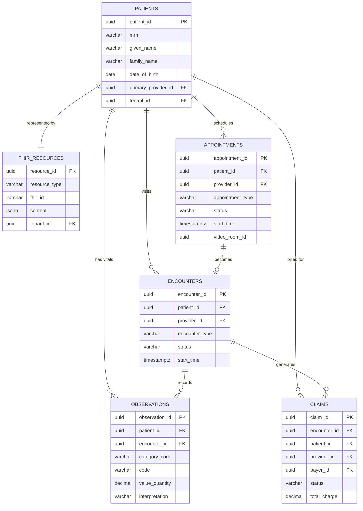
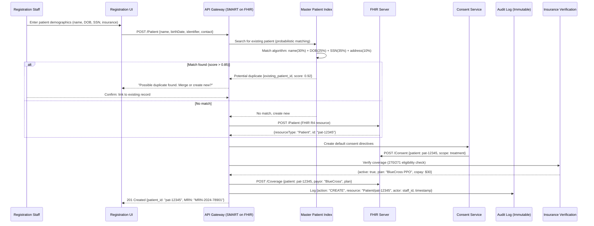
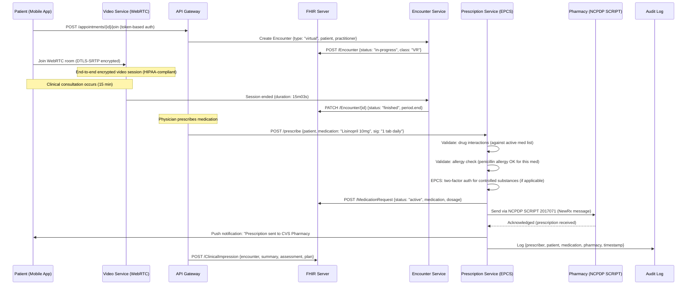
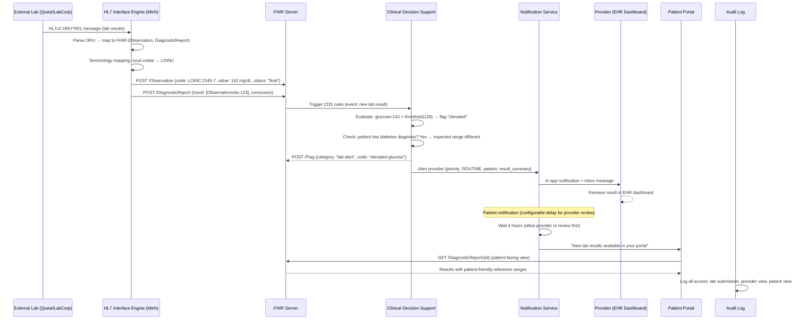

# Healthcare EHR & Telemedicine Platform

## 1. Functional Requirements

| # | Requirement | Details |
|---|-------------|---------|
| FR-1 | Patient Records (FHIR R4) | Full FHIR R4 compliant patient record management with resource graph |
| FR-2 | Clinical Documentation | Notes, assessments, care plans with structured + free-text support |
| FR-3 | Appointment Scheduling | Multi-provider scheduling with availability, waitlists, recurring visits |
| FR-4 | Telemedicine Video | WebRTC-based video consultations with waiting room, recording, screen share |
| FR-5 | E-Prescriptions | Create, validate (drug interactions), transmit to pharmacy, refill management |
| FR-6 | Lab Orders & Results | Order entry, specimen tracking, result delivery, critical value alerts |
| FR-7 | Insurance Verification & Claims | Eligibility checks, prior auth, claim submission (EDI 837), ERA processing |
| FR-8 | Clinical Decision Support | Evidence-based alerts for drug interactions, allergies, care gaps, sepsis screening |
| FR-9 | Patient Portal | Self-service: view records, message provider, schedule, pay bills, consent management |
| FR-10 | Interoperability | HL7 FHIR REST API, HL7v2 messaging, CCDA document exchange, SMART on FHIR apps |

## 2. Non-Functional Requirements

| Requirement | Target |
|-------------|--------|
| Availability | 99.999% (critical clinical systems) |
| API Response | < 200ms P95 |
| Compliance | HIPAA, HITECH, 21st Century Cures Act (information blocking) |
| Patient Scale | 100M+ patient records |
| Concurrent Users | 500K+ providers simultaneously |
| Audit | 100% PHI access logged, immutable, 7-year retention |
| Video Quality | 720p min, < 150ms end-to-end latency |
| Data Sovereignty | Regional data residency compliance |

## 3. Capacity Estimation

```
Patient Records:
  - 100M patients × avg 200 FHIR resources each = 20B resources
  - Average resource size: 2 KB → 40 TB clinical data
  - Growth: 5% new patients/year + increasing resource density

Clinical Operations:
  - 500K providers × avg 20 patients/day = 10M encounters/day
  - Each encounter generates: ~10 resources (observations, notes, orders)
  - Resource creation rate: 100M/day → 1,150/sec average, 5K/sec peak

Appointments:
  - 10M appointments/day → 115/sec average
  - Availability queries: 50M/day → 580/sec

Telemedicine:
  - 2M video visits/day (post-COVID steady state)
  - Concurrent sessions peak: 200K
  - Bandwidth: 200K × 2 Mbps (up+down) = 400 Gbps
  - Recording storage: 2M × 15 min avg × 100 MB = 200 TB/day (if all recorded)

Lab Results:
  - 50M lab results/day → 580/sec
  - Critical value alerts: 0.5% = 250K/day requiring immediate notification

Claims:
  - 10M claims/day (encounter → claim)
  - Average claim size: 5 KB → 50 GB/day

Audit Logs:
  - Every PHI access logged: 500M events/day
  - Event size: 500 bytes → 250 GB/day → 91 TB/year

Storage Total:
  - Clinical data: 40 TB (growing 10 TB/year)
  - Documents/Imaging: 500 TB
  - Audit logs: 91 TB/year (7-year retention = 637 TB)
  - Video recordings: 200 TB/day (90-day retention = 18 PB)
```

## 4. Data Modeling

### Entity-Relationship Diagram



### 4.1 FHIR Resources (Core Clinical)

```sql
-- FHIR resource store (document-oriented with relational indexes)
CREATE TABLE fhir_resources (
    resource_id         UUID PRIMARY KEY DEFAULT gen_random_uuid(),
    resource_type       VARCHAR(50) NOT NULL,  -- 'Patient', 'Encounter', 'Observation', etc.
    fhir_id             VARCHAR(64) NOT NULL,  -- FHIR logical ID
    version_id          INTEGER NOT NULL DEFAULT 1,
    content             JSONB NOT NULL,        -- Full FHIR JSON resource
    last_updated        TIMESTAMPTZ NOT NULL DEFAULT NOW(),
    is_deleted          BOOLEAN DEFAULT FALSE,
    tenant_id           UUID NOT NULL,         -- multi-tenant isolation
    UNIQUE(resource_type, fhir_id, version_id)
);

CREATE INDEX idx_fhir_type_id ON fhir_resources(resource_type, fhir_id);
CREATE INDEX idx_fhir_type_updated ON fhir_resources(resource_type, last_updated DESC);
CREATE INDEX idx_fhir_tenant ON fhir_resources(tenant_id, resource_type);

-- Searchable indexes for common FHIR search parameters
CREATE TABLE fhir_search_index (
    index_id            BIGSERIAL PRIMARY KEY,
    resource_id         UUID NOT NULL REFERENCES fhir_resources(resource_id),
    resource_type       VARCHAR(50) NOT NULL,
    param_name          VARCHAR(100) NOT NULL,  -- FHIR search param: 'patient', 'date', 'code'
    param_type          VARCHAR(20) NOT NULL,   -- 'reference', 'date', 'token', 'string', 'quantity'
    value_string        VARCHAR(500),
    value_date          TIMESTAMPTZ,
    value_date_end      TIMESTAMPTZ,
    value_reference     VARCHAR(200),          -- "Patient/uuid-123"
    value_code          VARCHAR(100),
    value_system        VARCHAR(500),          -- code system URI
    value_quantity      DECIMAL(18,6),
    value_unit          VARCHAR(50),
    tenant_id           UUID NOT NULL
);

CREATE INDEX idx_search_ref ON fhir_search_index(resource_type, param_name, value_reference, tenant_id);
CREATE INDEX idx_search_token ON fhir_search_index(resource_type, param_name, value_system, value_code, tenant_id);
CREATE INDEX idx_search_date ON fhir_search_index(resource_type, param_name, value_date, tenant_id);
CREATE INDEX idx_search_string ON fhir_search_index(resource_type, param_name, value_string, tenant_id);
CREATE INDEX idx_search_resource ON fhir_search_index(resource_id);

-- Patient master (denormalized for fast lookups)
CREATE TABLE patients (
    patient_id          UUID PRIMARY KEY,
    fhir_resource_id    UUID NOT NULL REFERENCES fhir_resources(resource_id),
    mrn                 VARCHAR(50),           -- Medical Record Number
    given_name          VARCHAR(100),
    family_name         VARCHAR(100),
    date_of_birth       DATE,
    gender              VARCHAR(20),
    ssn_hash            VARCHAR(64),           -- SHA-256 of SSN (for matching)
    phone               VARCHAR(20),
    email               VARCHAR(200),
    address_line        VARCHAR(500),
    city                VARCHAR(100),
    state               VARCHAR(50),
    zip                 VARCHAR(20),
    insurance_member_id VARCHAR(50),
    primary_provider_id UUID,
    golden_record_id    UUID,                  -- master patient index
    match_confidence    DECIMAL(5,4),
    tenant_id           UUID NOT NULL,
    created_at          TIMESTAMPTZ NOT NULL DEFAULT NOW(),
    updated_at          TIMESTAMPTZ NOT NULL DEFAULT NOW()
);

CREATE INDEX idx_patients_mrn ON patients(mrn, tenant_id);
CREATE INDEX idx_patients_name ON patients(family_name, given_name, tenant_id);
CREATE INDEX idx_patients_dob ON patients(date_of_birth, tenant_id);
CREATE INDEX idx_patients_ssn ON patients(ssn_hash) WHERE ssn_hash IS NOT NULL;
CREATE INDEX idx_patients_golden ON patients(golden_record_id);
CREATE INDEX idx_patients_provider ON patients(primary_provider_id);
```

### 4.2 Encounters & Observations

```sql
CREATE TABLE encounters (
    encounter_id        UUID PRIMARY KEY,
    patient_id          UUID NOT NULL REFERENCES patients(patient_id),
    provider_id         UUID NOT NULL,
    encounter_type      VARCHAR(50) NOT NULL,  -- 'ambulatory', 'emergency', 'inpatient', 'virtual'
    status              VARCHAR(30) NOT NULL,  -- 'planned', 'arrived', 'in-progress', 'finished', 'cancelled'
    class_code          VARCHAR(20) NOT NULL,  -- 'AMB', 'EMER', 'IMP', 'VR'
    start_time          TIMESTAMPTZ NOT NULL,
    end_time            TIMESTAMPTZ,
    location_id         UUID,
    reason_code         VARCHAR(20),           -- ICD-10 code
    reason_display      VARCHAR(500),
    chief_complaint     TEXT,
    discharge_disposition VARCHAR(50),
    tenant_id           UUID NOT NULL,
    created_at          TIMESTAMPTZ NOT NULL DEFAULT NOW()
);

CREATE INDEX idx_encounters_patient ON encounters(patient_id, start_time DESC);
CREATE INDEX idx_encounters_provider ON encounters(provider_id, start_time DESC);
CREATE INDEX idx_encounters_status ON encounters(status, encounter_type);
CREATE INDEX idx_encounters_date ON encounters(start_time DESC, tenant_id);

CREATE TABLE observations (
    observation_id      UUID PRIMARY KEY,
    patient_id          UUID NOT NULL,
    encounter_id        UUID REFERENCES encounters(encounter_id),
    provider_id         UUID,
    status              VARCHAR(20) NOT NULL,  -- 'final', 'preliminary', 'amended', 'cancelled'
    category_code       VARCHAR(50) NOT NULL,  -- 'vital-signs', 'laboratory', 'imaging', 'social-history'
    code_system         VARCHAR(200) NOT NULL, -- 'http://loinc.org'
    code                VARCHAR(20) NOT NULL,  -- LOINC code
    code_display        VARCHAR(200),
    value_type          VARCHAR(20) NOT NULL,  -- 'quantity', 'string', 'codeable_concept', 'boolean'
    value_quantity      DECIMAL(18,6),
    value_unit          VARCHAR(50),
    value_string        TEXT,
    value_code          VARCHAR(50),
    reference_range_low DECIMAL(18,6),
    reference_range_high DECIMAL(18,6),
    interpretation      VARCHAR(20),           -- 'N' (normal), 'H' (high), 'L' (low), 'A' (abnormal)
    effective_time      TIMESTAMPTZ NOT NULL,
    issued_time         TIMESTAMPTZ,
    tenant_id           UUID NOT NULL,
    created_at          TIMESTAMPTZ NOT NULL DEFAULT NOW()
);

CREATE INDEX idx_obs_patient ON observations(patient_id, effective_time DESC);
CREATE INDEX idx_obs_encounter ON observations(encounter_id);
CREATE INDEX idx_obs_code ON observations(code_system, code, patient_id);
CREATE INDEX idx_obs_category ON observations(category_code, patient_id, effective_time DESC);
CREATE INDEX idx_obs_abnormal ON observations(patient_id) WHERE interpretation IN ('H', 'L', 'A');
```

### 4.3 Appointments & Claims

```sql
CREATE TABLE appointments (
    appointment_id      UUID PRIMARY KEY DEFAULT gen_random_uuid(),
    patient_id          UUID NOT NULL,
    provider_id         UUID NOT NULL,
    location_id         UUID NOT NULL,
    appointment_type    VARCHAR(50) NOT NULL,  -- 'new_patient', 'follow_up', 'telemedicine', 'procedure'
    status              VARCHAR(30) NOT NULL,  -- 'proposed', 'booked', 'arrived', 'fulfilled', 'cancelled', 'noshow'
    start_time          TIMESTAMPTZ NOT NULL,
    end_time            TIMESTAMPTZ NOT NULL,
    duration_minutes    INTEGER NOT NULL,
    reason_code         VARCHAR(20),
    reason_text         VARCHAR(500),
    instructions        TEXT,
    video_room_id       UUID,                 -- for telemedicine
    cancellation_reason VARCHAR(200),
    waitlist_position   INTEGER,
    reminder_sent       BOOLEAN DEFAULT FALSE,
    tenant_id           UUID NOT NULL,
    created_at          TIMESTAMPTZ NOT NULL DEFAULT NOW(),
    updated_at          TIMESTAMPTZ NOT NULL DEFAULT NOW()
);

CREATE INDEX idx_appt_patient ON appointments(patient_id, start_time DESC);
CREATE INDEX idx_appt_provider ON appointments(provider_id, start_time);
CREATE INDEX idx_appt_provider_avail ON appointments(provider_id, start_time, end_time) WHERE status = 'booked';
CREATE INDEX idx_appt_location ON appointments(location_id, start_time);
CREATE INDEX idx_appt_status ON appointments(status, start_time) WHERE status IN ('booked', 'arrived');

CREATE TABLE claims (
    claim_id            UUID PRIMARY KEY DEFAULT gen_random_uuid(),
    encounter_id        UUID NOT NULL,
    patient_id          UUID NOT NULL,
    provider_id         UUID NOT NULL,
    payer_id            UUID NOT NULL,
    claim_number        VARCHAR(50) UNIQUE,
    claim_type          VARCHAR(20) NOT NULL,  -- 'professional', 'institutional', 'pharmacy'
    status              VARCHAR(30) NOT NULL DEFAULT 'draft',
    -- draft → submitted → acknowledged → adjudicated → paid | denied | appealed
    total_charge        DECIMAL(12,2) NOT NULL,
    amount_paid         DECIMAL(12,2),
    patient_responsibility DECIMAL(12,2),
    service_date        DATE NOT NULL,
    submitted_at        TIMESTAMPTZ,
    adjudicated_at      TIMESTAMPTZ,
    diagnosis_codes     JSONB NOT NULL,        -- [{"code": "J06.9", "type": "principal"}]
    procedure_codes     JSONB NOT NULL,        -- [{"code": "99213", "modifier": "25"}]
    denial_reason       VARCHAR(200),
    era_id              UUID,                  -- Electronic Remittance Advice
    tenant_id           UUID NOT NULL,
    created_at          TIMESTAMPTZ NOT NULL DEFAULT NOW()
);

CREATE INDEX idx_claims_patient ON claims(patient_id, service_date DESC);
CREATE INDEX idx_claims_encounter ON claims(encounter_id);
CREATE INDEX idx_claims_status ON claims(status, submitted_at);
CREATE INDEX idx_claims_payer ON claims(payer_id, status);
```

### 4.4 Audit Log

```sql
CREATE TABLE phi_access_audit (
    audit_id            UUID PRIMARY KEY DEFAULT gen_random_uuid(),
    timestamp           TIMESTAMPTZ NOT NULL DEFAULT NOW(),
    user_id             UUID NOT NULL,
    user_role           VARCHAR(50) NOT NULL,
    patient_id          UUID NOT NULL,
    resource_type       VARCHAR(50) NOT NULL,
    resource_id         UUID NOT NULL,
    action              VARCHAR(20) NOT NULL,  -- 'read', 'create', 'update', 'delete', 'export'
    access_reason       VARCHAR(50) NOT NULL,  -- 'treatment', 'payment', 'operations', 'break_glass', 'patient_request'
    is_break_glass      BOOLEAN DEFAULT FALSE,
    break_glass_reason  TEXT,
    source_ip           INET NOT NULL,
    user_agent          TEXT,
    session_id          UUID,
    response_code       INTEGER,
    data_elements       JSONB,                 -- which specific fields were accessed
    tenant_id           UUID NOT NULL
);

-- Partition by month for performance + retention management
-- CREATE TABLE phi_access_audit PARTITION BY RANGE (timestamp);

CREATE INDEX idx_audit_patient ON phi_access_audit(patient_id, timestamp DESC);
CREATE INDEX idx_audit_user ON phi_access_audit(user_id, timestamp DESC);
CREATE INDEX idx_audit_break_glass ON phi_access_audit(timestamp DESC) WHERE is_break_glass = TRUE;
CREATE INDEX idx_audit_resource ON phi_access_audit(resource_type, resource_id, timestamp DESC);
```

## 5. High-Level Design (HLD)

```
┌─────────────────────────────────────────────────────────────────────────────────────────┐
│                    HEALTHCARE EHR & TELEMEDICINE PLATFORM                                 │
├─────────────────────────────────────────────────────────────────────────────────────────┤
│                                                                                         │
│  ┌──────────────┐  ┌──────────────┐  ┌──────────────┐  ┌──────────────┐              │
│  │  Patient     │  │  Provider    │  │   Admin      │  │  3rd Party   │              │
│  │  Portal/App  │  │  EHR Client  │  │   Console    │  │  SMART Apps  │              │
│  └──────┬───────┘  └──────┬───────┘  └──────┬───────┘  └──────┬───────┘              │
│         │                  │                  │                  │                      │
│  ┌──────▼──────────────────▼──────────────────▼──────────────────▼─────────────────┐   │
│  │                   API GATEWAY + OAuth2/SMART on FHIR                             │   │
│  │        mTLS │ JWT Validation │ Scope Enforcement │ Audit Logging                │   │
│  └──────┬──────────┬──────────┬──────────┬──────────┬──────────┬───────────────────┘   │
│         │          │          │          │          │          │                        │
│  ┌──────▼───┐ ┌────▼────┐ ┌──▼────┐ ┌───▼───┐ ┌───▼───┐ ┌───▼──────┐               │
│  │  FHIR   │ │Clinical │ │ Appt  │ │  Lab  │ │Claims │ │  Video   │               │
│  │  Server  │ │ Doc Svc │ │  Svc  │ │  Svc  │ │  Svc  │ │  Service │               │
│  └──────┬───┘ └────┬────┘ └──┬────┘ └───┬───┘ └───┬───┘ └───┬──────┘               │
│         │          │          │          │          │          │                        │
│  ┌──────▼──────────▼──────────▼──────────▼──────────▼──────────▼───────────────────┐   │
│  │                      CLINICAL DATA PLATFORM                                      │   │
│  │  ┌───────────┐  ┌───────────┐  ┌───────────┐  ┌───────────┐  ┌─────────────┐  │   │
│  │  │PostgreSQL │  │Elastic-   │  │   Redis   │  │    S3     │  │  Kafka      │  │   │
│  │  │(FHIR     │  │search     │  │ (Session/ │  │(Documents/│  │(HL7/Events) │  │   │
│  │  │ Store)   │  │(Clinical  │  │  Cache)   │  │ Imaging)  │  │             │  │   │
│  │  │          │  │ Search)   │  │           │  │           │  │             │  │   │
│  │  └───────────┘  └───────────┘  └───────────┘  └───────────┘  └─────────────┘  │   │
│  └─────────────────────────────────────────────────────────────────────────────────┘   │
│                                                                                         │
│  ┌─────────────────────────────────────────────────────────────────────────────────┐   │
│  │                      INTEGRATION ENGINE                                          │   │
│  │  ┌──────────┐  ┌──────────┐  ┌──────────┐  ┌──────────┐  ┌──────────────────┐ │   │
│  │  │  HL7v2   │  │  FHIR    │  │  CCDA    │  │   EDI    │  │  Pharmacy/Lab   │ │   │
│  │  │Interface │  │Subscript.│  │  Export  │  │  Claims  │  │  Integrations   │ │   │
│  │  └──────────┘  └──────────┘  └──────────┘  └──────────┘  └──────────────────┘ │   │
│  └─────────────────────────────────────────────────────────────────────────────────┘   │
│                                                                                         │
│  ┌─────────────────────────────────────────────────────────────────────────────────┐   │
│  │                    TELEMEDICINE VIDEO INFRASTRUCTURE                              │   │
│  │  ┌──────────┐  ┌──────────┐  ┌──────────┐  ┌──────────┐  ┌──────────────────┐ │   │
│  │  │  WebRTC  │  │  TURN/   │  │ Signaling│  │ Recording│  │  Waiting Room   │ │   │
│  │  │  SFU     │  │  STUN    │  │  Server  │  │  Service │  │  Queue          │ │   │
│  │  └──────────┘  └──────────┘  └──────────┘  └──────────┘  └──────────────────┘ │   │
│  └─────────────────────────────────────────────────────────────────────────────────┘   │
│                                                                                         │
│  ┌─────────────────────────────────────────────────────────────────────────────────┐   │
│  │              CLINICAL DECISION SUPPORT (CDS)                                     │   │
│  │   Drug Interactions │ Allergy Alerts │ Care Gaps │ Sepsis Screening             │   │
│  └─────────────────────────────────────────────────────────────────────────────────┘   │
│                                                                                         │
│  ┌─────────────────────────────────────────────────────────────────────────────────┐   │
│  │              IMMUTABLE AUDIT LOG (HIPAA Compliance)                               │   │
│  │   All PHI Access │ Tamper Detection │ Break-Glass Tracking │ 7-Year Retention   │   │
│  └─────────────────────────────────────────────────────────────────────────────────┘   │
└─────────────────────────────────────────────────────────────────────────────────────────┘
```

## 6. Low-Level Design (LLD) – APIs

### 6.1 FHIR REST APIs

```
GET /fhir/r4/Patient/{id}
Response (200):
{
    "resourceType": "Patient",
    "id": "patient-uuid-123",
    "meta": {
        "versionId": "3",
        "lastUpdated": "2024-01-15T10:00:00Z",
        "security": [{"system": "http://hl7.org/fhir/v3/ActReason", "code": "HTEST"}]
    },
    "identifier": [
        {"system": "http://hospital.example.org/mrn", "value": "MRN-12345"},
        {"system": "http://hl7.org/fhir/sid/us-ssn", "value": "***-**-6789"}
    ],
    "name": [{"use": "official", "family": "Smith", "given": ["John", "A"]}],
    "gender": "male",
    "birthDate": "1985-03-15",
    "telecom": [
        {"system": "phone", "value": "+1-555-0123", "use": "mobile"},
        {"system": "email", "value": "john.smith@email.com"}
    ],
    "address": [{"use": "home", "line": ["123 Main St"], "city": "Springfield", "state": "IL", "postalCode": "62701"}],
    "generalPractitioner": [{"reference": "Practitioner/prov-uuid-456"}]
}

POST /fhir/r4/Encounter
Request:
{
    "resourceType": "Encounter",
    "status": "in-progress",
    "class": {"system": "http://terminology.hl7.org/CodeSystem/v3-ActCode", "code": "VR", "display": "virtual"},
    "type": [{"coding": [{"system": "http://snomed.info/sct", "code": "185317003", "display": "Telephone encounter"}]}],
    "subject": {"reference": "Patient/patient-uuid-123"},
    "participant": [{"individual": {"reference": "Practitioner/prov-uuid-456"}}],
    "period": {"start": "2024-01-15T14:00:00Z"},
    "reasonCode": [{"coding": [{"system": "http://hl7.org/fhir/sid/icd-10-cm", "code": "J06.9", "display": "Acute upper respiratory infection"}]}]
}
Response (201):
{
    "resourceType": "Encounter",
    "id": "enc-uuid-789",
    "meta": {"versionId": "1", "lastUpdated": "2024-01-15T14:00:00Z"}
}

POST /fhir/r4/MedicationRequest
Request:
{
    "resourceType": "MedicationRequest",
    "status": "active",
    "intent": "order",
    "medicationCodeableConcept": {
        "coding": [{"system": "http://www.nlm.nih.gov/research/umls/rxnorm", "code": "197696", "display": "Amoxicillin 500 MG Oral Capsule"}]
    },
    "subject": {"reference": "Patient/patient-uuid-123"},
    "encounter": {"reference": "Encounter/enc-uuid-789"},
    "requester": {"reference": "Practitioner/prov-uuid-456"},
    "dosageInstruction": [{
        "text": "Take 1 capsule by mouth 3 times daily for 10 days",
        "timing": {"repeat": {"frequency": 3, "period": 1, "periodUnit": "d", "boundsDuration": {"value": 10, "unit": "d"}}},
        "route": {"coding": [{"system": "http://snomed.info/sct", "code": "26643006", "display": "Oral route"}]},
        "doseAndRate": [{"doseQuantity": {"value": 500, "unit": "mg"}}]
    }],
    "dispenseRequest": {"quantity": {"value": 30, "unit": "capsule"}, "numberOfRepeatsAllowed": 0}
}
Response (201):
{
    "resourceType": "MedicationRequest",
    "id": "rx-uuid-101",
    "meta": {"versionId": "1"},
    "_cds_alerts": [
        {"severity": "info", "message": "No drug interactions found"},
        {"severity": "info", "message": "No known allergies to penicillin class"}
    ]
}

GET /fhir/r4/Observation?patient=patient-uuid-123&category=vital-signs&_sort=-date&_count=20
Response (200):
{
    "resourceType": "Bundle",
    "type": "searchset",
    "total": 156,
    "entry": [
        {
            "resource": {
                "resourceType": "Observation",
                "id": "obs-uuid-001",
                "status": "final",
                "category": [{"coding": [{"code": "vital-signs"}]}],
                "code": {"coding": [{"system": "http://loinc.org", "code": "8867-4", "display": "Heart rate"}]},
                "subject": {"reference": "Patient/patient-uuid-123"},
                "effectiveDateTime": "2024-01-15T14:05:00Z",
                "valueQuantity": {"value": 72, "unit": "beats/minute", "system": "http://unitsofmeasure.org", "code": "/min"},
                "interpretation": [{"coding": [{"code": "N", "display": "Normal"}]}]
            }
        }
    ]
}
```

## 7. Deep Dives

### 7.1 Clinical Data Model & Patient Matching

```
┌─────────────────────────────────────────────────────────────────────┐
│                    FHIR RESOURCE GRAPH                               │
├─────────────────────────────────────────────────────────────────────┤
│                                                                     │
│  ┌──────────┐                                                      │
│  │ Patient  │──────────────────────────────────────┐               │
│  └────┬─────┘                                      │               │
│       │ subject                                    │ subject       │
│       ├──────────────┐                             │               │
│       │              │                             │               │
│  ┌────▼─────┐  ┌─────▼──────┐              ┌──────▼──────┐       │
│  │Encounter │  │Condition   │              │AllergyIntol.│       │
│  └────┬─────┘  │(ICD-10)    │              │             │       │
│       │        └────────────┘              └─────────────┘       │
│       │ encounter                                                  │
│       ├─────────────┬──────────────┬─────────────────┐            │
│       │             │              │                  │            │
│  ┌────▼─────┐ ┌─────▼─────┐ ┌─────▼──────┐ ┌───────▼────────┐  │
│  │Observat. │ │Medication │ │Diagnostic  │ │Procedure       │  │
│  │(LOINC)   │ │Request    │ │Report      │ │(SNOMED/CPT)    │  │
│  │          │ │(RxNorm)   │ │(LOINC)     │ │                │  │
│  └──────────┘ └───────────┘ └────────────┘ └────────────────┘  │
│                                                                     │
│  TERMINOLOGY BINDING:                                              │
│  ┌──────────────────────────────────────────────────────────────┐  │
│  │  SNOMED-CT: Clinical findings, procedures, body structures   │  │
│  │  ICD-10-CM: Diagnoses (billing)                              │  │
│  │  LOINC: Lab tests, vital signs, clinical observations       │  │
│  │  RxNorm: Medications                                         │  │
│  │  CPT/HCPCS: Procedures (billing)                            │  │
│  │  NDC: Drug products                                          │  │
│  └──────────────────────────────────────────────────────────────┘  │
└─────────────────────────────────────────────────────────────────────┘
```

**Patient Matching (Probabilistic Linkage - Fellegi-Sunter):**

```python
class PatientMatcher:
    """Probabilistic patient matching using Fellegi-Sunter model"""
    
    # Field weights (log-likelihood ratios)
    FIELD_WEIGHTS = {
        "ssn":          {"match": 9.5,  "non_match": -4.0},  # very discriminating
        "date_of_birth":{"match": 7.0,  "non_match": -3.0},
        "family_name":  {"match": 5.0,  "non_match": -2.5},
        "given_name":   {"match": 3.5,  "non_match": -1.5},
        "gender":       {"match": 1.0,  "non_match": -0.5},
        "phone":        {"match": 6.0,  "non_match": -2.0},
        "address":      {"match": 4.5,  "non_match": -2.0},
        "zip":          {"match": 2.5,  "non_match": -1.0},
        "email":        {"match": 7.0,  "non_match": -3.0},
        "mrn":          {"match": 10.0, "non_match": -5.0},
    }
    
    MATCH_THRESHOLD = 15.0      # Above → definite match
    REVIEW_THRESHOLD = 8.0      # Between → manual review
    # Below REVIEW_THRESHOLD → definite non-match
    
    def match(self, record_a: dict, record_b: dict) -> MatchResult:
        total_score = 0.0
        field_scores = {}
        
        for field, weights in self.FIELD_WEIGHTS.items():
            val_a = record_a.get(field)
            val_b = record_b.get(field)
            
            if val_a is None or val_b is None:
                continue  # missing data → no contribution
            
            similarity = self._compare_field(field, val_a, val_b)
            
            if similarity >= 0.9:  # match
                score = weights["match"]
            elif similarity <= 0.1:  # non-match
                score = weights["non_match"]
            else:  # partial match (scaled)
                score = weights["non_match"] + similarity * (weights["match"] - weights["non_match"])
            
            total_score += score
            field_scores[field] = {"score": score, "similarity": similarity}
        
        if total_score >= self.MATCH_THRESHOLD:
            decision = "MATCH"
        elif total_score >= self.REVIEW_THRESHOLD:
            decision = "POSSIBLE_MATCH"
        else:
            decision = "NO_MATCH"
        
        return MatchResult(
            score=total_score,
            decision=decision,
            field_scores=field_scores,
            confidence=self._score_to_confidence(total_score)
        )
    
    def _compare_field(self, field: str, val_a: str, val_b: str) -> float:
        """Field-specific comparison with fuzzy matching"""
        if field in ("ssn", "mrn", "date_of_birth", "email"):
            return 1.0 if val_a == val_b else 0.0
        elif field in ("family_name", "given_name"):
            # Jaro-Winkler similarity for names
            return jellyfish.jaro_winkler_similarity(val_a.lower(), val_b.lower())
        elif field == "phone":
            # Normalize and compare
            norm_a = re.sub(r'[^0-9]', '', val_a)[-10:]
            norm_b = re.sub(r'[^0-9]', '', val_b)[-10:]
            return 1.0 if norm_a == norm_b else 0.0
        elif field == "address":
            # Address standardization + similarity
            return self._address_similarity(val_a, val_b)
        return 1.0 if val_a == val_b else 0.0
    
    def find_golden_record(self, patient_id: UUID) -> GoldenRecord:
        """Master Patient Index: find or create golden record"""
        patient = self.db.get_patient(patient_id)
        
        # Search for potential matches
        candidates = self._blocking_search(patient)  # blocking on DOB + first 3 chars of last name
        
        for candidate in candidates:
            result = self.match(patient.to_dict(), candidate.to_dict())
            if result.decision == "MATCH":
                # Link to existing golden record
                return self._link_to_golden(patient_id, candidate.golden_record_id, result.confidence)
        
        # No match found → create new golden record
        return self._create_golden_record(patient_id)
```

### 7.2 HIPAA Compliance Architecture

```
┌─────────────────────────────────────────────────────────────────────┐
│                    HIPAA COMPLIANCE ARCHITECTURE                     │
├─────────────────────────────────────────────────────────────────────┤
│                                                                     │
│  ENCRYPTION:                                                       │
│  ┌──────────────────────────────────────────────────────────────┐  │
│  │  At Rest: AES-256-GCM                                        │  │
│  │    - Database TDE (Transparent Data Encryption)              │  │
│  │    - S3 server-side encryption (SSE-KMS)                     │  │
│  │    - EBS volume encryption                                    │  │
│  │    - Key rotation every 90 days                              │  │
│  │                                                              │  │
│  │  In Transit: TLS 1.3                                         │  │
│  │    - All API calls                                           │  │
│  │    - Internal service-to-service (mTLS)                      │  │
│  │    - Database connections                                     │  │
│  │                                                              │  │
│  │  Application-Level:                                           │  │
│  │    - PHI fields encrypted with tenant-specific keys          │  │
│  │    - SSN, DOB stored as one-way hash for matching            │  │
│  └──────────────────────────────────────────────────────────────┘  │
│                                                                     │
│  ACCESS CONTROL:                                                   │
│  ┌──────────────────────────────────────────────────────────────┐  │
│  │  RBAC (Role-Based):                                          │  │
│  │    - Physician: full read/write for assigned patients        │  │
│  │    - Nurse: read + limited write (vitals, assessments)       │  │
│  │    - Lab Tech: lab orders read + results write               │  │
│  │    - Billing: demographics + encounter + claims only         │  │
│  │    - Patient: own records only (via portal)                  │  │
│  │                                                              │  │
│  │  Consent Overlay:                                             │  │
│  │    - Patient can restrict access to specific providers       │  │
│  │    - Sensitive records (mental health, HIV, substance)       │  │
│  │      require explicit consent per 42 CFR Part 2             │  │
│  │                                                              │  │
│  │  Break-Glass Emergency Access:                               │  │
│  │    - Any provider can override restrictions in emergency     │  │
│  │    - Mandatory justification text                            │  │
│  │    - Immediate alert to privacy officer                      │  │
│  │    - Post-access review within 24 hours                      │  │
│  │    - Audit trail with tamper detection                       │  │
│  └──────────────────────────────────────────────────────────────┘  │
│                                                                     │
│  MINIMUM NECESSARY PRINCIPLE:                                      │
│  ┌──────────────────────────────────────────────────────────────┐  │
│  │  Attribute-Based Filtering:                                   │  │
│  │    - Billing role queries Patient → receives only:            │  │
│  │      name, DOB, address, insurance (not clinical notes)      │  │
│  │    - Lab interface → receives only relevant orders            │  │
│  │    - Research → de-identified dataset only                   │  │
│  │                                                              │  │
│  │  Implementation:                                              │  │
│  │    FHIR Search with _elements parameter enforcement          │  │
│  │    Column-level access control in database views             │  │
│  │    Response filtering middleware per role                    │  │
│  └──────────────────────────────────────────────────────────────┘  │
│                                                                     │
│  BAA (Business Associate Agreement) TRACKING:                      │
│  ┌──────────────────────────────────────────────────────────────┐  │
│  │  All third-party integrations registered with:               │  │
│  │    - BAA execution date & expiry                             │  │
│  │    - Data categories shared                                   │  │
│  │    - Purpose of use                                          │  │
│  │    - Subcontractor chain                                     │  │
│  │    - Breach notification SLA                                 │  │
│  └──────────────────────────────────────────────────────────────┘  │
└─────────────────────────────────────────────────────────────────────┘
```

```python
class HIPAAAccessControl:
    """HIPAA-compliant access control with break-glass"""
    
    ROLE_PERMISSIONS = {
        "physician": {
            "resources": ["*"],
            "actions": ["read", "create", "update"],
            "scope": "assigned_patients + care_team"
        },
        "nurse": {
            "resources": ["Patient", "Encounter", "Observation", "AllergyIntolerance", "MedicationRequest"],
            "actions": ["read", "create"],
            "scope": "unit_patients"
        },
        "lab_tech": {
            "resources": ["DiagnosticReport", "Observation", "ServiceRequest"],
            "actions": ["read", "create", "update"],
            "scope": "lab_orders_assigned"
        },
        "billing": {
            "resources": ["Patient", "Encounter", "Claim", "Coverage"],
            "actions": ["read", "create"],
            "scope": "all",
            "field_filter": ["demographics", "insurance", "encounter_codes"]  # no clinical notes
        },
        "patient": {
            "resources": ["*"],
            "actions": ["read"],
            "scope": "own_records"
        }
    }
    
    def check_access(self, user: User, patient_id: str, resource_type: str, action: str, is_emergency: bool = False) -> AccessDecision:
        # 1. Check role permissions
        role_perms = self.ROLE_PERMISSIONS.get(user.role)
        if not role_perms:
            return AccessDecision(allowed=False, reason="unknown_role")
        
        if resource_type not in role_perms["resources"] and "*" not in role_perms["resources"]:
            return AccessDecision(allowed=False, reason="resource_not_permitted")
        
        if action not in role_perms["actions"]:
            return AccessDecision(allowed=False, reason="action_not_permitted")
        
        # 2. Check scope (patient relationship)
        if not self._check_scope(user, patient_id, role_perms["scope"]):
            if is_emergency:
                return self._break_glass_access(user, patient_id, resource_type, action)
            return AccessDecision(allowed=False, reason="patient_not_in_scope")
        
        # 3. Check patient consent restrictions
        consent = self._check_patient_consent(patient_id, user.id, resource_type)
        if consent.restricted:
            if is_emergency:
                return self._break_glass_access(user, patient_id, resource_type, action)
            return AccessDecision(allowed=False, reason="patient_consent_restricted")
        
        # 4. Determine minimum necessary fields
        field_filter = role_perms.get("field_filter")
        
        return AccessDecision(
            allowed=True,
            field_filter=field_filter,
            audit_required=True
        )
    
    def _break_glass_access(self, user, patient_id, resource_type, action) -> AccessDecision:
        """Emergency override with mandatory audit"""
        return AccessDecision(
            allowed=True,
            is_break_glass=True,
            requires_justification=True,
            alert_privacy_officer=True,
            review_deadline_hours=24,
            audit_priority="critical"
        )
```

### 7.3 Telemedicine (WebRTC)

```
┌─────────────────────────────────────────────────────────────────────┐
│                    TELEMEDICINE VIDEO ARCHITECTURE                   │
├─────────────────────────────────────────────────────────────────────┤
│                                                                     │
│  ┌──────────┐                              ┌──────────┐           │
│  │ Patient  │                              │ Provider │           │
│  │ Browser  │                              │  Client  │           │
│  └────┬─────┘                              └────┬─────┘           │
│       │                                         │                  │
│       │  1. Join waiting room                   │                  │
│       │                                         │                  │
│  ┌────▼─────────────────────────────────────────▼──────────────┐  │
│  │                  SIGNALING SERVER (WebSocket)                 │  │
│  │    SDP Offer/Answer Exchange │ ICE Candidate Exchange        │  │
│  └──────────────────────────┬──────────────────────────────────┘  │
│                             │                                      │
│  ┌──────────────────────────▼──────────────────────────────────┐  │
│  │                     TURN/STUN SERVERS                         │  │
│  │  STUN: Discover public IP/port (NAT traversal)              │  │
│  │  TURN: Relay media when direct P2P fails (~15% of sessions) │  │
│  │  Deployed: 20+ regions for low latency                      │  │
│  └──────────────────────────┬──────────────────────────────────┘  │
│                             │                                      │
│  ┌──────────────────────────▼──────────────────────────────────┐  │
│  │                   MEDIA FLOW                                  │  │
│  │                                                              │  │
│  │  Preferred: P2P (DTLS-SRTP encrypted)                       │  │
│  │  ┌────────┐  ◄──── SRTP (encrypted) ────►  ┌────────┐     │  │
│  │  │Patient │                                  │Provider│     │  │
│  │  └────────┘                                  └────────┘     │  │
│  │                                                              │  │
│  │  Fallback: Via TURN relay                                    │  │
│  │  ┌────────┐  ──► TURN Server ──►  ┌────────┐              │  │
│  │  │Patient │                        │Provider│              │  │
│  │  └────────┘                        └────────┘              │  │
│  │                                                              │  │
│  │  Recording (if consent given):                              │  │
│  │  ┌────────┐  ──► SFU (Selective Forwarding) ──► Recording  │  │
│  │  │ Media  │      Unit copies media stream       Service    │  │
│  │  └────────┘      without decoding                           │  │
│  └──────────────────────────────────────────────────────────────┘  │
│                                                                     │
│  BANDWIDTH ADAPTATION:                                             │
│  ┌──────────────────────────────────────────────────────────────┐  │
│  │  Simulcast: Send multiple quality layers                     │  │
│  │    - High: 720p @ 1.5 Mbps                                  │  │
│  │    - Medium: 480p @ 500 Kbps                                 │  │
│  │    - Low: 240p @ 150 Kbps (for very poor connections)       │  │
│  │                                                              │  │
│  │  Receiver selects layer based on available bandwidth         │  │
│  │  Automatic downgrade on packet loss > 5%                    │  │
│  │  Audio always prioritized over video (Opus codec)           │  │
│  └──────────────────────────────────────────────────────────────┘  │
│                                                                     │
│  WAITING ROOM:                                                     │
│  ┌──────────────────────────────────────────────────────────────┐  │
│  │  1. Patient joins → enters waiting room (WebSocket conn)    │  │
│  │  2. Queue position shown: "You are next"                    │  │
│  │  3. Provider sees queue: [Patient A - 5min, Patient B - 2m] │  │
│  │  4. Provider admits patient → signaling begins              │  │
│  │  5. Connection established → encounter auto-created         │  │
│  └──────────────────────────────────────────────────────────────┘  │
└─────────────────────────────────────────────────────────────────────┘
```

```python
class TelemedicineService:
    def __init__(self, signaling_server, turn_config, recording_service):
        self.signaling = signaling_server
        self.turn = turn_config
        self.recording = recording_service
    
    def create_session(self, appointment_id: str, patient_id: str, provider_id: str) -> VideoSession:
        session = VideoSession(
            session_id=str(uuid.uuid4()),
            appointment_id=appointment_id,
            patient_id=patient_id,
            provider_id=provider_id,
            room_id=str(uuid.uuid4()),
            status="waiting",
            ice_servers=self._get_ice_servers(),
            recording_consent=False
        )
        
        # Store session state
        self.redis.setex(f"video:{session.session_id}", 7200, session.to_json())
        
        return session
    
    def _get_ice_servers(self) -> list:
        """Generate time-limited TURN credentials"""
        timestamp = int(time.time()) + 86400  # 24h validity
        username = f"{timestamp}:telehealth"
        password = hmac.new(
            self.turn.secret.encode(),
            username.encode(),
            hashlib.sha1
        ).digest()
        
        return [
            {"urls": "stun:stun.example.com:3478"},
            {
                "urls": [
                    "turn:turn-us-east.example.com:3478?transport=udp",
                    "turn:turn-us-east.example.com:443?transport=tcp",
                    "turns:turn-us-east.example.com:443?transport=tcp"
                ],
                "username": username,
                "credential": base64.b64encode(password).decode()
            }
        ]
    
    def start_recording(self, session_id: str, patient_consent: bool, provider_consent: bool):
        """Start recording with dual consent"""
        if not (patient_consent and provider_consent):
            raise ConsentError("Both patient and provider must consent to recording")
        
        session = self._get_session(session_id)
        session.recording_consent = True
        
        # Start SFU-based recording
        recording = self.recording.start(
            room_id=session.room_id,
            encryption_key=self._generate_recording_key(session.patient_id),
            storage_path=f"s3://telehealth-recordings/{session.patient_id}/{session_id}/",
            retention_days=90
        )
        
        return recording
```

## 8. Component Optimization

### PostgreSQL (FHIR Store)

```yaml
postgresql:
  version: 15
  extensions:
    - pg_trgm       # trigram for fuzzy name search
    - btree_gin     # GIN indexes on JSONB
    - uuid-ossp     # UUID generation
  
  instances:
    primary: 1 (writes)
    read_replicas: 3 (FHIR reads, search)
    analytics_replica: 1 (reporting, no PHI access from analytics tools)
  
  config:
    shared_buffers: 64GB
    effective_cache_size: 192GB
    work_mem: 256MB
    max_connections: 500
    
  partitioning:
    fhir_resources: RANGE by last_updated (monthly)
    phi_access_audit: RANGE by timestamp (monthly)
    observations: RANGE by effective_time (monthly)
  
  # FHIR search optimization: GIN indexes on JSONB content
  # Enables: content @> '{"code": {"coding": [{"system": "http://loinc.org", "code": "8867-4"}]}}'
```

### Elasticsearch (Clinical Search)

```yaml
elasticsearch:
  cluster: 5 nodes
  indices:
    fhir_patient:
      shards: 10
      replicas: 1
      mapping:
        name_text: text (analyzed, edge_ngram for autocomplete)
        mrn: keyword
        dob: date
        phone: keyword
        provider: keyword
    
    clinical_notes:
      shards: 20
      replicas: 1
      mapping:
        note_text: text (medical analyzer with UMLS synonyms)
        patient_id: keyword
        encounter_date: date
        provider_id: keyword
        note_type: keyword
  
  # Security: field-level security per role
  # Billing users cannot search clinical notes
```

### Redis Configuration

```yaml
redis:
  cluster: 6 nodes (3 primary + 3 replica)
  memory: 32GB per node
  
  patterns:
    session:
      key: "session:{token}"
      ttl: 3600
      content: "user_id, role, tenant, permissions"
    
    appointment_slots:
      key: "slots:{provider_id}:{date}"
      type: bitmap
      # 1 bit per 15-min slot (96 bits = 12 bytes per provider-day)
    
    video_session:
      key: "video:{session_id}"
      ttl: 7200
      content: "session state, ICE candidates, participant status"
    
    cds_cache:
      key: "cds:interactions:{drug_code}"
      ttl: 86400
      content: "known interactions list"
```

### Kafka (HL7 Message Bus)

```yaml
kafka:
  topics:
    hl7v2_inbound:
      partitions: 32
      replication: 3
      retention: 30d
      # ADT, ORM, ORU messages from external systems
    
    fhir_subscriptions:
      partitions: 16
      replication: 3
      retention: 7d
      # FHIR Subscription notifications
    
    clinical_events:
      partitions: 32
      replication: 3
      retention: 90d
      # Internal events: encounter created, lab resulted, prescription sent
    
    audit_events:
      partitions: 64
      replication: 3
      retention: 7d
      cleanup_policy: delete
      # High-volume PHI access audit events → persisted to audit store
  
  consumer_groups:
    - cds_engine  # clinical decision support processes events
    - audit_writer  # writes to immutable audit store
    - notification_engine  # sends alerts for critical results
    - claim_generator  # auto-generates claims from encounters
```

## 9. Observability

### Metrics

```yaml
metrics:
  clinical:
    - fhir_requests_total{resource_type, action, status}
    - fhir_request_latency_ms{resource_type, action}
    - encounters_active_total{type}
    - prescriptions_total{status}
    - lab_results_total{urgency}
    - cds_alerts_fired_total{severity, type}
    - cds_alerts_overridden_total{type}
  
  telemedicine:
    - video_sessions_active
    - video_session_quality{resolution, packet_loss_bucket}
    - video_connection_time_ms
    - waiting_room_time_ms{provider}
    - video_recording_active
  
  compliance:
    - phi_access_total{role, action, resource_type}
    - break_glass_events_total
    - audit_log_write_latency_ms
    - consent_checks_total{result}
    - failed_access_attempts_total{reason}
  
  system:
    - api_availability_percent
    - database_replication_lag_ms
    - kafka_consumer_lag{topic, group}
    - cache_hit_ratio{cache_type}

alerts:
  - name: CriticalLabResult
    condition: lab_result.interpretation == "critical"
    severity: critical
    action: page_ordering_provider, alert_charge_nurse
  
  - name: BreakGlassAccess
    condition: break_glass_events_total increase > 0
    severity: warning
    action: notify_privacy_officer, require_review_24h
  
  - name: SystemAvailabilityDegraded
    condition: api_availability_percent < 99.99
    severity: critical
    action: page_on_call, activate_incident
  
  - name: AuditLogLag
    condition: kafka_consumer_lag{topic="audit_events"} > 10000
    severity: warning
    action: audit_integrity_at_risk
  
  - name: VideoQualityDegraded
    condition: video_session_quality{packet_loss_bucket=">5%"} > 10%
    severity: warning
```

### Compliance Dashboard

```
┌──────────────────────────────────────────────────────────────────┐
│  HIPAA COMPLIANCE DASHBOARD                                      │
├──────────────────────────────────────────────────────────────────┤
│  PHI Access Today: 2.4M │ Break-Glass: 3 (all justified)       │
│  Audit Coverage: 100% │ Audit Lag: 0.2s │ Retention: 7yr ✓    │
│  Encryption: All PHI encrypted ✓ │ TLS: 100% internal ✓       │
│  BAAs Active: 47 │ Expiring 30d: 2 │ Failed Access: 127       │
│  Patient Consent Restrictions: 12,450 active                    │
│  Security Incidents (30d): 0                                    │
└──────────────────────────────────────────────────────────────────┘
```

## 10. Failure Analysis & Considerations

### Failure Scenarios

| Scenario | Impact | Mitigation |
|----------|--------|------------|
| FHIR server unavailable | Cannot access patient records | Multi-AZ with automatic failover; read replicas; local cache for active encounters |
| Video service outage | Telemedicine appointments cancelled | Fallback to phone; SFU redundancy; auto-reconnect |
| Audit log pipeline failure | HIPAA compliance risk | Circuit breaker: block PHI access if audit log unavailable; buffered queue |
| Lab interface down | Results not delivered | Kafka buffering; retry with escalation; manual result entry |
| CDS engine failure | Missing safety alerts | Graceful degradation: allow prescribing but flag as "CDS unavailable" |
| Database corruption | Data integrity loss | Point-in-time recovery; WAL archiving; cross-region replica |
| Authentication service down | All users locked out | Cached session tokens (short-lived); emergency bypass procedure |

### Considerations

1. **Information Blocking**: 21st Century Cures Act requires making patient data available; cannot deny API access without valid reason
2. **Downtime Impact**: Clinical systems downtime = patient safety risk; requires documented downtime procedures
3. **Data Migration**: HL7v2 → FHIR migration is multi-year; dual-write during transition
4. **Terminology Updates**: ICD-10, SNOMED, LOINC updated regularly; must version and back-populate
5. **Patient Matching**: No universal patient ID in US; probabilistic matching errors cause safety issues
6. **Consent Complexity**: 42 CFR Part 2 (substance abuse), state mental health laws, minor consent all different
7. **Interoperability**: Every EHR vendor implements FHIR slightly differently; testing against multiple servers
8. **Audit Volume**: 500M audit events/day at 7-year retention = massive storage; tiered storage strategy
9. **Video in Low-Bandwidth**: Rural patients with poor internet; audio-only fallback; store-and-forward
10. **AI/CDS Liability**: Clinical decision support recommendations can create liability; must track clinician override decisions
11. **Multi-Tenant Isolation**: One platform serving multiple healthcare organizations; strict data isolation critical
12. **Disaster Recovery**: RTO < 15 minutes for clinical systems; RPO < 1 second; requires active-active

## 11. References

- HL7 FHIR R4 Specification (hl7.org/fhir)
- HIPAA Security Rule (45 CFR Part 164)
- 21st Century Cures Act - Information Blocking Rule
- SMART on FHIR Authorization Framework
- ONC Interoperability Standards Advisory
- WebRTC 1.0 (W3C Recommendation)

---

## 12. Sequence Diagrams

### 12.1 Patient Registration + FHIR Resource Creation



### 12.2 Telemedicine Session + Prescription



### 12.3 Lab Result Integration + Notification



### Caching Strategy

| Layer | Technology | Data Cached | TTL | Invalidation |
|-------|-----------|-------------|-----|--------------|
| Patient demographics | Redis | Frequently accessed patients (active encounters) | 15 min | On registration update |
| FHIR resources | Redis | Active CarePlan, MedicationList, Allergies | 5 min | On any FHIR write to resource |
| Terminology lookups | Local + Redis | ICD-10, SNOMED, LOINC code descriptions | 24h | On terminology version update |
| Provider schedules | Redis | Available appointment slots | 2 min | On booking/cancellation |
| Insurance eligibility | Redis | Coverage verification results | 1h | On coverage change event |
| CDS rules | Local (per service) | Clinical decision support rule sets | 5 min | On rule publish |

**Healthcare-Specific Caching Constraints:**
- **Never cache beyond consent scope**: If patient revokes consent, invalidate ALL cached data for that patient
- **Audit cache access**: Even cache hits must be audit-logged for HIPAA compliance
- **Stale data risk**: Clinical data must show "last refreshed" timestamp — stale lab values can harm patients
- **Cache encryption**: All cached PHI must be encrypted at rest (AES-256) even in Redis

### Async Processing Patterns

```
Healthcare systems require extensive async processing due to:
1. External system integration (labs, pharmacies, insurance) — unreliable, slow
2. Regulatory processing (audit logging, compliance checks) — cannot block clinical workflow
3. Notification orchestration — complex rules about who/when/how to notify

Key Async Workflows:
┌─────────────────────────────────────────────────────────────────┐
│ Event-Driven Architecture (Kafka)                                │
├─────────────────────────────────────────────────────────────────┤
│                                                                   │
│ Topic: patient-events                                            │
│   → Consumer: Audit Logger (write to immutable audit store)      │
│   → Consumer: CDS Engine (evaluate clinical rules)               │
│   → Consumer: Notification Router (determine who to alert)       │
│   → Consumer: Insurance Pre-auth (trigger prior authorization)   │
│                                                                   │
│ Topic: lab-results                                               │
│   → Consumer: FHIR Writer (persist as Observation/DiagReport)    │
│   → Consumer: Abnormal Result Alerter (critical value workflow)  │
│   → Consumer: Quality Measure Calculator (population health)     │
│                                                                   │
│ Topic: medication-events                                         │
│   → Consumer: Drug Interaction Checker (background re-check)     │
│   → Consumer: Pharmacy Integration (send Rx via NCPDP)           │
│   → Consumer: Refill Reminder Scheduler                          │
│                                                                   │
│ Guarantees:                                                       │
│   - At-least-once delivery (idempotent consumers)                │
│   - Ordering within patient partition (partition by patient_id)  │
│   - 7-year retention for compliance (tiered: hot → warm → cold)  │
└─────────────────────────────────────────────────────────────────┘

Critical Value Workflow (async but urgent):
  1. Lab result arrives with critical flag (e.g., potassium > 6.5)
  2. Immediate page to ordering provider (bypass normal queue)
  3. If no acknowledgment in 15 min → escalate to covering provider
  4. If no ack in 30 min → escalate to department chief + nursing
  5. All escalation steps logged for regulatory compliance
```

### Infrastructure Components

```
┌────────────────────────────────────────────────────────────────────────────┐
│                    Healthcare EHR + Telemedicine Platform                    │
├────────────────────────────────────────────────────────────────────────────┤
│                                                                              │
│  ┌──────────────────────┐  ┌────────────────────────────────────────────┐ │
│  │ FHIR Server Cluster   │  │  Video Platform (WebRTC)                   │ │
│  │ - HAPI FHIR (Java)    │  │  - TURN/STUN servers (global)             │ │
│  │ - PostgreSQL backend   │  │  - SFU for group sessions                 │ │
│  │ - SMART on FHIR auth  │  │  - Recording (encrypted, consent-based)   │ │
│  │ - Subscription (push) │  │  - Audio-only fallback (low bandwidth)    │ │
│  └──────────────────────┘  └────────────────────────────────────────────┘ │
│                                                                              │
│  ┌──────────────────────┐  ┌────────────────────────────────────────────┐ │
│  │ Integration Engine     │  │  Security & Compliance                     │ │
│  │ - Mirth Connect (HL7) │  │  - HSM for encryption keys                │ │
│  │ - FHIR R4 APIs        │  │  - OAuth 2.0 + SMART scopes              │ │
│  │ - NCPDP (pharmacy)    │  │  - Immutable audit log (7yr retention)    │ │
│  │ - X12 (insurance)     │  │  - Data residency (region-locked)         │ │
│  │ - Direct messaging    │  │  - BAA management (vendor tracking)       │ │
│  └──────────────────────┘  └────────────────────────────────────────────┘ │
│                                                                              │
│  ┌──────────────────────┐  ┌────────────────────────────────────────────┐ │
│  │ Data Layer             │  │  Observability & DR                        │ │
│  │ - PostgreSQL (FHIR)    │  │  - Prometheus + Grafana                   │ │
│  │ - Redis (cache + pub)  │  │  - ELK (audit search)                    │ │
│  │ - Kafka (event bus)    │  │  - Active-active (2 regions)             │ │
│  │ - S3 (documents, DICOM)│  │  - RTO < 15min, RPO < 1s                │ │
│  │ - TimescaleDB (vitals) │  │  - Chaos testing (GameDay)               │ │
│  └──────────────────────┘  └────────────────────────────────────────────┘ │
│                                                                              │
│  Compliance: HIPAA, HITRUST, SOC2 Type II, FedRAMP (if govt)                │
│  Deployment: Private cloud or dedicated tenancy (no shared infrastructure)   │
└────────────────────────────────────────────────────────────────────────────┘
```

