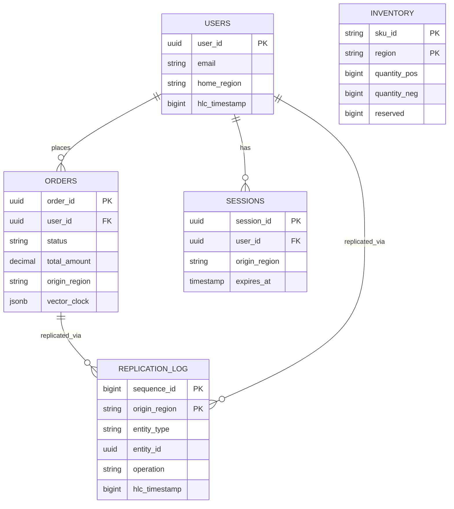
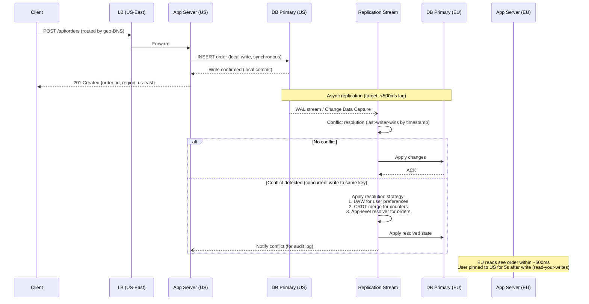
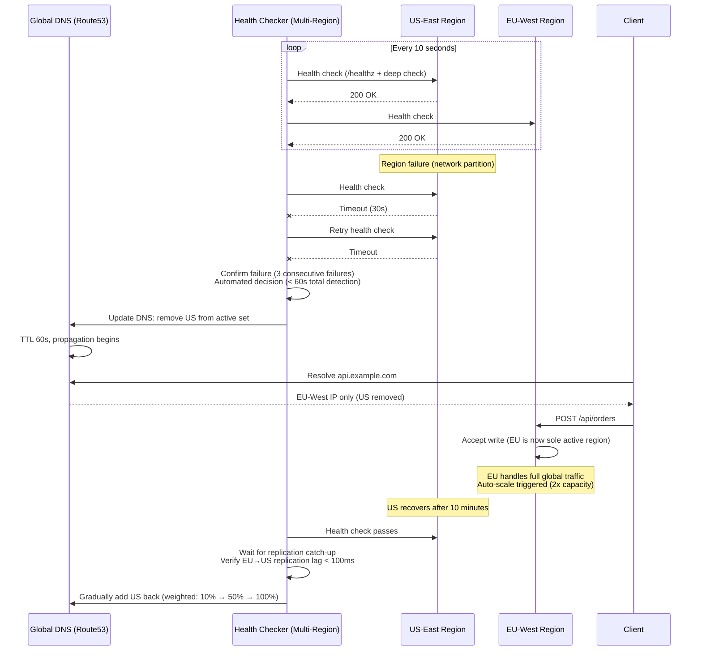

# Multi-Region Active-Active Architecture

## 1. Functional Requirements

### Core Features
- **Read/Write in Any Region**: Users can perform all operations from nearest region
- **Automatic Failover**: Region failure detected and traffic rerouted within seconds
- **Conflict Resolution**: Handle concurrent writes to same data across regions
- **Data Residency Compliance**: Keep certain data within geographic boundaries (GDPR, data sovereignty)
- **Region-Aware Routing**: Route users to optimal region based on latency/locality
- **Cross-Region Session Handling**: User sessions valid across all regions
- **Partial Degradation**: Continue serving from available regions during partition

### User Stories
1. User in EU writes order → served by EU region → replicated to US/APAC
2. US region goes down → EU/APAC absorb traffic within 30 seconds
3. Two users update same inventory simultaneously in different regions → system resolves conflict
4. EU user's PII data stays in EU region even though order is globally visible
5. User starts session in US, travels to EU → session continues seamlessly

---

## 2. Non-Functional Requirements

| Metric | Target |
|--------|--------|
| Availability | 99.999% (global, 5.26 min downtime/year) |
| RPO (Recovery Point Objective) | ≈0 (no data loss during failover) |
| RTO (Recovery Time Objective) | <30 seconds |
| Read Latency (in-region) | <50ms p99 |
| Write Latency (in-region) | <100ms p99 |
| Cross-Region Replication Lag | <500ms p99 |
| Regions Supported | 3-5 active regions |
| Data Consistency | Eventual (configurable per entity to strong) |
| Throughput per Region | 100K+ RPS |

---

## 3. Capacity Estimation

### Traffic Model (E-Commerce Example)
```
Regions: 3 (US-East, EU-West, APAC-Tokyo)
Total users: 100M
DAU: 20M (distributed: 40% US, 35% EU, 25% APAC)
Peak RPS per region: 150K reads, 30K writes
Cross-region replication events: 30K writes × 3 regions = 90K/sec

Data size:
  Users: 100M × 2KB = 200GB per region
  Products: 10M × 5KB = 50GB per region
  Orders: 500M × 3KB = 1.5TB per region (growing 2M/day)
  Inventory: 10M SKUs × 100B = 1GB per region (hot data)
  Sessions: 5M active × 1KB = 5GB per region
  
Replication bandwidth:
  30K writes/sec × avg 2KB = 60MB/s per region outbound
  Cross-region network: 3 × 60MB/s = 180MB/s aggregate
```

### Infrastructure per Region
```
Application tier: 50 instances × 16 cores = 800 cores
Database: 20 nodes × 32 cores × 256GB RAM = 5TB RAM cluster
Cache: 30 nodes × 64GB = ~2TB Redis cluster
Message bus: 10 Kafka brokers × 10TB = 100TB event log
Load balancers: 5 × 10Gbps
Cross-region links: 2 × 10Gbps dedicated (redundant)
```

---

## 4. Data Modeling

### Entity-Relationship Diagram



### User Schema (Geo-Partitioned)
```sql
CREATE TABLE users (
    user_id         UUID PRIMARY KEY,
    email           VARCHAR(255) UNIQUE,
    name            VARCHAR(255),
    home_region     VARCHAR(20) NOT NULL,  -- data residency
    password_hash   VARCHAR(255),
    preferences     JSONB,
    created_at      TIMESTAMP WITH TIME ZONE,
    updated_at      TIMESTAMP WITH TIME ZONE,
    version         BIGINT DEFAULT 0,      -- optimistic concurrency
    hlc_timestamp   BIGINT,                -- hybrid logical clock
    
    -- Geo-partition: PII stays in home_region
    CONSTRAINT data_residency CHECK (true)
) PARTITION BY LIST (home_region);

CREATE TABLE users_eu PARTITION OF users FOR VALUES IN ('eu-west');
CREATE TABLE users_us PARTITION OF users FOR VALUES IN ('us-east');
CREATE TABLE users_apac PARTITION OF users FOR VALUES IN ('apac-tokyo');
```

### Order Schema (Global, CRDT-friendly)
```sql
CREATE TABLE orders (
    order_id        UUID PRIMARY KEY,
    user_id         UUID NOT NULL,
    status          VARCHAR(50),  -- state machine, LWW
    items           JSONB,
    total_amount    DECIMAL(12,2),
    currency        VARCHAR(3),
    origin_region   VARCHAR(20),
    created_at      TIMESTAMP WITH TIME ZONE,
    updated_at      TIMESTAMP WITH TIME ZONE,
    hlc_timestamp   BIGINT NOT NULL,
    vector_clock    JSONB,  -- {"us-east": 5, "eu-west": 3, "apac": 2}
    tombstone       BOOLEAN DEFAULT FALSE
);

-- Replication metadata
CREATE TABLE replication_log (
    sequence_id     BIGSERIAL,
    origin_region   VARCHAR(20) NOT NULL,
    entity_type     VARCHAR(50) NOT NULL,
    entity_id       UUID NOT NULL,
    operation       VARCHAR(10),  -- INSERT, UPDATE, DELETE
    payload         JSONB,
    hlc_timestamp   BIGINT NOT NULL,
    vector_clock    JSONB,
    replicated_to   JSONB DEFAULT '{}',  -- {"eu-west": true, "apac": false}
    created_at      TIMESTAMP WITH TIME ZONE DEFAULT NOW(),
    
    PRIMARY KEY (origin_region, sequence_id)
);
```

### Inventory Schema (CRDT Counter)
```sql
CREATE TABLE inventory (
    sku_id          VARCHAR(50),
    region          VARCHAR(20),
    quantity_pos    BIGINT DEFAULT 0,  -- positive increments (restocks)
    quantity_neg    BIGINT DEFAULT 0,  -- negative increments (sales)
    -- Effective quantity = SUM(quantity_pos) - SUM(quantity_neg) across all regions
    reserved        BIGINT DEFAULT 0,
    last_modified   BIGINT,  -- HLC timestamp
    
    PRIMARY KEY (sku_id, region)
);

-- PN-Counter: each region tracks its own increments/decrements
-- Global quantity = Σ(quantity_pos across regions) - Σ(quantity_neg across regions)
-- Conflict-free by design: no conflicts possible with counters
```

### Session Schema (Replicated)
```sql
CREATE TABLE sessions (
    session_id      UUID PRIMARY KEY,
    user_id         UUID NOT NULL,
    token_hash      VARCHAR(255),
    origin_region   VARCHAR(20),
    last_active     TIMESTAMP WITH TIME ZONE,
    expires_at      TIMESTAMP WITH TIME ZONE,
    metadata        JSONB,  -- device, IP, etc.
    hlc_timestamp   BIGINT
);
-- Replicated to all regions for cross-region session continuity
-- LWW on last_active, max() on expires_at
```

### Hybrid Logical Clock Implementation
```python
class HybridLogicalClock:
    """Combines physical time with logical counter for ordering."""
    
    def __init__(self, node_id: str):
        self.node_id = node_id
        self.physical = 0   # milliseconds since epoch
        self.logical = 0
        
    def now(self) -> int:
        """Generate a new HLC timestamp."""
        pt = current_time_ms()
        if pt > self.physical:
            self.physical = pt
            self.logical = 0
        else:
            self.logical += 1
        return self._encode()
    
    def receive(self, remote_hlc: int) -> int:
        """Update on receiving a message with remote timestamp."""
        remote_physical, remote_logical = self._decode(remote_hlc)
        pt = current_time_ms()
        
        if pt > self.physical and pt > remote_physical:
            self.physical = pt
            self.logical = 0
        elif remote_physical > self.physical:
            self.physical = remote_physical
            self.logical = remote_logical + 1
        elif self.physical == remote_physical:
            self.logical = max(self.logical, remote_logical) + 1
        else:
            self.logical += 1
            
        return self._encode()
    
    def _encode(self) -> int:
        """Encode as 64-bit: 48 bits physical + 16 bits logical."""
        return (self.physical << 16) | (self.logical & 0xFFFF)
    
    def _decode(self, hlc: int) -> tuple:
        return (hlc >> 16, hlc & 0xFFFF)
    
    @staticmethod
    def compare(a: int, b: int) -> int:
        """Compare two HLC timestamps. Returns -1, 0, 1."""
        if a < b: return -1
        if a > b: return 1
        return 0
```

### Vector Clock for Conflict Detection
```python
class VectorClock:
    """Detect concurrent writes across regions."""
    
    def __init__(self, regions: list):
        self.clock = {r: 0 for r in regions}
    
    def increment(self, region: str):
        self.clock[region] += 1
        return dict(self.clock)
    
    def merge(self, other: dict):
        for region, count in other.items():
            self.clock[region] = max(self.clock.get(region, 0), count)
    
    def compare(self, other: dict) -> str:
        """Returns: 'before', 'after', 'concurrent', 'equal'."""
        less = False
        greater = False
        for region in set(list(self.clock.keys()) + list(other.keys())):
            a = self.clock.get(region, 0)
            b = other.get(region, 0)
            if a < b: less = True
            if a > b: greater = True
        
        if less and greater: return 'concurrent'  # CONFLICT!
        if less: return 'before'
        if greater: return 'after'
        return 'equal'
```

---

## 5. High-Level Design (HLD)

### Global Architecture
```
                        ┌─────────────────────────────┐
                        │     GLOBAL DNS / GTM        │
                        │  (Route53 / Traffic Manager) │
                        │  Health checks + Latency    │
                        │  routing + Geo-fencing      │
                        └──────┬──────────┬───────────┘
                               │          │
              ┌────────────────┼──────────┼────────────────┐
              │                │          │                │
              ▼                ▼          ▼                ▼
┌──────────────────┐  ┌──────────────────┐  ┌──────────────────┐
│   US-EAST        │  │   EU-WEST        │  │   APAC-TOKYO     │
│                  │  │                  │  │                  │
│ ┌──────────────┐ │  │ ┌──────────────┐ │  │ ┌──────────────┐ │
│ │   CDN Edge   │ │  │ │   CDN Edge   │ │  │ │   CDN Edge   │ │
│ └──────┬───────┘ │  │ └──────┬───────┘ │  │ └──────┬───────┘ │
│        │         │  │        │         │  │        │         │
│ ┌──────▼───────┐ │  │ ┌──────▼───────┐ │  │ ┌──────▼───────┐ │
│ │   API GW /   │ │  │ │   API GW /   │ │  │ │   API GW /   │ │
│ │     LB       │ │  │ │     LB       │ │  │ │     LB       │ │
│ └──────┬───────┘ │  │ └──────┬───────┘ │  │ └──────┬───────┘ │
│        │         │  │        │         │  │        │         │
│ ┌──────▼───────┐ │  │ ┌──────▼───────┐ │  │ ┌──────▼───────┐ │
│ │  App Tier    │ │  │ │  App Tier    │ │  │ │  App Tier    │ │
│ │ (Stateless)  │ │  │ │ (Stateless)  │ │  │ │ (Stateless)  │ │
│ └──────┬───────┘ │  │ └──────┬───────┘ │  │ └──────┬───────┘ │
│        │         │  │        │         │  │        │         │
│ ┌──────▼───────┐ │  │ ┌──────▼───────┐ │  │ ┌──────▼───────┐ │
│ │  Cache Layer │ │  │ │  Cache Layer │ │  │ │  Cache Layer │ │
│ │  (Redis)     │ │  │ │  (Redis)     │ │  │ │  (Redis)     │ │
│ └──────┬───────┘ │  │ └──────┬───────┘ │  │ └──────┬───────┘ │
│        │         │  │        │         │  │        │         │
│ ┌──────▼───────┐ │  │ ┌──────▼───────┐ │  │ ┌──────▼───────┐ │
│ │  Database    │ │  │ │  Database    │ │  │ │  Database    │ │
│ │  (Multi-    │ │  │ │  (Multi-    │ │  │ │  (Multi-    │ │
│ │   Master)   │ │  │ │   Master)   │ │  │ │   Master)   │ │
│ └──────┬───────┘ │  │ └──────┬───────┘ │  │ └──────┬───────┘ │
│        │         │  │        │         │  │        │         │
│ ┌──────▼───────┐ │  │ ┌──────▼───────┐ │  │ ┌──────▼───────┐ │
│ │ Event Bus   │ │  │ │ Event Bus   │ │  │ │ Event Bus   │ │
│ │ (Kafka)     │ │  │ │ (Kafka)     │ │  │ │ (Kafka)     │ │
│ └──────────────┘ │  │ └──────────────┘ │  │ └──────────────┘ │
└────────┬─────────┘  └────────┬─────────┘  └────────┬─────────┘
         │                     │                     │
         └─────────────────────┼─────────────────────┘
                               │
                  ┌────────────▼────────────┐
                  │  CROSS-REGION REPLICATION│
                  │                          │
                  │  ┌────────────────────┐  │
                  │  │ Replication Bus    │  │
                  │  │ (Kafka MirrorMaker │  │
                  │  │  / Custom Bridge)  │  │
                  │  └────────────────────┘  │
                  │                          │
                  │  ┌────────────────────┐  │
                  │  │ Conflict Resolver  │  │
                  │  │ (CRDT Engine +     │  │
                  │  │  App Merge Funcs)  │  │
                  │  └────────────────────┘  │
                  └─────────────────────────┘
```

### Request Flow (Write Path)
```
User in EU writes order:

1. DNS resolves to EU-West region (latency-based routing)
2. Request hits EU API Gateway
3. App tier processes write:
   a. Generate HLC timestamp
   b. Increment vector clock for EU
   c. Write to local EU database (committed locally)
   d. Publish to local Kafka topic: "orders.changes"
   e. Return success to user (<100ms total)
   
4. Async replication (background):
   a. Replication consumer reads from EU Kafka
   b. Publishes to cross-region replication bus
   c. US-East and APAC consumers receive event
   d. Each region:
      - Check vector clock for conflicts
      - If no conflict → apply write
      - If conflict → invoke conflict resolver
      - Update local database
      - ACK to replication bus

5. Replication lag: typically <500ms
```

---

## 6. Low-Level Design (LLD) - APIs

### Write API with Conflict Resolution
```python
class MultiRegionWriteService:
    def __init__(self, region: str, db, cache, event_bus, clock: HybridLogicalClock):
        self.region = region
        self.db = db
        self.cache = cache
        self.event_bus = event_bus
        self.clock = clock
    
    async def write(self, entity_type: str, entity_id: str, 
                    data: dict, expected_version: int = None) -> WriteResult:
        """Write with optimistic concurrency and conflict detection."""
        
        # Generate timestamps
        hlc = self.clock.now()
        
        # Read current state for version check
        current = await self.db.get(entity_type, entity_id)
        
        if expected_version is not None and current:
            if current['version'] != expected_version:
                raise OptimisticLockError(
                    f"Expected version {expected_version}, got {current['version']}")
        
        # Update vector clock
        vc = VectorClock.from_dict(current['vector_clock'] if current else {})
        vc.increment(self.region)
        
        # Prepare record
        record = {
            'entity_id': entity_id,
            'data': data,
            'version': (current['version'] + 1) if current else 1,
            'hlc_timestamp': hlc,
            'vector_clock': vc.to_dict(),
            'origin_region': self.region,
            'updated_at': datetime.utcnow()
        }
        
        # Write to local DB (single region commit)
        await self.db.upsert(entity_type, entity_id, record)
        
        # Invalidate cache
        await self.cache.delete(f"{entity_type}:{entity_id}")
        
        # Publish replication event
        await self.event_bus.publish(
            topic=f"{entity_type}.changes",
            key=entity_id,
            value={
                'type': 'WRITE',
                'entity_type': entity_type,
                'entity_id': entity_id,
                'record': record,
                'origin_region': self.region
            }
        )
        
        return WriteResult(
            entity_id=entity_id,
            version=record['version'],
            hlc=hlc,
            region=self.region
        )
```

### Replication Consumer
```python
class ReplicationConsumer:
    def __init__(self, region: str, db, conflict_resolver, clock):
        self.region = region
        self.db = db
        self.conflict_resolver = conflict_resolver
        self.clock = clock
    
    async def process_replication_event(self, event: dict):
        """Process incoming replication from another region."""
        if event['origin_region'] == self.region:
            return  # Skip own events
        
        entity_type = event['entity_type']
        entity_id = event['entity_id']
        remote_record = event['record']
        
        # Update our HLC with remote timestamp
        self.clock.receive(remote_record['hlc_timestamp'])
        
        # Read local state
        local_record = await self.db.get(entity_type, entity_id)
        
        if local_record is None:
            # No conflict - just apply
            await self.db.upsert(entity_type, entity_id, remote_record)
            return
        
        # Check for conflict using vector clocks
        local_vc = VectorClock.from_dict(local_record['vector_clock'])
        relationship = local_vc.compare(remote_record['vector_clock'])
        
        if relationship == 'before':
            # Remote is newer - apply directly
            await self.db.upsert(entity_type, entity_id, remote_record)
            
        elif relationship == 'after':
            # Local is newer - ignore remote (already ahead)
            pass
            
        elif relationship == 'concurrent':
            # CONFLICT - need resolution
            resolved = await self.conflict_resolver.resolve(
                entity_type=entity_type,
                local=local_record,
                remote=remote_record
            )
            # Merge vector clocks
            local_vc.merge(remote_record['vector_clock'])
            resolved['vector_clock'] = local_vc.to_dict()
            await self.db.upsert(entity_type, entity_id, resolved)
            
        elif relationship == 'equal':
            # Same state - idempotent, skip
            pass
```

### Failover Controller API
```python
class FailoverController:
    """Manages automatic region failover."""
    
    def __init__(self, regions: list, dns_provider, health_checker):
        self.regions = regions
        self.dns = dns_provider
        self.health = health_checker
        self.region_status = {r: 'healthy' for r in regions}
        
    async def health_check_loop(self):
        """Continuous health monitoring."""
        while True:
            for region in self.regions:
                checks = await self.health.check_region(region)
                # checks: {api: bool, db: bool, cache: bool, replication_lag_ms: int}
                
                if not checks['api'] or not checks['db']:
                    await self.mark_unhealthy(region)
                elif checks['replication_lag_ms'] > 5000:
                    await self.mark_degraded(region)
                else:
                    await self.mark_healthy(region)
                    
            await asyncio.sleep(5)  # Check every 5 seconds
    
    async def mark_unhealthy(self, region: str):
        if self.region_status[region] == 'healthy':
            self.region_status[region] = 'unhealthy'
            
            # Remove from DNS rotation
            await self.dns.remove_region(region)
            
            # Notify other regions to absorb traffic
            healthy_regions = [r for r, s in self.region_status.items() 
                             if s == 'healthy']
            for r in healthy_regions:
                await self.scale_up(r, factor=1.5)
            
            # Alert
            await self.alert(f"Region {region} marked unhealthy, "
                           f"traffic shifted to {healthy_regions}")
    
    async def mark_healthy(self, region: str):
        if self.region_status[region] != 'healthy':
            # Gradual traffic shift back (canary)
            self.region_status[region] = 'recovering'
            await self.dns.add_region(region, weight=10)  # Start with 10%
            await asyncio.sleep(60)
            await self.dns.add_region(region, weight=50)
            await asyncio.sleep(60)
            await self.dns.add_region(region, weight=100)
            self.region_status[region] = 'healthy'
```

### Global DNS Configuration
```python
# Route53 Health Check + Routing Policy
dns_config = {
    "record": "api.example.com",
    "type": "A",
    "routing_policy": "latency",
    "regions": {
        "us-east-1": {
            "endpoints": ["52.1.1.1", "52.1.1.2"],
            "health_check": {
                "protocol": "HTTPS",
                "path": "/health",
                "port": 443,
                "interval": 10,
                "failure_threshold": 3,
                "regions_checking": ["us-east-1", "eu-west-1", "ap-northeast-1"]
            },
            "failover": {
                "primary": True,
                "secondary_region": "eu-west-1"
            }
        },
        "eu-west-1": {
            "endpoints": ["54.2.2.1", "54.2.2.2"],
            "health_check": { "..." : "..." }
        },
        "ap-northeast-1": {
            "endpoints": ["13.3.3.1", "13.3.3.2"],
            "health_check": { "..." : "..." }
        }
    }
}
```

---

## 7. Deep Dives

### Deep Dive 1: Conflict Resolution Strategies

#### CRDT-Based Resolution (Conflict-Free by Design)
```python
class CRDTRegistry:
    """Registry of CRDT types for automatic conflict resolution."""
    
    @staticmethod
    def pn_counter_merge(local: dict, remote: dict) -> dict:
        """Positive-Negative Counter: inventory, likes, views."""
        # Each region maintains independent pos/neg counters
        # Merge: take max of each region's counter
        merged_pos = {}
        merged_neg = {}
        for region in set(list(local.get('pos', {}).keys()) + 
                         list(remote.get('pos', {}).keys())):
            merged_pos[region] = max(
                local.get('pos', {}).get(region, 0),
                remote.get('pos', {}).get(region, 0)
            )
            merged_neg[region] = max(
                local.get('neg', {}).get(region, 0),
                remote.get('neg', {}).get(region, 0)
            )
        return {'pos': merged_pos, 'neg': merged_neg,
                'value': sum(merged_pos.values()) - sum(merged_neg.values())}
    
    @staticmethod
    def lww_register_merge(local: dict, remote: dict) -> dict:
        """Last-Writer-Wins Register: user profile, settings."""
        # Compare HLC timestamps - highest wins
        if remote['hlc_timestamp'] > local['hlc_timestamp']:
            return remote
        elif remote['hlc_timestamp'] < local['hlc_timestamp']:
            return local
        else:
            # Tie-break by region ID (deterministic)
            if remote['origin_region'] > local['origin_region']:
                return remote
            return local
    
    @staticmethod
    def or_set_merge(local: set, remote: set) -> set:
        """Observed-Remove Set: shopping cart items, tags."""
        # Each element has unique tag (add_id)
        # Element present if any add_id not in remove set
        local_adds = local.get('adds', {})    # {element: {add_id: timestamp}}
        local_removes = local.get('removes', set())  # {add_id}
        remote_adds = remote.get('adds', {})
        remote_removes = remote.get('removes', set())
        
        # Merge adds: union
        merged_adds = {**local_adds}
        for elem, tags in remote_adds.items():
            if elem in merged_adds:
                merged_adds[elem].update(tags)
            else:
                merged_adds[elem] = tags
        
        # Merge removes: union
        merged_removes = local_removes | remote_removes
        
        # Effective set: elements with at least one non-removed add_id
        effective = set()
        for elem, tags in merged_adds.items():
            if any(tag not in merged_removes for tag in tags):
                effective.add(elem)
        
        return {'adds': merged_adds, 'removes': merged_removes, 
                'value': effective}
    
    @staticmethod
    def mv_register_merge(local: dict, remote: dict) -> dict:
        """Multi-Value Register: preserves all concurrent values."""
        # Used when automatic resolution isn't possible
        # Returns all concurrent values for app-level resolution
        local_vc = VectorClock.from_dict(local['vector_clock'])
        relationship = local_vc.compare(remote['vector_clock'])
        
        if relationship == 'concurrent':
            return {
                'values': [local['data'], remote['data']],
                'needs_resolution': True,
                'vector_clocks': [local['vector_clock'], remote['vector_clock']]
            }
        elif relationship == 'before':
            return remote
        else:
            return local
```

#### Application-Level Merge Functions
```python
class DomainConflictResolvers:
    """Domain-specific merge strategies for the e-commerce system."""
    
    @staticmethod
    def resolve_order_status(local: dict, remote: dict) -> dict:
        """Order status follows a state machine - highest state wins."""
        status_order = {
            'created': 0, 'confirmed': 1, 'paid': 2,
            'processing': 3, 'shipped': 4, 'delivered': 5,
            'cancelled': 10, 'refunded': 11
        }
        local_rank = status_order.get(local['data']['status'], -1)
        remote_rank = status_order.get(remote['data']['status'], -1)
        
        # Special case: cancellation always wins over non-terminal states
        if remote['data']['status'] == 'cancelled' and local_rank < 5:
            return remote
        if local['data']['status'] == 'cancelled' and remote_rank < 5:
            return local
            
        # Otherwise highest rank wins (most progressed state)
        return remote if remote_rank > local_rank else local
    
    @staticmethod
    def resolve_shopping_cart(local: dict, remote: dict) -> dict:
        """Shopping cart: merge items, sum quantities, keep latest prices."""
        local_items = {i['sku']: i for i in local['data']['items']}
        remote_items = {i['sku']: i for i in remote['data']['items']}
        
        merged_items = {}
        all_skus = set(list(local_items.keys()) + list(remote_items.keys()))
        
        for sku in all_skus:
            l = local_items.get(sku)
            r = remote_items.get(sku)
            
            if l and r:
                # Both have it: take max quantity, latest price
                merged_items[sku] = {
                    'sku': sku,
                    'quantity': max(l['quantity'], r['quantity']),
                    'price': r['price'] if remote['hlc_timestamp'] > local['hlc_timestamp'] else l['price']
                }
            elif l:
                # Check if removed in remote (explicit remove vs never added)
                if sku in remote.get('data', {}).get('removed_skus', []):
                    pass  # Honor removal
                else:
                    merged_items[sku] = l
            elif r:
                if sku in local.get('data', {}).get('removed_skus', []):
                    pass
                else:
                    merged_items[sku] = r
        
        result = {**local}
        result['data']['items'] = list(merged_items.values())
        return result
    
    @staticmethod
    def resolve_inventory_reservation(local: dict, remote: dict) -> dict:
        """Inventory: conservative approach - take minimum available."""
        # This prevents overselling across regions
        return {
            **local,
            'data': {
                'available': min(local['data']['available'], 
                               remote['data']['available']),
                'reserved': local['data']['reserved'] + remote['data']['reserved']
            }
        }
```

### Deep Dive 2: Data Replication Topology

#### Replication Modes
```
┌─────────────────────────────────────────────────────────────────┐
│                    REPLICATION TOPOLOGIES                        │
│                                                                 │
│  Mode 1: Multi-Master (all regions accept writes)               │
│  ┌────┐     ┌────┐     ┌────┐                                 │
│  │ US │◄───►│ EU │◄───►│APAC│                                 │
│  │ RW │     │ RW │     │ RW │                                 │
│  └────┘     └────┘     └────┘                                 │
│  Pros: Lowest write latency, highest availability              │
│  Cons: Conflicts possible, complex resolution                   │
│                                                                 │
│  Mode 2: Single-Leader per Partition                            │
│  ┌────────────────────────────────┐                            │
│  │ Partition A: Leader=US         │                            │
│  │ ┌────┐    ┌────┐    ┌────┐    │                            │
│  │ │US*W│───►│EU R│───►│APAC│    │                            │
│  │ └────┘    └────┘    └────┘    │                            │
│  └────────────────────────────────┘                            │
│  ┌────────────────────────────────┐                            │
│  │ Partition B: Leader=EU         │                            │
│  │ ┌────┐    ┌────┐    ┌────┐    │                            │
│  │ │US R│◄───│EU*W│───►│APAC│    │                            │
│  │ └────┘    └────┘    └────┘    │                            │
│  └────────────────────────────────┘                            │
│  Pros: No conflicts within partition, strong consistency        │
│  Cons: Cross-region writes for non-local partitions            │
│                                                                 │
│  Mode 3: Quorum-Based (NRW tunable)                            │
│  N=3 (replicas), W=2 (write quorum), R=2 (read quorum)        │
│  ┌────┐     ┌────┐     ┌────┐                                 │
│  │US W│     │EU W│     │APAC│  Write: 2 of 3 ACK             │
│  │  ✓ │     │  ✓ │     │  ✗ │  (strong if R+W>N)             │
│  └────┘     └────┘     └────┘                                 │
│  Pros: Tunable consistency/availability trade-off              │
│  Cons: Higher write latency (cross-region quorum)              │
└─────────────────────────────────────────────────────────────────┘
```

#### Replication Pipeline Implementation
```python
class CrossRegionReplicator:
    """Manages replication between regions."""
    
    def __init__(self, local_region: str, remote_regions: list, 
                 kafka_producer, conflict_resolver):
        self.local_region = local_region
        self.remote_regions = remote_regions
        self.producer = kafka_producer
        self.resolver = conflict_resolver
        self.replication_lag = {}  # Track lag per remote region
        
    async def replicate_outbound(self, change_event: dict):
        """Send local writes to all remote regions."""
        for region in self.remote_regions:
            topic = f"replication.{self.local_region}.to.{region}"
            await self.producer.send(
                topic=topic,
                key=change_event['entity_id'].encode(),
                value=json.dumps(change_event).encode(),
                headers=[
                    ('origin_region', self.local_region.encode()),
                    ('hlc_timestamp', str(change_event['hlc_timestamp']).encode()),
                    ('sequence', str(change_event['sequence_id']).encode())
                ]
            )
    
    async def process_inbound(self, message):
        """Process replicated write from remote region."""
        event = json.loads(message.value)
        origin = event['origin_region']
        
        # Track replication lag
        send_time = event['hlc_timestamp'] >> 16  # extract physical time
        self.replication_lag[origin] = current_time_ms() - send_time
        
        # Idempotency check
        if await self.already_processed(origin, event['sequence_id']):
            return
        
        # Apply with conflict resolution
        await self.apply_with_resolution(event)
        
        # Mark as processed
        await self.mark_processed(origin, event['sequence_id'])
    
    async def handle_region_recovery(self, region: str, last_sequence: int):
        """When a region comes back, catch it up."""
        # Read all events since last_sequence from replication log
        events = await self.db.query(
            "SELECT * FROM replication_log WHERE sequence_id > ? "
            "AND origin_region != ? ORDER BY sequence_id",
            [last_sequence, region]
        )
        
        # Batch replay
        for batch in chunk(events, 1000):
            await self.bulk_replicate(region, batch)
```

### Deep Dive 3: Request Routing and Failover

#### Global Traffic Management
```python
class GlobalTrafficManager:
    """Manages routing decisions across regions."""
    
    def __init__(self):
        self.region_health = {}
        self.real_user_metrics = {}  # RUM data per region
        self.routing_policy = 'latency'  # latency | geo | weighted
    
    def route_request(self, client_ip: str, headers: dict) -> str:
        """Determine which region should serve this request."""
        
        # 1. Check if region affinity in cookie/header
        preferred = headers.get('X-Region-Affinity')
        if preferred and self.region_health.get(preferred) == 'healthy':
            return preferred
        
        # 2. Data residency requirement
        user_country = geoip_lookup(client_ip)
        required_region = self.data_residency_map.get(user_country)
        if required_region:
            if self.region_health.get(required_region) == 'healthy':
                return required_region
            # Data residency can't be satisfied - may need to reject or degrade
            
        # 3. Latency-based routing (using RUM data)
        client_latencies = self.real_user_metrics.get(client_ip, {})
        if client_latencies:
            healthy_regions = [r for r, h in self.region_health.items() 
                            if h == 'healthy']
            return min(healthy_regions, 
                      key=lambda r: client_latencies.get(r, float('inf')))
        
        # 4. Geo-based fallback
        return self.nearest_healthy_region(client_ip)
    
    def failover_decision(self, failed_region: str) -> dict:
        """Decide how to handle traffic from failed region."""
        healthy = [r for r, h in self.region_health.items() if h == 'healthy']
        
        if not healthy:
            return {'action': 'degraded_mode', 'serve_stale': True}
        
        # Distribute proportionally to remaining capacity
        total_capacity = sum(self.region_capacity[r] for r in healthy)
        distribution = {}
        for r in healthy:
            distribution[r] = self.region_capacity[r] / total_capacity
        
        return {
            'action': 'redistribute',
            'distribution': distribution,
            'estimated_additional_latency_ms': 50,  # cross-region premium
            'scale_up_required': True
        }
```

#### Graceful Degradation During Partition
```
Network Partition Scenarios:

┌─────────────────────────────────────────────────────────────┐
│ Scenario 1: Single region isolated                          │
│                                                             │
│   US ──✗── EU ────── APAC                                  │
│                                                             │
│ US behavior:                                                │
│   - Continue serving reads (local data)                     │
│   - Continue accepting writes (queue for replication)       │
│   - Flag responses: "X-Consistency: eventual"              │
│   - Inventory: switch to local-only mode (may oversell)    │
│                                                             │
│ EU + APAC behavior:                                         │
│   - Continue normal operation between themselves            │
│   - Stop replicating to US (buffer in Kafka)               │
│   - DNS removes US for non-US users                        │
│                                                             │
│ Healing:                                                    │
│   - US reconnects → replay buffered events                 │
│   - Conflict resolution on diverged data                   │
│   - Reconcile inventory (may need manual intervention)     │
└─────────────────────────────────────────────────────────────┘

┌─────────────────────────────────────────────────────────────┐
│ Scenario 2: Total partition (all regions isolated)          │
│                                                             │
│   US ──✗── EU ──✗── APAC                                  │
│                                                             │
│ Each region:                                                │
│   - Full independent operation (active-active design)      │
│   - Accept all reads and writes locally                    │
│   - Queue all replication events                           │
│   - Alert: "split-brain detected"                          │
│                                                             │
│ Risk: Conflicting writes (handled by CRDT/resolution)      │
│ Risk: Inventory overselling (bounded by local stock)        │
│                                                             │
│ Healing priority:                                           │
│   1. Re-establish replication links                        │
│   2. Replay buffered events (in HLC order)                │
│   3. Run conflict resolution                               │
│   4. Reconcile financial data (audit)                      │
│   5. Alert on unresolvable conflicts                       │
└─────────────────────────────────────────────────────────────┘
```

#### CAP Theorem Practical Trade-offs
```
┌────────────────────────────────────────────────────────────────┐
│              CAP TRADE-OFF MATRIX BY DATA TYPE                  │
│                                                                │
│ Data Type       │ Normal Mode     │ Partition Mode             │
│─────────────────┼─────────────────┼────────────────────────────│
│ User Profile    │ CP (strong)     │ AP (serve stale, LWW)     │
│ Shopping Cart   │ AP (eventual)   │ AP (OR-Set CRDT)          │
│ Inventory       │ CP (quorum)     │ AP (local stock, may      │
│                 │                 │     oversell by <5%)       │
│ Order Status    │ CP (linearize)  │ AP (state machine merge)  │
│ Session         │ AP (replicated) │ AP (accept any valid JWT) │
│ Payment         │ CP (strong)     │ REJECT (cannot risk)      │
│ Product Catalog │ AP (eventual)   │ AP (serve stale cache)    │
│ Search Index    │ AP (eventual)   │ AP (stale results OK)     │
│                                                                │
│ Legend: CP = Consistency + Partition tolerance (reject if no   │
│              quorum). AP = Availability + Partition tolerance   │
│              (serve potentially stale data)                     │
└────────────────────────────────────────────────────────────────┘
```

---

## 8. Component Optimization

### Cache Strategy for Multi-Region
```python
class MultiRegionCache:
    """Two-tier cache: local (fast) + global (consistent)."""
    
    def __init__(self, local_redis, global_cache, region: str):
        self.local = local_redis       # In-region, <1ms
        self.global_cache = global_cache  # Cross-region, ~50ms
        self.region = region
        self.local_ttl = 30            # seconds (short - stale risk)
        self.global_ttl = 300          # seconds
    
    async def get(self, key: str, consistency: str = 'eventual') -> any:
        """Read-through with consistency options."""
        
        # Try local cache first
        value = await self.local.get(key)
        if value and consistency == 'eventual':
            return json.loads(value)
        
        # For strong consistency, skip local cache
        if consistency == 'strong':
            return None  # Force DB read
        
        # Try global cache
        value = await self.global_cache.get(key)
        if value:
            # Populate local cache
            await self.local.setex(key, self.local_ttl, value)
            return json.loads(value)
        
        return None
    
    async def invalidate(self, key: str):
        """Invalidate across all regions."""
        await self.local.delete(key)
        await self.global_cache.delete(key)
        # Publish invalidation event for other regions' local caches
        await self.publish_invalidation(key)
    
    async def publish_invalidation(self, key: str):
        """Cross-region cache invalidation via pub/sub."""
        await self.event_bus.publish(
            topic="cache.invalidations",
            value={'key': key, 'region': self.region, 'timestamp': time.time()}
        )
```

### Database Connection Routing
```python
class RegionAwareDBRouter:
    """Routes queries to optimal database based on consistency needs."""
    
    def __init__(self, local_primary, local_replicas, remote_primaries):
        self.local_primary = local_primary
        self.local_replicas = local_replicas
        self.remote_primaries = remote_primaries
    
    def get_connection(self, query_type: str, entity_type: str, 
                       entity_id: str = None) -> Connection:
        """
        Routing rules:
        - Writes: always local primary
        - Strong reads: local primary
        - Eventual reads: local replica (load balanced)
        - Partition-leader reads: route to leader region
        """
        if query_type == 'write':
            return self.local_primary
        
        if query_type == 'strong_read':
            return self.local_primary
        
        if query_type == 'leader_read':
            leader_region = self.get_partition_leader(entity_type, entity_id)
            if leader_region == self.local_region:
                return self.local_primary
            return self.remote_primaries[leader_region]
        
        # Default: eventual consistency from local replica
        return random.choice(self.local_replicas)
```

---

## 9. Observability

### Multi-Region Metrics
```yaml
# Key metrics for active-active monitoring

replication_metrics:
  - name: replication_lag_ms
    type: histogram
    labels: [source_region, destination_region, entity_type]
    alert_threshold: 5000  # 5 seconds
    
  - name: replication_events_total
    type: counter
    labels: [source_region, destination_region, operation]
    
  - name: conflicts_detected_total
    type: counter
    labels: [entity_type, resolution_strategy, source_region, dest_region]
    
  - name: conflicts_unresolved_total
    type: counter
    labels: [entity_type]
    alert_threshold: 0  # Any unresolved conflict is critical

routing_metrics:
  - name: region_health_score
    type: gauge
    labels: [region]
    # 0-100, composite of latency + error rate + capacity
    
  - name: cross_region_requests_total
    type: counter
    labels: [source_region, destination_region, reason]
    # reason: failover, data_residency, leader_routing
    
  - name: failover_events_total
    type: counter
    labels: [failed_region, absorbing_region, trigger]

consistency_metrics:
  - name: stale_read_ratio
    type: gauge
    labels: [region, entity_type]
    # Percentage of reads returning stale data
    
  - name: vector_clock_drift_max
    type: gauge
    labels: [region_pair]
```

### Cross-Region Tracing
```
Trace spans across regions:

[US-East] POST /api/orders  ──────────────────────── 95ms
  ├── [US-East] validate_request                      2ms
  ├── [US-East] check_inventory (local read)          5ms
  ├── [US-East] write_order (local DB)               15ms
  ├── [US-East] publish_replication_event             3ms
  │     └── [EU-West] replicate_order (async)       450ms
  │           ├── [EU-West] conflict_check            5ms
  │           └── [EU-West] apply_write              10ms
  │     └── [APAC] replicate_order (async)          380ms
  └── [US-East] return_response                       1ms

Headers propagated:
  X-Region: us-east
  X-Trace-ID: abc-123 (same across regions)
  X-Replication-Lag: 450ms
```

### Dashboards
```
Multi-Region Health Dashboard:
┌────────────────────────────────────────────────────────┐
│  GLOBAL STATUS: ✓ HEALTHY    Regions: 3/3 Active      │
├────────────────────────────────────────────────────────┤
│                                                        │
│  Region    │ Health │ RPS    │ P99 Lat │ Rep Lag      │
│  ──────────┼────────┼────────┼─────────┼──────────    │
│  US-East   │  100%  │ 145K  │  42ms   │  -           │
│  EU-West   │   99%  │ 128K  │  38ms   │  120ms       │
│  APAC      │  100%  │  95K  │  45ms   │  350ms       │
│                                                        │
│  Conflicts (last 1h): 23 resolved, 0 unresolved       │
│  Failovers (last 24h): 0                              │
│  Replication queue depth: US→EU: 0, US→APAC: 12      │
└────────────────────────────────────────────────────────┘
```

---

## 10. Failure Scenarios & Mitigations

| Scenario | Impact | Detection | Mitigation | RTO |
|----------|--------|-----------|------------|-----|
| Region total failure | 33% capacity loss | Health checks (10s) | DNS failover + auto-scale | <30s |
| Network partition (split brain) | Data divergence | Replication lag spike | Accept divergence + merge on heal | 0 (serve) |
| Replication lag spike | Stale reads in remote | Lag monitoring | Switch affected reads to strong | <5s |
| Database corruption one region | Bad data propagating | Checksum validation | Halt replication, restore from backup | <5min |
| DNS provider failure | Routing broken globally | Multi-provider monitoring | Secondary DNS provider (failover) | <60s |
| Cross-region link saturation | Replication backlog | Bandwidth monitoring | Prioritize critical entities, backpressure | <30s |
| Clock skew between regions | Wrong conflict resolution | NTP monitoring + HLC | HLC tolerates bounded skew | N/A |
| Cascading failure (thundering herd) | All regions overloaded | Request rate monitoring | Circuit breaker + load shedding | <10s |

---

## 11. Considerations & Trade-offs

| Decision | Options | Chosen | Rationale |
|----------|---------|--------|-----------|
| Replication model | Multi-master vs Single-leader | Multi-master with CRDTs | Lowest write latency, acceptable complexity |
| Conflict resolution | LWW vs CRDTs vs App-merge | Hybrid (CRDT for counters, LWW for profiles, app-merge for orders) | Best fit per data type |
| Consistency model | Strong vs Eventual | Tunable per entity type | Payment=strong, catalog=eventual |
| Replication bus | Kafka vs dedicated DB replication | Kafka (application-level) | Flexibility, filtering, transformation |
| Session handling | Sticky sessions vs Replicated | Replicated (JWT-based) | Supports region failover |
| DNS failover | Active-passive vs Active-active | Active-active with health checks | Maximize availability |

### Key Design Principles
1. **Design for failure**: Every region must be independently functional
2. **Conflict-free where possible**: Use CRDTs to eliminate conflicts by design
3. **Tunable consistency**: Not all data needs the same guarantees
4. **Idempotent operations**: All replication events must be safely re-playable
5. **Bounded divergence**: Set maximum acceptable staleness per data type
6. **Graceful degradation over total failure**: Serve stale > reject request

### Anti-Patterns to Avoid
- Distributed transactions across regions (too slow, fragile)
- Synchronous replication for all writes (kills latency)
- Single global lock/counter (creates hotspot region)
- Assuming network is reliable between regions
- Ignoring data residency until after architecture is set

---

## Sequence Diagrams

### 1. Cross-Region Write Replication



### 2. Regional Failover Flow



### Infrastructure Components

#### Load Balancer
- **Global**: AWS Global Accelerator / Cloudflare Anycast for geo-proximity routing
- **Regional**: L7 ALB per region; weighted routing for gradual failover (canary region re-entry)
- **Algorithm**: Latency-based routing with failover; health-check driven automatic DNS updates
- **Session affinity**: Region-sticky cookies (5s TTL after writes) for read-your-writes consistency

#### API Gateway
- **Per-region deployment**: Independent API Gateway clusters in each region
- **Shared config**: Gateway configuration synced via Git (GitOps) across regions
- **Rate limiting**: Per-region rate limits (independent); global rate limits via async reconciliation (same as rate limiter pattern)
- **Request routing**: Region-aware routing headers (X-Region, X-Failover-From) for observability

#### CDN
- **Multi-origin**: CDN configured with regional origins; automatic failover on origin health failure
- **Cache partitioning**: Shared cache keys across regions for static content; region-specific keys for personalized content
- **Purge propagation**: Global purge API that fans out to all regional edge PoPs (< 5s propagation)
