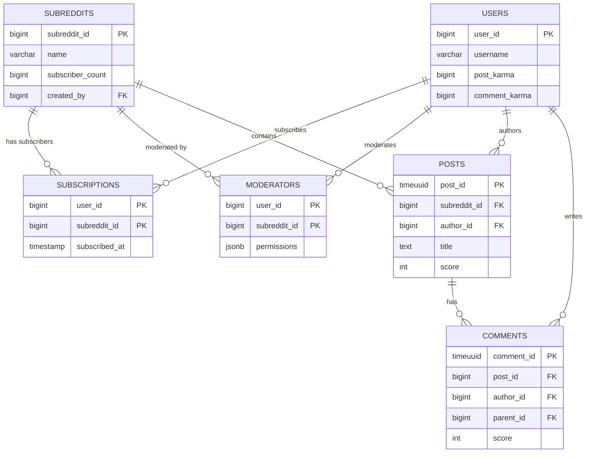
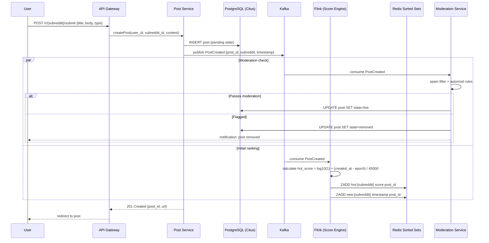
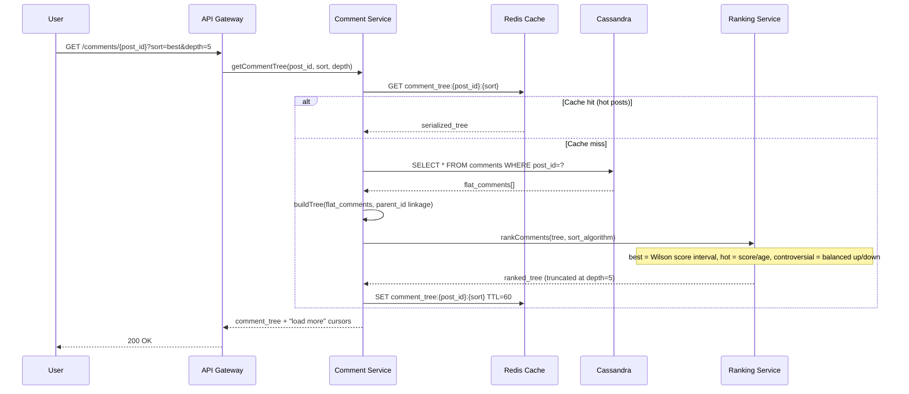
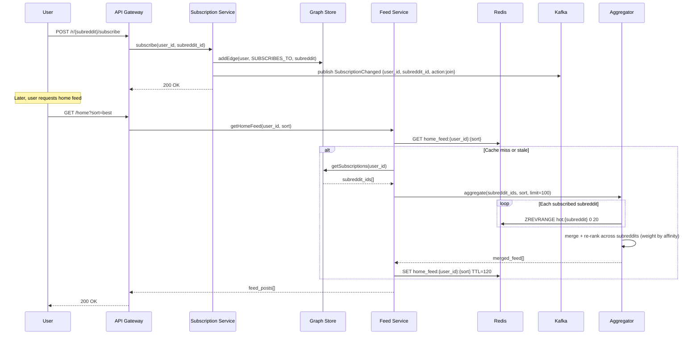

# System Design: Reddit

## 1. Functional Requirements

### Core Features
- **Subreddits**: Create/join communities with custom rules, flairs, sidebar, wiki
- **Posts**: Submit text, link, image, video, poll posts to subreddits
- **Voting**: Upvote/downvote posts and comments (one vote per user per item)
- **Comments**: Threaded comment trees with infinite nesting, collapse/expand
- **Karma**: Accumulated score from upvotes on user's posts/comments
- **Awards**: Give premium awards (gold, silver, platinum) to posts/comments
- **Moderation**: Remove posts, ban users, automod rules, mod queue, flair assignment
- **Custom Feeds**: Multi-reddits combining multiple subreddits
- **Saved Posts/Comments**: Bookmark content for later
- **User Profiles**: Post history, comment history, karma breakdown
- **Search**: Full-text search across posts, comments, subreddits
- **Notifications**: Replies, mentions, mod actions, award received

### Feed Types
- **Home Feed**: Aggregated from subscribed subreddits
- **r/all**: Global feed across all public subreddits
- **Subreddit Feed**: Posts within a single community
- **Sorting**: Hot, New, Top (hour/day/week/month/year/all), Rising, Controversial, Best

---

## 2. Non-Functional Requirements

| Requirement | Target |
|---|---|
| Availability | 99.99% uptime |
| Feed Latency | < 200ms p99 |
| Comment Tree Load | < 300ms p99 |
| Vote Processing | < 100ms (async score update < 5s) |
| DAU | 50M daily active users |
| Post Throughput | 100M new posts/day (~1,150 posts/sec) |
| Comment Throughput | 1B new comments/day (~11,500 comments/sec) |
| Vote Throughput | 10B votes/day (~115,000 votes/sec) |
| Search Latency | < 500ms p99 |
| Data Durability | 99.999999999% (11 nines) |
| Consistency | Eventual for scores/karma, strong for votes (no double-vote) |

---

## 3. Capacity Estimation

### Traffic
```
DAU: 50M users
Posts/day: 100M → ~1,150/sec
Comments/day: 1B → ~11,500/sec
Votes/day: 10B → ~115,000/sec
Feed reads/day: 50M users × 20 feeds/day = 1B → ~11,500/sec
Comment tree reads/day: 500M → ~5,800/sec
Peak multiplier: 3x → votes peak: 345K/sec
```

### Storage
```
Posts:
  - Avg post size: 2KB (metadata) + 5KB (content) = 7KB
  - 100M/day × 7KB = 700GB/day → 255TB/year

Comments:
  - Avg comment: 1KB (metadata + body)
  - 1B/day × 1KB = 1TB/day → 365TB/year

Votes:
  - Vote record: 32 bytes (user_id, item_id, direction, timestamp)
  - 10B/day × 32B = 320GB/day → 117TB/year

Media:
  - 10% posts have images (avg 500KB): 10M × 500KB = 5TB/day
  - 1% posts have video (avg 50MB): 1M × 50MB = 50TB/day

Total storage growth: ~55TB/day, ~20PB/year
```

### Bandwidth
```
Ingress: posts + comments + votes + media = ~60TB/day ≈ 5.5 Gbps
Egress: feed reads (1B × 50KB avg page) = 50PB/day ≈ 4.6 Tbps
With CDN offloading 90% media: effective origin egress ≈ 460 Gbps
```

---

## 4. Data Modeling

### Entity-Relationship Diagram



### PostgreSQL — Users, Subreddits, Subscriptions (Strong Consistency)

```sql
-- Users table
CREATE TABLE users (
    user_id         BIGSERIAL PRIMARY KEY,
    username        VARCHAR(20) UNIQUE NOT NULL,
    email           VARCHAR(255) UNIQUE NOT NULL,
    password_hash   VARCHAR(255) NOT NULL,
    post_karma      BIGINT DEFAULT 0,
    comment_karma   BIGINT DEFAULT 0,
    award_karma     BIGINT DEFAULT 0,
    cake_day        TIMESTAMP NOT NULL DEFAULT NOW(),
    is_premium      BOOLEAN DEFAULT FALSE,
    is_suspended    BOOLEAN DEFAULT FALSE,
    avatar_url      VARCHAR(512),
    created_at      TIMESTAMP DEFAULT NOW()
);
CREATE INDEX idx_users_username ON users(username);

-- Subreddits table
CREATE TABLE subreddits (
    subreddit_id    BIGSERIAL PRIMARY KEY,
    name            VARCHAR(21) UNIQUE NOT NULL,  -- r/name max 21 chars
    title           VARCHAR(100),
    description     TEXT,
    sidebar_md      TEXT,
    subscriber_count BIGINT DEFAULT 0,
    created_by      BIGINT REFERENCES users(user_id),
    is_nsfw         BOOLEAN DEFAULT FALSE,
    is_quarantined  BOOLEAN DEFAULT FALSE,
    post_type       VARCHAR(20) DEFAULT 'any', -- any, text, link
    created_at      TIMESTAMP DEFAULT NOW()
);
CREATE INDEX idx_subreddits_name ON subreddits(name);
CREATE INDEX idx_subreddits_subscribers ON subreddits(subscriber_count DESC);

-- Subscriptions
CREATE TABLE subscriptions (
    user_id         BIGINT REFERENCES users(user_id),
    subreddit_id    BIGINT REFERENCES subreddits(subreddit_id),
    subscribed_at   TIMESTAMP DEFAULT NOW(),
    PRIMARY KEY (user_id, subreddit_id)
);
CREATE INDEX idx_subscriptions_subreddit ON subscriptions(subreddit_id);

-- Moderators
CREATE TABLE moderators (
    user_id         BIGINT REFERENCES users(user_id),
    subreddit_id    BIGINT REFERENCES subreddits(subreddit_id),
    permissions     JSONB, -- {posts: true, comments: true, ban: true, flair: true}
    added_at        TIMESTAMP DEFAULT NOW(),
    PRIMARY KEY (user_id, subreddit_id)
);
```

### Cassandra — Posts and Comments (High Write Throughput)

```sql
-- Posts table (partitioned by subreddit for feed queries)
CREATE TABLE posts (
    subreddit_id    BIGINT,
    post_id         TIMEUUID,       -- time-sortable unique ID
    author_id       BIGINT,
    title           TEXT,
    body            TEXT,           -- for text posts
    url             TEXT,           -- for link posts
    media_urls      LIST<TEXT>,     -- for image/video posts
    post_type       TEXT,           -- text, link, image, video, poll
    score           INT,
    upvotes         INT,
    downvotes       INT,
    comment_count   INT,
    is_pinned       BOOLEAN,
    is_locked       BOOLEAN,
    is_removed      BOOLEAN,
    flair           TEXT,
    created_at      TIMESTAMP,
    PRIMARY KEY ((subreddit_id), created_at, post_id)
) WITH CLUSTERING ORDER BY (created_at DESC, post_id DESC);

-- Posts by author (for profile page)
CREATE TABLE posts_by_author (
    author_id       BIGINT,
    post_id         TIMEUUID,
    subreddit_id    BIGINT,
    title           TEXT,
    score           INT,
    created_at      TIMESTAMP,
    PRIMARY KEY ((author_id), created_at, post_id)
) WITH CLUSTERING ORDER BY (created_at DESC, post_id DESC);

-- Comments table (partitioned by post for tree loading)
CREATE TABLE comments (
    post_id         TIMEUUID,
    comment_id      TIMEUUID,
    parent_id       TIMEUUID,       -- NULL for top-level
    author_id       BIGINT,
    body            TEXT,
    path            TEXT,           -- materialized path: "root/parent1/parent2/this"
    depth           INT,
    score           INT,
    upvotes         INT,
    downvotes       INT,
    is_removed      BOOLEAN,
    created_at      TIMESTAMP,
    PRIMARY KEY ((post_id), path, comment_id)
) WITH CLUSTERING ORDER BY (path ASC, comment_id ASC);
```

### Redis — Hot Rankings, Vote Counts, Sessions

```
# Subreddit hot feed (sorted set: score = hot_score, member = post_id)
ZADD subreddit:{id}:hot {hot_score} {post_id}
ZADD subreddit:{id}:top:day {score} {post_id}
ZADD subreddit:{id}:new {timestamp} {post_id}
ZADD subreddit:{id}:rising {rising_score} {post_id}

# Global feeds
ZADD global:hot {hot_score} {post_id}
ZADD global:rising {rising_score} {post_id}

# Vote counts (hash for fast atomic increment)
HSET post:{id}:votes ups {count} downs {count}
HSET comment:{id}:votes ups {count} downs {count}

# User vote tracking (prevent double votes)
HSET user:{uid}:post_votes {post_id} {1|-1}
HSET user:{uid}:comment_votes {comment_id} {1|-1}

# User karma cache
HSET user:{uid}:karma post {val} comment {val} award {val}

# Home feed cache (per user, expires after 5 min)
ZRANGEBYSCORE user:{uid}:home_feed {min} {max}
```

### Elasticsearch — Search

```json
{
  "mappings": {
    "properties": {
      "post_id": { "type": "keyword" },
      "subreddit": { "type": "keyword" },
      "title": { "type": "text", "analyzer": "english" },
      "body": { "type": "text", "analyzer": "english" },
      "author": { "type": "keyword" },
      "score": { "type": "integer" },
      "comment_count": { "type": "integer" },
      "created_at": { "type": "date" },
      "flair": { "type": "keyword" },
      "is_nsfw": { "type": "boolean" }
    }
  }
}
```

---

## 5. High-Level Architecture

```
┌─────────────────────────────────────────────────────────────────────────────────┐
│                              CLIENTS                                             │
│         Web App (React)  │  iOS App  │  Android App  │  3rd-party APIs          │
└────────────────────────────────┬────────────────────────────────────────────────┘
                                 │
                          ┌──────▼──────┐
                          │   CloudFront │  (CDN - media, static assets)
                          │     / CDN    │
                          └──────┬──────┘
                                 │
                          ┌──────▼──────┐
                          │  API Gateway │  (Rate limiting, Auth, Routing)
                          │   (Kong)     │
                          └──────┬──────┘
                                 │
              ┌──────────────────┼──────────────────────────────────┐
              │                  │                                   │
     ┌────────▼───────┐  ┌──────▼──────┐  ┌────────────────┐  ┌───▼────────────┐
     │  Post Service   │  │ Vote Service │  │ Comment Service│  │  Feed Service  │
     │                 │  │              │  │                │  │                │
     │ - Submit post   │  │ - Cast vote  │  │ - Add comment  │  │ - Home feed    │
     │ - Edit/delete   │  │ - Undo vote  │  │ - Edit/delete  │  │ - Subreddit    │
     │ - Media upload  │  │ - Get votes  │  │ - Load tree    │  │ - r/all        │
     └───────┬─────────┘  └──────┬──────┘  └───────┬────────┘  │ - Sorting      │
             │                    │                  │           └───┬────────────┘
             │                    │                  │               │
     ┌───────▼────────────────────▼──────────────────▼───────────────▼──────────┐
     │                         Apache Kafka                                      │
     │  Topics: posts, votes, comments, scores, karma, notifications, moderation│
     └───────┬──────────────┬───────────────┬──────────────┬────────────────────┘
             │              │               │              │
     ┌───────▼───────┐ ┌───▼────────┐ ┌────▼─────┐ ┌─────▼──────────┐
     │ Ranking Worker │ │Karma Worker│ │ Search   │ │ Notification   │
     │ (Flink)       │ │ (Flink)    │ │ Indexer  │ │ Service        │
     │               │ │            │ │          │ │                │
     │ - Hot score   │ │ - Aggregate│ │ - Index  │ │ - Push notif   │
     │ - Rising      │ │   karma    │ │   to ES  │ │ - Inbox        │
     │ - Controversial│ │ - Anti-spam│ │          │ │ - Email digest │
     └───────┬───────┘ └───┬────────┘ └────┬─────┘ └───────────────┘
             │              │               │
     ┌───────▼──────────────▼───────────────▼───────────────────────────────────┐
     │                          DATA LAYER                                       │
     │                                                                           │
     │  ┌──────────┐  ┌───────────┐  ┌───────────┐  ┌────────────┐  ┌───────┐ │
     │  │PostgreSQL │  │ Cassandra  │  │   Redis    │  │Elasticsearch│ │  S3   │ │
     │  │           │  │            │  │  Cluster   │  │  Cluster   │  │       │ │
     │  │- Users    │  │- Posts     │  │- Hot feeds │  │- Full-text │  │-Media │ │
     │  │- Subreddits│ │- Comments  │  │- Vote cache│  │  search    │  │-Backup│ │
     │  │- Subs     │  │- Votes log │  │- Sessions  │  │- Autocomplete│ │     │ │
     │  │- Mods     │  │            │  │- Rankings  │  │            │  │       │ │
     │  └──────────┘  └───────────┘  └───────────┘  └────────────┘  └───────┘ │
     └──────────────────────────────────────────────────────────────────────────┘
     
     ┌──────────────────────────────────────────────────────────────────────────┐
     │                       SUPPORTING SERVICES                                 │
     │                                                                           │
     │  ┌──────────────┐  ┌──────────────┐  ┌──────────────┐  ┌─────────────┐ │
     │  │ Moderation   │  │  Award       │  │  Auth        │  │ Anti-Abuse  │ │
     │  │ Service      │  │  Service     │  │  Service     │  │ Service     │ │
     │  │              │  │              │  │              │  │             │ │
     │  │ - AutoMod    │  │ - Give award │  │ - Login/SSO  │  │ - Vote fuzz │ │
     │  │ - Mod queue  │  │ - Coin mgmt  │  │ - OAuth2     │  │ - Spam det  │ │
     │  │ - Ban users  │  │ - Premium    │  │ - JWT tokens │  │ - Bot detect│ │
     │  └──────────────┘  └──────────────┘  └──────────────┘  └─────────────┘ │
     └──────────────────────────────────────────────────────────────────────────┘
```

---

## 6. Low-Level Design — APIs

### Submit Post

```
POST /api/v1/subreddits/{subreddit_name}/posts
Authorization: Bearer {token}

Request:
{
  "title": "TIL about Reddit's ranking algorithm",
  "type": "text",           // text | link | image | video | poll
  "body": "The hot ranking uses...",
  "flair_id": "abc123",
  "nsfw": false,
  "spoiler": false
}

Response: 201 Created
{
  "post_id": "t3_xyz789",
  "subreddit": "todayilearned",
  "title": "TIL about Reddit's ranking algorithm",
  "author": "user123",
  "score": 1,
  "upvote_ratio": 1.0,
  "comment_count": 0,
  "created_utc": 1700000000,
  "permalink": "/r/todayilearned/comments/xyz789/til_about_reddits_ranking/"
}
```

### Vote

```
POST /api/v1/vote
Authorization: Bearer {token}

Request:
{
  "id": "t3_xyz789",       // t3_ = post, t1_ = comment
  "direction": 1            // 1 = upvote, -1 = downvote, 0 = unvote
}

Response: 200 OK
{
  "success": true,
  "new_score": 42,
  "upvote_ratio": 0.89
}
```

**Vote Processing Flow:**
```
1. Check user hasn't already voted same direction (Redis HGET)
2. If changing vote: subtract old, add new (atomic)
3. Write to Kafka topic "votes"
4. Ranking Worker consumes → recalculates hot/rising scores
5. Karma Worker consumes → updates author's karma
6. Update Redis sorted sets for affected feeds
```

### Comment

```
POST /api/v1/posts/{post_id}/comments
Authorization: Bearer {token}

Request:
{
  "parent_id": "t1_abc123",  // null for top-level comment
  "body": "Great explanation! Here's more detail..."
}

Response: 201 Created
{
  "comment_id": "t1_def456",
  "parent_id": "t1_abc123",
  "author": "commenter99",
  "body": "Great explanation! Here's more detail...",
  "score": 1,
  "depth": 2,
  "created_utc": 1700001000,
  "replies": []
}
```

### Get Subreddit Feed

```
GET /api/v1/subreddits/{name}/posts?sort=hot&after=t3_abc&limit=25
Authorization: Bearer {token} (optional)

Response: 200 OK
{
  "subreddit": "programming",
  "sort": "hot",
  "posts": [
    {
      "post_id": "t3_xyz789",
      "title": "New Rust release...",
      "author": "rustfan",
      "score": 4521,
      "upvote_ratio": 0.94,
      "comment_count": 312,
      "created_utc": 1699990000,
      "thumbnail": "https://cdn.reddit.com/...",
      "flair": { "text": "Discussion", "color": "#0079d3" },
      "awards": [{"name": "Gold", "count": 2}],
      "is_stickied": false
    }
    // ... 24 more
  ],
  "after": "t3_lastid",
  "before": null
}
```

**Feed Assembly (sort=hot):**
```
1. ZREVRANGEBYSCORE subreddit:{id}:hot +inf -inf LIMIT offset 25
2. MGET post:{id1}, post:{id2}, ... (cached post objects)
3. If cache miss → batch read from Cassandra
4. Annotate with user's votes: HMGET user:{uid}:post_votes id1 id2 ...
5. Return assembled feed
```

### Get Comment Tree

```
GET /api/v1/posts/{post_id}/comments?sort=best&depth=5&limit=200
Authorization: Bearer {token} (optional)

Response: 200 OK
{
  "post_id": "t3_xyz789",
  "comments": [
    {
      "comment_id": "t1_aaa",
      "author": "user1",
      "body": "Top-level comment",
      "score": 500,
      "depth": 0,
      "created_utc": 1699991000,
      "replies": [
        {
          "comment_id": "t1_bbb",
          "author": "user2",
          "body": "Reply to top-level",
          "score": 120,
          "depth": 1,
          "replies": [
            // nested further...
          ]
        }
      ],
      "more_replies": { "count": 15, "ids": ["t1_ccc", "t1_ddd"] }
    }
  ],
  "total_comments": 312
}
```

---

## 7. Deep Dive: Ranking Algorithms

### Hot Algorithm (Reddit's actual formula)

The hot ranking determines the order of posts in the "Hot" sort. It balances recency with popularity.

```python
import math
from datetime import datetime

EPOCH = datetime(2005, 12, 8, 7, 46, 43)  # Reddit's epoch

def hot_score(ups, downs, created_at):
    """
    Reddit's Hot Ranking Algorithm
    
    Score = sign(votes) * log10(max(|votes|, 1)) + age_bonus
    
    Where age_bonus = (created_seconds - epoch_seconds) / 45000
    
    Key properties:
    - 10 votes in first hour ≈ 100 votes in second hour ≈ 1000 votes in third hour
    - Each order of magnitude of votes = ~12.5 hours of age
    - New posts get a boost, old posts decay naturally
    """
    score = ups - downs
    order = math.log10(max(abs(score), 1))
    sign = 1 if score > 0 else -1 if score < 0 else 0
    
    # Seconds since Reddit epoch
    epoch_seconds = (created_at - EPOCH).total_seconds()
    
    # 45000 seconds = 12.5 hours
    # Every 12.5 hours, a post needs 10x more votes to stay in same position
    hot = sign * order + epoch_seconds / 45000.0
    
    return round(hot, 7)
```

**Key insight:** The time component is absolute (not relative), meaning newer posts always have higher base scores. A post with 10 points now scores higher than a post with 10 points from yesterday.

### Wilson Score (Best Comment Sorting)

For comments, Reddit uses the Wilson score confidence interval lower bound. This produces better results than simple upvote-downvote because it accounts for sample size.

```python
import math

def wilson_score_interval(ups, downs, confidence=0.95):
    """
    Wilson Score Confidence Interval (Lower Bound)
    
    Used for "Best" comment sorting.
    
    Formula:
    lower_bound = (p̂ + z²/2n - z√(p̂(1-p̂)/n + z²/4n²)) / (1 + z²/n)
    
    Where:
    - p̂ = observed fraction of positive ratings = ups / (ups + downs)
    - n = total ratings = ups + downs
    - z = z-score for confidence level (1.96 for 95%)
    
    Properties:
    - Balances proportion of upvotes with total sample size
    - A comment with 1 up / 0 down ranks LOWER than 100 up / 10 down
    - Handles new comments fairly (uncertainty pushes score down)
    """
    n = ups + downs
    if n == 0:
        return 0.0
    
    z = 1.96 if confidence == 0.95 else 1.281  # Reddit uses z=1.281 (80%)
    p_hat = float(ups) / n
    
    numerator = (p_hat + z*z/(2*n) - 
                 z * math.sqrt((p_hat*(1-p_hat) + z*z/(4*n)) / n))
    denominator = 1 + z*z/n
    
    return numerator / denominator
```

### Controversial Score

```python
def controversial_score(ups, downs):
    """
    Controversial Ranking
    
    A post/comment is controversial when it has many votes split nearly evenly.
    
    Formula: (ups + downs) ^ (min(ups,downs) / max(ups,downs))
    
    Properties:
    - Maximized when ups ≈ downs (ratio → 1.0)
    - Higher total votes = more controversial
    - 50 up / 50 down scores higher than 5 up / 5 down
    """
    if ups <= 0 or downs <= 0:
        return 0
    
    magnitude = ups + downs
    balance = float(min(ups, downs)) / max(ups, downs)
    
    return magnitude ** balance
```

### Rising Score

```python
def rising_score(ups, downs, age_hours):
    """
    Rising: identifies posts gaining traction quickly.
    
    Simple approach: vote velocity (votes per hour) weighted by recency.
    Only considers posts < 24 hours old.
    """
    if age_hours > 24 or age_hours == 0:
        return 0
    
    net_votes = ups - downs
    velocity = net_votes / age_hours
    recency_boost = max(0, 1.0 - age_hours / 24.0)
    
    return velocity * recency_boost
```

### Score Computation Pipeline

```
Vote Event → Kafka "votes" topic
    │
    ▼
Flink Streaming Job:
    1. Aggregate votes in 1-second tumbling windows
    2. For each post with new votes:
       a. Fetch current ups/downs from Redis
       b. Compute hot_score(ups, downs, created_at)
       c. Compute controversial_score(ups, downs)
       d. Compute rising_score(ups, downs, age)
    3. Update Redis sorted sets:
       - ZADD subreddit:{id}:hot {hot_score} {post_id}
       - ZADD subreddit:{id}:controversial {controversial_score} {post_id}
       - ZADD subreddit:{id}:rising {rising_score} {post_id}
    4. Update r/all sorted sets if score > threshold
```

---

## 8. Deep Dive: Comment Tree Structure

### Approach Comparison

| Approach | Read | Write | Move | Storage | Pagination |
|---|---|---|---|---|---|
| **Adjacency List** | O(n) recursive | O(1) | O(1) | Minimal | Hard |
| **Materialized Path** | O(n) prefix scan | O(1) | O(subtree) | Path strings | Easy |
| **Nested Sets** | O(1) range query | O(n) update | O(n) | Two integers | Easy |
| **Closure Table** | O(depth) | O(depth) | O(subtree²) | Ancestor pairs | Medium |

### Reddit's Approach: Materialized Path (Chosen)

Reddit uses materialized paths because:
1. Comments are append-heavy (never moved)
2. Tree reads need subtree pagination (prefix scan is natural)
3. Write cost is O(1) — just compute parent path + "/" + new_id
4. Depth-limited loading is trivial

```
Path encoding example:
  Top-level:  "00001"
  Reply:      "00001/00001"
  Deep reply: "00001/00001/00003"

Each segment is zero-padded to allow lexicographic sorting.
Segment = position among siblings (by sort order, not insertion order).
```

### Tree Loading Algorithm

```python
def load_comment_tree(post_id, sort="best", depth_limit=5, limit=200):
    """
    Efficient comment tree loading with depth-limited pagination.
    
    Strategy:
    1. Load all comments for the post (or top N by sort)
    2. Build tree in memory
    3. Truncate at depth_limit, create "more" stubs
    """
    
    # Step 1: Fetch sorted top-level comments
    if sort == "best":
        # Get top-level comments sorted by Wilson score
        top_level = query("""
            SELECT * FROM comments 
            WHERE post_id = ? AND depth = 0
            ORDER BY wilson_score DESC
            LIMIT ?
        """, post_id, limit)
    elif sort == "new":
        top_level = query("""
            SELECT * FROM comments 
            WHERE post_id = ? AND depth = 0
            ORDER BY created_at DESC
            LIMIT ?
        """, post_id, limit)
    elif sort == "top":
        top_level = query("""
            SELECT * FROM comments 
            WHERE post_id = ? AND depth = 0
            ORDER BY score DESC
            LIMIT ?
        """, post_id, limit)
    
    # Step 2: For each top-level comment, load subtree to depth_limit
    tree = []
    for comment in top_level:
        subtree = load_subtree(post_id, comment.path, depth_limit, sort)
        comment.replies = subtree
        tree.append(comment)
    
    return tree


def load_subtree(post_id, parent_path, depth_limit, sort, max_children=10):
    """
    Load replies under a comment using materialized path prefix scan.
    
    Cassandra query: path LIKE 'parent_path/%' AND depth <= parent_depth + depth_limit
    """
    
    # Fetch all descendants within depth limit
    descendants = query("""
        SELECT * FROM comments
        WHERE post_id = ? 
          AND path > ? AND path < ?
          AND depth <= ?
    """, post_id, 
         parent_path,           # start (exclusive parent itself)
         parent_path + "\xff",  # end (lexicographic upper bound)
         get_depth(parent_path) + depth_limit)
    
    # Build in-memory tree from flat list
    tree = build_tree_from_flat(descendants, parent_path, sort, max_children)
    return tree


def build_tree_from_flat(comments, root_path, sort, max_children):
    """
    Convert flat list of comments into nested tree structure.
    
    Algorithm:
    1. Group comments by parent path
    2. Sort each group by ranking function
    3. Recursively assemble tree
    4. Truncate siblings at max_children, add "more" stubs
    """
    # Group by parent
    children_map = defaultdict(list)
    for c in comments:
        parent = c.path.rsplit("/", 1)[0] if "/" in c.path else ""
        children_map[parent].append(c)
    
    # Sort each group
    sort_fn = {
        "best": lambda c: -wilson_score_interval(c.ups, c.downs),
        "top": lambda c: -c.score,
        "new": lambda c: -c.created_at.timestamp(),
        "controversial": lambda c: -controversial_score(c.ups, c.downs),
    }[sort]
    
    for parent in children_map:
        children_map[parent].sort(key=sort_fn)
    
    # Recursive tree assembly
    def assemble(path):
        children = children_map.get(path, [])
        visible = children[:max_children]
        hidden = children[max_children:]
        
        result = []
        for child in visible:
            child.replies = assemble(child.path)
            result.append(child)
        
        if hidden:
            result.append(MoreReplies(
                count=len(hidden),
                ids=[h.comment_id for h in hidden[:100]]
            ))
        
        return result
    
    return assemble(root_path)
```

### "Load More Comments" API

```
GET /api/v1/morechildren?post_id=t3_xyz&children=t1_a,t1_b,t1_c&sort=best

Response:
{
  "comments": [
    { "comment_id": "t1_a", "body": "...", "depth": 3, "replies": [...] },
    { "comment_id": "t1_b", "body": "...", "depth": 3, "replies": [...] }
  ]
}
```

### Optimizations for Hot Posts

For posts with 10K+ comments (viral threads):
1. **Pre-computed top tree**: Background job pre-builds the top 200 comments tree, cached in Redis
2. **Lazy loading**: Only top 3 depth levels loaded initially
3. **Comment count threshold**: Beyond 500 replies to a single comment, only show top 10 with "load more"

---

## 9. Component Optimization

### Kafka: Vote Propagation Pipeline

```
Topics:
  - votes (partitioned by item_id for ordering per item)
  - score-updates (ranking worker output)
  - karma-updates (karma worker output)
  - notifications (fan-out to notification service)
  - moderation-events (automod triggers)

Partitioning Strategy:
  - votes: partition by hash(item_id) — ensures all votes for a post are sequential
  - score-updates: partition by subreddit_id — locality for feed updates
  
Configuration:
  - Partitions: 256 per topic
  - Replication factor: 3
  - Retention: 7 days for votes, 30 days for others
  - Compression: lz4 (low latency)
  - Consumer groups: ranking-workers, karma-workers, search-indexers, notifiers
```

### Redis Sorted Sets: Feed Rankings

```
Memory estimation for sorted sets:
  - Average subreddit: 1000 hot posts in sorted set
  - Entry size: ~80 bytes (16-byte member + 8-byte score + overhead)
  - 3M subreddits × 1000 posts × 80 bytes = 240GB Redis
  - Use Redis Cluster with 50 shards × 5GB each + replication

TTL Strategy:
  - Hot/Rising feeds: Recomputed continuously, TTL on individual entries (48h)
  - Top/day: Rebuilt daily at midnight UTC, TTL 25h
  - Top/week: Rebuilt weekly, TTL 8 days
  - New: No TTL needed (natural time ordering, just trim at 1000 entries)

Pipeline optimization for feed reads:
  PIPELINE {
    ZREVRANGE subreddit:123:hot 0 24        # Get 25 post IDs
    HMGET post:id1 title score author ...    # Batch fetch post data
    HMGET user:uid:post_votes id1 id2 ...   # Batch fetch user's votes
  }
```

### Pre-computed Scores

```
For hot posts (>100 upvotes), scores are pre-computed and stored:

1. Real-time tier (< 100 posts/sec):
   - Recompute on every vote in Flink streaming
   - < 1 second staleness

2. Warm tier (100-1000 posts/sec):  
   - Batch recompute every 30 seconds
   - Aggregate votes in window, update scores

3. Cold tier (old posts):
   - Score frozen after 6 months (archived posts)
   - No recomputation needed
```

### Database Sharding

```
PostgreSQL Sharding (Citus):
  - Users: hash(user_id) → 64 shards
  - Subreddits: hash(subreddit_id) → 32 shards
  - Subscriptions: colocated with users (hash user_id)

Cassandra Sharding (native):
  - Posts: partition key = subreddit_id
    - Hot subreddits (r/askreddit, r/pics) get their own nodes
    - Virtual nodes (vnodes) handle distribution
  - Comments: partition key = post_id
    - Viral posts (100K+ comments) may hotspot
    - Mitigation: bucket by (post_id, depth_bucket) for very large threads
  - Votes: partition key = item_id (post_id or comment_id)

Cassandra cluster sizing:
  - 100 nodes, RF=3
  - 10TB per node
  - Total: 1PB raw capacity → 333TB effective
```

### Apache Flink: Real-Time Karma Computation

```java
// Flink streaming job for karma aggregation
DataStream<VoteEvent> votes = env
    .addSource(new FlinkKafkaConsumer<>("votes", schema, props));

// Keyed by author_id, tumbling window of 10 seconds
votes
    .keyBy(VoteEvent::getAuthorId)
    .window(TumblingProcessingTimeWindows.of(Time.seconds(10)))
    .aggregate(new KarmaAggregator())
    .addSink(new RedisSink<>(redisConfig, new KarmaRedisMapper()));

// KarmaAggregator accumulates: sum of (direction) per author
// Writes delta to Redis: HINCRBY user:{uid}:karma post {delta}
// Periodic flush to PostgreSQL every 5 minutes for durability
```

### Home Feed Generation

```
Strategy: Hybrid push-pull

For users subscribed to < 50 subreddits:
  - PULL: At read time, merge top posts from each subscribed subreddit
  - ZUNIONSTORE user:{uid}:home_feed subreddit:1:hot subreddit:2:hot ...
  - Cache result for 5 minutes
  - Complexity: O(N × M) where N=subreddits, M=posts per sub

For users subscribed to > 50 subreddits:
  - PRE-COMPUTED: Background job builds home feed every 5 minutes
  - Sample from subscriptions (weighted by subreddit activity)
  - Store top 500 posts in Redis sorted set

r/all generation:
  - Global sorted set updated by ranking worker
  - Posts qualify if score > dynamic threshold (based on subreddit size)
  - Filtered by user's blocked subreddits at read time
```

---

## 10. Observability, Anti-Manipulation & Considerations

### Observability

```
Metrics (Prometheus + Grafana):
  - vote_processing_latency_p99
  - feed_generation_latency_p99
  - comment_tree_load_latency_p99
  - kafka_consumer_lag (per topic, per partition)
  - redis_memory_usage_percent
  - cassandra_read_latency_p99
  - hot_score_staleness_seconds
  - active_users_realtime (gauge)

Distributed Tracing (Jaeger):
  - Trace: vote → kafka → ranking_worker → redis_update → feed_served
  - Trace: comment_post → tree_rebuild → cache_invalidation

Logging (ELK Stack):
  - Structured JSON logs with request_id, user_id, subreddit_id
  - Moderation action audit log (immutable)
  - Vote audit trail (for anti-manipulation forensics)

Alerting:
  - Vote processing lag > 30 seconds
  - Feed cache hit rate < 80%
  - Error rate > 0.1% on any service
  - Cassandra hotspot detection (partition size > 100MB)
```

### Anti-Manipulation: Vote Fuzzing

```python
def fuzz_vote_display(actual_ups, actual_downs):
    """
    Reddit fuzzes displayed vote counts to prevent manipulation detection.
    
    The SCORE (ups - downs) is accurate, but individual ups/downs are fuzzed.
    This prevents bots from knowing if their votes are being counted.
    """
    import random
    
    # Fuzz amount scales with total votes (more votes = more fuzz)
    total = actual_ups + actual_downs
    fuzz_range = max(1, int(total * 0.05))  # ±5% fuzz
    
    fuzz = random.randint(-fuzz_range, fuzz_range)
    
    displayed_ups = actual_ups + fuzz
    displayed_downs = actual_downs + fuzz  # Same fuzz to preserve score
    
    return displayed_ups, displayed_downs


def detect_vote_manipulation(user_id, target_id, request_context):
    """
    Multi-signal vote manipulation detection.
    """
    signals = {
        "same_ip_cluster": check_ip_cluster(request_context.ip),
        "timing_pattern": check_burst_votes(user_id, window=60),
        "user_age": get_account_age(user_id),
        "vote_diversity": check_vote_target_diversity(user_id),
        "device_fingerprint": check_fingerprint_reuse(request_context),
        "network_graph": check_coordinated_voting(target_id, window=300),
    }
    
    risk_score = calculate_risk(signals)
    
    if risk_score > 0.9:
        shadow_nullify_vote(user_id, target_id)  # Vote appears to count but doesn't
    elif risk_score > 0.7:
        flag_for_review(user_id, target_id, signals)
    
    return risk_score
```

### Rate Limiting

```
Tiered rate limiting:
  - Anonymous:     10 requests/minute
  - Authenticated: 60 requests/minute  
  - Posts:         1 post per 10 minutes per subreddit
  - Comments:      1 comment per 3 seconds
  - Votes:         30 votes per minute (prevent rapid-fire)
  - API clients:   60 requests/minute (OAuth)

Implementation: Token bucket in Redis
  Key: ratelimit:{user_id}:{action}
  MULTI
    INCR key
    EXPIRE key {window_seconds}
  EXEC
  
  If count > limit: return 429 Too Many Requests
```

### Additional Considerations

**Content Delivery:**
- Images/videos served via CloudFront CDN
- Transcoding pipeline: video uploaded → S3 → MediaConvert → HLS adaptive streaming
- Image processing: thumbnail generation, EXIF stripping, NSFW detection (ML model)

**Spam Detection:**
- ML model scoring new posts/comments (features: account age, karma, content similarity, link reputation)
- AutoMod rules (regex-based per-subreddit, maintained by moderators)
- Shadowban: user sees their content, but nobody else does

**Data Retention:**
- Posts/comments: indefinite (archived after 6 months, no new votes/comments)
- Vote records: 2 years (for anti-manipulation), then aggregated
- Deleted content: soft delete (body replaced with "[deleted]"), metadata retained
- GDPR: full user data export, hard delete after 30-day grace period

**Disaster Recovery:**
- Multi-region active-passive for PostgreSQL (us-east primary, us-west standby)
- Cassandra multi-DC with LOCAL_QUORUM reads, EACH_QUORUM for critical writes
- Redis: sentinel-managed failover, AOF persistence, hourly RDB snapshots to S3
- RPO: < 1 minute, RTO: < 5 minutes

**Scaling Challenges:**
- Thundering herd on viral posts: use request coalescing (singleflight pattern)
- r/all computation: dedicated cluster with 1-minute staleness acceptable
- AMA events: pre-provision capacity for known celebrity AMAs
- Subreddit creation spam: require minimum karma + account age

---

## Sequence Diagrams

### 1. Post Submission + Hot Ranking Update



### 2. Comment Tree Loading



### 3. Subreddit Subscription + Feed Generation



---

## Caching Strategy

### Multi-Tier Cache Architecture

| Tier | Technology | TTL | Use Case |
|------|-----------|-----|----------|
| L1 - CDN | CloudFront | 30-60s | Anonymous feed pages, media |
| L2 - Application | Redis Cluster (32 shards) | 60s-5min | Hot/new sorted sets per subreddit, comment trees |
| L3 - Local | In-process LRU (Caffeine) | 10s | Subreddit metadata, user session |
| L4 - Read replica | PostgreSQL replicas | Real-time | User profiles, subreddit configs |

### Eviction & Invalidation

- **Sorted sets (hot/new/top)**: Rebuilt continuously by Flink; TTL not needed (overwritten)
- **Comment trees**: Invalidate on new comment via Kafka event; rebuild for hot posts
- **User home feed**: TTL 120s; force-invalidate on new subscription
- **Post data**: Cache-aside, 5min TTL; event-driven invalidate on edit/delete

---

## Async Processing - Kafka Topic Design

| Topic | Partitions | Key | Consumers |
|-------|-----------|-----|-----------|
| `post.created` | 64 | subreddit_id | Moderation, Ranking, Search indexing |
| `vote.cast` | 128 | post_id | Score recalculation, Anti-fraud, Analytics |
| `comment.created` | 64 | post_id | Tree invalidation, Notification, Moderation |
| `subscription.changed` | 32 | user_id | Feed rebuild, Recommendation update |
| `moderation.action` | 16 | subreddit_id | Audit log, User notification |

**Vote processing**: Exactly-once semantics via Flink checkpointing. Vote deduplication via Redis HyperLogLog per post/user pair.

---

## Infrastructure Components

| Component | Technology | Purpose |
|-----------|-----------|---------|
| CDN | CloudFront + Fastly | Static pages, media, 95% hit for anonymous |
| Load Balancer | AWS ALB + NLB | HTTP routing, WebSocket support |
| API Gateway | Kong | Rate limiting (per-user + per-subreddit), auth, routing |
| Cache Layer | Redis Cluster (ElastiCache) | Feed sorted sets, sessions, rate limit counters |
| Search | Elasticsearch (24 nodes) | Full-text post/comment search |
| Media Pipeline | S3 + MediaConvert + CloudFront | Image/video hosting and transcoding |

---

## Summary

| Component | Technology | Purpose |
|---|---|---|
| User/Subreddit store | PostgreSQL (Citus) | Strong consistency, relational queries |
| Posts/Comments store | Cassandra | High write throughput, partition by subreddit/post |
| Feed rankings | Redis Sorted Sets | Sub-millisecond feed reads |
| Vote processing | Kafka + Flink | Async, exactly-once score computation |
| Search | Elasticsearch | Full-text search with relevance scoring |
| Media | S3 + CloudFront + MediaConvert | Storage, CDN, transcoding |
| API Gateway | Kong | Rate limiting, auth, routing |
| Monitoring | Prometheus + Grafana + Jaeger | Metrics, tracing, alerting |
