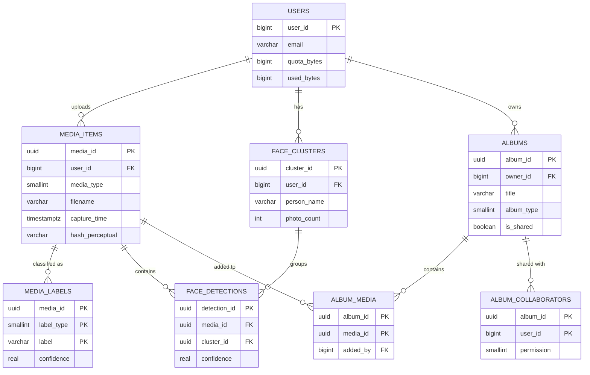
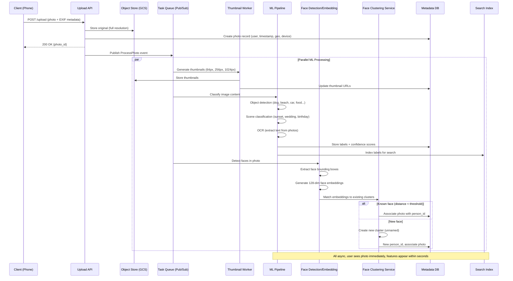
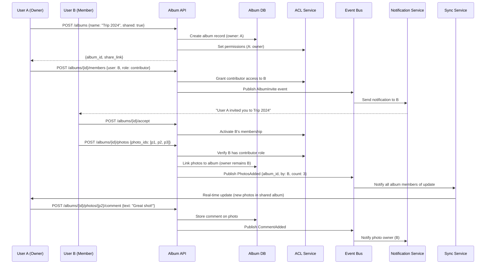
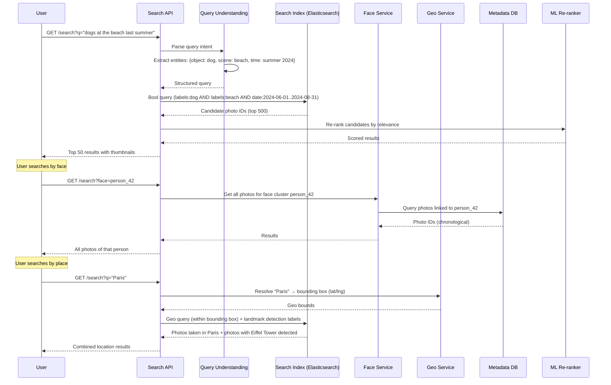

# Google Photos - System Design

## 1. Functional Requirements

1. **Photo/Video Upload**: Upload photos and videos from mobile/web/desktop with background sync
2. **Automatic Organization**: ML-based clustering by faces, places, things, dates
3. **Search by Content**: Natural language search ("dog at beach", "birthday cake")
4. **Shared Albums**: Collaborative albums with permissions
5. **Memories/Highlights**: Auto-generated compilations (On This Day, Recent Highlights)
6. **Storage Management**: Quality tiers (Original, Storage Saver, Express), quota tracking
7. **Editing Tools**: Crop, filters, adjustments, magic eraser, HDR

## 2. Non-Functional Requirements

| Requirement | Target |
|---|---|
| Upload Latency | < 3s for 5MB photo on 4G |
| Search Latency | P99 < 500ms |
| ML Classification | < 30s after upload |
| Availability | 99.99% |
| Durability | 99.999999999% (11 nines) |
| Scale | 1.5B users, 4B photos/day |
| Storage | Multi-region, geo-redundant |

## 3. Capacity Estimation

### Traffic
- DAU: 500M users
- Uploads: 4B photos/day = ~46K photos/sec
- Average photo size: 3MB (original), 500KB (compressed)
- Video uploads: 200M/day, avg 30MB each
- Search queries: 1B/day = ~11.5K QPS
- Downloads/Views: 10B/day = ~115K QPS

### Storage
- Daily photo storage: 4B × 3MB = 12PB/day (original)
- Daily video storage: 200M × 30MB = 6PB/day
- Total daily: ~18PB/day
- Compressed storage (Storage Saver): ~6PB/day
- Annual: ~6.5EB
- Thumbnails: 4B × 3 sizes × 50KB = 600TB/day

### Bandwidth
- Ingress: 18PB/day = ~1.7Tbps
- Egress (views + downloads): ~5Tbps
- CDN offload: 80% = 1Tbps from origin

### Compute
- ML Classification: 46K photos/sec × 200ms GPU = ~9,200 GPU-seconds/sec → ~10K GPUs
- Transcoding: 200M videos × 5 min avg = ~700K GPU-hours/day

## 4. Data Modeling

### Entity-Relationship Diagram



### PostgreSQL - User & Album Metadata

```sql
-- Users table
CREATE TABLE users (
    user_id         BIGINT PRIMARY KEY,
    email           VARCHAR(255) UNIQUE NOT NULL,
    display_name    VARCHAR(100),
    storage_tier    SMALLINT DEFAULT 1, -- 1=Original, 2=StorageSaver, 3=Express
    quota_bytes     BIGINT DEFAULT 15737418240, -- 15GB free
    used_bytes      BIGINT DEFAULT 0,
    created_at      TIMESTAMPTZ DEFAULT NOW(),
    updated_at      TIMESTAMPTZ DEFAULT NOW()
);
CREATE INDEX idx_users_email ON users(email);

-- Media items
CREATE TABLE media_items (
    media_id        UUID PRIMARY KEY DEFAULT gen_random_uuid(),
    user_id         BIGINT NOT NULL REFERENCES users(user_id),
    media_type      SMALLINT NOT NULL, -- 1=photo, 2=video, 3=gif
    filename        VARCHAR(512),
    mime_type        VARCHAR(100),
    size_bytes      BIGINT NOT NULL,
    width           INT,
    height          INT,
    duration_ms     INT, -- for videos
    capture_time    TIMESTAMPTZ,
    upload_time     TIMESTAMPTZ DEFAULT NOW(),
    storage_path    VARCHAR(1024) NOT NULL,
    thumbnail_path  VARCHAR(1024),
    is_deleted      BOOLEAN DEFAULT FALSE,
    deleted_at      TIMESTAMPTZ,
    exif_data       JSONB,
    geo_lat         DOUBLE PRECISION,
    geo_lng         DOUBLE PRECISION,
    geo_place_id    VARCHAR(100),
    hash_perceptual VARCHAR(64), -- pHash for dedup
    hash_sha256     VARCHAR(64),
    quality_tier    SMALLINT DEFAULT 1,
    CONSTRAINT fk_user FOREIGN KEY (user_id) REFERENCES users(user_id)
);
CREATE INDEX idx_media_user_time ON media_items(user_id, capture_time DESC);
CREATE INDEX idx_media_user_upload ON media_items(user_id, upload_time DESC);
CREATE INDEX idx_media_phash ON media_items(hash_perceptual);
CREATE INDEX idx_media_sha ON media_items(hash_sha256);
CREATE INDEX idx_media_geo ON media_items USING GIST (
    ST_SetSRID(ST_MakePoint(geo_lng, geo_lat), 4326)
);
CREATE INDEX idx_media_deleted ON media_items(user_id, is_deleted) WHERE is_deleted = TRUE;

-- ML Classifications
CREATE TABLE media_labels (
    media_id        UUID NOT NULL REFERENCES media_items(media_id),
    label_type      SMALLINT NOT NULL, -- 1=object, 2=scene, 3=activity, 4=text(OCR)
    label           VARCHAR(200) NOT NULL,
    confidence      REAL NOT NULL,
    bounding_box    JSONB, -- {x, y, w, h} normalized
    PRIMARY KEY (media_id, label_type, label)
);
CREATE INDEX idx_labels_lookup ON media_labels(label, confidence DESC);

-- Face clusters
CREATE TABLE face_clusters (
    cluster_id      UUID PRIMARY KEY DEFAULT gen_random_uuid(),
    user_id         BIGINT NOT NULL,
    person_name     VARCHAR(200),
    representative_embedding VECTOR(512),
    photo_count     INT DEFAULT 0,
    created_at      TIMESTAMPTZ DEFAULT NOW()
);
CREATE INDEX idx_face_clusters_user ON face_clusters(user_id);
CREATE INDEX idx_face_embedding ON face_clusters USING ivfflat (representative_embedding vector_cosine_ops);

-- Face detections
CREATE TABLE face_detections (
    detection_id    UUID PRIMARY KEY DEFAULT gen_random_uuid(),
    media_id        UUID NOT NULL REFERENCES media_items(media_id),
    cluster_id      UUID REFERENCES face_clusters(cluster_id),
    embedding       VECTOR(512),
    bounding_box    JSONB NOT NULL,
    confidence      REAL NOT NULL,
    created_at      TIMESTAMPTZ DEFAULT NOW()
);
CREATE INDEX idx_face_det_media ON face_detections(media_id);
CREATE INDEX idx_face_det_cluster ON face_detections(cluster_id);

-- Albums
CREATE TABLE albums (
    album_id        UUID PRIMARY KEY DEFAULT gen_random_uuid(),
    owner_id        BIGINT NOT NULL REFERENCES users(user_id),
    title           VARCHAR(500),
    cover_media_id  UUID,
    album_type      SMALLINT DEFAULT 1, -- 1=manual, 2=shared, 3=auto_generated
    is_shared       BOOLEAN DEFAULT FALSE,
    share_token     VARCHAR(64) UNIQUE,
    created_at      TIMESTAMPTZ DEFAULT NOW(),
    updated_at      TIMESTAMPTZ DEFAULT NOW()
);
CREATE INDEX idx_albums_owner ON albums(owner_id, updated_at DESC);

-- Album membership
CREATE TABLE album_media (
    album_id        UUID NOT NULL REFERENCES albums(album_id),
    media_id        UUID NOT NULL REFERENCES media_items(media_id),
    added_at        TIMESTAMPTZ DEFAULT NOW(),
    added_by        BIGINT NOT NULL,
    PRIMARY KEY (album_id, media_id)
);

-- Album sharing
CREATE TABLE album_collaborators (
    album_id        UUID NOT NULL REFERENCES albums(album_id),
    user_id         BIGINT NOT NULL REFERENCES users(user_id),
    permission      SMALLINT DEFAULT 1, -- 1=view, 2=contribute, 3=edit
    joined_at       TIMESTAMPTZ DEFAULT NOW(),
    PRIMARY KEY (album_id, user_id)
);

-- Memories
CREATE TABLE memories (
    memory_id       UUID PRIMARY KEY DEFAULT gen_random_uuid(),
    user_id         BIGINT NOT NULL,
    memory_type     SMALLINT NOT NULL, -- 1=on_this_day, 2=recent_highlight, 3=trip, 4=people
    title           VARCHAR(500),
    media_ids       UUID[] NOT NULL,
    date_range_start TIMESTAMPTZ,
    date_range_end  TIMESTAMPTZ,
    is_viewed       BOOLEAN DEFAULT FALSE,
    created_at      TIMESTAMPTZ DEFAULT NOW(),
    expires_at      TIMESTAMPTZ
);
CREATE INDEX idx_memories_user ON memories(user_id, created_at DESC);
```

### Elasticsearch - Search Index

```json
{
  "mappings": {
    "properties": {
      "media_id": { "type": "keyword" },
      "user_id": { "type": "long" },
      "capture_time": { "type": "date" },
      "labels": {
        "type": "nested",
        "properties": {
          "label": { "type": "text", "fields": { "keyword": { "type": "keyword" } } },
          "type": { "type": "keyword" },
          "confidence": { "type": "float" }
        }
      },
      "ocr_text": { "type": "text", "analyzer": "standard" },
      "faces": { "type": "keyword" },
      "place_name": { "type": "text" },
      "geo_location": { "type": "geo_point" },
      "embedding": { "type": "dense_vector", "dims": 768, "index": true, "similarity": "cosine" }
    }
  }
}
```

## 5. High-Level Design

```
┌─────────────────────────────────────────────────────────────────────────────────┐
│                              CLIENTS                                              │
│  ┌──────────┐  ┌──────────┐  ┌──────────┐  ┌──────────┐                        │
│  │ Android  │  │   iOS    │  │   Web    │  │ Desktop  │                        │
│  └────┬─────┘  └────┬─────┘  └────┬─────┘  └────┬─────┘                        │
└───────┼──────────────┼──────────────┼──────────────┼────────────────────────────┘
        │              │              │              │
        ▼              ▼              ▼              ▼
┌─────────────────────────────────────────────────────────────────────────────────┐
│                         EDGE / CDN LAYER                                         │
│  ┌──────────────────┐  ┌──────────────────┐  ┌──────────────────┐              │
│  │  CloudFront CDN  │  │  Upload Proxy    │  │  Image Resizer   │              │
│  │  (thumbnails,    │  │  (resumable      │  │  (on-the-fly     │              │
│  │   cached media)  │  │   uploads, TUS)  │  │   transforms)    │              │
│  └────────┬─────────┘  └────────┬─────────┘  └────────┬─────────┘              │
└───────────┼──────────────────────┼──────────────────────┼────────────────────────┘
            │                      │                      │
            ▼                      ▼                      ▼
┌─────────────────────────────────────────────────────────────────────────────────┐
│                         API GATEWAY / LOAD BALANCER                               │
│  ┌──────────────────────────────────────────────────────────────┐               │
│  │  Rate Limiting │ Auth (OAuth2) │ Request Routing │ CORS      │               │
│  └──────────────────────────────────────────────────────────────┘               │
└─────────────────────────────────────────┬───────────────────────────────────────┘
                                          │
        ┌─────────────────┬───────────────┼───────────────┬─────────────────┐
        ▼                 ▼               ▼               ▼                 ▼
┌──────────────┐ ┌──────────────┐ ┌──────────────┐ ┌──────────────┐ ┌───────────┐
│Upload Service│ │ Media Service│ │Search Service│ │Album Service │ │Memory Svc │
│              │ │              │ │              │ │              │ │           │
│- Chunked     │ │- CRUD        │ │- NL query    │ │- Create/     │ │- Generate │
│  upload      │ │- Metadata    │ │  parsing     │ │  share       │ │- Curate   │
│- Dedup check │ │- Thumbnails  │ │- ES query    │ │- Permissions │ │- Notify   │
│- Quota check │ │- Transforms  │ │- Vector      │ │- Activity    │ │           │
│- S3 multipart│ │- Download    │ │  search      │ │  feed        │ │           │
└──────┬───────┘ └──────┬───────┘ └──────┬───────┘ └──────┬───────┘ └─────┬─────┘
       │                │                │                │               │
       ▼                ▼                ▼                ▼               ▼
┌─────────────────────────────────────────────────────────────────────────────────┐
│                         MESSAGE QUEUE (Kafka)                                     │
│  ┌────────────┐ ┌────────────┐ ┌────────────┐ ┌────────────┐                   │
│  │upload.events│ │ml.classify │ │index.update│ │memory.gen  │                   │
│  └─────┬──────┘ └─────┬──────┘ └─────┬──────┘ └─────┬──────┘                   │
└────────┼───────────────┼───────────────┼───────────────┼─────────────────────────┘
         │               │               │               │
         ▼               ▼               ▼               ▼
┌─────────────────────────────────────────────────────────────────────────────────┐
│                    ML CLASSIFICATION PIPELINE                                     │
│  ┌────────────┐ ┌────────────┐ ┌────────────┐ ┌────────────┐ ┌──────────────┐  │
│  │Face Detect │ │Object Det  │ │Scene Recog │ │OCR Engine  │ │Geo Reverse   │  │
│  │& Cluster   │ │(YOLO/DETR) │ │(ResNet)    │ │(Tesseract) │ │Geocode       │  │
│  │(ArcFace)   │ │            │ │            │ │            │ │              │  │
│  └────────────┘ └────────────┘ └────────────┘ └────────────┘ └──────────────┘  │
└─────────────────────────────────────────────────────────────────────────────────┘
         │
         ▼
┌─────────────────────────────────────────────────────────────────────────────────┐
│                         DATA STORES                                               │
│  ┌──────────┐ ┌──────────┐ ┌──────────┐ ┌──────────┐ ┌──────────┐             │
│  │PostgreSQL│ │   S3     │ │Elastic   │ │  Redis   │ │ pgvector │             │
│  │(metadata)│ │(objects) │ │search    │ │(cache)   │ │(embeddings│             │
│  │Sharded by│ │Multi-tier│ │(labels,  │ │(quota,   │ │ face     │             │
│  │user_id   │ │IA/Glacier│ │OCR text) │ │ session) │ │ clusters)│             │
│  └──────────┘ └──────────┘ └──────────┘ └──────────┘ └──────────┘             │
└─────────────────────────────────────────────────────────────────────────────────┘
```

## 6. Low-Level Design - API Specifications

### Upload API

```
POST /api/v1/upload/initiate
Request:
{
  "filename": "IMG_20240101.heic",
  "size_bytes": 4521984,
  "mime_type": "image/heic",
  "sha256": "a1b2c3...",
  "capture_time": "2024-01-01T10:30:00Z",
  "geo": { "lat": 37.7749, "lng": -122.4194 }
}
Response: 200
{
  "upload_id": "up_abc123",
  "upload_url": "https://upload.photos.example.com/tus/up_abc123",
  "chunk_size": 5242880,
  "dedup_status": "unique", // or "duplicate" with existing media_id
  "expires_at": "2024-01-01T11:30:00Z"
}

POST /api/v1/upload/{upload_id}/complete
Request:
{
  "upload_id": "up_abc123",
  "parts": [
    { "part_number": 1, "etag": "etag1" },
    { "part_number": 2, "etag": "etag2" }
  ]
}
Response: 201
{
  "media_id": "550e8400-e29b-41d4-a716-446655440000",
  "status": "processing",
  "thumbnail_url": "https://cdn.photos.example.com/thumb/550e8400..."
}
```

### Search API

```
GET /api/v1/search?q=dog+at+beach&user_id=123&limit=50&cursor=eyJ...
Response: 200
{
  "results": [
    {
      "media_id": "550e8400...",
      "thumbnail_url": "https://cdn.../thumb/550e8400...",
      "capture_time": "2023-07-15T14:20:00Z",
      "relevance_score": 0.95,
      "matched_labels": ["dog", "beach", "ocean"]
    }
  ],
  "cursor": "eyJ...",
  "total_estimate": 234
}
```

### Media Retrieval API

```
GET /api/v1/media/{media_id}?size=full|thumbnail|medium
Response: 200
{
  "media_id": "550e8400...",
  "url": "https://cdn.../media/550e8400...?token=xyz&expires=1704110400",
  "metadata": {
    "width": 4032,
    "height": 3024,
    "capture_time": "2024-01-01T10:30:00Z",
    "camera": "iPhone 15 Pro",
    "location": { "lat": 37.7749, "lng": -122.4194, "name": "San Francisco, CA" }
  },
  "labels": ["sunset", "city", "skyline"],
  "faces": [{ "cluster_id": "fc_001", "name": "Alice", "bbox": [0.2, 0.3, 0.15, 0.2] }]
}
```

### Album APIs

```
POST /api/v1/albums
Request:
{
  "title": "Summer 2024",
  "media_ids": ["id1", "id2"],
  "shared_with": [{ "user_id": 456, "permission": "contribute" }]
}
Response: 201
{
  "album_id": "alb_xyz",
  "share_link": "https://photos.example.com/shared/alb_xyz?token=abc"
}
```

## 7. Deep Dive: ML Classification Pipeline

### Face Clustering Algorithm

```python
import numpy as np
from sklearn.cluster import DBSCAN
from collections import defaultdict

class FaceClusteringPipeline:
    """
    Incremental face clustering using ArcFace embeddings + DBSCAN.
    Handles billions of faces per user with online updates.
    """
    
    SIMILARITY_THRESHOLD = 0.72  # cosine similarity threshold
    MIN_CLUSTER_SIZE = 3
    EMBEDDING_DIM = 512
    
    def __init__(self, user_id: str, vector_db):
        self.user_id = user_id
        self.vector_db = vector_db  # pgvector connection
    
    def detect_and_embed(self, image: np.ndarray) -> list[dict]:
        """Detect faces and generate embeddings."""
        # MTCNN for detection, ArcFace for embedding
        faces = self.face_detector.detect(image)
        results = []
        for face in faces:
            aligned = self.align_face(face.bbox, image)
            embedding = self.arcface_model.encode(aligned)  # 512-dim vector
            results.append({
                'bbox': face.bbox,
                'confidence': face.confidence,
                'embedding': embedding / np.linalg.norm(embedding)  # L2 normalize
            })
        return results
    
    def assign_to_cluster(self, embedding: np.ndarray) -> tuple[str, float]:
        """
        Assign a face embedding to existing cluster or create new one.
        Uses approximate nearest neighbor search via pgvector.
        """
        # Query top-5 nearest cluster centroids
        results = self.vector_db.query(
            f"""
            SELECT cluster_id, person_name, representative_embedding,
                   1 - (representative_embedding <=> %s::vector) as similarity
            FROM face_clusters
            WHERE user_id = %s
            ORDER BY representative_embedding <=> %s::vector
            LIMIT 5
            """,
            (embedding.tolist(), self.user_id, embedding.tolist())
        )
        
        if results and results[0]['similarity'] >= self.SIMILARITY_THRESHOLD:
            # Assign to existing cluster
            cluster = results[0]
            self._update_centroid(cluster['cluster_id'], embedding)
            return cluster['cluster_id'], cluster['similarity']
        else:
            # Buffer for later clustering
            return None, 0.0
    
    def _update_centroid(self, cluster_id: str, new_embedding: np.ndarray):
        """Online centroid update using running average."""
        # Exponential moving average for centroid
        alpha = 0.01  # slow update to prevent drift
        current = self.vector_db.get_centroid(cluster_id)
        updated = (1 - alpha) * current + alpha * new_embedding
        updated = updated / np.linalg.norm(updated)
        self.vector_db.update_centroid(cluster_id, updated)
    
    def batch_recluster(self, unassigned_embeddings: list[np.ndarray]):
        """Periodic batch re-clustering for unassigned faces."""
        if len(unassigned_embeddings) < self.MIN_CLUSTER_SIZE:
            return []
        
        # Compute pairwise cosine distance matrix
        embeddings_matrix = np.array(unassigned_embeddings)
        similarity_matrix = embeddings_matrix @ embeddings_matrix.T
        distance_matrix = 1 - similarity_matrix
        
        # DBSCAN clustering
        clustering = DBSCAN(
            eps=1 - self.SIMILARITY_THRESHOLD,
            min_samples=self.MIN_CLUSTER_SIZE,
            metric='precomputed'
        ).fit(distance_matrix)
        
        new_clusters = []
        for label in set(clustering.labels_) - {-1}:
            mask = clustering.labels_ == label
            cluster_embeddings = embeddings_matrix[mask]
            centroid = cluster_embeddings.mean(axis=0)
            centroid = centroid / np.linalg.norm(centroid)
            new_clusters.append({
                'centroid': centroid,
                'size': mask.sum(),
                'member_indices': np.where(mask)[0].tolist()
            })
        
        return new_clusters


class ObjectDetectionPipeline:
    """Multi-model ensemble for rich photo labeling."""
    
    MODELS = {
        'objects': 'yolov8x',        # 80 COCO classes
        'scenes': 'places365',        # 365 scene categories
        'activities': 'kinetics700',  # for video
        'food': 'food101',
        'landmarks': 'google_landmarks_v2'
    }
    
    CONFIDENCE_THRESHOLDS = {
        'objects': 0.4,
        'scenes': 0.3,
        'activities': 0.5,
        'food': 0.6,
        'landmarks': 0.7
    }
    
    def classify(self, image: np.ndarray) -> list[dict]:
        """Run all classification models and merge results."""
        all_labels = []
        
        # Object detection (YOLO)
        objects = self.yolo.predict(image, conf=0.4)
        for det in objects:
            all_labels.append({
                'type': 'object',
                'label': det.class_name,
                'confidence': det.confidence,
                'bbox': det.bbox.tolist()
            })
        
        # Scene recognition (Places365)
        scene_probs = self.places365.predict(image)
        top_scenes = scene_probs.topk(5)
        for label, conf in top_scenes:
            if conf >= 0.3:
                all_labels.append({
                    'type': 'scene',
                    'label': label,
                    'confidence': conf
                })
        
        # OCR
        ocr_results = self.ocr_engine.detect(image)
        if ocr_results.text.strip():
            all_labels.append({
                'type': 'text',
                'label': ocr_results.text,
                'confidence': ocr_results.confidence,
                'bbox': ocr_results.bbox
            })
        
        return all_labels
```

### Perceptual Hashing for Deduplication

```python
import imagehash
from PIL import Image
import numpy as np

class DeduplicationEngine:
    """
    Multi-level deduplication:
    1. SHA-256 for exact duplicates (byte-identical)
    2. pHash for perceptually similar (resized, re-encoded)
    3. Embedding similarity for near-duplicates (cropped, filtered)
    """
    
    PHASH_THRESHOLD = 8  # Hamming distance <= 8 = likely duplicate
    EMBEDDING_THRESHOLD = 0.95  # cosine similarity
    
    def compute_phash(self, image_path: str) -> str:
        """Compute 64-bit perceptual hash."""
        img = Image.open(image_path)
        return str(imagehash.phash(img, hash_size=16))  # 256-bit for accuracy
    
    def compute_dhash(self, image_path: str) -> str:
        """Difference hash - more robust to brightness changes."""
        img = Image.open(image_path).resize((17, 16)).convert('L')
        pixels = np.array(img)
        # Compare adjacent pixels
        diff = pixels[:, 1:] > pixels[:, :-1]
        return ''.join(['1' if b else '0' for b in diff.flatten()])
    
    def check_duplicate(self, user_id: str, sha256: str, phash: str) -> dict:
        """
        Three-stage dedup check:
        Stage 1: Exact SHA-256 match → instant dedup
        Stage 2: pHash Hamming distance → likely duplicate
        Stage 3: CLIP embedding similarity → visual duplicate
        """
        # Stage 1: Exact match
        exact = self.db.query(
            "SELECT media_id FROM media_items WHERE user_id=%s AND hash_sha256=%s",
            (user_id, sha256)
        )
        if exact:
            return {'status': 'exact_duplicate', 'existing_id': exact[0]['media_id']}
        
        # Stage 2: Perceptual hash (using VP-tree for efficient search)
        # Store pHash as bigint, use BK-tree index for Hamming distance
        candidates = self.phash_index.search(phash, max_distance=self.PHASH_THRESHOLD)
        if candidates:
            return {
                'status': 'perceptual_duplicate',
                'existing_id': candidates[0]['media_id'],
                'distance': candidates[0]['distance']
            }
        
        return {'status': 'unique'}
    
    def hamming_distance(self, hash1: str, hash2: str) -> int:
        """Compute Hamming distance between two hex hash strings."""
        h1 = int(hash1, 16)
        h2 = int(hash2, 16)
        xor = h1 ^ h2
        return bin(xor).count('1')
```

### Storage Optimization

```python
class StorageOptimizer:
    """
    Manages multi-tier storage with format optimization.
    
    Tiers:
    - Hot: S3 Standard (recent 30 days, frequently accessed)
    - Warm: S3 IA (30-180 days, occasional access)
    - Cold: S3 Glacier Instant (180+ days, rare access)
    - Archive: S3 Glacier Deep (deleted items in trash, 60 days)
    """
    
    FORMAT_SAVINGS = {
        'heif_from_jpeg': 0.50,  # 50% smaller
        'avif_from_jpeg': 0.60,  # 60% smaller
        'webp_from_png': 0.45,   # 45% smaller
    }
    
    QUALITY_TIERS = {
        'original': {'max_pixels': None, 'quality': 100, 'format': 'original'},
        'storage_saver': {'max_pixels': 16_000_000, 'quality': 85, 'format': 'heif'},
        'express': {'max_pixels': 3_000_000, 'quality': 75, 'format': 'webp'},
    }
    
    def optimize_for_tier(self, media_id: str, quality_tier: str) -> dict:
        """Compress/transcode media based on user's storage tier setting."""
        config = self.QUALITY_TIERS[quality_tier]
        
        original = self.storage.get(media_id)
        width, height = original.dimensions
        total_pixels = width * height
        
        if config['max_pixels'] and total_pixels > config['max_pixels']:
            scale = (config['max_pixels'] / total_pixels) ** 0.5
            new_width = int(width * scale)
            new_height = int(height * scale)
        else:
            new_width, new_height = width, height
        
        # Transcode
        optimized = self.transcoder.convert(
            original,
            width=new_width,
            height=new_height,
            format=config['format'],
            quality=config['quality']
        )
        
        savings = 1 - (optimized.size / original.size)
        return {
            'original_size': original.size,
            'optimized_size': optimized.size,
            'savings_pct': savings * 100,
            'new_dimensions': (new_width, new_height)
        }
    
    def lifecycle_transition(self, media_id: str, current_tier: str, target_tier: str):
        """Move media between storage tiers based on access patterns."""
        transition_map = {
            ('hot', 'warm'): 's3_ia',
            ('warm', 'cold'): 's3_glacier_instant',
            ('cold', 'archive'): 's3_glacier_deep'
        }
        
        target_class = transition_map[(current_tier, target_tier)]
        self.s3.copy_object(
            CopySource={'Bucket': 'photos-store', 'Key': f'{media_id}/original'},
            Bucket='photos-store',
            Key=f'{media_id}/original',
            StorageClass=target_class
        )
```

## 8. Component Optimization

### Kafka Configuration

```yaml
# Upload event processing
upload-events:
  partitions: 256  # Partition by user_id for ordering
  replication_factor: 3
  retention_ms: 604800000  # 7 days
  max_message_bytes: 1048576
  compression: lz4

# ML classification pipeline
ml-classify:
  partitions: 512  # High parallelism for GPU workers
  replication_factor: 3
  retention_ms: 259200000  # 3 days
  
# Consumer config for ML workers
ml_consumer:
  max_poll_records: 10  # Small batches for GPU processing
  session_timeout_ms: 60000
  max_poll_interval_ms: 300000  # Allow 5 min for GPU inference
  auto_offset_reset: earliest
```

### Redis Caching Strategy

```yaml
# User quota cache
user_quota:
  key_pattern: "quota:{user_id}"
  ttl: 300  # 5 min TTL, write-through on upload
  structure: HASH
  fields: [used_bytes, quota_bytes, photo_count]

# Recent media timeline cache
timeline:
  key_pattern: "timeline:{user_id}:{year_month}"
  ttl: 3600
  structure: SORTED_SET  # score = capture_timestamp
  max_entries: 1000

# Search result cache
search:
  key_pattern: "search:{user_id}:{query_hash}"
  ttl: 600
  structure: STRING (JSON)
  
# Face cluster centroids (hot)
face_centroids:
  key_pattern: "faces:{user_id}"
  ttl: 86400
  structure: HASH  # field=cluster_id, value=embedding_bytes

# Memory: 
#   500M users × ~2KB avg = ~1TB Redis cluster
#   Sharded across 100 nodes
```

### CDN Configuration

```yaml
cloudfront:
  behaviors:
    thumbnails:
      path_pattern: "/thumb/*"
      ttl: 86400  # 24h
      compress: true
      origin: s3-thumbnails
      viewer_protocol_policy: https-only
      
    media_full:
      path_pattern: "/media/*"
      ttl: 3600  # 1h (signed URLs)
      origin: s3-originals
      trusted_signers: [upload-service]
      
    resized:
      path_pattern: "/resize/*"
      ttl: 604800  # 7 days
      origin: lambda@edge-resizer
      origin_request_policy: image-resize
      
  # Lambda@Edge for on-the-fly resize
  lambda_edge:
    origin_request:
      runtime: nodejs18.x
      memory: 1024
      timeout: 10
      # Parses ?w=400&h=300&fit=cover from URL
```

### S3 Storage Tiers & Sharding

```yaml
buckets:
  photos-hot:
    storage_class: STANDARD
    lifecycle:
      - transition_after_days: 30
        to: STANDARD_IA
      - transition_after_days: 180
        to: GLACIER_INSTANT_RETRIEVAL
    
  # Key design: {user_id_prefix}/{user_id}/{media_id}/{variant}
  # Prefix = first 4 chars of MD5(user_id) for even distribution
  key_pattern: "{hash_prefix}/{user_id}/{media_id}/{original|thumb_sm|thumb_md|thumb_lg}"
  
  # Partitioning: 65K prefixes ensure no S3 partition hotspot
  # Each prefix handles ~3,500 req/s → total 230M req/s capacity
```

## 9. Observability

### Key Metrics

```yaml
metrics:
  business:
    - photos_uploaded_total (counter, labels: format, source)
    - photos_classified_total (counter, labels: model)
    - search_queries_total (counter, labels: result_count_bucket)
    - storage_bytes_by_tier (gauge, labels: tier, user_segment)
    - dedup_savings_bytes (counter)
    
  latency:
    - upload_duration_seconds (histogram, labels: size_bucket)
    - classification_duration_seconds (histogram, labels: model)
    - search_latency_seconds (histogram, labels: query_type)
    - thumbnail_generation_seconds (histogram)
    
  infrastructure:
    - gpu_utilization_percent (gauge, labels: model, instance)
    - kafka_consumer_lag (gauge, labels: topic, group)
    - s3_request_latency_seconds (histogram, labels: operation)
    - redis_hit_rate (gauge, labels: cache_name)
    - elasticsearch_query_latency (histogram)

alerts:
  - name: HighClassificationLag
    expr: kafka_consumer_lag{topic="ml-classify"} > 100000
    for: 5m
    severity: warning
    
  - name: UploadErrorRate
    expr: rate(upload_errors_total[5m]) / rate(uploads_total[5m]) > 0.01
    for: 2m
    severity: critical
    
  - name: GPUMemoryExhaustion
    expr: gpu_memory_used_bytes / gpu_memory_total_bytes > 0.95
    for: 1m
    severity: critical
```

### Distributed Tracing

```
Upload Flow Trace:
client → upload-proxy (100ms) → dedup-check (20ms) → s3-multipart (2s) 
  → kafka-produce (5ms) → [async] ml-pipeline (15s)
    → face-detect (3s) → object-detect (2s) → scene-recog (1s) → ocr (2s)
    → index-update (200ms) → notification (50ms)
```

## 10. Key Considerations & Trade-offs

| Decision | Choice | Trade-off |
|---|---|---|
| Storage format | HEIF/AVIF | 50% savings vs. browser compatibility |
| Face clustering | Online + periodic batch | Fast assignment vs. accuracy |
| Search index | Elasticsearch + pgvector | Rich text search vs. operational complexity |
| Dedup strategy | Client-side hash + server pHash | Upload savings vs. CPU cost |
| ML pipeline | Async post-upload | User sees results delayed 15-30s |
| Thumbnail generation | Eager (3 sizes on upload) | Storage cost vs. latency on view |
| Sharding | By user_id | Simple queries vs. cross-user features |
| Consistency | Eventual for ML labels | Fast uploads vs. immediate searchability |
| Video transcoding | Chunk-parallel + GPU | Cost vs. speed for 4K/8K |
| CDN | Signed URLs with short TTL | Security vs. cache hit rate |

### Scaling Considerations

1. **Hot users** (influencers with millions of photos): Dedicated shards, pre-warmed caches
2. **Burst uploads** (event photos, travel): Auto-scaling upload workers, queue backpressure
3. **ML model updates**: Blue-green deployment, re-classification pipeline for improved models
4. **Cross-region sync**: CRDTs for album metadata, async replication for media objects
5. **Cost optimization**: Aggressive lifecycle policies, user-driven quality tier selection

---

## Sequence Diagrams

### 1. Photo Upload + ML Classification + Face Clustering



### 2. Shared Album Collaboration



### 3. Search by Content / Face / Place



---

## Expanded Async Processing

### Async Pipeline Details

Google Photos relies heavily on async processing for all computationally expensive operations:

**Upload Processing Pipeline (Pub/Sub → Cloud Tasks)**:
1. Photo uploaded → immediate ACK to client
2. Fan-out to parallel workers:
   - Thumbnail generation (3 sizes) — ~200ms
   - EXIF parsing + geo-reverse-coding — ~50ms
   - ML classification (object/scene/OCR) — ~500ms
   - Face detection + embedding — ~300ms
   - Face cluster matching — ~200ms
   - Duplicate detection (perceptual hash) — ~100ms
3. Each worker independently updates metadata DB + search index
4. Failures retry with exponential backoff (max 5 attempts)
5. Dead-letter queue for persistent failures → manual investigation

**Face Re-clustering (Periodic Batch)**:
- As new photos arrive, face clusters may need merging/splitting
- Nightly batch job: re-run DBSCAN on all embeddings per user
- Merge clusters if centroid distance < threshold
- Split clusters if intra-cluster variance exceeds limit
- User-confirmed merges/splits are constraints in the algorithm

**Storage Optimization (Background)**:
- Deduplication: perceptual hash comparison, keep one copy + pointers
- Quality tiering: after 60 days, move originals to cold storage (Nearline → Coldline)
- "Storage saver" re-encoding: background HEIF conversion for users opting in
- All async, invisible to user, reversible if user changes settings
