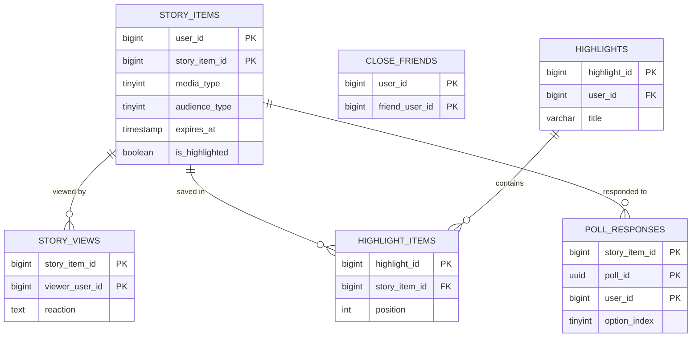
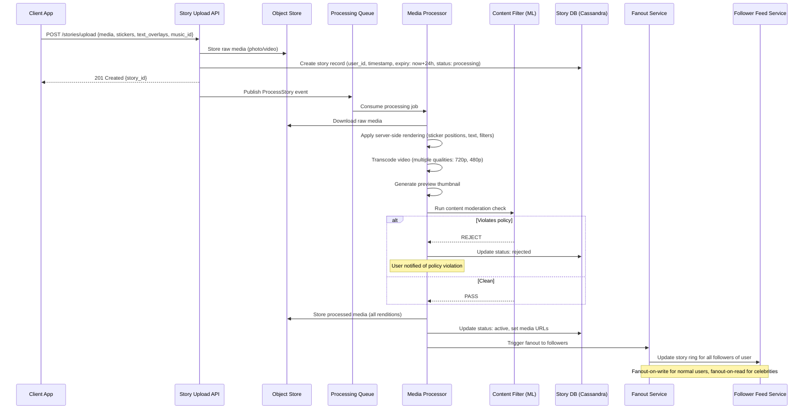
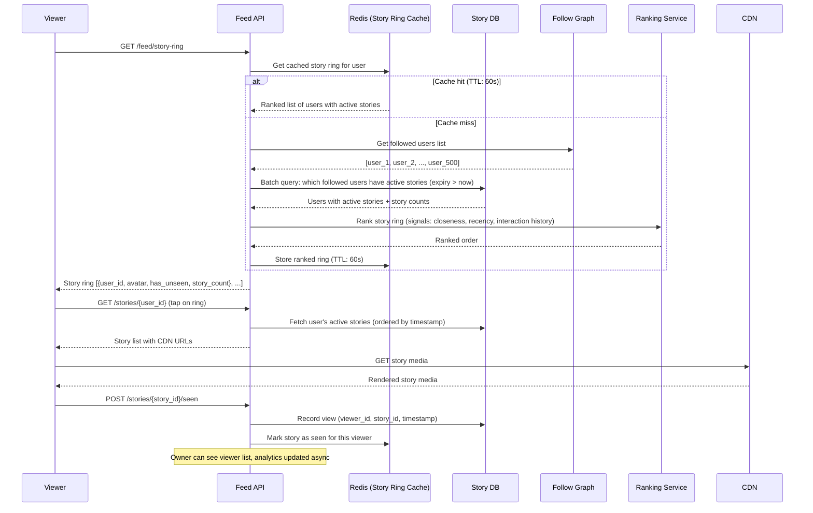
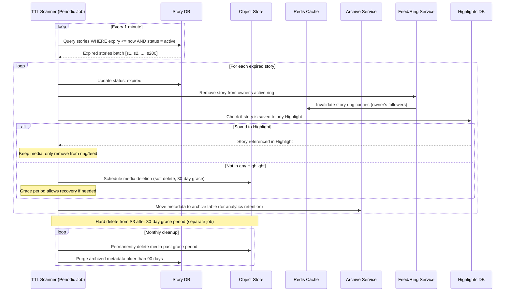

# Instagram Stories / Ephemeral Media Platform — System Design

## 1. Problem Statement

Design a system like Instagram Stories that supports 24-hour expiring content with rich interactive overlays (stickers, polls, questions), close friends lists, story highlights, view tracking, and cross-posting to Facebook.

---

## 2. Functional Requirements

| ID | Requirement |
|----|-------------|
| FR-1 | Users can upload photo/video stories (max 15s video, 1080x1920) |
| FR-2 | Stories expire automatically after 24 hours |
| FR-3 | Support stickers, text overlays, polls, questions, countdowns |
| FR-4 | Close friends list — restrict story visibility |
| FR-5 | Story highlights — persist selected stories beyond 24h |
| FR-6 | View tracking — show who viewed each story |
| FR-7 | Cross-post stories to Facebook |
| FR-8 | Story replies (DM-based) |
| FR-9 | Story reactions (emoji reactions) |
| FR-10 | Music/audio overlay support |
| FR-11 | Swipe-up links (verified/business accounts) |
| FR-12 | Story ads injection in feed |

---

## 3. Non-Functional Requirements

| ID | Requirement | Target |
|----|-------------|--------|
| NFR-1 | Upload latency | < 3s for photo, < 8s for video |
| NFR-2 | Story feed load time | < 500ms (P99) |
| NFR-3 | Availability | 99.99% |
| NFR-4 | Deletion guarantee | 100% deleted within 24h + 1h grace |
| NFR-5 | View tracking accuracy | 99.9% (no lost views) |
| NFR-6 | Scale | 500M DAU, 300M stories/day |
| NFR-7 | Storage efficiency | Minimize cost for ephemeral content |
| NFR-8 | Cross-post latency | < 5s to Facebook |

---

## 4. Capacity Estimation

### Traffic
- DAU: 500M users
- Stories created/day: 300M
- Avg story items per story: 3 (900M items/day)
- Story views/day: 50B (avg user views ~100 story items)
- View tracking writes: 50B/day = ~580K writes/sec

### Storage
- Avg photo size: 200KB, video: 2MB
- Mix: 60% photo, 40% video
- Daily ingress: (540M × 200KB) + (360M × 2MB) = 108TB + 720TB = 828TB/day
- 24h retention: ~828TB active at any time (plus highlights)
- Highlights: ~10% stories saved = 82.8TB/day added permanently

### Bandwidth
- Peak read QPS: 50B views / 86400s × 3 (peak factor) = ~1.7M reads/sec
- Egress bandwidth: 1.7M × 500KB avg = 850 GB/s peak

### View Tracking
- 50B view records/day
- Each record: user_id (8B) + story_item_id (8B) + timestamp (8B) = 24 bytes
- Daily: 50B × 24B = 1.2TB/day (TTL after 48h)

---

## 5. Data Modeling

### Entity-Relationship Diagram



### 5.1 Story Item Schema (Cassandra — TTL-based)

```sql
CREATE TABLE story_items (
    user_id         BIGINT,
    story_item_id   BIGINT,          -- Snowflake ID (embeds timestamp)
    media_type      TINYINT,         -- 0=photo, 1=video
    media_url       TEXT,            -- S3 pre-signed URL base
    thumbnail_url   TEXT,
    duration_ms     INT,             -- video duration
    overlays_json   TEXT,            -- stickers, text, polls serialized
    audience_type   TINYINT,         -- 0=public, 1=close_friends, 2=custom
    created_at      TIMESTAMP,
    expires_at      TIMESTAMP,
    is_highlighted  BOOLEAN,
    highlight_id    BIGINT,
    music_track_id  BIGINT,
    link_url        TEXT,            -- swipe-up
    PRIMARY KEY ((user_id), story_item_id)
) WITH CLUSTERING ORDER BY (story_item_id DESC)
  AND default_time_to_live = 90000;  -- 25 hours TTL
```

### 5.2 Story Views (Cassandra — TTL)

```sql
CREATE TABLE story_views (
    story_item_id   BIGINT,
    viewer_user_id  BIGINT,
    viewed_at       TIMESTAMP,
    reaction        TEXT,            -- nullable emoji reaction
    PRIMARY KEY ((story_item_id), viewer_user_id)
) WITH default_time_to_live = 172800;  -- 48h TTL

-- Reverse index: what stories did user X view (for dedup)
CREATE TABLE user_viewed_stories (
    viewer_user_id  BIGINT,
    story_item_id   BIGINT,
    viewed_at       TIMESTAMP,
    PRIMARY KEY ((viewer_user_id), story_item_id)
) WITH default_time_to_live = 172800;
```

### 5.3 View Ring — Bloom Filter / Bitset

```
Key: view_ring:{story_item_id}
Type: Redis Bitmap or Bloom Filter (RedisBloom)
Size: For 1B users, bitmap = 125MB per story (too large)
     → Use Bloom Filter: 1M expected viewers, 0.1% FPR = ~1.8MB per story
     → For viral stories (10M viewers): ~18MB per story
Strategy: Layered — small BF initially, upgrade to larger on threshold
```

### 5.4 Close Friends List (PostgreSQL)

```sql
CREATE TABLE close_friends (
    user_id         BIGINT NOT NULL,
    friend_user_id  BIGINT NOT NULL,
    added_at        TIMESTAMP DEFAULT NOW(),
    PRIMARY KEY (user_id, friend_user_id)
);
CREATE INDEX idx_cf_friend ON close_friends(friend_user_id, user_id);
```

### 5.5 Story Highlights (PostgreSQL)

```sql
CREATE TABLE highlights (
    highlight_id    BIGINT PRIMARY KEY,
    user_id         BIGINT NOT NULL,
    title           VARCHAR(50),
    cover_media_url TEXT,
    created_at      TIMESTAMP DEFAULT NOW(),
    updated_at      TIMESTAMP DEFAULT NOW()
);

CREATE TABLE highlight_items (
    highlight_id    BIGINT REFERENCES highlights(highlight_id),
    story_item_id   BIGINT,
    position        INT,
    added_at        TIMESTAMP DEFAULT NOW(),
    PRIMARY KEY (highlight_id, position)
);
```

### 5.6 Polls & Interactive Elements (Cassandra — TTL)

```sql
CREATE TABLE poll_responses (
    story_item_id   BIGINT,
    poll_id         UUID,
    user_id         BIGINT,
    option_index    TINYINT,
    responded_at    TIMESTAMP,
    PRIMARY KEY ((story_item_id, poll_id), user_id)
) WITH default_time_to_live = 172800;

CREATE TABLE poll_aggregates (
    story_item_id   BIGINT,
    poll_id         UUID,
    option_index    TINYINT,
    vote_count      COUNTER,
    PRIMARY KEY ((story_item_id, poll_id), option_index)
);
```

### 5.7 Story Feed Materialized (Redis)

```
Key: story_feed:{user_id}
Type: Sorted Set
Score: latest story_item timestamp
Member: author_user_id
TTL: 25 hours on each member (approximated via periodic cleanup)
```

---

## 6. High-Level Architecture

```
┌─────────────────────────────────────────────────────────────────────────────────┐
│                              CLIENT (iOS/Android/Web)                             │
│  ┌─────────────┐  ┌──────────────┐  ┌─────────────┐  ┌──────────────────────┐  │
│  │ Story Camera │  │ Story Viewer │  │ Story Tray  │  │ Highlights Browser   │  │
│  └──────┬──────┘  └──────┬───────┘  └──────┬──────┘  └──────────┬───────────┘  │
└─────────┼────────────────┼──────────────────┼────────────────────┼──────────────┘
          │                │                  │                    │
          ▼                ▼                  ▼                    ▼
┌─────────────────────────────────────────────────────────────────────────────────┐
│                              API GATEWAY / CDN                                    │
│                    (CloudFront + ALB + Rate Limiting)                             │
└────────┬───────────────┬────────────────────┬───────────────────┬───────────────┘
         │               │                    │                   │
         ▼               ▼                    ▼                   ▼
┌────────────────┐ ┌───────────────┐ ┌────────────────┐ ┌─────────────────────┐
│ Story Upload   │ │ Story Read    │ │ Story Feed     │ │ Highlights Service  │
│ Service        │ │ Service       │ │ Service        │ │                     │
└───────┬────────┘ └───────┬───────┘ └───────┬────────┘ └──────────┬──────────┘
        │                  │                  │                     │
        ▼                  ▼                  ▼                     ▼
┌─────────────────────────────────────────────────────────────────────────────────┐
│                           SERVICE MESH (Envoy/Istio)                              │
└───┬─────────┬──────────┬──────────┬────────────┬──────────┬─────────────────────┘
    │         │          │          │            │          │
    ▼         ▼          ▼          ▼            ▼          ▼
┌───────┐ ┌───────┐ ┌────────┐ ┌────────┐ ┌─────────┐ ┌──────────┐
│ Media │ │ View  │ │ Feed   │ │ Poll   │ │ Cross   │ │ Expiry   │
│Process│ │Track  │ │Fanout  │ │Service │ │Post Svc │ │ Daemon   │
│Pipeline│ │Service│ │Service │ │        │ │(to FB)  │ │          │
└───┬───┘ └───┬───┘ └───┬────┘ └───┬────┘ └────┬────┘ └────┬─────┘
    │         │          │          │           │           │
    ▼         ▼          ▼          ▼           ▼           ▼
┌─────────────────────────────────────────────────────────────────────────────────┐
│                              DATA LAYER                                           │
│  ┌──────────┐ ┌──────────┐ ┌───────────┐ ┌─────────┐ ┌──────────┐             │
│  │ S3       │ │Cassandra │ │ Redis     │ │PostgreSQL│ │ Kafka    │             │
│  │(media)   │ │(stories, │ │(feed,bloom│ │(users,   │ │(events)  │             │
│  │          │ │ views)   │ │ filters)  │ │highlights│ │          │             │
│  └──────────┘ └──────────┘ └───────────┘ └─────────┘ └──────────┘             │
└─────────────────────────────────────────────────────────────────────────────────┘
```

---

## 7. Deep Dive: Ephemeral Storage (TTL-based S3 Lifecycle)

### 7.1 Storage Architecture

```
┌──────────────────────────────────────────────────────┐
│                S3 Bucket Design                       │
├──────────────────────────────────────────────────────┤
│                                                      │
│  Bucket: stories-ephemeral-{region}                  │
│  Prefix: /{date_YYYYMMDD}/{user_id_shard}/{item_id} │
│                                                      │
│  Lifecycle Rules:                                    │
│  ┌────────────────────────────────────────────────┐  │
│  │ Rule 1: Delete objects after 26 hours          │  │
│  │   - Prefix: / (all)                           │  │
│  │   - Expiration: 26 hours (24h + 2h buffer)   │  │
│  │   - Applied via S3 Lifecycle (daily eval)     │  │
│  │                                               │  │
│  │ Rule 2: Abort incomplete multipart > 1h       │  │
│  │                                               │  │
│  │ Rule 3: Transition to Glacier (highlights)    │  │
│  │   - Tag: highlighted=true → skip deletion     │  │
│  └────────────────────────────────────────────────┘  │
│                                                      │
│  Bucket: stories-highlights-{region}                 │
│  Prefix: /{user_id_shard}/{highlight_id}/{item_id}  │
│  Lifecycle: Standard → IA after 30d → Glacier 90d   │
│                                                      │
└──────────────────────────────────────────────────────┘
```

### 7.2 Efficient Deletion at Scale

S3 lifecycle rules evaluate once/day — insufficient for 24h precision:

```
Strategy: Hybrid Deletion
─────────────────────────
1. DATE-PARTITIONED PREFIXES:
   - Objects stored under /YYYY-MM-DD-HH/ prefix
   - Lifecycle rule deletes entire prefix after 26h
   - Granularity: hourly partitions

2. ACTIVE DELETION DAEMON:
   - Runs continuously, processes deletion queue
   - Kafka topic: story_expirations (keyed by expires_at hour)
   - Consumer groups delete from S3 in batch (DeleteObjects API: 1000/req)
   - Rate: 900M items/day ÷ 24h = 37.5M/hour = ~10.4K deletes/sec
   - With batching: ~11 DeleteObjects calls/sec (trivial)

3. CDN INVALIDATION:
   - CloudFront URLs include expiry in signed URL
   - After expiry, signed URL becomes invalid (no CDN invalidation needed)
   - Edge cache TTL set to 1 hour (content naturally evicts)

4. VERIFICATION SWEEP:
   - Daily sweep compares S3 inventory vs active story DB
   - Deletes any orphaned objects (failure recovery)
```

### 7.3 Cost Optimization

```
┌─────────────────────────────────────────────────────┐
│ Storage Class Selection for Ephemeral Content       │
├─────────────────────────────────────────────────────┤
│                                                     │
│ S3 Standard:                                        │
│   - 828TB × $0.023/GB/mo × (1/30 month) = $634K/day│
│   - PUT: 900M × $0.005/1000 = $4,500/day          │
│   - GET: ~50B × $0.0004/1000 = $20,000/day        │
│                                                     │
│ S3 Express One Zone (lower latency):               │
│   - Higher $/GB but lower request costs            │
│   - Better for hot ephemeral content               │
│                                                     │
│ Optimization: Store media in S3 Express One Zone   │
│ for first 6h (peak views), then S3 Standard for    │
│ remaining 18h via S3 Intelligent-Tiering           │
│                                                     │
└─────────────────────────────────────────────────────┘
```

---

## 8. Deep Dive: View Ring (Bloom Filter / Bitset)

### 8.1 Problem

For each story item, we need to:
1. Show "Seen" indicator on story tray (has user viewed ANY item from author?)
2. Show viewer list to author
3. Prevent duplicate view counts

### 8.2 Architecture

```
┌─────────────────────────────────────────────────────────────────────┐
│                    VIEW TRACKING PIPELINE                             │
├─────────────────────────────────────────────────────────────────────┤
│                                                                      │
│  Client ──► View Event ──► API Gateway                              │
│                                    │                                 │
│                                    ▼                                 │
│                          ┌─────────────────┐                        │
│                          │ View Tracking   │                        │
│                          │ Service         │                        │
│                          └────────┬────────┘                        │
│                                   │                                  │
│                    ┌──────────────┼──────────────┐                  │
│                    ▼              ▼              ▼                   │
│           ┌──────────────┐ ┌──────────┐ ┌────────────────┐         │
│           │ Redis Bloom  │ │ Kafka    │ │ Redis Counter  │         │
│           │ Filter       │ │ (async)  │ │ (view count)   │         │
│           │              │ │          │ │                │         │
│           │ Check if     │ │ Persist  │ │ INCR if new   │         │
│           │ already seen │ │ to C*    │ │                │         │
│           └──────────────┘ └──────────┘ └────────────────┘         │
│                                   │                                  │
│                                   ▼                                  │
│                          ┌─────────────────┐                        │
│                          │ Cassandra       │                        │
│                          │ story_views     │                        │
│                          │ (async write)   │                        │
│                          └─────────────────┘                        │
│                                                                      │
└─────────────────────────────────────────────────────────────────────┘
```

### 8.3 Bloom Filter Implementation

```python
# RedisBloom configuration per story item
class StoryViewRing:
    TIERS = [
        {"capacity": 1000, "error_rate": 0.001, "size_kb": 2},
        {"capacity": 100_000, "error_rate": 0.001, "size_kb": 180},
        {"capacity": 10_000_000, "error_rate": 0.01, "size_kb": 12_000},
    ]
    
    def __init__(self, story_item_id: int):
        self.key = f"vr:{story_item_id}"
        self.count_key = f"vc:{story_item_id}"
    
    def record_view(self, viewer_id: int, redis: Redis) -> bool:
        """Returns True if this is a new view (not seen before)."""
        # BF.ADD returns 1 if item was NOT present (new), 0 if existed
        is_new = redis.execute_command("BF.ADD", self.key, viewer_id)
        if is_new:
            redis.incr(self.count_key)
        return bool(is_new)
    
    def has_viewed(self, viewer_id: int, redis: Redis) -> bool:
        """Check if user has viewed (may have false positives)."""
        return redis.execute_command("BF.EXISTS", self.key, viewer_id)
    
    def get_view_count(self, redis: Redis) -> int:
        return int(redis.get(self.count_key) or 0)
```

### 8.4 Story Tray "Seen" State

```
Optimization: Per-user seen state (avoids per-item BF lookup)

Key: user_seen:{viewer_id}
Type: Redis Hash
Field: author_user_id
Value: last_seen_story_item_id (Snowflake — encodes timestamp)

On story tray load:
1. Get all authors with active stories: ZRANGEBYSCORE story_feed:{user_id}
2. Get seen state: HMGET user_seen:{user_id} [author_ids...]
3. Compare: if author's latest story_item_id > last_seen → unseen (blue ring)

TTL: 25 hours on the hash
```

---

## 9. Deep Dive: Content Rendering Pipeline

### 9.1 Server-Side vs Client-Side Composition

```
┌─────────────────────────────────────────────────────────────────────┐
│          RENDERING STRATEGY COMPARISON                                │
├──────────────────┬──────────────────────┬───────────────────────────┤
│ Aspect           │ Server-Side          │ Client-Side (Chosen)      │
├──────────────────┼──────────────────────┼───────────────────────────┤
│ Latency          │ Higher upload time   │ Faster upload             │
│ Flexibility      │ Fixed after render   │ Dynamic (polls update)    │
│ Bandwidth        │ Single composed file │ Base + overlay JSON       │
│ CPU cost         │ $$$$ (render farm)   │ Device GPU (free)         │
│ Interactive      │ Cannot update polls  │ Real-time poll results    │
│ Cross-platform   │ Consistent rendering │ Minor differences         │
│ Decision         │ Use for: thumbnails, │ Use for: full rendering   │
│                  │ cross-post to FB     │ in native app             │
└──────────────────┴──────────────────────┴───────────────────────────┘
```

### 9.2 Overlay Data Model

```json
{
  "story_item_id": 7284619374628,
  "base_media": {
    "url": "https://cdn.stories.ig/media/abc123.jpg",
    "width": 1080,
    "height": 1920,
    "type": "image"
  },
  "overlays": [
    {
      "type": "text",
      "id": "ovl_001",
      "content": "Hello World!",
      "font": "Aveny-T",
      "size": 48,
      "color": "#FFFFFF",
      "background_color": "#000000CC",
      "position": {"x": 0.5, "y": 0.3},
      "rotation": -5.2,
      "animation": "typewriter"
    },
    {
      "type": "poll",
      "id": "ovl_002",
      "poll_id": "poll_abc123",
      "question": "Pizza or Sushi?",
      "options": ["Pizza 🍕", "Sushi 🍣"],
      "position": {"x": 0.5, "y": 0.6},
      "style": "gradient_bg"
    },
    {
      "type": "sticker",
      "id": "ovl_003",
      "sticker_id": "location_nyc",
      "position": {"x": 0.8, "y": 0.1},
      "scale": 1.2
    },
    {
      "type": "music",
      "id": "ovl_004",
      "track_id": "track_789",
      "start_ms": 45000,
      "duration_ms": 15000,
      "lyrics_style": "karaoke"
    }
  ]
}
```

### 9.3 Server-Side Thumbnail Rendering Pipeline

```
┌────────────┐    ┌──────────────┐    ┌─────────────────┐    ┌──────────┐
│ Upload     │───▶│ Media Proc   │───▶│ Thumbnail       │───▶│ S3       │
│ Service    │    │ Queue(Kafka) │    │ Renderer (GPU)  │    │ Storage  │
└────────────┘    └──────────────┘    └─────────────────┘    └──────────┘
                                              │
                                              ▼
                                      ┌─────────────────┐
                                      │ Compose overlays│
                                      │ onto 150x267    │
                                      │ thumbnail       │
                                      │ (Skia/Cairo)    │
                                      └─────────────────┘
```

---

## 10. API Design

### 10.1 Story Upload

```
POST /v1/stories
Content-Type: multipart/form-data
Authorization: Bearer {token}

Parameters:
  media: <binary>                    # photo or video file
  audience_type: "public" | "close_friends" | "custom_list"
  custom_list_id: string (optional)
  overlays: JSON (overlay array)
  music_track_id: string (optional)
  link_url: string (optional)
  reply_settings: "everyone" | "following" | "off"

Response 201:
{
  "story_item_id": "7284619374628",
  "media_url": "https://cdn.ig/stories/...",
  "thumbnail_url": "https://cdn.ig/stories/thumb/...",
  "expires_at": "2024-01-16T14:30:00Z",
  "created_at": "2024-01-15T14:30:00Z"
}
```

### 10.2 Get Story Feed (Tray)

```
GET /v1/stories/feed?cursor={cursor}&limit=20
Authorization: Bearer {token}

Response 200:
{
  "trays": [
    {
      "user_id": "12345",
      "username": "john_doe",
      "profile_pic_url": "...",
      "has_unseen": true,
      "latest_story_ts": "2024-01-15T14:30:00Z",
      "is_close_friend": false,
      "story_count": 5,
      "items_preview": [
        {"story_item_id": "...", "thumbnail_url": "...", "type": "image"}
      ]
    }
  ],
  "next_cursor": "abc123",
  "has_more": true
}
```

### 10.3 Get Story Items for User

```
GET /v1/stories/user/{user_id}/items
Authorization: Bearer {token}

Response 200:
{
  "items": [
    {
      "story_item_id": "7284619374628",
      "media_type": "video",
      "media_url": "https://cdn.ig/stories/...",
      "thumbnail_url": "...",
      "duration_ms": 15000,
      "overlays": [...],
      "created_at": "2024-01-15T14:30:00Z",
      "expires_at": "2024-01-16T14:30:00Z",
      "view_count": 1523,
      "viewer_has_seen": true,
      "poll_results": {
        "poll_id": "...",
        "my_vote": 0,
        "counts": [823, 700]
      }
    }
  ]
}
```

### 10.4 Record View

```
POST /v1/stories/items/{story_item_id}/view
Authorization: Bearer {token}

Request Body:
{
  "view_duration_ms": 4500,
  "source": "feed" | "profile" | "explore"
}

Response 204 (No Content)
```

### 10.5 Get Viewers

```
GET /v1/stories/items/{story_item_id}/viewers?cursor={cursor}&limit=50
Authorization: Bearer {token}  (must be story author)

Response 200:
{
  "total_count": 1523,
  "viewers": [
    {
      "user_id": "67890",
      "username": "jane_smith",
      "profile_pic_url": "...",
      "viewed_at": "2024-01-15T15:00:00Z",
      "reaction": "😂"
    }
  ],
  "next_cursor": "..."
}
```

### 10.6 Poll Vote

```
POST /v1/stories/items/{story_item_id}/polls/{poll_id}/vote
Authorization: Bearer {token}

Request: { "option_index": 0 }

Response 200:
{
  "poll_id": "...",
  "my_vote": 0,
  "counts": [824, 700],
  "total_votes": 1524
}
```

### 10.7 Manage Highlights

```
POST /v1/highlights
Authorization: Bearer {token}

Request:
{
  "title": "Travel",
  "cover_story_item_id": "...",
  "story_item_ids": ["id1", "id2", "id3"]
}

Response 201:
{
  "highlight_id": "hl_12345",
  "title": "Travel",
  "cover_url": "...",
  "item_count": 3
}
```

---

## 11. Component Deep Dives

### 11.1 Story Feed Fanout Service

```
Strategy: Hybrid Push/Pull
──────────────────────────
- Celebrity users (>100K followers): PULL model
  - On viewer request, query celebrity's active stories
  
- Regular users: PUSH model  
  - On story post, fanout to all followers' feed sorted sets
  - Avg followers: 500 → 300M stories × 500 = 150B fanout ops/day
  - Too expensive! → Optimization below

Optimization: Lazy Fanout
─────────────────────────
- Don't fanout story to all followers immediately
- Instead, maintain "active story authors" set per user
- On story post: 
  1. Mark author as "has_active_story" in Redis
  2. Fanout only to "online followers" (users active in last 30min)
  3. When offline user opens app → pull active stories from followed authors

Implementation:
- Redis Sorted Set: story_feed:{user_id} 
  - Only populated for active users
  - Score = latest story timestamp
  - Member = author_user_id
  - Size: ~500 members max × 16 bytes = 8KB per user
  - Active users: 200M × 8KB = 1.6TB Redis
```

### 11.2 Cross-Posting to Facebook

```
┌──────────────┐     ┌─────────────┐     ┌──────────────────┐
│ Story Upload │────▶│ Kafka Topic │────▶│ Cross-Post       │
│ Service      │     │ cross_posts │     │ Consumer         │
└──────────────┘     └─────────────┘     └────────┬─────────┘
                                                   │
                                                   ▼
                                          ┌──────────────────┐
                                          │ FB Graph API     │
                                          │ POST /me/stories │
                                          │                  │
                                          │ - Re-encode if   │
                                          │   needed         │
                                          │ - Map overlays   │
                                          │   to FB format   │
                                          │ - Retry w/ backoff│
                                          └──────────────────┘
```

### 11.3 Kafka Topic Design

```
Topics:
  story_uploads       — partitions: 256, retention: 24h
  story_views         — partitions: 512, retention: 6h
  story_expirations   — partitions: 64, retention: 48h
  cross_posts         — partitions: 32, retention: 24h
  poll_votes          — partitions: 128, retention: 24h
  story_feed_updates  — partitions: 256, retention: 6h

Partitioning:
  story_uploads: by user_id (ordering per user)
  story_views: by story_item_id (aggregate per story)
  story_expirations: by expires_at hour bucket
```

### 11.4 Redis Cluster Configuration

```
Cluster: 200 nodes (100 masters + 100 replicas)
Memory per node: 64GB
Total capacity: 6.4TB

Data distribution:
  - Story feeds (sorted sets): ~1.6TB
  - Bloom filters (view rings): ~2TB
  - View counts (counters): ~200GB
  - User seen state (hashes): ~500GB
  - Poll aggregates (cached): ~100GB
  - Session/misc: ~500GB

Eviction policy: volatile-ttl (only evict keys with TTL)
```

---

## 12. Observability

### 12.1 Key Metrics

```
Business Metrics:
  - stories_created_per_minute (by type: photo/video)
  - stories_viewed_per_second
  - avg_story_completion_rate (% of story items viewed)
  - poll_participation_rate
  - cross_post_success_rate

Technical Metrics:
  - upload_latency_p50/p95/p99
  - feed_load_latency_p50/p95/p99
  - view_tracking_lag_seconds (Kafka consumer lag)
  - bloom_filter_false_positive_rate
  - s3_deletion_lag_hours (time past expiry until deleted)
  - cassandra_write_latency_per_dc
  - redis_memory_utilization_percent
  - cdn_cache_hit_ratio

Alerts:
  - deletion_lag > 2 hours → P1
  - view_tracking_lag > 60s → P2
  - bloom_filter_fpr > 1% → P3
  - feed_load_p99 > 2s → P2
```

### 12.2 Distributed Tracing

```
Trace: Story Upload Flow
────────────────────────
[Client] ──upload──▶ [API GW] ──route──▶ [Upload Svc]
  │                                           │
  │                                    ┌──────┴───────┐
  │                                    ▼              ▼
  │                              [S3 Upload]   [Media Process]
  │                                    │              │
  │                                    │         [Thumbnail]
  │                                    │              │
  │                                    └──────┬───────┘
  │                                           ▼
  │                                    [Cassandra Write]
  │                                           │
  │                                    [Kafka Produce]
  │                                           │
  │                              ┌────────────┼────────────┐
  │                              ▼            ▼            ▼
  │                        [Feed Fanout] [Cross-Post] [Notification]
  │◀────── 201 Created ─────────┘
```

---

## 13. Failure Scenarios & Mitigations

| Scenario | Impact | Mitigation |
|----------|--------|------------|
| S3 region outage | Cannot serve media | Multi-region replication, failover to replica |
| Redis cluster partition | Lost feed/view state | Rebuild from Cassandra, degrade gracefully |
| Kafka consumer lag | Delayed view counts | Auto-scale consumers, alert on lag |
| Bloom filter corruption | Duplicate view counts | Accept temporary inaccuracy, rebuild from C* |
| Deletion daemon failure | Stories persist past 24h | S3 lifecycle as backup, monitoring alert |
| Cross-post API failure | FB story not created | DLQ + retry, notify user after 3 failures |
| Celebrity story viral | Redis hotspot | Read replicas, local caching, rate limit viewers list |

---

## 14. Security & Privacy

```
- Signed URLs: All media URLs are CloudFront signed (expire in 1h)
- View privacy: Only story author can see viewer list
- Close friends: Server-side enforcement (never leak to non-close-friends)
- Screenshot detection: Client-side only (unreliable, notification-based)
- Data deletion: GDPR — user deletion removes all stories + views immediately
- Encryption: AES-256 at rest (S3 SSE-KMS), TLS 1.3 in transit
- Rate limiting: 100 stories/day per user, 10K view records/sec per client
```

---

## 15. Considerations & Trade-offs

| Decision | Choice | Rationale |
|----------|--------|-----------|
| View dedup | Bloom filter over bitmap | Memory efficient for variable audience sizes |
| Storage | S3 + active deletion | Lifecycle rules lack hourly precision |
| Feed model | Hybrid push/pull | Pure push too expensive at scale |
| Rendering | Client-side | Interactive elements need real-time updates |
| DB for stories | Cassandra with TTL | Native TTL, wide-column fits access pattern |
| View persistence | Cassandra + Redis | Redis for speed, C* for durability |
| Expiry precision | Active daemon + lifecycle backup | Defense in depth |
| Highlights | Separate S3 bucket | Different lifecycle, avoid accidental deletion |

---

## 16. Evolution & Extensions

1. **Story Ads**: Insert sponsored stories between organic ones (auction-based ranking)
2. **AR Filters**: Face mesh detection + shader-based overlays (client GPU)
3. **Collaborative Stories**: Multiple contributors to single story thread
4. **Story Maps**: Location-based story discovery (geospatial indexing)
5. **Analytics Dashboard**: Impression/reach/engagement metrics for business accounts
6. **Story Scheduling**: Pre-upload stories for future publication
7. **Disappearing DMs**: Apply same TTL infrastructure to messages


---

## Sequence Diagrams

### 1. Story Upload + Processing



### 2. Story View Ring Update



### 3. Story Expiry Cleanup at 24 Hours


