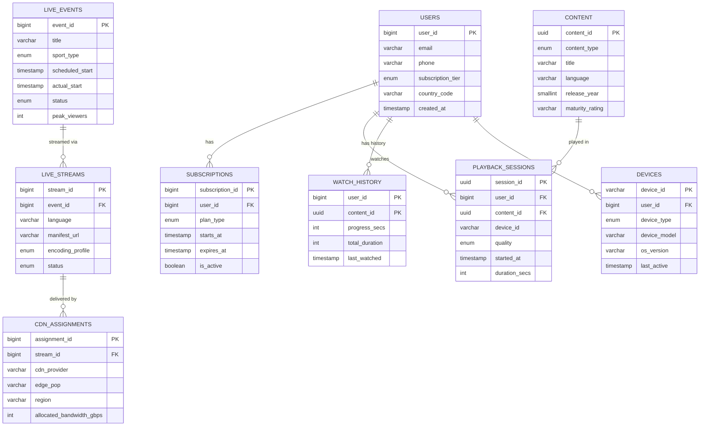

# 02 - Data Modeling

## 1. Entity-Relationship Diagram



---

## 2. Database Schemas

### 2.1 Users Table (PostgreSQL - Sharded by user_id)

```sql
CREATE TABLE users (
    user_id             BIGINT PRIMARY KEY,             -- Snowflake ID
    email               VARCHAR(255) UNIQUE,
    phone               VARCHAR(15) UNIQUE,             -- Primary auth in India
    phone_country_code  CHAR(3) DEFAULT '+91',
    password_hash       VARCHAR(255),
    display_name        VARCHAR(100) NOT NULL,
    avatar_url          VARCHAR(512),
    subscription_tier   VARCHAR(20) DEFAULT 'free',     -- 'free', 'mobile', 'super', 'premium'
    preferred_language  VARCHAR(10) DEFAULT 'hi',       -- Hindi default
    preferred_quality   VARCHAR(10) DEFAULT 'auto',
    country_code        CHAR(2) DEFAULT 'IN',
    state_code          VARCHAR(10),                    -- For regional content
    created_at          TIMESTAMPTZ NOT NULL DEFAULT NOW(),
    updated_at          TIMESTAMPTZ NOT NULL DEFAULT NOW(),
    last_login_at       TIMESTAMPTZ,
    is_verified         BOOLEAN DEFAULT FALSE,
    login_provider      VARCHAR(20) DEFAULT 'phone',    -- 'phone','google','facebook','apple'
    max_concurrent_streams SMALLINT DEFAULT 2,
    parental_pin        VARCHAR(4),
    data_saver_enabled  BOOLEAN DEFAULT FALSE           -- Important for India
);

-- Sharding key: user_id (consistent hashing across 256 shards)
CREATE INDEX idx_users_phone ON users(phone) WHERE phone IS NOT NULL;
CREATE INDEX idx_users_email ON users(email) WHERE email IS NOT NULL;
CREATE INDEX idx_users_subscription ON users(subscription_tier, country_code);
CREATE INDEX idx_users_last_login ON users(last_login_at DESC);
```

### 2.2 Subscriptions Table (PostgreSQL)

```sql
CREATE TABLE subscriptions (
    subscription_id     BIGINT PRIMARY KEY,
    user_id             BIGINT NOT NULL REFERENCES users(user_id),
    plan_type           VARCHAR(20) NOT NULL,            -- 'mobile','super','premium'
    billing_cycle       VARCHAR(10) NOT NULL,            -- 'monthly','quarterly','annual'
    price_inr           INT NOT NULL,                    -- Price in paisa (INR × 100)
    starts_at           TIMESTAMPTZ NOT NULL,
    expires_at          TIMESTAMPTZ NOT NULL,
    auto_renew          BOOLEAN DEFAULT TRUE,
    payment_method      VARCHAR(30),                     -- 'upi','card','wallet','carrier'
    payment_gateway     VARCHAR(20),                     -- 'razorpay','paytm','phonepe'
    transaction_id      VARCHAR(100),
    status              VARCHAR(20) DEFAULT 'active',    -- 'active','expired','cancelled','paused'
    cancel_reason       VARCHAR(50),
    created_at          TIMESTAMPTZ DEFAULT NOW(),
    updated_at          TIMESTAMPTZ DEFAULT NOW()
);

CREATE INDEX idx_subs_user_active ON subscriptions(user_id) WHERE status = 'active';
CREATE INDEX idx_subs_expires ON subscriptions(expires_at) WHERE status = 'active';
CREATE INDEX idx_subs_plan_status ON subscriptions(plan_type, status);
```

### 2.3 Content Catalog (PostgreSQL + Elasticsearch)

```sql
CREATE TABLE content (
    content_id          UUID PRIMARY KEY DEFAULT gen_random_uuid(),
    content_type        VARCHAR(20) NOT NULL,            -- 'movie','series','episode','short','trailer'
    title               VARCHAR(500) NOT NULL,
    title_localized     JSONB,                           -- {"hi":"हिंदी टाइटल","ta":"தமிழ் தலைப்பு"}
    description         TEXT,
    description_localized JSONB,
    original_language   VARCHAR(10) NOT NULL,
    available_languages VARCHAR(10)[] NOT NULL,          -- Audio tracks available
    subtitle_languages  VARCHAR(10)[],
    genre               VARCHAR(50)[] NOT NULL,
    tags                VARCHAR(50)[],
    release_year        SMALLINT,
    release_date        DATE,
    duration_secs       INT,
    maturity_rating     VARCHAR(10),                     -- 'U','UA','A','S'
    imdb_rating         DECIMAL(3,1),
    content_provider    VARCHAR(100),                    -- 'disney','star','hotstar_originals'
    series_id           UUID REFERENCES content(content_id),
    season_number       SMALLINT,
    episode_number      SMALLINT,
    thumbnail_url       VARCHAR(512),
    poster_url          VARCHAR(512),
    banner_url          VARCHAR(512),
    trailer_content_id  UUID,
    is_premium          BOOLEAN DEFAULT FALSE,
    is_downloadable     BOOLEAN DEFAULT FALSE,
    geo_restrictions    VARCHAR(5)[],                    -- Country codes where available
    drm_type            VARCHAR(20),                     -- 'widevine','fairplay','playready'
    encoding_status     VARCHAR(20) DEFAULT 'pending',
    published_at        TIMESTAMPTZ,
    created_at          TIMESTAMPTZ DEFAULT NOW()
);

CREATE INDEX idx_content_type_lang ON content(content_type, original_language);
CREATE INDEX idx_content_genre ON content USING GIN(genre);
CREATE INDEX idx_content_series ON content(series_id, season_number, episode_number);
CREATE INDEX idx_content_published ON content(published_at DESC) WHERE encoding_status = 'ready';
CREATE INDEX idx_content_premium ON content(is_premium, content_type);
```

### 2.4 Live Events Table (PostgreSQL)

```sql
CREATE TABLE live_events (
    event_id            BIGINT PRIMARY KEY,
    title               VARCHAR(500) NOT NULL,
    title_localized     JSONB,
    sport_type          VARCHAR(30),                     -- 'cricket','football','kabaddi','hockey'
    tournament_id       BIGINT,
    tournament_name     VARCHAR(200),
    team_a              VARCHAR(200),
    team_b              VARCHAR(200),
    venue               VARCHAR(300),
    scheduled_start     TIMESTAMPTZ NOT NULL,
    actual_start        TIMESTAMPTZ,
    actual_end          TIMESTAMPTZ,
    status              VARCHAR(20) DEFAULT 'scheduled', -- 'scheduled','live','paused','completed','cancelled'
    priority            SMALLINT DEFAULT 5,              -- 1=highest (IPL final), 10=lowest
    expected_viewers    BIGINT,                          -- For pre-scaling
    peak_viewers        BIGINT DEFAULT 0,
    total_unique_viewers BIGINT DEFAULT 0,
    total_watch_minutes  BIGINT DEFAULT 0,
    commentary_languages VARCHAR(10)[] NOT NULL,
    is_premium          BOOLEAN DEFAULT TRUE,
    drm_required        BOOLEAN DEFAULT TRUE,
    dvr_enabled         BOOLEAN DEFAULT TRUE,
    dvr_window_secs     INT DEFAULT 14400,              -- 4 hours DVR window
    ad_breaks_enabled   BOOLEAN DEFAULT TRUE,
    overlay_config      JSONB,                           -- Scoreboard config
    geo_restrictions    VARCHAR(5)[],
    cdn_strategy        VARCHAR(20) DEFAULT 'multi',     -- 'single','multi','hybrid'
    pre_scale_config    JSONB,                           -- Pre-warming configuration
    created_at          TIMESTAMPTZ DEFAULT NOW()
);

CREATE INDEX idx_events_status ON live_events(status) WHERE status IN ('scheduled', 'live');
CREATE INDEX idx_events_scheduled ON live_events(scheduled_start) WHERE status = 'scheduled';
CREATE INDEX idx_events_sport ON live_events(sport_type, scheduled_start DESC);
CREATE INDEX idx_events_tournament ON live_events(tournament_id, scheduled_start);
```

### 2.5 Live Streams Table (PostgreSQL)

```sql
CREATE TABLE live_streams (
    stream_id           BIGINT PRIMARY KEY,
    event_id            BIGINT NOT NULL REFERENCES live_events(event_id),
    language            VARCHAR(10) NOT NULL,            -- Commentary language
    source_feed_url     VARCHAR(512) NOT NULL,           -- Ingest URL from broadcaster
    ingest_protocol     VARCHAR(10) DEFAULT 'srt',       -- 'srt','rtmp','zixi','rist'
    encoding_profile    VARCHAR(30) NOT NULL,            -- 'cricket_hd','cricket_4k','standard'
    manifest_base_url   VARCHAR(512),                    -- HLS/DASH manifest location
    backup_source_url   VARCHAR(512),                    -- Redundant feed
    status              VARCHAR(20) DEFAULT 'standby',   -- 'standby','ingesting','live','error'
    video_codec         VARCHAR(20) DEFAULT 'h264',      -- 'h264','h265','av1'
    audio_codec         VARCHAR(20) DEFAULT 'aac',
    max_resolution      VARCHAR(10) DEFAULT '1080p',
    frame_rate          SMALLINT DEFAULT 50,             -- 50fps for cricket (PAL)
    abr_ladder          JSONB NOT NULL,                  -- Quality levels config
    segment_duration_ms INT DEFAULT 2000,                -- 2-second segments
    latency_mode        VARCHAR(10) DEFAULT 'low',       -- 'ultra_low','low','normal'
    encryption_key_url  VARCHAR(512),                    -- DRM key server
    watermark_enabled   BOOLEAN DEFAULT TRUE,
    started_at          TIMESTAMPTZ,
    health_status       JSONB,                           -- Real-time health metrics
    created_at          TIMESTAMPTZ DEFAULT NOW()
);

CREATE INDEX idx_streams_event ON live_streams(event_id);
CREATE INDEX idx_streams_status ON live_streams(status) WHERE status = 'live';
CREATE UNIQUE INDEX idx_streams_event_lang ON live_streams(event_id, language);
```

### 2.6 Playback Sessions (ScyllaDB - High write throughput)

```sql
-- ScyllaDB / Cassandra schema
CREATE TABLE playback_sessions (
    user_id             BIGINT,
    session_id          TIMEUUID,
    content_id          UUID,                           -- NULL for live
    event_id            BIGINT,                         -- NULL for VOD
    stream_id           BIGINT,                         -- NULL for VOD
    device_id           TEXT,
    device_type         TEXT,                           -- 'mobile_android','mobile_ios','web','tv','firestick'
    app_version         TEXT,
    os_version          TEXT,
    ip_address          INET,
    city                TEXT,
    state               TEXT,
    isp                 TEXT,
    connection_type     TEXT,                           -- '2g','3g','4g','5g','wifi','broadband'
    initial_quality     TEXT,
    current_quality     TEXT,
    cdn_provider        TEXT,
    edge_pop            TEXT,
    started_at          TIMESTAMP,
    ended_at            TIMESTAMP,
    duration_secs       INT,
    rebuffer_count      INT DEFAULT 0,
    rebuffer_duration_ms INT DEFAULT 0,
    startup_time_ms     INT,
    bitrate_switches    INT DEFAULT 0,
    avg_bitrate_kbps    INT,
    errors              LIST<TEXT>,
    PRIMARY KEY ((user_id), session_id)
) WITH CLUSTERING ORDER BY (session_id DESC)
  AND default_time_to_live = 7776000;  -- 90 days retention
```

### 2.7 Real-Time Viewer Counts (Redis + ClickHouse)

```
-- Redis data structures for real-time counts

-- HyperLogLog for unique viewers (memory efficient)
PFADD event:{event_id}:unique_viewers {user_id}
PFCOUNT event:{event_id}:unique_viewers

-- Sorted Set for concurrent viewer tracking
ZADD event:{event_id}:active_viewers {timestamp} {session_id}
-- Remove stale sessions (not heartbeated in 30s)
ZRANGEBYSCORE event:{event_id}:active_viewers -inf {timestamp-30}
ZCARD event:{event_id}:active_viewers  -- Current concurrent count

-- Hash for per-quality breakdown
HINCRBY event:{event_id}:quality_dist "1080p" 1
HINCRBY event:{event_id}:quality_dist "720p" 1

-- Hash for per-state/city breakdown (for CDN routing decisions)
HINCRBY event:{event_id}:geo_dist "MH:Mumbai" 1
HINCRBY event:{event_id}:geo_dist "KA:Bangalore" 1

-- Stream for real-time viewer count (time series)
XADD event:{event_id}:viewer_ts * count 25000000 quality_avg 4200
```

### 2.8 CDN Assignment & Routing Table (PostgreSQL + Redis cache)

```sql
CREATE TABLE cdn_providers (
    cdn_id              VARCHAR(20) PRIMARY KEY,         -- 'akamai','cloudfront','fastly','jio_cdn'
    provider_name       VARCHAR(100) NOT NULL,
    total_capacity_tbps DECIMAL(6,2),
    regions             VARCHAR(10)[] NOT NULL,
    cost_per_gb_usd     DECIMAL(8,6),
    priority            SMALLINT DEFAULT 5,
    is_active           BOOLEAN DEFAULT TRUE,
    health_endpoint     VARCHAR(512),
    api_endpoint        VARCHAR(512)
);

CREATE TABLE cdn_edge_pops (
    pop_id              VARCHAR(50) PRIMARY KEY,         -- 'akamai-mum-01'
    cdn_id              VARCHAR(20) REFERENCES cdn_providers(cdn_id),
    city                VARCHAR(100),
    state               VARCHAR(50),
    country             CHAR(2),
    latitude            DECIMAL(9,6),
    longitude           DECIMAL(9,6),
    capacity_gbps       INT,
    current_load_pct    SMALLINT DEFAULT 0,
    isp_peering         VARCHAR(50)[],                  -- ['jio','airtel','bsnl','vi']
    status              VARCHAR(20) DEFAULT 'active',
    last_health_check   TIMESTAMPTZ
);

CREATE TABLE cdn_routing_rules (
    rule_id             BIGINT PRIMARY KEY,
    event_id            BIGINT,
    priority            SMALLINT,
    match_criteria      JSONB NOT NULL,                  -- {"isp":"jio","state":"MH","device":"mobile"}
    cdn_id              VARCHAR(20) NOT NULL,
    pop_id              VARCHAR(50),
    weight              SMALLINT DEFAULT 100,            -- For weighted routing
    is_active           BOOLEAN DEFAULT TRUE,
    created_at          TIMESTAMPTZ DEFAULT NOW()
);

CREATE INDEX idx_routing_event ON cdn_routing_rules(event_id) WHERE is_active = TRUE;
```

### 2.9 Ad Insertion Tracking (ClickHouse - Analytics)

```sql
-- ClickHouse schema for high-volume ad events
CREATE TABLE ad_impressions (
    event_date          Date,
    event_time          DateTime64(3),
    impression_id       UUID,
    user_id             UInt64,
    session_id          UUID,
    event_id            UInt64,
    ad_id               String,
    ad_campaign_id      String,
    ad_creative_id      String,
    ad_duration_secs    UInt16,
    ad_position         Enum8('pre_roll'=1, 'mid_roll'=2, 'post_roll'=3),
    watched_duration_ms UInt32,
    was_skipped         UInt8,
    device_type         LowCardinality(String),
    city                LowCardinality(String),
    state               LowCardinality(String),
    isp                 LowCardinality(String),
    quality             LowCardinality(String)
) ENGINE = MergeTree()
PARTITION BY event_date
ORDER BY (event_id, event_time, user_id)
TTL event_date + INTERVAL 90 DAY;
```

---

## 3. Storage Technology Choices

| Data Type | Technology | Reason |
|-----------|-----------|--------|
| User profiles, subscriptions | PostgreSQL (Citus sharded) | ACID, complex queries, 500M rows manageable sharded |
| Content catalog | PostgreSQL + Elasticsearch | Rich queries + full-text search |
| Live event metadata | PostgreSQL | Transactional consistency for scheduling |
| Playback sessions | ScyllaDB | High write throughput (millions/sec), time-series |
| Real-time viewer counts | Redis Cluster | Sub-ms reads, HyperLogLog for unique counts |
| Video segments | Object Storage (S3/MinIO) | Petabyte scale, CDN origin |
| Manifests | Generated in-memory, cached at edge | Ultra-low latency delivery |
| Analytics/Ads | ClickHouse | Column-oriented, fast aggregations on billions of rows |
| Search index | Elasticsearch | Full-text, faceted search, auto-complete |
| Recommendations | Redis + Feature Store (Feast) | ML model serving with cached predictions |
| Config/Feature flags | etcd / Consul | Distributed config with watch |
| Event streaming | Apache Kafka | Backbone for async communication |
