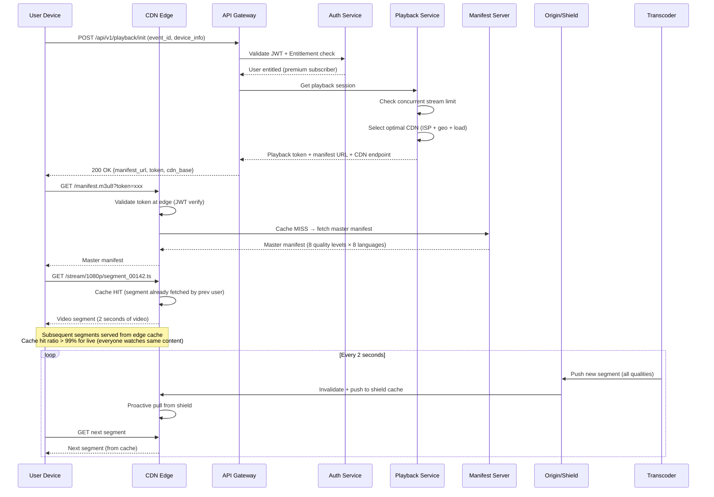
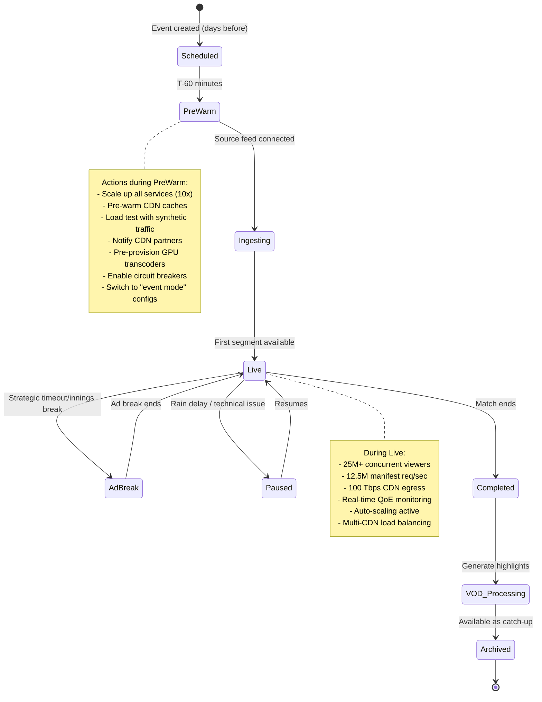

# 03 - High-Level Architecture

## 1. Complete System Architecture

```
┌─────────────────────────────────────────────────────────────────────────────────────────────┐
│                                    CLIENT LAYER                                               │
│                                                                                               │
│  ┌──────────┐  ┌──────────┐  ┌──────────┐  ┌──────────┐  ┌──────────┐  ┌──────────┐       │
│  │ Android  │  │   iOS    │  │   Web    │  │ Smart TV │  │Fire Stick│  │Chromecast│       │
│  │   App    │  │   App    │  │  (React) │  │(Tizen/   │  │          │  │          │       │
│  │          │  │          │  │          │  │ WebOS)   │  │          │  │          │       │
│  └────┬─────┘  └────┬─────┘  └────┬─────┘  └────┬─────┘  └────┬─────┘  └────┬─────┘       │
│       │              │              │              │              │              │             │
│       └──────────────┴──────────────┴──────┬───────┴──────────────┴──────────────┘             │
│                                            │                                                   │
│                              Unified Player SDK (ExoPlayer/AVPlayer/Shaka)                     │
│                              - ABR Algorithm (Buffer-based + Throughput)                        │
│                              - DRM Handler (Widevine L1/L3, FairPlay)                          │
│                              - Analytics Reporter (QoE metrics every 10s)                      │
│                              - CDN Failover Logic                                              │
└──────────────────────────────────────┬─────────────────────────────────────────────────────────┘
                                       │
                                       ▼
┌─────────────────────────────────────────────────────────────────────────────────────────────┐
│                              EDGE / CDN LAYER                                                 │
│                                                                                               │
│  ┌─────────────────────────────────────────────────────────────────────────────────────┐     │
│  │                        MULTI-CDN ORCHESTRATOR                                        │     │
│  │  ┌──────────────┐  ┌──────────────┐  ┌──────────────┐  ┌──────────────┐            │     │
│  │  │   Akamai     │  │  CloudFront  │  │    Fastly    │  │   Jio CDN    │            │     │
│  │  │  (Global)    │  │  (AWS India) │  │  (Compute@)  │  │ (Jio users)  │            │     │
│  │  │  200+ PoPs   │  │  20+ PoPs    │  │  60+ PoPs    │  │  ISP-level   │            │     │
│  │  └──────────────┘  └──────────────┘  └──────────────┘  └──────────────┘            │     │
│  │                                                                                      │     │
│  │  Routing Logic:                                                                      │     │
│  │  - ISP-aware (Jio users → Jio CDN, Airtel → Akamai/CF)                             │     │
│  │  - Geo-aware (nearest PoP)                                                           │     │
│  │  - Load-aware (shift traffic when PoP saturated)                                     │     │
│  │  - Quality-aware (4K only from high-capacity PoPs)                                   │     │
│  │  - Cost-aware (cheaper CDN for lower priority content)                               │     │
│  └─────────────────────────────────────────────────────────────────────────────────────┘     │
│                                                                                               │
│  ┌─────────────────────────────────────────────────────────────────────────────────────┐     │
│  │                    EDGE COMPUTE (at CDN PoPs)                                        │     │
│  │                                                                                      │     │
│  │  - Manifest Manipulation (personalized ABR ladder per user)                          │     │
│  │  - Token Validation (JWT verify at edge, no origin round-trip)                       │     │
│  │  - Ad Insertion (SSAI stitching at edge)                                             │     │
│  │  - Geo-restriction enforcement                                                       │     │
│  │  - Request coalescing (deduplicate concurrent segment requests)                      │     │
│  └─────────────────────────────────────────────────────────────────────────────────────┘     │
└──────────────────────────────────────┬─────────────────────────────────────────────────────────┘
                                       │
                                       ▼
┌─────────────────────────────────────────────────────────────────────────────────────────────┐
│                              API GATEWAY LAYER                                                 │
│                                                                                               │
│  ┌─────────────────────────────────────────────────────────────────────────────────────┐     │
│  │                     KONG / ENVOY API GATEWAY                                         │     │
│  │                                                                                      │     │
│  │  - Rate Limiting (per user, per IP, per device)                                      │     │
│  │  - Request Authentication (JWT validation)                                            │     │
│  │  - Request Routing (to correct microservice)                                          │     │
│  │  - Circuit Breaking (isolate failing services)                                        │     │
│  │  - Response Caching (for idempotent reads)                                            │     │
│  │  - Load Shedding (drop low-priority requests under pressure)                          │     │
│  │  - Protocol Translation (HTTP/2 → gRPC internal)                                     │     │
│  │                                                                                      │     │
│  │  Capacity: 200 nodes, 10M RPS peak                                                   │     │
│  └─────────────────────────────────────────────────────────────────────────────────────┘     │
└──────────────────────────────────────┬─────────────────────────────────────────────────────────┘
                                       │
                                       ▼
┌─────────────────────────────────────────────────────────────────────────────────────────────┐
│                          MICROSERVICES LAYER                                                   │
│                                                                                               │
│  ┌────────────┐  ┌─────────────┐  ┌─────────────┐  ┌─────────────┐  ┌──────────────┐       │
│  │   Auth     │  │  Playback   │  │  Content    │  │  Live Event │  │ Subscription │       │
│  │  Service   │  │  Service    │  │  Service    │  │  Service    │  │  Service     │       │
│  │            │  │             │  │             │  │             │  │              │       │
│  │ - Login    │  │ - Manifest  │  │ - Catalog   │  │ - Schedule  │  │ - Plans      │       │
│  │ - Token    │  │   generation│  │ - Metadata  │  │ - Status    │  │ - Billing    │       │
│  │ - Session  │  │ - DRM keys  │  │ - Search    │  │ - Scaling   │  │ - Entitlement│       │
│  │ - Device   │  │ - CDN select│  │ - Recommend │  │   triggers  │  │ - Renewal    │       │
│  │   mgmt     │  │ - Bitrate   │  │ - i18n      │  │ - Health    │  │              │       │
│  └────────────┘  └─────────────┘  └─────────────┘  └─────────────┘  └──────────────┘       │
│                                                                                               │
│  ┌────────────┐  ┌─────────────┐  ┌─────────────┐  ┌─────────────┐  ┌──────────────┐       │
│  │    Ad      │  │ Interaction │  │ Notification│  │  Analytics  │  │   Overlay    │       │
│  │  Service   │  │  Service    │  │  Service    │  │  Service    │  │   Service    │       │
│  │            │  │             │  │             │  │             │  │              │       │
│  │ - SSAI     │  │ - Polls     │  │ - Push      │  │ - QoE       │  │ - Scoreboard │       │
│  │ - Targeting│  │ - Emoji     │  │ - SMS       │  │ - Business  │  │ - Ball-by-ball│       │
│  │ - Podding  │  │ - Predict   │  │ - In-app    │  │ - Real-time │  │ - Highlights │       │
│  │ - Reporting│  │ - Watch     │  │ - Email     │  │ - Dashboards│  │ - Graphics   │       │
│  │            │  │   party     │  │             │  │             │  │              │       │
│  └────────────┘  └─────────────┘  └─────────────┘  └─────────────┘  └──────────────┘       │
└──────────────────────────────────────┬─────────────────────────────────────────────────────────┘
                                       │
                                       ▼
┌─────────────────────────────────────────────────────────────────────────────────────────────┐
│                         STREAMING PIPELINE (Heart of the System)                               │
│                                                                                               │
│  ┌─────────────────────────────────────────────────────────────────────────────────────┐     │
│  │  INGEST          TRANSCODE           PACKAGE            ORIGIN          DELIVER     │     │
│  │                                                                                      │     │
│  │  ┌────────┐     ┌──────────┐        ┌────────┐       ┌────────┐     ┌────────┐    │     │
│  │  │Broadcst│     │GPU Farm  │        │CMAF    │       │Origin  │     │  CDN   │    │     │
│  │  │Feed    │────►│(NVENC/   │───────►│Packager│──────►│Shield  │────►│  Edge  │    │     │
│  │  │(SRT)   │     │ x264)    │        │        │       │(S3+CF) │     │  PoPs  │    │     │
│  │  └────────┘     │          │        │HLS     │       └────────┘     └────────┘    │     │
│  │  ┌────────┐     │8 quality │        │DASH    │                                     │     │
│  │  │Backup  │     │levels    │        │LL-HLS  │       ┌────────┐                    │     │
│  │  │Feed    │────►│per lang  │        │        │       │Manifest│                    │     │
│  │  │(SRT)   │     └──────────┘        └────────┘       │Server  │                    │     │
│  │  └────────┘                                           │(in-mem)│                    │     │
│  │                                                       └────────┘                    │     │
│  └─────────────────────────────────────────────────────────────────────────────────────┘     │
└──────────────────────────────────────┬─────────────────────────────────────────────────────────┘
                                       │
                                       ▼
┌─────────────────────────────────────────────────────────────────────────────────────────────┐
│                              DATA LAYER                                                        │
│                                                                                               │
│  ┌──────────────┐  ┌──────────────┐  ┌──────────────┐  ┌──────────────┐                     │
│  │ PostgreSQL   │  │  ScyllaDB    │  │ Redis Cluster│  │ Elasticsearch│                     │
│  │ (Citus)     │  │              │  │              │  │              │                     │
│  │ - Users      │  │ - Sessions   │  │ - Auth tokens│  │ - Content    │                     │
│  │ - Subs       │  │ - Watch hist │  │ - Viewer cnt │  │   search     │                     │
│  │ - Content    │  │ - QoE events │  │ - Config     │  │ - Autocomplete│                    │
│  │ - Events     │  │ - Ad events  │  │ - Rate limits│  │ - Trending   │                     │
│  │              │  │              │  │ - Session    │  │              │                     │
│  │ 256 shards   │  │ 50 nodes     │  │ 60 nodes     │  │ 20 nodes     │                     │
│  └──────────────┘  └──────────────┘  └──────────────┘  └──────────────┘                     │
│                                                                                               │
│  ┌──────────────┐  ┌──────────────┐  ┌──────────────┐  ┌──────────────┐                     │
│  │ Apache Kafka │  │ ClickHouse   │  │ Object Store │  │  ML Platform │                     │
│  │              │  │              │  │ (S3)         │  │  (SageMaker) │                     │
│  │ - Events bus │  │ - Analytics  │  │              │  │              │                     │
│  │ - QoE stream │  │ - Ad metrics │  │ - Video segs │  │ - Recommend  │                     │
│  │ - Viewer evts│  │ - Biz intel  │  │ - VOD files  │  │ - Ad target  │                     │
│  │ - CDC        │  │ - Dashboards │  │ - Thumbnails │  │ - QoE predict│                     │
│  │              │  │              │  │              │  │              │                     │
│  │ 100 brokers  │  │ 30 nodes     │  │ ~30 PB       │  │ GPU cluster  │                     │
│  └──────────────┘  └──────────────┘  └──────────────┘  └──────────────┘                     │
└─────────────────────────────────────────────────────────────────────────────────────────────┘

┌─────────────────────────────────────────────────────────────────────────────────────────────┐
│                         INFRASTRUCTURE / PLATFORM LAYER                                        │
│                                                                                               │
│  ┌──────────────┐  ┌──────────────┐  ┌──────────────┐  ┌──────────────┐                     │
│  │ Kubernetes   │  │  Terraform   │  │  Prometheus  │  │  PagerDuty   │                     │
│  │ (EKS)       │  │  (IaC)       │  │  + Grafana   │  │  + OpsGenie  │                     │
│  │              │  │              │  │              │  │              │                     │
│  │ - Service    │  │ - Multi-cloud│  │ - Metrics    │  │ - Alerting   │                     │
│  │   mesh       │  │ - Auto-scale │  │ - Dashboards │  │ - On-call    │                     │
│  │ - Istio      │  │ - DR config  │  │ - SLO track  │  │ - Runbooks   │                     │
│  │ - HPA/VPA    │  │              │  │              │  │              │                     │
│  └──────────────┘  └──────────────┘  └──────────────┘  └──────────────┘                     │
│                                                                                               │
│  Multi-Region: AWS Mumbai (primary) + AWS Singapore (DR) + GCP (burst)                       │
└─────────────────────────────────────────────────────────────────────────────────────────────┘
```

---

## 2. Component Interaction Flow (Mermaid)



---

## 3. Live Event Lifecycle Flow



---

## 4. Request Flow - Hot Path vs Cold Path

### Hot Path (99% of requests during live event)

```
User → CDN Edge (cache hit) → Video segment delivered
Total latency: 10-50ms (purely edge-served)

Why it works:
- ALL users watch the SAME live content
- 2-second segments cached at edge after first request
- 200+ PoPs ensure geographic proximity
- Cache hit ratio: 99.5%+ for live events
```

### Cold Path (first request for new segment)

```
User → CDN Edge (cache miss) → Shield Cache (miss) → Origin (S3) → Edge
Total latency: 100-300ms (only for first viewer per PoP per segment)

Optimization:
- Shield cache reduces origin load (only 1 miss per shield cluster)
- Proactive push: transcoder pushes to origin + triggers shield fill
- Predictive caching: next segment pre-fetched before users request it
```

### Control Path (session management, auth)

```
User → API Gateway → Microservice → Database/Cache → Response
Total latency: 50-200ms

Optimizations:
- JWT validated at edge (no gateway round-trip for manifest requests)
- Session state cached in Redis (no DB hit)
- Entitlement cached for 5 minutes
- Rate limiting at gateway level
```

---

## 5. Deployment Architecture

```
┌─────────────────────────────────────────────────────────────────────┐
│                      AWS MUMBAI (ap-south-1) - PRIMARY               │
│                                                                       │
│  ┌──────────┐  ┌──────────┐  ┌──────────┐  ┌──────────┐            │
│  │  AZ-1a   │  │  AZ-1b   │  │  AZ-1c   │  │  AZ-1d   │            │
│  │          │  │          │  │          │  │  (burst)  │            │
│  │ EKS nodes│  │ EKS nodes│  │ EKS nodes│  │ EKS nodes│            │
│  │ RDS      │  │ RDS      │  │ Scylla   │  │ Overflow  │            │
│  │ Redis    │  │ Redis    │  │ Kafka    │  │          │            │
│  │ GPU      │  │ GPU      │  │ GPU      │  │          │            │
│  └──────────┘  └──────────┘  └──────────┘  └──────────┘            │
└─────────────────────────────────────────────────────────────────────┘

┌─────────────────────────────────────────────────────────────────────┐
│                    AWS SINGAPORE (ap-southeast-1) - DR                │
│                                                                       │
│  - Hot standby for all critical services                              │
│  - Async replication of user data (< 1 min lag)                       │
│  - Can serve 100% traffic within 5 minutes of failover                │
│  - Active for non-India traffic (SEA users)                           │
└─────────────────────────────────────────────────────────────────────┘

┌─────────────────────────────────────────────────────────────────────┐
│                    GCP (Burst capacity during IPL)                     │
│                                                                       │
│  - Additional Kubernetes capacity for extreme peaks                   │
│  - Transcoding overflow (GCP GPU instances)                           │
│  - Multi-cloud resilience (no single cloud dependency)                │
└─────────────────────────────────────────────────────────────────────┘
```

---

## 6. Key Design Principles

| Principle | Implementation |
|-----------|---------------|
| **Edge-first** | Serve as much as possible from CDN edge; minimize origin hits |
| **Pre-scale, don't react** | Scale 60 min before event; reaction is too slow at this scale |
| **Graceful degradation** | Degrade features, never fail completely (drop interactive features first) |
| **Multi-everything** | Multi-CDN, multi-cloud, multi-region, multi-codec |
| **Stateless services** | All services stateless; state in Redis/DB only |
| **Request coalescing** | Deduplicate identical requests at every layer |
| **Circuit breakers everywhere** | Isolate failures, prevent cascade |
| **Feature flags** | Kill non-essential features instantly under load |
| **ISP-aware routing** | Route users to CDN PoPs peered with their ISP |
| **Cache everything** | Segment cache, manifest cache, auth cache, config cache |
