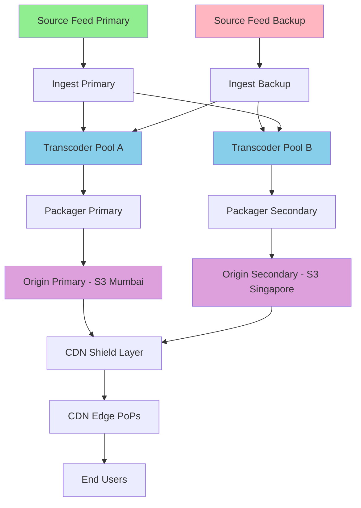

# 04 - Streaming Pipeline

## 1. End-to-End Streaming Pipeline

```
┌──────────────────────────────────────────────────────────────────────────────────────────┐
│                           HOTSTAR LIVE STREAMING PIPELINE                                  │
│                                                                                            │
│  BROADCAST     INGEST        TRANSCODE       PACKAGE         ORIGIN       CDN    CLIENT  │
│  ─────────     ──────        ─────────       ───────         ──────       ───    ──────  │
│                                                                                            │
│  ┌────────┐   ┌────────┐   ┌──────────┐   ┌──────────┐   ┌────────┐  ┌─────┐  ┌─────┐ │
│  │Cricket │   │SRT     │   │GPU Farm  │   │CMAF      │   │S3 +    │  │Edge │  │User │ │
│  │Stadium │──►│Ingest  │──►│(NVENC)   │──►│Packager  │──►│Shield  │─►│Cache│─►│Phone│ │
│  │Camera  │   │Cluster │   │          │   │          │   │Cache   │  │     │  │     │ │
│  └────────┘   └────────┘   └──────────┘   └──────────┘   └────────┘  └─────┘  └─────┘ │
│       │            │             │               │              │          │         │    │
│    50fps        ~1s           ~2-3s           ~0.5s          ~0.5s     ~0.5s    ~0.5s   │
│   1080i/4K    receive        encode          package         store     deliver   buffer  │
│                                                                                            │
│  Total Glass-to-Glass Latency: 5-10 seconds                                               │
└──────────────────────────────────────────────────────────────────────────────────────────┘
```

---

## 2. Ingest Layer

### 2.1 Source Feed Reception

```
┌─────────────────────────────────────────────────────────────────────┐
│                       INGEST ARCHITECTURE                             │
│                                                                       │
│  Stadium/Broadcast Center                                             │
│  ┌─────────────────────────┐                                         │
│  │ Primary Feed (SRT)      │──────┐                                  │
│  │ - 1080i50 / 4K HDR      │      │                                  │
│  │ - 20-50 Mbps            │      │     ┌──────────────────────┐     │
│  │ - AES-256 encrypted     │      ├────►│  INGEST CLUSTER       │     │
│  └─────────────────────────┘      │     │  (Mumbai Region)      │     │
│  ┌─────────────────────────┐      │     │                       │     │
│  │ Backup Feed (SRT/RIST)  │──────┘     │  ┌─────────────────┐ │     │
│  │ - Same quality           │            │  │ Feed Selector   │ │     │
│  │ - Different path/ISP    │            │  │ (auto-failover) │ │     │
│  │ - 100ms diversity delay │            │  └────────┬────────┘ │     │
│  └─────────────────────────┘            │           │          │     │
│  ┌─────────────────────────┐            │  ┌────────▼────────┐ │     │
│  │ Commentary Feeds (×8)   │───────────►│  │ Audio Mixer     │ │     │
│  │ - Hindi, English, Tamil │            │  │ (per language)  │ │     │
│  │ - Telugu, Kannada, etc  │            │  └────────┬────────┘ │     │
│  │ - 320 Kbps AAC each    │            │           │          │     │
│  └─────────────────────────┘            │  ┌────────▼────────┐ │     │
│                                          │  │ Synchronizer    │ │     │
│                                          │  │ (PTS alignment) │ │     │
│                                          │  └────────┬────────┘ │     │
│                                          │           │          │     │
│                                          │           ▼          │     │
│                                          │    To Transcoder     │     │
│                                          └──────────────────────┘     │
└─────────────────────────────────────────────────────────────────────┘
```

### 2.2 Ingest Protocols

| Protocol | Use Case | Latency | Reliability |
|----------|----------|---------|-------------|
| SRT (Secure Reliable Transport) | Primary live ingest | 20-60ms | ARQ-based recovery |
| RIST (Reliable Internet Stream Transport) | Backup/redundant path | 50-100ms | FEC + ARQ |
| RTMP | Legacy broadcaster equipment | 100-500ms | TCP-based |
| Zixi | Premium contribution links | 30-80ms | Enterprise-grade |

### 2.3 Feed Redundancy Strategy

```
Primary Feed Path:    Stadium → Fiber → Mumbai DC → Ingest-1
Backup Feed Path:     Stadium → Satellite → Different DC → Ingest-2
Tertiary Feed:        Stadium → 4G Bonded → Cloud Ingest → Ingest-3

Feed Selection Logic:
  IF primary.packet_loss < 0.01% AND primary.latency < 100ms:
      USE primary
  ELIF backup.available AND backup.quality_score > 0.9:
      SWITCH to backup (< 1 frame glitch)
  ELSE:
      USE tertiary (degraded quality acceptable)

Failover time: < 500ms (seamless for viewer)
```

---

## 3. Transcoding Layer

### 3.1 ABR Ladder (Adaptive Bitrate)

```
┌─────────────────────────────────────────────────────────────────────┐
│                    ABR ENCODING LADDER (Cricket Profile)              │
│                                                                       │
│  Source: 1080i50 @ 20 Mbps (interlaced, from broadcast)              │
│                                                                       │
│  ┌─────────────────────────────────────────────────────────────────┐ │
│  │ Quality │ Resolution │ Bitrate  │ FPS │ Codec │ Target Device   │ │
│  │─────────│────────────│──────────│─────│───────│─────────────────│ │
│  │ 4K UHD  │ 3840×2160  │ 15 Mbps  │ 50  │ H.265 │ Smart TV 4K     │ │
│  │ 1080p   │ 1920×1080  │ 8 Mbps   │ 50  │ H.264 │ TV / Desktop    │ │
│  │ 1080p   │ 1920×1080  │ 5 Mbps   │ 50  │ H.265 │ TV (low BW)     │ │
│  │ 720p    │ 1280×720   │ 4 Mbps   │ 50  │ H.264 │ Tablet / Mobile │ │
│  │ 720p    │ 1280×720   │ 2.5 Mbps │ 50  │ H.265 │ Mobile (4G)     │ │
│  │ 480p    │ 854×480    │ 1.5 Mbps │ 25  │ H.264 │ Mobile (3G)     │ │
│  │ 360p    │ 640×360    │ 800 Kbps │ 25  │ H.264 │ Feature phone   │ │
│  │ 240p    │ 426×240    │ 400 Kbps │ 25  │ H.264 │ 2G / data saver │ │
│  └─────────────────────────────────────────────────────────────────┘ │
│                                                                       │
│  Audio Tracks (per language):                                         │
│  - High: AAC-LC 128 Kbps stereo                                      │
│  - Low:  HE-AAC v2 48 Kbps (for low bitrate video)                   │
│  - Dolby: AC-3 384 Kbps 5.1 (premium TV only)                        │
│                                                                       │
│  Total unique streams: 8 video × 8 languages × 2 audio = 128 combos  │
│  But packaged as: 8 video + 16 audio (muxed at client)                │
└─────────────────────────────────────────────────────────────────────┘
```

### 3.2 Transcoding Architecture

```
┌─────────────────────────────────────────────────────────────────────┐
│                    GPU TRANSCODING FARM                                │
│                                                                       │
│  ┌─────────────────────────────────────────────────────────────────┐ │
│  │                    TRANSCODER CLUSTER                             │ │
│  │                                                                   │ │
│  │  Source Feed ──┬──► [GPU-1: NVENC] ──► 4K UHD H.265 @ 15 Mbps   │ │
│  │               ├──► [GPU-2: NVENC] ──► 1080p H.264 @ 8 Mbps      │ │
│  │               ├──► [GPU-3: NVENC] ──► 1080p H.265 @ 5 Mbps      │ │
│  │               ├──► [GPU-4: NVENC] ──► 720p H.264 @ 4 Mbps       │ │
│  │               ├──► [GPU-5: NVENC] ──► 720p H.265 @ 2.5 Mbps     │ │
│  │               ├──► [GPU-6: NVENC] ──► 480p H.264 @ 1.5 Mbps     │ │
│  │               ├──► [GPU-7: NVENC] ──► 360p H.264 @ 800 Kbps     │ │
│  │               └──► [GPU-8: CPU]  ──► 240p H.264 @ 400 Kbps      │ │
│  │                                                                   │ │
│  │  Hardware: NVIDIA A10G GPUs (AWS g5 instances)                    │ │
│  │  Redundancy: 3× (primary + warm standby + cold standby)          │ │
│  │  Failover: < 2 seconds (pre-initialized encoders)                 │ │
│  └─────────────────────────────────────────────────────────────────┘ │
│                                                                       │
│  Key Requirements:                                                    │
│  - Keyframe-aligned segments (every 2 seconds exactly)                │
│  - Constant segment duration (critical for ABR switching)             │
│  - Frame-accurate sync across all quality levels                      │
│  - 50fps preserved for cricket (ball visibility)                      │
│  - Deinterlacing (broadcast 1080i → progressive)                      │
│  - HDR→SDR tone mapping for non-HDR devices                          │
└─────────────────────────────────────────────────────────────────────┘
```

### 3.3 Cricket-Specific Encoding Optimizations

```
Why cricket is harder to encode than movies:
─────────────────────────────────────────────

1. FAST MOTION: Ball travels at 150 km/h - needs 50fps (not 30)
2. SCENE COMPLEXITY: Green grass + white ball + crowd = high detail
3. FREQUENT SCENE CHANGES: Camera switches every 5-10 seconds
4. SCOREBOARD OVERLAY: Text must be sharp at all resolutions
5. CROWD SHOTS: High complexity (many moving elements)
6. SLOW MOTION REPLAYS: Interlaced source needs careful deinterlacing

Optimizations applied:
─────────────────────
- Higher I-frame interval tolerance (2s keyframe forced, not content-adaptive)
- Lookahead disabled (latency > quality for live)
- B-frames limited to 2 (reduce latency)
- Adaptive quantization for mixed content (sharp scoreboard + soft crowd)
- Scene-change detection tuned for camera cuts
- Film grain synthesis disabled (broadcast content is clean)
- Rate control: CBR with VBV buffer = 2× segment duration
```

---

## 4. Packaging Layer (CMAF)

### 4.1 Segment Format

```
┌─────────────────────────────────────────────────────────────────────┐
│                    CMAF PACKAGING                                      │
│                                                                       │
│  Input:  Raw H.264/H.265 encoded segments from transcoder             │
│  Output: CMAF fragments in both HLS and DASH format                   │
│                                                                       │
│  ┌──────────────────────────────────────────────────────────────┐    │
│  │                                                                │    │
│  │  Segment Duration: 2 seconds (GOP-aligned)                     │    │
│  │  Chunk Duration:   500ms (for Low-Latency HLS)                 │    │
│  │                                                                │    │
│  │  Regular HLS:                                                  │    │
│  │  ┌──────┐ ┌──────┐ ┌──────┐ ┌──────┐                         │    │
│  │  │ 2 sec│ │ 2 sec│ │ 2 sec│ │ 2 sec│  ← Full segments         │    │
│  │  └──────┘ └──────┘ └──────┘ └──────┘                         │    │
│  │                                                                │    │
│  │  Low-Latency HLS (LL-HLS):                                    │    │
│  │  ┌──┐┌──┐┌──┐┌──┐ ┌──┐┌──┐┌──┐┌──┐                         │    │
│  │  │.5││.5││.5││.5│ │.5││.5││.5││.5│  ← Partial segments       │    │
│  │  └──┘└──┘└──┘└──┘ └──┘└──┘└──┘└──┘                         │    │
│  │  ▲ Available immediately (reduce latency by 1.5s)             │    │
│  │                                                                │    │
│  │  Container: fMP4 (fragmented MP4)                              │    │
│  │  Encryption: CENC (Common Encryption) with Widevine/FairPlay   │    │
│  │  DRM Key Rotation: Every 5 minutes                             │    │
│  │                                                                │    │
│  └──────────────────────────────────────────────────────────────┘    │
│                                                                       │
│  Manifest Types Generated:                                            │
│  - HLS (.m3u8) - iOS, Safari, older devices                          │
│  - DASH (.mpd) - Android, Smart TVs, web (MSE)                       │
│  - LL-HLS - Low latency for supported clients                         │
│  - LL-DASH - Low latency DASH variant                                 │
└─────────────────────────────────────────────────────────────────────┘
```

### 4.2 Manifest Structure (HLS Example)

```
Master Manifest (master.m3u8):
────────────────────────────────
#EXTM3U
#EXT-X-VERSION:7
#EXT-X-INDEPENDENT-SEGMENTS

## Video Variants
#EXT-X-STREAM-INF:BANDWIDTH=15000000,RESOLUTION=3840x2160,CODECS="hvc1.1.6.L150.90",FRAME-RATE=50
video/4k_hevc/playlist.m3u8

#EXT-X-STREAM-INF:BANDWIDTH=8000000,RESOLUTION=1920x1080,CODECS="avc1.640028",FRAME-RATE=50
video/1080p_h264/playlist.m3u8

#EXT-X-STREAM-INF:BANDWIDTH=5000000,RESOLUTION=1920x1080,CODECS="hvc1.1.6.L120.90",FRAME-RATE=50
video/1080p_hevc/playlist.m3u8

#EXT-X-STREAM-INF:BANDWIDTH=4000000,RESOLUTION=1280x720,CODECS="avc1.64001f",FRAME-RATE=50
video/720p_h264/playlist.m3u8

#EXT-X-STREAM-INF:BANDWIDTH=2500000,RESOLUTION=1280x720,CODECS="hvc1.1.6.L93.90",FRAME-RATE=50
video/720p_hevc/playlist.m3u8

#EXT-X-STREAM-INF:BANDWIDTH=1500000,RESOLUTION=854x480,CODECS="avc1.64001e",FRAME-RATE=25
video/480p_h264/playlist.m3u8

#EXT-X-STREAM-INF:BANDWIDTH=800000,RESOLUTION=640x360,CODECS="avc1.640015",FRAME-RATE=25
video/360p_h264/playlist.m3u8

#EXT-X-STREAM-INF:BANDWIDTH=400000,RESOLUTION=426x240,CODECS="avc1.640015",FRAME-RATE=25
video/240p_h264/playlist.m3u8

## Audio Tracks (selectable by language)
#EXT-X-MEDIA:TYPE=AUDIO,GROUP-ID="audio",NAME="Hindi",LANGUAGE="hi",URI="audio/hi/playlist.m3u8"
#EXT-X-MEDIA:TYPE=AUDIO,GROUP-ID="audio",NAME="English",LANGUAGE="en",URI="audio/en/playlist.m3u8"
#EXT-X-MEDIA:TYPE=AUDIO,GROUP-ID="audio",NAME="Tamil",LANGUAGE="ta",URI="audio/ta/playlist.m3u8"
#EXT-X-MEDIA:TYPE=AUDIO,GROUP-ID="audio",NAME="Telugu",LANGUAGE="te",URI="audio/te/playlist.m3u8"
#EXT-X-MEDIA:TYPE=AUDIO,GROUP-ID="audio",NAME="Kannada",LANGUAGE="kn",URI="audio/kn/playlist.m3u8"
#EXT-X-MEDIA:TYPE=AUDIO,GROUP-ID="audio",NAME="Bangla",LANGUAGE="bn",URI="audio/bn/playlist.m3u8"
#EXT-X-MEDIA:TYPE=AUDIO,GROUP-ID="audio",NAME="Malayalam",LANGUAGE="ml",URI="audio/ml/playlist.m3u8"
#EXT-X-MEDIA:TYPE=AUDIO,GROUP-ID="audio",NAME="Marathi",LANGUAGE="mr",URI="audio/mr/playlist.m3u8"


Media Playlist (video/1080p_h264/playlist.m3u8) - Live sliding window:
─────────────────────────────────────────────────────────────────────────
#EXTM3U
#EXT-X-VERSION:7
#EXT-X-TARGETDURATION:2
#EXT-X-MEDIA-SEQUENCE:14200
#EXT-X-SERVER-CONTROL:CAN-BLOCK-RELOAD=YES,PART-HOLD-BACK=3.0

#EXTINF:2.000,
segment_14200.m4s
#EXTINF:2.000,
segment_14201.m4s
#EXTINF:2.000,
segment_14202.m4s
#EXTINF:2.000,
segment_14203.m4s
#EXTINF:2.000,
segment_14204.m4s

#EXT-X-PRELOAD-HINT:TYPE=PART,URI="segment_14205.m4s.part0"
```

---

## 5. DRM (Digital Rights Management)

```
┌─────────────────────────────────────────────────────────────────────┐
│                    DRM ARCHITECTURE                                    │
│                                                                       │
│  ┌─────────────┐     ┌─────────────┐     ┌─────────────┐            │
│  │   Client    │     │  Playback   │     │  DRM Key    │            │
│  │   Player    │────►│  Service    │────►│  Server     │            │
│  │             │     │             │     │  (Multi-DRM)│            │
│  └──────┬──────┘     └─────────────┘     └──────┬──────┘            │
│         │                                        │                    │
│         │  License Request                       │                    │
│         │  (device info + token)                 │                    │
│         ▼                                        ▼                    │
│  ┌─────────────────────────────────────────────────────────────┐     │
│  │                  DRM DECISION MATRIX                          │     │
│  │                                                               │     │
│  │  Device          │ DRM System  │ Security │ Max Quality       │     │
│  │  ────────────────│─────────────│──────────│──────────────     │     │
│  │  Android (new)   │ Widevine L1 │ Hardware │ 4K HDR            │     │
│  │  Android (old)   │ Widevine L3 │ Software │ 480p max          │     │
│  │  iOS/iPadOS      │ FairPlay    │ Hardware │ 4K HDR            │     │
│  │  Chrome/Edge     │ Widevine L1 │ Hardware │ 1080p             │     │
│  │  Safari          │ FairPlay    │ Hardware │ 4K HDR            │     │
│  │  Smart TV        │ PlayReady   │ Hardware │ 4K HDR            │     │
│  │  Fire Stick      │ Widevine L1 │ Hardware │ 4K HDR            │     │
│  │  Rooted device   │ BLOCKED     │ N/A      │ N/A (no access)   │     │
│  └─────────────────────────────────────────────────────────────┘     │
│                                                                       │
│  Key Rotation: Every 5 minutes during live event                      │
│  License Duration: 24 hours (offline), 5 min (streaming)              │
│  Anti-piracy: Forensic watermarking (invisible per-user watermark)    │
└─────────────────────────────────────────────────────────────────────┘
```

---

## 6. Server-Side Ad Insertion (SSAI)

```
┌─────────────────────────────────────────────────────────────────────┐
│                    SSAI PIPELINE                                       │
│                                                                       │
│  Normal Flow (subscriber):                                            │
│  Live Feed → Transcode → Package → CDN → User (no ads)               │
│                                                                       │
│  Free Tier Flow (ad-supported):                                       │
│  Live Feed → Transcode → Package ──┐                                  │
│                                     │                                  │
│                                     ▼                                  │
│                           ┌──────────────────┐                        │
│                           │  SSAI Stitcher   │                        │
│                           │                  │                        │
│                           │ 1. Detect ad cue │  (SCTE-35 markers)     │
│                           │ 2. Call ad server│  (targeting: user +    │
│                           │    (Google DAI / │   geo + device)        │
│                           │     custom)      │                        │
│                           │ 3. Transcode ad  │  (match stream quality)│
│                           │ 4. Stitch into   │  (seamless insertion)  │
│                           │    manifest      │                        │
│                           │                  │                        │
│                           └────────┬─────────┘                        │
│                                    │                                  │
│                                    ▼                                  │
│                         CDN → User (personalized ad stream)           │
│                                                                       │
│  Why SSAI (server-side) not CSAI (client-side):                       │
│  - Ad blockers can't block (stitched into video stream)               │
│  - No buffering during ad transitions                                  │
│  - Works on all devices (no client-side SDK needed)                    │
│  - Programmatic targeting at scale                                     │
│  - Revenue: ₹100-300 CPM during IPL (highest in India)                │
│                                                                       │
│  Scale during IPL:                                                    │
│  - 15M free-tier viewers × 1 ad break/15 min                         │
│  - = 1M ad requests/minute = 16,667 ad decisions/second               │
│  - Each personalized (different ad per user)                           │
└─────────────────────────────────────────────────────────────────────┘
```

---

## 7. Low-Latency Optimizations in Pipeline

```
┌─────────────────────────────────────────────────────────────────────────────────┐
│                 LATENCY BUDGET (Glass-to-Glass)                                   │
│                                                                                   │
│  Stage               │ Standard  │ Low-Latency │ How Optimized                    │
│  ─────────────────── │ ──────── │ ────────── │ ────────────────────────────────  │
│  Camera → Encoder    │ 40ms     │ 40ms       │ Hardware encoder in OB van        │
│  Encoder → Ingest    │ 200ms    │ 80ms       │ SRT with FEC, tuned buffer        │
│  Ingest → Transcode  │ 100ms    │ 50ms       │ Shared memory, zero-copy          │
│  Transcoding         │ 2000ms   │ 500ms      │ GPU NVENC, no B-frames, 1-pass    │
│  Packaging           │ 1000ms   │ 200ms      │ Chunked CMAF (500ms parts)        │
│  Origin upload       │ 500ms    │ 200ms      │ Push to shield immediately        │
│  Shield → Edge       │ 300ms    │ 100ms      │ Persistent connections, push      │
│  Edge → Client       │ 200ms    │ 100ms      │ HTTP/2 push, preload hints        │
│  Client buffer       │ 6000ms   │ 2000ms     │ Reduced buffer (2 segments)       │
│  ─────────────────── │ ──────── │ ────────── │                                   │
│  TOTAL               │ ~10.3s   │ ~3.3s      │ 3× improvement                    │
│                                                                                   │
│  Tradeoffs of low-latency mode:                                                  │
│  - More rebuffering risk (smaller buffer)                                         │
│  - Higher CDN cost (smaller segments = more requests)                             │
│  - Not all devices support LL-HLS                                                 │
│  - Used selectively (premium users on good networks)                              │
└─────────────────────────────────────────────────────────────────────────────────┘
```

---

## 8. Pipeline Redundancy & Failover



### Failover Scenarios

| Failure | Detection | Recovery Time | Impact |
|---------|-----------|---------------|--------|
| Primary feed loss | Missing frames for 500ms | < 1s switch to backup | Zero viewer impact (seamless) |
| Single GPU failure | Heartbeat timeout 2s | < 3s (warm standby takes over) | 1-2 segments at lower quality |
| Entire transcoder cluster | Health check failure | < 5s (standby cluster activates) | Brief quality drop |
| Origin S3 outage | 5xx errors from S3 | < 10s (failover to secondary region) | CDN serves from cache during failover |
| CDN PoP failure | Health check + real user monitoring | < 30s (DNS redirect to other PoP) | Users re-routed automatically |
| Entire CDN provider down | Multi-CDN monitor | < 60s (shift all traffic to other CDNs) | Some users may rebuffer once |
