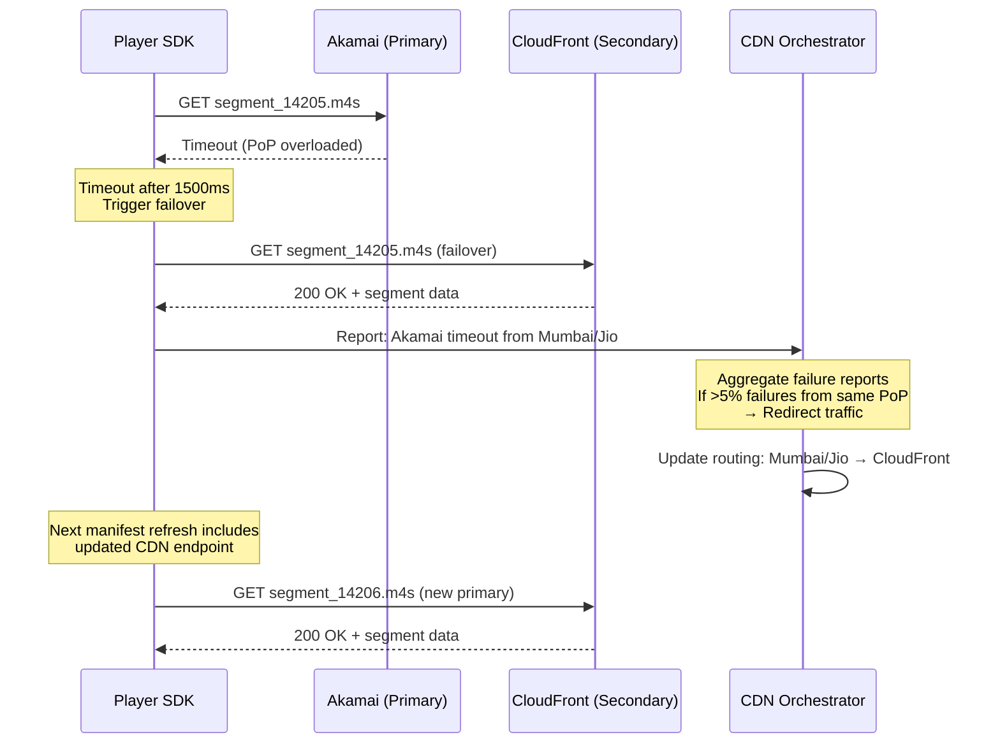

# 05 - CDN and Edge Delivery

## 1. Multi-CDN Strategy

```
┌─────────────────────────────────────────────────────────────────────────────────────────┐
│                          HOTSTAR MULTI-CDN ARCHITECTURE                                    │
│                                                                                           │
│                         ┌──────────────────────────┐                                     │
│                         │   CDN ORCHESTRATOR        │                                     │
│                         │   (Brain of delivery)     │                                     │
│                         │                          │                                     │
│                         │ - Real-time load metrics  │                                     │
│                         │ - Per-ISP performance     │                                     │
│                         │ - Cost optimization       │                                     │
│                         │ - Failover automation     │                                     │
│                         └─────────────┬────────────┘                                     │
│                                       │                                                   │
│              ┌────────────────────────┼─────────────────────────┐                        │
│              │                        │                         │                        │
│              ▼                        ▼                         ▼                        │
│  ┌───────────────────┐   ┌───────────────────┐   ┌───────────────────┐                  │
│  │     AKAMAI        │   │   AWS CLOUDFRONT   │   │      FASTLY       │                  │
│  │                   │   │                   │   │                   │                  │
│  │ - 200+ PoPs India │   │ - 20+ PoPs India  │   │ - 60+ PoPs       │                  │
│  │ - ISP embedding   │   │ - Deep integration│   │ - Compute@Edge   │                  │
│  │ - 40% of traffic  │   │ - 30% of traffic  │   │ - 20% of traffic │                  │
│  │ - Premium tier    │   │ - VOD heavy       │   │ - Edge logic     │                  │
│  └───────────────────┘   └───────────────────┘   └───────────────────┘                  │
│              │                                                                            │
│              ▼                                                                            │
│  ┌───────────────────┐   ┌───────────────────┐                                          │
│  │   JIO CDN (ISP)   │   │  AIRTEL XSTREAM   │                                          │
│  │                   │   │  CDN (ISP)        │                                          │
│  │ - ISP-level cache │   │ - ISP-level cache │                                          │
│  │ - Zero hop for    │   │ - Airtel users    │                                          │
│  │   Jio users       │   │   routed here     │                                          │
│  │ - 10% of traffic  │   │ - 5% of traffic   │   (remaining served by overflow CDNs)    │
│  └───────────────────┘   └───────────────────┘                                          │
└─────────────────────────────────────────────────────────────────────────────────────────┘
```

---

## 2. CDN Routing Decision Engine

```
┌─────────────────────────────────────────────────────────────────────────────────────┐
│                        CDN ROUTING ALGORITHM                                          │
│                                                                                       │
│  Input: {user_ip, isp, state, city, device_type, subscription_tier, current_load}    │
│                                                                                       │
│  ┌─────────────────────────────────────────────────────────────────────────────┐     │
│  │  STEP 1: ISP-Based Primary Selection                                         │     │
│  │  ──────────────────────────────────────                                      │     │
│  │  if user.isp == "Jio" AND jio_cdn.capacity_available:                        │     │
│  │      primary_cdn = "jio_cdn"          // Zero network hops                    │     │
│  │  elif user.isp == "Airtel" AND airtel_cdn.available:                          │     │
│  │      primary_cdn = "airtel_xstream"   // ISP-level delivery                   │     │
│  │  else:                                                                        │     │
│  │      primary_cdn = route_by_geography(user.state, user.city)                  │     │
│  └─────────────────────────────────────────────────────────────────────────────┘     │
│                                                                                       │
│  ┌─────────────────────────────────────────────────────────────────────────────┐     │
│  │  STEP 2: Load-Aware Adjustment                                               │     │
│  │  ─────────────────────────────────                                           │     │
│  │  if primary_cdn.current_load > 85%:                                           │     │
│  │      // Overflow to secondary CDN                                             │     │
│  │      overflow_pct = (current_load - 85) / 15 * 100                            │     │
│  │      route overflow_pct% to secondary_cdn                                     │     │
│  │  if primary_cdn.current_load > 95%:                                           │     │
│  │      // Emergency: redistribute across ALL CDNs                               │     │
│  │      activate_emergency_routing()                                             │     │
│  └─────────────────────────────────────────────────────────────────────────────┘     │
│                                                                                       │
│  ┌─────────────────────────────────────────────────────────────────────────────┐     │
│  │  STEP 3: Quality-Aware Routing                                               │     │
│  │  ─────────────────────────────────                                           │     │
│  │  if requested_quality == "4K":                                                │     │
│  │      route_to = high_capacity_pop(nearest)  // Only large PoPs serve 4K       │     │
│  │  elif requested_quality == "240p":                                            │     │
│  │      route_to = any_pop(cheapest)           // Cost optimization              │     │
│  └─────────────────────────────────────────────────────────────────────────────┘     │
│                                                                                       │
│  ┌─────────────────────────────────────────────────────────────────────────────┐     │
│  │  STEP 4: Client-Side Failover (in Player SDK)                                │     │
│  │  ────────────────────────────────────────────                                │     │
│  │  cdn_list = [primary_cdn, secondary_cdn, tertiary_cdn]                        │     │
│  │  for each segment request:                                                    │     │
│  │      if cdn_list[0].response_time > 2000ms OR error:                          │     │
│  │          switch_to(cdn_list[1])                                               │     │
│  │          report_failure_to_orchestrator()                                     │     │
│  └─────────────────────────────────────────────────────────────────────────────┘     │
└─────────────────────────────────────────────────────────────────────────────────────┘
```

---

## 3. Edge Caching Strategy

### 3.1 Cache Hierarchy

```
┌─────────────────────────────────────────────────────────────────────┐
│                    4-TIER CACHE HIERARCHY                              │
│                                                                       │
│  Layer 1: CLIENT BUFFER (on device)                                   │
│  ┌─────────────────────────────────────────────────────────────┐     │
│  │  - 4-8 seconds of video buffered ahead                       │     │
│  │  - Protects against short network glitches                    │     │
│  │  - ABR algorithm decides when to fetch next segment           │     │
│  └─────────────────────────────────────────────────────────────┘     │
│                              │                                        │
│                              ▼                                        │
│  Layer 2: CDN EDGE PoP (200+ locations in India)                      │
│  ┌─────────────────────────────────────────────────────────────┐     │
│  │  - Serves 99.5% of requests (cache hit ratio for live)        │     │
│  │  - Each PoP: 40-100 Gbps capacity                             │     │
│  │  - Hot content (last 60 sec of live) in RAM                    │     │
│  │  - Older segments on NVMe SSD                                  │     │
│  │  - TTL: 4 seconds for live manifests, 24h for segments         │     │
│  │  - Request coalescing: only 1 origin fetch per segment         │     │
│  └─────────────────────────────────────────────────────────────┘     │
│                              │                                        │
│                              ▼ (cache miss)                           │
│  Layer 3: SHIELD / MID-TIER CACHE (5-10 locations)                    │
│  ┌─────────────────────────────────────────────────────────────┐     │
│  │  - Aggregates requests from 20-40 edge PoPs                   │     │
│  │  - Reduces origin load by 99%                                  │     │
│  │  - 500 Gbps+ capacity per shield                               │     │
│  │  - Full DVR window cached (4 hours of all qualities)           │     │
│  │  - Proactive: fetches next segment BEFORE edges request it     │     │
│  └─────────────────────────────────────────────────────────────┘     │
│                              │                                        │
│                              ▼ (cache miss - very rare for live)      │
│  Layer 4: ORIGIN (S3 + Origin servers)                                │
│  ┌─────────────────────────────────────────────────────────────┐     │
│  │  - Transcoder writes directly to origin storage               │     │
│  │  - Only hit for: first viewer ever, DVR beyond cache window    │     │
│  │  - Multi-region: Mumbai primary, Singapore secondary           │     │
│  │  - Origin shield fronts S3 (prevents S3 rate limiting)         │     │
│  └─────────────────────────────────────────────────────────────┘     │
└─────────────────────────────────────────────────────────────────────┘
```

### 3.2 Why Cache Hit Ratio is 99.5% for Live

```
Key Insight: During live cricket, ALL 25M viewers watch the SAME content
at approximately the SAME time (within a few seconds of each other).

Segment lifetime on edge:
- Segment created at T=0 by transcoder
- First viewer at PoP requests at T=2 (cache miss, fetched from shield)
- All subsequent viewers at same PoP get cache hit
- Segment stays relevant for ~10 seconds (sliding window)
- In a PoP with 100,000 concurrent viewers:
    - 1 cache miss (first request)
    - 99,999 cache hits
    - Hit ratio: 99.999%

Compare with VOD (Netflix-style):
- Long tail of content (100K titles)
- Each user watches different content
- Cache hit ratio: 70-80% (much lower)

THIS is why live streaming at scale is actually CHEAPER per-user than VOD
in terms of CDN bandwidth utilization efficiency.
```

---

## 4. ISP Peering & Last-Mile Optimization

```
┌─────────────────────────────────────────────────────────────────────────────────┐
│                    ISP-LEVEL OPTIMIZATION (India-Specific)                         │
│                                                                                   │
│  India's Internet Landscape:                                                      │
│  - Jio: 450M+ subscribers (45% market share)                                     │
│  - Airtel: 350M+ subscribers (35% market share)                                   │
│  - Vi (Vodafone-Idea): 200M+ subscribers                                          │
│  - BSNL: 100M+ subscribers                                                        │
│  - Broadband (Jio Fiber, Airtel Fiber, ACT, etc.): 30M+                          │
│                                                                                   │
│  ┌─────────────────────────────────────────────────────────────────────────┐     │
│  │  STRATEGY 1: ISP-Embedded Caches                                         │     │
│  │                                                                           │     │
│  │  Jio Data Center                                                          │     │
│  │  ┌─────────────────────────────┐                                         │     │
│  │  │  Hotstar Cache Servers (×50)│  ← Deployed INSIDE Jio's network        │     │
│  │  │  - 500 TB storage           │                                          │     │
│  │  │  - 10 Tbps egress capacity  │  Traffic never leaves Jio's network!     │     │
│  │  │  - All live + top VOD cached│                                          │     │
│  │  │  - Latency: 5-10ms to user  │  (vs 50-100ms for external CDN)         │     │
│  │  └─────────────────────────────┘                                         │     │
│  │                                                                           │     │
│  │  Similar deployments in Airtel, Vi, BSNL                                  │     │
│  └─────────────────────────────────────────────────────────────────────────┘     │
│                                                                                   │
│  ┌─────────────────────────────────────────────────────────────────────────┐     │
│  │  STRATEGY 2: Private Peering                                             │     │
│  │                                                                           │     │
│  │  Instead of going through public internet exchange:                       │     │
│  │  Hotstar ←── Private Fiber ──→ Jio Core Network                          │     │
│  │  Hotstar ←── Private Fiber ──→ Airtel Core Network                       │     │
│  │                                                                           │     │
│  │  Benefits:                                                                │     │
│  │  - Guaranteed bandwidth (no congestion)                                   │     │
│  │  - Lower latency (direct path)                                            │     │
│  │  - No transit costs                                                       │     │
│  │  - SLA-backed delivery                                                    │     │
│  └─────────────────────────────────────────────────────────────────────────┘     │
│                                                                                   │
│  ┌─────────────────────────────────────────────────────────────────────────┐     │
│  │  STRATEGY 3: P2P Augmentation (WebRTC-based)                             │     │
│  │                                                                           │     │
│  │  During extreme peaks when CDN is saturated:                              │     │
│  │                                                                           │     │
│  │  User A (has segment) ──── WebRTC ───── User B (needs segment)           │     │
│  │         ↕                                        ↕                        │     │
│  │  User C (has segment) ──── WebRTC ───── User D (needs segment)           │     │
│  │                                                                           │     │
│  │  - Same ISP, same city users share segments peer-to-peer                  │     │
│  │  - Reduces CDN load by 20-40% at peak                                    │     │
│  │  - Only for non-DRM content (free tier highlights, pre-show)              │     │
│  │  - Mesh network of nearby users auto-organized                            │     │
│  │  - Fallback to CDN if P2P latency > threshold                            │     │
│  └─────────────────────────────────────────────────────────────────────────┘     │
└─────────────────────────────────────────────────────────────────────────────────┘
```

---

## 5. CDN Pre-Warming Strategy

```
┌─────────────────────────────────────────────────────────────────────┐
│              PRE-WARMING SEQUENCE (Before IPL Match)                   │
│                                                                       │
│  T-24 hours:                                                          │
│  ┌─────────────────────────────────────────────────────────────┐     │
│  │  - Notify all CDN partners of expected peak traffic           │     │
│  │  - Reserve additional capacity (burst agreements)             │     │
│  │  - Pre-position VOD highlights from previous matches          │     │
│  │  - Verify all edge PoPs health                                │     │
│  └─────────────────────────────────────────────────────────────┘     │
│                                                                       │
│  T-4 hours:                                                           │
│  ┌─────────────────────────────────────────────────────────────┐     │
│  │  - Push pre-show content to ALL edge caches                   │     │
│  │  - Warm up DNS resolvers (increase TTL temporarily)           │     │
│  │  - Pre-establish persistent connections between tiers          │     │
│  │  - Load initialization segments (fMP4 init) to all edges      │     │
│  └─────────────────────────────────────────────────────────────┘     │
│                                                                       │
│  T-1 hour:                                                            │
│  ┌─────────────────────────────────────────────────────────────┐     │
│  │  - Start synthetic traffic (simulate 1M viewers)              │     │
│  │  - Fill edge caches with pre-match content                    │     │
│  │  - Verify end-to-end latency from all major cities            │     │
│  │  - Enable "event mode" routing (ISP-specific paths)           │     │
│  │  - Scale origin servers to peak capacity                      │     │
│  └─────────────────────────────────────────────────────────────┘     │
│                                                                       │
│  T-10 minutes:                                                        │
│  ┌─────────────────────────────────────────────────────────────┐     │
│  │  - Transcoder live and producing segments                     │     │
│  │  - First live segments pushed to ALL shields (not waiting     │     │
│  │    for requests)                                               │     │
│  │  - Edge PoPs begin proactive pulling from shields              │     │
│  │  - Real-time dashboard active for SRE team                    │     │
│  └─────────────────────────────────────────────────────────────┘     │
│                                                                       │
│  T-0 (First ball):                                                    │
│  ┌─────────────────────────────────────────────────────────────┐     │
│  │  - 500K stream starts/second                                  │     │
│  │  - All edges already have latest segments cached              │     │
│  │  - Zero cold-start problem (pre-warmed)                       │     │
│  │  - CDN orchestrator actively balancing across providers        │     │
│  └─────────────────────────────────────────────────────────────┘     │
└─────────────────────────────────────────────────────────────────────┘
```

---

## 6. Request Coalescing (Thundering Herd Prevention at CDN)

```
Problem:
  - 25M viewers all request segment_14205 within the same 2-second window
  - Without coalescing: 25M requests hit origin (impossible)
  - With coalescing: 1 request per edge PoP hits shield → 1 request per shield hits origin

┌─────────────────────────────────────────────────────────────────────┐
│                REQUEST COALESCING MECHANISM                            │
│                                                                       │
│  At each CDN edge PoP:                                                │
│                                                                       │
│  T=0.000s: Request for segment_14205 from User_1                      │
│            → Cache MISS                                               │
│            → Lock segment_14205 in "fetching" state                   │
│            → Send request to shield cache                             │
│                                                                       │
│  T=0.001s: Request for segment_14205 from User_2                      │
│            → Cache MISS but segment is in "fetching" state            │
│            → ADD User_2 to wait queue (don't send another origin req) │
│                                                                       │
│  T=0.002s: Request for segment_14205 from User_3...User_50000         │
│            → ALL added to wait queue                                   │
│                                                                       │
│  T=0.150s: Shield responds with segment_14205 data                    │
│            → Store in cache                                           │
│            → Respond to ALL 50,000 waiting requests simultaneously     │
│            → Cache state: "cached" (subsequent requests served instant)│
│                                                                       │
│  Result:                                                              │
│  - 50,000 user requests at edge → 1 request to shield                 │
│  - 200 shield requests → 1 request to origin                          │
│  - 25,000,000 user requests → ~200 origin requests per segment        │
│  - Origin load: 200 req/2sec = 100 RPS (trivial!)                     │
└─────────────────────────────────────────────────────────────────────┘
```

---

## 7. Bandwidth Management & QoS

```
┌─────────────────────────────────────────────────────────────────────┐
│              BANDWIDTH MANAGEMENT STRATEGIES                           │
│                                                                       │
│  1. PROGRESSIVE QUALITY LADDER                                        │
│  ──────────────────────────────                                       │
│  Start all new sessions at 480p, then upgrade:                        │
│  - Prevents bandwidth stampede at match start                          │
│  - Users see content immediately (fast start)                          │
│  - ABR algorithm upgrades quality over 5-10 seconds                    │
│  - Reduces peak CDN load by 40% during first 30 seconds               │
│                                                                       │
│  2. QUALITY CAP DURING EXTREME PEAKS                                  │
│  ──────────────────────────────────────                               │
│  If CDN load > 90%:                                                   │
│  - Cap mobile users at 720p (most can't tell on 6" screen)            │
│  - Disable 4K temporarily                                              │
│  - Reduce ABR ladder to 4 levels (instead of 8)                        │
│  - Result: Same user experience, 30% less bandwidth                    │
│                                                                       │
│  3. DATA SAVER MODE (India-specific)                                  │
│  ──────────────────────────────────                                   │
│  For users with limited data plans:                                    │
│  - Lock quality at 480p or below                                       │
│  - Audio-only option available                                         │
│  - Estimated data: 500 MB for full match (vs 5 GB at 1080p)           │
│                                                                       │
│  4. INTELLIGENT PREFETCHING                                           │
│  ─────────────────────────────                                        │
│  Client SDK behavior:                                                  │
│  - Prefetch next 2 segments in current quality                         │
│  - If network idle, prefetch 1 segment in next-higher quality          │
│  - During ad breaks: aggressively prefetch post-ad segments            │
│  - Battery-aware: reduce prefetch on low battery                       │
└─────────────────────────────────────────────────────────────────────┘
```

---

## 8. Multi-CDN Failover Flow



---

## 9. CDN Cost Optimization

```
┌─────────────────────────────────────────────────────────────────────┐
│              CDN COST STRUCTURE (at Hotstar's scale)                   │
│                                                                       │
│  Monthly Bandwidth Costs (estimated):                                 │
│  - Normal month: 10 PB egress × $0.02/GB = $200,000                  │
│  - IPL month: 80 PB egress × $0.015/GB = $1,200,000                  │
│  (Volume discounts apply at this scale)                               │
│                                                                       │
│  Cost Optimization Strategies:                                        │
│  ──────────────────────────────                                       │
│  1. ISP-embedded caches: $0 egress (peering agreement)                │
│  2. Multi-CDN bidding: CDNs compete on price for traffic share        │
│  3. Off-peak to cheapest CDN (VOD doesn't need premium CDN)           │
│  4. Committed capacity discounts (guaranteed volume)                   │
│  5. P2P offload: 20% of non-premium traffic via P2P                   │
│  6. Quality capping reduces bandwidth by 30% at peak                   │
│  7. Efficient codecs (H.265 saves 40% vs H.264 at same quality)      │
│                                                                       │
│  Overall savings vs naive single-CDN: ~60%                            │
└─────────────────────────────────────────────────────────────────────┘
```
