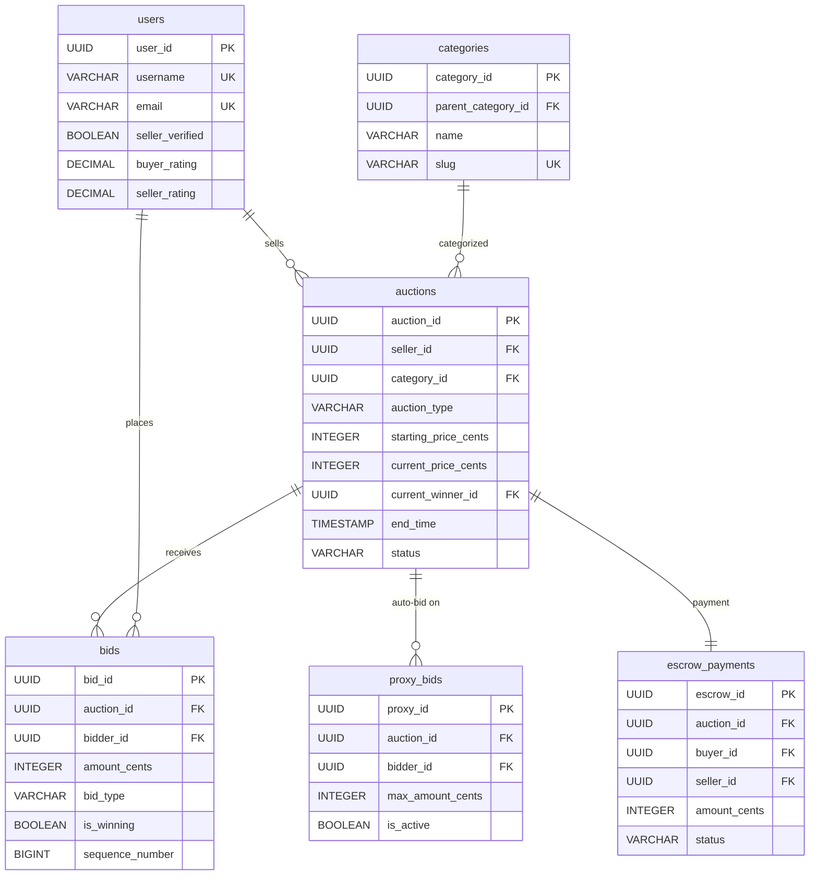
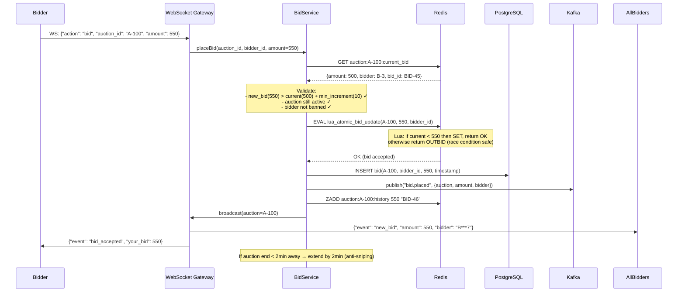
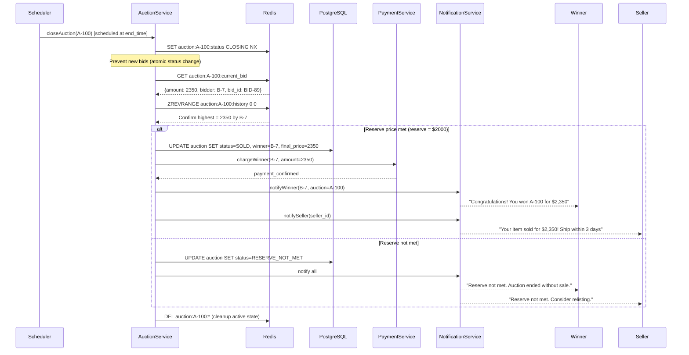

# Design Auction/Bidding Platform

## 1. Functional Requirements

### Core Features
- **Create Auction**: Seller lists item with reserve price, duration, description, photos
- **Real-Time Bidding**: Place bids with instant feedback, outbid notifications
- **Auto-Bid/Proxy Bidding**: Set maximum bid, system bids incrementally on behalf
- **Bid Sniping Protection**: Extend auction if bid placed in final seconds
- **Auction Clock/Countdown**: Real-time countdown visible to all participants
- **Winner Determination**: Automatic winner selection at auction close
- **Payment Escrow**: Hold winner's payment until item delivery confirmed
- **Bid History**: Full transparent history of all bids on an item
- **Categories/Search**: Browse/search auctions by category, price range, ending soon

### Auction Types
1. **English (Ascending)**: Classic - highest bidder wins
2. **Dutch (Descending)**: Price drops until someone buys
3. **Sealed-Bid First Price**: Hidden bids, highest wins, pays their bid
4. **Buy-It-Now + Auction**: Option to buy immediately at fixed price
5. **Reserve Auction**: Won't sell below reserve (hidden from bidders)

## 2. Non-Functional Requirements

| Requirement | Target |
|---|---|
| Bid Processing | P99 < 100ms |
| Bid Consistency | Strong (no bid accepted on closed auction) |
| Real-Time Updates | < 500ms from bid to all viewers |
| Auction Clock | Synchronized within 100ms across clients |
| Availability | 99.99% during auction end times |
| Concurrent Bidders | 100K+ on same auction (celebrity/rare items) |
| Throughput | 50K bids/sec platform-wide |
| Bid Ordering | Strict timestamp ordering (no two bids same rank) |
| Payment Hold | < 3s for winner payment capture |
| Fraud Detection | Real-time, < 1s scoring per bid |

## 3. Capacity Estimation

### Storage
```
Auctions: 10M active × 5KB = 50GB
Auction items: 10M × 10 photos × 2MB = 200TB (CDN)
Bids: 500M/month × 200B = 100GB/month
Users: 50M × 2KB = 100GB
Payment records: 20M/month × 1KB = 20GB/month
Bid history (archive): 6B bids/year × 200B = 1.2TB/year
Fraud signals: 500M/month × 500B = 250GB/month
```

### Throughput
```
Active auctions at any time: 2M
Bids per second (global): 50K
Bids per second (single hot auction): 5K
WebSocket connections: 5M concurrent
Auction closings: 500/sec (clustered around round hours)
Search queries: 20K/sec
Real-time notifications: 100K/sec
```

## 4. Data Modeling

### Entity-Relationship Diagram



### Full Database Schemas

```sql
-- Users
CREATE TABLE users (
    user_id UUID PRIMARY KEY DEFAULT gen_random_uuid(),
    username VARCHAR(50) UNIQUE NOT NULL,
    email VARCHAR(255) UNIQUE NOT NULL,
    phone VARCHAR(20),
    display_name VARCHAR(100),
    avatar_url TEXT,
    seller_verified BOOLEAN DEFAULT FALSE,
    buyer_rating DECIMAL(3,2),
    seller_rating DECIMAL(3,2),
    total_purchases INT DEFAULT 0,
    total_sales INT DEFAULT 0,
    payment_methods JSONB, -- stored payment method tokens
    shipping_addresses JSONB,
    account_status VARCHAR(20) DEFAULT 'active', -- active, suspended, banned
    fraud_score DECIMAL(4,3) DEFAULT 0, -- 0 = clean, 1 = definitely fraud
    created_at TIMESTAMP DEFAULT NOW(),
    last_active TIMESTAMP
);
CREATE INDEX idx_users_username ON users(username);
CREATE INDEX idx_users_fraud ON users(fraud_score) WHERE fraud_score > 0.5;

-- Categories
CREATE TABLE categories (
    category_id UUID PRIMARY KEY DEFAULT gen_random_uuid(),
    name VARCHAR(100) NOT NULL,
    slug VARCHAR(100) UNIQUE NOT NULL,
    parent_category_id UUID REFERENCES categories(category_id),
    depth INT DEFAULT 0,
    sort_order INT DEFAULT 0,
    icon_url TEXT
);

-- Auctions
CREATE TABLE auctions (
    auction_id UUID PRIMARY KEY DEFAULT gen_random_uuid(),
    seller_id UUID NOT NULL REFERENCES users(user_id),
    title VARCHAR(300) NOT NULL,
    description TEXT,
    category_id UUID REFERENCES categories(category_id),
    condition VARCHAR(30), -- new, like_new, good, fair, poor
    auction_type VARCHAR(30) NOT NULL DEFAULT 'english',
    -- english, dutch, sealed_bid, buy_now_auction
    starting_price_cents INT NOT NULL,
    reserve_price_cents INT, -- hidden minimum (NULL = no reserve)
    buy_now_price_cents INT, -- instant purchase price (NULL = no buy-now)
    bid_increment_cents INT NOT NULL DEFAULT 100, -- minimum bid increase
    current_price_cents INT NOT NULL, -- current highest bid
    current_winner_id UUID REFERENCES users(user_id),
    total_bids INT DEFAULT 0,
    unique_bidders INT DEFAULT 0,
    watchers_count INT DEFAULT 0,
    start_time TIMESTAMP NOT NULL,
    end_time TIMESTAMP NOT NULL,
    original_end_time TIMESTAMP NOT NULL, -- before any extensions
    extension_count INT DEFAULT 0,
    extension_seconds INT DEFAULT 120, -- extend by 2 min on late bid
    snipe_protection_window_seconds INT DEFAULT 30, -- bid within last 30s triggers extension
    status VARCHAR(20) NOT NULL DEFAULT 'scheduled',
    -- scheduled, active, ending_soon, ended, sold, unsold, cancelled
    reserve_met BOOLEAN DEFAULT FALSE,
    currency CHAR(3) DEFAULT 'USD',
    shipping_options JSONB,
    location_city VARCHAR(100),
    location_country VARCHAR(100),
    featured BOOLEAN DEFAULT FALSE,
    view_count INT DEFAULT 0,
    created_at TIMESTAMP DEFAULT NOW(),
    updated_at TIMESTAMP DEFAULT NOW()
);
CREATE INDEX idx_auctions_status ON auctions(status, end_time);
CREATE INDEX idx_auctions_category ON auctions(category_id, status) WHERE status = 'active';
CREATE INDEX idx_auctions_ending ON auctions(end_time) WHERE status IN ('active', 'ending_soon');
CREATE INDEX idx_auctions_seller ON auctions(seller_id, created_at DESC);
CREATE INDEX idx_auctions_winner ON auctions(current_winner_id) WHERE status = 'sold';

-- Auction photos
CREATE TABLE auction_photos (
    photo_id UUID PRIMARY KEY DEFAULT gen_random_uuid(),
    auction_id UUID NOT NULL REFERENCES auctions(auction_id),
    url TEXT NOT NULL,
    thumbnail_url TEXT,
    sort_order INT NOT NULL,
    is_primary BOOLEAN DEFAULT FALSE,
    uploaded_at TIMESTAMP DEFAULT NOW()
);

-- Bids
CREATE TABLE bids (
    bid_id UUID PRIMARY KEY DEFAULT gen_random_uuid(),
    auction_id UUID NOT NULL REFERENCES auctions(auction_id),
    bidder_id UUID NOT NULL REFERENCES users(user_id),
    amount_cents INT NOT NULL,
    max_amount_cents INT, -- proxy bid maximum (hidden)
    bid_type VARCHAR(20) NOT NULL DEFAULT 'manual',
    -- manual, proxy_auto, buy_now, starting
    is_winning BOOLEAN DEFAULT FALSE,
    is_valid BOOLEAN DEFAULT TRUE,
    invalidation_reason VARCHAR(100),
    placed_at TIMESTAMP NOT NULL DEFAULT NOW(),
    -- High precision timestamp for ordering
    sequence_number BIGINT NOT NULL, -- global sequence for strict ordering
    ip_address INET,
    user_agent TEXT,
    device_fingerprint VARCHAR(64)
);
CREATE INDEX idx_bids_auction ON bids(auction_id, amount_cents DESC, placed_at);
CREATE INDEX idx_bids_bidder ON bids(bidder_id, placed_at DESC);
CREATE INDEX idx_bids_auction_time ON bids(auction_id, placed_at DESC);
CREATE UNIQUE INDEX idx_bids_sequence ON bids(auction_id, sequence_number);

-- Proxy bids (auto-bidding configuration)
CREATE TABLE proxy_bids (
    proxy_id UUID PRIMARY KEY DEFAULT gen_random_uuid(),
    auction_id UUID NOT NULL REFERENCES auctions(auction_id),
    bidder_id UUID NOT NULL REFERENCES users(user_id),
    max_amount_cents INT NOT NULL,
    current_bid_cents INT NOT NULL, -- current proxy-placed bid
    is_active BOOLEAN DEFAULT TRUE,
    created_at TIMESTAMP DEFAULT NOW(),
    updated_at TIMESTAMP DEFAULT NOW(),
    UNIQUE(auction_id, bidder_id) -- one proxy per user per auction
);
CREATE INDEX idx_proxy_active ON proxy_bids(auction_id) WHERE is_active = TRUE;

-- Auction watchlist
CREATE TABLE auction_watchers (
    user_id UUID NOT NULL REFERENCES users(user_id),
    auction_id UUID NOT NULL REFERENCES auctions(auction_id),
    notify_outbid BOOLEAN DEFAULT TRUE,
    notify_ending BOOLEAN DEFAULT TRUE,
    notify_price_drop BOOLEAN DEFAULT TRUE,
    created_at TIMESTAMP DEFAULT NOW(),
    PRIMARY KEY (user_id, auction_id)
);

-- Payment escrow
CREATE TABLE escrow_payments (
    escrow_id UUID PRIMARY KEY DEFAULT gen_random_uuid(),
    auction_id UUID NOT NULL REFERENCES auctions(auction_id),
    buyer_id UUID NOT NULL REFERENCES users(user_id),
    seller_id UUID NOT NULL REFERENCES users(user_id),
    amount_cents INT NOT NULL,
    platform_fee_cents INT NOT NULL,
    seller_payout_cents INT NOT NULL,
    payment_intent_id VARCHAR(255), -- Stripe payment intent
    status VARCHAR(20) NOT NULL DEFAULT 'pending',
    -- pending, authorized, captured, released_to_seller, refunded, disputed
    authorized_at TIMESTAMP,
    captured_at TIMESTAMP,
    released_at TIMESTAMP,
    dispute_reason TEXT,
    created_at TIMESTAMP DEFAULT NOW()
);
CREATE INDEX idx_escrow_auction ON escrow_payments(auction_id);
CREATE INDEX idx_escrow_status ON escrow_payments(status) WHERE status IN ('authorized', 'captured');

-- Auction results
CREATE TABLE auction_results (
    result_id UUID PRIMARY KEY DEFAULT gen_random_uuid(),
    auction_id UUID NOT NULL REFERENCES auctions(auction_id),
    winner_id UUID REFERENCES users(user_id),
    winning_bid_id UUID REFERENCES bids(bid_id),
    final_price_cents INT,
    reserve_met BOOLEAN,
    total_bids INT,
    unique_bidders INT,
    auction_duration_seconds INT,
    extensions_used INT,
    closed_at TIMESTAMP NOT NULL,
    created_at TIMESTAMP DEFAULT NOW()
);

-- Fraud signals
CREATE TABLE fraud_signals (
    signal_id UUID PRIMARY KEY DEFAULT gen_random_uuid(),
    auction_id UUID REFERENCES auctions(auction_id),
    user_id UUID REFERENCES users(user_id),
    signal_type VARCHAR(50) NOT NULL,
    -- shill_bidding, velocity_anomaly, ring_bidding, bid_manipulation, account_takeover
    severity VARCHAR(10), -- low, medium, high, critical
    confidence DECIMAL(3,2),
    details JSONB,
    action_taken VARCHAR(30), -- none, flagged, bid_invalidated, user_suspended
    detected_at TIMESTAMP DEFAULT NOW(),
    reviewed_at TIMESTAMP,
    reviewer_id UUID
);
CREATE INDEX idx_fraud_user ON fraud_signals(user_id, detected_at DESC);
CREATE INDEX idx_fraud_auction ON fraud_signals(auction_id);
CREATE INDEX idx_fraud_unreviewed ON fraud_signals(reviewed_at) WHERE reviewed_at IS NULL;
```

## 5. High-Level Design (HLD)

```
┌──────────────────────────────────────────────────────────────────────────────────┐
│                              CLIENT LAYER                                          │
│  ┌──────────┐  ┌──────────┐  ┌──────────────┐  ┌──────────────┐               │
│  │  Web App │  │  Mobile  │  │   API        │  │   Admin      │               │
│  │  (React) │  │  Apps    │  │  Partners    │  │  Dashboard   │               │
│  └────┬─────┘  └────┬─────┘  └──────┬───────┘  └──────┬───────┘               │
│       │   WebSocket  │               │                  │                        │
└───────┼──────────────┼───────────────┼──────────────────┼────────────────────────┘
        │              │               │                  │
        ▼              ▼               ▼                  ▼
┌──────────────────────────────────────────────────────────────────────────────────┐
│                        GATEWAY & REAL-TIME LAYER                                  │
│  ┌──────────┐  ┌────────────────┐  ┌──────────────┐  ┌────────────────┐       │
│  │ API GW   │  │  WebSocket     │  │  Rate Limiter│  │  Auth + Fraud  │       │
│  │ (Kong)   │  │  Server Farm   │  │  (per-user)  │  │  Pre-check     │       │
│  └──────────┘  │  (Socket.io)   │  └──────────────┘  └────────────────┘       │
│                 └────────────────┘                                               │
└───────────────────────────────────────┬──────────────────────────────────────────┘
                                        │
     ┌─────────────┬───────────────────┼────────────────┬───────────────┐
     ▼             ▼                   ▼                ▼               ▼
┌──────────┐ ┌───────────┐ ┌──────────────┐ ┌───────────────┐ ┌────────────┐
│  Auction │ │   Bid     │ │   Timer /    │ │   Payment /   │ │   Fraud    │
│  Service │ │  Service  │ │   Clock      │ │   Escrow      │ │  Detection │
│          │ │           │ │   Service    │ │   Service     │ │  Service   │
│          │ │           │ │              │ │               │ │            │
│- Create  │ │- Place bid│ │- Countdown   │ │- Authorize    │ │- Real-time │
│- Search  │ │- Proxy bid│ │- Extensions  │ │- Capture      │ │- Shill det │
│- Catalog │ │- Validate │ │- Close auc   │ │- Release      │ │- Velocity  │
│- Status  │ │- History  │ │- Notify end  │ │- Refund       │ │- Ring bid  │
└────┬─────┘ └─────┬─────┘ └──────┬───────┘ └───────┬───────┘ └─────┬──────┘
     │              │              │                  │               │
     ▼              ▼              ▼                  ▼               ▼
┌──────────────────────────────────────────────────────────────────────────────────┐
│                           DATA & EVENT LAYER                                      │
│                                                                                   │
│ ┌────────────┐ ┌────────────┐ ┌──────────────┐ ┌───────────────────┐           │
│ │ PostgreSQL │ │   Redis    │ │    Kafka     │ │  Elasticsearch    │           │
│ │ (Sharded)  │ │  Cluster   │ │              │ │                   │           │
│ │            │ │            │ │              │ │- Auction search   │           │
│ │- Auctions  │ │- Bid state │ │- bid.events  │ │- Category browse  │           │
│ │- Bids      │ │- Auction   │ │- auction.    │ │- Full-text search │           │
│ │- Users     │ │  timers    │ │  lifecycle   │ │                   │           │
│ │- Escrow    │ │- Leaderboard│ │- fraud.      │ └───────────────────┘           │
│ │            │ │- Proxy bids│ │  signals     │                                  │
│ │            │ │- WS state  │ │- notification│ ┌───────────────────┐           │
│ └────────────┘ └────────────┘ │- payment.    │ │  Apache Flink    │           │
│                               │  events      │ │  (Fraud stream)  │           │
│ ┌────────────┐ ┌────────────┐ └──────────────┘ └───────────────────┘           │
│ │    S3      │ │ ClickHouse │                                                   │
│ │  (Photos)  │ │ (Analytics)│                                                   │
│ └────────────┘ └────────────┘                                                   │
└──────────────────────────────────────────────────────────────────────────────────┘
```

## 6. Low-Level Design (LLD) - APIs

### Create Auction API
```
POST /api/v1/auctions
Request:
{
    "title": "Rare 1952 Mickey Mantle Topps #311 PSA 8",
    "description": "Authenticated PSA grade 8 near-mint...",
    "category_id": "cat_sports_cards",
    "condition": "like_new",
    "auction_type": "english",
    "starting_price": 10000.00,
    "reserve_price": 50000.00,
    "buy_now_price": 150000.00,
    "bid_increment": 500.00,
    "duration_hours": 168,  // 7 days
    "snipe_protection_window_seconds": 60,
    "extension_seconds": 120,
    "currency": "USD",
    "photos": ["https://upload.auction.com/temp/img1.jpg", "..."],
    "shipping_options": [
        {"method": "standard", "price": 15.00, "days": "5-7"},
        {"method": "express", "price": 45.00, "days": "1-2"}
    ],
    "location": {"city": "New York", "country": "US"}
}

Response:
{
    "auction_id": "auc_abc123",
    "status": "scheduled",
    "start_time": "2024-07-15T12:00:00Z",
    "end_time": "2024-07-22T12:00:00Z",
    "url": "https://auction.com/items/auc_abc123",
    "listing_fee_cents": 500,
    "final_value_fee_percent": 10
}
```

### Place Bid API
```
POST /api/v1/auctions/{auction_id}/bids
Request:
{
    "amount": 12500.00,
    "max_amount": 15000.00,  // optional: proxy bid maximum
    "bid_type": "manual"     // or "proxy"
}

Response (Success):
{
    "bid_id": "bid_xyz789",
    "status": "winning",
    "amount": 12500.00,
    "is_highest": true,
    "auction_state": {
        "current_price": 12500.00,
        "total_bids": 47,
        "unique_bidders": 12,
        "time_remaining_seconds": 345600,
        "end_time": "2024-07-22T12:00:00Z",
        "reserve_met": false
    },
    "next_minimum_bid": 13000.00,
    "proxy_active": true,
    "proxy_max": 15000.00
}

Response (Outbid - proxy bid from another user is higher):
{
    "bid_id": "bid_xyz790",
    "status": "outbid",
    "amount": 12500.00,
    "is_highest": false,
    "current_price": 13000.00,  // proxy bid auto-incremented
    "message": "You've been outbid. The current price is $13,000.",
    "next_minimum_bid": 13500.00
}

Response (Auction ended):
{
    "error": "AUCTION_CLOSED",
    "message": "This auction has ended.",
    "final_price": 52000.00,
    "winner": "another_user"
}
```

### Get Auction State (Real-Time)
```
// WebSocket connection: wss://ws.auction.com/auctions/{auction_id}

// Server pushes on new bid:
{
    "type": "new_bid",
    "bid": {
        "bidder": "j***n",  // anonymized
        "amount": 13500.00,
        "bid_number": 48,
        "placed_at": "2024-07-18T15:30:42.123Z"
    },
    "auction_state": {
        "current_price": 13500.00,
        "total_bids": 48,
        "unique_bidders": 13,
        "time_remaining_seconds": 259158,
        "reserve_met": false,
        "next_minimum_bid": 14000.00
    }
}

// Timer sync (every second):
{
    "type": "timer_sync",
    "time_remaining_seconds": 259157,
    "server_time": "2024-07-18T15:30:43.000Z"
}

// Extension triggered:
{
    "type": "extension",
    "reason": "bid_in_final_seconds",
    "extension_seconds": 120,
    "new_end_time": "2024-07-22T12:02:00Z",
    "time_remaining_seconds": 120,
    "message": "Auction extended by 2 minutes due to last-second bid!"
}

// Auction ended:
{
    "type": "auction_ended",
    "result": {
        "status": "sold",
        "final_price": 52000.00,
        "winner_display": "j***n",
        "total_bids": 156,
        "unique_bidders": 23
    }
}
```

### Bid History API
```
GET /api/v1/auctions/{auction_id}/bids?page=1&limit=50

Response:
{
    "bids": [
        {
            "bid_number": 156,
            "bidder_display": "j***n",
            "amount": 52000.00,
            "placed_at": "2024-07-22T11:59:45Z",
            "is_winning": true,
            "triggered_extension": true
        },
        {
            "bid_number": 155,
            "bidder_display": "m***e",
            "amount": 51500.00,
            "placed_at": "2024-07-22T11:59:30Z",
            "is_winning": false,
            "bid_type": "proxy_auto"
        }
    ],
    "total_bids": 156,
    "unique_bidders": 23,
    "starting_price": 10000.00,
    "final_price": 52000.00
}
```

## 7. Deep Dives

### Deep Dive 1: Real-Time Bid Processing (Concurrent Bids Within Milliseconds)

**Problem**: Multiple users bid on the same auction simultaneously. Must ensure strict ordering, correct winner determination, and no race conditions.

```python
class BidProcessor:
    """
    Core bid processing with optimistic locking and Redis for real-time state.
    
    Architecture:
    1. Bid arrives → validate → acquire auction lock → process → release
    2. Redis holds authoritative real-time auction state
    3. PostgreSQL is durable storage (async write)
    4. Kafka for event propagation
    
    Key guarantee: Only ONE bid can be processed at a time per auction (serialized)
    """
    
    def __init__(self, redis, db, kafka, fraud_service, ws_broadcaster):
        self.redis = redis
        self.db = db
        self.kafka = kafka
        self.fraud = fraud_service
        self.ws = ws_broadcaster
    
    async def place_bid(self, auction_id: str, bidder_id: str, amount_cents: int,
                        max_amount_cents: int = None) -> BidResult:
        
        # Step 1: Quick pre-validation (no lock needed)
        auction_state = await self._get_auction_state(auction_id)
        pre_check = self._pre_validate(auction_state, bidder_id, amount_cents)
        if not pre_check.valid:
            return BidResult(success=False, error=pre_check.error)
        
        # Step 2: Real-time fraud check (async, non-blocking for low-risk)
        fraud_score = await self.fraud.score_bid(auction_id, bidder_id, amount_cents)
        if fraud_score > 0.9:
            return BidResult(success=False, error="BID_REJECTED")
        
        # Step 3: Acquire auction-level lock (Redis distributed lock)
        lock_key = f"auction_lock:{auction_id}"
        lock = await self.redis.lock(lock_key, timeout=5)  # 5s max hold
        
        if not lock:
            return BidResult(success=False, error="AUCTION_BUSY")
        
        try:
            # Step 4: Re-validate under lock (state may have changed)
            state = await self._get_auction_state(auction_id)
            
            if state['status'] != 'active':
                return BidResult(success=False, error="AUCTION_CLOSED")
            
            if amount_cents <= state['current_price_cents']:
                return BidResult(success=False, error="BID_TOO_LOW",
                                 minimum=state['current_price_cents'] + state['bid_increment_cents'])
            
            if amount_cents < state['current_price_cents'] + state['bid_increment_cents']:
                return BidResult(success=False, error="BELOW_INCREMENT")
            
            # Step 5: Process proxy bids
            effective_amount = amount_cents
            if max_amount_cents:
                # Set up proxy bid
                await self._set_proxy_bid(auction_id, bidder_id, max_amount_cents)
            
            # Check if existing proxy bids counter this bid
            proxy_result = await self._process_proxy_bids(auction_id, bidder_id, amount_cents)
            if proxy_result.outbid:
                effective_amount = proxy_result.new_price
                # The proxy bidder still wins at a higher price
            
            # Step 6: Assign sequence number (monotonic)
            sequence = await self.redis.incr(f"auction_seq:{auction_id}")
            
            # Step 7: Update auction state in Redis
            new_state = {
                'current_price_cents': effective_amount,
                'current_winner_id': proxy_result.winner_id or bidder_id,
                'total_bids': state['total_bids'] + 1,
                'last_bid_at': datetime.utcnow().isoformat(),
            }
            await self.redis.hset(f"auction:{auction_id}", mapping=new_state)
            
            # Step 8: Check snipe protection (extend if bid in final seconds)
            time_remaining = self._time_remaining(state['end_time'])
            if time_remaining <= state['snipe_protection_window_seconds']:
                new_end = datetime.fromisoformat(state['end_time']) + timedelta(seconds=state['extension_seconds'])
                await self.redis.hset(f"auction:{auction_id}", "end_time", new_end.isoformat())
                await self.redis.hincrby(f"auction:{auction_id}", "extension_count", 1)
                await self._broadcast_extension(auction_id, new_end)
            
            # Step 9: Persist bid to DB (async, can be slightly delayed)
            bid_event = {
                'bid_id': str(uuid.uuid4()),
                'auction_id': auction_id,
                'bidder_id': bidder_id,
                'amount_cents': amount_cents,
                'effective_amount_cents': effective_amount,
                'max_amount_cents': max_amount_cents,
                'sequence_number': sequence,
                'placed_at': datetime.utcnow().isoformat(),
                'is_winning': (proxy_result.winner_id or bidder_id) == bidder_id,
            }
            await self.kafka.produce('bid.events', bid_event, key=auction_id)
            
            # Step 10: Broadcast to all WebSocket clients
            await self._broadcast_new_bid(auction_id, bid_event)
            
            # Step 11: Notify outbid user
            if state['current_winner_id'] and state['current_winner_id'] != bidder_id:
                await self._notify_outbid(state['current_winner_id'], auction_id, effective_amount)
            
            return BidResult(
                success=True,
                bid_id=bid_event['bid_id'],
                is_winning=(proxy_result.winner_id or bidder_id) == bidder_id,
                current_price=effective_amount,
                sequence=sequence
            )
        
        finally:
            await lock.release()
    
    async def _process_proxy_bids(self, auction_id: str, new_bidder_id: str, 
                                   bid_amount: int) -> ProxyResult:
        """
        Process proxy (auto) bids.
        If another user has a proxy bid higher than this bid, auto-increment.
        """
        proxy_bids = await self.redis.hgetall(f"proxy:{auction_id}")
        
        for proxy_bidder_id, max_amount_str in proxy_bids.items():
            if proxy_bidder_id == new_bidder_id:
                continue
            
            max_amount = int(max_amount_str)
            increment = int(await self.redis.hget(f"auction:{auction_id}", "bid_increment_cents"))
            
            if max_amount >= bid_amount + increment:
                # Proxy bidder wins at bid_amount + increment
                new_price = bid_amount + increment
                await self.redis.hset(f"proxy_current:{auction_id}", proxy_bidder_id, str(new_price))
                
                return ProxyResult(outbid=True, winner_id=proxy_bidder_id, new_price=new_price)
            elif max_amount >= bid_amount:
                # Proxy bidder uses their max
                return ProxyResult(outbid=True, winner_id=proxy_bidder_id, new_price=max_amount)
        
        # No proxy outbids this bid
        return ProxyResult(outbid=False, winner_id=None, new_price=bid_amount)
    
    def _pre_validate(self, state: dict, bidder_id: str, amount: int):
        """Quick validation without lock"""
        if state['status'] != 'active':
            return PreCheck(valid=False, error="AUCTION_NOT_ACTIVE")
        if bidder_id == state.get('seller_id'):
            return PreCheck(valid=False, error="SELLER_CANNOT_BID")
        if amount <= state['current_price_cents']:
            return PreCheck(valid=False, error="BID_TOO_LOW")
        return PreCheck(valid=True)
```

### Deep Dive 2: Auction Clock Management (Distributed Timer)

```python
class AuctionTimerService:
    """
    Manages auction countdowns and closing with distributed consistency.
    
    Challenge: With 2M active auctions and 500 closings/sec at peak,
    we need reliable distributed timers that fire exactly once.
    
    Solution: Redis sorted set of end times + dedicated timer workers
    """
    
    def __init__(self, redis, kafka, bid_processor):
        self.redis = redis
        self.kafka = kafka
        self.bid_processor = bid_processor
    
    async def schedule_auction_end(self, auction_id: str, end_time: datetime):
        """Add auction to the timer sorted set"""
        # Score = unix timestamp of end time
        await self.redis.zadd(
            "auction_timers",
            {auction_id: end_time.timestamp()}
        )
    
    async def extend_auction(self, auction_id: str, extension_seconds: int):
        """Extend auction end time (called on snipe protection trigger)"""
        current_end = await self.redis.hget(f"auction:{auction_id}", "end_time")
        new_end = datetime.fromisoformat(current_end) + timedelta(seconds=extension_seconds)
        
        # Update timer sorted set
        await self.redis.zadd("auction_timers", {auction_id: new_end.timestamp()})
        
        # Update auction state
        await self.redis.hset(f"auction:{auction_id}", "end_time", new_end.isoformat())
        
        return new_end
    
    async def timer_worker_loop(self):
        """
        Worker that continuously checks for auctions that need to close.
        Multiple workers run (sharded by auction_id hash) for redundancy.
        
        Uses ZPOPMIN for atomic claim of expired auctions.
        """
        while True:
            now = time.time()
            
            # Get auctions that have ended (score <= now)
            # ZRANGEBYSCORE with LIMIT for batch processing
            expired = await self.redis.zrangebyscore(
                "auction_timers", 
                '-inf', 
                now,
                start=0, 
                num=100  # Process 100 at a time
            )
            
            if not expired:
                await asyncio.sleep(0.1)  # Poll every 100ms
                continue
            
            for auction_id in expired:
                # Atomic removal (only one worker processes each auction)
                removed = await self.redis.zrem("auction_timers", auction_id)
                if removed:
                    # We won the race - process this auction close
                    await self._close_auction(auction_id)
    
    async def _close_auction(self, auction_id: str):
        """Close auction and determine winner"""
        # Acquire auction lock (prevent any new bids)
        lock = await self.redis.lock(f"auction_lock:{auction_id}", timeout=30)
        
        try:
            state = await self.redis.hgetall(f"auction:{auction_id}")
            
            # Double-check: might have been extended
            end_time = datetime.fromisoformat(state['end_time'])
            if end_time > datetime.utcnow():
                # Was extended - re-schedule
                await self.schedule_auction_end(auction_id, end_time)
                return
            
            # Determine result
            current_price = int(state['current_price_cents'])
            reserve_price = int(state.get('reserve_price_cents', 0))
            winner_id = state.get('current_winner_id')
            
            if winner_id and (reserve_price == 0 or current_price >= reserve_price):
                # SOLD
                await self._mark_sold(auction_id, winner_id, current_price)
                await self._initiate_payment(auction_id, winner_id, current_price)
            else:
                # UNSOLD (no bids or reserve not met)
                await self._mark_unsold(auction_id)
            
            # Broadcast auction end to all connected clients
            await self.ws_broadcast(f"auction:{auction_id}", {
                "type": "auction_ended",
                "result": {
                    "status": "sold" if winner_id else "unsold",
                    "final_price": current_price / 100 if winner_id else None,
                    "winner_display": self._anonymize(winner_id) if winner_id else None,
                    "total_bids": int(state['total_bids']),
                    "reserve_met": current_price >= reserve_price if reserve_price else True
                }
            })
            
            # Emit lifecycle event
            await self.kafka.produce('auction.lifecycle', {
                'auction_id': auction_id,
                'event': 'closed',
                'result': 'sold' if winner_id else 'unsold',
                'timestamp': datetime.utcnow().isoformat()
            })
        
        finally:
            await lock.release()

class ClockSynchronizer:
    """Ensures all clients see the same countdown"""
    
    async def get_server_time(self) -> dict:
        """NTP-like endpoint for client clock sync"""
        return {
            "server_time": datetime.utcnow().isoformat(),
            "timestamp_ms": int(time.time() * 1000)
        }
    
    # Client-side sync algorithm:
    # 1. Client calls /api/time, measures round-trip
    # 2. Estimated server time = response.server_time + (round_trip / 2)
    # 3. Clock offset = estimated_server_time - client_time
    # 4. Apply offset to all countdown displays
```

### Deep Dive 3: Anti-Fraud (Shill Bidding Detection)

```python
class FraudDetectionEngine:
    """
    Real-time fraud detection for auction bidding.
    
    Types of fraud:
    1. Shill bidding: Seller bids on own items (via alternate accounts)
    2. Bid velocity anomaly: Automated/bot bidding
    3. Ring bidding: Group of colluding bidders suppress prices
    4. Bid manipulation: Retract high bids near end to suppress price
    """
    
    def __init__(self, redis, ml_model, graph_analyzer):
        self.redis = redis
        self.model = ml_model
        self.graph = graph_analyzer
    
    async def score_bid(self, auction_id: str, bidder_id: str, amount: int) -> float:
        """Real-time fraud scoring (must be < 100ms)"""
        features = await self._extract_features(auction_id, bidder_id, amount)
        
        # ML model prediction
        fraud_probability = self.model.predict(features)
        
        # Rule-based checks (fast, deterministic)
        rule_score = self._apply_rules(features)
        
        # Combined score
        final_score = 0.6 * fraud_probability + 0.4 * rule_score
        
        # Log signal if suspicious
        if final_score > 0.5:
            await self._log_signal(auction_id, bidder_id, features, final_score)
        
        return final_score
    
    async def _extract_features(self, auction_id, bidder_id, amount) -> dict:
        """Extract fraud-relevant features in real-time"""
        return {
            # Account features
            'account_age_days': await self._account_age(bidder_id),
            'total_bids_placed': await self._total_bids(bidder_id),
            'win_rate': await self._win_rate(bidder_id),
            'avg_bid_amount': await self._avg_bid(bidder_id),
            
            # Relationship features
            'has_bid_on_same_seller_before': await self._seller_bidder_history(auction_id, bidder_id),
            'same_ip_as_seller': await self._check_ip_overlap(auction_id, bidder_id),
            'shared_payment_method': await self._check_payment_overlap(auction_id, bidder_id),
            
            # Behavioral features
            'bid_velocity_last_hour': await self._bid_velocity(bidder_id, 3600),
            'bid_velocity_last_minute': await self._bid_velocity(bidder_id, 60),
            'bid_just_above_previous': (amount - await self._get_current_price(auction_id)) <= 100,
            'time_since_last_bid_seconds': await self._time_since_last_bid(bidder_id),
            'bidding_at_unusual_hour': self._is_unusual_hour(bidder_id),
            
            # Auction context
            'auction_has_reserve': await self._has_reserve(auction_id),
            'bid_is_near_reserve': await self._is_near_reserve(auction_id, amount),
            'bidder_count_on_auction': await self._unique_bidders(auction_id),
            'late_bid_retraction_count': await self._retraction_count(bidder_id),
        }
    
    def _apply_rules(self, features: dict) -> float:
        """Deterministic rule-based fraud scoring"""
        score = 0.0
        
        # Rule 1: New account bidding on high-value items
        if features['account_age_days'] < 7 and features['avg_bid_amount'] > 10000:
            score += 0.3
        
        # Rule 2: Bid velocity too high (bot-like)
        if features['bid_velocity_last_minute'] > 5:
            score += 0.5
        
        # Rule 3: Same IP as seller
        if features['same_ip_as_seller']:
            score += 0.7
        
        # Rule 4: Always bidding just above minimum increment (shill pattern)
        if features['bid_just_above_previous']:
            score += 0.2
        
        # Rule 5: High retraction rate
        if features['late_bid_retraction_count'] > 3:
            score += 0.4
        
        return min(1.0, score)
    
    async def detect_ring_bidding(self, auction_id: str) -> Optional[RingBiddingAlert]:
        """
        Detect colluding bidders who suppress competition.
        Pattern: Small group takes turns being "winner" at low prices.
        
        Uses graph analysis: Build bidder co-occurrence graph across auctions.
        Clusters of users who frequently bid on same items but never against each other
        at high values = potential ring.
        """
        bidders = await self._get_auction_bidders(auction_id)
        
        # Build co-occurrence graph for these bidders
        for pair in itertools.combinations(bidders, 2):
            shared_auctions = await self.graph.get_shared_auctions(pair[0], pair[1])
            
            if len(shared_auctions) > 10:
                # Check if they avoid competing at high values
                competition_score = await self._measure_competition(pair[0], pair[1], shared_auctions)
                
                if competition_score < 0.1:  # Very low competition between frequent co-bidders
                    return RingBiddingAlert(
                        users=pair,
                        shared_auction_count=len(shared_auctions),
                        competition_score=competition_score,
                        confidence=0.8
                    )
        
        return None

class ShillBiddingDetector:
    """Specialized detector for seller shill bidding"""
    
    async def analyze_auction(self, auction_id: str) -> ShillAnalysis:
        """Post-auction shill analysis (more thorough, batch)"""
        auction = await self.get_auction(auction_id)
        bids = await self.get_all_bids(auction_id)
        
        suspicious_bidders = []
        
        for bid in bids:
            signals = {
                'bidder_always_loses_to_winner': self._always_second(bid.bidder_id, auction.seller_id, bids),
                'bidder_only_bids_on_this_seller': await self._seller_loyalty(bid.bidder_id, auction.seller_id),
                'device_fingerprint_match': await self._check_device(bid.bidder_id, auction.seller_id),
                'timing_correlation': self._bid_timing_analysis(bid, bids),
                'network_proximity': await self._check_network_proximity(bid.bidder_id, auction.seller_id),
            }
            
            if sum(signals.values()) >= 3:
                suspicious_bidders.append({
                    'bidder_id': bid.bidder_id,
                    'signals': signals,
                    'confidence': sum(signals.values()) / len(signals)
                })
        
        return ShillAnalysis(
            auction_id=auction_id,
            suspicious_bidders=suspicious_bidders,
            overall_risk='high' if suspicious_bidders else 'low'
        )
```

## 8. Component Optimization

### Redis Data Structures for Bidding
```python
# Auction state (Hash) - authoritative real-time state
# Key: "auction:{auction_id}"
# Fields: current_price_cents, current_winner_id, total_bids, status, end_time, ...

# Bid sequence counter (atomic increment)
# Key: "auction_seq:{auction_id}"
# Type: Integer (INCR)

# Proxy bids (Hash)
# Key: "proxy:{auction_id}"
# Fields: {bidder_id: max_amount_cents}

# Auction timers (Sorted Set)
# Key: "auction_timers"
# Score: end_time as unix timestamp
# Member: auction_id

# Bid leaderboard (Sorted Set - for bid history display)
# Key: "bids:{auction_id}"
# Score: amount_cents
# Member: bid_id

# User active bids (Set - for "My Bids" page)
# Key: "user_bids:{user_id}"
# Members: auction_ids where user has active bids

REDIS_MEMORY_ESTIMATE = {
    "auction_states": "2M × 500B = 1GB",
    "proxy_bids": "5M × 100B = 500MB",
    "timers": "2M × 50B = 100MB",
    "bid_sequences": "2M × 20B = 40MB",
    "total": "~3GB (fits in single node, replicated)"
}
```

### Kafka Topics
```yaml
topics:
  bid.events:
    partitions: 64
    replication.factor: 3
    retention.ms: 2592000000  # 30 days
    min.insync.replicas: 2
    compression.type: lz4
    # Partition by auction_id for ordering
    
  auction.lifecycle:
    partitions: 32
    replication.factor: 3
    retention.ms: 7776000000  # 90 days
    
  fraud.signals:
    partitions: 16
    replication.factor: 3
    retention.ms: 7776000000
    
  notification.events:
    partitions: 32
    replication.factor: 2
    retention.ms: 86400000
    
  payment.events:
    partitions: 16
    replication.factor: 3
    min.insync.replicas: 2
```

### WebSocket Scaling
```python
# Architecture for 5M concurrent WebSocket connections:
# - 100 WebSocket servers (50K connections each)
# - Redis Pub/Sub for cross-server broadcast
# - Subscription by auction_id channel

# Optimizations:
# 1. Batch broadcasts (accumulate 10ms of bids, send as batch)
# 2. Only push to connected clients watching that auction
# 3. Throttle timer syncs (1/sec, client interpolates between)
# 4. Binary protocol (MessagePack) for reduced bandwidth

class OptimizedBroadcaster:
    def __init__(self):
        self.buffer = defaultdict(list)  # auction_id -> pending messages
        self.flush_interval = 0.01  # 10ms batching
    
    async def flush_loop(self):
        while True:
            await asyncio.sleep(self.flush_interval)
            for auction_id, messages in self.buffer.items():
                if messages:
                    batch = {"type": "batch", "events": messages}
                    await self.redis.publish(f"auction:{auction_id}", msgpack.dumps(batch))
                    messages.clear()
```

## 9. Observability

### Key Metrics
```yaml
metrics:
  - name: bid_processing_latency_ms
    type: histogram
    labels: [auction_type, outcome]
    buckets: [5, 10, 25, 50, 100, 250, 500]
    
  - name: bids_per_second
    type: gauge
    labels: [region]
    
  - name: auction_close_accuracy_ms
    type: histogram
    description: "How close to scheduled end time did auction actually close"
    
  - name: fraud_detection_latency_ms
    type: histogram
    labels: [check_type]
    
  - name: fraud_false_positive_rate
    type: gauge
    
  - name: websocket_connections
    type: gauge
    labels: [server_id]
    
  - name: proxy_bid_triggers
    type: counter
    labels: [auction_id]
    
  - name: snipe_extensions
    type: counter
    labels: [extension_number]
    
  - name: escrow_payment_failures
    type: counter
    labels: [reason]
```

### Alerts
```yaml
alerts:
  - name: BidProcessingLatencyHigh
    condition: histogram_quantile(0.99, bid_processing_latency_ms) > 500
    severity: critical
    
  - name: AuctionCloseDelayed
    condition: auction_close_accuracy_ms_p95 > 5000
    severity: critical
    action: "Scale timer workers, check Redis health"
    
  - name: FraudSpikeDetected
    condition: rate(fraud_signals{severity="high"}[5m]) > 10
    severity: critical
    action: "Enable enhanced verification, notify trust & safety team"
    
  - name: WebSocketDisconnectSpike
    condition: rate(websocket_disconnections[1m]) > 1000
    severity: warning
    
  - name: EscrowPaymentFailures
    condition: rate(escrow_payment_failures[5m]) > 5
    severity: critical
```

## 10. Considerations

### Clock Synchronization Across Clients
- Server is authoritative time source
- Clients sync clock offset on connect (NTP-lite)
- Timer displays are computed client-side with offset correction
- Critical decisions (auction close) ONLY happen server-side
- WebSocket heartbeat includes server timestamp for drift correction

### Handling "Last-Second Bidding War" (Cascading Extensions)
```python
# Cap total extensions to prevent infinite auctions
MAX_EXTENSIONS = 50  # Maximum 50 extensions (100 min extra)

# Alternative: Increasing extension threshold
def get_extension_window(extension_count: int) -> int:
    """Each extension makes the snipe window smaller"""
    base_window = 60  # seconds
    decay = 0.9 ** extension_count
    return max(10, int(base_window * decay))  # Minimum 10 seconds
```

### Escrow Payment Flow
```
1. Auction ends → Winner determined
2. Winner has 48h to pay (pre-authorized if card on file)
3. Payment held in escrow
4. Seller ships item + provides tracking
5. Buyer confirms receipt (or auto-confirm after 7 days)
6. Escrow released to seller minus platform fee
7. If dispute: manual review, possible refund
```

### Scaling for Celebrity/Rare Item Auctions (100K Concurrent)
- Dedicated WebSocket server pool for hot auctions
- Read replicas for bid history (write to single master)
- CDN-cached auction page (except real-time bid data)
- Rate limit bids: max 1 bid per user per 3 seconds
- Queue bids if processing lags (FIFO by timestamp)

### Data Consistency
- **Bid state**: Redis is source of truth during auction (replicated to DB async)
- **After auction close**: DB becomes source of truth (Redis data expires)
- **Recovery**: If Redis fails, reconstruct state from Kafka bid events
- **Exactly-once bid processing**: Sequence numbers + idempotency keys

## 11. Performance Targets & Benchmarks

```
Single auction, 5K bids/sec burst:
- Bid processing P50: 12ms
- Bid processing P99: 85ms
- WebSocket broadcast P95: 200ms
- Fraud scoring P99: 50ms
- Zero dropped bids (queue absorbs burst)

Platform-wide, 50K bids/sec:
- 64 bid processor instances
- ~800 bids/sec per instance
- Redis cluster: 500K ops/sec
- Kafka: 50K produces/sec + 200K consumes/sec (fan-out)
- DB writes: 50K/sec (async batch inserts)
```

---

## 12. Sequence Diagrams

### 12.1 Real-Time Bid Placement



### 12.2 Auction Close + Winner Determination



## 13. Caching Strategy

### 13.1 Cache Layers
| Data | Cache | TTL | Invalidation |
|------|-------|-----|-------------|
| Active auction state | Redis (primary) | No TTL (source of truth during auction) | Explicit on close |
| Auction catalog/search | Elasticsearch | N/A | On new listing |
| Bid history | Redis Sorted Set | Auction duration + 1h | On auction close |
| User watchlist | Redis Set | 24h | On bid/close events |
| Auction images | CDN (CloudFront) | 7 days | Version in URL |
| Completed auction results | Redis | 1h, then DB only | N/A |

### 13.2 Real-Time Bid State (Redis as Primary)
```
# During active auction, Redis IS the source of truth for current bid
# PostgreSQL is the durable audit log (async write-behind)

auction:A-100:current_bid    → {amount: 2350, bidder: B-7, ts}
auction:A-100:status         → ACTIVE | CLOSING | CLOSED
auction:A-100:end_time       → 1709856000 (unix timestamp)
auction:A-100:history        → Sorted Set (score=amount, value=bid_id)
auction:A-100:watchers       → Set of user_ids (for broadcast)
```

### 13.3 Anti-Sniping Cache Extension
```python
def on_bid_placed(auction_id, bid_time):
    end_time = redis.get(f"auction:{auction_id}:end_time")
    remaining = end_time - bid_time
    
    if remaining < 120:  # Less than 2 min remaining
        new_end = bid_time + 120  # Extend by 2 min
        redis.set(f"auction:{auction_id}:end_time", new_end)
        broadcast(auction_id, {"event": "time_extended", "new_end": new_end})
```

## 14. Infrastructure & Deployment

### 14.1 Compute & Storage
| Layer | Technology | Spec |
|-------|-----------|------|
| WebSocket | API Gateway WebSocket | 500K concurrent connections |
| Application | EKS | Bid service: 20 pods, auction service: 10 pods |
| Real-time State | Redis Cluster | 6 shards, sub-ms bid validation |
| Durable Store | PostgreSQL (Aurora) | Multi-AZ, audit-grade durability |
| Event Bus | Kafka | 6 brokers, exactly-once for bid events |
| Search | Elasticsearch | Auction discovery + filtering |
| CDN | CloudFront | Item images, static auction pages |

### 14.2 Performance Requirements
- **Bid latency**: < 50ms (placement to broadcast)
- **Concurrent auctions**: 100,000 active simultaneously
- **Bids/second**: 50,000 peak (popular auction endings)
- **WebSocket fan-out**: < 100ms to all watchers of an auction
- **Clock sync**: NTP across all nodes (±10ms for fair auction close)

### 14.3 High Availability
- **Redis**: Cluster mode with automatic failover (< 5s)
- **WebSocket**: Sticky sessions with re-connect logic in client
- **Auction close**: Scheduled via distributed lock (ShedLock) — exactly-once guarantee
- **Multi-AZ**: All components span 3 AZs, survive single AZ failure
