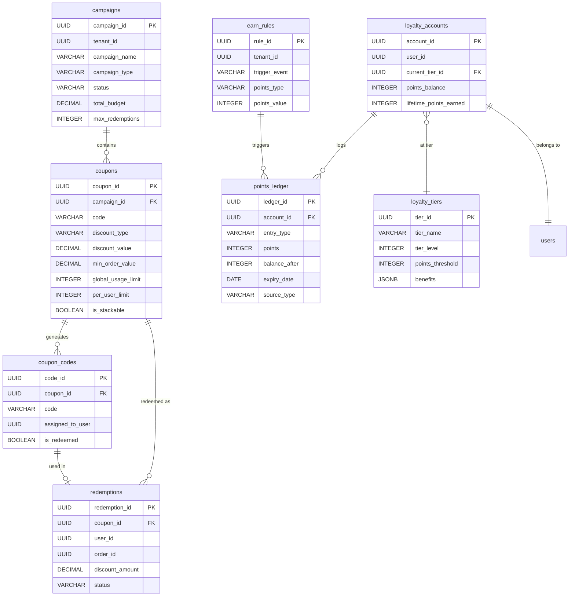
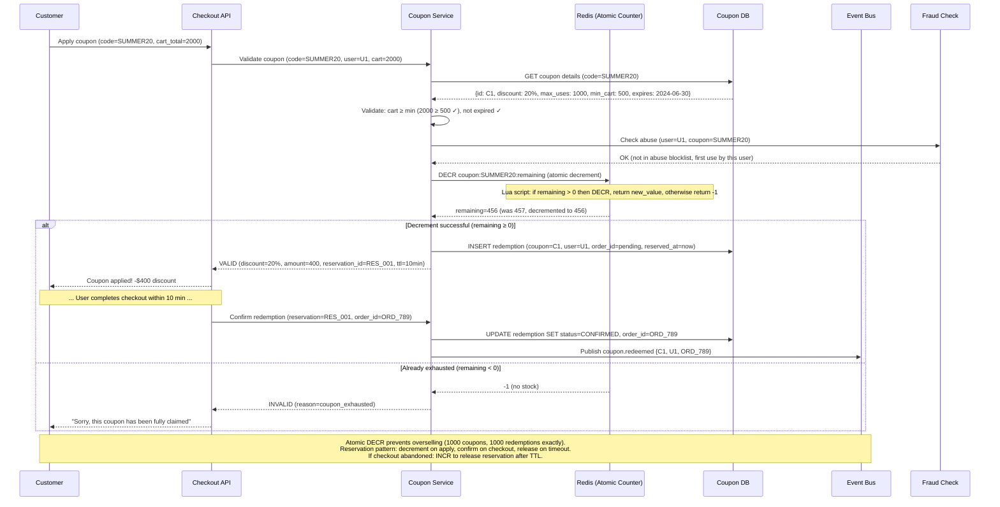
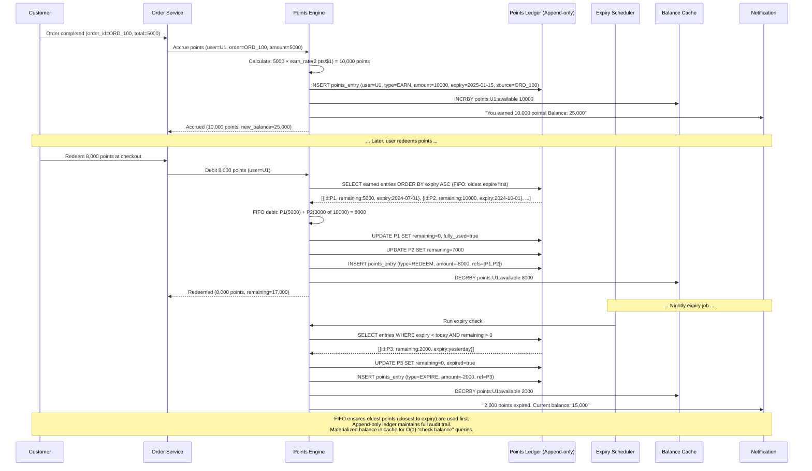

# Coupon / Loyalty / Rewards Platform

## 1. Functional Requirements

### Core Features
- **Coupon Creation**: Percentage off, flat discount, BOGO, free shipping, tiered discounts
- **Constraints**: Min order value, specific categories/products, first-time user, geographic
- **Distribution Channels**: Email, push notification, in-app banner, affiliate, influencer codes
- **Redemption Validation**: Real-time validation at checkout with atomic decrement
- **Usage Limits**: Per-user limit, global cap, per-day limit, per-campaign budget
- **Loyalty Points**: Earn rules (purchase, referral, review), burn rules, tier management
- **Rewards Catalog**: Redeem points for products, vouchers, cashback, experiences
- **Expiry Management**: Points expiry (FIFO), coupon expiry, tier downgrade
- **Fraud Detection**: Coupon abuse (multiple accounts, sharing, stacking violations)
- **Analytics**: Campaign ROI, redemption rates, customer segments, A/B testing

### Coupon Types
1. **Code-based**: User enters a code at checkout
2. **Auto-applied**: Applied based on cart conditions
3. **Targeted**: Only visible/valid for specific user segments
4. **Stackable**: Can combine with other offers (configurable)
5. **Referral**: Generated per user for sharing

## 2. Non-Functional Requirements

| Metric | Target |
|--------|--------|
| Redemption validation | < 50ms (in checkout critical path) |
| Points balance query | < 20ms |
| Coupon creation (campaign) | < 5 seconds for 1M codes |
| Availability | 99.99% (blocks checkout if down) |
| Throughput | 50K validations/second (flash sales) |
| Consistency | Strong (no over-redemption) |
| Fraud detection | Real-time (< 100ms additional) |
| Points calculation | Near real-time (< 30 seconds) |

## 3. Capacity Estimation

### Assumptions
- 100M users, 20M MAU
- 10,000 active campaigns at any time
- 1B coupon codes generated (unique per user for referral)
- 500M redemption attempts/month (includes invalid attempts)
- Loyalty: 50M points transactions/day
- Average 3 coupons checked per checkout

### Storage
- Coupons/campaigns: 10K campaigns × 10KB = 100MB
- Coupon codes: 1B × 50B = 50GB
- Redemption records: 500M/month × 200B = 100GB/month = 1.2TB/year
- Points ledger: 50M/day × 100B = 5GB/day = 1.8TB/year
- User tier data: 100M × 200B = 20GB
- Total: ~4TB/year

### Compute
- Validation: 50K/sec × 1ms CPU = 50 cores
- Points calculation: 50M events/day via stream processing
- Fraud scoring: ML inference at 50K/sec

## 4. Data Modeling

## 4. Data Modeling

### Entity-Relationship Diagram



### Full Database Schemas

```sql
-- Campaigns (grouping of coupons)
CREATE TABLE campaigns (
    campaign_id UUID PRIMARY KEY DEFAULT gen_random_uuid(),
    tenant_id UUID NOT NULL,
    campaign_name VARCHAR(200) NOT NULL,
    campaign_type VARCHAR(20) NOT NULL, -- COUPON, LOYALTY_BONUS, FLASH_SALE, REFERRAL
    status VARCHAR(20) DEFAULT 'DRAFT', -- DRAFT, ACTIVE, PAUSED, ENDED, ARCHIVED
    
    -- Timing
    start_date TIMESTAMP NOT NULL,
    end_date TIMESTAMP,
    
    -- Budget
    total_budget DECIMAL(14, 2),
    spent_budget DECIMAL(14, 2) DEFAULT 0,
    max_redemptions INT,
    current_redemptions INT DEFAULT 0,
    
    -- Targeting
    target_segments JSONB, -- {segments: ['NEW_USER', 'HIGH_VALUE'], geo: ['US', 'UK']}
    exclusion_rules JSONB,
    
    -- Analytics
    impressions INT DEFAULT 0,
    clicks INT DEFAULT 0,
    redemptions INT DEFAULT 0,
    revenue_attributed DECIMAL(14, 2) DEFAULT 0,
    
    created_by UUID,
    created_at TIMESTAMP DEFAULT NOW(),
    updated_at TIMESTAMP DEFAULT NOW()
);

CREATE INDEX idx_campaigns_tenant_status ON campaigns(tenant_id, status);
CREATE INDEX idx_campaigns_dates ON campaigns(start_date, end_date) WHERE status = 'ACTIVE';

-- Coupons (individual discount rules)
CREATE TABLE coupons (
    coupon_id UUID PRIMARY KEY DEFAULT gen_random_uuid(),
    campaign_id UUID REFERENCES campaigns(campaign_id),
    tenant_id UUID NOT NULL,
    
    -- Code
    code VARCHAR(50), -- NULL for auto-applied
    code_type VARCHAR(20) NOT NULL, -- SINGLE_CODE, UNIQUE_PER_USER, AUTO_APPLY
    
    -- Discount
    discount_type VARCHAR(20) NOT NULL, -- PERCENTAGE, FLAT, BOGO, FREE_SHIPPING, TIERED
    discount_value DECIMAL(10, 2) NOT NULL, -- 20 (for 20%), or 50.00 (for flat $50)
    max_discount DECIMAL(10, 2), -- Cap for percentage discounts
    tiered_rules JSONB, -- [{min_amount: 100, discount: 10}, {min_amount: 200, discount: 25}]
    
    -- Constraints
    min_order_value DECIMAL(10, 2),
    max_order_value DECIMAL(10, 2),
    applicable_categories VARCHAR(50)[],
    applicable_products UUID[],
    excluded_products UUID[],
    applicable_payment_methods VARCHAR(20)[],
    first_order_only BOOLEAN DEFAULT FALSE,
    
    -- Limits
    global_usage_limit INT, -- Total redemptions allowed
    per_user_limit INT DEFAULT 1,
    per_day_global_limit INT,
    per_day_user_limit INT DEFAULT 1,
    
    -- Counters (denormalized for speed)
    total_used INT DEFAULT 0,
    today_used INT DEFAULT 0,
    
    -- Stacking
    is_stackable BOOLEAN DEFAULT FALSE,
    stack_priority INT DEFAULT 0, -- Higher = applied first
    exclusive_with UUID[], -- Cannot combine with these coupon_ids
    
    -- Validity
    valid_from TIMESTAMP NOT NULL,
    valid_until TIMESTAMP,
    is_active BOOLEAN DEFAULT TRUE,
    
    created_at TIMESTAMP DEFAULT NOW()
);

CREATE INDEX idx_coupons_code ON coupons(tenant_id, code) WHERE code IS NOT NULL;
CREATE INDEX idx_coupons_auto ON coupons(tenant_id, is_active, code_type) WHERE code_type = 'AUTO_APPLY';
CREATE INDEX idx_coupons_campaign ON coupons(campaign_id);

-- Coupon codes (for UNIQUE_PER_USER type - bulk generated)
CREATE TABLE coupon_codes (
    code_id UUID PRIMARY KEY DEFAULT gen_random_uuid(),
    coupon_id UUID NOT NULL REFERENCES coupons(coupon_id),
    code VARCHAR(20) NOT NULL UNIQUE,
    assigned_to_user UUID,
    is_redeemed BOOLEAN DEFAULT FALSE,
    redeemed_at TIMESTAMP,
    redeemed_order_id UUID,
    created_at TIMESTAMP DEFAULT NOW()
);

CREATE INDEX idx_codes_coupon ON coupon_codes(coupon_id, is_redeemed);
CREATE INDEX idx_codes_user ON coupon_codes(assigned_to_user) WHERE assigned_to_user IS NOT NULL;

-- Redemption records
CREATE TABLE redemptions (
    redemption_id UUID PRIMARY KEY DEFAULT gen_random_uuid(),
    coupon_id UUID NOT NULL REFERENCES coupons(coupon_id),
    code_id UUID REFERENCES coupon_codes(code_id),
    user_id UUID NOT NULL,
    order_id UUID NOT NULL,
    tenant_id UUID NOT NULL,
    
    original_amount DECIMAL(12, 2) NOT NULL,
    discount_amount DECIMAL(12, 2) NOT NULL,
    final_amount DECIMAL(12, 2) NOT NULL,
    
    status VARCHAR(20) DEFAULT 'APPLIED', -- APPLIED, CONFIRMED, REVERSED
    reversed_at TIMESTAMP,
    reversal_reason TEXT,
    
    redeemed_at TIMESTAMP DEFAULT NOW()
);

CREATE INDEX idx_redemptions_user ON redemptions(user_id, coupon_id);
CREATE INDEX idx_redemptions_order ON redemptions(order_id);
CREATE INDEX idx_redemptions_coupon ON redemptions(coupon_id, redeemed_at);

-- ═══════════════════════════════════════════
-- LOYALTY POINTS
-- ═══════════════════════════════════════════

-- Loyalty tiers
CREATE TABLE loyalty_tiers (
    tier_id UUID PRIMARY KEY DEFAULT gen_random_uuid(),
    tenant_id UUID NOT NULL,
    tier_name VARCHAR(50) NOT NULL, -- BRONZE, SILVER, GOLD, PLATINUM
    tier_level INT NOT NULL, -- 1, 2, 3, 4
    points_threshold INT NOT NULL, -- Points needed to qualify
    qualification_period_months INT DEFAULT 12,
    benefits JSONB, -- {point_multiplier: 1.5, free_shipping: true, priority_support: true}
    is_active BOOLEAN DEFAULT TRUE
);

-- User loyalty accounts
CREATE TABLE loyalty_accounts (
    account_id UUID PRIMARY KEY DEFAULT gen_random_uuid(),
    user_id UUID NOT NULL UNIQUE,
    tenant_id UUID NOT NULL,
    current_tier_id UUID REFERENCES loyalty_tiers(tier_id),
    
    -- Balances
    points_balance INT NOT NULL DEFAULT 0,
    lifetime_points_earned INT NOT NULL DEFAULT 0,
    lifetime_points_burned INT NOT NULL DEFAULT 0,
    points_expiring_next_month INT DEFAULT 0,
    
    -- Tier tracking
    tier_qualifying_points INT DEFAULT 0, -- Points in current qualification period
    tier_qualification_start DATE,
    next_tier_review_date DATE,
    
    -- Activity
    last_earn_at TIMESTAMP,
    last_burn_at TIMESTAMP,
    
    created_at TIMESTAMP DEFAULT NOW(),
    updated_at TIMESTAMP DEFAULT NOW()
);

CREATE INDEX idx_loyalty_user ON loyalty_accounts(user_id);
CREATE INDEX idx_loyalty_tier_review ON loyalty_accounts(next_tier_review_date);

-- Points ledger (earn/burn/expire - append-only)
CREATE TABLE points_ledger (
    ledger_id UUID PRIMARY KEY DEFAULT gen_random_uuid(),
    account_id UUID NOT NULL REFERENCES loyalty_accounts(account_id),
    user_id UUID NOT NULL,
    tenant_id UUID NOT NULL,
    
    entry_type VARCHAR(20) NOT NULL, -- EARN, BURN, EXPIRE, ADJUST, BONUS, REFUND
    points INT NOT NULL, -- Positive for earn, negative for burn/expire
    balance_after INT NOT NULL,
    
    -- Source
    source_type VARCHAR(30), -- PURCHASE, REFERRAL, REVIEW, BIRTHDAY, PROMO, MANUAL
    source_reference VARCHAR(100), -- order_id, referral_id, etc
    
    -- For earn entries: expiry tracking
    expiry_date DATE, -- When these points expire
    remaining_points INT, -- For partial burns (FIFO)
    
    -- Metadata
    description TEXT,
    multiplier DECIMAL(4, 2) DEFAULT 1.0, -- Tier multiplier applied
    
    created_at TIMESTAMP DEFAULT NOW()
);

CREATE INDEX idx_ledger_account ON points_ledger(account_id, created_at DESC);
CREATE INDEX idx_ledger_expiry ON points_ledger(expiry_date, entry_type) 
    WHERE entry_type = 'EARN' AND remaining_points > 0;
CREATE INDEX idx_ledger_user_type ON points_ledger(user_id, entry_type, created_at);

-- Earn rules
CREATE TABLE earn_rules (
    rule_id UUID PRIMARY KEY DEFAULT gen_random_uuid(),
    tenant_id UUID NOT NULL,
    rule_name VARCHAR(100) NOT NULL,
    trigger_event VARCHAR(30) NOT NULL, -- PURCHASE, REFERRAL, REVIEW, SIGNUP, BIRTHDAY
    
    -- Calculation
    points_type VARCHAR(20) NOT NULL, -- FIXED, PER_DOLLAR, PER_ITEM, MULTIPLIER
    points_value INT NOT NULL, -- Fixed points or per-dollar rate
    max_points_per_event INT,
    
    -- Conditions
    conditions JSONB, -- {min_order: 50, categories: [...], payment_method: 'CREDIT_CARD'}
    tier_multipliers JSONB, -- {GOLD: 1.5, PLATINUM: 2.0}
    
    -- Limits
    max_earns_per_day INT,
    max_earns_per_user_per_day INT,
    
    -- Timing
    valid_from TIMESTAMP,
    valid_until TIMESTAMP,
    is_active BOOLEAN DEFAULT TRUE,
    
    created_at TIMESTAMP DEFAULT NOW()
);

CREATE INDEX idx_earn_rules_tenant ON earn_rules(tenant_id, trigger_event, is_active);

-- Burn rules
CREATE TABLE burn_rules (
    rule_id UUID PRIMARY KEY DEFAULT gen_random_uuid(),
    tenant_id UUID NOT NULL,
    rule_name VARCHAR(100) NOT NULL,
    
    -- Conversion
    points_per_dollar DECIMAL(8, 4) NOT NULL, -- e.g., 100 points = $1
    min_burn_points INT DEFAULT 100,
    max_burn_per_order_pct DECIMAL(3, 2) DEFAULT 0.50, -- Max 50% of order in points
    max_burn_per_order_points INT,
    
    -- Restrictions
    excluded_categories VARCHAR(50)[],
    excluded_products UUID[],
    min_order_value DECIMAL(10, 2),
    
    is_active BOOLEAN DEFAULT TRUE,
    created_at TIMESTAMP DEFAULT NOW()
);

-- Rewards catalog
CREATE TABLE rewards_catalog (
    reward_id UUID PRIMARY KEY DEFAULT gen_random_uuid(),
    tenant_id UUID NOT NULL,
    reward_name VARCHAR(200) NOT NULL,
    reward_type VARCHAR(20), -- PRODUCT, VOUCHER, CASHBACK, EXPERIENCE, DONATION
    description TEXT,
    image_url TEXT,
    points_cost INT NOT NULL,
    monetary_value DECIMAL(10, 2),
    inventory_count INT, -- NULL = unlimited
    max_per_user INT DEFAULT 1,
    min_tier_level INT DEFAULT 1,
    is_active BOOLEAN DEFAULT TRUE,
    valid_until TIMESTAMP,
    created_at TIMESTAMP DEFAULT NOW()
);

-- Fraud signals
CREATE TABLE fraud_signals (
    signal_id UUID PRIMARY KEY DEFAULT gen_random_uuid(),
    user_id UUID NOT NULL,
    signal_type VARCHAR(30), -- MULTI_ACCOUNT, CODE_SHARING, VELOCITY, DEVICE_FARM, REFUND_ABUSE
    severity VARCHAR(10), -- LOW, MEDIUM, HIGH, CRITICAL
    details JSONB,
    coupon_id UUID,
    action_taken VARCHAR(20), -- NONE, FLAGGED, BLOCKED, POINTS_REVOKED
    created_at TIMESTAMP DEFAULT NOW()
);

CREATE INDEX idx_fraud_user ON fraud_signals(user_id, created_at DESC);
CREATE INDEX idx_fraud_severity ON fraud_signals(severity, action_taken) WHERE severity IN ('HIGH', 'CRITICAL');
```

## 5. High-Level Design (HLD)

```
┌──────────────────────────────────────────────────────────────────────────────────┐
│                    COUPON / LOYALTY / REWARDS PLATFORM                             │
├──────────────────────────────────────────────────────────────────────────────────┤
│                                                                                    │
│  ┌──────────┐  ┌──────────┐  ┌──────────┐  ┌──────────┐                         │
│  │ Checkout │  │  Admin   │  │Marketing │  │  Mobile  │                          │
│  │ Service  │  │  Portal  │  │  Tools   │  │   App    │                          │
│  └────┬─────┘  └────┬─────┘  └────┬─────┘  └────┬─────┘                          │
│       └──────────────┴──────────────┴──────────────┘                               │
│                              │                                                     │
│                    ┌─────────▼──────────┐                                         │
│                    │    API Gateway     │                                         │
│                    └─────────┬──────────┘                                         │
│                              │                                                     │
│  ┌───────────────────────────┼─────────────────────────────────────┐              │
│  │                           │                                      │              │
│  │  ┌───────────────┐  ┌────▼──────────┐  ┌────────────────────┐  │              │
│  │  │  Coupon       │  │  Validation   │  │   Loyalty          │  │              │
│  │  │  Management   │  │  Engine       │  │   Engine           │  │              │
│  │  │  Service      │  │  (Real-time)  │  │                    │  │              │
│  │  └───────────────┘  └───────────────┘  └────────────────────┘  │              │
│  │                                                                  │              │
│  │  ┌───────────────┐  ┌───────────────┐  ┌────────────────────┐  │              │
│  │  │  Campaign     │  │   Fraud       │  │   Rewards          │  │              │
│  │  │  Service      │  │   Detection   │  │   Catalog          │  │              │
│  │  └───────────────┘  └───────────────┘  └────────────────────┘  │              │
│  │                                                                  │              │
│  └──────────────────────────────────────────────────────────────────┘              │
│                              │                                                     │
│              ┌───────────────▼────────────────┐                                   │
│              │         Kafka Event Bus         │                                   │
│              │  [order.completed] [points.earned]                                  │
│              │  [coupon.redeemed] [fraud.detected]                                 │
│              └───────────────┬────────────────┘                                   │
│                              │                                                     │
│  ┌──────────┐  ┌────────────▼──┐  ┌──────────┐  ┌──────────────┐  ┌──────────┐ │
│  │PostgreSQL│  │    Redis      │  │  Flink   │  │  ML Service  │  │    S3    │ │
│  │(Ledger + │  │(Counters +    │  │(Points   │  │  (Fraud +    │  │(Reports) │ │
│  │ Records) │  │ Validation)   │  │ Calc)    │  │  Targeting)  │  │          │ │
│  └──────────┘  └───────────────┘  └──────────┘  └──────────────┘  └──────────┘ │
└──────────────────────────────────────────────────────────────────────────────────┘
```

## 6. Low-Level Design (LLD) - APIs

### Validate & Apply Coupon
```http
POST /api/v1/coupons/validate
Content-Type: application/json
X-Request-ID: <idempotency_key>

{
  "code": "SUMMER20",
  "user_id": "user-uuid-001",
  "order": {
    "order_id": "order-uuid-123",
    "subtotal": 150.00,
    "items": [
      {"product_id": "prod-1", "category": "CLOTHING", "quantity": 2, "amount": 80.00},
      {"product_id": "prod-2", "category": "ELECTRONICS", "quantity": 1, "amount": 70.00}
    ],
    "payment_method": "CREDIT_CARD",
    "shipping_address": {"country": "US", "state": "CA"}
  }
}

Response 200:
{
  "valid": true,
  "coupon_id": "cpn-uuid-001",
  "discount": {
    "type": "PERCENTAGE",
    "value": 20,
    "applicable_amount": 80.00,
    "discount_amount": 16.00,
    "max_discount": null,
    "excluded_items": [{"product_id": "prod-2", "reason": "Electronics excluded"}]
  },
  "final_order_total": 134.00,
  "message": "20% off on clothing items!",
  "reservation_id": "res-uuid-001",
  "reservation_expires_at": "2024-01-15T10:35:00Z"
}
```

### Earn Points
```http
POST /api/v1/loyalty/earn
Content-Type: application/json

{
  "user_id": "user-uuid-001",
  "trigger_event": "PURCHASE",
  "source_reference": "order-uuid-123",
  "order_amount": 134.00,
  "category": "CLOTHING",
  "payment_method": "CREDIT_CARD"
}

Response 200:
{
  "points_earned": 268,
  "breakdown": [
    {"rule": "Base (2 pts/$)", "points": 268},
    {"rule": "Gold tier 1.5x", "multiplier": 1.5, "bonus": 134}
  ],
  "total_earned": 402,
  "new_balance": 12450,
  "tier_progress": {
    "current_tier": "GOLD",
    "next_tier": "PLATINUM",
    "points_to_next": 7550,
    "qualifying_points": 12450,
    "threshold": 20000
  },
  "expiry_date": "2025-01-15"
}
```

### Burn Points
```http
POST /api/v1/loyalty/burn
Content-Type: application/json

{
  "user_id": "user-uuid-001",
  "order_id": "order-uuid-456",
  "points_to_burn": 1000,
  "order_amount": 85.00
}

Response 200:
{
  "points_burned": 1000,
  "monetary_value": 10.00,
  "points_per_dollar": 100,
  "new_balance": 11450,
  "order_discount": 10.00,
  "final_amount": 75.00,
  "burn_breakdown": [
    {"batch_date": "2023-07-15", "points": 500, "expiry": "2024-07-15"},
    {"batch_date": "2023-08-20", "points": 500, "expiry": "2024-08-20"}
  ]
}
```

### Get Points Balance with Expiry
```http
GET /api/v1/loyalty/balance?include_expiry=true
Authorization: Bearer <token>

Response 200:
{
  "user_id": "user-uuid-001",
  "points_balance": 12450,
  "monetary_equivalent": 124.50,
  "tier": {"name": "GOLD", "level": 3, "multiplier": 1.5},
  "expiry_schedule": [
    {"month": "2024-02", "points_expiring": 800},
    {"month": "2024-03", "points_expiring": 1200},
    {"month": "2024-04", "points_expiring": 950}
  ],
  "next_expiry": {"date": "2024-02-28", "points": 800},
  "lifetime_earned": 45600,
  "lifetime_burned": 33150
}
```

## 7. Deep Dives

### Deep Dive 1: Real-Time Redemption Validation

```python
import redis.asyncio as redis
from datetime import date
from typing import Optional

class RedemptionValidator:
    """
    Real-time coupon validation with atomic counter management.
    Must be < 50ms in checkout critical path.
    """
    
    def __init__(self, redis_client: redis.Redis, db):
        self.redis = redis_client
        self.db = db
    
    async def validate_and_reserve(self, code: str, user_id: str, order: dict) -> dict:
        """
        Validate coupon and atomically reserve a redemption slot.
        Uses Redis for real-time checks, falls back to DB for complex rules.
        """
        
        # Step 1: Lookup coupon (Redis cache with DB fallback)
        coupon = await self._get_coupon(code)
        if not coupon:
            return {'valid': False, 'reason': 'INVALID_CODE'}
        
        # Step 2: Quick eligibility checks (all in Redis, < 5ms)
        checks = await self._quick_checks(coupon, user_id, order)
        if not checks['passed']:
            return {'valid': False, 'reason': checks['reason']}
        
        # Step 3: Atomic reserve (check-and-decrement in Redis)
        reserved = await self._atomic_reserve(coupon, user_id)
        if not reserved:
            return {'valid': False, 'reason': 'LIMIT_REACHED'}
        
        # Step 4: Calculate discount
        discount = self._calculate_discount(coupon, order)
        
        # Step 5: Create reservation (expires in 5 minutes)
        reservation_id = await self._create_reservation(coupon, user_id, order, discount)
        
        return {
            'valid': True,
            'coupon_id': coupon['coupon_id'],
            'discount': discount,
            'reservation_id': reservation_id,
            'reservation_expires_at': (datetime.now() + timedelta(minutes=5)).isoformat()
        }
    
    async def _quick_checks(self, coupon: dict, user_id: str, order: dict) -> dict:
        """All checks using Redis - must complete in < 5ms total."""
        
        pipe = self.redis.pipeline()
        
        # Check 1: Coupon still active and within date range
        now = datetime.now()
        if now < coupon['valid_from'] or (coupon['valid_until'] and now > coupon['valid_until']):
            return {'passed': False, 'reason': 'EXPIRED'}
        
        # Check 2: Global usage limit
        pipe.get(f"coupon:global_count:{coupon['coupon_id']}")
        
        # Check 3: Per-user usage limit
        pipe.get(f"coupon:user_count:{coupon['coupon_id']}:{user_id}")
        
        # Check 4: Per-day global limit
        today = date.today().isoformat()
        pipe.get(f"coupon:daily_count:{coupon['coupon_id']}:{today}")
        
        # Check 5: Per-day user limit
        pipe.get(f"coupon:daily_user:{coupon['coupon_id']}:{user_id}:{today}")
        
        results = await pipe.execute()
        global_count = int(results[0] or 0)
        user_count = int(results[1] or 0)
        daily_count = int(results[2] or 0)
        daily_user_count = int(results[3] or 0)
        
        if coupon['global_usage_limit'] and global_count >= coupon['global_usage_limit']:
            return {'passed': False, 'reason': 'GLOBAL_LIMIT_REACHED'}
        if coupon['per_user_limit'] and user_count >= coupon['per_user_limit']:
            return {'passed': False, 'reason': 'USER_LIMIT_REACHED'}
        if coupon.get('per_day_global_limit') and daily_count >= coupon['per_day_global_limit']:
            return {'passed': False, 'reason': 'DAILY_LIMIT_REACHED'}
        if coupon.get('per_day_user_limit') and daily_user_count >= coupon['per_day_user_limit']:
            return {'passed': False, 'reason': 'DAILY_USER_LIMIT'}
        
        # Check 6: Min order value
        if coupon.get('min_order_value') and order['subtotal'] < coupon['min_order_value']:
            return {'passed': False, 'reason': 'MIN_ORDER_NOT_MET'}
        
        # Check 7: First order only
        if coupon.get('first_order_only'):
            has_orders = await self.redis.get(f"user:has_orders:{user_id}")
            if has_orders:
                return {'passed': False, 'reason': 'NOT_FIRST_ORDER'}
        
        return {'passed': True}
    
    async def _atomic_reserve(self, coupon: dict, user_id: str) -> bool:
        """
        Atomically check + increment counters using Lua script.
        Prevents race condition where multiple users exceed limits.
        """
        
        lua_script = """
        local coupon_id = KEYS[1]
        local user_id = KEYS[2]
        local today = KEYS[3]
        local global_limit = tonumber(ARGV[1])
        local user_limit = tonumber(ARGV[2])
        local daily_limit = tonumber(ARGV[3])
        
        -- Check global
        local global_count = tonumber(redis.call('GET', 'coupon:global_count:' .. coupon_id) or '0')
        if global_limit > 0 and global_count >= global_limit then
            return 0
        end
        
        -- Check per-user
        local user_count = tonumber(redis.call('GET', 'coupon:user_count:' .. coupon_id .. ':' .. user_id) or '0')
        if user_limit > 0 and user_count >= user_limit then
            return 0
        end
        
        -- Check daily
        local daily_count = tonumber(redis.call('GET', 'coupon:daily_count:' .. coupon_id .. ':' .. today) or '0')
        if daily_limit > 0 and daily_count >= daily_limit then
            return 0
        end
        
        -- All checks passed - increment atomically
        redis.call('INCR', 'coupon:global_count:' .. coupon_id)
        redis.call('INCR', 'coupon:user_count:' .. coupon_id .. ':' .. user_id)
        redis.call('INCR', 'coupon:daily_count:' .. coupon_id .. ':' .. today)
        redis.call('EXPIRE', 'coupon:daily_count:' .. coupon_id .. ':' .. today, 86400)
        
        return 1
        """
        
        result = await self.redis.eval(
            lua_script,
            3,  # number of KEYS
            coupon['coupon_id'], user_id, date.today().isoformat(),
            coupon.get('global_usage_limit', 0),
            coupon.get('per_user_limit', 0),
            coupon.get('per_day_global_limit', 0)
        )
        
        return bool(result)
    
    async def release_reservation(self, reservation_id: str):
        """Release reservation if order is abandoned (decrement counters)."""
        
        reservation = await self.redis.hgetall(f"reservation:{reservation_id}")
        if not reservation:
            return
        
        # Decrement counters
        coupon_id = reservation['coupon_id']
        user_id = reservation['user_id']
        
        pipe = self.redis.pipeline()
        pipe.decr(f"coupon:global_count:{coupon_id}")
        pipe.decr(f"coupon:user_count:{coupon_id}:{user_id}")
        pipe.delete(f"reservation:{reservation_id}")
        await pipe.execute()
```

### Deep Dive 2: Points Ledger (Earn/Burn/Expire with FIFO)

```python
class PointsLedger:
    """Manage points with FIFO expiry and tier-based multipliers."""
    
    async def earn_points(self, user_id: str, event: dict) -> dict:
        """Calculate and credit points based on earn rules."""
        
        account = await self._get_or_create_account(user_id)
        
        # Find applicable earn rules
        rules = await self.db.fetch_all("""
            SELECT * FROM earn_rules 
            WHERE tenant_id = $1 AND trigger_event = $2 AND is_active = TRUE
            AND (valid_from IS NULL OR valid_from <= NOW())
            AND (valid_until IS NULL OR valid_until > NOW())
        """, account.tenant_id, event['trigger_event'])
        
        total_earned = 0
        breakdown = []
        
        for rule in rules:
            # Check conditions
            if not self._matches_conditions(rule.conditions, event):
                continue
            
            # Calculate base points
            if rule.points_type == 'PER_DOLLAR':
                base_points = int(event['order_amount'] * rule.points_value)
            elif rule.points_type == 'FIXED':
                base_points = rule.points_value
            else:
                base_points = rule.points_value
            
            # Apply max cap
            if rule.max_points_per_event:
                base_points = min(base_points, rule.max_points_per_event)
            
            # Apply tier multiplier
            multiplier = 1.0
            if rule.tier_multipliers and account.current_tier_id:
                tier_name = await self._get_tier_name(account.current_tier_id)
                multiplier = rule.tier_multipliers.get(tier_name, 1.0)
            
            final_points = int(base_points * multiplier)
            total_earned += final_points
            breakdown.append({
                'rule': rule.rule_name,
                'base_points': base_points,
                'multiplier': multiplier,
                'points': final_points
            })
        
        if total_earned > 0:
            # Credit points with expiry date (typically 12 months)
            expiry_date = date.today() + timedelta(days=365)
            
            async with self.db.transaction() as txn:
                # Update balance
                new_balance = account.points_balance + total_earned
                await txn.execute("""
                    UPDATE loyalty_accounts 
                    SET points_balance = points_balance + $1,
                        lifetime_points_earned = lifetime_points_earned + $1,
                        tier_qualifying_points = tier_qualifying_points + $1,
                        last_earn_at = NOW(), updated_at = NOW()
                    WHERE account_id = $2
                """, total_earned, account.account_id)
                
                # Ledger entry
                await txn.execute("""
                    INSERT INTO points_ledger 
                    (account_id, user_id, tenant_id, entry_type, points, balance_after,
                     source_type, source_reference, expiry_date, remaining_points, multiplier)
                    VALUES ($1, $2, $3, 'EARN', $4, $5, $6, $7, $8, $4, $9)
                """, account.account_id, user_id, account.tenant_id,
                    total_earned, new_balance, event['trigger_event'],
                    event['source_reference'], expiry_date, multiplier)
            
            # Update Redis balance
            await self.redis.hset(f"loyalty:{user_id}", 'balance', str(new_balance))
        
        return {
            'points_earned': total_earned,
            'breakdown': breakdown,
            'new_balance': account.points_balance + total_earned,
            'expiry_date': expiry_date.isoformat() if total_earned > 0 else None
        }
    
    async def burn_points(self, user_id: str, points_to_burn: int, order_id: str) -> dict:
        """Burn points using FIFO (oldest expire first)."""
        
        account = await self._get_account(user_id)
        
        if account.points_balance < points_to_burn:
            return {'success': False, 'reason': 'INSUFFICIENT_POINTS'}
        
        async with self.db.transaction() as txn:
            # Get oldest unexpired earn entries (FIFO)
            earn_entries = await txn.fetch_all("""
                SELECT ledger_id, remaining_points, expiry_date
                FROM points_ledger
                WHERE account_id = $1 AND entry_type = 'EARN' AND remaining_points > 0
                AND (expiry_date IS NULL OR expiry_date > CURRENT_DATE)
                ORDER BY expiry_date ASC NULLS LAST, created_at ASC
                FOR UPDATE
            """, account.account_id)
            
            remaining_to_burn = points_to_burn
            burn_breakdown = []
            
            for entry in earn_entries:
                if remaining_to_burn <= 0:
                    break
                
                burn_from_this = min(remaining_to_burn, entry.remaining_points)
                
                # Decrement remaining in earn entry
                await txn.execute("""
                    UPDATE points_ledger SET remaining_points = remaining_points - $1
                    WHERE ledger_id = $2
                """, burn_from_this, entry.ledger_id)
                
                remaining_to_burn -= burn_from_this
                burn_breakdown.append({
                    'batch_date': entry.expiry_date,
                    'points': burn_from_this
                })
            
            # Update balance
            new_balance = account.points_balance - points_to_burn
            await txn.execute("""
                UPDATE loyalty_accounts 
                SET points_balance = points_balance - $1,
                    lifetime_points_burned = lifetime_points_burned + $1,
                    last_burn_at = NOW()
                WHERE account_id = $2
            """, points_to_burn, account.account_id)
            
            # Ledger entry for burn
            await txn.execute("""
                INSERT INTO points_ledger 
                (account_id, user_id, tenant_id, entry_type, points, balance_after, source_reference)
                VALUES ($1, $2, $3, 'BURN', $4, $5, $6)
            """, account.account_id, user_id, account.tenant_id,
                -points_to_burn, new_balance, order_id)
        
        # Update Redis
        await self.redis.hset(f"loyalty:{user_id}", 'balance', str(new_balance))
        
        # Calculate monetary value
        burn_rule = await self._get_burn_rule(account.tenant_id)
        monetary_value = points_to_burn / burn_rule.points_per_dollar
        
        return {
            'success': True,
            'points_burned': points_to_burn,
            'monetary_value': monetary_value,
            'new_balance': new_balance,
            'burn_breakdown': burn_breakdown
        }
    
    async def expire_points_batch(self):
        """Nightly job: expire points past their expiry date."""
        
        expired_entries = await self.db.fetch_all("""
            SELECT pl.ledger_id, pl.account_id, pl.user_id, pl.remaining_points
            FROM points_ledger pl
            WHERE pl.entry_type = 'EARN' 
            AND pl.remaining_points > 0
            AND pl.expiry_date <= CURRENT_DATE
            LIMIT 10000
            FOR UPDATE SKIP LOCKED
        """)
        
        for entry in expired_entries:
            async with self.db.transaction() as txn:
                # Zero out remaining
                await txn.execute("""
                    UPDATE points_ledger SET remaining_points = 0 WHERE ledger_id = $1
                """, entry.ledger_id)
                
                # Debit from balance
                await txn.execute("""
                    UPDATE loyalty_accounts 
                    SET points_balance = points_balance - $1
                    WHERE account_id = $2
                """, entry.remaining_points, entry.account_id)
                
                # Create expiry ledger entry
                new_balance = await txn.fetch_val(
                    "SELECT points_balance FROM loyalty_accounts WHERE account_id = $1",
                    entry.account_id)
                
                await txn.execute("""
                    INSERT INTO points_ledger 
                    (account_id, user_id, tenant_id, entry_type, points, balance_after, description)
                    VALUES ($1, $2, (SELECT tenant_id FROM loyalty_accounts WHERE account_id = $1),
                            'EXPIRE', $3, $4, 'Points expired')
                """, entry.account_id, entry.user_id, -entry.remaining_points, new_balance)
            
            # Notify user
            await self.notification_service.send(entry.user_id, 'points_expired', {
                'points': entry.remaining_points
            })
```

### Deep Dive 3: Campaign Optimization (A/B Testing + ROI)

```python
class CampaignOptimizer:
    """A/B testing coupon values and ROI tracking."""
    
    async def create_ab_test(self, campaign_id: str, variants: list) -> dict:
        """
        Create A/B test with different coupon values.
        Example: Test 10% off vs 15% off vs $10 flat off
        """
        
        # Create variant coupons
        test_id = str(uuid4())
        
        for variant in variants:
            coupon = await self.coupon_service.create_coupon({
                'campaign_id': campaign_id,
                'discount_type': variant['discount_type'],
                'discount_value': variant['discount_value'],
                'code_type': 'AUTO_APPLY',
                'metadata': {'ab_test_id': test_id, 'variant': variant['name']}
            })
            variant['coupon_id'] = coupon.coupon_id
        
        # Configure traffic split
        await self.redis.hset(f"ab_test:{test_id}", mapping={
            'campaign_id': campaign_id,
            'variants': json.dumps(variants),
            'traffic_split': json.dumps({v['name']: v.get('traffic_pct', 100/len(variants)) for v in variants}),
            'start_date': datetime.now().isoformat(),
            'status': 'RUNNING'
        })
        
        return {'test_id': test_id, 'variants': variants}
    
    async def get_variant_for_user(self, test_id: str, user_id: str) -> str:
        """Deterministic variant assignment (consistent hashing)."""
        
        # Hash user_id to get consistent assignment
        hash_val = int(hashlib.md5(f"{test_id}:{user_id}".encode()).hexdigest(), 16)
        
        test_config = await self.redis.hgetall(f"ab_test:{test_id}")
        traffic_split = json.loads(test_config['traffic_split'])
        
        # Map hash to variant based on traffic split
        cumulative = 0
        bucket = hash_val % 100
        
        for variant_name, pct in traffic_split.items():
            cumulative += pct
            if bucket < cumulative:
                return variant_name
        
        return list(traffic_split.keys())[-1]
    
    async def calculate_campaign_roi(self, campaign_id: str) -> dict:
        """Calculate ROI: incremental revenue vs discount cost."""
        
        # Get campaign metrics
        stats = await self.db.fetch_one("""
            SELECT 
                COUNT(r.redemption_id) as total_redemptions,
                SUM(r.discount_amount) as total_discount_cost,
                SUM(r.final_amount) as total_revenue,
                AVG(r.final_amount) as avg_order_value,
                COUNT(DISTINCT r.user_id) as unique_users
            FROM redemptions r
            JOIN coupons c ON r.coupon_id = c.coupon_id
            WHERE c.campaign_id = $1 AND r.status = 'CONFIRMED'
        """, campaign_id)
        
        # Get baseline (control group or historical average)
        baseline_aov = await self._get_baseline_aov(campaign_id)
        
        # Incremental revenue = (Campaign AOV - Baseline AOV) × Redemptions
        incremental_revenue = (stats.avg_order_value - baseline_aov) * stats.total_redemptions
        
        # ROI = (Incremental Revenue - Discount Cost) / Discount Cost
        net_benefit = incremental_revenue + stats.total_revenue - stats.total_discount_cost
        roi = (net_benefit / stats.total_discount_cost - 1) * 100 if stats.total_discount_cost > 0 else 0
        
        return {
            'campaign_id': campaign_id,
            'total_redemptions': stats.total_redemptions,
            'unique_users': stats.unique_users,
            'total_discount_cost': float(stats.total_discount_cost),
            'total_revenue_generated': float(stats.total_revenue),
            'avg_order_value': float(stats.avg_order_value),
            'baseline_aov': float(baseline_aov),
            'incremental_revenue': float(incremental_revenue),
            'roi_percentage': round(roi, 2),
            'cost_per_acquisition': float(stats.total_discount_cost / stats.unique_users) if stats.unique_users > 0 else 0
        }
```

## 8. Component Optimization

### Kafka Configuration
```yaml
order.completed:
  partitions: 32
  replication-factor: 3
  # Triggers points earning

coupon.redeemed:
  partitions: 16
  replication-factor: 3
  # Analytics + fraud detection

points.events:
  partitions: 16
  replication-factor: 3
  retention.ms: 2592000000  # 30 days
```

### Redis Configuration
```yaml
redis:
  cluster: 12 nodes (flash sales need headroom)
  maxmemory: 96GB total
  
  # Coupon counters (CRITICAL - must not lose)
  coupon-counters:
    persistence: AOF (fsync every second)
    pattern: "coupon:*_count:*"
    
  # Coupon metadata cache
  coupon-cache:
    key: "coupon:meta:{coupon_id}"
    type: hash
    ttl: 300  # 5 min
    
  # Points balance (read-heavy)
  points-balance:
    key: "loyalty:{user_id}"
    type: hash
    ttl: none  # Write-through
    
  # Reservation (TTL-based expiry)
  reservations:
    key: "reservation:{reservation_id}"
    type: hash
    ttl: 300  # 5 min auto-expire
    
  # Rate limiting for fraud
  rate-limit:
    key: "rl:coupon:{user_id}"
    type: sliding-window
    window: 60s
    max: 10  # Max 10 coupon attempts per minute
```

### Flink (Points Calculation)
```yaml
flink:
  job: points-processor
  parallelism: 20
  source: kafka (order.completed)
  processing:
    - Apply earn rules
    - Calculate tier multipliers
    - Emit points.earned events
  sink: 
    - PostgreSQL (ledger)
    - Redis (balance update)
    - Kafka (points.events for downstream)
```

## 9. Observability

### Metrics
```yaml
metrics:
  - name: coupon_validation_latency_ms
    type: histogram
    labels: [result, coupon_type]
    buckets: [5, 10, 20, 50, 100, 200]
    slo: p99 < 50ms
  
  - name: coupon_redemption_rate
    type: gauge
    labels: [campaign_id, coupon_id]
  
  - name: points_balance_total
    type: gauge
    labels: [tier]
  
  - name: fraud_signals_total
    type: counter
    labels: [signal_type, severity]
  
  - name: counter_drift
    type: gauge  # Redis counter vs DB actual
    alert_threshold: 10
  
  - name: reservation_timeout_rate
    type: gauge
    alert_threshold: 0.3  # > 30% abandoned

alerts:
  - name: ValidationLatencyBreach
    expr: histogram_quantile(0.99, coupon_validation_latency_ms) > 100
    severity: critical  # Blocks checkout
    
  - name: CounterDriftDetected
    expr: counter_drift > 50
    severity: critical  # May allow over-redemption
    
  - name: FraudSpike
    expr: rate(fraud_signals_total{severity="HIGH"}[5m]) > 100
    severity: warning
```

## 10. Failure Modes & Considerations

| Failure | Impact | Mitigation |
|---------|--------|------------|
| Redis down | Can't validate coupons | Redis Cluster HA + DB fallback (slower, still works) |
| Counter drift (Redis vs DB) | Over-redemption | Periodic reconciliation, Redis persistence |
| Flash sale thundering herd | Redis overload | Pre-warm cache, rate limit per user, queue |
| Points double-credit | Inflated balance | Idempotency key per earn event |
| Coupon code leaked | Budget blown | Real-time monitoring, auto-pause on velocity spike |

### Fraud Prevention
- Device fingerprinting (same device, multiple accounts)
- Velocity checks (too many redemptions in short time)
- Referral loops (A refers B refers A)
- VPN/proxy detection for geo-restricted coupons
- ML model scoring each redemption attempt

## 11. Trade-offs & Alternatives

| Decision | Choice | Alternative | Why |
|----------|--------|-------------|-----|
| Counter store | Redis (Lua atomic) | Database counter | 50ms SLA needs in-memory atomic ops |
| Points ledger | Append-only + materialized balance | Event sourcing only | Read performance for balance queries |
| Coupon validation | Synchronous (blocking checkout) | Async (validate later) | Must guarantee discount before payment |
| Expiry | FIFO (oldest first) | User's choice | Fairness, prevents gaming |
| A/B test assignment | Consistent hashing | Random | Ensures user always sees same variant |
| Fraud detection | Real-time scoring | Batch (daily) | Prevent abuse before it happens |

---

## 12. Sequence Diagrams

### Diagram 1: Coupon Redemption with Atomic Decrement



### Diagram 2: Points Accrual + FIFO Expiry


