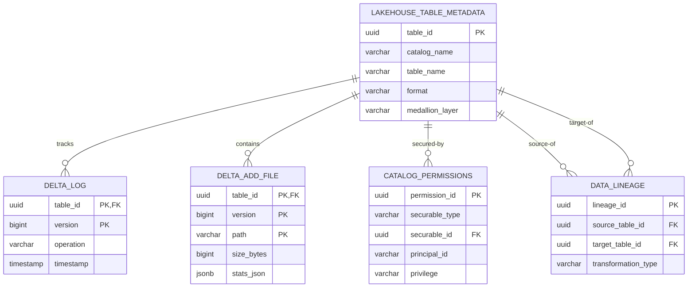
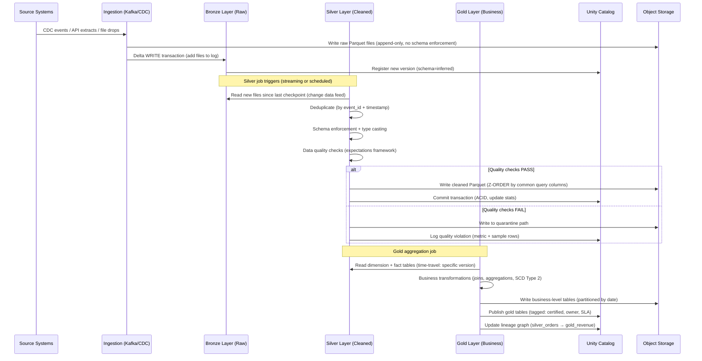
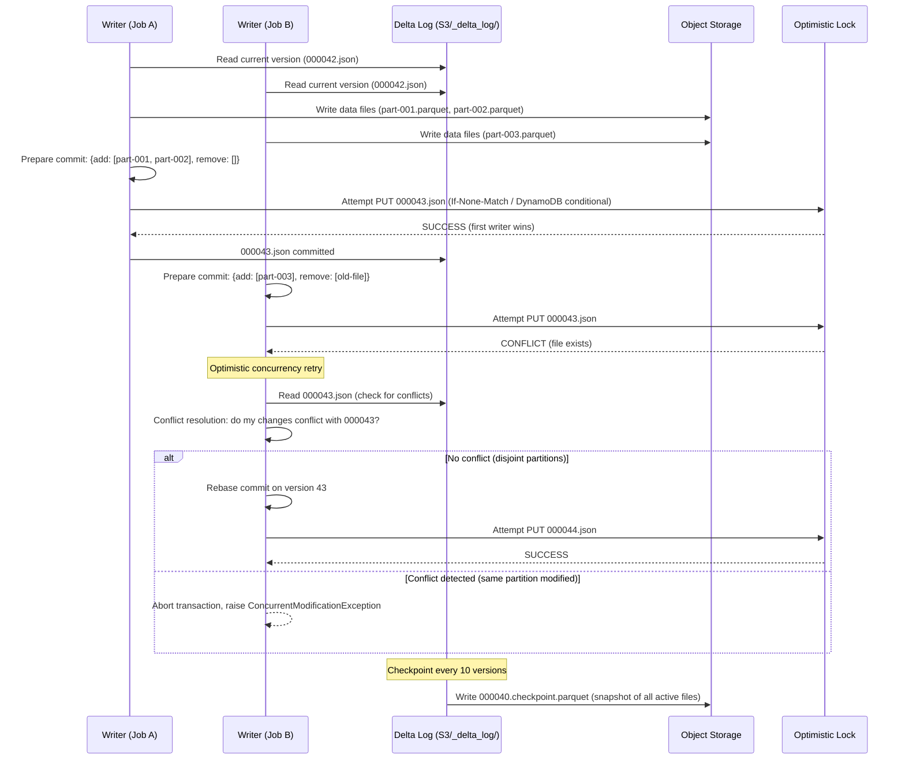

# Design: Data Lakehouse Platform (Databricks/Delta Lake)

## 1. Functional Requirements

- **Unified Storage**: Single storage layer for structured, semi-structured, and unstructured data
- **ACID Transactions**: Full ACID guarantees on data lake (object storage)
- **Schema Enforcement/Evolution**: Enforce schemas on write, support compatible evolution
- **Time Travel**: Query historical snapshots of data at any point in time
- **Z-Ordering/Data Skipping**: Multi-dimensional clustering for query optimization
- **Unity Catalog**: Centralized governance, access control, lineage tracking
- **Medallion Architecture**: Bronze (raw) → Silver (cleaned) → Gold (business aggregates)
- **Open Table Formats**: Support Delta Lake, Apache Iceberg, Apache Hudi interoperability
- **Incremental Processing**: Merge/upsert/delete operations on massive datasets
- **Streaming + Batch Unified**: Single engine for both batch and streaming workloads

## 2. Non-Functional Requirements

| Requirement | Target |
|---|---|
| Query Latency (Gold tables) | < 5s for dashboard queries |
| Ingestion Throughput | 10 TB/hour sustained |
| Transaction Commit | < 2s for typical writes |
| Time Travel Retention | 30 days default, configurable |
| Concurrent Writers | 100+ concurrent write operations |
| Storage Efficiency | 3-5x compression over raw Parquet |
| Availability | 99.9% for query engine |
| Metadata Ops | < 100ms for file listing/pruning |
| Scalability | Petabyte-scale tables (millions of files) |
| Governance | Row/column-level security, audit trail |

## 3. Capacity Estimation

```
Total Data Volume: 50 PB across all tables
Daily Ingestion: ~200 TB/day
Active Tables: 50,000 tables across 500 schemas
Average Table Size: 1 TB (range: 1 MB to 500 TB)
Files per Large Table: 1,000,000+ Parquet files
Metadata (Delta Log): ~50 GB for largest tables
Concurrent Queries: 5,000 queries/min peak
Concurrent Writers: 200 write operations/min
Transaction Log Entries: ~10M commits/day across all tables

Storage Breakdown:
- Bronze (raw): 30 PB (60%)
- Silver (cleaned): 15 PB (30%)
- Gold (aggregated): 5 PB (10%)

Compute:
- Query clusters: 500 nodes (auto-scaling)
- Ingestion clusters: 200 nodes
- Compaction/optimization: 50 nodes (background)
```

## 4. Data Modeling

### Entity-Relationship Diagram



### Delta Log Entry Schema
```sql
CREATE TABLE delta_log (
    table_id            UUID NOT NULL,
    version             BIGINT NOT NULL,
    timestamp           TIMESTAMP NOT NULL,
    operation           VARCHAR(50) NOT NULL,  -- 'WRITE','MERGE','DELETE','OPTIMIZE'
    operation_params    JSONB,
    -- Commit Info
    user_id             VARCHAR(255),
    cluster_id          VARCHAR(255),
    notebook_id         VARCHAR(255),
    -- Actions (stored as JSON in actual log file)
    actions_add         JSONB,   -- files added
    actions_remove      JSONB,   -- files removed
    actions_metadata    JSONB,   -- table metadata changes
    actions_protocol    JSONB,   -- protocol version changes
    actions_txn         JSONB,   -- application transaction IDs
    -- Stats
    num_added_files     INT,
    num_removed_files   INT,
    bytes_added         BIGINT,
    bytes_removed       BIGINT,
    num_output_rows     BIGINT,
    PRIMARY KEY (table_id, version)
);

CREATE INDEX idx_delta_log_timestamp ON delta_log(table_id, timestamp);
CREATE INDEX idx_delta_log_operation ON delta_log(table_id, operation);
```

### Add File Action Schema
```sql
CREATE TABLE delta_add_file (
    table_id            UUID NOT NULL,
    version             BIGINT NOT NULL,
    path                VARCHAR(2048) NOT NULL,
    partition_values    JSONB,
    size_bytes          BIGINT NOT NULL,
    modification_time   BIGINT NOT NULL,
    data_change         BOOLEAN DEFAULT TRUE,
    -- Column Statistics (for data skipping)
    stats_json          JSONB,
    /*
    stats_json example:
    {
      "numRecords": 1000000,
      "minValues": {"timestamp": "2024-01-01", "user_id": 100, "amount": 0.01},
      "maxValues": {"timestamp": "2024-01-02", "user_id": 999999, "amount": 9999.99},
      "nullCount": {"timestamp": 0, "user_id": 0, "amount": 52}
    }
    */
    tags                JSONB,
    deletion_vector     BYTEA,  -- DV for row-level deletes
    base_row_id         BIGINT,
    default_row_commit  BIGINT,
    clustering_provider VARCHAR(255),
    PRIMARY KEY (table_id, version, path)
);

CREATE INDEX idx_add_file_partition ON delta_add_file(table_id, partition_values);
CREATE INDEX idx_add_file_stats ON delta_add_file USING GIN(stats_json);
```

### Table Metadata Schema
```sql
CREATE TABLE lakehouse_table_metadata (
    table_id            UUID PRIMARY KEY,
    catalog_name        VARCHAR(255) NOT NULL,
    schema_name         VARCHAR(255) NOT NULL,
    table_name          VARCHAR(255) NOT NULL,
    table_type          VARCHAR(50) NOT NULL,  -- 'MANAGED','EXTERNAL'
    storage_location    VARCHAR(2048) NOT NULL,
    format              VARCHAR(50) DEFAULT 'delta',  -- 'delta','iceberg','hudi'
    -- Schema
    schema_string       TEXT NOT NULL,  -- JSON schema definition
    partition_columns   TEXT[],
    clustering_columns  TEXT[],
    -- Properties
    properties          JSONB,
    -- Medallion
    medallion_layer     VARCHAR(10),  -- 'bronze','silver','gold'
    -- Lifecycle
    created_at          TIMESTAMP NOT NULL DEFAULT NOW(),
    created_by          VARCHAR(255),
    updated_at          TIMESTAMP NOT NULL DEFAULT NOW(),
    last_commit_version BIGINT DEFAULT 0,
    last_commit_at      TIMESTAMP,
    -- Statistics
    total_size_bytes    BIGINT DEFAULT 0,
    num_files           INT DEFAULT 0,
    num_records         BIGINT DEFAULT 0,
    UNIQUE(catalog_name, schema_name, table_name)
);

CREATE INDEX idx_table_catalog ON lakehouse_table_metadata(catalog_name, schema_name);
CREATE INDEX idx_table_layer ON lakehouse_table_metadata(medallion_layer);
```

### Unity Catalog - Permissions Schema
```sql
CREATE TABLE catalog_permissions (
    permission_id       UUID PRIMARY KEY,
    securable_type      VARCHAR(50) NOT NULL,  -- 'CATALOG','SCHEMA','TABLE','COLUMN'
    securable_id        UUID NOT NULL,
    principal_type      VARCHAR(50) NOT NULL,  -- 'USER','GROUP','SERVICE_PRINCIPAL'
    principal_id        VARCHAR(255) NOT NULL,
    privilege           VARCHAR(50) NOT NULL,  -- 'SELECT','MODIFY','CREATE','ALL_PRIVILEGES'
    -- Column-level
    column_name         VARCHAR(255),
    -- Row-level filter
    row_filter_sql      TEXT,
    -- Masking
    column_mask_func    TEXT,
    -- Audit
    granted_by          VARCHAR(255),
    granted_at          TIMESTAMP DEFAULT NOW(),
    PRIMARY KEY (securable_type, securable_id, principal_id, privilege)
);

CREATE INDEX idx_perm_principal ON catalog_permissions(principal_id);
CREATE INDEX idx_perm_securable ON catalog_permissions(securable_type, securable_id);
```

### Data Lineage Schema
```sql
CREATE TABLE data_lineage (
    lineage_id          UUID PRIMARY KEY,
    source_table_id     UUID NOT NULL,
    target_table_id     UUID NOT NULL,
    transformation_type VARCHAR(50),  -- 'ETL','VIEW','MERGE','STREAM'
    transformation_sql  TEXT,
    column_mappings     JSONB,
    /*
    column_mappings example:
    [
      {"source": "raw_timestamp", "target": "event_time", "transform": "CAST(... AS TIMESTAMP)"},
      {"source": ["first_name","last_name"], "target": "full_name", "transform": "CONCAT(...)"}
    ]
    */
    job_id              VARCHAR(255),
    run_id              VARCHAR(255),
    created_at          TIMESTAMP DEFAULT NOW(),
    FOREIGN KEY (source_table_id) REFERENCES lakehouse_table_metadata(table_id),
    FOREIGN KEY (target_table_id) REFERENCES lakehouse_table_metadata(table_id)
);

CREATE INDEX idx_lineage_source ON data_lineage(source_table_id);
CREATE INDEX idx_lineage_target ON data_lineage(target_table_id);
```

## 5. High-Level Design (HLD)

```
┌─────────────────────────────────────────────────────────────────────────────────┐
│                           DATA LAKEHOUSE PLATFORM                                 │
├─────────────────────────────────────────────────────────────────────────────────┤
│                                                                                   │
│  ┌──────────────┐  ┌──────────────┐  ┌──────────────┐  ┌──────────────┐        │
│  │  Batch       │  │  Streaming   │  │  CDC         │  │  File        │        │
│  │  Ingestion   │  │  Ingestion   │  │  Connectors  │  │  Upload      │        │
│  └──────┬───────┘  └──────┬───────┘  └──────┬───────┘  └──────┬───────┘        │
│         │                  │                  │                  │                │
│         ▼                  ▼                  ▼                  ▼                │
│  ┌─────────────────────────────────────────────────────────────────────┐        │
│  │                    INGESTION LAYER (Spark Structured Streaming)      │        │
│  │         Auto-loader │ Schema Inference │ Rescue Data Column          │        │
│  └────────────────────────────────┬────────────────────────────────────┘        │
│                                   │                                              │
│                                   ▼                                              │
│  ┌─────────────────────────────────────────────────────────────────────┐        │
│  │                         BRONZE LAYER (Raw)                           │        │
│  │   Append-only │ Source metadata │ Ingestion timestamp │ Raw schema   │        │
│  └────────────────────────────────┬────────────────────────────────────┘        │
│                                   │                                              │
│                                   ▼                                              │
│  ┌─────────────────────────────────────────────────────────────────────┐        │
│  │                    TRANSFORMATION ENGINE                              │        │
│  │         DLT Pipelines │ dbt │ Spark SQL │ Quality Checks              │        │
│  └────────────────────────────────┬────────────────────────────────────┘        │
│                                   │                                              │
│                                   ▼                                              │
│  ┌─────────────────────────────────────────────────────────────────────┐        │
│  │                        SILVER LAYER (Cleaned)                        │        │
│  │   Deduplicated │ Typed │ Validated │ Conformed │ SCD Type 2          │        │
│  └────────────────────────────────┬────────────────────────────────────┘        │
│                                   │                                              │
│                                   ▼                                              │
│  ┌─────────────────────────────────────────────────────────────────────┐        │
│  │                         GOLD LAYER (Business)                        │        │
│  │   Aggregated │ Joined │ Feature tables │ Materialized views          │        │
│  └────────────────────────────────┬────────────────────────────────────┘        │
│                                   │                                              │
│         ┌─────────────────────────┼─────────────────────────┐                   │
│         ▼                         ▼                         ▼                   │
│  ┌──────────────┐  ┌──────────────────────┐  ┌──────────────────┐              │
│  │  SQL         │  │  ML/Feature          │  │  BI/Dashboard    │              │
│  │  Analytics   │  │  Store               │  │  (Tableau/PBI)   │              │
│  └──────────────┘  └──────────────────────┘  └──────────────────┘              │
│                                                                                   │
│  ┌─────────────────────────────────────────────────────────────────────┐        │
│  │                    UNITY CATALOG (Governance)                         │        │
│  │   Access Control │ Lineage │ Discovery │ Audit │ Data Sharing        │        │
│  └─────────────────────────────────────────────────────────────────────┘        │
│                                                                                   │
│  ┌─────────────────────────────────────────────────────────────────────┐        │
│  │              OBJECT STORAGE (S3/ADLS/GCS) + DELTA LOG               │        │
│  │   Parquet Files │ Transaction Log │ Checkpoints │ Statistics         │        │
│  └─────────────────────────────────────────────────────────────────────┘        │
│                                                                                   │
└─────────────────────────────────────────────────────────────────────────────────┘
```

## 6. Low-Level Design (LLD) - APIs

### Table Management API
```python
# POST /api/v1/tables
# Create a new managed Delta table
{
    "catalog": "production",
    "schema": "sales",
    "name": "transactions",
    "columns": [
        {"name": "txn_id", "type": "BIGINT", "nullable": false},
        {"name": "user_id", "type": "BIGINT", "nullable": false},
        {"name": "amount", "type": "DECIMAL(18,2)", "nullable": false},
        {"name": "currency", "type": "STRING", "nullable": false},
        {"name": "status", "type": "STRING", "nullable": false},
        {"name": "event_time", "type": "TIMESTAMP", "nullable": false},
        {"name": "event_date", "type": "DATE", "nullable": false}
    ],
    "partition_columns": ["event_date"],
    "clustering_columns": ["user_id", "status"],
    "properties": {
        "delta.autoOptimize.optimizeWrite": "true",
        "delta.autoOptimize.autoCompact": "true",
        "delta.logRetentionDuration": "interval 30 days",
        "delta.deletedFileRetentionDuration": "interval 7 days"
    },
    "medallion_layer": "silver",
    "comment": "Cleaned transaction records"
}

# Response 201
{
    "table_id": "a1b2c3d4-...",
    "full_name": "production.sales.transactions",
    "storage_location": "s3://lakehouse-prod/tables/production/sales/transactions/",
    "created_at": "2024-01-15T10:00:00Z"
}
```

### Write/Commit API (Delta Protocol)
```python
# POST /api/v1/tables/{table_id}/commits
# Commit a new version (optimistic concurrency)
{
    "version": 1542,  # expected next version
    "actions": [
        {
            "add": {
                "path": "part-00000-abc123.snappy.parquet",
                "partitionValues": {"event_date": "2024-01-15"},
                "size": 104857600,
                "modificationTime": 1705312800000,
                "dataChange": true,
                "stats": "{\"numRecords\":1000000,\"minValues\":{\"txn_id\":5000001,\"amount\":0.01},\"maxValues\":{\"txn_id\":6000000,\"amount\":9999.99},\"nullCount\":{\"txn_id\":0,\"amount\":12}}"
            }
        },
        {
            "remove": {
                "path": "part-00000-old456.snappy.parquet",
                "deletionTimestamp": 1705312800000,
                "dataChange": true
            }
        }
    ],
    "operation": "MERGE",
    "operationParameters": {
        "predicate": "target.txn_id = source.txn_id",
        "matchedPredicates": "[{\"actionType\":\"update\"}]",
        "notMatchedPredicates": "[{\"actionType\":\"insert\"}]"
    }
}

# Response 200 (success)
{
    "version": 1542,
    "timestamp": "2024-01-15T10:05:00Z",
    "actions_committed": 2
}

# Response 409 (conflict - concurrent writer won)
{
    "error": "CONCURRENT_WRITE_CONFLICT",
    "message": "Transaction conflict: version 1542 already exists",
    "winning_version": 1542,
    "conflicting_files": ["part-00000-xyz789.snappy.parquet"],
    "retry_hint": "Re-read version 1542, rebase changes, retry at version 1543"
}
```

### Time Travel Query API
```python
# POST /api/v1/sql/execute
{
    "sql": "SELECT * FROM production.sales.transactions VERSION AS OF 1500 WHERE user_id = 12345",
    "warehouse_id": "wh-prod-001",
    "parameters": {}
}

# Alternative: timestamp-based
{
    "sql": "SELECT * FROM production.sales.transactions TIMESTAMP AS OF '2024-01-10T00:00:00Z'",
    "warehouse_id": "wh-prod-001"
}

# Response 200
{
    "statement_id": "stmt-abc123",
    "status": "SUCCEEDED",
    "manifest": {
        "format": "ARROW_STREAM",
        "schema": {...},
        "total_row_count": 47,
        "total_byte_count": 8192
    },
    "result": {
        "data_array": [[...]]
    }
}
```

### OPTIMIZE / Z-ORDER API
```python
# POST /api/v1/tables/{table_id}/optimize
{
    "predicate": "event_date >= '2024-01-01'",
    "z_order_columns": ["user_id", "status"],
    "target_file_size_bytes": 134217728,  # 128 MB
    "max_concurrent_tasks": 50
}

# Response 200
{
    "job_id": "opt-xyz789",
    "metrics": {
        "num_files_added": 150,
        "num_files_removed": 12000,
        "files_added_size_bytes": 19327352832,
        "files_removed_size_bytes": 20401094656,
        "num_batches": 50,
        "z_order_stats": {
            "columns": ["user_id", "status"],
            "curve": "hilbert",
            "total_points_sorted": 500000000
        }
    }
}
```

## 7. Deep Dives

### Deep Dive 1: Transaction Protocol (Optimistic Concurrency)

```
┌─────────────────────────────────────────────────────────────────┐
│                   DELTA TRANSACTION PROTOCOL                      │
├─────────────────────────────────────────────────────────────────┤
│                                                                   │
│  Writer A                          Writer B                      │
│  ────────                          ────────                      │
│  1. Read current version (v=100)   1. Read current version (v=100)│
│  2. Compute changes                2. Compute changes             │
│  3. Write data files to storage    3. Write data files to storage │
│  4. Try commit: PUT _delta_log/    4. Try commit: PUT _delta_log/ │
│     00000101.json                     00000101.json               │
│     → SUCCESS (wins race)             → FAIL (409/precondition)   │
│                                    5. Read v=101 (A's commit)     │
│                                    6. Check conflict:             │
│                                       - Disjoint partitions? OK   │
│                                       - Overlapping files? ABORT  │
│                                       - Blind append? OK          │
│                                    7. Retry commit at v=102       │
│                                                                   │
└─────────────────────────────────────────────────────────────────┘
```

```python
class DeltaTransactionManager:
    """
    Implements optimistic concurrency control for Delta Lake.
    Uses object storage conditional writes (PUT-if-absent) as the lock mechanism.
    """
    
    def __init__(self, table_path: str, storage_client):
        self.table_path = table_path
        self.log_path = f"{table_path}/_delta_log/"
        self.storage = storage_client
        self.max_retries = 10
        self.retry_backoff_ms = 100
    
    def commit(self, actions: list, operation: str, 
               read_version: int, isolation_level: str = "Serializable") -> int:
        """
        Attempt to commit a transaction.
        Returns committed version or raises ConflictError.
        """
        for attempt in range(self.max_retries):
            next_version = read_version + 1 + attempt
            
            # Check if we need to rebase (someone else committed)
            if attempt > 0:
                latest_version = self._get_latest_version()
                conflicting_actions = self._get_actions_since(read_version, latest_version)
                
                if not self._can_resolve_conflict(actions, conflicting_actions, isolation_level):
                    raise ConflictError(
                        f"Unresolvable conflict at version {latest_version}",
                        conflicting_actions=conflicting_actions
                    )
                
                next_version = latest_version + 1
                actions = self._rebase_actions(actions, conflicting_actions)
            
            # Build commit JSON
            commit_info = {
                "commitInfo": {
                    "version": next_version,
                    "timestamp": int(time.time() * 1000),
                    "operation": operation,
                    "operationParameters": {},
                    "isolationLevel": isolation_level
                }
            }
            
            commit_content = json.dumps(commit_info) + "\n"
            for action in actions:
                commit_content += json.dumps(action) + "\n"
            
            # Atomic PUT-if-absent (the "lock")
            log_file = f"{self.log_path}{next_version:020d}.json"
            try:
                self.storage.put_if_absent(log_file, commit_content)
                self._update_checkpoint_if_needed(next_version)
                return next_version
            except FileAlreadyExistsError:
                time.sleep(self.retry_backoff_ms * (2 ** attempt) / 1000)
                continue
        
        raise MaxRetriesExceededError(f"Failed to commit after {self.max_retries} retries")
    
    def _can_resolve_conflict(self, my_actions, their_actions, isolation_level):
        """
        Determine if conflict is resolvable based on isolation level.
        
        Serializable: Only blind appends can be resolved
        WriteSerializable: Disjoint file modifications can be resolved
        """
        if isolation_level == "Serializable":
            # Only allow if my operation is append-only (no reads of conflicting data)
            my_removes = [a for a in my_actions if "remove" in a]
            if my_removes:
                their_adds = [a for a in their_actions if "add" in a]
                my_remove_paths = {a["remove"]["path"] for a in my_removes}
                their_add_paths = {a["add"]["path"] for a in their_adds}
                if my_remove_paths & their_add_paths:
                    return False
            return True
        
        elif isolation_level == "WriteSerializable":
            # Check partition-level disjointness
            my_partitions = self._extract_partitions(my_actions)
            their_partitions = self._extract_partitions(their_actions)
            return not (my_partitions & their_partitions)
        
        return False
    
    def _get_latest_version(self) -> int:
        """Find the latest committed version via listing or checkpoint."""
        # Check for _last_checkpoint file
        try:
            checkpoint_data = self.storage.read(f"{self.log_path}_last_checkpoint")
            checkpoint_version = json.loads(checkpoint_data)["version"]
        except FileNotFoundError:
            checkpoint_version = 0
        
        # List log files after checkpoint
        version = checkpoint_version
        while True:
            log_file = f"{self.log_path}{(version + 1):020d}.json"
            if self.storage.exists(log_file):
                version += 1
            else:
                break
        return version
    
    def _update_checkpoint_if_needed(self, version: int):
        """Create checkpoint every 10 versions for faster log replay."""
        if version % 10 == 0:
            self._create_checkpoint(version)

    def _create_checkpoint(self, version: int):
        """
        Materialize full table state at given version as Parquet.
        This avoids replaying all log files from version 0.
        """
        state = self._replay_log(0, version)
        checkpoint_path = f"{self.log_path}{version:020d}.checkpoint.parquet"
        self.storage.write_parquet(checkpoint_path, state)
        self.storage.write(
            f"{self.log_path}_last_checkpoint",
            json.dumps({"version": version, "size": len(state)})
        )
```

### Deep Dive 2: Query Optimization (Data Skipping & Z-Ordering)

```
┌─────────────────────────────────────────────────────────────────┐
│                    QUERY OPTIMIZATION FLOW                        │
├─────────────────────────────────────────────────────────────────┤
│                                                                   │
│  Query: SELECT * FROM transactions                               │
│         WHERE user_id = 12345 AND status = 'completed'           │
│                                                                   │
│  Step 1: Partition Pruning                                       │
│  ┌──────────────────────────────────────────────────────┐       │
│  │  All partitions: [2024-01-01, ..., 2024-01-31]       │       │
│  │  No date filter → scan all partitions (31)            │       │
│  └──────────────────────────────────────────────────────┘       │
│                                                                   │
│  Step 2: Data Skipping (Column Stats)                            │
│  ┌──────────────────────────────────────────────────────┐       │
│  │  File A: min(user_id)=1, max(user_id)=10000          │       │
│  │    → user_id=12345 NOT in range → SKIP               │       │
│  │  File B: min(user_id)=10001, max(user_id)=20000      │       │
│  │    → user_id=12345 IN range → READ                   │       │
│  │  File C: min(user_id)=20001, max(user_id)=30000      │       │
│  │    → user_id=12345 NOT in range → SKIP               │       │
│  │                                                       │       │
│  │  Result: 90% files skipped via min/max stats          │       │
│  └──────────────────────────────────────────────────────┘       │
│                                                                   │
│  Step 3: Z-Order Benefit (multi-column clustering)               │
│  ┌──────────────────────────────────────────────────────┐       │
│  │  Without Z-Order: user_id=12345 scattered across     │       │
│  │    many files → read 500 files                        │       │
│  │  With Z-Order on (user_id, status):                   │       │
│  │    Data co-located → read only 5 files                │       │
│  │    100x improvement in files read                     │       │
│  └──────────────────────────────────────────────────────┘       │
│                                                                   │
└─────────────────────────────────────────────────────────────────┘
```

```python
class ZOrderOptimizer:
    """
    Implements Z-ordering (multi-dimensional clustering) using Hilbert curves.
    Z-ordering interleaves bits of multiple column values to produce a single
    sort key that preserves locality in all dimensions.
    """
    
    def __init__(self, columns: list, num_dimensions: int = None):
        self.columns = columns
        self.num_dimensions = num_dimensions or len(columns)
        self.bits_per_dimension = 32  # 32-bit resolution per column
    
    def compute_hilbert_index(self, values: dict) -> int:
        """
        Map multi-dimensional point to 1D Hilbert curve index.
        Hilbert curve provides better locality than Z-order (Morton) curve.
        """
        normalized = []
        for col in self.columns:
            val = values[col]
            # Normalize to [0, 2^bits_per_dimension - 1]
            norm_val = self._normalize_value(val, col)
            normalized.append(norm_val)
        
        return self._hilbert_d2xy_inverse(normalized)
    
    def _hilbert_d2xy_inverse(self, coords: list) -> int:
        """Convert N-dimensional coordinates to Hilbert curve distance."""
        n = len(coords)
        bits = self.bits_per_dimension
        max_val = (1 << bits) - 1
        
        # Transpose to bit-interleaved form
        index = 0
        for bit_pos in range(bits - 1, -1, -1):
            for dim in range(n):
                if coords[dim] & (1 << bit_pos):
                    index |= 1
                index <<= 1
        
        # Apply Hilbert curve transformation
        return self._gray_code_transform(index, n, bits)
    
    def optimize_file_layout(self, input_files: list, target_file_size: int) -> list:
        """
        Re-sort data across files using Hilbert curve ordering.
        
        1. Read all records from input files
        2. Compute Hilbert index for each record
        3. Sort by Hilbert index
        4. Write to new files of target size
        """
        # Read all data
        all_records = []
        for f in input_files:
            records = self._read_parquet(f)
            for record in records:
                hilbert_idx = self.compute_hilbert_index(
                    {col: record[col] for col in self.columns}
                )
                all_records.append((hilbert_idx, record))
        
        # Sort by Hilbert index
        all_records.sort(key=lambda x: x[0])
        
        # Write to new files with target size
        output_files = []
        current_batch = []
        current_size = 0
        
        for _, record in all_records:
            current_batch.append(record)
            current_size += self._estimate_record_size(record)
            
            if current_size >= target_file_size:
                output_file = self._write_parquet_with_stats(current_batch)
                output_files.append(output_file)
                current_batch = []
                current_size = 0
        
        if current_batch:
            output_files.append(self._write_parquet_with_stats(current_batch))
        
        return output_files
    
    def _write_parquet_with_stats(self, records: list) -> dict:
        """Write records and compute column-level min/max stats."""
        stats = {"numRecords": len(records), "minValues": {}, "maxValues": {}, "nullCount": {}}
        
        for col in self.columns:
            values = [r[col] for r in records if r[col] is not None]
            stats["minValues"][col] = min(values) if values else None
            stats["maxValues"][col] = max(values) if values else None
            stats["nullCount"][col] = sum(1 for r in records if r[col] is None)
        
        path = f"part-{uuid4().hex[:8]}.snappy.parquet"
        size = self._write_parquet(path, records)
        
        return {
            "add": {
                "path": path,
                "size": size,
                "stats": json.dumps(stats),
                "dataChange": False  # OPTIMIZE doesn't change data semantics
            }
        }


class DataSkippingEngine:
    """Prunes files based on column statistics before reading."""
    
    def __init__(self, table_state: list):
        # table_state: list of AddFile actions with stats
        self.files = table_state
    
    def prune_files(self, predicate) -> list:
        """
        Given a query predicate, return only files that could contain matching rows.
        """
        matching_files = []
        
        for file_entry in self.files:
            stats = json.loads(file_entry.get("stats", "{}"))
            if not stats:
                # No stats available, must read file
                matching_files.append(file_entry)
                continue
            
            if self._file_could_match(stats, predicate):
                matching_files.append(file_entry)
        
        return matching_files
    
    def _file_could_match(self, stats: dict, predicate) -> bool:
        """
        Evaluate if file statistics are compatible with predicate.
        Returns True if file MIGHT contain matching rows.
        Returns False only if file DEFINITELY has no matching rows.
        """
        if predicate.op == "EQ":
            col = predicate.column
            val = predicate.value
            min_val = stats.get("minValues", {}).get(col)
            max_val = stats.get("maxValues", {}).get(col)
            if min_val is not None and max_val is not None:
                return min_val <= val <= max_val
        
        elif predicate.op == "AND":
            return all(self._file_could_match(stats, child) for child in predicate.children)
        
        elif predicate.op == "OR":
            return any(self._file_could_match(stats, child) for child in predicate.children)
        
        elif predicate.op == "LT":
            col = predicate.column
            val = predicate.value
            min_val = stats.get("minValues", {}).get(col)
            if min_val is not None:
                return min_val < val
        
        elif predicate.op == "GT":
            col = predicate.column
            val = predicate.value
            max_val = stats.get("maxValues", {}).get(col)
            if max_val is not None:
                return max_val > val
        
        return True  # Conservative: assume file matches
```

### Deep Dive 3: Medallion Architecture (Bronze → Silver → Gold)

```
┌─────────────────────────────────────────────────────────────────────────┐
│                    MEDALLION ARCHITECTURE FLOW                            │
├─────────────────────────────────────────────────────────────────────────┤
│                                                                           │
│  SOURCES              BRONZE              SILVER              GOLD        │
│  ───────              ──────              ──────              ────        │
│                                                                           │
│  ┌─────────┐    ┌──────────────┐    ┌──────────────┐    ┌────────────┐  │
│  │ Kafka   │───▶│ raw_events   │───▶│ events       │───▶│ daily_     │  │
│  │ Topics  │    │ (append-only)│    │ (deduplicated│    │ metrics    │  │
│  └─────────┘    │              │    │  typed,      │    │ (pre-      │  │
│                 │ + _metadata: │    │  validated)  │    │  aggregated│  │
│  ┌─────────┐   │   source     │    │              │    │  joined)   │  │
│  │ APIs    │───▶│   ingestion_ │    │ + SCD Type 2│    │            │  │
│  │ (batch) │    │   timestamp  │    │   for dims  │    │ + business │  │
│  └─────────┘    │   file_path  │    │              │    │   rules    │  │
│                 │   rescue_data│    │ + quarantine │    │            │  │
│  ┌─────────┐   │              │    │   table for  │    │ + window   │  │
│  │ Files   │───▶│ Schema:      │    │   bad records│    │   functions│  │
│  │ (S3)    │    │  RAW (as-is) │    │              │    │            │  │
│  └─────────┘    └──────┬───────┘    └──────┬───────┘    └─────┬──────┘  │
│                        │                   │                   │         │
│                        │  Streaming        │  Batch/Streaming  │         │
│                        │  (Auto Loader)    │  (MERGE INTO)     │  Batch  │
│                        │                   │                   │ (Daily) │
│                                                                           │
│  Processing Guarantees:                                                   │
│  • Bronze: Exactly-once via idempotent writes + checkpoint               │
│  • Silver: Exactly-once via MERGE with dedup key                         │
│  • Gold: Idempotent via REPLACE WHERE partition_date = ...               │
│                                                                           │
└─────────────────────────────────────────────────────────────────────────┘
```

```python
class MedallionPipeline:
    """
    Implements incremental medallion architecture processing.
    Uses Delta Lake MERGE for exactly-once semantics.
    """
    
    def __init__(self, spark_session, config):
        self.spark = spark_session
        self.config = config
    
    def bronze_ingest(self, source_path: str, target_table: str):
        """
        Auto Loader: Incrementally ingest new files with schema inference.
        Appends raw data with metadata columns.
        """
        return (
            self.spark.readStream
            .format("cloudFiles")
            .option("cloudFiles.format", "json")
            .option("cloudFiles.schemaLocation", f"{target_table}/_schema")
            .option("cloudFiles.inferColumnTypes", "true")
            .option("cloudFiles.schemaEvolutionMode", "addNewColumns")
            .load(source_path)
            .withColumn("_ingestion_timestamp", F.current_timestamp())
            .withColumn("_source_file", F.input_file_name())
            .withColumn("_rescue_data", F.col("_rescued_data"))
            .writeStream
            .format("delta")
            .outputMode("append")
            .option("checkpointLocation", f"{target_table}/_checkpoint")
            .option("mergeSchema", "true")
            .trigger(availableNow=True)
            .toTable(target_table)
        )
    
    def silver_transform(self, source_table: str, target_table: str,
                         dedup_columns: list, watermark_column: str):
        """
        Bronze → Silver: Deduplicate, validate, type-cast.
        Uses MERGE INTO for exactly-once processing.
        """
        # Read new records since last processed version
        source_df = (
            self.spark.readStream
            .format("delta")
            .option("readChangeFeed", "true")
            .option("startingVersion", self._get_last_processed_version(target_table))
            .table(source_table)
        )
        
        # Apply transformations
        transformed = (
            source_df
            .filter(F.col("_change_type") == "insert")
            # Deduplication within micro-batch
            .dropDuplicates(dedup_columns)
            # Data quality checks
            .withColumn("_quality_score", self._compute_quality_score())
            .filter(F.col("_quality_score") > self.config.quality_threshold)
            # Type casting
            .select(self._apply_schema_mapping(source_table, target_table))
        )
        
        # MERGE for exactly-once (handles late-arriving duplicates)
        def merge_micro_batch(batch_df, batch_id):
            target = DeltaTable.forName(self.spark, target_table)
            merge_condition = " AND ".join(
                [f"target.{col} = source.{col}" for col in dedup_columns]
            )
            
            (target.alias("target")
             .merge(batch_df.alias("source"), merge_condition)
             .whenMatchedUpdateAll(condition="source._ingestion_timestamp > target._ingestion_timestamp")
             .whenNotMatchedInsertAll()
             .execute())
        
        return (
            transformed.writeStream
            .foreachBatch(merge_micro_batch)
            .option("checkpointLocation", f"{target_table}/_checkpoint")
            .trigger(availableNow=True)
            .start()
        )
    
    def gold_aggregate(self, source_tables: list, target_table: str,
                       aggregation_sql: str, partition_column: str):
        """
        Silver → Gold: Business-level aggregation.
        Uses idempotent REPLACE WHERE for reprocessing.
        """
        # Determine date range to process
        last_processed = self._get_last_processed_date(target_table)
        dates_to_process = self._get_dates_since(last_processed)
        
        for process_date in dates_to_process:
            # Execute aggregation SQL with date parameter
            result_df = self.spark.sql(
                aggregation_sql.format(process_date=process_date)
            )
            
            # Idempotent write: replace entire partition
            (result_df.write
             .format("delta")
             .mode("overwrite")
             .option("replaceWhere", f"{partition_column} = '{process_date}'")
             .saveAsTable(target_table))
            
            self._update_last_processed_date(target_table, process_date)
```

## 8. Component Optimization

### Kafka Configuration (Ingestion Layer)
```yaml
# Bronze layer ingestion topics
kafka:
  brokers: "kafka-01:9092,kafka-02:9092,kafka-03:9092"
  topics:
    raw-events:
      partitions: 256
      replication_factor: 3
      retention_ms: 604800000  # 7 days
      segment_bytes: 1073741824  # 1 GB
      compression_type: "zstd"
      max_message_bytes: 10485760  # 10 MB
  
  consumer:
    group_id: "bronze-ingestion"
    max_poll_records: 10000
    fetch_max_bytes: 52428800  # 50 MB
    auto_offset_reset: "earliest"
    enable_auto_commit: false  # Manual commit after Delta write
  
  producer:
    acks: "all"
    batch_size: 1048576  # 1 MB
    linger_ms: 100
    buffer_memory: 134217728  # 128 MB
```

### Redis Configuration (Metadata Cache)
```yaml
redis:
  cluster:
    nodes:
      - "redis-01:6379"
      - "redis-02:6379"
      - "redis-03:6379"
    replicas: 1
  
  caches:
    table_metadata:
      prefix: "lakehouse:meta:"
      ttl: 300  # 5 min
      max_memory: "2gb"
      eviction_policy: "allkeys-lfu"
    
    delta_log_cache:
      prefix: "lakehouse:log:"
      ttl: 60  # 1 min (frequently changing)
      max_memory: "8gb"
      eviction_policy: "volatile-lru"
    
    file_stats_cache:
      prefix: "lakehouse:stats:"
      ttl: 3600  # 1 hour (changes only on OPTIMIZE)
      max_memory: "16gb"
      eviction_policy: "allkeys-lru"
```

### Flink Configuration (Stream Processing)
```yaml
flink:
  job_manager:
    heap_size: "4g"
    high_availability: "zookeeper"
  
  task_manager:
    heap_size: "16g"
    num_task_slots: 4
    managed_memory_fraction: 0.4
  
  checkpointing:
    interval: 60000  # 60s
    mode: "EXACTLY_ONCE"
    timeout: 300000  # 5 min
    storage: "s3://lakehouse-checkpoints/flink/"
  
  state_backend: "rocksdb"
  rocksdb:
    block_cache_size: "2gb"
    write_buffer_size: "128mb"
```

### Compaction Strategy
```python
class AutoCompactionManager:
    """Background compaction for small file problem."""
    
    SMALL_FILE_THRESHOLD = 32 * 1024 * 1024   # 32 MB
    TARGET_FILE_SIZE = 128 * 1024 * 1024       # 128 MB
    MAX_FILES_PER_COMPACTION = 1000
    COMPACTION_INTERVAL_SECONDS = 3600         # 1 hour
    
    def should_compact(self, table_stats: dict) -> bool:
        small_files = table_stats["files_below_threshold"]
        total_files = table_stats["total_files"]
        return (small_files / total_files) > 0.3  # >30% small files
    
    def select_files_for_compaction(self, files: list) -> list:
        """Bin-packing: group small files to reach target size."""
        small_files = sorted(
            [f for f in files if f["size"] < self.SMALL_FILE_THRESHOLD],
            key=lambda f: f["size"]
        )
        
        bins = []
        current_bin = []
        current_size = 0
        
        for f in small_files[:self.MAX_FILES_PER_COMPACTION]:
            if current_size + f["size"] > self.TARGET_FILE_SIZE:
                if current_bin:
                    bins.append(current_bin)
                current_bin = [f]
                current_size = f["size"]
            else:
                current_bin.append(f)
                current_size += f["size"]
        
        if current_bin:
            bins.append(current_bin)
        
        return bins
```

## 9. Observability

```yaml
monitoring:
  metrics:
    # Table health
    - name: "delta_table_num_files"
      type: gauge
      labels: [catalog, schema, table, layer]
    - name: "delta_table_size_bytes"
      type: gauge
      labels: [catalog, schema, table, layer]
    - name: "delta_commit_duration_ms"
      type: histogram
      buckets: [100, 500, 1000, 2000, 5000, 10000]
    - name: "delta_commit_conflicts_total"
      type: counter
      labels: [table, resolution]
    - name: "delta_files_skipped_ratio"
      type: histogram
      labels: [table]
      buckets: [0.1, 0.3, 0.5, 0.7, 0.9, 0.95, 0.99]
    - name: "delta_optimize_duration_seconds"
      type: histogram
      labels: [table, operation]
    - name: "medallion_pipeline_lag_seconds"
      type: gauge
      labels: [source_table, target_table, layer]
    - name: "query_scan_bytes"
      type: histogram
      labels: [warehouse, table]
    - name: "data_quality_failures_total"
      type: counter
      labels: [table, check_name, severity]

  alerts:
    - name: "HighCommitConflictRate"
      expr: "rate(delta_commit_conflicts_total[5m]) > 10"
      severity: warning
    - name: "MedallionPipelineLag"
      expr: "medallion_pipeline_lag_seconds > 3600"
      severity: critical
    - name: "SmallFileProblem"
      expr: "delta_table_num_files > 100000 AND avg_file_size < 33554432"
      severity: warning
    - name: "DataQualityBreach"
      expr: "rate(data_quality_failures_total{severity='critical'}[5m]) > 0"
      severity: critical

  logging:
    structured: true
    fields: [table_id, version, operation, duration_ms, files_added, files_removed]
    
  tracing:
    enabled: true
    sample_rate: 0.01  # 1% of queries
    propagation: "W3C"
```

## 10. Considerations

### Trade-offs
| Decision | Chosen | Alternative | Rationale |
|---|---|---|---|
| Table Format | Delta Lake | Iceberg/Hudi | Tighter Spark integration, better ecosystem |
| Concurrency | Optimistic | Pessimistic locks | Better throughput for write-heavy workloads |
| Clustering | Hilbert curve | Z-order (Morton) | Better locality preservation in high dimensions |
| Checkpoint format | Parquet | JSON | Faster reads for large transaction logs |
| Compaction | Background async | Synchronous on write | Don't block writer latency |
| File size target | 128 MB | 256 MB / 64 MB | Balance between parallelism and overhead |

### Failure Modes
- **Partial write failure**: Data files written but commit fails → orphaned files cleaned by VACUUM
- **Checkpoint corruption**: Fall back to replaying JSON log from last valid checkpoint
- **Object storage throttling**: Exponential backoff + request spreading across prefixes
- **Metadata explosion**: Checkpoint every 10 versions; bloom filters for file lookup
- **Clock skew**: Use commit version (monotonic) not timestamp for ordering

### Security
- Unity Catalog enforces RBAC at catalog/schema/table/column level
- Row-level security via dynamic views with `current_user()` predicates
- Column masking functions for PII (hash, redact, null)
- Encryption: SSE-S3 at rest, TLS in transit, optional client-side encryption
- Audit log: every data access recorded with user, timestamp, query, tables accessed

### Scalability Limits & Mitigations
- **Millions of files per table**: Use checkpoints + file index (bloom filter on paths)
- **Hot partition**: Spread writes across sub-partitions with random suffix
- **Large transaction log**: Periodic compaction into checkpoint Parquet
- **Concurrent reader storm**: Cache file metadata in Redis, serve from catalog cache
- **Cross-region replication**: Delta Sharing protocol for zero-copy sharing

---

## 12. Sequence Diagrams

### Diagram 1: Medallion Pipeline (Bronze → Silver → Gold)



### Diagram 2: ACID Transaction Commit Protocol (Delta Lake)



### Caching Strategy

| Cache Layer | What's Cached | TTL | Invalidation |
|-------------|--------------|-----|--------------|
| Catalog metadata cache (Redis) | Table schemas, partition stats, file lists | 5min | On Delta commit (version change) |
| Query result cache | Materialized query results for dashboards | 15min | Time-based + explicit invalidate on write |
| File metadata cache | Parquet footer/statistics per file | 1h | Immutable (files never modified) |
| Data file cache (SSD) | Hot Parquet files on compute nodes | LRU eviction | Capacity-based eviction |

**Cache warming strategy:**
- On cluster start, pre-fetch catalog metadata for top-50 tables (by query frequency)
- Pin gold-layer file footers in SSD cache (small, frequently accessed)
- Predictive prefetch: if query scans partition P1, prefetch P2 (sequential access pattern)

### Async Processing Architecture

- **Streaming ingestion**: Kafka consumers write to Bronze asynchronously; producers don't wait for full pipeline
- **VACUUM (async)**: Background process removes orphaned files older than retention period (default 7 days)
- **OPTIMIZE (async)**: Background compaction merges small files into larger ones (target 1GB per file)
- **Statistics collection**: Async job computes column min/max/null_count after commits (for data skipping)
- **Lineage propagation**: Async event published on each commit; lineage service updates graph without blocking writers

### Infrastructure Components

```
┌─────────────────────────────────────────────────────────────┐
│ Compute Layer                                                │
│  ├── Spark clusters (auto-scaling 2-100 nodes)              │
│  ├── SQL Warehouses (serverless, per-query scaling)         │
│  └── Streaming clusters (always-on, Structured Streaming)   │
├─────────────────────────────────────────────────────────────┤
│ Metadata Layer                                               │
│  ├── Unity Catalog (Hive Metastore compatible)              │
│  ├── Delta Log (per-table, stored alongside data)           │
│  └── Redis cluster (metadata + query result cache)          │
├─────────────────────────────────────────────────────────────┤
│ Storage Layer                                                │
│  ├── S3/ADLS/GCS (primary object storage)                   │
│  ├── SSD cache on compute nodes (hot data)                  │
│  └── Glacier/Archive (tables with >90 day retention policy) │
├─────────────────────────────────────────────────────────────┤
│ Orchestration                                                │
│  ├── Airflow/Databricks Workflows (DAG scheduling)          │
│  ├── Kafka/Kinesis (streaming ingestion)                    │
│  └── Terraform (infrastructure as code)                     │
└─────────────────────────────────────────────────────────────┘
```

