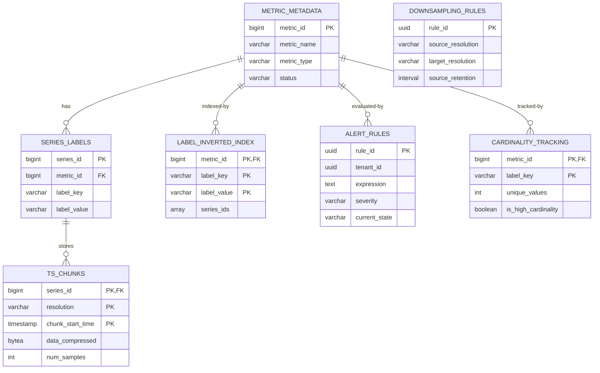
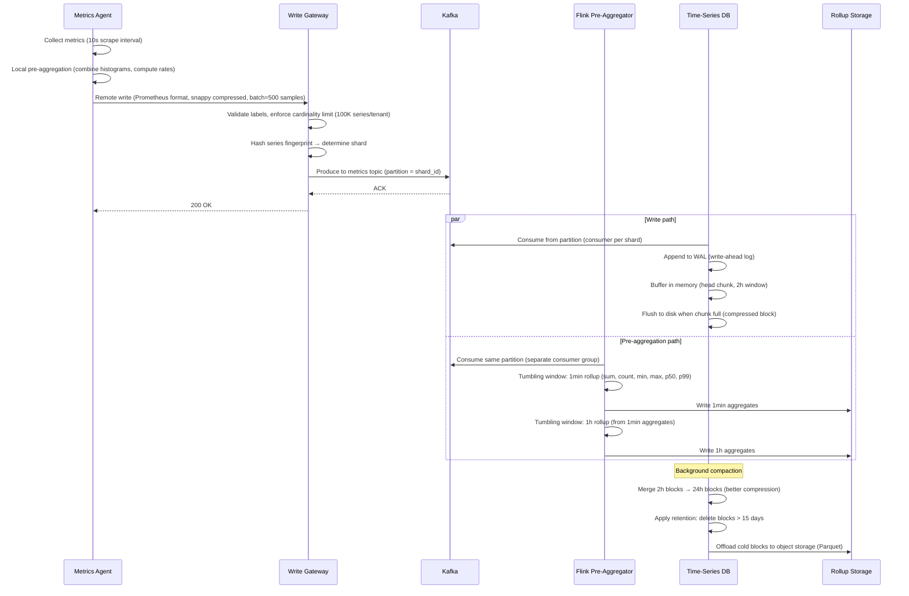
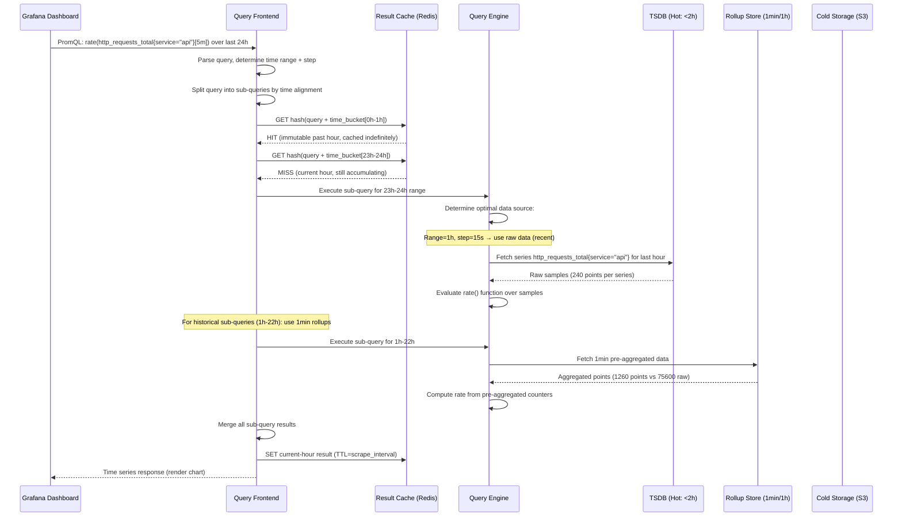

# Design: Metrics Aggregation System (StatsD/Prometheus Ingest)

## 1. Functional Requirements

- **High-Volume Ingestion**: Accept millions of metric data points per second
- **Pre-Aggregation**: Roll up metrics by configurable time windows (1s→1m→5m→1h→1d)
- **Multi-Resolution Storage**: Tiered storage with automatic downsampling
- **Metric Types**: Support counter, gauge, histogram, summary
- **Tag-Based Querying**: Flexible dimensional queries on label/tag combinations
- **Alerting Rules**: Threshold, anomaly, and rate-of-change alerts
- **Downsampling**: Automatic reduction of resolution for older data
- **Cardinality Management**: Prevent metric explosion from high-cardinality labels
- **Recording Rules**: Pre-compute expensive queries as new metrics
- **Federation**: Cross-cluster metric aggregation

## 2. Non-Functional Requirements

| Requirement | Target |
|---|---|
| Ingestion Rate | 10M data points/second |
| Write Latency | < 100ms (p99) from agent to storage |
| Query Latency (recent) | < 500ms for last-hour queries |
| Query Latency (historical) | < 5s for 30-day range queries |
| Storage Efficiency | 1.5 bytes/data point (compressed) |
| Retention (full res) | 15 days at 1-second resolution |
| Retention (downsampled) | 1 year at 1-hour, 5 years at 1-day |
| Availability | 99.99% for writes, 99.9% for reads |
| Cardinality Limit | 10M active time series |
| Alert Evaluation | < 30s from metric arrival to alert fire |

## 3. Capacity Estimation

```
Ingestion Rate: 10M data points/second
Active Time Series: 10M unique metric+label combinations
Average Labels per Metric: 5 (service, host, region, env, instance)
Unique Metric Names: 50,000
Samples per Series per Day: 86,400 (1s resolution)

Storage (full resolution - 15 days):
  10M series × 86,400 samples/day × 15 days × 16 bytes = ~200 TB raw
  With Gorilla compression: ~200 TB / 10 = ~20 TB compressed

Storage (1-minute downsampled - 90 days):
  10M series × 1,440 samples/day × 90 days × 16 bytes = ~19 TB raw → ~2 TB compressed

Storage (1-hour downsampled - 1 year):
  10M series × 24 samples/day × 365 days × 16 bytes = ~1.3 TB raw → ~150 GB compressed

Kafka Throughput: 10M points/s × 100 bytes avg = 1 GB/s
Network Bandwidth: 10 Gbps ingestion
Compute:
  - Ingest/routing: 50 nodes
  - Pre-aggregation (Flink): 100 nodes
  - Storage (TSDB): 200 nodes
  - Query: 30 nodes
  - Alert evaluation: 20 nodes
```

## 4. Data Modeling

### Entity-Relationship Diagram



### Metric Metadata Schema
```sql
CREATE TABLE metric_metadata (
    metric_id           BIGINT PRIMARY KEY AUTO_INCREMENT,
    metric_name         VARCHAR(255) NOT NULL UNIQUE,
    metric_type         VARCHAR(20) NOT NULL,  -- 'counter','gauge','histogram','summary'
    description         TEXT,
    unit                VARCHAR(50),  -- 'bytes','seconds','requests','percent'
    -- Cardinality management
    label_keys          TEXT[] NOT NULL,  -- expected label keys
    cardinality_limit   INT DEFAULT 100000,
    current_cardinality INT DEFAULT 0,
    -- Aggregation rules
    default_aggregation VARCHAR(20) DEFAULT 'avg',  -- 'sum','avg','min','max','count'
    recording_rules     JSONB,
    -- Lifecycle
    created_at          TIMESTAMP DEFAULT NOW(),
    last_seen_at        TIMESTAMP,
    status              VARCHAR(20) DEFAULT 'active',  -- 'active','stale','blocked'
    owner_team          VARCHAR(255),
    INDEX idx_metric_name (metric_name),
    INDEX idx_metric_type (metric_type),
    INDEX idx_metric_status (status, last_seen_at)
);
```

### Time Series Label Index (Inverted Index)
```sql
CREATE TABLE series_labels (
    series_id           BIGINT NOT NULL,
    metric_id           BIGINT NOT NULL,
    label_key           VARCHAR(128) NOT NULL,
    label_value         VARCHAR(512) NOT NULL,
    -- Fingerprint for fast lookup
    series_fingerprint  BIGINT NOT NULL,  -- FNV hash of sorted labels
    created_at          TIMESTAMP DEFAULT NOW(),
    last_seen_at        TIMESTAMP DEFAULT NOW(),
    PRIMARY KEY (series_id),
    INDEX idx_label_lookup (metric_id, label_key, label_value),
    INDEX idx_fingerprint (series_fingerprint),
    INDEX idx_metric_series (metric_id)
);

-- Inverted index: label_value -> series_ids
CREATE TABLE label_inverted_index (
    label_key           VARCHAR(128) NOT NULL,
    label_value         VARCHAR(512) NOT NULL,
    series_ids          BIGINT[] NOT NULL,  -- posting list
    metric_id           BIGINT NOT NULL,
    PRIMARY KEY (metric_id, label_key, label_value)
);
```

### Time Series Data (Chunk-based Storage)
```sql
-- Each chunk stores ~2 hours of data for one series
CREATE TABLE ts_chunks (
    series_id           BIGINT NOT NULL,
    chunk_start_time    TIMESTAMP NOT NULL,
    chunk_end_time      TIMESTAMP NOT NULL,
    -- Compressed data (Gorilla encoding)
    data_compressed     BYTEA NOT NULL,
    -- Chunk metadata
    num_samples         INT NOT NULL,
    min_value           DOUBLE PRECISION,
    max_value           DOUBLE PRECISION,
    sum_value           DOUBLE PRECISION,
    -- Storage tier
    resolution          VARCHAR(10) NOT NULL,  -- '1s','1m','5m','1h','1d'
    storage_tier        VARCHAR(20) DEFAULT 'hot',  -- 'hot','warm','cold'
    size_bytes          INT NOT NULL,
    PRIMARY KEY (series_id, resolution, chunk_start_time)
);

-- Partition by time for efficient retention and queries
-- PARTITION BY RANGE (chunk_start_time)
CREATE INDEX idx_chunks_time ON ts_chunks(chunk_start_time, chunk_end_time);
CREATE INDEX idx_chunks_tier ON ts_chunks(storage_tier, chunk_start_time);
```

### Alert Rules Schema
```sql
CREATE TABLE alert_rules (
    rule_id             UUID PRIMARY KEY,
    tenant_id           UUID NOT NULL,
    name                VARCHAR(255) NOT NULL,
    -- Rule definition (PromQL-compatible)
    expression          TEXT NOT NULL,
    -- e.g., "rate(http_requests_total{status=~'5..'}[5m]) / rate(http_requests_total[5m]) > 0.05"
    -- Timing
    evaluation_interval INTERVAL DEFAULT '30 seconds',
    for_duration        INTERVAL DEFAULT '5 minutes',  -- must fire for this long
    -- Severity and routing
    severity            VARCHAR(20) NOT NULL,  -- 'critical','warning','info'
    labels              JSONB DEFAULT '{}',
    annotations         JSONB DEFAULT '{}',
    /*
    annotations: {
      "summary": "High error rate on {{ $labels.service }}",
      "description": "Error rate is {{ $value | humanizePercentage }} (threshold: 5%)",
      "runbook_url": "https://wiki/runbooks/high-error-rate"
    }
    */
    -- Notification
    notification_channels TEXT[],  -- ['slack:#alerts','pagerduty:team-sre']
    -- State
    status              VARCHAR(20) DEFAULT 'active',
    last_evaluation_at  TIMESTAMP,
    current_state       VARCHAR(20) DEFAULT 'inactive',  -- 'inactive','pending','firing'
    firing_since        TIMESTAMP,
    created_at          TIMESTAMP DEFAULT NOW(),
    updated_at          TIMESTAMP DEFAULT NOW()
);

CREATE INDEX idx_alerts_tenant ON alert_rules(tenant_id, status);
CREATE INDEX idx_alerts_eval ON alert_rules(status, evaluation_interval)
    WHERE status = 'active';
```

### Downsampling Configuration
```sql
CREATE TABLE downsampling_rules (
    rule_id             UUID PRIMARY KEY,
    source_resolution   VARCHAR(10) NOT NULL,  -- '1s'
    target_resolution   VARCHAR(10) NOT NULL,  -- '1m'
    -- Aggregation method per metric type
    counter_aggregation VARCHAR(20) DEFAULT 'sum',
    gauge_aggregation   VARCHAR(20) DEFAULT 'avg',
    histogram_aggregation VARCHAR(20) DEFAULT 'merge',
    -- Retention
    source_retention    INTERVAL NOT NULL,  -- keep 1s data for 15 days
    target_retention    INTERVAL NOT NULL,  -- keep 1m data for 90 days
    -- Processing
    lag_tolerance       INTERVAL DEFAULT '5 minutes',
    batch_size_hours    INT DEFAULT 1,
    -- Status
    last_processed_at   TIMESTAMP,
    status              VARCHAR(20) DEFAULT 'active'
);

-- Default rules
INSERT INTO downsampling_rules VALUES
    (gen_random_uuid(), '1s', '1m', 'sum', 'avg', 'merge', '15 days', '90 days', '5 min', 1, NULL, 'active'),
    (gen_random_uuid(), '1m', '5m', 'sum', 'avg', 'merge', '90 days', '180 days', '10 min', 6, NULL, 'active'),
    (gen_random_uuid(), '5m', '1h', 'sum', 'avg', 'merge', '180 days', '365 days', '30 min', 24, NULL, 'active'),
    (gen_random_uuid(), '1h', '1d', 'sum', 'avg', 'merge', '365 days', '1825 days', '2 hours', 24, NULL, 'active');
```

### Cardinality Tracking Schema
```sql
CREATE TABLE cardinality_tracking (
    metric_id           BIGINT NOT NULL,
    label_key           VARCHAR(128) NOT NULL,
    -- Cardinality stats
    unique_values       INT NOT NULL,
    sample_values       TEXT[],  -- top-10 most common values
    -- Trends
    cardinality_1h_ago  INT,
    cardinality_24h_ago INT,
    growth_rate_per_hour FLOAT,
    -- Limits
    is_high_cardinality BOOLEAN DEFAULT FALSE,
    action_taken        VARCHAR(50),  -- 'none','sampling','dropped','aggregated'
    PRIMARY KEY (metric_id, label_key)
);

CREATE INDEX idx_cardinality_high ON cardinality_tracking(is_high_cardinality)
    WHERE is_high_cardinality = TRUE;
```

## 5. High-Level Design (HLD)

```
┌─────────────────────────────────────────────────────────────────────────────────┐
│                      METRICS AGGREGATION SYSTEM                                   │
├─────────────────────────────────────────────────────────────────────────────────┤
│                                                                                   │
│  AGENTS (Client-Side)                                                            │
│  ┌──────────┐  ┌──────────┐  ┌──────────┐  ┌──────────┐                        │
│  │ StatsD   │  │ Prom     │  │ OTEL     │  │ Custom   │                        │
│  │ Agent    │  │ Exporter │  │ Collector│  │ Agent    │                        │
│  │(pre-agg) │  │          │  │          │  │          │                        │
│  └────┬─────┘  └────┬─────┘  └────┬─────┘  └────┬─────┘                        │
│       │              │              │              │                              │
│       │   UDP/TCP    │   HTTP Pull  │   gRPC      │   HTTP Push                 │
│       ▼              ▼              ▼              ▼                              │
│  ┌─────────────────────────────────────────────────────────────────────┐        │
│  │                    INGESTION GATEWAY                                  │        │
│  │  Protocol Translation │ Validation │ Cardinality Check │ Routing    │        │
│  │  Rate Limiting │ Multi-tenancy │ Write-ahead buffer                  │        │
│  └────────────────────────────────┬────────────────────────────────────┘        │
│                                   │                                              │
│                                   ▼                                              │
│  ┌─────────────────────────────────────────────────────────────────────┐        │
│  │                    KAFKA (Metric Streams)                             │        │
│  │  metrics.raw │ metrics.aggregated │ alerts.evaluations               │        │
│  └────────────────────────────────┬────────────────────────────────────┘        │
│                                   │                                              │
│                    ┌──────────────┼──────────────┐                               │
│                    ▼              ▼              ▼                                │
│  ┌──────────────────┐ ┌──────────────────┐ ┌──────────────────┐                │
│  │  PRE-AGGREGATION │ │  ALERT           │ │  RECORDING       │                │
│  │  (Flink)         │ │  EVALUATOR       │ │  RULES           │                │
│  │                  │ │                  │ │                  │                │
│  │  Tumbling windows│ │  PromQL eval     │ │  Pre-compute     │                │
│  │  1s → 1m rollup  │ │  every 30s       │ │  expensive       │                │
│  │  Counter reset   │ │  For-duration    │ │  queries         │                │
│  │  Histogram merge │ │  State machine   │ │                  │                │
│  └────────┬─────────┘ └────────┬─────────┘ └────────┬─────────┘                │
│           │                    │                     │                           │
│           ▼                    ▼                     │                           │
│  ┌─────────────────────────────────────────────────────────────────────┐        │
│  │                    TIME-SERIES DATABASE                               │        │
│  │  ┌─────────────┐  ┌─────────────┐  ┌─────────────┐                 │        │
│  │  │  HOT TIER   │  │  WARM TIER  │  │  COLD TIER  │                 │        │
│  │  │  (Memory+SSD)│  │  (SSD)      │  │  (Object    │                 │        │
│  │  │  1s: 15 days │  │  1m: 90 days│  │   Storage)  │                 │        │
│  │  │             │  │  5m: 180 days│  │  1h: 1 year │                 │        │
│  │  │  In-memory   │  │             │  │  1d: 5 years│                 │        │
│  │  │  chunks      │  │  Compacted  │  │             │                 │        │
│  │  │  + WAL       │  │  blocks     │  │  Parquet    │                 │        │
│  │  └─────────────┘  └─────────────┘  └─────────────┘                 │        │
│  │                                                                      │        │
│  │  Inverted Index (Labels → Series) │ Gorilla Compression             │        │
│  └─────────────────────────────────────────────────────────────────────┘        │
│                                                                                   │
│  ┌──────────────────────────┐  ┌──────────────────────────────────────┐         │
│  │  QUERY ENGINE            │  │  DOWNSAMPLER                          │         │
│  │  PromQL/MetricsQL parser │  │  Background: 1s→1m→5m→1h→1d          │         │
│  │  Series selection        │  │  Counter: sum over window             │         │
│  │  Aggregation execution   │  │  Gauge: avg/min/max                   │         │
│  │  Multi-tier fanout       │  │  Histogram: DDSketch merge            │         │
│  └──────────────────────────┘  └──────────────────────────────────────┘         │
│                                                                                   │
└─────────────────────────────────────────────────────────────────────────────────┘
```

## 6. Low-Level Design (LLD) - APIs

### Metric Write API (Remote Write)
```python
# POST /api/v1/write (Prometheus remote_write compatible)
# Content-Type: application/x-protobuf
# Content-Encoding: snappy

# Protobuf schema (prometheus remote write):
# message WriteRequest {
#   repeated TimeSeries timeseries = 1;
# }
# message TimeSeries {
#   repeated Label labels = 1;
#   repeated Sample samples = 2;
# }

# JSON equivalent for illustration:
{
    "timeseries": [
        {
            "labels": [
                {"name": "__name__", "value": "http_requests_total"},
                {"name": "service", "value": "api-gateway"},
                {"name": "method", "value": "GET"},
                {"name": "status", "value": "200"},
                {"name": "instance", "value": "api-01:8080"}
            ],
            "samples": [
                {"value": 15234.0, "timestamp_ms": 1705312800000},
                {"value": 15235.0, "timestamp_ms": 1705312801000}
            ]
        },
        {
            "labels": [
                {"name": "__name__", "value": "http_request_duration_seconds"},
                {"name": "service", "value": "api-gateway"},
                {"name": "le", "value": "0.1"}
            ],
            "samples": [
                {"value": 98234.0, "timestamp_ms": 1705312800000}
            ]
        }
    ]
}

# Response 200 (success - no body)
# Response 400 (validation error)
{
    "error": "invalid_sample",
    "message": "Sample timestamp too old: 1705200000000 (max age: 1h)",
    "dropped_samples": 2
}
# Response 429 (rate limited)
{
    "error": "rate_limited",
    "message": "Tenant quota exceeded: 1M samples/s",
    "retry_after_ms": 1000
}
```

### StatsD UDP Ingestion
```python
# StatsD wire format:
# <metric_name>:<value>|<type>|@<sample_rate>|#<tags>
#
# Examples:
# page.views:1|c|#service:web,page:home
# response.time:320|ms|#service:api,endpoint:/users
# queue.size:45|g|#service:worker,queue:emails
# request.size:512|h|#service:api

# Internal representation after parsing:
{
    "metric_name": "page.views",
    "value": 1.0,
    "type": "counter",
    "sample_rate": 1.0,
    "tags": {"service": "web", "page": "home"},
    "timestamp_ms": 1705312800000,
    "source_agent": "agent-host-01"
}
```

### Query API (PromQL-compatible)
```python
# GET /api/v1/query_range
# Params: query, start, end, step
{
    "query": "rate(http_requests_total{service='api-gateway',status=~'5..'}[5m])",
    "start": "2024-01-15T09:00:00Z",
    "end": "2024-01-15T10:00:00Z",
    "step": "60s"
}

# Response 200
{
    "status": "success",
    "data": {
        "resultType": "matrix",
        "result": [
            {
                "metric": {
                    "__name__": "http_requests_total",
                    "service": "api-gateway",
                    "method": "GET",
                    "status": "500",
                    "instance": "api-01:8080"
                },
                "values": [
                    [1705309200, "0.5"],
                    [1705309260, "0.7"],
                    [1705309320, "1.2"],
                    [1705309380, "0.3"]
                ]
            }
        ],
        "stats": {
            "seriesFetched": 12,
            "samplesFetched": 43200,
            "peakSamples": 720,
            "executionTimeMs": 45
        }
    }
}
```

### Alert Rule API
```python
# POST /api/v1/alerts/rules
{
    "name": "HighErrorRate",
    "expression": "rate(http_requests_total{status=~'5..'}[5m]) / rate(http_requests_total[5m]) > 0.05",
    "for": "5m",
    "severity": "critical",
    "labels": {
        "team": "platform"
    },
    "annotations": {
        "summary": "High 5xx error rate on {{ $labels.service }}",
        "description": "Error rate is {{ $value | humanizePercentage }}",
        "dashboard": "https://grafana/d/api-overview?var-service={{ $labels.service }}"
    },
    "notification_channels": ["pagerduty:platform-oncall", "slack:#platform-alerts"]
}

# Response 201
{
    "rule_id": "alert-abc123",
    "status": "active",
    "next_evaluation": "2024-01-15T10:00:30Z"
}
```

### Cardinality Management API
```python
# GET /api/v1/cardinality/top?limit=10
# Response 200
{
    "total_active_series": 9_500_000,
    "limit": 10_000_000,
    "utilization_pct": 95.0,
    "top_metrics": [
        {
            "metric_name": "http_request_duration_seconds_bucket",
            "cardinality": 2_500_000,
            "label_cardinalities": {
                "le": 15,
                "service": 50,
                "method": 8,
                "path": 12000,  # HIGH CARDINALITY!
                "status": 5,
                "instance": 200
            },
            "recommendation": "Drop or aggregate 'path' label (12000 unique values)"
        }
    ],
    "growth_rate_per_hour": 50000,
    "estimated_time_to_limit": "3 days"
}

# POST /api/v1/cardinality/rules
{
    "metric_name": "http_request_duration_seconds_bucket",
    "action": "aggregate_label",
    "label_key": "path",
    "aggregate_to": "path_group",  # /users/123 → /users/{id}
    "regex_rules": [
        {"pattern": "/users/\\d+", "replacement": "/users/{id}"},
        {"pattern": "/orders/\\d+/items/\\d+", "replacement": "/orders/{id}/items/{id}"}
    ]
}
```

## 7. Deep Dives

### Deep Dive 1: Pre-Aggregation Pipeline

```
┌─────────────────────────────────────────────────────────────────────────┐
│                    PRE-AGGREGATION PIPELINE                               │
├─────────────────────────────────────────────────────────────────────────┤
│                                                                           │
│  Agent-Side Pre-Aggregation (10s flush):                                 │
│  ┌─────────────────────────────────────────────────────┐                │
│  │  Counter: accumulate increments, flush delta         │                │
│  │  Gauge: last value in window                         │                │
│  │  Histogram: local DDSketch, flush sketch             │                │
│  │  Reduces: 1000 events/s → 6 samples/min per series  │                │
│  └─────────────────────────────────────────────────────┘                │
│                           │                                              │
│                           ▼                                              │
│  Server-Side (Flink Tumbling Windows):                                   │
│  ┌─────────────────────────────────────────────────────┐                │
│  │                                                      │                │
│  │  1-SECOND WINDOW (raw aggregation):                  │                │
│  │  ┌────────────────────────────────────────┐         │                │
│  │  │  Counter: sum(deltas) in window         │         │                │
│  │  │  Gauge: last(value) in window           │         │                │
│  │  │  Histogram: merge(DDSketches)           │         │                │
│  │  │  Handle counter resets: detect decrease │         │                │
│  │  └────────────────────────────────────────┘         │                │
│  │                    │                                  │                │
│  │                    ▼                                  │                │
│  │  1-MINUTE WINDOW (first rollup):                     │                │
│  │  ┌────────────────────────────────────────┐         │                │
│  │  │  Counter: sum(1s values)                │         │                │
│  │  │  Gauge: avg + min + max + last          │         │                │
│  │  │  Histogram: merge DDSketches →          │         │                │
│  │  │    quantiles (p50, p90, p95, p99)       │         │                │
│  │  │  Output: 4 values per gauge series      │         │                │
│  │  └────────────────────────────────────────┘         │                │
│  │                                                      │                │
│  └─────────────────────────────────────────────────────┘                │
│                                                                           │
│  COUNTER RESET HANDLING:                                                 │
│  ┌─────────────────────────────────────────────────────┐                │
│  │  Values: [100, 105, 110, 5, 10, 15]                  │                │
│  │  Detect: value[i] < value[i-1] → RESET at index 3   │                │
│  │  Adjust: [100, 105, 110, 115, 120, 125]             │                │
│  │          (add last-pre-reset value to post-reset)    │                │
│  │  Rate:   rate = (125 - 100) / 6s = 4.17/s           │                │
│  └─────────────────────────────────────────────────────┘                │
│                                                                           │
└─────────────────────────────────────────────────────────────────────────┘
```

```python
class MetricPreAggregator:
    """
    Flink-based pre-aggregation with tumbling windows.
    Handles counter resets and histogram merging.
    """
    
    def __init__(self, flink_env):
        self.env = flink_env
    
    def build_pipeline(self):
        """Build Flink streaming DAG for metric aggregation."""
        # Source: Kafka metrics.raw topic
        raw_metrics = self.env.add_source(
            KafkaSource.builder()
            .set_topics("metrics.raw")
            .set_group_id("metric-aggregator")
            .set_starting_offsets(OffsetsInitializer.latest())
            .build()
        )
        
        # Key by series (metric_name + sorted labels)
        keyed_stream = raw_metrics.key_by(lambda m: m.series_fingerprint)
        
        # 1-second tumbling window aggregation
        one_second_agg = (
            keyed_stream
            .window(TumblingEventTimeWindows.of(Time.seconds(1)))
            .allowed_lateness(Time.seconds(5))
            .aggregate(MetricWindowAggregator())
        )
        
        # Write 1s aggregates to hot storage
        one_second_agg.add_sink(TSDBSink(resolution="1s", tier="hot"))
        
        # 1-minute tumbling window (from 1s aggregates)
        one_minute_agg = (
            one_second_agg
            .key_by(lambda m: m.series_fingerprint)
            .window(TumblingEventTimeWindows.of(Time.minutes(1)))
            .aggregate(MetricRollupAggregator(source_resolution="1s"))
        )
        
        # Write 1m aggregates to warm storage
        one_minute_agg.add_sink(TSDBSink(resolution="1m", tier="warm"))
        
        return self.env.execute("MetricPreAggregation")


class MetricWindowAggregator:
    """Aggregate raw samples within a time window."""
    
    def create_accumulator(self):
        return {
            'counter_sum': 0.0,
            'gauge_last': None,
            'gauge_min': float('inf'),
            'gauge_max': float('-inf'),
            'gauge_sum': 0.0,
            'gauge_count': 0,
            'histogram_sketch': DDSketch(),
            'last_counter_value': None,
            'counter_resets': 0
        }
    
    def add(self, value, accumulator):
        metric_type = value.metric_type
        
        if metric_type == 'counter':
            # Detect counter reset
            if (accumulator['last_counter_value'] is not None and 
                value.value < accumulator['last_counter_value']):
                # Counter reset detected
                accumulator['counter_resets'] += 1
                # Add the new value (post-reset) as increment
                accumulator['counter_sum'] += value.value
            elif accumulator['last_counter_value'] is not None:
                # Normal increment
                delta = value.value - accumulator['last_counter_value']
                accumulator['counter_sum'] += delta
            
            accumulator['last_counter_value'] = value.value
        
        elif metric_type == 'gauge':
            accumulator['gauge_last'] = value.value
            accumulator['gauge_min'] = min(accumulator['gauge_min'], value.value)
            accumulator['gauge_max'] = max(accumulator['gauge_max'], value.value)
            accumulator['gauge_sum'] += value.value
            accumulator['gauge_count'] += 1
        
        elif metric_type == 'histogram':
            accumulator['histogram_sketch'].add(value.value)
        
        return accumulator
    
    def get_result(self, accumulator):
        return accumulator


class DDSketch:
    """
    DDSketch: mergeable, space-efficient quantile sketch.
    Provides relative-error guarantees for quantile estimation.
    """
    
    def __init__(self, relative_accuracy=0.01, max_buckets=2048):
        self.relative_accuracy = relative_accuracy
        self.gamma = (1 + relative_accuracy) / (1 - relative_accuracy)
        self.log_gamma = math.log(self.gamma)
        self.buckets = {}  # index -> count
        self.count = 0
        self.zero_count = 0
        self.min_value = float('inf')
        self.max_value = float('-inf')
        self.max_buckets = max_buckets
    
    def add(self, value: float):
        """Add a value to the sketch."""
        self.count += 1
        self.min_value = min(self.min_value, value)
        self.max_value = max(self.max_value, value)
        
        if value == 0:
            self.zero_count += 1
            return
        
        index = self._get_index(abs(value))
        self.buckets[index] = self.buckets.get(index, 0) + 1
    
    def merge(self, other: 'DDSketch'):
        """Merge another sketch into this one (for aggregation)."""
        self.count += other.count
        self.zero_count += other.zero_count
        self.min_value = min(self.min_value, other.min_value)
        self.max_value = max(self.max_value, other.max_value)
        
        for index, count in other.buckets.items():
            self.buckets[index] = self.buckets.get(index, 0) + count
    
    def quantile(self, q: float) -> float:
        """Get approximate quantile value."""
        if self.count == 0:
            return 0.0
        
        target_count = q * self.count
        running_count = self.zero_count
        
        if running_count >= target_count:
            return 0.0
        
        for index in sorted(self.buckets.keys()):
            running_count += self.buckets[index]
            if running_count >= target_count:
                return self._get_value(index)
        
        return self.max_value
    
    def _get_index(self, value: float) -> int:
        return int(math.ceil(math.log(value) / self.log_gamma))
    
    def _get_value(self, index: int) -> float:
        return self.gamma ** index * (1 + self.relative_accuracy)
```

### Deep Dive 2: Storage Engine (Gorilla Compression)

```python
class GorillaCompressor:
    """
    Implements Facebook Gorilla time-series compression.
    Achieves ~1.37 bytes per data point on average.
    
    Timestamp compression: Delta-of-delta encoding
    Value compression: XOR with previous value, encode leading/trailing zeros
    """
    
    def __init__(self):
        self.bit_stream = BitStream()
        self.prev_timestamp = None
        self.prev_delta = None
        self.prev_value_bits = None
        self.count = 0
    
    def compress_sample(self, timestamp: int, value: float):
        """Compress a single (timestamp, value) pair."""
        self.count += 1
        
        if self.count == 1:
            # First sample: store full timestamp and value
            self.bit_stream.write_bits(timestamp, 64)
            self.bit_stream.write_bits(float_to_bits(value), 64)
            self.prev_timestamp = timestamp
            self.prev_value_bits = float_to_bits(value)
            return
        
        # Timestamp: delta-of-delta encoding
        self._compress_timestamp(timestamp)
        
        # Value: XOR encoding
        self._compress_value(value)
    
    def _compress_timestamp(self, timestamp: int):
        """
        Delta-of-delta timestamp compression.
        Most timestamps have regular intervals → delta-of-delta ≈ 0.
        """
        delta = timestamp - self.prev_timestamp
        
        if self.prev_delta is None:
            # Second sample: store delta (14 bits covers up to 16383s)
            self.bit_stream.write_bits(delta, 14)
            self.prev_delta = delta
            self.prev_timestamp = timestamp
            return
        
        dod = delta - self.prev_delta  # delta-of-delta
        
        if dod == 0:
            # Most common: single 0 bit
            self.bit_stream.write_bit(0)
        elif -63 <= dod <= 64:
            # 2 bits header + 7 bits value
            self.bit_stream.write_bits(0b10, 2)
            self.bit_stream.write_bits(dod + 63, 7)  # zigzag
        elif -255 <= dod <= 256:
            # 3 bits header + 9 bits value
            self.bit_stream.write_bits(0b110, 3)
            self.bit_stream.write_bits(dod + 255, 9)
        elif -2047 <= dod <= 2048:
            # 4 bits header + 12 bits value
            self.bit_stream.write_bits(0b1110, 4)
            self.bit_stream.write_bits(dod + 2047, 12)
        else:
            # 4 bits header + 32 bits full value
            self.bit_stream.write_bits(0b1111, 4)
            self.bit_stream.write_bits(dod, 32)
        
        self.prev_delta = delta
        self.prev_timestamp = timestamp
    
    def _compress_value(self, value: float):
        """
        XOR-based value compression.
        Similar values (common in metrics) → few differing bits.
        """
        current_bits = float_to_bits(value)
        xor = self.prev_value_bits ^ current_bits
        
        if xor == 0:
            # Same value: single 0 bit
            self.bit_stream.write_bit(0)
        else:
            self.bit_stream.write_bit(1)
            
            leading_zeros = count_leading_zeros(xor)
            trailing_zeros = count_trailing_zeros(xor)
            significant_bits = 64 - leading_zeros - trailing_zeros
            
            # Check if meaningful bits fit within previous block
            if (self.prev_leading is not None and
                leading_zeros >= self.prev_leading and
                trailing_zeros >= self.prev_trailing):
                # Reuse previous block size: 0 + significant bits
                self.bit_stream.write_bit(0)
                prev_significant = 64 - self.prev_leading - self.prev_trailing
                self.bit_stream.write_bits(
                    xor >> self.prev_trailing, prev_significant
                )
            else:
                # New block: 1 + 5-bit leading + 6-bit length + significant bits
                self.bit_stream.write_bit(1)
                self.bit_stream.write_bits(leading_zeros, 5)
                self.bit_stream.write_bits(significant_bits - 1, 6)
                self.bit_stream.write_bits(xor >> trailing_zeros, significant_bits)
                
                self.prev_leading = leading_zeros
                self.prev_trailing = trailing_zeros
        
        self.prev_value_bits = current_bits
    
    def get_compressed_bytes(self) -> bytes:
        """Return the compressed byte stream."""
        return self.bit_stream.to_bytes()
    
    @staticmethod
    def decompress(data: bytes, num_samples: int) -> list:
        """Decompress to list of (timestamp, value) tuples."""
        stream = BitStream.from_bytes(data)
        samples = []
        
        # Read first sample
        timestamp = stream.read_bits(64)
        value = bits_to_float(stream.read_bits(64))
        samples.append((timestamp, value))
        
        # Read subsequent samples
        prev_ts = timestamp
        prev_delta = None
        prev_value_bits = float_to_bits(value)
        
        for i in range(1, num_samples):
            # Decompress timestamp (inverse of compress)
            timestamp = GorillaCompressor._decompress_timestamp(
                stream, prev_ts, prev_delta
            )
            # Decompress value
            value_bits = GorillaCompressor._decompress_value(stream, prev_value_bits)
            
            samples.append((timestamp, bits_to_float(value_bits)))
            prev_delta = timestamp - prev_ts
            prev_ts = timestamp
            prev_value_bits = value_bits
        
        return samples
```

### Deep Dive 3: Cardinality Explosion Prevention

```python
class CardinalityManager:
    """
    Prevents metric cardinality explosion through:
    1. Real-time cardinality tracking per metric
    2. Adaptive sampling for high-cardinality labels
    3. Automatic label aggregation/dropping
    4. Circuit breaker when limits approached
    """
    
    def __init__(self, config: dict, redis_client, alert_service):
        self.config = config
        self.redis = redis_client
        self.alerts = alert_service
        self.global_limit = config.get('global_series_limit', 10_000_000)
        self.per_metric_default_limit = config.get('per_metric_limit', 100_000)
    
    def check_and_admit(self, metric_name: str, labels: dict) -> AdmissionResult:
        """
        Gate function: decide whether to admit a new time series.
        Called on every incoming sample with unseen label combination.
        """
        series_fingerprint = self._compute_fingerprint(metric_name, labels)
        
        # Fast path: already known series
        if self.redis.sismember(f"series:known:{metric_name}", series_fingerprint):
            return AdmissionResult(admitted=True)
        
        # New series: check cardinality limits
        current_cardinality = self.redis.scard(f"series:known:{metric_name}")
        metric_limit = self._get_metric_limit(metric_name)
        
        # Check per-metric limit
        if current_cardinality >= metric_limit:
            return self._handle_limit_exceeded(metric_name, labels, current_cardinality)
        
        # Check global limit
        global_cardinality = self.redis.get("series:global_count")
        if int(global_cardinality or 0) >= self.global_limit:
            return AdmissionResult(
                admitted=False,
                reason="global_limit_reached",
                action="drop"
            )
        
        # Check for high-cardinality label
        high_card_label = self._detect_high_cardinality_label(metric_name, labels)
        if high_card_label:
            return self._apply_adaptive_sampling(metric_name, labels, high_card_label)
        
        # Admit the new series
        self.redis.sadd(f"series:known:{metric_name}", series_fingerprint)
        self.redis.incr("series:global_count")
        
        # Track per-label cardinality
        for key, value in labels.items():
            self.redis.pfadd(f"cardinality:{metric_name}:{key}", value)
        
        return AdmissionResult(admitted=True)
    
    def _detect_high_cardinality_label(self, metric_name: str, labels: dict) -> str:
        """
        Identify which label is causing high cardinality.
        Uses HyperLogLog for approximate distinct counts.
        """
        for key, value in labels.items():
            hll_count = self.redis.pfcount(f"cardinality:{metric_name}:{key}")
            threshold = self.config.get(
                f'label_cardinality_threshold.{key}',
                self.config.get('default_label_cardinality_threshold', 10000)
            )
            if hll_count > threshold:
                return key
        return None
    
    def _apply_adaptive_sampling(self, metric_name: str, labels: dict,
                                  high_card_label: str) -> AdmissionResult:
        """
        Apply adaptive sampling: admit only a fraction of high-cardinality series.
        Sampling rate decreases as cardinality grows.
        """
        current_card = self.redis.pfcount(f"cardinality:{metric_name}:{high_card_label}")
        limit = self.per_metric_default_limit
        
        # Sampling rate: inversely proportional to how far over limit we are
        sampling_rate = max(0.01, limit / current_card)
        
        # Deterministic sampling based on label value hash
        label_hash = hash(labels[high_card_label]) % 100
        if label_hash < (sampling_rate * 100):
            # Admit but mark as sampled
            self.redis.sadd(
                f"series:known:{metric_name}",
                self._compute_fingerprint(metric_name, labels)
            )
            return AdmissionResult(
                admitted=True,
                sampling_rate=sampling_rate,
                weight=1.0 / sampling_rate  # For correct aggregation
            )
        else:
            return AdmissionResult(
                admitted=False,
                reason=f"sampled_out (rate={sampling_rate:.2%})",
                action="aggregate",
                aggregate_to=self._get_aggregate_label(metric_name, high_card_label, labels)
            )
    
    def _get_aggregate_label(self, metric_name: str, label_key: str, 
                              labels: dict) -> dict:
        """
        Generate aggregated label set (e.g., path=/users/123 → path=/users/{id}).
        Uses configured regex rules or fallback to 'other' bucket.
        """
        rules = self.config.get(f'aggregation_rules.{metric_name}.{label_key}', [])
        value = labels[label_key]
        
        for rule in rules:
            if re.match(rule['pattern'], value):
                new_labels = labels.copy()
                new_labels[label_key] = re.sub(rule['pattern'], rule['replacement'], value)
                return new_labels
        
        # Fallback: replace with 'other'
        new_labels = labels.copy()
        new_labels[label_key] = '__other__'
        return new_labels
    
    def run_cardinality_report(self) -> dict:
        """Generate periodic cardinality analysis report."""
        report = {
            'global_series': int(self.redis.get("series:global_count") or 0),
            'global_limit': self.global_limit,
            'utilization_pct': 0.0,
            'top_metrics': [],
            'high_cardinality_labels': [],
            'recommendations': []
        }
        
        report['utilization_pct'] = (report['global_series'] / self.global_limit) * 100
        
        # Find top metrics by cardinality
        all_metrics = self.redis.keys("series:known:*")
        metric_cards = []
        for key in all_metrics:
            metric_name = key.split(":")[-1]
            card = self.redis.scard(key)
            metric_cards.append((metric_name, card))
        
        metric_cards.sort(key=lambda x: x[1], reverse=True)
        report['top_metrics'] = metric_cards[:20]
        
        # Recommendations
        if report['utilization_pct'] > 80:
            report['recommendations'].append(
                "CRITICAL: Approaching global cardinality limit. "
                "Review top metrics and apply aggregation rules."
            )
        
        return report
```

## 8. Component Optimization

### Kafka Configuration
```yaml
kafka:
  brokers: "kafka-01:9092,kafka-02:9092,kafka-03:9092"
  topics:
    metrics.raw:
      partitions: 512  # High parallelism for 10M pts/s
      replication_factor: 2  # Metrics are reproducible, 2 is sufficient
      retention_ms: 3600000  # 1 hour buffer
      segment_bytes: 536870912  # 512 MB
      compression_type: "lz4"  # Fast compression for latency
      max_message_bytes: 1048576  # 1 MB batch
    
    metrics.aggregated:
      partitions: 128
      replication_factor: 3
      retention_ms: 86400000  # 24h
      compression_type: "zstd"
  
  producer:
    batch_size: 524288  # 512 KB
    linger_ms: 50
    buffer_memory: 268435456  # 256 MB
    acks: 1  # Single ack for latency (metrics are reproducible)
    
  consumer:
    fetch_min_bytes: 1048576  # 1 MB
    fetch_max_wait_ms: 100
    max_poll_records: 50000
```

### Redis Configuration
```yaml
redis:
  cluster:
    nodes: ["redis-01:6379", "redis-02:6379", "redis-03:6379", "redis-04:6379", "redis-05:6379", "redis-06:6379"]
    replicas: 1
  
  caches:
    series_index:
      prefix: "series:"
      max_memory: "32gb"
      eviction_policy: "noeviction"  # Series registry must not lose data
    
    cardinality_hll:
      prefix: "cardinality:"
      max_memory: "8gb"
      
    query_cache:
      prefix: "qcache:"
      ttl: 15  # 15 seconds
      max_memory: "16gb"
      eviction_policy: "allkeys-lru"
    
    alert_state:
      prefix: "alert:"
      max_memory: "2gb"
      eviction_policy: "noeviction"
```

### Flink Configuration
```yaml
flink:
  job_manager:
    heap_size: "8g"
    
  task_manager:
    heap_size: "32g"
    num_task_slots: 8
    managed_memory_fraction: 0.5
    network_memory_min: "2gb"
    network_memory_max: "4gb"
  
  checkpointing:
    interval: 10000  # 10s (low latency requirement)
    mode: "AT_LEAST_ONCE"  # Metrics can tolerate slight duplicates
    min_pause: 5000
    
  parallelism:
    default: 256
    
  state_backend: "rocksdb"
  rocksdb:
    block_cache_size: "4gb"
    write_buffer_count: 4
    write_buffer_size: "256mb"
```

## 9. Observability

```yaml
monitoring:
  # Meta-metrics (monitoring the monitoring system)
  metrics:
    - name: "ingest_samples_total"
      type: counter
      labels: [protocol, tenant]
    - name: "ingest_latency_ms"
      type: histogram
      buckets: [1, 5, 10, 25, 50, 100, 250, 500]
    - name: "active_series_count"
      type: gauge
      labels: [tenant]
    - name: "query_duration_ms"
      type: histogram
      labels: [query_type, tier]
      buckets: [10, 50, 100, 250, 500, 1000, 2500, 5000]
    - name: "samples_dropped_total"
      type: counter
      labels: [reason]  # 'cardinality','rate_limit','validation'
    - name: "compaction_duration_seconds"
      type: histogram
    - name: "storage_bytes_total"
      type: gauge
      labels: [tier, resolution]
    - name: "alert_evaluation_duration_ms"
      type: histogram
    - name: "alert_notifications_total"
      type: counter
      labels: [severity, channel, status]
    - name: "cardinality_utilization_pct"
      type: gauge
      labels: [metric_name]
    - name: "downsampling_lag_seconds"
      type: gauge
      labels: [source_resolution, target_resolution]

  alerts:
    - name: "IngestionBackpressure"
      expr: "rate(ingest_samples_total[1m]) < expected_rate * 0.8"
      severity: critical
    - name: "CardinalityNearLimit"
      expr: "active_series_count / series_limit > 0.9"
      severity: warning
    - name: "QueryLatencyHigh"
      expr: "histogram_quantile(0.99, query_duration_ms) > 5000"
      severity: warning
    - name: "StorageFull"
      expr: "storage_bytes_total / storage_capacity > 0.85"
      severity: critical
    - name: "DownsamplingLag"
      expr: "downsampling_lag_seconds > 3600"
      severity: warning

  tracing:
    enabled: true
    sample_rate: 0.001  # 0.1% of queries
```

## 10. Considerations

### Trade-offs
| Decision | Chosen | Alternative | Rationale |
|---|---|---|---|
| Compression | Gorilla (delta-of-delta + XOR) | General LZ4/Zstd | 10x better for time-series patterns |
| Sketch Algorithm | DDSketch | T-Digest / HdrHistogram | Mergeable + relative error guarantees |
| Pre-aggregation | Flink streaming | In-storage rollup | Lower query latency, less storage I/O |
| Cardinality tracking | HyperLogLog | Exact count | O(1) space vs O(n), 1% error acceptable |
| Index | Inverted index (labels→series) | B-tree | Optimal for tag-based queries |
| Write acks | acks=1 (Kafka) | acks=all | Latency matters, metrics are reproducible |

### Failure Modes
- **Agent crash**: Buffered metrics lost (acceptable for monitoring data)
- **Kafka partition unavailable**: Route to different partition, temporary disorder
- **TSDB node failure**: Replicas serve reads, re-replicate on recovery
- **Cardinality explosion**: Circuit breaker drops new series, alert operators
- **Clock skew**: Accept samples within ±5min window, reject outliers
- **Query of death**: Timeout + circuit breaker on queries scanning >100M samples

### Scalability
- Horizontal scaling via consistent hashing on series fingerprint
- Hot series detection: replicate hot series across multiple nodes
- Write-ahead log per node for crash recovery
- Background compaction merges small chunks into larger blocks
- Cold tier offloads to object storage (Parquet format for analytics)

---

## 12. Sequence Diagrams

### Diagram 1: Metric Write + Pre-Aggregation



### Diagram 2: Query with Rollup Selection



### Caching Strategy

| Cache Type | Key | TTL | Hit Rate | Purpose |
|-----------|-----|-----|----------|---------|
| Query result (immutable) | hash(query + aligned_time_bucket) | ∞ (past hours never change) | ~70% | Avoid recomputing historical ranges |
| Query result (current) | hash(query + current_bucket) | 10-15s (scrape interval) | ~40% | Serve dashboard refreshes |
| Series metadata | series_fingerprint → labels | 1h | ~95% | Avoid label lookups on every query |
| Chunk index | series_id → chunk_locations | 30min | ~85% | Fast chunk location without index scan |
| Recording rules | rule_hash → precomputed series | Evaluation interval | ~99% | Avoid expensive PromQL re-evaluation |

### Infrastructure Components

```
┌──────────────────────────────────────────────────────────┐
│ Collection Tier                                           │
│  ├── Prometheus agents (per-node, DaemonSet)             │
│  ├── OpenTelemetry Collectors (sidecar + gateway mode)   │
│  └── StatsD/Graphite receivers (legacy compatibility)    │
├──────────────────────────────────────────────────────────┤
│ Ingestion Tier                                            │
│  ├── Write gateways (stateless, 12 pods, HPA on CPU)    │
│  ├── Kafka cluster (12 brokers, 256 partitions)          │
│  └── Flink pre-aggregator (6 task managers, checkpoints) │
├──────────────────────────────────────────────────────────┤
│ Storage Tier                                              │
│  ├── TSDB cluster (Thanos/Mimir: 20 ingesters, 10 store)│
│  ├── Object storage (S3: long-term blocks, Parquet)      │
│  └── Redis cluster (6 nodes: query cache + metadata)     │
├──────────────────────────────────────────────────────────┤
│ Query Tier                                                │
│  ├── Query frontends (split + cache + dedup, 6 pods)     │
│  ├── Query engines (parallel evaluation, 10 pods)        │
│  └── Grafana (dashboards, alerting rules)                │
└──────────────────────────────────────────────────────────┘
```

## 13. Algorithm Deep Dives

### Deep Dive: Time-Series Compression (Gorilla/XOR Encoding)

#### Problem
Metrics systems store billions of data points. Naive storage (8 bytes timestamp + 8 bytes value = 16 bytes/point) would require petabytes. Most metrics change slowly — exploit temporal patterns.

#### Timestamp Compression: Delta-of-Delta Encoding

Metric timestamps are highly regular (e.g., every 15s). Compress by storing delta-of-deltas.

```
Raw timestamps:     [1000, 1015, 1030, 1045, 1060, 1075]
Deltas:             [-, 15, 15, 15, 15, 15]
Delta-of-deltas:   [-, -, 0, 0, 0, 0]

Encoding (Facebook Gorilla paper):
  - First timestamp: stored as full 64-bit value
  - Delta-of-delta = 0:        store '0' (1 bit!)
  - Delta-of-delta in [-63,64]: store '10' + 7-bit value (9 bits)
  - Delta-of-delta in [-255,256]: store '110' + 9-bit value (12 bits)
  - Delta-of-delta in [-2047,2048]: store '1110' + 12-bit value (16 bits)
  - Otherwise: store '1111' + 32-bit value (36 bits)
```

**Step-by-step example:**
```
Timestamps: [1609459200, 1609459215, 1609459230, 1609459247, 1609459262]

t0 = 1609459200 → store full 64 bits
t1: delta = 15 → store as header (first delta, 14 bits)
t2: delta = 15, dod = 15-15 = 0 → store '0' (1 bit)
t3: delta = 17, dod = 17-15 = 2 → store '10' + 0000010 (9 bits)  
t4: delta = 15, dod = 15-17 = -2 → store '10' + 1111110 (9 bits, two's complement)

Total: 64 + 14 + 1 + 9 + 9 = 97 bits for 5 timestamps
Naive: 5 × 64 = 320 bits
Compression ratio: 3.3×
```

#### Value Compression: XOR Encoding

Float64 values in metrics often change by small amounts (e.g., CPU from 0.45 to 0.47).

```
XOR adjacent values → most bits cancel out → store only meaningful bits

Algorithm:
1. XOR current value with previous: xor = v[i] ^ v[i-1]
2. If xor == 0: store '0' (1 bit) — value unchanged
3. If meaningful bits within previous leading/trailing zeros:
   store '10' + value bits within same position (2 + value_bits)
4. Otherwise:
   store '11' + 5-bit leading_zeros + 6-bit block_length + meaningful_bits

Example:
  v0 = 0.45 = 0x3FDCCCCCCCCCCCCD (IEEE 754)
  v1 = 0.47 = 0x3FDE147AE147AE14
  
  xor = 0x0002D8E62D8E6239
  Leading zeros: 14, Trailing zeros: 0, Meaningful bits: 50
  
  v2 = 0.47 (same as v1)
  xor = 0x0000000000000000
  Store: '0' (1 bit!) — 94% of real-world samples
```

#### Real-World Compression Results

| Data Pattern | Bits/Value (timestamp) | Bits/Value (float) | Total Bytes/Point |
|-------------|----------------------|-------------------|-------------------|
| Regular interval, constant | 1 | 1 | 0.25 |
| Regular interval, slowly changing | 1 | 15-30 | 2-4 |
| Irregular interval, volatile | 12-36 | 40-50 | 7-11 |
| **Average across production** | **~4** | **~12** | **~1.37** |

vs naive 16 bytes/point = **12× compression ratio** on average.

---

### Deep Dive: Pre-Aggregation at Scale

#### Problem
Dashboard queries over 30 days of data at 15s resolution = 172,800 points per series. With 10K series per dashboard query, that's 1.7B points to scan.

#### Multi-Resolution Rollup Architecture

```
Raw (15s) ──[1min agg]──→ 1min rollups ──[1h agg]──→ 1h rollups ──[1d agg]──→ 1d rollups
   │                         │                          │                        │
   retention: 2 weeks        retention: 90 days         retention: 2 years       retention: forever
   storage: TSDB hot         storage: TSDB warm         storage: S3 Parquet      storage: S3 Parquet
```

#### Aggregation Functions Preserved at Each Level

For each series at each rollup level, store:
```
{
  "sum": 1234.5,      // enables: sum(), avg() (sum/count)
  "count": 82,        // enables: rate() (count/interval)
  "min": 0.1,         // enables: min()
  "max": 99.8,        // enables: max()
  "sum_of_squares": 5678.9,  // enables: stddev()
  "histogram_buckets": {     // enables: histogram_quantile()
    "0.1": 5, "0.5": 30, "1.0": 60, "5.0": 80, "+Inf": 82
  }
}
```

#### Query Resolution Selection Algorithm

```python
def select_resolution(time_range, step, query_type):
    """Automatically choose optimal rollup level"""
    
    # Rule 1: Never use rollup coarser than query step
    if step < 60:
        return "raw"  # need second-level precision
    
    # Rule 2: Use finest rollup that keeps points under budget
    max_points = 11000  # Grafana default maxDataPoints
    points_needed = time_range.total_seconds() / step
    
    if points_needed <= max_points:
        # Can afford raw if within retention
        if time_range < timedelta(weeks=2):
            return "raw"
        elif time_range < timedelta(days=90):
            return "1min"
        elif time_range < timedelta(days=730):
            return "1h"
        else:
            return "1d"
    
    # Rule 3: For counter metrics (rate/increase), need raw or 1min
    if query_type in ["rate", "increase", "irate"]:
        return "1min" if time_range > timedelta(weeks=2) else "raw"
    
    return select_by_range(time_range)
```

#### Exactly-Once Pre-Aggregation (Flink)

```
Checkpoint Protocol:
1. Flink initiates checkpoint barrier
2. Each operator saves window state to RocksDB + S3
3. Kafka source saves consumer offsets as part of checkpoint
4. Rollup sink uses two-phase commit:
   a. Pre-commit: write rollup rows to staging table
   b. On checkpoint complete: atomically move to rollup table
   c. On failure: rollback staging (idempotent via window_start + series_id key)

This guarantees: each raw sample contributes to exactly one rollup bucket,
even across failures and restarts.
```

