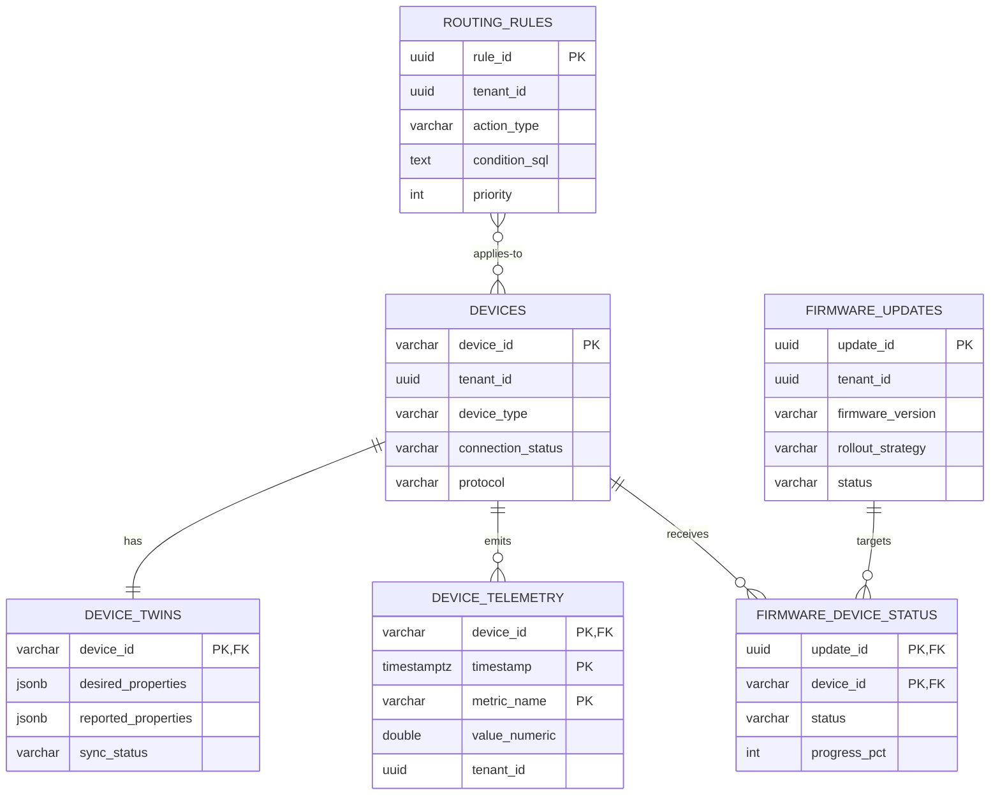
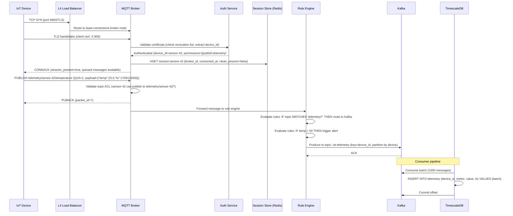
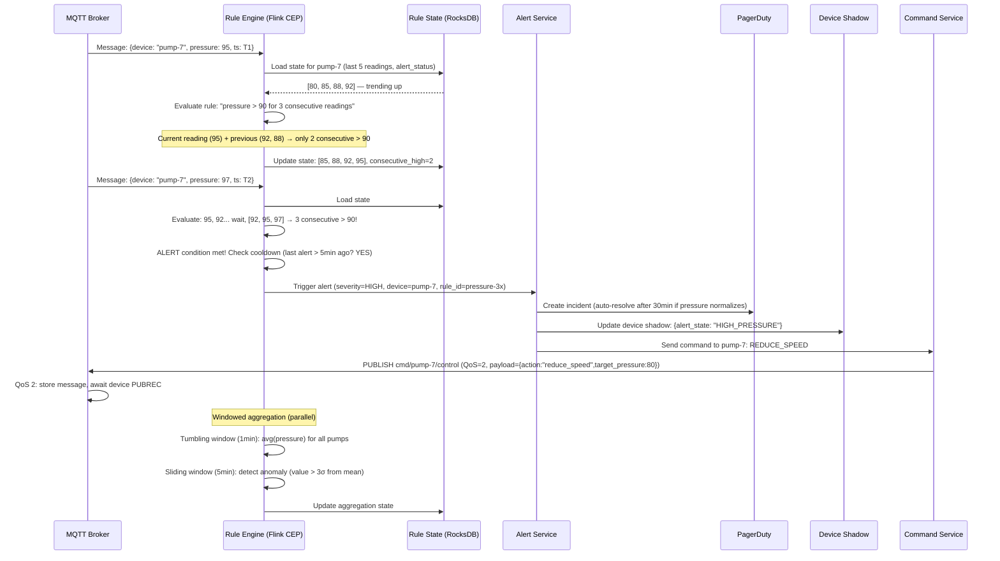

# Design: IoT Data Ingestion Platform

## 1. Functional Requirements

- **Device Management**: Provisioning, registration, firmware OTA updates, device twins
- **High-Volume Telemetry Ingestion**: Support MQTT, CoAP, HTTP protocols
- **Device Authentication**: X.509 certificates, SAS tokens, TPM attestation
- **Message Routing**: Rules engine for routing messages to different backends
- **Edge Processing**: Local compute at edge nodes for filtering/aggregation
- **Digital Twin**: Virtual representation of physical devices with desired/reported state
- **Time-Series Storage**: Efficient storage for device telemetry
- **Anomaly Alerting**: Real-time detection of anomalous device behavior
- **Batch + Stream Processing**: Unified processing for real-time and historical analytics
- **Device Groups & Hierarchies**: Logical grouping, fleet management, bulk operations

## 2. Non-Functional Requirements

| Requirement | Target |
|---|---|
| Connected Devices | 10M concurrent connections |
| Message Ingestion | 5M messages/second |
| Message Latency (cloud) | < 500ms end-to-end (device → storage) |
| Message Latency (edge) | < 50ms for local decisions |
| Device Connection Time | < 2s MQTT connect + auth |
| Availability | 99.99% for ingestion path |
| Message Durability | Zero message loss (QoS 1/2) |
| Storage Retention | Raw: 90 days, Aggregated: 5 years |
| OTA Deployment | 1M devices within 24 hours |
| Rule Evaluation | < 100ms per message |

## 3. Capacity Estimation

```
Connected Devices: 10M simultaneously connected
Total Registered Devices: 50M
Messages/Second: 5M (average), 15M (peak)
Average Message Size: 200 bytes (telemetry), 1 KB (events)
Daily Data Volume: 5M × 200B × 86400 = ~86 TB/day
Monthly Storage: ~2.6 PB (raw) → ~260 TB (compressed 10:1)

MQTT Broker Cluster:
  - Connections per node: 500K (with connection multiplexing)
  - Nodes needed: 20+ (for 10M connections)
  - Memory per connection: ~10 KB (session state)
  - Total memory: 10M × 10 KB = 100 GB

Network:
  - Ingress: 5M × 200B = 1 GB/s sustained
  - Peak: 3 GB/s
  - TLS overhead: +40% → 4.2 GB/s peak

Compute:
  - MQTT brokers: 25 nodes
  - Rules engine: 50 nodes
  - Stream processing: 100 nodes
  - Edge nodes: 10,000 (distributed)
  - Time-series DB: 50 nodes
```

## 4. Data Modeling

### Entity-Relationship Diagram



### Device Registry Schema
```sql
CREATE TABLE devices (
    device_id           VARCHAR(255) PRIMARY KEY,
    tenant_id           UUID NOT NULL,
    -- Identity
    device_name         VARCHAR(255),
    device_type         VARCHAR(100) NOT NULL,  -- 'sensor','gateway','actuator'
    model               VARCHAR(255),
    manufacturer        VARCHAR(255),
    firmware_version    VARCHAR(50),
    hardware_version    VARCHAR(50),
    -- Authentication
    auth_type           VARCHAR(50) NOT NULL,  -- 'x509','sas_token','symmetric_key'
    certificate_thumbprint VARCHAR(128),
    primary_key_hash    VARCHAR(128),
    secondary_key_hash  VARCHAR(128),
    -- Connectivity
    protocol            VARCHAR(20) DEFAULT 'mqtt',  -- 'mqtt','coap','http','amqp'
    connection_status   VARCHAR(20) DEFAULT 'disconnected',
    last_connected_at   TIMESTAMP,
    last_activity_at    TIMESTAMP,
    ip_address          INET,
    edge_node_id        VARCHAR(255),
    -- Grouping
    device_group_ids    UUID[],
    tags                JSONB DEFAULT '{}',
    location            JSONB,  -- {"lat":40.7128,"lng":-74.0060,"floor":3,"zone":"A"}
    -- State
    status              VARCHAR(50) DEFAULT 'enabled',  -- 'enabled','disabled','blocked','provisioning'
    -- Metadata
    properties          JSONB DEFAULT '{}',
    created_at          TIMESTAMP DEFAULT NOW(),
    updated_at          TIMESTAMP DEFAULT NOW(),
    provisioned_at      TIMESTAMP
);

CREATE INDEX idx_devices_tenant ON devices(tenant_id, status);
CREATE INDEX idx_devices_type ON devices(device_type, tenant_id);
CREATE INDEX idx_devices_group ON devices USING GIN(device_group_ids);
CREATE INDEX idx_devices_connection ON devices(connection_status, last_activity_at);
CREATE INDEX idx_devices_edge ON devices(edge_node_id);
CREATE INDEX idx_devices_tags ON devices USING GIN(tags);
```

### Digital Twin Schema
```sql
CREATE TABLE device_twins (
    device_id           VARCHAR(255) PRIMARY KEY REFERENCES devices(device_id),
    -- Desired state (set by backend/operator)
    desired_properties  JSONB DEFAULT '{}',
    desired_version     BIGINT DEFAULT 0,
    desired_updated_at  TIMESTAMP,
    desired_updated_by  VARCHAR(255),
    /*
    desired_properties example:
    {
      "telemetryInterval": 60,
      "firmwareVersion": "2.1.0",
      "thresholds": {"temperature": {"min": -10, "max": 85}},
      "features": {"gps": true, "bluetooth": false}
    }
    */
    -- Reported state (set by device)
    reported_properties JSONB DEFAULT '{}',
    reported_version    BIGINT DEFAULT 0,
    reported_updated_at TIMESTAMP,
    /*
    reported_properties example:
    {
      "telemetryInterval": 60,
      "firmwareVersion": "2.0.5",
      "batteryLevel": 87,
      "signalStrength": -65,
      "freeMemory": 32768
    }
    */
    -- Tags (set by backend for grouping/querying)
    tags                JSONB DEFAULT '{}',
    -- Sync status
    sync_status         VARCHAR(20) DEFAULT 'synced',  -- 'synced','pending','conflict'
    last_sync_at        TIMESTAMP,
    -- Version for optimistic concurrency
    etag                VARCHAR(64) NOT NULL DEFAULT gen_random_uuid()::text
);

CREATE INDEX idx_twin_desired ON device_twins USING GIN(desired_properties);
CREATE INDEX idx_twin_reported ON device_twins USING GIN(reported_properties);
CREATE INDEX idx_twin_tags ON device_twins USING GIN(tags);
```

### Telemetry Data Schema (Time-Series)
```sql
-- TimescaleDB hypertable or InfluxDB measurement
CREATE TABLE device_telemetry (
    device_id           VARCHAR(255) NOT NULL,
    timestamp           TIMESTAMPTZ NOT NULL,
    -- Telemetry payload
    metric_name         VARCHAR(128) NOT NULL,
    value_numeric       DOUBLE PRECISION,
    value_string        VARCHAR(1024),
    value_boolean       BOOLEAN,
    value_json          JSONB,
    -- Context
    quality             SMALLINT DEFAULT 100,  -- 0-100 signal quality
    unit                VARCHAR(20),
    source              VARCHAR(50),  -- 'device','edge','computed'
    -- Partitioning
    tenant_id           UUID NOT NULL,
    device_type         VARCHAR(100),
    PRIMARY KEY (device_id, timestamp, metric_name)
);

-- TimescaleDB: convert to hypertable
SELECT create_hypertable('device_telemetry', 'timestamp',
    chunk_time_interval => INTERVAL '1 day',
    partitioning_column => 'device_id',
    number_partitions => 32
);

CREATE INDEX idx_telemetry_device_time ON device_telemetry(device_id, timestamp DESC);
CREATE INDEX idx_telemetry_metric ON device_telemetry(metric_name, timestamp DESC);
CREATE INDEX idx_telemetry_tenant ON device_telemetry(tenant_id, timestamp DESC);

-- Continuous aggregate (auto-downsampling)
CREATE MATERIALIZED VIEW telemetry_hourly
WITH (timescaledb.continuous) AS
SELECT
    device_id,
    metric_name,
    time_bucket('1 hour', timestamp) AS bucket,
    AVG(value_numeric) AS avg_value,
    MIN(value_numeric) AS min_value,
    MAX(value_numeric) AS max_value,
    COUNT(*) AS sample_count
FROM device_telemetry
GROUP BY device_id, metric_name, bucket;
```

### Routing Rules Schema
```sql
CREATE TABLE routing_rules (
    rule_id             UUID PRIMARY KEY,
    tenant_id           UUID NOT NULL,
    name                VARCHAR(255) NOT NULL,
    priority            INT DEFAULT 100,  -- Lower = higher priority
    -- Condition (SQL-like WHERE clause over message)
    condition_sql       TEXT NOT NULL,
    /*
    Examples:
    "device_type = 'temperature_sensor' AND payload.temperature > 85"
    "message_type = 'alert' AND payload.severity = 'critical'"
    "$body.battery_level < 20"
    "device_id IN (SELECT device_id FROM device_groups WHERE group_name = 'factory-a')"
    */
    -- Action
    action_type         VARCHAR(50) NOT NULL,
    -- 'route_to_topic','invoke_function','store_tsdb','send_alert','update_twin'
    action_config       JSONB NOT NULL,
    /*
    route_to_topic: {"topic":"alerts.critical","partition_key":"device_id"}
    invoke_function: {"function_url":"https://func.azure.com/process","timeout_ms":5000}
    send_alert: {"channel":"pagerduty","severity":"critical","template":"..."}
    update_twin: {"path":"$.reported.lastAlert","value":"{{timestamp}}"}
    */
    -- Status
    enabled             BOOLEAN DEFAULT TRUE,
    evaluation_count    BIGINT DEFAULT 0,
    match_count         BIGINT DEFAULT 0,
    last_matched_at     TIMESTAMP,
    created_at          TIMESTAMP DEFAULT NOW()
);

CREATE INDEX idx_rules_tenant ON routing_rules(tenant_id, enabled, priority);
```

### OTA Firmware Schema
```sql
CREATE TABLE firmware_updates (
    update_id           UUID PRIMARY KEY,
    tenant_id           UUID NOT NULL,
    -- Target
    target_device_type  VARCHAR(100),
    target_group_ids    UUID[],
    target_query        TEXT,  -- SQL query to select devices
    -- Firmware
    firmware_version    VARCHAR(50) NOT NULL,
    firmware_url        VARCHAR(2048) NOT NULL,
    firmware_checksum   VARCHAR(128) NOT NULL,  -- SHA-256
    firmware_size_bytes BIGINT NOT NULL,
    -- Rollout
    rollout_strategy    VARCHAR(50) DEFAULT 'phased',  -- 'immediate','phased','canary'
    rollout_percentage  INT DEFAULT 100,
    rollout_batch_size  INT DEFAULT 1000,
    rollout_interval_min INT DEFAULT 60,
    max_failure_pct     FLOAT DEFAULT 5.0,  -- Auto-pause if >5% fail
    -- Status
    status              VARCHAR(50) DEFAULT 'pending',
    total_devices       INT,
    devices_updated     INT DEFAULT 0,
    devices_failed      INT DEFAULT 0,
    devices_pending     INT DEFAULT 0,
    started_at          TIMESTAMP,
    completed_at        TIMESTAMP,
    created_at          TIMESTAMP DEFAULT NOW()
);

CREATE TABLE firmware_device_status (
    update_id           UUID NOT NULL REFERENCES firmware_updates(update_id),
    device_id           VARCHAR(255) NOT NULL,
    status              VARCHAR(50) NOT NULL,  -- 'pending','downloading','installing','success','failed','rolled_back'
    progress_pct        INT DEFAULT 0,
    error_message       TEXT,
    started_at          TIMESTAMP,
    completed_at        TIMESTAMP,
    attempts            INT DEFAULT 0,
    PRIMARY KEY (update_id, device_id)
);

CREATE INDEX idx_fw_status ON firmware_device_status(update_id, status);
```

## 5. High-Level Design (HLD)

```
┌─────────────────────────────────────────────────────────────────────────────────┐
│                          IoT DATA INGESTION PLATFORM                              │
├─────────────────────────────────────────────────────────────────────────────────┤
│                                                                                   │
│  DEVICES                    EDGE LAYER                   CLOUD LAYER             │
│  ┌─────────┐              ┌──────────────┐                                      │
│  │Sensors  │──MQTT/CoAP──▶│  EDGE NODE   │                                      │
│  │Actuators│              │              │                                      │
│  │Gateways │              │ • Local rules│                                      │
│  └─────────┘              │ • Aggregation│                                      │
│                           │ • Store &    │                                      │
│                           │   forward    │─────────────┐                        │
│                           │ • ML inference│             │                        │
│                           └──────────────┘             │                        │
│                                                        ▼                        │
│  ┌─────────────────────────────────────────────────────────────────────┐        │
│  │                    PROTOCOL GATEWAY                                   │        │
│  │  ┌──────────┐  ┌──────────┐  ┌──────────┐  ┌──────────┐           │        │
│  │  │ MQTT     │  │ CoAP     │  │ HTTP     │  │ WebSocket│           │        │
│  │  │ Broker   │  │ Gateway  │  │ Gateway  │  │ Bridge   │           │        │
│  │  │ Cluster  │  │          │  │          │  │          │           │        │
│  │  └──────────┘  └──────────┘  └──────────┘  └──────────┘           │        │
│  │       │                                                             │        │
│  │  Auth (X.509/SAS) │ Rate Limit │ Protocol Normalize │ Session Mgmt │        │
│  └────────────────────────────────┬────────────────────────────────────┘        │
│                                   │                                              │
│                                   ▼                                              │
│  ┌─────────────────────────────────────────────────────────────────────┐        │
│  │                    KAFKA (Message Bus)                                │        │
│  │  telemetry.raw │ events │ commands │ twin-updates │ alerts           │        │
│  └────────────────────────────────┬────────────────────────────────────┘        │
│                                   │                                              │
│          ┌────────────────────────┼────────────────────────────┐                │
│          ▼                        ▼                            ▼                │
│  ┌──────────────────┐  ┌──────────────────┐  ┌──────────────────────┐          │
│  │  RULES ENGINE    │  │  STREAM          │  │  DEVICE              │          │
│  │  (CEP)           │  │  PROCESSING      │  │  MANAGEMENT          │          │
│  │                  │  │  (Flink)         │  │                      │          │
│  │  SQL-like rules  │  │                  │  │  Twin sync           │          │
│  │  Pattern matching│  │  Aggregation     │  │  OTA orchestration   │          │
│  │  Alerting        │  │  Anomaly detect  │  │  Provisioning        │          │
│  │  Routing         │  │  Enrichment      │  │  Lifecycle mgmt      │          │
│  └────────┬─────────┘  └────────┬─────────┘  └──────────────────────┘          │
│           │                      │                                              │
│           ▼                      ▼                                              │
│  ┌─────────────────────────────────────────────────────────────────────┐        │
│  │                    STORAGE LAYER                                      │        │
│  │  ┌──────────────┐  ┌──────────────┐  ┌──────────────┐              │        │
│  │  │ Time-Series  │  │  Data Lake   │  │  Device      │              │        │
│  │  │ DB (hot)     │  │  (cold/batch)│  │  State DB    │              │        │
│  │  │ TimescaleDB  │  │  S3 + Delta  │  │  (PostgreSQL)│              │        │
│  │  └──────────────┘  └──────────────┘  └──────────────┘              │        │
│  └─────────────────────────────────────────────────────────────────────┘        │
│                                                                                   │
│  ┌──────────────────────────┐  ┌──────────────────────────────────────┐         │
│  │  API LAYER               │  │  MONITORING & OPERATIONS             │         │
│  │  Device CRUD             │  │  Fleet health │ Connectivity         │         │
│  │  Twin read/write         │  │  Message rates │ Error rates          │         │
│  │  Telemetry query         │  │  OTA progress │ Anomaly detection    │         │
│  │  Command dispatch        │  │                                      │         │
│  └──────────────────────────┘  └──────────────────────────────────────┘         │
│                                                                                   │
└─────────────────────────────────────────────────────────────────────────────────┘
```

## 6. Low-Level Design (LLD) - APIs

### Device Provisioning API
```python
# POST /api/v1/devices
{
    "device_id": "factory-a-sensor-001",
    "device_type": "temperature_sensor",
    "model": "TempPro-3000",
    "manufacturer": "SensorCorp",
    "auth_type": "x509",
    "certificate_pem": "-----BEGIN CERTIFICATE-----\nMIIC...\n-----END CERTIFICATE-----",
    "protocol": "mqtt",
    "tags": {
        "location": "factory-a",
        "floor": "2",
        "zone": "production-line-3"
    },
    "desired_properties": {
        "telemetryInterval": 30,
        "thresholds": {
            "temperature": {"min": -10, "max": 85, "alert": 70}
        }
    }
}

# Response 201
{
    "device_id": "factory-a-sensor-001",
    "status": "provisioning",
    "connection_string": "mqtts://iot-broker.example.com:8883",
    "credentials": {
        "client_id": "factory-a-sensor-001",
        "username": "factory-a-sensor-001",
        "ca_cert_url": "https://certs.example.com/ca.pem"
    },
    "twin": {
        "desired": {"telemetryInterval": 30, "thresholds": {...}},
        "reported": {}
    }
}
```

### Telemetry Ingestion (MQTT)
```python
# MQTT PUBLISH to topic: devices/{device_id}/telemetry
# QoS: 1 (at-least-once)
# Payload (JSON):
{
    "timestamp": "2024-01-15T10:00:00.000Z",
    "metrics": {
        "temperature": {"value": 72.5, "unit": "fahrenheit"},
        "humidity": {"value": 45.2, "unit": "percent"},
        "pressure": {"value": 1013.25, "unit": "hPa"},
        "battery": {"value": 87, "unit": "percent"}
    },
    "location": {"lat": 40.7128, "lng": -74.006},
    "quality": 98
}

# MQTT SUBSCRIBE to topic: devices/{device_id}/commands
# Device receives:
{
    "command_id": "cmd-abc123",
    "command": "set_interval",
    "payload": {"interval_seconds": 15},
    "respond_to": "devices/{device_id}/commands/response"
}

# Device responds:
# PUBLISH to: devices/{device_id}/commands/response
{
    "command_id": "cmd-abc123",
    "status": "success",
    "result": {"previous_interval": 30, "new_interval": 15}
}
```

### Digital Twin API
```python
# PATCH /api/v1/devices/{device_id}/twin/desired
{
    "telemetryInterval": 15,
    "thresholds": {
        "temperature": {"alert": 65}
    }
}

# Response 200
{
    "device_id": "factory-a-sensor-001",
    "desired": {
        "telemetryInterval": 15,
        "thresholds": {"temperature": {"min": -10, "max": 85, "alert": 65}},
        "$version": 5
    },
    "reported": {
        "telemetryInterval": 30,  # Not yet synced
        "firmwareVersion": "2.0.5",
        "batteryLevel": 87,
        "$version": 12
    },
    "sync_status": "pending",
    "etag": "\"a1b2c3d4\""
}

# GET /api/v1/devices/query
# Query devices by twin properties
{
    "query": "SELECT device_id, reported.batteryLevel FROM devices WHERE reported.batteryLevel < 20 AND tags.location = 'factory-a'",
    "page_size": 100
}

# Response 200
{
    "results": [
        {"device_id": "factory-a-sensor-042", "batteryLevel": 12},
        {"device_id": "factory-a-sensor-089", "batteryLevel": 8}
    ],
    "continuation_token": "eyJ...",
    "total_count": 15
}
```

### Rules Engine API
```python
# POST /api/v1/rules
{
    "name": "High Temperature Alert",
    "condition_sql": "payload.metrics.temperature.value > device_twin.desired.thresholds.temperature.alert",
    "actions": [
        {
            "type": "send_alert",
            "config": {
                "severity": "warning",
                "channel": "slack:#factory-alerts",
                "template": "Device {{device_id}} temperature {{payload.metrics.temperature.value}}°F exceeds threshold {{threshold}}°F"
            }
        },
        {
            "type": "route_to_topic",
            "config": {
                "topic": "alerts.temperature",
                "enrich_with": ["device_twin", "device_metadata"]
            }
        },
        {
            "type": "invoke_command",
            "config": {
                "target_device": "{{device_id}}",
                "command": "activate_cooling",
                "payload": {"mode": "high"}
            }
        }
    ],
    "enabled": true,
    "priority": 10
}
```

### OTA Firmware Update API
```python
# POST /api/v1/firmware/deployments
{
    "firmware_version": "2.1.0",
    "firmware_url": "https://storage.example.com/firmware/temppro3000-v2.1.0.bin",
    "firmware_checksum": "sha256:abc123def456...",
    "firmware_size_bytes": 2097152,
    "target": {
        "device_type": "temperature_sensor",
        "query": "reported.firmwareVersion = '2.0.5' AND tags.location = 'factory-a'"
    },
    "rollout": {
        "strategy": "canary",
        "phases": [
            {"percentage": 1, "duration_hours": 2, "success_threshold": 99},
            {"percentage": 10, "duration_hours": 6, "success_threshold": 98},
            {"percentage": 50, "duration_hours": 12, "success_threshold": 97},
            {"percentage": 100, "duration_hours": 24, "success_threshold": 95}
        ],
        "auto_rollback": true,
        "max_concurrent_downloads": 1000
    }
}

# Response 202
{
    "deployment_id": "fw-deploy-xyz789",
    "status": "in_progress",
    "total_devices": 5000,
    "current_phase": 1,
    "progress": {
        "phase_1": {"target": 50, "success": 48, "failed": 0, "pending": 2}
    }
}
```

## 7. Deep Dives

### Deep Dive 1: MQTT Broker Cluster

```
┌─────────────────────────────────────────────────────────────────────────┐
│                    MQTT BROKER CLUSTER ARCHITECTURE                       │
├─────────────────────────────────────────────────────────────────────────┤
│                                                                           │
│  Devices                  Load Balancer              MQTT Nodes           │
│  ┌──────┐               ┌─────────────┐            ┌──────────┐        │
│  │Dev-1 │──TLS/MQTT────▶│             │───────────▶│ Broker-1 │        │
│  │Dev-2 │──TLS/MQTT────▶│   L4 LB     │───────────▶│ Broker-2 │        │
│  │ ...  │               │  (sticky    │───────────▶│ Broker-3 │        │
│  │Dev-N │──TLS/MQTT────▶│   sessions) │───────────▶│  ...     │        │
│  └──────┘               └─────────────┘            │ Broker-20│        │
│                                                     └──────────┘        │
│                                                                           │
│  SHARED SUBSCRIPTIONS (Load Distribution):                               │
│  ┌─────────────────────────────────────────────────────┐                │
│  │  Topic: $share/ingestion-group/devices/+/telemetry   │                │
│  │                                                      │                │
│  │  Device publishes to: devices/sensor-001/telemetry  │                │
│  │  Message distributed to ONE consumer in the group    │                │
│  │  (round-robin across processing workers)             │                │
│  │                                                      │                │
│  │  Benefit: Horizontal scaling of message processing   │                │
│  │  without each consumer getting all messages          │                │
│  └─────────────────────────────────────────────────────┘                │
│                                                                           │
│  QoS HANDLING:                                                           │
│  ┌─────────────────────────────────────────────────────┐                │
│  │  QoS 0: Fire & forget (best effort)                  │                │
│  │    → No ack, no retry. For high-frequency telemetry  │                │
│  │                                                      │                │
│  │  QoS 1: At-least-once delivery                       │                │
│  │    → PUBACK required. Broker persists until acked.   │                │
│  │    → May duplicate on network issues → dedup at sink │                │
│  │                                                      │                │
│  │  QoS 2: Exactly-once delivery (4-step handshake)     │                │
│  │    → PUBREC → PUBREL → PUBCOMP                       │                │
│  │    → Expensive. Used for commands/config only.        │                │
│  └─────────────────────────────────────────────────────┘                │
│                                                                           │
│  SESSION PERSISTENCE (for disconnected devices):                         │
│  ┌─────────────────────────────────────────────────────┐                │
│  │  Clean Session = false:                               │                │
│  │  • Broker stores: subscriptions + pending QoS1/2 msgs│                │
│  │  • On reconnect: deliver buffered messages           │                │
│  │  • Session stored in Redis (shared across cluster)   │                │
│  │  • Expiry: configurable (default 24h)                │                │
│  │                                                      │                │
│  │  Storage: Redis Streams per device                    │                │
│  │  Key: mqtt:session:{device_id}                       │                │
│  │  Max buffered: 1000 messages per device              │                │
│  └─────────────────────────────────────────────────────┘                │
│                                                                           │
└─────────────────────────────────────────────────────────────────────────┘
```

```python
class MQTTBrokerNode:
    """
    MQTT v5 broker node with cluster support.
    Handles authentication, session management, and message routing.
    """
    
    def __init__(self, config, redis_client, kafka_producer, auth_service):
        self.config = config
        self.redis = redis_client
        self.kafka = kafka_producer
        self.auth = auth_service
        self.connections = {}  # client_id -> Connection
        self.subscriptions = {}  # topic_filter -> set of client_ids
        self.node_id = config['node_id']
    
    async def handle_connect(self, client_socket, connect_packet):
        """Handle MQTT CONNECT packet with authentication."""
        client_id = connect_packet.client_id
        
        # Authenticate
        auth_result = await self.auth.authenticate(
            client_id=client_id,
            username=connect_packet.username,
            password=connect_packet.password,
            cert=client_socket.getpeercert()
        )
        
        if not auth_result.success:
            await self._send_connack(client_socket, reason_code=0x86)  # Not authorized
            return
        
        # Handle session
        clean_start = connect_packet.clean_start
        session = None
        
        if not clean_start:
            # Restore persistent session
            session = await self._restore_session(client_id)
        
        if session is None:
            session = MQTTSession(client_id=client_id)
        
        # Register connection
        self.connections[client_id] = Connection(
            socket=client_socket,
            session=session,
            auth=auth_result,
            connected_at=time.time()
        )
        
        # Update device registry
        await self.kafka.send('device-events', key=client_id, value={
            'event': 'connected',
            'device_id': client_id,
            'node_id': self.node_id,
            'timestamp': datetime.utcnow().isoformat(),
            'ip': client_socket.getpeername()[0]
        })
        
        # Send CONNACK
        await self._send_connack(client_socket, reason_code=0x00, session_present=session.restored)
        
        # Deliver buffered messages (QoS 1/2 pending)
        if session.restored and session.pending_messages:
            for msg in session.pending_messages:
                await self._deliver_message(client_id, msg)
    
    async def handle_publish(self, client_id: str, publish_packet):
        """Handle incoming PUBLISH from device."""
        topic = publish_packet.topic
        payload = publish_packet.payload
        qos = publish_packet.qos
        
        # Authorization check
        conn = self.connections[client_id]
        if not self.auth.can_publish(conn.auth, topic):
            return  # Silently drop (MQTT spec)
        
        # QoS 1: Send PUBACK
        if qos == 1:
            await self._send_puback(client_id, publish_packet.packet_id)
        
        # QoS 2: Send PUBREC (start 4-step handshake)
        elif qos == 2:
            await self._send_pubrec(client_id, publish_packet.packet_id)
            # Store packet ID to prevent redelivery
            await self.redis.sadd(f"mqtt:qos2:{client_id}", publish_packet.packet_id)
        
        # Route message to Kafka for processing
        kafka_topic = self._route_to_kafka_topic(topic)
        await self.kafka.send(kafka_topic, key=client_id, value={
            'device_id': client_id,
            'mqtt_topic': topic,
            'payload': payload,
            'qos': qos,
            'timestamp': datetime.utcnow().isoformat(),
            'properties': publish_packet.properties
        })
        
        # Forward to local subscribers (if any on this node)
        matching_clients = self._match_subscribers(topic)
        for subscriber_id in matching_clients:
            if subscriber_id in self.connections:
                await self._deliver_message(subscriber_id, publish_packet)
    
    async def handle_disconnect(self, client_id: str, graceful: bool):
        """Handle device disconnection."""
        conn = self.connections.pop(client_id, None)
        if not conn:
            return
        
        # Persist session if clean_start was false
        if not conn.session.clean_start:
            await self._persist_session(client_id, conn.session)
        
        # Handle will message (if ungraceful disconnect)
        if not graceful and conn.session.will_message:
            await self.handle_publish(client_id, conn.session.will_message)
        
        # Update device status
        await self.kafka.send('device-events', key=client_id, value={
            'event': 'disconnected',
            'device_id': client_id,
            'graceful': graceful,
            'session_persisted': not conn.session.clean_start,
            'timestamp': datetime.utcnow().isoformat()
        })
    
    async def _persist_session(self, client_id: str, session):
        """Store session in Redis for cross-node recovery."""
        session_data = {
            'subscriptions': list(session.subscriptions),
            'pending_messages': [msg.serialize() for msg in session.pending_messages[-1000:]],
            'node_id': self.node_id,
            'disconnected_at': time.time()
        }
        await self.redis.set(
            f"mqtt:session:{client_id}",
            json.dumps(session_data),
            ex=self.config.get('session_expiry_seconds', 86400)
        )
```

### Deep Dive 2: Edge-Cloud Architecture

```
┌─────────────────────────────────────────────────────────────────────────┐
│                    EDGE-CLOUD ARCHITECTURE                                │
├─────────────────────────────────────────────────────────────────────────┤
│                                                                           │
│  ┌───────────────────────────────────────────────────────┐              │
│  │                    EDGE NODE                           │              │
│  │                                                       │              │
│  │  ┌───────────┐  ┌───────────┐  ┌───────────┐        │              │
│  │  │ Local     │  │ Rules     │  │ ML        │        │              │
│  │  │ MQTT      │  │ Engine    │  │ Inference │        │              │
│  │  │ Broker    │  │ (subset)  │  │ (TFLite)  │        │              │
│  │  └─────┬─────┘  └─────┬─────┘  └─────┬─────┘        │              │
│  │        │               │               │              │              │
│  │        ▼               ▼               ▼              │              │
│  │  ┌─────────────────────────────────────────────┐     │              │
│  │  │            LOCAL PROCESSING                  │     │              │
│  │  │  • Filter: drop noise/duplicates             │     │              │
│  │  │  • Aggregate: 1s → 1min summaries           │     │              │
│  │  │  • Detect: local anomaly detection           │     │              │
│  │  │  • Act: immediate actuator commands          │     │              │
│  │  └─────────────────────┬───────────────────────┘     │              │
│  │                        │                              │              │
│  │  ┌─────────────────────▼───────────────────────┐     │              │
│  │  │         STORE & FORWARD BUFFER               │     │              │
│  │  │  • SQLite/RocksDB local storage              │     │              │
│  │  │  • Buffer during connectivity loss           │     │              │
│  │  │  • Prioritize: alerts > telemetry > logs     │     │              │
│  │  │  • Max buffer: 1 GB (then drop oldest)       │     │              │
│  │  │  • Resume sync on reconnect                  │     │              │
│  │  └─────────────────────┬───────────────────────┘     │              │
│  │                        │                              │              │
│  └────────────────────────┼──────────────────────────────┘              │
│                           │                                              │
│               ┌───────────┼───────────┐                                 │
│               │  SELECTIVE SYNC       │                                 │
│               │  • Aggregated → always│                                 │
│               │  • Raw → configurable │                                 │
│               │  • Alerts → immediate │                                 │
│               │  • Batch upload (off-peak)│                             │
│               └───────────┬───────────┘                                 │
│                           │                                              │
│                           ▼                                              │
│               ┌───────────────────────┐                                 │
│               │       CLOUD           │                                 │
│               └───────────────────────┘                                 │
│                                                                           │
└─────────────────────────────────────────────────────────────────────────┘
```

```python
class EdgeNode:
    """
    Edge computing node: local processing, store-and-forward, selective sync.
    Operates autonomously during connectivity loss.
    """
    
    def __init__(self, config, local_db, cloud_client):
        self.config = config
        self.db = local_db  # RocksDB
        self.cloud = cloud_client
        self.is_connected = False
        self.buffer_size = 0
        self.max_buffer_bytes = config.get('max_buffer_bytes', 1_073_741_824)  # 1 GB
        self.aggregation_window = config.get('aggregation_window_seconds', 60)
        self.aggregation_buffer = {}  # device_id -> {metric -> values[]}
    
    async def process_device_message(self, device_id: str, message: dict):
        """Process incoming message from local device."""
        # 1. Local rules evaluation (immediate action)
        actions = await self.evaluate_local_rules(device_id, message)
        for action in actions:
            await self.execute_action(action)
        
        # 2. Aggregate for cloud sync
        self._add_to_aggregation(device_id, message)
        
        # 3. Store raw (if configured and space available)
        if self.config.get('store_raw', True):
            await self._buffer_for_cloud(device_id, message, priority='normal')
        
        # 4. If alert condition, send immediately
        if self._is_alert(message):
            await self._send_to_cloud_immediate(device_id, message)
    
    def _add_to_aggregation(self, device_id: str, message: dict):
        """Add to local aggregation buffer."""
        if device_id not in self.aggregation_buffer:
            self.aggregation_buffer[device_id] = {}
        
        for metric_name, metric_data in message.get('metrics', {}).items():
            if metric_name not in self.aggregation_buffer[device_id]:
                self.aggregation_buffer[device_id][metric_name] = []
            self.aggregation_buffer[device_id][metric_name].append(metric_data['value'])
    
    async def flush_aggregations(self):
        """Periodically flush aggregated data to cloud (every aggregation_window)."""
        aggregated_messages = []
        
        for device_id, metrics in self.aggregation_buffer.items():
            agg_msg = {
                'device_id': device_id,
                'timestamp': datetime.utcnow().isoformat(),
                'window_seconds': self.aggregation_window,
                'aggregated_metrics': {}
            }
            
            for metric_name, values in metrics.items():
                agg_msg['aggregated_metrics'][metric_name] = {
                    'count': len(values),
                    'min': min(values),
                    'max': max(values),
                    'avg': sum(values) / len(values),
                    'sum': sum(values),
                    'last': values[-1]
                }
            
            aggregated_messages.append(agg_msg)
        
        # Clear buffer
        self.aggregation_buffer = {}
        
        # Send to cloud (or buffer if disconnected)
        if self.is_connected:
            await self.cloud.send_batch('telemetry.aggregated', aggregated_messages)
        else:
            for msg in aggregated_messages:
                await self._buffer_for_cloud(msg['device_id'], msg, priority='high')
    
    async def _buffer_for_cloud(self, device_id: str, message: dict, priority: str):
        """Store in local buffer for later cloud sync."""
        if self.buffer_size >= self.max_buffer_bytes:
            # Drop oldest low-priority messages
            await self._evict_oldest('normal')
        
        key = f"{priority}:{int(time.time()*1000)}:{device_id}"
        value = json.dumps(message).encode()
        self.db.put(key.encode(), value)
        self.buffer_size += len(value)
    
    async def sync_to_cloud(self):
        """Resume cloud sync when connectivity restored. Priority-ordered."""
        priorities = ['critical', 'high', 'normal']
        
        for priority in priorities:
            prefix = f"{priority}:".encode()
            batch = []
            keys_to_delete = []
            
            for key, value in self.db.iter(prefix=prefix):
                batch.append(json.loads(value))
                keys_to_delete.append(key)
                
                if len(batch) >= 1000:
                    try:
                        await self.cloud.send_batch('telemetry.edge-sync', batch)
                        for k in keys_to_delete:
                            self.db.delete(k)
                            self.buffer_size -= len(self.db.get(k) or b'')
                        batch = []
                        keys_to_delete = []
                    except ConnectionError:
                        self.is_connected = False
                        return  # Will retry later
            
            # Flush remaining
            if batch:
                await self.cloud.send_batch('telemetry.edge-sync', batch)
                for k in keys_to_delete:
                    self.db.delete(k)
```

### Deep Dive 3: Rules Engine

```python
class IoTRulesEngine:
    """
    Event-driven rules engine for IoT message routing.
    Evaluates SQL-like conditions against streaming device messages.
    Supports stateful pattern matching (CEP).
    """
    
    def __init__(self, rule_store, action_executor, device_twin_cache):
        self.rules = {}  # rule_id -> compiled rule
        self.action_executor = action_executor
        self.twin_cache = device_twin_cache
        self.rule_metrics = {}
        self._load_rules(rule_store)
    
    def _load_rules(self, rule_store):
        """Load and compile all active rules."""
        raw_rules = rule_store.get_active_rules()
        for rule in sorted(raw_rules, key=lambda r: r['priority']):
            compiled = self._compile_rule(rule)
            self.rules[rule['rule_id']] = compiled
    
    def _compile_rule(self, rule: dict) -> 'CompiledRule':
        """
        Parse SQL-like condition into an executable predicate.
        Supports: comparisons, AND/OR, IN, LIKE, functions, twin references.
        """
        condition = rule['condition_sql']
        
        # Parse condition into AST
        ast = self._parse_condition(condition)
        
        # Compile to Python callable for fast evaluation
        evaluator = self._compile_ast(ast)
        
        return CompiledRule(
            rule_id=rule['rule_id'],
            name=rule['name'],
            evaluator=evaluator,
            actions=rule['actions'] if 'actions' in rule else [rule.get('action_config')],
            priority=rule['priority']
        )
    
    async def evaluate_message(self, device_id: str, message: dict) -> list:
        """
        Evaluate all rules against incoming message.
        Returns list of triggered actions.
        """
        triggered_actions = []
        
        # Build evaluation context
        context = {
            'device_id': device_id,
            'payload': message.get('payload', message),
            'device_type': message.get('device_type'),
            'timestamp': message.get('timestamp'),
            'device_twin': await self.twin_cache.get(device_id),
            'metadata': message.get('metadata', {})
        }
        
        for rule_id, compiled_rule in self.rules.items():
            try:
                # Evaluate condition
                matches = compiled_rule.evaluator(context)
                
                # Track metrics
                self.rule_metrics.setdefault(rule_id, {'evaluations': 0, 'matches': 0})
                self.rule_metrics[rule_id]['evaluations'] += 1
                
                if matches:
                    self.rule_metrics[rule_id]['matches'] += 1
                    
                    # Execute actions
                    for action in compiled_rule.actions:
                        resolved_action = self._resolve_templates(action, context)
                        triggered_actions.append(resolved_action)
                        
            except Exception as e:
                logging.error(f"Rule {rule_id} evaluation error: {e}")
                continue
        
        # Execute all triggered actions
        await self._execute_actions(triggered_actions, context)
        
        return triggered_actions
    
    async def _execute_actions(self, actions: list, context: dict):
        """Execute triggered actions in parallel."""
        tasks = []
        for action in actions:
            action_type = action['type']
            
            if action_type == 'send_alert':
                tasks.append(self.action_executor.send_alert(
                    severity=action['config']['severity'],
                    channel=action['config']['channel'],
                    message=action['config']['template'].format(**context)
                ))
            
            elif action_type == 'route_to_topic':
                tasks.append(self.action_executor.route_message(
                    topic=action['config']['topic'],
                    message=context['payload'],
                    key=context['device_id']
                ))
            
            elif action_type == 'invoke_command':
                tasks.append(self.action_executor.send_command(
                    device_id=action['config']['target_device'],
                    command=action['config']['command'],
                    payload=action['config']['payload']
                ))
            
            elif action_type == 'update_twin':
                tasks.append(self.action_executor.update_twin(
                    device_id=context['device_id'],
                    path=action['config']['path'],
                    value=action['config']['value']
                ))
        
        await asyncio.gather(*tasks, return_exceptions=True)
    
    def _resolve_templates(self, action: dict, context: dict) -> dict:
        """Replace {{variable}} templates in action config."""
        resolved = json.loads(json.dumps(action))  # Deep copy
        
        def replace_templates(obj):
            if isinstance(obj, str):
                import re
                def replacer(match):
                    path = match.group(1)
                    return str(self._resolve_path(context, path))
                return re.sub(r'\{\{(.+?)\}\}', replacer, obj)
            elif isinstance(obj, dict):
                return {k: replace_templates(v) for k, v in obj.items()}
            elif isinstance(obj, list):
                return [replace_templates(item) for item in obj]
            return obj
        
        return replace_templates(resolved)
```

## 8. Component Optimization

### Kafka Configuration
```yaml
kafka:
  brokers: "kafka-01:9092,kafka-02:9092,kafka-03:9092,kafka-04:9092,kafka-05:9092"
  
  topics:
    telemetry.raw:
      partitions: 512  # High parallelism for 5M msgs/s
      replication_factor: 2
      retention_ms: 86400000  # 24h
      compression_type: "lz4"
      segment_bytes: 1073741824  # 1 GB
      max_message_bytes: 1048576
    
    device-events:
      partitions: 64
      replication_factor: 3
      retention_ms: 604800000  # 7 days
      cleanup_policy: "compact,delete"
    
    commands:
      partitions: 128
      replication_factor: 3
      retention_ms: 3600000  # 1h (commands expire)
    
    alerts:
      partitions: 32
      replication_factor: 3
      retention_ms: 2592000000  # 30 days
  
  producer:
    acks: 1  # Single ack for telemetry (latency)
    batch_size: 262144  # 256 KB
    linger_ms: 20
    compression_type: "lz4"
```

### Redis Configuration
```yaml
redis:
  cluster:
    nodes: ["redis-01:6379", "redis-02:6379", "redis-03:6379"]
    replicas: 1
  
  caches:
    mqtt_sessions:
      prefix: "mqtt:session:"
      ttl: 86400  # 24h session persistence
      max_memory: "32gb"
      eviction_policy: "volatile-lru"
    
    device_twin_cache:
      prefix: "twin:"
      ttl: 300  # 5 min
      max_memory: "16gb"
      eviction_policy: "allkeys-lru"
    
    device_connection_map:
      prefix: "conn:"
      ttl: 0  # Managed explicitly
      max_memory: "4gb"
    
    rate_limit:
      prefix: "rl:"
      ttl: 60
      max_memory: "2gb"
```

### Flink Configuration
```yaml
flink:
  job_manager:
    heap_size: "8g"
  
  task_manager:
    heap_size: "16g"
    num_task_slots: 8
  
  checkpointing:
    interval: 30000
    mode: "EXACTLY_ONCE"
    timeout: 120000
    storage: "s3://iot-checkpoints/flink/"
  
  jobs:
    telemetry_processing:
      parallelism: 128
      watermark_strategy: "bounded_out_of_orderness(5s)"
    
    anomaly_detection:
      parallelism: 32
      state_ttl: "24h"
    
    aggregation:
      parallelism: 64
      window_size: "1m"
      allowed_lateness: "30s"
```

## 9. Observability

```yaml
monitoring:
  metrics:
    - name: "iot_connected_devices"
      type: gauge
      labels: [protocol, device_type, region]
    - name: "iot_messages_ingested_total"
      type: counter
      labels: [protocol, device_type, qos]
    - name: "iot_message_latency_ms"
      type: histogram
      labels: [protocol, processing_stage]
      buckets: [10, 50, 100, 250, 500, 1000, 2500]
    - name: "iot_auth_attempts_total"
      type: counter
      labels: [auth_type, result]
    - name: "iot_rules_evaluated_total"
      type: counter
      labels: [rule_id, result]
    - name: "iot_edge_buffer_bytes"
      type: gauge
      labels: [edge_node_id]
    - name: "iot_edge_connectivity"
      type: gauge
      labels: [edge_node_id]
    - name: "iot_ota_progress"
      type: gauge
      labels: [deployment_id, phase, status]
    - name: "iot_twin_sync_lag_seconds"
      type: histogram
      labels: [device_type]
    - name: "iot_device_last_seen_seconds"
      type: gauge
      labels: [device_type]

  alerts:
    - name: "MassDisconnection"
      expr: "delta(iot_connected_devices[5m]) < -10000"
      severity: critical
    - name: "IngestionDropped"
      expr: "rate(iot_messages_ingested_total[1m]) < expected * 0.5"
      severity: critical
    - name: "EdgeNodeOffline"
      expr: "iot_edge_connectivity == 0 FOR 10m"
      severity: warning
    - name: "OTAHighFailureRate"
      expr: "iot_ota_progress{status='failed'} / iot_ota_progress{status='total'} > 0.05"
      severity: critical
    - name: "DeviceStale"
      expr: "iot_device_last_seen_seconds > 3600"
      severity: warning
```

## 10. Considerations

### Trade-offs
| Decision | Chosen | Alternative | Rationale |
|---|---|---|---|
| Primary Protocol | MQTT v5 | HTTP/2, AMQP | Lightweight, bidirectional, session support |
| Broker | Custom clustered | EMQX/VerneMQ | Fine-grained control over routing to Kafka |
| Edge Storage | RocksDB | SQLite | Better write throughput for high-volume buffering |
| Time-Series DB | TimescaleDB | InfluxDB/QuestDB | SQL compatibility, mature ecosystem |
| Session Storage | Redis | Embedded in broker | Enables session migration across broker nodes |
| Authentication | X.509 + SAS | OAuth 2.0 | Devices lack browser; certs work offline |

### Failure Modes
- **Broker node crash**: L4 LB detects failure, devices reconnect to other nodes, sessions restored from Redis
- **Network partition (edge)**: Edge node operates autonomously, buffers data, syncs on recovery
- **Device certificate expiry**: Grace period + pre-rotation 30 days before expiry
- **Kafka unavailable**: Brokers buffer in memory (bounded), apply backpressure to devices
- **Mass reconnect storm**: Rate limit reconnections, exponential backoff on devices, gradual session restore
- **OTA failure**: Automatic rollback to previous firmware, report failure to cloud

### Security
- TLS 1.3 mandatory for all device connections
- X.509 mutual TLS with certificate rotation
- Per-device authorization (topic ACLs): device can only publish to its own topics
- Edge nodes use TPM for secure key storage
- OTA firmware: signed + encrypted, verified before installation
- Network segmentation: device traffic isolated from management traffic
- Rate limiting per device: max 100 msgs/s, max 1 KB per message

---

## 12. Sequence Diagrams

### Diagram 1: Device Connect + Publish + Route



### Diagram 2: Rule Engine Evaluation + Alert Trigger



### Caching Strategy

| Cache Layer | Data | TTL/Policy | Purpose |
|-------------|------|-----------|---------|
| Device session cache (Redis) | Connection state, subscriptions, QoS queues | Session lifetime | Fast session restore on reconnect |
| Device shadow (Redis) | Latest reported + desired state per device | Persistent (no TTL) | Serve last-known-state without querying TSDB |
| Rule state (RocksDB) | Per-device windowed state for CEP | Checkpointed to S3 | Stateful rule evaluation without external calls |
| Auth cache (local) | Certificate validation results | 5min | Avoid auth service call on every PUBLISH |
| Topic ACL cache (local) | Device → allowed topics mapping | 10min (invalidate on policy change) | Sub-millisecond authorization |
| Kafka producer buffer | Pending messages for Kafka | Flush every 100ms or 1000 msgs | Batch efficiency, survive brief Kafka unavailability |

