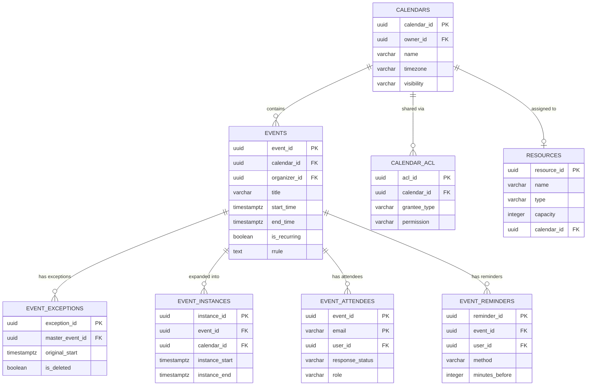
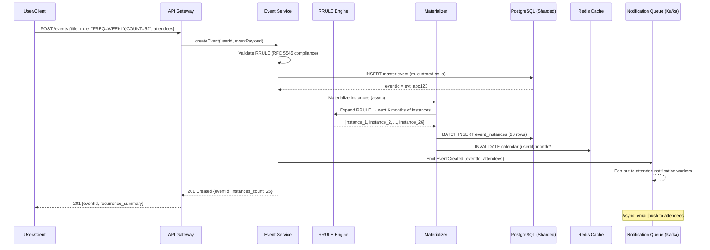
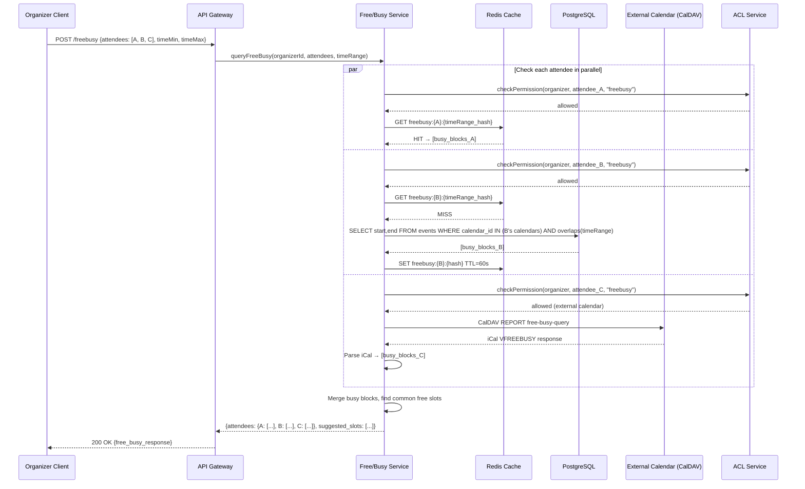

# Google Calendar / Scheduling System Design

## 1. Functional Requirements

### Core Features
- **Event CRUD**: Create, read, update, delete calendar events
- **Recurring Events**: RRULE-based recurrence (daily, weekly, monthly, yearly, custom)
- **Free/Busy Queries**: Check availability across calendars
- **Calendar Sharing**: Granular permissions (view free/busy, view details, edit, manage)
- **Meeting Scheduling**: Find available slots across multiple attendees
- **Invitations & RSVP**: Send invites, track responses (accept/decline/tentative)
- **Reminders & Notifications**: Email, push, SMS at configurable intervals
- **Timezone Handling**: Per-event, per-calendar, floating time support
- **Room/Resource Booking**: Reserve conference rooms, equipment with conflict detection
- **CalDAV Sync**: Standards-compliant calendar synchronization

### Out of Scope
- Video conferencing integration (Zoom/Meet)
- Task/Todo management
- Calendar analytics/heatmaps

## 2. Non-Functional Requirements

| Requirement | Target |
|-------------|--------|
| Availability | 99.99% (52 min downtime/year) |
| Read Latency (p99) | <100ms for single calendar view |
| Write Latency (p99) | <300ms for event creation |
| Free/Busy Query (p99) | <200ms for 10 attendees |
| Recurring Event Expansion | <50ms for 1 year window |
| Consistency | Strong within single calendar, eventual cross-calendar |
| Scale | 2B users, 50B events, 500K QPS reads, 50K QPS writes |
| Timezone Accuracy | IANA tz database, DST transitions correct |
| Sync Reliability | No missed updates within 5 min SLA |

## 3. Capacity Estimation

### Users & Events
- 2B registered users, 500M DAU
- Average user: 5 events/day visible, 2 new events/week
- Total events: 50B (including recurring instances)
- Stored master events (non-expanded): 10B

### Storage
- Event record: ~2KB average (metadata + attendees + recurrence)
- Master events: 10B × 2KB = 20TB
- Materialized instances (next 6 months): 30B × 500B = 15TB
- Indexes (time-based, user-based): ~10TB
- Total: ~50TB with replication factor 3 = 150TB

### Traffic
- Read QPS: 500K (calendar views, free/busy)
- Write QPS: 50K (create/update/delete)
- Peak multiplier: 3x during business hours
- Notification throughput: 10M/hour during peak

### Bandwidth
- Average read response: 5KB (week view with 35 events)
- Read bandwidth: 500K × 5KB = 2.5GB/s
- Write bandwidth: 50K × 2KB = 100MB/s

## 4. Data Modeling

### Entity-Relationship Diagram



### Primary Database: Sharded PostgreSQL + Event Store

```sql
-- Calendar table
CREATE TABLE calendars (
    calendar_id     UUID PRIMARY KEY DEFAULT gen_random_uuid(),
    owner_id        UUID NOT NULL,
    name            VARCHAR(255) NOT NULL,
    description     TEXT,
    timezone        VARCHAR(64) NOT NULL DEFAULT 'UTC',
    color           VARCHAR(7),
    visibility      VARCHAR(20) DEFAULT 'private', -- private, public, freeBusy
    created_at      TIMESTAMPTZ NOT NULL DEFAULT NOW(),
    updated_at      TIMESTAMPTZ NOT NULL DEFAULT NOW(),
    is_deleted      BOOLEAN DEFAULT FALSE,
    etag            VARCHAR(64) NOT NULL,
    CONSTRAINT fk_owner FOREIGN KEY (owner_id) REFERENCES users(user_id)
);

CREATE INDEX idx_calendars_owner ON calendars(owner_id) WHERE NOT is_deleted;

-- Events table (master events only, recurring or single)
CREATE TABLE events (
    event_id            UUID PRIMARY KEY DEFAULT gen_random_uuid(),
    calendar_id         UUID NOT NULL,
    organizer_id        UUID NOT NULL,
    title               VARCHAR(500) NOT NULL,
    description         TEXT,
    location            TEXT,
    start_time          TIMESTAMPTZ NOT NULL,
    end_time            TIMESTAMPTZ NOT NULL,
    start_timezone      VARCHAR(64),
    end_timezone        VARCHAR(64),
    all_day             BOOLEAN DEFAULT FALSE,
    status              VARCHAR(20) DEFAULT 'confirmed', -- confirmed, tentative, cancelled
    visibility          VARCHAR(20) DEFAULT 'default', -- default, public, private, confidential
    transparency        VARCHAR(20) DEFAULT 'opaque', -- opaque, transparent
    -- Recurrence fields
    is_recurring        BOOLEAN DEFAULT FALSE,
    rrule               TEXT, -- RFC 5545 RRULE string
    recurrence_end      TIMESTAMPTZ, -- NULL for infinite
    -- Metadata
    sequence_number     INTEGER DEFAULT 0,
    created_at          TIMESTAMPTZ NOT NULL DEFAULT NOW(),
    updated_at          TIMESTAMPTZ NOT NULL DEFAULT NOW(),
    etag                VARCHAR(64) NOT NULL,
    is_deleted          BOOLEAN DEFAULT FALSE,
    CONSTRAINT fk_calendar FOREIGN KEY (calendar_id) REFERENCES calendars(calendar_id)
);

CREATE INDEX idx_events_calendar_time ON events(calendar_id, start_time, end_time) WHERE NOT is_deleted;
CREATE INDEX idx_events_organizer ON events(organizer_id, start_time) WHERE NOT is_deleted;
CREATE INDEX idx_events_recurring ON events(calendar_id) WHERE is_recurring AND NOT is_deleted;

-- Recurring event exceptions (modified/deleted occurrences)
CREATE TABLE event_exceptions (
    exception_id        UUID PRIMARY KEY DEFAULT gen_random_uuid(),
    master_event_id     UUID NOT NULL,
    original_start      TIMESTAMPTZ NOT NULL, -- which occurrence this modifies
    is_deleted          BOOLEAN DEFAULT FALSE, -- true = this occurrence is cancelled
    -- Override fields (NULL means use master's value)
    title               VARCHAR(500),
    description         TEXT,
    location            TEXT,
    start_time          TIMESTAMPTZ,
    end_time            TIMESTAMPTZ,
    status              VARCHAR(20),
    created_at          TIMESTAMPTZ NOT NULL DEFAULT NOW(),
    updated_at          TIMESTAMPTZ NOT NULL DEFAULT NOW(),
    CONSTRAINT fk_master_event FOREIGN KEY (master_event_id) REFERENCES events(event_id)
);

CREATE UNIQUE INDEX idx_exceptions_master_original ON event_exceptions(master_event_id, original_start);

-- Materialized event instances (pre-expanded for query performance)
CREATE TABLE event_instances (
    instance_id         UUID PRIMARY KEY DEFAULT gen_random_uuid(),
    event_id            UUID NOT NULL, -- master event
    calendar_id         UUID NOT NULL,
    instance_start      TIMESTAMPTZ NOT NULL,
    instance_end        TIMESTAMPTZ NOT NULL,
    is_exception        BOOLEAN DEFAULT FALSE,
    exception_id        UUID, -- if modified occurrence
    CONSTRAINT fk_event FOREIGN KEY (event_id) REFERENCES events(event_id)
);

CREATE INDEX idx_instances_calendar_time ON event_instances(calendar_id, instance_start, instance_end);
CREATE INDEX idx_instances_event ON event_instances(event_id, instance_start);

-- Attendees
CREATE TABLE event_attendees (
    event_id            UUID NOT NULL,
    user_id             UUID, -- NULL for external attendees
    email               VARCHAR(320) NOT NULL,
    display_name        VARCHAR(255),
    response_status     VARCHAR(20) DEFAULT 'needsAction', -- needsAction, accepted, declined, tentative
    role                VARCHAR(20) DEFAULT 'attendee', -- organizer, attendee, optional
    rsvp_time           TIMESTAMPTZ,
    comment             TEXT,
    CONSTRAINT pk_attendees PRIMARY KEY (event_id, email),
    CONSTRAINT fk_event FOREIGN KEY (event_id) REFERENCES events(event_id)
);

CREATE INDEX idx_attendees_user ON event_attendees(user_id, response_status);

-- Calendar sharing/ACL
CREATE TABLE calendar_acl (
    acl_id              UUID PRIMARY KEY DEFAULT gen_random_uuid(),
    calendar_id         UUID NOT NULL,
    grantee_type        VARCHAR(20) NOT NULL, -- user, group, domain, public
    grantee_id          VARCHAR(320), -- user_id, group_id, domain, or NULL for public
    permission          VARCHAR(20) NOT NULL, -- freeBusyReader, reader, writer, owner
    created_at          TIMESTAMPTZ NOT NULL DEFAULT NOW(),
    CONSTRAINT fk_calendar FOREIGN KEY (calendar_id) REFERENCES calendars(calendar_id)
);

CREATE UNIQUE INDEX idx_acl_unique ON calendar_acl(calendar_id, grantee_type, grantee_id);

-- Reminders
CREATE TABLE event_reminders (
    reminder_id         UUID PRIMARY KEY DEFAULT gen_random_uuid(),
    event_id            UUID NOT NULL,
    user_id             UUID NOT NULL,
    method              VARCHAR(20) NOT NULL, -- email, push, sms
    minutes_before      INTEGER NOT NULL,
    is_fired            BOOLEAN DEFAULT FALSE,
    fire_at             TIMESTAMPTZ NOT NULL,
    CONSTRAINT fk_event FOREIGN KEY (event_id) REFERENCES events(event_id)
);

CREATE INDEX idx_reminders_fire ON event_reminders(fire_at) WHERE NOT is_fired;

-- Room/Resource booking
CREATE TABLE resources (
    resource_id         UUID PRIMARY KEY DEFAULT gen_random_uuid(),
    name                VARCHAR(255) NOT NULL,
    type                VARCHAR(50) NOT NULL, -- room, equipment, vehicle
    capacity            INTEGER,
    location            VARCHAR(500),
    features            JSONB, -- {videoConf: true, whiteboard: true, ...}
    building_id         UUID,
    floor               INTEGER,
    calendar_id         UUID NOT NULL, -- each resource has a calendar
    is_active           BOOLEAN DEFAULT TRUE,
    CONSTRAINT fk_calendar FOREIGN KEY (calendar_id) REFERENCES calendars(calendar_id)
);

CREATE INDEX idx_resources_type_location ON resources(type, building_id, floor) WHERE is_active;
```

### Redis Schemas

```redis
# Free/busy cache per calendar (sorted set: score=start_epoch, member=start:end:event_id)
ZADD calendar:freebusy:{calendar_id} {start_epoch} "{start_epoch}:{end_epoch}:{event_id}"

# User's calendar list
SMEMBERS user:calendars:{user_id}

# Real-time notification channel
PUBLISH calendar:updates:{user_id} {event_change_json}

# Rate limiting for API
SET ratelimit:{user_id}:{minute} {count} EX 60

# Calendar sync token (for incremental sync)
HSET calendar:sync:{calendar_id} token {sync_token} last_modified {timestamp}
```

### Kafka Topics

```yaml
topics:
  calendar.events.created:
    partitions: 64
    replication: 3
    retention: 7d
    key: calendar_id
  calendar.events.updated:
    partitions: 64
    replication: 3
    retention: 7d
    key: calendar_id
  calendar.notifications:
    partitions: 128
    replication: 3
    retention: 1d
    key: user_id
  calendar.reminders.scheduled:
    partitions: 32
    replication: 3
    retention: 2d
    key: reminder_id
  calendar.sync.changes:
    partitions: 64
    replication: 3
    retention: 3d
    key: calendar_id
```

## 5. High-Level Design (HLD)

```
┌─────────────────────────────────────────────────────────────────────────────────┐
│                              CLIENT LAYER                                        │
│  ┌──────────┐  ┌──────────┐  ┌──────────┐  ┌──────────┐  ┌──────────────────┐ │
│  │  Web App │  │  Mobile  │  │  CalDAV  │  │ Outlook  │  │  API Consumers   │ │
│  │  (React) │  │  (iOS/   │  │  Client  │  │  Plugin  │  │  (3rd party)     │ │
│  └────┬─────┘  │ Android) │  └────┬─────┘  └────┬─────┘  └────────┬─────────┘ │
│       │        └────┬─────┘       │              │                  │           │
└───────┼─────────────┼─────────────┼──────────────┼──────────────────┼───────────┘
        │             │             │              │                  │
        ▼             ▼             ▼              ▼                  ▼
┌─────────────────────────────────────────────────────────────────────────────────┐
│                           API GATEWAY / LOAD BALANCER                            │
│  ┌─────────────────────────────────────────────────────────────────────────┐    │
│  │  Rate Limiting │ Auth (OAuth2/JWT) │ Request Routing │ TLS Termination  │    │
│  └─────────────────────────────────────────────────────────────────────────┘    │
└─────────────────────────────────────────────────────────────────────────────────┘
        │                    │                    │                    │
        ▼                    ▼                    ▼                    ▼
┌──────────────┐  ┌──────────────────┐  ┌──────────────────┐  ┌──────────────┐
│  Event       │  │  Scheduling      │  │  Notification    │  │  CalDAV      │
│  Service     │  │  Service         │  │  Service         │  │  Sync        │
│              │  │                  │  │                  │  │  Service     │
│  - CRUD      │  │  - Free/Busy     │  │  - Email         │  │              │
│  - Recurrence│  │  - Find slots    │  │  - Push          │  │  - PROPFIND  │
│  - Attendees │  │  - Room booking  │  │  - SMS           │  │  - REPORT    │
│  - ACL check │  │  - Conflicts     │  │  - Scheduling    │  │  - Sync      │
└──────┬───────┘  └────────┬─────────┘  └────────┬─────────┘  └──────┬───────┘
       │                   │                      │                    │
       ▼                   ▼                      ▼                    ▼
┌─────────────────────────────────────────────────────────────────────────────────┐
│                              MESSAGE BUS (Kafka)                                 │
│  ┌────────────┐  ┌────────────────┐  ┌─────────────────┐  ┌────────────────┐   │
│  │ events.*   │  │ notifications  │  │ reminders.*     │  │ sync.changes   │   │
│  └────────────┘  └────────────────┘  └─────────────────┘  └────────────────┘   │
└─────────────────────────────────────────────────────────────────────────────────┘
       │                   │                      │                    │
       ▼                   ▼                      ▼                    ▼
┌──────────────┐  ┌──────────────────┐  ┌──────────────────┐  ┌──────────────┐
│  Recurrence  │  │  Reminder        │  │  Instance        │  │  Search      │
│  Expansion   │  │  Scheduler       │  │  Materializer    │  │  Indexer     │
│  Worker      │  │                  │  │                  │  │              │
│              │  │  - Timer wheel   │  │  - Pre-expand    │  │  - ES Index  │
│  - RRULE     │  │  - Fire on time  │  │    6 months      │  │  - Full text │
│    parsing   │  │  - Multi-channel │  │  - Exception     │  │  - Facets    │
│  - Lazy      │  │                  │  │    merge         │  │              │
│    expand    │  │                  │  │                  │  │              │
└──────┬───────┘  └────────┬─────────┘  └────────┬─────────┘  └──────┬───────┘
       │                   │                      │                    │
       ▼                   ▼                      ▼                    ▼
┌─────────────────────────────────────────────────────────────────────────────────┐
│                              DATA LAYER                                          │
│  ┌───────────────┐  ┌──────────────┐  ┌──────────────┐  ┌───────────────────┐  │
│  │  PostgreSQL   │  │    Redis     │  │ Elasticsearch│  │  Object Storage   │  │
│  │  (Sharded)    │  │   Cluster    │  │              │  │  (Attachments)    │  │
│  │               │  │              │  │              │  │                   │  │
│  │  - Events     │  │  - FreeBusy  │  │  - Event     │  │  - ICS files      │  │
│  │  - Calendars  │  │    cache     │  │    search    │  │  - Attachments    │  │
│  │  - Attendees  │  │  - Sessions  │  │  - People    │  │  - Exports        │  │
│  │  - ACL        │  │  - PubSub    │  │    search    │  │                   │  │
│  │  - Instances  │  │  - Locks     │  │              │  │                   │  │
│  └───────────────┘  └──────────────┘  └──────────────┘  └───────────────────┘  │
└─────────────────────────────────────────────────────────────────────────────────┘
```

## 6. Low-Level Design (LLD) - APIs

### Event CRUD APIs

```http
POST /api/v1/calendars/{calendar_id}/events
Content-Type: application/json
Authorization: Bearer {token}

{
  "title": "Weekly Team Standup",
  "description": "Discuss sprint progress",
  "start": {
    "dateTime": "2024-03-18T09:00:00",
    "timeZone": "America/New_York"
  },
  "end": {
    "dateTime": "2024-03-18T09:30:00",
    "timeZone": "America/New_York"
  },
  "recurrence": ["RRULE:FREQ=WEEKLY;BYDAY=MO,WE,FR;UNTIL=20241231T235959Z"],
  "attendees": [
    {"email": "alice@company.com", "role": "attendee"},
    {"email": "bob@company.com", "role": "optional"}
  ],
  "reminders": {
    "useDefault": false,
    "overrides": [
      {"method": "push", "minutes": 10},
      {"method": "email", "minutes": 30}
    ]
  },
  "conferenceData": {
    "createRequest": {"requestId": "uuid-123"}
  },
  "location": "Room: Everest (Floor 3, Bldg A)",
  "resourceBookings": ["resource-room-everest-uuid"]
}
```

**Response:**
```json
{
  "eventId": "evt_abc123",
  "calendarId": "cal_xyz789",
  "status": "confirmed",
  "htmlLink": "https://calendar.app/event/evt_abc123",
  "created": "2024-03-15T10:00:00Z",
  "updated": "2024-03-15T10:00:00Z",
  "etag": "\"e3b0c44298fc1c149afbf4c8996fb924\"",
  "sequence": 0,
  "recurrence": ["RRULE:FREQ=WEEKLY;BYDAY=MO,WE,FR;UNTIL=20241231T235959Z"],
  "attendees": [
    {"email": "alice@company.com", "responseStatus": "needsAction"},
    {"email": "bob@company.com", "responseStatus": "needsAction"}
  ],
  "resourceBookings": [
    {"resourceId": "resource-room-everest-uuid", "status": "accepted"}
  ]
}
```

### Free/Busy Query API

```http
POST /api/v1/freeBusy
Content-Type: application/json

{
  "timeMin": "2024-03-18T00:00:00Z",
  "timeMax": "2024-03-22T23:59:59Z",
  "timeZone": "America/New_York",
  "items": [
    {"id": "alice@company.com"},
    {"id": "bob@company.com"},
    {"id": "resource-room-everest-uuid"}
  ]
}
```

**Response:**
```json
{
  "timeMin": "2024-03-18T00:00:00Z",
  "timeMax": "2024-03-22T23:59:59Z",
  "calendars": {
    "alice@company.com": {
      "busy": [
        {"start": "2024-03-18T09:00:00Z", "end": "2024-03-18T10:00:00Z"},
        {"start": "2024-03-18T14:00:00Z", "end": "2024-03-18T15:30:00Z"}
      ]
    },
    "bob@company.com": {
      "busy": [
        {"start": "2024-03-18T10:00:00Z", "end": "2024-03-18T11:00:00Z"}
      ]
    },
    "resource-room-everest-uuid": {
      "busy": [
        {"start": "2024-03-18T09:00:00Z", "end": "2024-03-18T10:00:00Z"}
      ]
    }
  }
}
```

### Smart Scheduling - Find Available Slots

```http
POST /api/v1/scheduling/findSlots
Content-Type: application/json

{
  "duration": "PT30M",
  "timeRange": {
    "start": "2024-03-18T00:00:00Z",
    "end": "2024-03-22T23:59:59Z"
  },
  "attendees": [
    {"email": "alice@company.com", "required": true},
    {"email": "bob@company.com", "required": true},
    {"email": "carol@company.com", "required": false}
  ],
  "preferences": {
    "workingHours": {"start": "09:00", "end": "17:00"},
    "preferredTimes": ["morning"],
    "avoidBackToBack": true,
    "minimumGap": "PT15M"
  },
  "roomRequirements": {
    "capacity": 5,
    "features": ["videoConf"]
  },
  "maxSuggestions": 5
}
```

**Response:**
```json
{
  "suggestions": [
    {
      "start": "2024-03-18T11:00:00Z",
      "end": "2024-03-18T11:30:00Z",
      "score": 0.95,
      "attendeeAvailability": {
        "alice@company.com": "available",
        "bob@company.com": "available",
        "carol@company.com": "available"
      },
      "suggestedRoom": {
        "resourceId": "resource-room-everest-uuid",
        "name": "Everest",
        "capacity": 8
      },
      "reasoning": "All required attendees free, preferred morning slot, room available"
    }
  ]
}
```

### RSVP / Invitation Response

```http
PATCH /api/v1/events/{event_id}/attendees/me
Content-Type: application/json

{
  "responseStatus": "accepted",
  "comment": "I'll be there!",
  "proposeNewTime": null
}
```

## 7. Deep Dives

### Deep Dive 1: Recurring Event Expansion (RRULE Parser)

#### RRULE Complexity

RFC 5545 recurrence rules support: FREQ, INTERVAL, COUNT, UNTIL, BYDAY, BYMONTH, BYMONTHDAY, BYSETPOS, BYHOUR, BYMINUTE, WKST, EXDATE, RDATE.

#### Materialized vs Virtual Instances

```
Strategy: Hybrid Approach
┌─────────────────────────────────────────────────────────────┐
│                                                             │
│  ┌─────────────────────┐     ┌─────────────────────────┐   │
│  │  Master Event Store │     │  Instance Store          │   │
│  │                     │     │  (Materialized Window)   │   │
│  │  - RRULE stored     │────▶│                         │   │
│  │  - No expansion     │     │  - Next 6 months        │   │
│  │  - Exceptions ref   │     │  - Queryable directly   │   │
│  └─────────────────────┘     │  - Updated on change    │   │
│                              └─────────────────────────┘   │
│                                                             │
│  ┌─────────────────────────────────────────────────────┐   │
│  │  Lazy Expansion (beyond materialized window)         │   │
│  │                                                     │   │
│  │  Query for Dec 2025 → expand on-the-fly from RRULE │   │
│  │  Cache result temporarily in Redis                   │   │
│  └─────────────────────────────────────────────────────┘   │
└─────────────────────────────────────────────────────────────┘
```

#### RRULE Parser Implementation

```python
from datetime import datetime, timedelta
from typing import List, Optional, Set
from dataclasses import dataclass
import pytz

@dataclass
class RRuleConfig:
    freq: str  # DAILY, WEEKLY, MONTHLY, YEARLY
    interval: int = 1
    count: Optional[int] = None
    until: Optional[datetime] = None
    byday: List[str] = None  # MO, TU, WE, ...
    bymonthday: List[int] = None
    bymonth: List[int] = None
    bysetpos: List[int] = None
    wkst: str = "MO"
    exdates: Set[datetime] = None  # excluded dates

class RRuleExpander:
    """Expands RRULE into concrete event instances within a window."""
    
    WEEKDAY_MAP = {"MO": 0, "TU": 1, "WE": 2, "TH": 3, "FR": 4, "SA": 5, "SU": 6}
    
    def __init__(self, dtstart: datetime, rrule: RRuleConfig, timezone: str):
        self.dtstart = dtstart
        self.rrule = rrule
        self.tz = pytz.timezone(timezone)
        self.exdates = rrule.exdates or set()
    
    def expand(self, window_start: datetime, window_end: datetime, 
               max_instances: int = 1000) -> List[datetime]:
        """
        Expand recurrence within [window_start, window_end].
        Uses lazy evaluation - only generates instances within window.
        """
        instances = []
        current = self.dtstart
        count = 0
        
        while current <= window_end:
            if self.rrule.count and count >= self.rrule.count:
                break
            if self.rrule.until and current > self.rrule.until:
                break
            if len(instances) >= max_instances:
                break
            
            # Generate candidates for this period
            candidates = self._generate_candidates(current)
            
            for candidate in candidates:
                if candidate < window_start:
                    count += 1
                    continue
                if candidate > window_end:
                    break
                if self.rrule.count and count >= self.rrule.count:
                    break
                    
                # Check EXDATE exclusions
                if candidate not in self.exdates:
                    instances.append(candidate)
                count += 1
            
            # Advance to next period
            current = self._advance(current)
        
        return instances
    
    def _generate_candidates(self, period_start: datetime) -> List[datetime]:
        """Generate all candidate dates within a single period."""
        if self.rrule.freq == "WEEKLY" and self.rrule.byday:
            candidates = []
            week_start = period_start - timedelta(days=period_start.weekday())
            for day_str in self.rrule.byday:
                day_offset = self.WEEKDAY_MAP[day_str[:2]]
                candidate = week_start + timedelta(days=day_offset)
                candidate = candidate.replace(
                    hour=self.dtstart.hour, 
                    minute=self.dtstart.minute,
                    second=self.dtstart.second
                )
                candidates.append(candidate)
            return sorted(candidates)
        
        if self.rrule.freq == "MONTHLY" and self.rrule.bymonthday:
            candidates = []
            for day in self.rrule.bymonthday:
                try:
                    candidate = period_start.replace(day=day)
                    candidates.append(candidate)
                except ValueError:
                    pass  # Skip invalid dates (e.g., Feb 30)
            return sorted(candidates)
        
        return [period_start]
    
    def _advance(self, current: datetime) -> datetime:
        """Advance current by one interval of the frequency."""
        interval = self.rrule.interval
        if self.rrule.freq == "DAILY":
            return current + timedelta(days=interval)
        elif self.rrule.freq == "WEEKLY":
            return current + timedelta(weeks=interval)
        elif self.rrule.freq == "MONTHLY":
            month = current.month + interval
            year = current.year + (month - 1) // 12
            month = (month - 1) % 12 + 1
            day = min(current.day, self._days_in_month(year, month))
            return current.replace(year=year, month=month, day=day)
        elif self.rrule.freq == "YEARLY":
            return current.replace(year=current.year + interval)
        return current


class ExceptionMerger:
    """Merges exceptions (modifications/deletions) with expanded instances."""
    
    def merge(self, instances: List[datetime], exceptions: List[dict], 
              master_event: dict) -> List[dict]:
        """
        Given expanded instances and exceptions, produce final event list.
        Each exception overrides or deletes a specific occurrence.
        """
        exception_map = {exc['original_start']: exc for exc in exceptions}
        result = []
        
        for instance_start in instances:
            if instance_start in exception_map:
                exc = exception_map[instance_start]
                if exc.get('is_deleted'):
                    continue  # Skip deleted occurrence
                # Merge exception overrides with master
                event = {**master_event}
                for field in ['title', 'description', 'location', 'start_time', 'end_time']:
                    if exc.get(field) is not None:
                        event[field] = exc[field]
                result.append(event)
            else:
                # Regular occurrence - use master event fields
                duration = master_event['end_time'] - master_event['start_time']
                result.append({
                    **master_event,
                    'start_time': instance_start,
                    'end_time': instance_start + duration,
                    'is_recurring_instance': True
                })
        
        return result
```

#### Instance Materialization Worker

```python
class InstanceMaterializer:
    """
    Background worker that pre-expands recurring events into concrete instances.
    Runs on Kafka consumer for calendar.events.created/updated topics.
    """
    
    MATERIALIZATION_WINDOW = timedelta(days=180)  # 6 months
    
    async def handle_event_change(self, event: dict):
        if not event.get('is_recurring'):
            return
        
        # Delete existing materialized instances
        await self.db.execute(
            "DELETE FROM event_instances WHERE event_id = $1 AND instance_start > $2",
            event['event_id'], datetime.utcnow()
        )
        
        # Expand and re-materialize
        rrule = RRuleConfig.parse(event['rrule'])
        expander = RRuleExpander(event['start_time'], rrule, event['start_timezone'])
        
        window_end = datetime.utcnow() + self.MATERIALIZATION_WINDOW
        instances = expander.expand(datetime.utcnow(), window_end)
        
        # Load exceptions
        exceptions = await self.db.fetch(
            "SELECT * FROM event_exceptions WHERE master_event_id = $1",
            event['event_id']
        )
        
        # Batch insert instances
        batch = []
        exception_dates = {e['original_start'] for e in exceptions if e['is_deleted']}
        
        for instance_start in instances:
            if instance_start in exception_dates:
                continue
            duration = event['end_time'] - event['start_time']
            batch.append({
                'event_id': event['event_id'],
                'calendar_id': event['calendar_id'],
                'instance_start': instance_start,
                'instance_end': instance_start + duration,
                'is_exception': instance_start in {e['original_start'] for e in exceptions}
            })
        
        await self.db.batch_insert('event_instances', batch)
        
        # Invalidate free/busy cache
        await self.redis.delete(f"calendar:freebusy:{event['calendar_id']}")
```

### Deep Dive 2: Free/Busy Computation

#### Interval Tree for Overlap Detection

```python
from typing import List, Tuple
from dataclasses import dataclass
import bisect

@dataclass
class TimeInterval:
    start: int  # epoch seconds
    end: int    # epoch seconds
    event_id: str
    calendar_id: str

class IntervalTree:
    """
    Augmented interval tree for efficient overlap queries.
    Supports O(log n + k) query time where k = number of overlapping intervals.
    """
    
    def __init__(self):
        self.intervals: List[TimeInterval] = []
        self.sorted_starts: List[int] = []
        self.sorted_ends: List[int] = []
        self._built = False
    
    def insert(self, interval: TimeInterval):
        self.intervals.append(interval)
        self._built = False
    
    def build(self):
        """Sort intervals for efficient querying."""
        self.intervals.sort(key=lambda x: x.start)
        self.sorted_starts = [i.start for i in self.intervals]
        self.sorted_ends = sorted([i.end for i in self.intervals])
        self._built = True
    
    def query_overlaps(self, query_start: int, query_end: int) -> List[TimeInterval]:
        """Find all intervals overlapping with [query_start, query_end]."""
        if not self._built:
            self.build()
        
        results = []
        # Binary search for candidates: intervals that start before query_end
        right_bound = bisect.bisect_left(self.sorted_starts, query_end)
        
        for i in range(right_bound):
            interval = self.intervals[i]
            # Overlap condition: interval.start < query_end AND interval.end > query_start
            if interval.end > query_start:
                results.append(interval)
        
        return results


class FreeBusyComputer:
    """
    Computes free/busy information across multiple calendars.
    Uses merge algorithm for cross-calendar availability aggregation.
    """
    
    def compute_freebusy(self, calendar_ids: List[str], 
                         window_start: int, window_end: int) -> dict:
        """
        Compute free/busy for multiple calendars.
        Returns merged busy intervals per calendar.
        """
        result = {}
        
        for cal_id in calendar_ids:
            # Fetch events from materialized instances
            intervals = self._fetch_intervals(cal_id, window_start, window_end)
            # Merge overlapping intervals
            merged = self._merge_intervals(intervals)
            result[cal_id] = merged
        
        return result
    
    def _merge_intervals(self, intervals: List[Tuple[int, int]]) -> List[Tuple[int, int]]:
        """
        O(n log n) merge of overlapping intervals.
        Combines adjacent/overlapping busy periods into single blocks.
        """
        if not intervals:
            return []
        
        # Sort by start time
        sorted_intervals = sorted(intervals, key=lambda x: x[0])
        merged = [sorted_intervals[0]]
        
        for start, end in sorted_intervals[1:]:
            if start <= merged[-1][1]:  # Overlaps with previous
                merged[-1] = (merged[-1][0], max(merged[-1][1], end))
            else:
                merged.append((start, end))
        
        return merged
    
    def find_common_free_slots(self, calendars_busy: dict, 
                                window_start: int, window_end: int,
                                duration: int) -> List[Tuple[int, int]]:
        """
        Find time slots where ALL calendars are free.
        Uses sweep line algorithm across all busy intervals.
        
        Algorithm:
        1. Create events: +1 at each busy start, -1 at each busy end
        2. Sweep left to right
        3. Free slot exists where count == 0 for >= duration
        """
        events = []  # (time, +1/-1)
        
        for cal_id, busy_intervals in calendars_busy.items():
            for start, end in busy_intervals:
                events.append((start, +1))
                events.append((end, -1))
        
        events.sort(key=lambda x: (x[0], -x[1]))  # ties: end before start
        
        free_slots = []
        busy_count = 0
        free_start = window_start
        
        for time, delta in events:
            if busy_count == 0 and time > free_start:
                # We were free from free_start to time
                if time - free_start >= duration:
                    free_slots.append((free_start, time))
            
            busy_count += delta
            
            if busy_count == 0:
                free_start = time
        
        # Check trailing free slot
        if busy_count == 0 and window_end - free_start >= duration:
            free_slots.append((free_start, window_end))
        
        return free_slots
```

#### Redis-Based Free/Busy Cache

```python
class FreeBusyCache:
    """
    Redis sorted set based free/busy cache.
    Score = start_epoch, Member = "start:end:event_id"
    Enables O(log n) range queries for busy intervals.
    """
    
    def __init__(self, redis_client):
        self.redis = redis_client
        self.TTL = 3600  # 1 hour cache
    
    async def get_busy_intervals(self, calendar_id: str, 
                                  window_start: int, window_end: int) -> List[dict]:
        key = f"calendar:freebusy:{calendar_id}"
        
        # Range query on sorted set
        members = await self.redis.zrangebyscore(
            key, window_start, window_end
        )
        
        if not members:
            # Cache miss - compute and cache
            return await self._compute_and_cache(calendar_id, window_start, window_end)
        
        intervals = []
        for member in members:
            start, end, event_id = member.decode().split(":")
            if int(end) > window_start:  # Filter out events ending before window
                intervals.append({
                    "start": int(start),
                    "end": int(end),
                    "event_id": event_id
                })
        
        return intervals
    
    async def invalidate(self, calendar_id: str):
        await self.redis.delete(f"calendar:freebusy:{calendar_id}")
```

### Deep Dive 3: Smart Scheduling

#### Optimal Meeting Time Finder

```python
from dataclasses import dataclass
from typing import List, Optional
import heapq

@dataclass
class AttendeePreference:
    email: str
    required: bool
    timezone: str
    working_hours_start: int  # minutes from midnight in their tz
    working_hours_end: int
    preferred_times: List[str]  # ["morning", "afternoon"]
    avoid_back_to_back: bool
    
@dataclass
class SlotCandidate:
    start: int  # epoch
    end: int    # epoch
    score: float
    attendee_availability: dict  # email -> "available"|"busy"|"tentative"
    room: Optional[dict]
    reasoning: str

class SmartScheduler:
    """
    Finds optimal meeting time considering:
    - Attendee availability (required vs optional)
    - Working hours across timezones  
    - Preferences (morning/afternoon, avoid back-to-back)
    - Travel time between meetings
    - Room availability with feature matching
    """
    
    SLOT_GRANULARITY = 15 * 60  # 15 minute slots
    
    def find_optimal_slots(self, 
                           attendees: List[AttendeePreference],
                           duration: int,  # seconds
                           window_start: int, 
                           window_end: int,
                           room_requirements: Optional[dict],
                           max_suggestions: int = 5) -> List[SlotCandidate]:
        
        # Step 1: Get free/busy for all attendees
        all_busy = self._fetch_all_freebusy(attendees, window_start, window_end)
        
        # Step 2: Generate candidate slots at granularity intervals
        candidates = []
        current = self._align_to_granularity(window_start)
        
        while current + duration <= window_end:
            slot_end = current + duration
            score = self._score_slot(current, slot_end, attendees, all_busy, room_requirements)
            
            if score > 0:  # Only consider viable slots
                heapq.heappush(candidates, (-score, current, slot_end))
            
            current += self.SLOT_GRANULARITY
        
        # Step 3: Return top-K slots
        results = []
        seen_days = set()
        
        while candidates and len(results) < max_suggestions:
            neg_score, start, end = heapq.heappop(candidates)
            
            # Diversity: prefer slots on different days
            day = start // 86400
            day_penalty = 0.1 if day in seen_days else 0
            seen_days.add(day)
            
            availability = self._check_attendee_status(start, end, attendees, all_busy)
            room = self._find_room(start, end, room_requirements) if room_requirements else None
            
            results.append(SlotCandidate(
                start=start,
                end=end,
                score=-neg_score - day_penalty,
                attendee_availability=availability,
                room=room,
                reasoning=self._generate_reasoning(start, end, attendees, availability)
            ))
        
        return sorted(results, key=lambda x: -x.score)
    
    def _score_slot(self, start: int, end: int, 
                    attendees: List[AttendeePreference],
                    all_busy: dict, room_requirements: Optional[dict]) -> float:
        """
        Score a candidate slot. Higher = better.
        
        Scoring factors:
        - Required attendee available: +10 each (0 if any unavailable)
        - Optional attendee available: +3 each
        - Within working hours for all: +5
        - Matches preferred time: +3
        - Not back-to-back: +2
        - Room available: +5
        """
        score = 0.0
        
        for attendee in attendees:
            is_free = self._is_free(attendee.email, start, end, all_busy)
            
            if attendee.required and not is_free:
                return 0  # Required attendee busy = slot invalid
            
            if is_free:
                score += 10 if attendee.required else 3
            
            # Working hours check
            if self._in_working_hours(start, end, attendee):
                score += 5
            elif attendee.required:
                return 0  # Outside required attendee's working hours
            
            # Preferred time bonus
            if self._matches_preference(start, attendee):
                score += 3
            
            # Back-to-back penalty
            if attendee.avoid_back_to_back:
                if not self._has_buffer(attendee.email, start, end, all_busy, buffer=900):
                    score -= 2
        
        # Room availability
        if room_requirements:
            if self._find_room(start, end, room_requirements):
                score += 5
            else:
                score -= 10  # Heavy penalty if no room available
        
        return score
    
    def _in_working_hours(self, start: int, end: int, attendee: AttendeePreference) -> bool:
        """Check if slot falls within attendee's working hours in their timezone."""
        import pytz
        tz = pytz.timezone(attendee.timezone)
        local_start = datetime.fromtimestamp(start, tz)
        local_end = datetime.fromtimestamp(end, tz)
        
        start_minutes = local_start.hour * 60 + local_start.minute
        end_minutes = local_end.hour * 60 + local_end.minute
        
        return (start_minutes >= attendee.working_hours_start and 
                end_minutes <= attendee.working_hours_end and
                local_start.weekday() < 5)  # Weekdays only
```

## 8. Component Optimization

### Database Sharding Strategy

```
Shard Key: calendar_id (consistent hashing)

Rationale:
- Most queries are per-calendar (view events, free/busy)
- Events belong to exactly one calendar
- Cross-calendar queries (scheduling) use scatter-gather

Shard count: 256 logical shards → 16 physical nodes
Rebalancing: Virtual node ring with 1024 vnodes
```

### Caching Strategy

```
Layer 1: CDN (static calendar embeds, public calendars)
Layer 2: Redis Cluster
  - Free/busy intervals (TTL: 5min, invalidate on event change)
  - Calendar metadata (TTL: 1hr)
  - User session + permissions (TTL: 15min)
Layer 3: Application-level LRU
  - Parsed RRULE objects (avoid re-parsing)
  - Timezone conversion tables

Cache Invalidation: Event-driven via Kafka
  event.created/updated/deleted → invalidate free/busy cache for calendar
  acl.changed → invalidate permission cache for all shared users
```

### Recurring Event Optimization

```
Problem: "Select all events this week" must include recurring instances.

Solution layers:
1. Materialized instances (6 months) → direct SQL query
2. Beyond window → lazy expansion with caching
3. Unbounded series (no UNTIL/COUNT) → expand on-demand, cap at 1000 instances

Query flow:
  SELECT * FROM event_instances 
  WHERE calendar_id = $1 
    AND instance_start < $2 
    AND instance_end > $3
  
  UNION ALL
  
  -- Lazy expand recurring events beyond materialization window
  (handled in application layer)
```

### Connection Pooling & Query Optimization

```yaml
pgbouncer:
  pool_mode: transaction
  max_client_conn: 10000
  default_pool_size: 100
  reserve_pool_size: 20

query_optimizations:
  - covering_index: "idx_instances_calendar_time includes (event_id, is_exception)"
  - partition_by_month: "event_instances partitioned by instance_start range"
  - batch_attendee_fetch: "IN clause with up to 100 event_ids per query"
```

## 9. Observability

### Metrics (Prometheus)

```yaml
metrics:
  # API latency
  - name: calendar_api_request_duration_seconds
    type: histogram
    labels: [method, endpoint, status_code]
    buckets: [0.01, 0.025, 0.05, 0.1, 0.25, 0.5, 1.0]
  
  # Free/busy computation
  - name: freebusy_computation_duration_seconds
    type: histogram
    labels: [num_calendars, cache_hit]
    buckets: [0.01, 0.05, 0.1, 0.2, 0.5]
  
  # RRULE expansion
  - name: rrule_expansion_instances_total
    type: counter
    labels: [frequency, bounded]
  
  - name: rrule_expansion_duration_seconds
    type: histogram
    labels: [frequency]
  
  # Event operations
  - name: calendar_events_created_total
    type: counter
    labels: [recurring, has_attendees]
  
  - name: calendar_events_conflicts_detected_total
    type: counter
    labels: [resource_type]
  
  # Notification delivery
  - name: notification_delivery_duration_seconds
    type: histogram
    labels: [channel, status]
  
  - name: notification_delivery_failures_total
    type: counter
    labels: [channel, error_type]
  
  # Instance materializer lag
  - name: materializer_lag_seconds
    type: gauge
    labels: [partition]
  
  # Room booking
  - name: room_booking_attempts_total
    type: counter
    labels: [status]  # success, conflict, no_availability
```

### Distributed Tracing

```
Trace: CreateRecurringEvent
├── api_gateway.authenticate (2ms)
├── event_service.validate_rrule (1ms)
├── event_service.check_room_availability (15ms)
│   ├── redis.get_freebusy (3ms)
│   └── db.query_resource_events (12ms)
├── db.insert_event (8ms)
├── kafka.produce_event_created (3ms)
├── notification_service.send_invitations (async)
│   ├── email.send (200ms)
│   └── push.send (50ms)
└── materializer.expand_instances (async, 45ms)
    ├── rrule.parse (1ms)
    ├── rrule.expand_6months (5ms)
    ├── exception_merger.merge (2ms)
    └── db.batch_insert_instances (37ms)
```

### Alerting Rules

```yaml
alerts:
  - name: FreeBusyLatencyHigh
    expr: histogram_quantile(0.99, calendar_freebusy_duration_seconds) > 0.5
    for: 5m
    severity: warning
    
  - name: MaterializerLagCritical
    expr: materializer_lag_seconds > 300
    for: 10m
    severity: critical
    description: "Instance materializer is >5min behind, calendar views may show stale data"
    
  - name: RoomDoubleBooking
    expr: rate(room_booking_conflicts_total[5m]) > 0.1
    for: 2m
    severity: critical
    
  - name: NotificationDeliveryFailure
    expr: rate(notification_delivery_failures_total[5m]) / rate(notification_delivery_total[5m]) > 0.05
    for: 5m
    severity: warning
```

### Logging

```json
{
  "timestamp": "2024-03-18T10:00:00.123Z",
  "level": "INFO",
  "service": "scheduling-service",
  "trace_id": "abc123",
  "span_id": "def456",
  "event": "find_slots_completed",
  "attendee_count": 5,
  "window_days": 5,
  "slots_found": 8,
  "duration_ms": 145,
  "cache_hits": 3,
  "cache_misses": 2,
  "room_search": true,
  "room_found": true
}
```

## 10. Considerations

### Timezone Handling Challenges

```
Problem: DST transitions can cause recurring events to shift or duplicate.

Solution:
- Store events in "wall clock" time with timezone (not UTC)
- During expansion, apply timezone rules to each instance independently
- Example: 9 AM America/New_York stays 9 AM local even when clocks change
- UTC offset changes but wall time remains stable

Edge case: "2 AM" during spring-forward doesn't exist
  → Skip that occurrence or move to 3 AM (configurable)
  
Edge case: "1:30 AM" during fall-back occurs twice
  → Use first occurrence (standard) by default
```

### Conflict Resolution

```
Scenario: Two users simultaneously book the same room at the same time.

Solution: Optimistic concurrency with event version
1. Read room's free/busy (with version/etag)
2. Attempt to write booking with "IF version = X"
3. On conflict → re-read, check availability, retry or fail

Database: SELECT ... FOR UPDATE SKIP LOCKED on room calendar
Redis: WATCH + MULTI for distributed lock
```

### CalDAV Sync Protocol

```
Sync mechanism:
1. Client stores sync-token from last sync
2. Client sends REPORT with sync-token
3. Server returns all changes since that token
4. Changes: created/updated events (full data) + deleted (just href)
5. Server issues new sync-token

Implementation:
- sync_token = base64(calendar_id + ":" + last_modified_timestamp)
- Change log in Kafka (retained 30 days) for efficient delta computation
- Fallback: full re-sync if token expired
```

### Multi-Region Deployment

```
┌─────────────┐     ┌─────────────┐     ┌─────────────┐
│  US-West    │     │  EU-West    │     │  AP-East    │
│  Primary    │◄───▶│  Replica    │◄───▶│  Replica    │
│             │     │             │     │             │
│  R/W        │     │  R/O (local)│     │  R/O (local)│
│             │     │  W→US-West  │     │  W→US-West  │
└─────────────┘     └─────────────┘     └─────────────┘

Strategy:
- User's home region handles writes
- Reads served from nearest replica
- Cross-region scheduling queries use async aggregation
- Conflict resolution: last-writer-wins with sequence numbers
```

### Security & Privacy

```
- Calendar ACL enforced at query layer (not just API)
- Free/busy queries expose only time blocks, not event details
- End-to-end encryption for event body (optional, enterprise)
- GDPR: right to deletion cascade (events + instances + attendees + notifications)
- Rate limiting: 100 events/min per user, 1000 free/busy queries/hour
```

## 11. Failure Scenarios & Recovery

| Failure | Impact | Mitigation |
|---------|--------|------------|
| Materializer down | New recurring events not queryable | Fallback to lazy expansion from master RRULE |
| Redis cache failure | Free/busy latency spike | Direct DB query with degraded latency, auto-reconnect |
| DB shard failure | Calendar unavailable | Promote replica, <30s failover |
| Kafka partition loss | Missed notifications | Consumer checkpoint replay, at-least-once delivery |
| RRULE parsing error | Event creation failure | Strict validation at API layer, reject malformed rules |
| Timezone DB stale | Wrong event times after DST change | Monthly IANA tz updates, rolling deployment |
| Room double-booking | User frustration | Optimistic locking + immediate conflict notification |

---

---

## 12. Sequence Diagrams

### 12.1 Event Creation with Recurrence Expansion



### 12.2 Free/Busy Query Across Multiple Calendars



