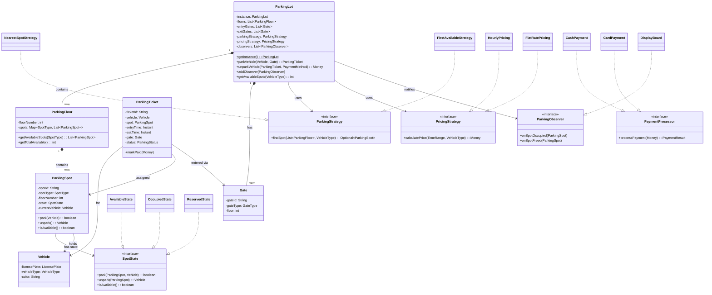

# Low-Level Design: Parking Lot System

## 1. Problem Statement

Design an automated parking lot system that supports:

**Functional Requirements:**
- Multiple floors with different spot types (Compact, Large, Handicapped, Electric)
- Multiple entry/exit gates
- Vehicle types: Car, Truck, Motorcycle, Electric
- Ticket generation on entry, payment on exit
- Multiple pricing strategies (hourly, flat-rate)
- Multiple payment methods (cash, card, UPI)
- Real-time availability display on boards
- Nearest spot allocation strategy

**Non-Functional Requirements:**
- Thread-safe (concurrent entry/exit)
- Extensible pricing and payment
- Observable (display boards auto-update)
- Single parking lot instance per system

---

## 2. UML Class Diagram



---

## 3. Design Patterns Used

| Pattern | Where | Why |
|---------|-------|-----|
| **Singleton** | `ParkingLot` | One lot instance across the system |
| **Strategy** | `ParkingStrategy`, `PricingStrategy` | Swap algorithms at runtime |
| **State** | `SpotState` | Spot behaves differently based on state (Available/Occupied/Reserved) |
| **Observer** | `ParkingObserver` | Display boards auto-update on spot changes |
| **Factory** | `VehicleFactory`, `SpotFactory` | Encapsulate creation logic |

---

## 4. SOLID Principles Applied

| Principle | Application |
|-----------|-------------|
| **S** - Single Responsibility | Each class has one job: `ParkingSpot` manages spot state, `PricingStrategy` calculates price, `PaymentProcessor` handles payment |
| **O** - Open/Closed | New pricing (weekend, dynamic) added via new `PricingStrategy` implementation without modifying existing code |
| **L** - Liskov Substitution | Any `ParkingStrategy` implementation can replace another without breaking `ParkingLot` |
| **I** - Interface Segregation | `ParkingObserver` is separate from `PaymentProcessor` — clients depend only on interfaces they use |
| **D** - Dependency Inversion | `ParkingLot` depends on `ParkingStrategy` interface, not `NearestSpotStrategy` concrete class |

---

## 5. Complete Java Implementation

### 5.1 Enums

```java
public enum VehicleType {
    MOTORCYCLE(1),
    CAR(2),
    ELECTRIC(2),
    TRUCK(4);

    private final int spotsNeeded;

    VehicleType(int spotsNeeded) {
        this.spotsNeeded = spotsNeeded;
    }

    public int getSpotsNeeded() { return spotsNeeded; }
}

public enum SpotType {
    COMPACT,
    LARGE,
    HANDICAPPED,
    ELECTRIC;

    public boolean canFit(VehicleType vehicleType) {
        return switch (this) {
            case COMPACT -> vehicleType == VehicleType.MOTORCYCLE || vehicleType == VehicleType.CAR;
            case LARGE -> true;
            case HANDICAPPED -> vehicleType == VehicleType.CAR || vehicleType == VehicleType.MOTORCYCLE;
            case ELECTRIC -> vehicleType == VehicleType.ELECTRIC;
        };
    }
}

public enum ParkingStatus {
    ACTIVE, PAID, LOST
}

public enum GateType {
    ENTRY, EXIT
}

public enum PaymentMethod {
    CASH, CARD, UPI
}
```

### 5.2 Value Objects (Records)

```java
public record Money(BigDecimal amount, Currency currency) {
    public Money {
        Objects.requireNonNull(amount);
        Objects.requireNonNull(currency);
        if (amount.compareTo(BigDecimal.ZERO) < 0) {
            throw new IllegalArgumentException("Amount cannot be negative");
        }
    }

    public static Money of(double amount) {
        return new Money(BigDecimal.valueOf(amount), Currency.getInstance("INR"));
    }

    public Money add(Money other) {
        if (!this.currency.equals(other.currency)) {
            throw new IllegalArgumentException("Currency mismatch");
        }
        return new Money(this.amount.add(other.amount), this.currency);
    }
}

public record LicensePlate(String value) {
    public LicensePlate {
        Objects.requireNonNull(value);
        if (!value.matches("[A-Z]{2}\\d{2}[A-Z]{1,2}\\d{4}")) {
            throw new IllegalArgumentException("Invalid license plate: " + value);
        }
    }
}

public record TimeRange(Instant start, Instant end) {
    public TimeRange {
        Objects.requireNonNull(start);
        if (end != null && end.isBefore(start)) {
            throw new IllegalArgumentException("End cannot be before start");
        }
    }

    public long hours() {
        Instant effectiveEnd = (end != null) ? end : Instant.now();
        long minutes = Duration.between(start, effectiveEnd).toMinutes();
        return (long) Math.ceil(minutes / 60.0);
    }
}

public record PaymentResult(boolean success, String transactionId, Money amount) {}
```

### 5.3 State Pattern — SpotState

```java
public sealed interface SpotState permits AvailableState, OccupiedState, ReservedState {
    boolean park(ParkingSpot spot, Vehicle vehicle);
    Vehicle unpark(ParkingSpot spot);
    boolean isAvailable();
}

public final class AvailableState implements SpotState {
    @Override
    public boolean park(ParkingSpot spot, Vehicle vehicle) {
        spot.setCurrentVehicle(vehicle);
        spot.setState(new OccupiedState());
        return true;
    }

    @Override
    public Vehicle unpark(ParkingSpot spot) {
        throw new IllegalStateException("Spot is already empty");
    }

    @Override
    public boolean isAvailable() { return true; }
}

public final class OccupiedState implements SpotState {
    @Override
    public boolean park(ParkingSpot spot, Vehicle vehicle) {
        return false; // Cannot park in occupied spot
    }

    @Override
    public Vehicle unpark(ParkingSpot spot) {
        Vehicle vehicle = spot.getCurrentVehicle();
        spot.setCurrentVehicle(null);
        spot.setState(new AvailableState());
        return vehicle;
    }

    @Override
    public boolean isAvailable() { return false; }
}

public final class ReservedState implements SpotState {
    private final Instant reservedUntil;

    public ReservedState(Instant reservedUntil) {
        this.reservedUntil = reservedUntil;
    }

    @Override
    public boolean park(ParkingSpot spot, Vehicle vehicle) {
        // Only reserved vehicle can park
        spot.setCurrentVehicle(vehicle);
        spot.setState(new OccupiedState());
        return true;
    }

    @Override
    public Vehicle unpark(ParkingSpot spot) {
        throw new IllegalStateException("Spot is reserved, not occupied");
    }

    @Override
    public boolean isAvailable() { return false; }
}
```

### 5.4 Models

```java
public class Vehicle {
    private final LicensePlate licensePlate;
    private final VehicleType vehicleType;
    private final String color;

    public Vehicle(LicensePlate licensePlate, VehicleType vehicleType, String color) {
        this.licensePlate = licensePlate;
        this.vehicleType = vehicleType;
        this.color = color;
    }

    public LicensePlate getLicensePlate() { return licensePlate; }
    public VehicleType getVehicleType() { return vehicleType; }
    public String getColor() { return color; }
}

public class ParkingSpot {
    private final String spotId;
    private final SpotType spotType;
    private final int floorNumber;
    private SpotState state;
    private Vehicle currentVehicle;

    public ParkingSpot(String spotId, SpotType spotType, int floorNumber) {
        this.spotId = spotId;
        this.spotType = spotType;
        this.floorNumber = floorNumber;
        this.state = new AvailableState();
    }

    public synchronized boolean park(Vehicle vehicle) {
        if (!spotType.canFit(vehicle.getVehicleType())) return false;
        return state.park(this, vehicle);
    }

    public synchronized Vehicle unpark() {
        return state.unpark(this);
    }

    public boolean isAvailable() { return state.isAvailable(); }

    // Getters and setters for state management
    public String getSpotId() { return spotId; }
    public SpotType getSpotType() { return spotType; }
    public int getFloorNumber() { return floorNumber; }
    public Vehicle getCurrentVehicle() { return currentVehicle; }
    public void setCurrentVehicle(Vehicle v) { this.currentVehicle = v; }
    public void setState(SpotState state) { this.state = state; }
}

public class ParkingFloor {
    private final int floorNumber;
    private final Map<SpotType, List<ParkingSpot>> spots;

    public ParkingFloor(int floorNumber) {
        this.floorNumber = floorNumber;
        this.spots = new EnumMap<>(SpotType.class);
        for (SpotType type : SpotType.values()) {
            spots.put(type, new ArrayList<>());
        }
    }

    public void addSpot(ParkingSpot spot) {
        spots.get(spot.getSpotType()).add(spot);
    }

    public List<ParkingSpot> getAvailableSpots(SpotType type) {
        return spots.get(type).stream()
                .filter(ParkingSpot::isAvailable)
                .toList();
    }

    public List<ParkingSpot> getAllAvailableSpots() {
        return spots.values().stream()
                .flatMap(List::stream)
                .filter(ParkingSpot::isAvailable)
                .toList();
    }

    public int getFloorNumber() { return floorNumber; }
    public Map<SpotType, List<ParkingSpot>> getSpots() { return spots; }
}

public class ParkingTicket {
    private final String ticketId;
    private final Vehicle vehicle;
    private final ParkingSpot spot;
    private final Instant entryTime;
    private final Gate entryGate;
    private Instant exitTime;
    private ParkingStatus status;
    private Money amountPaid;

    public ParkingTicket(Vehicle vehicle, ParkingSpot spot, Gate entryGate) {
        this.ticketId = UUID.randomUUID().toString();
        this.vehicle = vehicle;
        this.spot = spot;
        this.entryTime = Instant.now();
        this.entryGate = entryGate;
        this.status = ParkingStatus.ACTIVE;
    }

    public void markPaid(Money amount) {
        this.exitTime = Instant.now();
        this.amountPaid = amount;
        this.status = ParkingStatus.PAID;
    }

    public TimeRange getTimeRange() {
        return new TimeRange(entryTime, exitTime);
    }

    // Getters
    public String getTicketId() { return ticketId; }
    public Vehicle getVehicle() { return vehicle; }
    public ParkingSpot getSpot() { return spot; }
    public Instant getEntryTime() { return entryTime; }
    public ParkingStatus getStatus() { return status; }
}

public class Gate {
    private final String gateId;
    private final GateType gateType;
    private final int floor;

    public Gate(String gateId, GateType gateType, int floor) {
        this.gateId = gateId;
        this.gateType = gateType;
        this.floor = floor;
    }

    public String getGateId() { return gateId; }
    public GateType getGateType() { return gateType; }
    public int getFloor() { return floor; }
}
```

### 5.5 Strategy Pattern — Parking Allocation

```java
public interface ParkingStrategy {
    Optional<ParkingSpot> findSpot(List<ParkingFloor> floors, VehicleType vehicleType);
}

public class NearestSpotStrategy implements ParkingStrategy {
    private final int entryFloor;

    public NearestSpotStrategy(int entryFloor) {
        this.entryFloor = entryFloor;
    }

    @Override
    public Optional<ParkingSpot> findSpot(List<ParkingFloor> floors, VehicleType vehicleType) {
        // Sort floors by distance from entry, find first available compatible spot
        return floors.stream()
                .sorted(Comparator.comparingInt(f -> Math.abs(f.getFloorNumber() - entryFloor)))
                .flatMap(floor -> floor.getAllAvailableSpots().stream())
                .filter(spot -> spot.getSpotType().canFit(vehicleType))
                .findFirst();
    }
}

public class FirstAvailableStrategy implements ParkingStrategy {
    @Override
    public Optional<ParkingSpot> findSpot(List<ParkingFloor> floors, VehicleType vehicleType) {
        return floors.stream()
                .flatMap(floor -> floor.getAllAvailableSpots().stream())
                .filter(spot -> spot.getSpotType().canFit(vehicleType))
                .findFirst();
    }
}

public class SpreadEvenlyStrategy implements ParkingStrategy {
    @Override
    public Optional<ParkingSpot> findSpot(List<ParkingFloor> floors, VehicleType vehicleType) {
        // Pick floor with most available spots for even distribution
        return floors.stream()
                .max(Comparator.comparingInt(f -> f.getAllAvailableSpots().size()))
                .flatMap(floor -> floor.getAllAvailableSpots().stream()
                        .filter(spot -> spot.getSpotType().canFit(vehicleType))
                        .findFirst());
    }
}
```

### 5.6 Strategy Pattern — Pricing

```java
public interface PricingStrategy {
    Money calculatePrice(TimeRange timeRange, VehicleType vehicleType);
}

public class HourlyPricing implements PricingStrategy {
    private final Map<VehicleType, BigDecimal> hourlyRates;

    public HourlyPricing() {
        this.hourlyRates = Map.of(
            VehicleType.MOTORCYCLE, BigDecimal.valueOf(20),
            VehicleType.CAR, BigDecimal.valueOf(40),
            VehicleType.ELECTRIC, BigDecimal.valueOf(50),
            VehicleType.TRUCK, BigDecimal.valueOf(80)
        );
    }

    @Override
    public Money calculatePrice(TimeRange timeRange, VehicleType vehicleType) {
        long hours = Math.max(1, timeRange.hours()); // Minimum 1 hour
        BigDecimal rate = hourlyRates.getOrDefault(vehicleType, BigDecimal.valueOf(40));
        return Money.of(rate.multiply(BigDecimal.valueOf(hours)).doubleValue());
    }
}

public class FlatRatePricing implements PricingStrategy {
    private final Money flatRate;

    public FlatRatePricing(Money flatRate) {
        this.flatRate = flatRate;
    }

    @Override
    public Money calculatePrice(TimeRange timeRange, VehicleType vehicleType) {
        return flatRate;
    }
}

public class WeekendSurgePricing implements PricingStrategy {
    private final PricingStrategy basePricing;
    private final double surgeMultiplier;

    public WeekendSurgePricing(PricingStrategy basePricing, double surgeMultiplier) {
        this.basePricing = basePricing;
        this.surgeMultiplier = surgeMultiplier;
    }

    @Override
    public Money calculatePrice(TimeRange timeRange, VehicleType vehicleType) {
        Money basePrice = basePricing.calculatePrice(timeRange, vehicleType);
        DayOfWeek day = timeRange.start().atZone(ZoneId.systemDefault()).getDayOfWeek();
        if (day == DayOfWeek.SATURDAY || day == DayOfWeek.SUNDAY) {
            return Money.of(basePrice.amount().doubleValue() * surgeMultiplier);
        }
        return basePrice;
    }
}
```

### 5.7 Payment Processing

```java
public interface PaymentProcessor {
    PaymentResult processPayment(Money amount);
}

public class CashPayment implements PaymentProcessor {
    @Override
    public PaymentResult processPayment(Money amount) {
        // In real system, integrates with cash register
        String txnId = "CASH-" + UUID.randomUUID().toString().substring(0, 8);
        return new PaymentResult(true, txnId, amount);
    }
}

public class CardPayment implements PaymentProcessor {
    private final String cardNumber;
    private final String cvv;

    public CardPayment(String cardNumber, String cvv) {
        this.cardNumber = cardNumber;
        this.cvv = cvv;
    }

    @Override
    public PaymentResult processPayment(Money amount) {
        // Simulates payment gateway call
        String txnId = "CARD-" + UUID.randomUUID().toString().substring(0, 8);
        return new PaymentResult(true, txnId, amount);
    }
}

public class UPIPayment implements PaymentProcessor {
    private final String upiId;

    public UPIPayment(String upiId) {
        this.upiId = upiId;
    }

    @Override
    public PaymentResult processPayment(Money amount) {
        String txnId = "UPI-" + UUID.randomUUID().toString().substring(0, 8);
        return new PaymentResult(true, txnId, amount);
    }
}

// Factory for payment processors
public class PaymentProcessorFactory {
    public static PaymentProcessor create(PaymentMethod method, Map<String, String> details) {
        return switch (method) {
            case CASH -> new CashPayment();
            case CARD -> new CardPayment(details.get("cardNumber"), details.get("cvv"));
            case UPI -> new UPIPayment(details.get("upiId"));
        };
    }
}
```

### 5.8 Observer Pattern

```java
public interface ParkingObserver {
    void onSpotOccupied(ParkingSpot spot);
    void onSpotFreed(ParkingSpot spot);
    void onLotFull(int floorNumber);
}

public class DisplayBoard implements ParkingObserver {
    private final int floorNumber;
    private final Map<SpotType, Integer> availableCount;

    public DisplayBoard(int floorNumber, ParkingFloor floor) {
        this.floorNumber = floorNumber;
        this.availableCount = new ConcurrentHashMap<>();
        // Initialize counts
        for (SpotType type : SpotType.values()) {
            availableCount.put(type, floor.getAvailableSpots(type).size());
        }
    }

    @Override
    public void onSpotOccupied(ParkingSpot spot) {
        if (spot.getFloorNumber() == floorNumber) {
            availableCount.merge(spot.getSpotType(), -1, Integer::sum);
            refresh();
        }
    }

    @Override
    public void onSpotFreed(ParkingSpot spot) {
        if (spot.getFloorNumber() == floorNumber) {
            availableCount.merge(spot.getSpotType(), 1, Integer::sum);
            refresh();
        }
    }

    @Override
    public void onLotFull(int floorNumber) {
        if (this.floorNumber == floorNumber) {
            System.out.println("DISPLAY [Floor " + floorNumber + "]: FULL");
        }
    }

    private void refresh() {
        System.out.println("DISPLAY [Floor " + floorNumber + "]: " + availableCount);
    }
}

public class ParkingAlertService implements ParkingObserver {
    private final double capacityThreshold; // e.g., 0.9

    public ParkingAlertService(double capacityThreshold) {
        this.capacityThreshold = capacityThreshold;
    }

    @Override
    public void onSpotOccupied(ParkingSpot spot) {
        // Check if nearing capacity and send alerts
    }

    @Override
    public void onSpotFreed(ParkingSpot spot) { }

    @Override
    public void onLotFull(int floorNumber) {
        System.out.println("ALERT: Floor " + floorNumber + " is full! Redirect vehicles.");
    }
}
```

### 5.9 Factory Pattern

```java
public class VehicleFactory {
    public static Vehicle create(String plate, VehicleType type, String color) {
        return new Vehicle(new LicensePlate(plate), type, color);
    }
}

public class SpotFactory {
    public static List<ParkingSpot> createSpots(int floor, SpotType type, int count) {
        List<ParkingSpot> spots = new ArrayList<>();
        for (int i = 1; i <= count; i++) {
            String id = String.format("F%d-%s-%03d", floor, type.name().charAt(0), i);
            spots.add(new ParkingSpot(id, type, floor));
        }
        return spots;
    }
}
```

### 5.10 Core — ParkingLot (Singleton + Facade)

```java
public class ParkingLot {
    private static volatile ParkingLot instance;

    private final String name;
    private final List<ParkingFloor> floors;
    private final List<Gate> entryGates;
    private final List<Gate> exitGates;
    private final Map<String, ParkingTicket> activeTickets; // ticketId -> ticket
    private ParkingStrategy parkingStrategy;
    private PricingStrategy pricingStrategy;
    private final List<ParkingObserver> observers;

    private ParkingLot(String name) {
        this.name = name;
        this.floors = new ArrayList<>();
        this.entryGates = new ArrayList<>();
        this.exitGates = new ArrayList<>();
        this.activeTickets = new ConcurrentHashMap<>();
        this.parkingStrategy = new FirstAvailableStrategy();
        this.pricingStrategy = new HourlyPricing();
        this.observers = new CopyOnWriteArrayList<>();
    }

    public static ParkingLot getInstance() {
        if (instance == null) {
            synchronized (ParkingLot.class) {
                if (instance == null) {
                    instance = new ParkingLot("Main Parking Lot");
                }
            }
        }
        return instance;
    }

    // --- Configuration ---
    public void addFloor(ParkingFloor floor) { floors.add(floor); }
    public void addGate(Gate gate) {
        if (gate.getGateType() == GateType.ENTRY) entryGates.add(gate);
        else exitGates.add(gate);
    }
    public void setParkingStrategy(ParkingStrategy strategy) { this.parkingStrategy = strategy; }
    public void setPricingStrategy(PricingStrategy strategy) { this.pricingStrategy = strategy; }
    public void addObserver(ParkingObserver observer) { observers.add(observer); }

    // --- Core Operations ---
    public synchronized ParkingTicket parkVehicle(Vehicle vehicle, Gate entryGate) {
        Optional<ParkingSpot> spot = parkingStrategy.findSpot(floors, vehicle.getVehicleType());

        if (spot.isEmpty()) {
            throw new ParkingFullException("No available spot for " + vehicle.getVehicleType());
        }

        ParkingSpot assignedSpot = spot.get();
        assignedSpot.park(vehicle);

        ParkingTicket ticket = new ParkingTicket(vehicle, assignedSpot, entryGate);
        activeTickets.put(ticket.getTicketId(), ticket);

        notifySpotOccupied(assignedSpot);
        return ticket;
    }

    public Money unparkVehicle(String ticketId, PaymentProcessor paymentProcessor) {
        ParkingTicket ticket = activeTickets.get(ticketId);
        if (ticket == null) {
            throw new InvalidTicketException("Ticket not found: " + ticketId);
        }

        TimeRange timeRange = new TimeRange(ticket.getEntryTime(), Instant.now());
        Money amount = pricingStrategy.calculatePrice(timeRange, ticket.getVehicle().getVehicleType());

        PaymentResult result = paymentProcessor.processPayment(amount);
        if (!result.success()) {
            throw new PaymentFailedException("Payment failed for ticket: " + ticketId);
        }

        ticket.markPaid(amount);
        ParkingSpot spot = ticket.getSpot();
        spot.unpark();
        activeTickets.remove(ticketId);

        notifySpotFreed(spot);
        return amount;
    }

    public int getAvailableSpots(VehicleType type) {
        return floors.stream()
                .flatMap(f -> f.getAllAvailableSpots().stream())
                .filter(s -> s.getSpotType().canFit(type))
                .mapToInt(s -> 1)
                .sum();
    }

    // --- Observer Notifications ---
    private void notifySpotOccupied(ParkingSpot spot) {
        observers.forEach(o -> o.onSpotOccupied(spot));
    }

    private void notifySpotFreed(ParkingSpot spot) {
        observers.forEach(o -> o.onSpotFreed(spot));
    }
}
```

### 5.11 Custom Exceptions

```java
public class ParkingFullException extends RuntimeException {
    public ParkingFullException(String message) { super(message); }
}

public class InvalidTicketException extends RuntimeException {
    public InvalidTicketException(String message) { super(message); }
}

public class PaymentFailedException extends RuntimeException {
    public PaymentFailedException(String message) { super(message); }
}
```

---

## 6. Relationship Diagram

```
┌─────────────────────────────────────────────────────────────┐
│                      RELATIONSHIPS                           │
├─────────────────────────────────────────────────────────────┤
│                                                             │
│  Composition (●──): Part cannot exist without whole         │
│    ParkingLot ●── ParkingFloor                              │
│    ParkingFloor ●── ParkingSpot                             │
│    ParkingLot ●── Gate                                      │
│                                                             │
│  Aggregation (◇──): Part can exist independently            │
│    ParkingSpot ◇── Vehicle                                  │
│    ParkingTicket ◇── Vehicle                                │
│                                                             │
│  Association (───): Uses relationship                       │
│    ParkingLot ─── ParkingStrategy                           │
│    ParkingLot ─── PricingStrategy                           │
│    ParkingLot ─── ParkingObserver                           │
│    ParkingSpot ─── SpotState                                │
│                                                             │
│  Inheritance (◁──): IS-A                                    │
│    ParkingStrategy ◁── NearestSpotStrategy                  │
│    ParkingStrategy ◁── FirstAvailableStrategy               │
│    PricingStrategy ◁── HourlyPricing                        │
│    PricingStrategy ◁── FlatRatePricing                      │
│    SpotState ◁── AvailableState                             │
│    SpotState ◁── OccupiedState                              │
│    SpotState ◁── ReservedState                              │
│                                                             │
│  Dependency (- - ->): Creates/uses temporarily              │
│    ParkingLot - - -> ParkingTicket (creates)                │
│    PaymentProcessorFactory - - -> PaymentProcessor          │
│                                                             │
└─────────────────────────────────────────────────────────────┘
```

---

## 7. Key Interview Points

### What to Highlight:

1. **Thread Safety**: `synchronized` on `parkVehicle`, `ConcurrentHashMap` for tickets, `CopyOnWriteArrayList` for observers
2. **Extensibility**: Adding new vehicle type? Just add enum + update `SpotType.canFit()`. New pricing? Implement `PricingStrategy`.
3. **Sealed Interface** for `SpotState` — compile-time exhaustiveness check
4. **Records** for value objects — immutable, equals/hashCode/toString free
5. **Double-Checked Locking** in Singleton with `volatile`
6. **Decorator Pattern** opportunity: `WeekendSurgePricing` wraps base pricing

### Common Follow-ups:

| Question | Answer |
|----------|--------|
| How to handle EV charging spots? | Add `ELECTRIC` SpotType with charging state in `SpotState` |
| How to scale multi-building? | Break Singleton, use ParkingLotRegistry |
| How to handle lost tickets? | `ParkingStatus.LOST` + max daily rate |
| How to add reservations? | `ReservedState` + reservation expiry timer |
| Concurrency at gates? | Queue per gate + async spot assignment |

### Trade-offs Discussed:

- **Singleton vs DI**: Singleton is simple for interviews; in production, use DI container
- **Synchronized method vs fine-grained locks**: Method-level for simplicity; ReentrantLock per floor for throughput
- **In-memory vs DB**: Interview scope is in-memory; mention persistence layer for production

---

## 8. Test Scenarios

```java
public class ParkingLotTest {

    @Test
    void shouldParkAndUnparkVehicle() {
        ParkingLot lot = ParkingLot.getInstance();
        ParkingFloor floor = new ParkingFloor(1);
        SpotFactory.createSpots(1, SpotType.COMPACT, 10).forEach(floor::addSpot);
        lot.addFloor(floor);

        Gate entry = new Gate("G1", GateType.ENTRY, 1);
        lot.addGate(entry);

        Vehicle car = VehicleFactory.create("KA01AB1234", VehicleType.CAR, "Red");
        ParkingTicket ticket = lot.parkVehicle(car, entry);

        assertNotNull(ticket);
        assertEquals(ParkingStatus.ACTIVE, ticket.getStatus());
        assertEquals(9, lot.getAvailableSpots(VehicleType.CAR));

        Money paid = lot.unparkVehicle(ticket.getTicketId(), new CashPayment());
        assertNotNull(paid);
        assertEquals(10, lot.getAvailableSpots(VehicleType.CAR));
    }

    @Test
    void shouldThrowWhenLotIsFull() {
        ParkingLot lot = setupLotWithCapacity(1);
        Gate entry = new Gate("G1", GateType.ENTRY, 1);
        lot.addGate(entry);

        Vehicle car1 = VehicleFactory.create("KA01AB1234", VehicleType.CAR, "Red");
        Vehicle car2 = VehicleFactory.create("KA01CD5678", VehicleType.CAR, "Blue");

        lot.parkVehicle(car1, entry);
        assertThrows(ParkingFullException.class, () -> lot.parkVehicle(car2, entry));
    }

    @Test
    void shouldNotParkTruckInCompactSpot() {
        ParkingFloor floor = new ParkingFloor(1);
        SpotFactory.createSpots(1, SpotType.COMPACT, 5).forEach(floor::addSpot);

        ParkingLot lot = setupLot(floor);
        Gate entry = new Gate("G1", GateType.ENTRY, 1);

        Vehicle truck = VehicleFactory.create("KA01EF9012", VehicleType.TRUCK, "White");
        assertThrows(ParkingFullException.class, () -> lot.parkVehicle(truck, entry));
    }

    @Test
    void shouldCalculateHourlyPricing() {
        PricingStrategy pricing = new HourlyPricing();
        TimeRange range = new TimeRange(
            Instant.now().minus(Duration.ofHours(3)),
            Instant.now()
        );
        Money price = pricing.calculatePrice(range, VehicleType.CAR);
        assertEquals(BigDecimal.valueOf(120.0), price.amount()); // 40 * 3 hours
    }

    @Test
    void shouldNotifyObserversOnPark() {
        ParkingLot lot = setupLotWithCapacity(5);
        AtomicInteger notifyCount = new AtomicInteger(0);

        lot.addObserver(new ParkingObserver() {
            public void onSpotOccupied(ParkingSpot s) { notifyCount.incrementAndGet(); }
            public void onSpotFreed(ParkingSpot s) {}
            public void onLotFull(int f) {}
        });

        Gate entry = new Gate("G1", GateType.ENTRY, 1);
        Vehicle car = VehicleFactory.create("KA01AB1234", VehicleType.CAR, "Red");
        lot.parkVehicle(car, entry);

        assertEquals(1, notifyCount.get());
    }

    @Test
    void shouldUseNearestSpotStrategy() {
        ParkingLot lot = ParkingLot.getInstance();
        ParkingFloor floor1 = new ParkingFloor(1);
        ParkingFloor floor3 = new ParkingFloor(3);
        SpotFactory.createSpots(1, SpotType.COMPACT, 5).forEach(floor1::addSpot);
        SpotFactory.createSpots(3, SpotType.COMPACT, 5).forEach(floor3::addSpot);
        lot.addFloor(floor1);
        lot.addFloor(floor3);

        // Entry on floor 3 — should prefer floor 3 spots
        lot.setParkingStrategy(new NearestSpotStrategy(3));
        Gate entry = new Gate("G3", GateType.ENTRY, 3);

        Vehicle car = VehicleFactory.create("KA01AB1234", VehicleType.CAR, "Red");
        ParkingTicket ticket = lot.parkVehicle(car, entry);

        assertEquals(3, ticket.getSpot().getFloorNumber());
    }
}
```

---

## 9. Quick Reference — Class Responsibilities

| Class | Responsibility | Pattern |
|-------|---------------|---------|
| `ParkingLot` | Central coordinator, single instance | Singleton, Facade |
| `ParkingSpot` | Manages own state transitions | State |
| `SpotState` | Defines behavior per state | State |
| `ParkingStrategy` | Spot selection algorithm | Strategy |
| `PricingStrategy` | Fee calculation algorithm | Strategy |
| `PaymentProcessor` | Handle payment method | Strategy |
| `ParkingObserver` | React to parking events | Observer |
| `DisplayBoard` | Show availability | Observer |
| `VehicleFactory` | Create vehicle objects | Factory |
| `SpotFactory` | Bulk create spots | Factory |
| `PaymentProcessorFactory` | Create payment handler | Factory |

---

## 10. Imports Required

```java
import java.math.BigDecimal;
import java.time.*;
import java.util.*;
import java.util.concurrent.*;
import java.util.stream.*;
```
