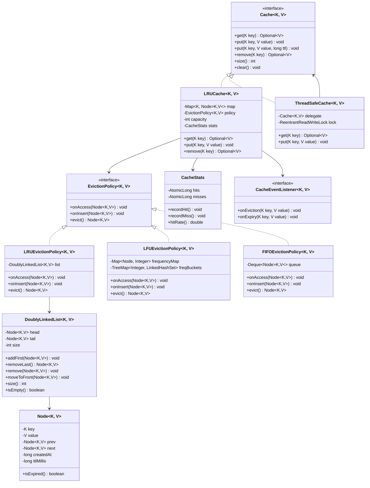

# LRU Cache - Low-Level Design

## 1. Problem Statement

Design a **Least Recently Used (LRU) Cache** that supports `get` and `put` operations in **O(1)** time complexity. When the cache reaches its capacity, it should evict the least recently used item before inserting a new item.

### Requirements
- **Functional**: Get, Put, Remove, Clear operations; configurable capacity; optional TTL
- **Non-Functional**: O(1) time complexity for get/put; thread-safety; extensible eviction policies

---

## 2. UML Class Diagram



---

## 3. Design Patterns Used

| Pattern | Usage |
|---------|-------|
| **Strategy** | `EvictionPolicy` interface allows swapping LRU/LFU/FIFO at runtime |
| **Decorator** | `ThreadSafeCache` wraps any `Cache` to add thread-safety |
| **Observer** | `CacheEventListener` notifies on eviction/expiry events |
| **Template Method** | Base eviction logic in abstract class, specifics in subclasses |
| **Builder** | `CacheBuilder` for fluent cache construction |

---

## 4. SOLID Principles Applied

| Principle | Application |
|-----------|-------------|
| **S** - Single Responsibility | `Node` holds data, `DoublyLinkedList` manages ordering, `CacheStats` tracks metrics |
| **O** - Open/Closed | New eviction policies can be added without modifying `LRUCache` |
| **L** - Liskov Substitution | Any `EvictionPolicy` implementation works interchangeably |
| **I** - Interface Segregation | `Cache` interface is minimal; `CacheEventListener` is separate |
| **D** - Dependency Inversion | `LRUCache` depends on `EvictionPolicy` interface, not concrete classes |

---

## 5. Complete Java Implementation

### 5.1 Node

```java
public class Node<K, V> {
    private K key;
    private V value;
    private Node<K, V> prev;
    private Node<K, V> next;
    private final long createdAt;
    private final long ttlMillis; // -1 means no expiry

    public Node(K key, V value) {
        this(key, value, -1);
    }

    public Node(K key, V value, long ttlMillis) {
        this.key = key;
        this.value = value;
        this.ttlMillis = ttlMillis;
        this.createdAt = System.currentTimeMillis();
    }

    public boolean isExpired() {
        if (ttlMillis < 0) return false;
        return System.currentTimeMillis() - createdAt > ttlMillis;
    }

    // Getters and setters
    public K getKey() { return key; }
    public V getValue() { return value; }
    public void setValue(V value) { this.value = value; }
    public Node<K, V> getPrev() { return prev; }
    public void setPrev(Node<K, V> prev) { this.prev = prev; }
    public Node<K, V> getNext() { return next; }
    public void setNext(Node<K, V> next) { this.next = next; }
}
```

### 5.2 DoublyLinkedList

```java
public class DoublyLinkedList<K, V> {
    private final Node<K, V> head; // sentinel
    private final Node<K, V> tail; // sentinel
    private int size;

    public DoublyLinkedList() {
        head = new Node<>(null, null);
        tail = new Node<>(null, null);
        head.setNext(tail);
        tail.setPrev(head);
        size = 0;
    }

    public void addFirst(Node<K, V> node) {
        node.setNext(head.getNext());
        node.setPrev(head);
        head.getNext().setPrev(node);
        head.setNext(node);
        size++;
    }

    public Node<K, V> removeLast() {
        if (isEmpty()) return null;
        Node<K, V> last = tail.getPrev();
        remove(last);
        return last;
    }

    public void remove(Node<K, V> node) {
        node.getPrev().setNext(node.getNext());
        node.getNext().setPrev(node.getPrev());
        node.setPrev(null);
        node.setNext(null);
        size--;
    }

    public void moveToFront(Node<K, V> node) {
        remove(node);
        addFirst(node);
    }

    public int size() { return size; }
    public boolean isEmpty() { return size == 0; }

    public Node<K, V> getLast() {
        return isEmpty() ? null : tail.getPrev();
    }
}
```

### 5.3 EvictionPolicy Interface

```java
public interface EvictionPolicy<K, V> {
    void onAccess(Node<K, V> node);
    void onInsert(Node<K, V> node);
    void onRemove(Node<K, V> node);
    Node<K, V> evict();
}
```

### 5.4 LRUEvictionPolicy

```java
public class LRUEvictionPolicy<K, V> implements EvictionPolicy<K, V> {
    private final DoublyLinkedList<K, V> list = new DoublyLinkedList<>();

    @Override
    public void onAccess(Node<K, V> node) {
        list.moveToFront(node);
    }

    @Override
    public void onInsert(Node<K, V> node) {
        list.addFirst(node);
    }

    @Override
    public void onRemove(Node<K, V> node) {
        list.remove(node);
    }

    @Override
    public Node<K, V> evict() {
        return list.removeLast();
    }
}
```

### 5.5 LFUEvictionPolicy

```java
public class LFUEvictionPolicy<K, V> implements EvictionPolicy<K, V> {
    private final Map<Node<K, V>, Integer> frequencyMap = new HashMap<>();
    private final TreeMap<Integer, LinkedHashSet<Node<K, V>>> freqBuckets = new TreeMap<>();

    @Override
    public void onAccess(Node<K, V> node) {
        int freq = frequencyMap.getOrDefault(node, 0);
        frequencyMap.put(node, freq + 1);
        // Remove from old bucket
        if (freqBuckets.containsKey(freq)) {
            freqBuckets.get(freq).remove(node);
            if (freqBuckets.get(freq).isEmpty()) freqBuckets.remove(freq);
        }
        // Add to new bucket
        freqBuckets.computeIfAbsent(freq + 1, k -> new LinkedHashSet<>()).add(node);
    }

    @Override
    public void onInsert(Node<K, V> node) {
        frequencyMap.put(node, 1);
        freqBuckets.computeIfAbsent(1, k -> new LinkedHashSet<>()).add(node);
    }

    @Override
    public void onRemove(Node<K, V> node) {
        int freq = frequencyMap.remove(node);
        freqBuckets.get(freq).remove(node);
        if (freqBuckets.get(freq).isEmpty()) freqBuckets.remove(freq);
    }

    @Override
    public Node<K, V> evict() {
        if (freqBuckets.isEmpty()) return null;
        var lowestBucket = freqBuckets.firstEntry().getValue();
        var victim = lowestBucket.iterator().next();
        lowestBucket.remove(victim);
        if (lowestBucket.isEmpty()) freqBuckets.pollFirstEntry();
        frequencyMap.remove(victim);
        return victim;
    }
}
```

### 5.6 FIFOEvictionPolicy

```java
public class FIFOEvictionPolicy<K, V> implements EvictionPolicy<K, V> {
    private final Deque<Node<K, V>> queue = new ArrayDeque<>();

    @Override
    public void onAccess(Node<K, V> node) {
        // FIFO doesn't reorder on access
    }

    @Override
    public void onInsert(Node<K, V> node) {
        queue.addLast(node);
    }

    @Override
    public void onRemove(Node<K, V> node) {
        queue.remove(node);
    }

    @Override
    public Node<K, V> evict() {
        return queue.pollFirst();
    }
}
```

### 5.7 CacheStats

```java
public class CacheStats {
    private final AtomicLong hits = new AtomicLong(0);
    private final AtomicLong misses = new AtomicLong(0);
    private final AtomicLong evictions = new AtomicLong(0);

    public void recordHit() { hits.incrementAndGet(); }
    public void recordMiss() { misses.incrementAndGet(); }
    public void recordEviction() { evictions.incrementAndGet(); }

    public long getHits() { return hits.get(); }
    public long getMisses() { return misses.get(); }
    public long getEvictions() { return evictions.get(); }

    public double hitRate() {
        long total = hits.get() + misses.get();
        return total == 0 ? 0.0 : (double) hits.get() / total;
    }

    @Override
    public String toString() {
        return "CacheStats{hits=%d, misses=%d, evictions=%d, hitRate=%.2f%%}"
            .formatted(hits.get(), misses.get(), evictions.get(), hitRate() * 100);
    }
}
```

### 5.8 CacheEventListener

```java
public interface CacheEventListener<K, V> {
    void onEviction(K key, V value);
    void onExpiry(K key, V value);
    void onPut(K key, V value);
    void onRemove(K key, V value);
}
```

### 5.9 Cache Interface

```java
public interface Cache<K, V> {
    Optional<V> get(K key);
    void put(K key, V value);
    void put(K key, V value, long ttlMillis);
    Optional<V> remove(K key);
    int size();
    void clear();
    CacheStats stats();
}
```

### 5.10 LRUCache Implementation

```java
public class LRUCache<K, V> implements Cache<K, V> {
    private final Map<K, Node<K, V>> map;
    private final EvictionPolicy<K, V> evictionPolicy;
    private final int capacity;
    private final CacheStats stats;
    private final List<CacheEventListener<K, V>> listeners;

    public LRUCache(int capacity) {
        this(capacity, new LRUEvictionPolicy<>());
    }

    public LRUCache(int capacity, EvictionPolicy<K, V> evictionPolicy) {
        if (capacity <= 0) throw new IllegalArgumentException("Capacity must be positive");
        this.capacity = capacity;
        this.map = new HashMap<>(capacity, 0.75f);
        this.evictionPolicy = evictionPolicy;
        this.stats = new CacheStats();
        this.listeners = new ArrayList<>();
    }

    public void addListener(CacheEventListener<K, V> listener) {
        listeners.add(listener);
    }

    @Override
    public Optional<V> get(K key) {
        Node<K, V> node = map.get(key);
        if (node == null) {
            stats.recordMiss();
            return Optional.empty();
        }
        if (node.isExpired()) {
            removeNode(node);
            stats.recordMiss();
            notifyExpiry(node);
            return Optional.empty();
        }
        evictionPolicy.onAccess(node);
        stats.recordHit();
        return Optional.of(node.getValue());
    }

    @Override
    public void put(K key, V value) {
        put(key, value, -1);
    }

    @Override
    public void put(K key, V value, long ttlMillis) {
        Node<K, V> existing = map.get(key);
        if (existing != null) {
            existing.setValue(value);
            evictionPolicy.onAccess(existing);
            return;
        }
        if (map.size() >= capacity) {
            evict();
        }
        Node<K, V> newNode = new Node<>(key, value, ttlMillis);
        map.put(key, newNode);
        evictionPolicy.onInsert(newNode);
        notifyPut(key, value);
    }

    @Override
    public Optional<V> remove(K key) {
        Node<K, V> node = map.remove(key);
        if (node == null) return Optional.empty();
        evictionPolicy.onRemove(node);
        notifyRemove(node);
        return Optional.of(node.getValue());
    }

    @Override
    public int size() { return map.size(); }

    @Override
    public void clear() {
        map.clear();
        // Reset eviction policy state would require a reset method
    }

    @Override
    public CacheStats stats() { return stats; }

    private void evict() {
        Node<K, V> victim = evictionPolicy.evict();
        if (victim != null) {
            map.remove(victim.getKey());
            stats.recordEviction();
            notifyEviction(victim);
        }
    }

    private void removeNode(Node<K, V> node) {
        map.remove(node.getKey());
        evictionPolicy.onRemove(node);
    }

    private void notifyEviction(Node<K, V> node) {
        listeners.forEach(l -> l.onEviction(node.getKey(), node.getValue()));
    }

    private void notifyExpiry(Node<K, V> node) {
        listeners.forEach(l -> l.onExpiry(node.getKey(), node.getValue()));
    }

    private void notifyPut(K key, V value) {
        listeners.forEach(l -> l.onPut(key, value));
    }

    private void notifyRemove(Node<K, V> node) {
        listeners.forEach(l -> l.onRemove(node.getKey(), node.getValue()));
    }
}
```

### 5.11 Thread-Safe Cache (Decorator)

```java
public class ThreadSafeCache<K, V> implements Cache<K, V> {
    private final Cache<K, V> delegate;
    private final ReentrantReadWriteLock lock = new ReentrantReadWriteLock();
    private final ReadLock readLock = lock.readLock();
    private final WriteLock writeLock = lock.writeLock();

    public ThreadSafeCache(Cache<K, V> delegate) {
        this.delegate = delegate;
    }

    @Override
    public Optional<V> get(K key) {
        // Note: get may modify internal state (move to front), so use writeLock
        writeLock.lock();
        try {
            return delegate.get(key);
        } finally {
            writeLock.unlock();
        }
    }

    @Override
    public void put(K key, V value) {
        writeLock.lock();
        try {
            delegate.put(key, value);
        } finally {
            writeLock.unlock();
        }
    }

    @Override
    public void put(K key, V value, long ttlMillis) {
        writeLock.lock();
        try {
            delegate.put(key, value, ttlMillis);
        } finally {
            writeLock.unlock();
        }
    }

    @Override
    public Optional<V> remove(K key) {
        writeLock.lock();
        try {
            return delegate.remove(key);
        } finally {
            writeLock.unlock();
        }
    }

    @Override
    public int size() {
        readLock.lock();
        try {
            return delegate.size();
        } finally {
            readLock.unlock();
        }
    }

    @Override
    public void clear() {
        writeLock.lock();
        try {
            delegate.clear();
        } finally {
            writeLock.unlock();
        }
    }

    @Override
    public CacheStats stats() {
        return delegate.stats(); // CacheStats is already thread-safe (AtomicLong)
    }
}
```

### 5.12 CacheBuilder (Fluent API)

```java
public class CacheBuilder<K, V> {
    private int capacity = 256;
    private EvictionPolicy<K, V> evictionPolicy;
    private boolean threadSafe = false;
    private final List<CacheEventListener<K, V>> listeners = new ArrayList<>();

    public static <K, V> CacheBuilder<K, V> newBuilder() {
        return new CacheBuilder<>();
    }

    public CacheBuilder<K, V> capacity(int capacity) {
        this.capacity = capacity;
        return this;
    }

    public CacheBuilder<K, V> evictionPolicy(EvictionPolicy<K, V> policy) {
        this.evictionPolicy = policy;
        return this;
    }

    public CacheBuilder<K, V> threadSafe() {
        this.threadSafe = true;
        return this;
    }

    public CacheBuilder<K, V> addListener(CacheEventListener<K, V> listener) {
        this.listeners.add(listener);
        return this;
    }

    public Cache<K, V> build() {
        if (evictionPolicy == null) evictionPolicy = new LRUEvictionPolicy<>();
        var cache = new LRUCache<>(capacity, evictionPolicy);
        listeners.forEach(cache::addListener);
        return threadSafe ? new ThreadSafeCache<>(cache) : cache;
    }
}
```

### 5.13 Usage Example

```java
public class Main {
    public static void main(String[] args) {
        // Basic usage
        Cache<String, String> cache = CacheBuilder.<String, String>newBuilder()
            .capacity(100)
            .evictionPolicy(new LRUEvictionPolicy<>())
            .threadSafe()
            .build();

        cache.put("key1", "value1");
        cache.put("key2", "value2", 5000); // 5s TTL

        Optional<String> value = cache.get("key1"); // Optional["value1"]
        System.out.println(cache.stats()); // CacheStats{hits=1, misses=0, ...}

        // Switch to LFU
        Cache<Integer, String> lfuCache = CacheBuilder.<Integer, String>newBuilder()
            .capacity(50)
            .evictionPolicy(new LFUEvictionPolicy<>())
            .build();
    }
}
```

---

## 6. Time & Space Complexity

| Operation | Time | Space |
|-----------|------|-------|
| `get(key)` | O(1) | - |
| `put(key, value)` | O(1) | - |
| `remove(key)` | O(1) | - |
| `evict()` | O(1) | - |
| **Overall Space** | - | O(capacity) |

**Why O(1)?**
- `HashMap` provides O(1) lookup by key
- `DoublyLinkedList` provides O(1) insertion/removal when node reference is known
- Combining both gives O(1) for all cache operations

---

## 7. Relationship Diagram

```
┌─────────────────────────────────────────────────────────────┐
│                        Client                                │
└─────────────────────────┬───────────────────────────────────┘
                          │ uses
                          ▼
┌─────────────────────────────────────────────────────────────┐
│                   Cache<K,V> Interface                        │
└─────────────────────────┬───────────────────────────────────┘
                          │ implemented by
              ┌───────────┼───────────────┐
              ▼                           ▼
┌──────────────────────┐    ┌──────────────────────────┐
│   LRUCache<K,V>      │    │  ThreadSafeCache<K,V>    │
│                      │    │  (Decorator)             │
│  ┌────────────────┐  │    │  - wraps any Cache       │
│  │ HashMap<K,Node>│  │    │  - ReentrantReadWriteLock│
│  └────────────────┘  │    └──────────────────────────┘
│  ┌────────────────┐  │
│  │EvictionPolicy  │──┼──► LRU | LFU | FIFO
│  └────────────────┘  │
│  ┌────────────────┐  │
│  │ CacheStats     │  │
│  └────────────────┘  │
│  ┌────────────────┐  │
│  │ Listeners[]    │  │
│  └────────────────┘  │
└──────────────────────┘
```

---

## 8. Key Interview Points

1. **Why HashMap + DoublyLinkedList?** HashMap gives O(1) key lookup; DLL gives O(1) reordering when we have the node reference.

2. **Why not LinkedHashMap?** It works for simple LRU but lacks flexibility for custom eviction policies, TTL, listeners, and thread-safety control.

3. **Why sentinel nodes in DLL?** Eliminates null checks for head/tail edge cases, simplifying code.

4. **Why ReentrantReadWriteLock over synchronized?** Allows concurrent reads (for `size()`), better throughput under read-heavy workloads. Note: `get()` still needs write lock since it mutates ordering.

5. **Why Strategy pattern for eviction?** Open/Closed principle — add new policies without modifying cache code.

6. **Why Decorator for thread-safety?** Separates concerns; same cache logic works in single-threaded or multi-threaded contexts.

7. **TTL handling**: Lazy expiration on access (no background thread). Trade-off: expired entries occupy memory until accessed. Production systems add a scheduled cleanup thread.

8. **Generics**: `<K, V>` allows type-safe caching of any key-value pair.

---

## 9. Follow-up: Making it Distributed

### Approaches

| Approach | Description | Trade-off |
|----------|-------------|-----------|
| **Consistent Hashing** | Partition keys across nodes | Good scalability, complex rebalancing |
| **Write-Through** | Write to cache + DB synchronously | Strong consistency, higher latency |
| **Write-Behind** | Async write to DB | Better latency, risk of data loss |
| **Replicated** | Full copy on each node | Fast reads, expensive writes |

### Key Considerations
- **Consistency**: Use vector clocks or versioning for conflict resolution
- **Partitioning**: Consistent hashing with virtual nodes
- **Replication**: Configurable replication factor (e.g., RF=3)
- **Failure Detection**: Gossip protocol or heartbeats
- **Eviction Coordination**: Local eviction per node (each node is an independent LRU)
- **Hot Keys**: Use local L1 cache in front of distributed L2

### Architecture

```
Client → Load Balancer → Cache Node (hash(key) % N)
                              │
                              ├── Local LRU Cache (in-memory)
                              ├── Replication to peer nodes
                              └── Persistence layer (optional)
```

### Technologies
- **Redis**: Single-threaded, built-in LRU eviction
- **Memcached**: Multi-threaded, simple key-value
- **Hazelcast/Apache Ignite**: JVM-native distributed cache

---

## 10. Testing Strategy

```java
@Test
void shouldEvictLRUEntry() {
    Cache<Integer, String> cache = new LRUCache<>(2);
    cache.put(1, "a");
    cache.put(2, "b");
    cache.get(1);        // access 1, making 2 the LRU
    cache.put(3, "c");   // evicts 2
    
    assertEquals(Optional.of("a"), cache.get(1));
    assertEquals(Optional.empty(), cache.get(2)); // evicted
    assertEquals(Optional.of("c"), cache.get(3));
}

@Test
void shouldExpireEntryAfterTTL() throws InterruptedException {
    Cache<String, String> cache = new LRUCache<>(10);
    cache.put("key", "value", 100); // 100ms TTL
    
    assertEquals(Optional.of("value"), cache.get("key"));
    Thread.sleep(150);
    assertEquals(Optional.empty(), cache.get("key")); // expired
}

@Test
void shouldTrackHitMissRatio() {
    Cache<Integer, String> cache = new LRUCache<>(5);
    cache.put(1, "a");
    cache.get(1);  // hit
    cache.get(2);  // miss
    
    assertEquals(0.5, cache.stats().hitRate(), 0.001);
}
```
