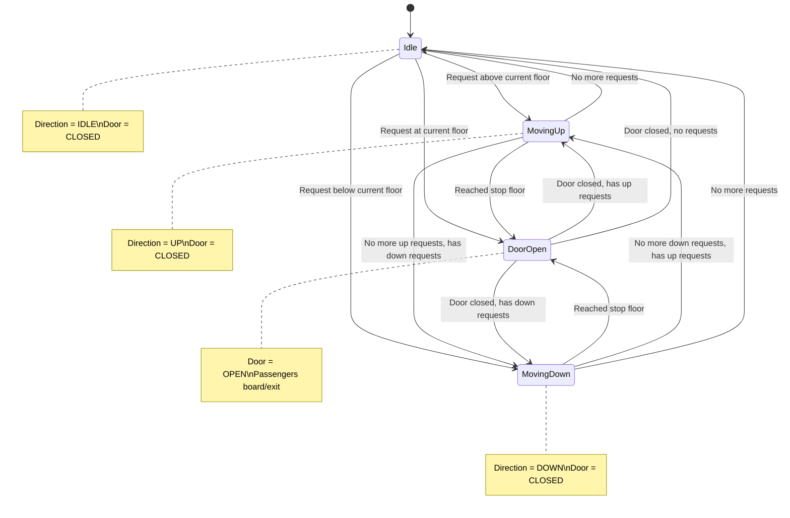
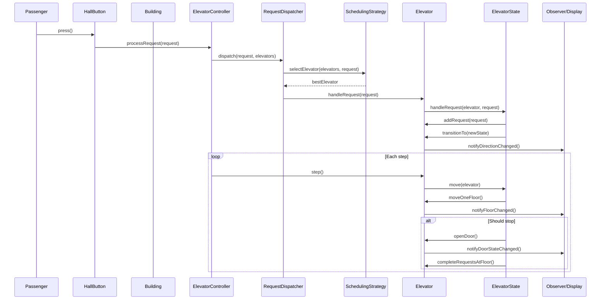

# Low-Level Design: Elevator System

## 1. Problem Statement

Design a multi-elevator system for a building that efficiently handles passenger requests from multiple floors. The system should:
- Manage N elevators serving M floors
- Handle both hall calls (from floors) and cabin calls (from inside elevator)
- Optimize elevator scheduling to minimize wait time
- Handle concurrent requests safely
- Support multiple scheduling algorithms
- Maintain elevator states (idle, moving, door open/closed)

---

## 2. UML Class Diagram

```mermaid
classDiagram
    class Direction {
        <<enumeration>>
        UP
        DOWN
        IDLE
    }

    class DoorState {
        <<enumeration>>
        OPEN
        CLOSED
    }

    class Request {
        -int sourceFloor
        -int destinationFloor
        -Direction direction
        -long timestamp
    }

    class Button {
        <<abstract>>
        #boolean pressed
        +press()
        +reset()
    }

    class HallButton {
        -int floor
        -Direction direction
        +press()
    }

    class CabinButton {
        -int floor
        +press()
    }

    class Floor {
        -int floorNumber
        -HallButton upButton
        -HallButton downButton
        -Display display
    }

    class Elevator {
        -int id
        -int currentFloor
        -Direction direction
        -DoorState doorState
        -ElevatorState state
        -List~Request~ requests
        -int capacity
        -int currentLoad
    }

    class ElevatorState {
        <<interface>>
        +handleRequest(Elevator, Request)
        +move(Elevator)
        +openDoor(Elevator)
        +closeDoor(Elevator)
        +getStateName() String
    }

    class IdleState {
        +handleRequest(Elevator, Request)
        +move(Elevator)
        +openDoor(Elevator)
        +closeDoor(Elevator)
    }

    class MovingUpState {
        +handleRequest(Elevator, Request)
        +move(Elevator)
        +openDoor(Elevator)
        +closeDoor(Elevator)
    }

    class MovingDownState {
        +handleRequest(Elevator, Request)
        +move(Elevator)
        +openDoor(Elevator)
        +closeDoor(Elevator)
    }

    class DoorOpenState {
        +handleRequest(Elevator, Request)
        +move(Elevator)
        +openDoor(Elevator)
        +closeDoor(Elevator)
    }

    class ElevatorSchedulingStrategy {
        <<interface>>
        +selectElevator(List~Elevator~, Request) Elevator
        +getNextStop(Elevator) int
    }

    class LOOKAlgorithm {
        +selectElevator(List~Elevator~, Request) Elevator
        +getNextStop(Elevator) int
    }

    class FCFSStrategy {
        +selectElevator(List~Elevator~, Request) Elevator
        +getNextStop(Elevator) int
    }

    class ShortestSeekFirstStrategy {
        +selectElevator(List~Elevator~, Request) Elevator
        +getNextStop(Elevator) int
    }

    class ElevatorController {
        -List~Elevator~ elevators
        -ElevatorSchedulingStrategy strategy
        -RequestDispatcher dispatcher
        +processRequest(Request)
        +step()
    }

    class RequestDispatcher {
        -ElevatorSchedulingStrategy strategy
        +dispatch(Request, List~Elevator~) Elevator
    }

    class ElevatorObserver {
        <<interface>>
        +onFloorChanged(int elevatorId, int floor)
        +onDirectionChanged(int elevatorId, Direction)
        +onDoorStateChanged(int elevatorId, DoorState)
    }

    class FloorDisplay {
        -int floor
        +onFloorChanged(int elevatorId, int floor)
        +onDirectionChanged(int elevatorId, Direction)
        +onDoorStateChanged(int elevatorId, DoorState)
    }

    class ElevatorCommand {
        <<interface>>
        +execute()
        +undo()
    }

    class MoveCommand {
        -Elevator elevator
        -int targetFloor
        +execute()
        +undo()
    }

    class StopCommand {
        -Elevator elevator
        +execute()
        +undo()
    }

    class OpenDoorCommand {
        -Elevator elevator
        +execute()
        +undo()
    }

    class Building {
        -List~Floor~ floors
        -ElevatorController controller
        -int totalFloors
        +placeRequest(Request)
    }

    Button <|-- HallButton
    Button <|-- CabinButton
    ElevatorState <|.. IdleState
    ElevatorState <|.. MovingUpState
    ElevatorState <|.. MovingDownState
    ElevatorState <|.. DoorOpenState
    ElevatorSchedulingStrategy <|.. LOOKAlgorithm
    ElevatorSchedulingStrategy <|.. FCFSStrategy
    ElevatorSchedulingStrategy <|.. ShortestSeekFirstStrategy
    ElevatorObserver <|.. FloorDisplay
    ElevatorCommand <|.. MoveCommand
    ElevatorCommand <|.. StopCommand
    ElevatorCommand <|.. OpenDoorCommand
    Elevator --> ElevatorState
    Elevator --> Direction
    Elevator --> DoorState
    Elevator *-- "many" Request
    Elevator --> "many" ElevatorObserver
    ElevatorController *-- "many" Elevator
    ElevatorController --> ElevatorSchedulingStrategy
    ElevatorController --> RequestDispatcher
    RequestDispatcher --> ElevatorSchedulingStrategy
    Building *-- "many" Floor
    Building --> ElevatorController
    Floor *-- HallButton
    Floor --> FloorDisplay
```



---

## 3. Design Patterns Used

| Pattern | Usage |
|---------|-------|
| **State** | Elevator behavior changes based on state (Idle, MovingUp, MovingDown, DoorOpen) |
| **Strategy** | Interchangeable scheduling algorithms (LOOK, FCFS, ShortestSeekFirst) |
| **Observer** | Floor displays and notifications react to elevator state changes |
| **Command** | Encapsulate elevator operations for queuing, undo, and logging |
| **Singleton** | ElevatorController as single point of coordination |

---

## 4. SOLID Principles Applied

| Principle | Application |
|-----------|-------------|
| **SRP** | Each class has one responsibility — Elevator manages state, Dispatcher assigns requests, Strategy decides scheduling |
| **OCP** | New scheduling algorithms added without modifying existing code (Strategy interface) |
| **LSP** | All ElevatorState implementations are interchangeable |
| **ISP** | Separate Button interface for HallButton and CabinButton; Observer has focused methods |
| **DIP** | Controller depends on ElevatorSchedulingStrategy interface, not concrete implementations |

---

## 5. Complete Java Implementation

### Enums

```java
public enum Direction {
    UP, DOWN, IDLE;

    public Direction opposite() {
        return switch (this) {
            case UP -> DOWN;
            case DOWN -> UP;
            case IDLE -> IDLE;
        };
    }
}

public enum DoorState {
    OPEN, CLOSED
}
```

### Request Model

```java
public record Request(
    int sourceFloor,
    int destinationFloor,
    Direction direction,
    long timestamp
) implements Comparable<Request> {

    public Request(int sourceFloor, int destinationFloor) {
        this(sourceFloor, destinationFloor,
             destinationFloor > sourceFloor ? Direction.UP : Direction.DOWN,
             System.currentTimeMillis());
    }

    public static Request hallCall(int floor, Direction direction) {
        int dest = direction == Direction.UP ? floor + 1 : floor - 1;
        return new Request(floor, dest, direction, System.currentTimeMillis());
    }

    @Override
    public int compareTo(Request other) {
        return Long.compare(this.timestamp, other.timestamp);
    }
}
```

### Observer Interface

```java
public interface ElevatorObserver {
    void onFloorChanged(int elevatorId, int floor);
    void onDirectionChanged(int elevatorId, Direction direction);
    void onDoorStateChanged(int elevatorId, DoorState doorState);
    void onRequestCompleted(int elevatorId, Request request);
}

public class FloorDisplay implements ElevatorObserver {
    private final int floor;
    private final Map<Integer, Integer> elevatorPositions = new ConcurrentHashMap<>();
    private final Map<Integer, Direction> elevatorDirections = new ConcurrentHashMap<>();

    public FloorDisplay(int floor) {
        this.floor = floor;
    }

    @Override
    public void onFloorChanged(int elevatorId, int currentFloor) {
        elevatorPositions.put(elevatorId, currentFloor);
        System.out.printf("[Display Floor %d] Elevator %d at floor %d%n", floor, elevatorId, currentFloor);
    }

    @Override
    public void onDirectionChanged(int elevatorId, Direction direction) {
        elevatorDirections.put(elevatorId, direction);
        System.out.printf("[Display Floor %d] Elevator %d direction: %s%n", floor, elevatorId, direction);
    }

    @Override
    public void onDoorStateChanged(int elevatorId, DoorState doorState) {
        if (elevatorPositions.getOrDefault(elevatorId, -1) == floor) {
            System.out.printf("[Display Floor %d] Elevator %d door: %s%n", floor, elevatorId, doorState);
        }
    }

    @Override
    public void onRequestCompleted(int elevatorId, Request request) {
        // Log for analytics
    }
}
```

### Command Pattern

```java
public sealed interface ElevatorCommand permits MoveCommand, StopCommand, OpenDoorCommand, CloseDoorCommand {
    void execute();
    void undo();
}

public record MoveCommand(Elevator elevator, int targetFloor) implements ElevatorCommand {
    @Override
    public void execute() {
        int current = elevator.getCurrentFloor();
        Direction dir = targetFloor > current ? Direction.UP : Direction.DOWN;
        elevator.setDirection(dir);
        elevator.moveOneFloor();
        System.out.printf("Elevator %d moving %s to floor %d%n", elevator.getId(), dir, elevator.getCurrentFloor());
    }

    @Override
    public void undo() {
        Direction opposite = elevator.getDirection().opposite();
        elevator.setDirection(opposite);
        elevator.moveOneFloor();
    }
}

public record StopCommand(Elevator elevator) implements ElevatorCommand {
    @Override
    public void execute() {
        elevator.setDirection(Direction.IDLE);
        elevator.transitionTo(new IdleState());
        System.out.printf("Elevator %d stopped at floor %d%n", elevator.getId(), elevator.getCurrentFloor());
    }

    @Override
    public void undo() {
        // Cannot undo a stop meaningfully
    }
}

public record OpenDoorCommand(Elevator elevator) implements ElevatorCommand {
    @Override
    public void execute() {
        elevator.setDoorState(DoorState.OPEN);
        elevator.transitionTo(new DoorOpenState());
        System.out.printf("Elevator %d doors opened at floor %d%n", elevator.getId(), elevator.getCurrentFloor());
    }

    @Override
    public void undo() {
        elevator.setDoorState(DoorState.CLOSED);
    }
}

public record CloseDoorCommand(Elevator elevator) implements ElevatorCommand {
    @Override
    public void execute() {
        elevator.setDoorState(DoorState.CLOSED);
        System.out.printf("Elevator %d doors closed at floor %d%n", elevator.getId(), elevator.getCurrentFloor());
    }

    @Override
    public void undo() {
        elevator.setDoorState(DoorState.OPEN);
    }
}
```

### State Pattern

```java
public interface ElevatorState {
    void handleRequest(Elevator elevator, Request request);
    void move(Elevator elevator);
    void openDoor(Elevator elevator);
    void closeDoor(Elevator elevator);
    String getStateName();
}

public class IdleState implements ElevatorState {

    @Override
    public void handleRequest(Elevator elevator, Request request) {
        int currentFloor = elevator.getCurrentFloor();
        if (request.sourceFloor() == currentFloor) {
            elevator.transitionTo(new DoorOpenState());
            elevator.openDoor();
        } else if (request.sourceFloor() > currentFloor) {
            elevator.setDirection(Direction.UP);
            elevator.transitionTo(new MovingUpState());
            elevator.addRequest(request);
        } else {
            elevator.setDirection(Direction.DOWN);
            elevator.transitionTo(new MovingDownState());
            elevator.addRequest(request);
        }
    }

    @Override
    public void move(Elevator elevator) {
        // No-op: idle elevator doesn't move
    }

    @Override
    public void openDoor(Elevator elevator) {
        elevator.setDoorState(DoorState.OPEN);
        elevator.transitionTo(new DoorOpenState());
    }

    @Override
    public void closeDoor(Elevator elevator) {
        // Already closed in idle
    }

    @Override
    public String getStateName() {
        return "IDLE";
    }
}

public class MovingUpState implements ElevatorState {

    @Override
    public void handleRequest(Elevator elevator, Request request) {
        elevator.addRequest(request);
    }

    @Override
    public void move(Elevator elevator) {
        elevator.moveOneFloor(); // increments current floor
        int currentFloor = elevator.getCurrentFloor();

        if (elevator.shouldStopAt(currentFloor)) {
            elevator.transitionTo(new DoorOpenState());
            elevator.openDoor();
            elevator.completeRequestsAtFloor(currentFloor);
        }

        if (!elevator.hasRequestsInDirection(Direction.UP)) {
            if (elevator.hasRequestsInDirection(Direction.DOWN)) {
                elevator.setDirection(Direction.DOWN);
                elevator.transitionTo(new MovingDownState());
            } else {
                elevator.setDirection(Direction.IDLE);
                elevator.transitionTo(new IdleState());
            }
        }
    }

    @Override
    public void openDoor(Elevator elevator) {
        // Cannot open door while moving
        System.out.println("Cannot open door while moving!");
    }

    @Override
    public void closeDoor(Elevator elevator) {
        // Door already closed while moving
    }

    @Override
    public String getStateName() {
        return "MOVING_UP";
    }
}

public class MovingDownState implements ElevatorState {

    @Override
    public void handleRequest(Elevator elevator, Request request) {
        elevator.addRequest(request);
    }

    @Override
    public void move(Elevator elevator) {
        elevator.moveOneFloor(); // decrements current floor
        int currentFloor = elevator.getCurrentFloor();

        if (elevator.shouldStopAt(currentFloor)) {
            elevator.transitionTo(new DoorOpenState());
            elevator.openDoor();
            elevator.completeRequestsAtFloor(currentFloor);
        }

        if (!elevator.hasRequestsInDirection(Direction.DOWN)) {
            if (elevator.hasRequestsInDirection(Direction.UP)) {
                elevator.setDirection(Direction.UP);
                elevator.transitionTo(new MovingUpState());
            } else {
                elevator.setDirection(Direction.IDLE);
                elevator.transitionTo(new IdleState());
            }
        }
    }

    @Override
    public void openDoor(Elevator elevator) {
        System.out.println("Cannot open door while moving!");
    }

    @Override
    public void closeDoor(Elevator elevator) {
        // Already closed
    }

    @Override
    public String getStateName() {
        return "MOVING_DOWN";
    }
}

public class DoorOpenState implements ElevatorState {
    private static final long DOOR_OPEN_DURATION_MS = 3000;

    @Override
    public void handleRequest(Elevator elevator, Request request) {
        elevator.addRequest(request);
    }

    @Override
    public void move(Elevator elevator) {
        System.out.println("Cannot move with door open! Closing door first.");
        closeDoor(elevator);
    }

    @Override
    public void openDoor(Elevator elevator) {
        elevator.setDoorState(DoorState.OPEN);
        elevator.notifyDoorStateChanged();
    }

    @Override
    public void closeDoor(Elevator elevator) {
        elevator.setDoorState(DoorState.CLOSED);
        elevator.notifyDoorStateChanged();

        if (elevator.hasRequests()) {
            if (elevator.hasRequestsInDirection(elevator.getDirection())) {
                if (elevator.getDirection() == Direction.UP) {
                    elevator.transitionTo(new MovingUpState());
                } else {
                    elevator.transitionTo(new MovingDownState());
                }
            } else {
                elevator.setDirection(elevator.getDirection().opposite());
                if (elevator.getDirection() == Direction.UP) {
                    elevator.transitionTo(new MovingUpState());
                } else {
                    elevator.transitionTo(new MovingDownState());
                }
            }
        } else {
            elevator.setDirection(Direction.IDLE);
            elevator.transitionTo(new IdleState());
        }
    }

    @Override
    public String getStateName() {
        return "DOOR_OPEN";
    }
}
```

### Elevator Class

```java
public class Elevator {
    private final int id;
    private int currentFloor;
    private Direction direction;
    private DoorState doorState;
    private ElevatorState state;
    private final TreeSet<Integer> upStops;
    private final TreeSet<Integer> downStops;
    private final List<Request> pendingRequests;
    private final List<ElevatorObserver> observers;
    private final int capacity;
    private int currentLoad;
    private final int minFloor;
    private final int maxFloor;

    public Elevator(int id, int minFloor, int maxFloor, int capacity) {
        this.id = id;
        this.currentFloor = minFloor;
        this.direction = Direction.IDLE;
        this.doorState = DoorState.CLOSED;
        this.state = new IdleState();
        this.upStops = new TreeSet<>();
        this.downStops = new TreeSet<>();
        this.pendingRequests = new CopyOnWriteArrayList<>();
        this.observers = new CopyOnWriteArrayList<>();
        this.capacity = capacity;
        this.currentLoad = 0;
        this.minFloor = minFloor;
        this.maxFloor = maxFloor;
    }

    public synchronized void handleRequest(Request request) {
        state.handleRequest(this, request);
    }

    public synchronized void step() {
        state.move(this);
    }

    public void addRequest(Request request) {
        pendingRequests.add(request);
        if (request.sourceFloor() > currentFloor || request.destinationFloor() > currentFloor) {
            if (request.sourceFloor() > currentFloor) upStops.add(request.sourceFloor());
            if (request.destinationFloor() > currentFloor) upStops.add(request.destinationFloor());
        }
        if (request.sourceFloor() < currentFloor || request.destinationFloor() < currentFloor) {
            if (request.sourceFloor() < currentFloor) downStops.add(request.sourceFloor());
            if (request.destinationFloor() < currentFloor) downStops.add(request.destinationFloor());
        }
        // Handle same floor
        if (request.sourceFloor() == currentFloor) {
            if (request.direction() == Direction.UP) upStops.add(request.destinationFloor());
            else downStops.add(request.destinationFloor());
        }
    }

    public void moveOneFloor() {
        if (direction == Direction.UP && currentFloor < maxFloor) {
            currentFloor++;
        } else if (direction == Direction.DOWN && currentFloor > minFloor) {
            currentFloor--;
        }
        notifyFloorChanged();
    }

    public boolean shouldStopAt(int floor) {
        return upStops.contains(floor) || downStops.contains(floor);
    }

    public void completeRequestsAtFloor(int floor) {
        upStops.remove(floor);
        downStops.remove(floor);
        pendingRequests.removeIf(r ->
            r.sourceFloor() == floor || r.destinationFloor() == floor
        );
        observers.forEach(o -> o.onRequestCompleted(id, null));
    }

    public boolean hasRequests() {
        return !upStops.isEmpty() || !downStops.isEmpty();
    }

    public boolean hasRequestsInDirection(Direction dir) {
        return switch (dir) {
            case UP -> !upStops.isEmpty() && upStops.last() > currentFloor;
            case DOWN -> !downStops.isEmpty() && downStops.first() < currentFloor;
            case IDLE -> false;
        };
    }

    public int getNextStopInDirection() {
        return switch (direction) {
            case UP -> upStops.isEmpty() ? currentFloor : upStops.higher(currentFloor) != null ? upStops.higher(currentFloor) : currentFloor;
            case DOWN -> downStops.isEmpty() ? currentFloor : downStops.lower(currentFloor) != null ? downStops.lower(currentFloor) : currentFloor;
            case IDLE -> currentFloor;
        };
    }

    public void transitionTo(ElevatorState newState) {
        System.out.printf("Elevator %d: %s -> %s%n", id, state.getStateName(), newState.getStateName());
        this.state = newState;
    }

    public void openDoor() {
        this.doorState = DoorState.OPEN;
        notifyDoorStateChanged();
    }

    public void closeDoor() {
        state.closeDoor(this);
    }

    // Observer management
    public void addObserver(ElevatorObserver observer) { observers.add(observer); }
    public void removeObserver(ElevatorObserver observer) { observers.remove(observer); }

    public void notifyFloorChanged() {
        observers.forEach(o -> o.onFloorChanged(id, currentFloor));
    }

    public void notifyDoorStateChanged() {
        observers.forEach(o -> o.onDoorStateChanged(id, doorState));
    }

    public void notifyDirectionChanged() {
        observers.forEach(o -> o.onDirectionChanged(id, direction));
    }

    // Getters and setters
    public int getId() { return id; }
    public int getCurrentFloor() { return currentFloor; }
    public Direction getDirection() { return direction; }
    public DoorState getDoorState() { return doorState; }
    public ElevatorState getState() { return state; }
    public int getCapacity() { return capacity; }
    public int getCurrentLoad() { return currentLoad; }
    public boolean isFull() { return currentLoad >= capacity; }
    public int getPendingRequestCount() { return pendingRequests.size(); }

    public void setDirection(Direction direction) {
        this.direction = direction;
        notifyDirectionChanged();
    }

    public void setDoorState(DoorState doorState) {
        this.doorState = doorState;
    }

    public int distanceTo(int floor) {
        return Math.abs(currentFloor - floor);
    }

    @Override
    public String toString() {
        return "Elevator{id=%d, floor=%d, dir=%s, state=%s, upStops=%s, downStops=%s}"
            .formatted(id, currentFloor, direction, state.getStateName(), upStops, downStops);
    }
}
```

### Scheduling Strategy Pattern

```java
public interface ElevatorSchedulingStrategy {
    Elevator selectElevator(List<Elevator> elevators, Request request);
    int getNextStop(Elevator elevator);
}

/**
 * LOOK Algorithm (Elevator/SCAN variant):
 * - Continues in current direction until no more requests ahead
 * - Then reverses direction
 * - Selects elevator that will reach the floor soonest in its current sweep
 */
public class LOOKAlgorithm implements ElevatorSchedulingStrategy {

    @Override
    public Elevator selectElevator(List<Elevator> elevators, Request request) {
        Elevator best = null;
        int bestScore = Integer.MAX_VALUE;

        for (Elevator elevator : elevators) {
            if (elevator.isFull()) continue;

            int score = calculateScore(elevator, request);
            if (score < bestScore) {
                bestScore = score;
                best = elevator;
            }
        }
        return best != null ? best : elevators.get(0);
    }

    private int calculateScore(Elevator elevator, Request request) {
        int distance = elevator.distanceTo(request.sourceFloor());
        Direction elevDir = elevator.getDirection();
        int requestFloor = request.sourceFloor();
        int currentFloor = elevator.getCurrentFloor();

        // Idle elevator: just distance
        if (elevDir == Direction.IDLE) {
            return distance;
        }

        // Moving toward request in same direction
        boolean movingToward = (elevDir == Direction.UP && requestFloor >= currentFloor)
                            || (elevDir == Direction.DOWN && requestFloor <= currentFloor);

        if (movingToward && elevDir == request.direction()) {
            return distance; // Best case: on the way
        }

        if (movingToward) {
            return distance + 2; // Will pass but different direction
        }

        // Moving away: must reverse
        return distance * 2 + elevator.getPendingRequestCount();
    }

    @Override
    public int getNextStop(Elevator elevator) {
        return elevator.getNextStopInDirection();
    }
}

/**
 * First Come First Serve: assigns to least busy elevator
 */
public class FCFSStrategy implements ElevatorSchedulingStrategy {

    @Override
    public Elevator selectElevator(List<Elevator> elevators, Request request) {
        return elevators.stream()
            .filter(e -> !e.isFull())
            .min(Comparator.comparingInt(Elevator::getPendingRequestCount))
            .orElse(elevators.get(0));
    }

    @Override
    public int getNextStop(Elevator elevator) {
        return elevator.getNextStopInDirection();
    }
}

/**
 * Shortest Seek First: selects elevator closest to the request floor
 */
public class ShortestSeekFirstStrategy implements ElevatorSchedulingStrategy {

    @Override
    public Elevator selectElevator(List<Elevator> elevators, Request request) {
        return elevators.stream()
            .filter(e -> !e.isFull())
            .min(Comparator.comparingInt(e -> e.distanceTo(request.sourceFloor())))
            .orElse(elevators.get(0));
    }

    @Override
    public int getNextStop(Elevator elevator) {
        return elevator.getNextStopInDirection();
    }
}
```

### Request Dispatcher

```java
public class RequestDispatcher {
    private final ElevatorSchedulingStrategy strategy;

    public RequestDispatcher(ElevatorSchedulingStrategy strategy) {
        this.strategy = strategy;
    }

    public Elevator dispatch(Request request, List<Elevator> elevators) {
        Elevator selected = strategy.selectElevator(elevators, request);
        System.out.printf("Dispatching request [floor %d -> %d] to Elevator %d%n",
            request.sourceFloor(), request.destinationFloor(), selected.getId());
        selected.handleRequest(request);
        return selected;
    }
}
```

### Elevator Controller

```java
public class ElevatorController {
    private final List<Elevator> elevators;
    private final RequestDispatcher dispatcher;
    private final ElevatorSchedulingStrategy strategy;
    private final Queue<Request> pendingQueue;
    private final ScheduledExecutorService scheduler;
    private volatile boolean running;

    public ElevatorController(int numElevators, int minFloor, int maxFloor, int capacity,
                              ElevatorSchedulingStrategy strategy) {
        this.elevators = new ArrayList<>();
        this.strategy = strategy;
        this.dispatcher = new RequestDispatcher(strategy);
        this.pendingQueue = new ConcurrentLinkedQueue<>();
        this.scheduler = Executors.newScheduledThreadPool(1);
        this.running = false;

        for (int i = 0; i < numElevators; i++) {
            elevators.add(new Elevator(i + 1, minFloor, maxFloor, capacity));
        }
    }

    public void processRequest(Request request) {
        pendingQueue.offer(request);
        processPendingRequests();
    }

    private synchronized void processPendingRequests() {
        while (!pendingQueue.isEmpty()) {
            Request request = pendingQueue.poll();
            if (request != null) {
                dispatcher.dispatch(request, elevators);
            }
        }
    }

    public void step() {
        elevators.forEach(Elevator::step);
    }

    public void start(long intervalMs) {
        running = true;
        scheduler.scheduleAtFixedRate(() -> {
            if (running) {
                step();
                processPendingRequests();
            }
        }, 0, intervalMs, TimeUnit.MILLISECONDS);
    }

    public void stop() {
        running = false;
        scheduler.shutdown();
    }

    public void setStrategy(ElevatorSchedulingStrategy newStrategy) {
        // Strategy can be swapped at runtime
    }

    public List<Elevator> getElevators() {
        return Collections.unmodifiableList(elevators);
    }

    public void addObserverToAll(ElevatorObserver observer) {
        elevators.forEach(e -> e.addObserver(observer));
    }

    public void status() {
        System.out.println("=== Elevator System Status ===");
        elevators.forEach(e -> System.out.println(e));
        System.out.println("==============================");
    }
}
```

### Button Classes

```java
public abstract sealed class Button permits HallButton, CabinButton {
    protected boolean pressed;
    protected final ElevatorController controller;

    protected Button(ElevatorController controller) {
        this.controller = controller;
        this.pressed = false;
    }

    public abstract void press();

    public void reset() {
        this.pressed = false;
    }

    public boolean isPressed() {
        return pressed;
    }
}

public final class HallButton extends Button {
    private final int floor;
    private final Direction direction;

    public HallButton(int floor, Direction direction, ElevatorController controller) {
        super(controller);
        this.floor = floor;
        this.direction = direction;
    }

    @Override
    public void press() {
        this.pressed = true;
        Request request = Request.hallCall(floor, direction);
        controller.processRequest(request);
        System.out.printf("Hall button pressed: Floor %d, Direction %s%n", floor, direction);
    }
}

public final class CabinButton extends Button {
    private final int elevatorId;
    private final int targetFloor;

    public CabinButton(int elevatorId, int targetFloor, ElevatorController controller) {
        super(controller);
        this.elevatorId = elevatorId;
        this.targetFloor = targetFloor;
    }

    @Override
    public void press() {
        this.pressed = true;
        // Cabin button creates request from current elevator floor to target
        Elevator elevator = controller.getElevators().stream()
            .filter(e -> e.getId() == elevatorId)
            .findFirst()
            .orElseThrow();
        Request request = new Request(elevator.getCurrentFloor(), targetFloor);
        elevator.handleRequest(request);
        System.out.printf("Cabin button pressed: Elevator %d, Target floor %d%n", elevatorId, targetFloor);
    }
}
```

### Floor and Building

```java
public class Floor {
    private final int floorNumber;
    private final HallButton upButton;
    private final HallButton downButton;
    private final FloorDisplay display;

    public Floor(int floorNumber, int maxFloor, ElevatorController controller) {
        this.floorNumber = floorNumber;
        this.upButton = floorNumber < maxFloor ? new HallButton(floorNumber, Direction.UP, controller) : null;
        this.downButton = floorNumber > 0 ? new HallButton(floorNumber, Direction.DOWN, controller) : null;
        this.display = new FloorDisplay(floorNumber);
        controller.addObserverToAll(display);
    }

    public void pressUp() {
        if (upButton != null) upButton.press();
    }

    public void pressDown() {
        if (downButton != null) downButton.press();
    }

    public FloorDisplay getDisplay() { return display; }
    public int getFloorNumber() { return floorNumber; }
}

public class Building {
    private final List<Floor> floors;
    private final ElevatorController controller;
    private final int totalFloors;

    public Building(int totalFloors, int numElevators, int elevatorCapacity,
                    ElevatorSchedulingStrategy strategy) {
        this.totalFloors = totalFloors;
        this.controller = new ElevatorController(numElevators, 0, totalFloors - 1, elevatorCapacity, strategy);
        this.floors = new ArrayList<>();

        for (int i = 0; i < totalFloors; i++) {
            floors.add(new Floor(i, totalFloors - 1, controller));
        }
    }

    public void placeHallRequest(int floor, Direction direction) {
        if (floor < 0 || floor >= totalFloors) {
            throw new IllegalArgumentException("Invalid floor: " + floor);
        }
        if (direction == Direction.UP) {
            floors.get(floor).pressUp();
        } else {
            floors.get(floor).pressDown();
        }
    }

    public void placeCabinRequest(int elevatorId, int targetFloor) {
        if (targetFloor < 0 || targetFloor >= totalFloors) {
            throw new IllegalArgumentException("Invalid floor: " + targetFloor);
        }
        Elevator elevator = controller.getElevators().stream()
            .filter(e -> e.getId() == elevatorId)
            .findFirst()
            .orElseThrow(() -> new IllegalArgumentException("Invalid elevator: " + elevatorId));
        Request request = new Request(elevator.getCurrentFloor(), targetFloor);
        elevator.handleRequest(request);
    }

    public void simulate(int steps) {
        controller.start(1000);
        try {
            Thread.sleep(steps * 1000L);
        } catch (InterruptedException e) {
            Thread.currentThread().interrupt();
        }
        controller.stop();
    }

    public void step() {
        controller.step();
    }

    public void status() {
        controller.status();
    }

    public ElevatorController getController() { return controller; }
}
```

### Main - Demo

```java
public class ElevatorSystemDemo {
    public static void main(String[] args) {
        // Create a 10-floor building with 3 elevators, capacity 10, using LOOK algorithm
        Building building = new Building(10, 3, 10, new LOOKAlgorithm());

        System.out.println("=== Elevator System Simulation ===\n");

        // Simulate hall calls
        building.placeHallRequest(0, Direction.UP);   // Ground floor, going up
        building.placeHallRequest(7, Direction.DOWN); // Floor 7, going down
        building.placeHallRequest(3, Direction.UP);   // Floor 3, going up

        building.status();

        // Run simulation steps
        for (int i = 0; i < 15; i++) {
            System.out.printf("%n--- Step %d ---%n", i + 1);
            building.step();
            building.status();
        }

        // Add cabin request mid-simulation
        building.placeCabinRequest(1, 9); // Elevator 1 passenger wants floor 9

        for (int i = 15; i < 25; i++) {
            System.out.printf("%n--- Step %d ---%n", i + 1);
            building.step();
        }

        building.status();
    }
}
```

---

## 6. State Machine Diagram



---

## 7. Sequence Diagram - Request Flow



---

## 8. Key Interview Points

### Why State Pattern for Elevator?
- Eliminates complex if-else chains for state-dependent behavior
- Each state encapsulates its own transition logic
- Adding new states (e.g., MaintenanceState, EmergencyState) requires no changes to existing states
- Makes behavior predictable and testable per-state

### Why Strategy for Scheduling?
- Different buildings need different algorithms (hospital vs. office vs. residential)
- Can swap algorithms at runtime based on traffic patterns
- Easy A/B testing of scheduling approaches
- LOOK is standard but SSF may be better for low-traffic scenarios

### LOOK Algorithm Explained
- Elevator continues in current direction serving all requests on the way
- Reverses only when no more requests ahead in current direction
- Prevents starvation (unlike SSTF which can starve distant requests)
- Similar to disk scheduling SCAN but doesn't go to extremes

### Thread Safety Considerations
- `CopyOnWriteArrayList` for observers (rare writes, frequent reads)
- `synchronized` on elevator state transitions
- `ConcurrentLinkedQueue` for request buffering
- `TreeSet` operations are not thread-safe — guarded by elevator's synchronized methods

### Capacity and Overload
- Elevator tracks `currentLoad` vs `capacity`
- Dispatcher skips full elevators during selection
- Real systems use weight sensors

### Extensibility Points
- Add `EmergencyState` that overrides all behavior
- Add `VIPRequest` with priority scheduling
- Add `ZonedElevator` serving only certain floors
- Add `EnergyEfficientStrategy` minimizing total travel distance
- Add `PeakHourStrategy` that pre-positions elevators at busy floors

### Common Interview Follow-ups

| Question | Answer |
|----------|--------|
| How to handle emergency? | Add EmergencyState that moves all elevators to ground floor, opens doors, and disables new requests |
| How to handle power failure? | Each elevator has UPS to reach nearest floor, open doors, then shutdown |
| How to prioritize? | Use PriorityQueue in requests with VIP/emergency/normal levels |
| How to handle maintenance? | Add MaintenanceState; dispatcher excludes that elevator |
| Real-time vs step simulation? | Use ScheduledExecutorService with configurable tick rate |
| How to scale? | Each elevator controller runs independently; central dispatcher coordinates |

### Time & Space Complexity

| Operation | Time | Space |
|-----------|------|-------|
| Select elevator (LOOK) | O(E) where E = num elevators | O(1) |
| Select elevator (SSF) | O(E) | O(1) |
| Add request to elevator | O(log R) where R = requests (TreeSet) | O(R) |
| Move one step | O(1) | O(1) |
| Notify observers | O(O) where O = num observers | O(1) |
| Overall dispatch | O(E + log R) | O(E * R) |

---

## 9. Imports Reference

```java
import java.util.*;
import java.util.concurrent.*;
import java.util.stream.*;
```
