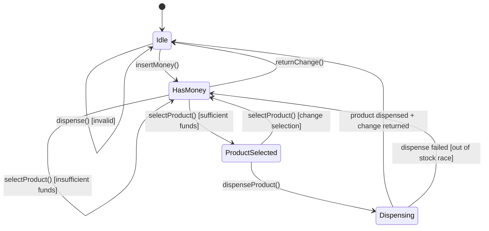
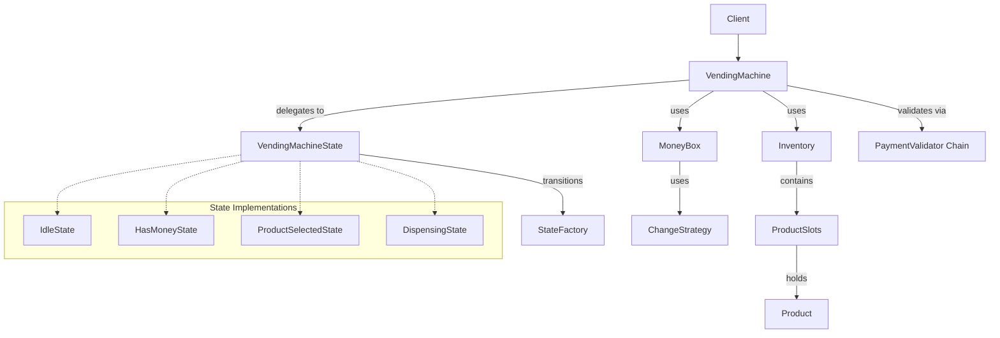

# Low-Level Design: Vending Machine

## 1. Problem Statement

Design a Vending Machine that:
- Accepts coins and notes as payment
- Maintains inventory of products
- Dispenses products after successful payment
- Returns change using optimal coin/note combinations
- Handles edge cases: insufficient payment, out-of-stock, exact change only
- Manages state transitions cleanly (idle → money inserted → product selected → dispensing)

**Key Insight**: The Vending Machine is a classic **State Pattern** problem. The machine behaves differently based on its current state.

---

## 2. Design Patterns Used

| Pattern | Purpose |
|---------|---------|
| **State Pattern** (Primary) | Machine behavior changes based on current state |
| **Strategy Pattern** | Different change-calculation strategies |
| **Factory Pattern** | Creating state objects |
| **Chain of Responsibility** | Payment validation pipeline |
| **Singleton** | VendingMachine instance |

---

## 3. UML Class Diagram

```mermaid
classDiagram
    class VendingMachine {
        -VendingMachineState currentState
        -Inventory inventory
        -MoneyBox moneyBox
        -double currentBalance
        -Product selectedProduct
        +insertMoney(Currency)
        +selectProduct(String)
        +dispenseProduct()
        +returnChange()
        +setState(VendingMachineState)
        +getCurrentBalance() double
        +getSelectedProduct() Product
    }

    class VendingMachineState {
        <<interface>>
        +insertMoney(VendingMachine, Currency)
        +selectProduct(VendingMachine, String)
        +dispenseProduct(VendingMachine)
        +returnChange(VendingMachine)
    }

    class IdleState {
        +insertMoney(VendingMachine, Currency)
        +selectProduct(VendingMachine, String)
        +dispenseProduct(VendingMachine)
        +returnChange(VendingMachine)
    }

    class HasMoneyState {
        +insertMoney(VendingMachine, Currency)
        +selectProduct(VendingMachine, String)
        +dispenseProduct(VendingMachine)
        +returnChange(VendingMachine)
    }

    class ProductSelectedState {
        +insertMoney(VendingMachine, Currency)
        +selectProduct(VendingMachine, String)
        +dispenseProduct(VendingMachine)
        +returnChange(VendingMachine)
    }

    class DispensingState {
        +insertMoney(VendingMachine, Currency)
        +selectProduct(VendingMachine, String)
        +dispenseProduct(VendingMachine)
        +returnChange(VendingMachine)
    }

    class Product {
        -String id
        -String name
        -double price
        -ProductCategory category
    }

    class Inventory {
        -Map~String, ProductSlot~ slots
        +addProduct(Product, int)
        +getProduct(String) Product
        +reduceStock(String)
        +isAvailable(String) boolean
    }

    class ProductSlot {
        -Product product
        -int quantity
    }

    class Currency {
        <<interface>>
        +getValue() double
        +getType() CurrencyType
    }

    class Coin {
        <<enumeration>>
        PENNY(0.01)
        NICKEL(0.05)
        DIME(0.10)
        QUARTER(0.25)
    }

    class Note {
        <<enumeration>>
        ONE(1.0)
        FIVE(5.0)
        TEN(10.0)
        TWENTY(20.0)
    }

    class MoneyBox {
        -Map~Currency, Integer~ availableCurrency
        +addMoney(Currency)
        +calculateChange(double) List~Currency~
        +canMakeChange(double) boolean
    }

    class PaymentValidator {
        <<interface>>
        +validate(Currency, VendingMachine) boolean
        +setNext(PaymentValidator)
    }

    class CurrencyTypeValidator {
        -PaymentValidator next
    }

    class AmountValidator {
        -PaymentValidator next
    }

    class ChangeStrategy {
        <<interface>>
        +calculateChange(double, Map) List~Currency~
    }

    class GreedyChangeStrategy {
        +calculateChange(double, Map) List~Currency~
    }

    VendingMachineState <|.. IdleState
    VendingMachineState <|.. HasMoneyState
    VendingMachineState <|.. ProductSelectedState
    VendingMachineState <|.. DispensingState
    VendingMachine --> VendingMachineState
    VendingMachine --> Inventory
    VendingMachine --> MoneyBox
    Inventory --> ProductSlot
    ProductSlot --> Product
    Currency <|.. Coin
    Currency <|.. Note
    MoneyBox --> ChangeStrategy
    ChangeStrategy <|.. GreedyChangeStrategy
    PaymentValidator <|.. CurrencyTypeValidator
    PaymentValidator <|.. AmountValidator
```



---

## 4. State Machine Diagram



---

## 5. SOLID Principles Applied

| Principle | Application |
|-----------|-------------|
| **SRP** | Each state class handles behavior for one state only |
| **OCP** | New states can be added without modifying existing code |
| **LSP** | All state implementations are interchangeable via interface |
| **ISP** | `Currency` interface is minimal; `ChangeStrategy` is focused |
| **DIP** | `VendingMachine` depends on `VendingMachineState` abstraction |

---

## 6. Complete Java Implementation

### 6.1 Enums and Currency

```java
// === Currency.java ===
public sealed interface Currency permits Coin, Note {
    double getValue();
    String getDisplayName();
}

// === Coin.java ===
public enum Coin implements Currency {
    PENNY(0.01, "Penny"),
    NICKEL(0.05, "Nickel"),
    DIME(0.10, "Dime"),
    QUARTER(0.25, "Quarter");

    private final double value;
    private final String displayName;

    Coin(double value, String displayName) {
        this.value = value;
        this.displayName = displayName;
    }

    @Override
    public double getValue() { return value; }

    @Override
    public String getDisplayName() { return displayName; }
}

// === Note.java ===
public enum Note implements Currency {
    ONE(1.0, "$1"),
    FIVE(5.0, "$5"),
    TEN(10.0, "$10"),
    TWENTY(20.0, "$20");

    private final double value;
    private final String displayName;

    Note(double value, String displayName) {
        this.value = value;
        this.displayName = displayName;
    }

    @Override
    public double getValue() { return value; }

    @Override
    public String getDisplayName() { return displayName; }
}

// === ProductCategory.java ===
public enum ProductCategory {
    BEVERAGE, SNACK, CANDY, CHIPS
}
```

### 6.2 Models

```java
// === Product.java ===
public record Product(
    String id,
    String name,
    double price,
    ProductCategory category
) {
    public Product {
        if (price <= 0) throw new IllegalArgumentException("Price must be positive");
        if (id == null || id.isBlank()) throw new IllegalArgumentException("ID required");
    }
}

// === ProductSlot.java ===
public class ProductSlot {
    private final Product product;
    private int quantity;

    public ProductSlot(Product product, int quantity) {
        this.product = product;
        this.quantity = quantity;
    }

    public Product getProduct() { return product; }
    public int getQuantity() { return quantity; }
    public boolean isAvailable() { return quantity > 0; }

    public void reduceQuantity() {
        if (quantity <= 0) throw new IllegalStateException("Out of stock");
        quantity--;
    }

    public void addQuantity(int amount) {
        this.quantity += amount;
    }
}
```

### 6.3 Inventory Management

```java
// === Inventory.java ===
public class Inventory {
    private final Map<String, ProductSlot> slots = new ConcurrentHashMap<>();

    public void addProduct(Product product, int quantity) {
        slots.merge(product.id(),
            new ProductSlot(product, quantity),
            (existing, newSlot) -> {
                existing.addQuantity(quantity);
                return existing;
            });
    }

    public Optional<Product> getProduct(String productId) {
        return Optional.ofNullable(slots.get(productId))
                       .map(ProductSlot::getProduct);
    }

    public boolean isAvailable(String productId) {
        var slot = slots.get(productId);
        return slot != null && slot.isAvailable();
    }

    public void reduceStock(String productId) {
        var slot = slots.get(productId);
        if (slot == null) throw new ProductNotFoundException(productId);
        slot.reduceQuantity();
    }

    public List<Product> getAvailableProducts() {
        return slots.values().stream()
            .filter(ProductSlot::isAvailable)
            .map(ProductSlot::getProduct)
            .toList();
    }

    public int getStock(String productId) {
        var slot = slots.get(productId);
        return slot != null ? slot.getQuantity() : 0;
    }
}
```

### 6.4 Change Calculation (Strategy Pattern)

```java
// === ChangeStrategy.java ===
public interface ChangeStrategy {
    List<Currency> calculateChange(double amount, Map<Currency, Integer> available);
}

// === GreedyChangeStrategy.java ===
public class GreedyChangeStrategy implements ChangeStrategy {

    @Override
    public List<Currency> calculateChange(double amount, Map<Currency, Integer> available) {
        List<Currency> change = new ArrayList<>();
        double remaining = Math.round(amount * 100.0) / 100.0; // avoid floating point issues

        // Sort currencies by value descending
        List<Currency> sortedCurrencies = available.keySet().stream()
            .sorted(Comparator.comparingDouble(Currency::getValue).reversed())
            .toList();

        for (Currency currency : sortedCurrencies) {
            int availableCount = available.getOrDefault(currency, 0);
            while (remaining >= currency.getValue() - 0.001 && availableCount > 0) {
                change.add(currency);
                remaining = Math.round((remaining - currency.getValue()) * 100.0) / 100.0;
                availableCount--;
            }
        }

        if (remaining > 0.001) {
            throw new InsufficientChangeException(
                "Cannot make exact change. Remaining: " + remaining);
        }

        return change;
    }
}

// === MoneyBox.java ===
public class MoneyBox {
    private final Map<Currency, Integer> availableCurrency = new EnumMap<>(Coin.class);
    private final ChangeStrategy changeStrategy;

    public MoneyBox(ChangeStrategy changeStrategy) {
        this.changeStrategy = changeStrategy;
        // Initialize with all currency types at 0
        for (Coin coin : Coin.values()) availableCurrency.put(coin, 0);
        for (Note note : Note.values()) availableCurrency.put(note, 0);
    }

    public void addMoney(Currency currency) {
        availableCurrency.merge(currency, 1, Integer::sum);
    }

    public void removeMoney(Currency currency) {
        availableCurrency.computeIfPresent(currency, (k, v) -> v > 0 ? v - 1 : 0);
    }

    public List<Currency> calculateChange(double amount) {
        if (amount <= 0.001) return List.of();
        List<Currency> change = changeStrategy.calculateChange(amount, availableCurrency);
        // Actually remove the change from the box
        change.forEach(this::removeMoney);
        return change;
    }

    public boolean canMakeChange(double amount) {
        try {
            // Simulate without removing
            changeStrategy.calculateChange(amount, new HashMap<>(availableCurrency));
            return true;
        } catch (InsufficientChangeException e) {
            return false;
        }
    }

    public void loadCoins(Coin coin, int count) {
        availableCurrency.merge(coin, count, Integer::sum);
    }

    public void loadNotes(Note note, int count) {
        availableCurrency.merge(note, count, Integer::sum);
    }
}
```

### 6.5 Chain of Responsibility (Payment Validation)

```java
// === PaymentValidator.java ===
public abstract class PaymentValidator {
    protected PaymentValidator next;

    public PaymentValidator setNext(PaymentValidator next) {
        this.next = next;
        return next;
    }

    public abstract ValidationResult validate(Currency currency, VendingMachine machine);

    protected ValidationResult passToNext(Currency currency, VendingMachine machine) {
        if (next != null) return next.validate(currency, machine);
        return ValidationResult.success();
    }
}

// === ValidationResult.java ===
public record ValidationResult(boolean valid, String message) {
    public static ValidationResult success() { return new ValidationResult(true, "OK"); }
    public static ValidationResult failure(String msg) { return new ValidationResult(false, msg); }
}

// === CurrencyTypeValidator.java ===
public class CurrencyTypeValidator extends PaymentValidator {
    private final Set<Class<? extends Currency>> acceptedTypes;

    public CurrencyTypeValidator(Set<Class<? extends Currency>> acceptedTypes) {
        this.acceptedTypes = acceptedTypes;
    }

    @Override
    public ValidationResult validate(Currency currency, VendingMachine machine) {
        if (!acceptedTypes.contains(currency.getClass()) &&
            !acceptedTypes.stream().anyMatch(t -> t.isInstance(currency))) {
            return ValidationResult.failure("Currency type not accepted: " + currency.getDisplayName());
        }
        return passToNext(currency, machine);
    }
}

// === MaxAmountValidator.java ===
public class MaxAmountValidator extends PaymentValidator {
    private final double maxBalance;

    public MaxAmountValidator(double maxBalance) {
        this.maxBalance = maxBalance;
    }

    @Override
    public ValidationResult validate(Currency currency, VendingMachine machine) {
        if (machine.getCurrentBalance() + currency.getValue() > maxBalance) {
            return ValidationResult.failure(
                "Maximum balance exceeded. Max: $" + maxBalance);
        }
        return passToNext(currency, machine);
    }
}

// === ChangeAvailabilityValidator.java ===
public class ChangeAvailabilityValidator extends PaymentValidator {

    @Override
    public ValidationResult validate(Currency currency, VendingMachine machine) {
        // Warn if machine is low on change (doesn't reject, just logs)
        double potentialBalance = machine.getCurrentBalance() + currency.getValue();
        double cheapestProduct = machine.getCheapestProductPrice();
        double potentialChange = potentialBalance - cheapestProduct;

        if (potentialChange > 0 && !machine.getMoneyBox().canMakeChange(potentialChange)) {
            // Still accept, but log warning
            System.out.println("WARNING: Machine may not be able to make full change");
        }
        return passToNext(currency, machine);
    }
}
```

### 6.6 State Pattern (Core Implementation)

```java
// === VendingMachineState.java ===
public interface VendingMachineState {
    void insertMoney(VendingMachine machine, Currency currency);
    void selectProduct(VendingMachine machine, String productId);
    void dispenseProduct(VendingMachine machine);
    void returnChange(VendingMachine machine);

    String getStateName();
}

// === IdleState.java ===
public class IdleState implements VendingMachineState {

    @Override
    public void insertMoney(VendingMachine machine, Currency currency) {
        var result = machine.validatePayment(currency);
        if (!result.valid()) {
            System.out.println("Payment rejected: " + result.message());
            return;
        }

        machine.addToBalance(currency.getValue());
        machine.getMoneyBox().addMoney(currency);
        System.out.printf("Inserted %s. Balance: $%.2f%n",
            currency.getDisplayName(), machine.getCurrentBalance());
        machine.setState(StateFactory.getState(MachineState.HAS_MONEY));
    }

    @Override
    public void selectProduct(VendingMachine machine, String productId) {
        System.out.println("Please insert money first.");
    }

    @Override
    public void dispenseProduct(VendingMachine machine) {
        System.out.println("Please insert money and select a product first.");
    }

    @Override
    public void returnChange(VendingMachine machine) {
        System.out.println("No money to return.");
    }

    @Override
    public String getStateName() { return "IDLE"; }
}

// === HasMoneyState.java ===
public class HasMoneyState implements VendingMachineState {

    @Override
    public void insertMoney(VendingMachine machine, Currency currency) {
        var result = machine.validatePayment(currency);
        if (!result.valid()) {
            System.out.println("Payment rejected: " + result.message());
            return;
        }

        machine.addToBalance(currency.getValue());
        machine.getMoneyBox().addMoney(currency);
        System.out.printf("Inserted %s. Balance: $%.2f%n",
            currency.getDisplayName(), machine.getCurrentBalance());
    }

    @Override
    public void selectProduct(VendingMachine machine, String productId) {
        var productOpt = machine.getInventory().getProduct(productId);

        if (productOpt.isEmpty()) {
            System.out.println("Product not found: " + productId);
            return;
        }

        Product product = productOpt.get();

        if (!machine.getInventory().isAvailable(productId)) {
            System.out.println("Product out of stock: " + product.name());
            return;
        }

        if (machine.getCurrentBalance() < product.price()) {
            System.out.printf("Insufficient funds. Price: $%.2f, Balance: $%.2f%n",
                product.price(), machine.getCurrentBalance());
            return;
        }

        // Check if we can make change before committing
        double changeNeeded = machine.getCurrentBalance() - product.price();
        if (changeNeeded > 0 && !machine.getMoneyBox().canMakeChange(changeNeeded)) {
            System.out.println("Cannot make change. Please use exact amount or select different product.");
            return;
        }

        machine.setSelectedProduct(product);
        System.out.println("Product selected: " + product.name());
        machine.setState(StateFactory.getState(MachineState.PRODUCT_SELECTED));
    }

    @Override
    public void dispenseProduct(VendingMachine machine) {
        System.out.println("Please select a product first.");
    }

    @Override
    public void returnChange(VendingMachine machine) {
        double balance = machine.getCurrentBalance();
        if (balance > 0) {
            List<Currency> change = machine.getMoneyBox().calculateChange(balance);
            System.out.printf("Returning $%.2f: %s%n", balance,
                change.stream().map(Currency::getDisplayName).toList());
            machine.resetBalance();
        }
        machine.setState(StateFactory.getState(MachineState.IDLE));
    }

    @Override
    public String getStateName() { return "HAS_MONEY"; }
}

// === ProductSelectedState.java ===
public class ProductSelectedState implements VendingMachineState {

    @Override
    public void insertMoney(VendingMachine machine, Currency currency) {
        System.out.println("Product already selected. Dispensing...");
        dispenseProduct(machine);
    }

    @Override
    public void selectProduct(VendingMachine machine, String productId) {
        System.out.println("Product already selected. Please wait for dispensing.");
    }

    @Override
    public void dispenseProduct(VendingMachine machine) {
        Product product = machine.getSelectedProduct();
        machine.setState(StateFactory.getState(MachineState.DISPENSING));
        machine.dispenseProduct(); // delegate to dispensing state
    }

    @Override
    public void returnChange(VendingMachine machine) {
        System.out.println("Cannot return change during product selection. Cancelling...");
        machine.setSelectedProduct(null);
        machine.setState(StateFactory.getState(MachineState.HAS_MONEY));
        machine.returnChange();
    }

    @Override
    public String getStateName() { return "PRODUCT_SELECTED"; }
}

// === DispensingState.java ===
public class DispensingState implements VendingMachineState {

    @Override
    public void insertMoney(VendingMachine machine, Currency currency) {
        System.out.println("Please wait. Dispensing in progress...");
    }

    @Override
    public void selectProduct(VendingMachine machine, String productId) {
        System.out.println("Please wait. Dispensing in progress...");
    }

    @Override
    public void dispenseProduct(VendingMachine machine) {
        Product product = machine.getSelectedProduct();

        // Double-check availability (race condition guard)
        if (!machine.getInventory().isAvailable(product.id())) {
            System.out.println("ERROR: Product became unavailable. Returning money.");
            machine.setSelectedProduct(null);
            machine.setState(StateFactory.getState(MachineState.HAS_MONEY));
            machine.returnChange();
            return;
        }

        // Dispense
        machine.getInventory().reduceStock(product.id());
        System.out.println("=== DISPENSING: " + product.name() + " ===");

        // Calculate and return change
        double changeAmount = machine.getCurrentBalance() - product.price();
        if (changeAmount > 0.001) {
            List<Currency> change = machine.getMoneyBox().calculateChange(changeAmount);
            System.out.printf("Change returned: $%.2f → %s%n", changeAmount,
                change.stream().map(Currency::getDisplayName).toList());
        }

        // Reset machine
        machine.resetBalance();
        machine.setSelectedProduct(null);
        machine.setState(StateFactory.getState(MachineState.IDLE));
        System.out.println("Thank you! Machine ready for next transaction.");
    }

    @Override
    public void returnChange(VendingMachine machine) {
        System.out.println("Cannot cancel during dispensing.");
    }

    @Override
    public String getStateName() { return "DISPENSING"; }
}
```

### 6.7 State Factory

```java
// === MachineState.java ===
public enum MachineState {
    IDLE, HAS_MONEY, PRODUCT_SELECTED, DISPENSING
}

// === StateFactory.java ===
public class StateFactory {
    private static final Map<MachineState, VendingMachineState> states = Map.of(
        MachineState.IDLE, new IdleState(),
        MachineState.HAS_MONEY, new HasMoneyState(),
        MachineState.PRODUCT_SELECTED, new ProductSelectedState(),
        MachineState.DISPENSING, new DispensingState()
    );

    public static VendingMachineState getState(MachineState state) {
        return states.get(state);
    }
}
```

### 6.8 VendingMachine (Context)

```java
// === VendingMachine.java ===
public class VendingMachine {
    private VendingMachineState currentState;
    private final Inventory inventory;
    private final MoneyBox moneyBox;
    private final PaymentValidator validatorChain;
    private double currentBalance;
    private Product selectedProduct;

    private VendingMachine(Builder builder) {
        this.inventory = builder.inventory;
        this.moneyBox = builder.moneyBox;
        this.validatorChain = builder.validatorChain;
        this.currentState = StateFactory.getState(MachineState.IDLE);
        this.currentBalance = 0.0;
    }

    // === Delegated operations (State Pattern) ===
    public void insertMoney(Currency currency) {
        currentState.insertMoney(this, currency);
    }

    public void selectProduct(String productId) {
        currentState.selectProduct(this, productId);
    }

    public void dispenseProduct() {
        currentState.dispenseProduct(this);
    }

    public void returnChange() {
        currentState.returnChange(this);
    }

    // === Internal methods used by states ===
    public void setState(VendingMachineState state) {
        System.out.println("[State: " + currentState.getStateName() + " → " + state.getStateName() + "]");
        this.currentState = state;
    }

    public ValidationResult validatePayment(Currency currency) {
        return validatorChain.validate(currency, this);
    }

    public void addToBalance(double amount) {
        this.currentBalance = Math.round((currentBalance + amount) * 100.0) / 100.0;
    }

    public void resetBalance() {
        this.currentBalance = 0.0;
    }

    public double getCurrentBalance() { return currentBalance; }
    public Product getSelectedProduct() { return selectedProduct; }
    public void setSelectedProduct(Product product) { this.selectedProduct = product; }
    public Inventory getInventory() { return inventory; }
    public MoneyBox getMoneyBox() { return moneyBox; }

    public double getCheapestProductPrice() {
        return inventory.getAvailableProducts().stream()
            .mapToDouble(Product::price)
            .min()
            .orElse(Double.MAX_VALUE);
    }

    public String getCurrentStateName() {
        return currentState.getStateName();
    }

    // === Builder ===
    public static class Builder {
        private Inventory inventory = new Inventory();
        private MoneyBox moneyBox = new MoneyBox(new GreedyChangeStrategy());
        private PaymentValidator validatorChain;

        public Builder inventory(Inventory inventory) {
            this.inventory = inventory;
            return this;
        }

        public Builder moneyBox(MoneyBox moneyBox) {
            this.moneyBox = moneyBox;
            return this;
        }

        public Builder validatorChain(PaymentValidator chain) {
            this.validatorChain = chain;
            return this;
        }

        public VendingMachine build() {
            if (validatorChain == null) {
                // Default chain
                var typeValidator = new CurrencyTypeValidator(Set.of(Coin.class, Note.class));
                var maxValidator = new MaxAmountValidator(50.0);
                typeValidator.setNext(maxValidator);
                this.validatorChain = typeValidator;
            }
            return new VendingMachine(this);
        }
    }
}
```

### 6.9 Custom Exceptions

```java
// === ProductNotFoundException.java ===
public class ProductNotFoundException extends RuntimeException {
    public ProductNotFoundException(String productId) {
        super("Product not found: " + productId);
    }
}

// === InsufficientChangeException.java ===
public class InsufficientChangeException extends RuntimeException {
    public InsufficientChangeException(String message) {
        super(message);
    }
}

// === InsufficientFundsException.java ===
public class InsufficientFundsException extends RuntimeException {
    private final double required;
    private final double available;

    public InsufficientFundsException(double required, double available) {
        super(String.format("Insufficient funds. Required: $%.2f, Available: $%.2f",
            required, available));
        this.required = required;
        this.available = available;
    }
}
```

### 6.10 Demo / Client Code

```java
// === VendingMachineDemo.java ===
public class VendingMachineDemo {
    public static void main(String[] args) {
        // Setup inventory
        var inventory = new Inventory();
        inventory.addProduct(new Product("COKE", "Coca-Cola", 1.50, ProductCategory.BEVERAGE), 5);
        inventory.addProduct(new Product("PEPSI", "Pepsi", 1.50, ProductCategory.BEVERAGE), 3);
        inventory.addProduct(new Product("CHIPS", "Lay's Chips", 2.00, ProductCategory.CHIPS), 4);
        inventory.addProduct(new Product("CANDY", "Snickers", 1.25, ProductCategory.CANDY), 10);

        // Setup money box with change
        var moneyBox = new MoneyBox(new GreedyChangeStrategy());
        moneyBox.loadCoins(Coin.QUARTER, 20);
        moneyBox.loadCoins(Coin.DIME, 20);
        moneyBox.loadCoins(Coin.NICKEL, 20);
        moneyBox.loadCoins(Coin.PENNY, 50);

        // Build machine
        var machine = new VendingMachine.Builder()
            .inventory(inventory)
            .moneyBox(moneyBox)
            .build();

        // === Scenario 1: Successful purchase ===
        System.out.println("\n--- Scenario 1: Buy Coke with exact change ---");
        machine.insertMoney(Coin.QUARTER);
        machine.insertMoney(Coin.QUARTER);
        machine.insertMoney(Coin.QUARTER);
        machine.insertMoney(Coin.QUARTER);
        machine.insertMoney(Coin.QUARTER);
        machine.insertMoney(Coin.QUARTER);
        machine.selectProduct("COKE");
        machine.dispenseProduct();

        // === Scenario 2: Purchase with change ===
        System.out.println("\n--- Scenario 2: Buy Candy with $5 note ---");
        machine.insertMoney(Note.FIVE);
        machine.selectProduct("CANDY");
        machine.dispenseProduct();

        // === Scenario 3: Insufficient funds ===
        System.out.println("\n--- Scenario 3: Insufficient funds ---");
        machine.insertMoney(Coin.QUARTER);
        machine.selectProduct("CHIPS");
        machine.returnChange();

        // === Scenario 4: Out of stock ===
        System.out.println("\n--- Scenario 4: Product unavailable ---");
        machine.insertMoney(Note.FIVE);
        machine.selectProduct("NONEXIST");
        machine.returnChange();
    }
}
```

---

## 7. Relationship Diagram



---

## 8. Key Interview Points

### Why State Pattern?

1. **The vending machine IS a finite state machine** — behavior depends entirely on current state
2. **Eliminates massive if-else/switch blocks** — each state encapsulates its own logic
3. **State transitions are explicit** — easy to reason about and debug
4. **Open/Closed Principle** — add new states without modifying existing ones

### Why NOT just use enums + switch?

```java
// BAD: This doesn't scale
switch (state) {
    case IDLE -> { /* 50 lines */ }
    case HAS_MONEY -> { /* 80 lines */ }
    // ... grows unmanageable
}
```

With State Pattern, each state is its own class with single responsibility.

### Change Calculation — Greedy Algorithm

- Sort denominations largest-first
- Take as many of the largest as possible
- Move to next denomination
- Time: O(n × k) where n = denominations, k = max coins needed
- Greedy works for standard currency denominations (canonical coin systems)

### Thread Safety Considerations

- `Inventory` uses `ConcurrentHashMap`
- State transitions should be `synchronized` in production
- Double-check stock in `DispensingState` (optimistic locking pattern)

---

## 9. Common Interview Follow-ups

| Question | Answer |
|----------|--------|
| How to handle concurrent users? | Synchronized state transitions or per-slot locking |
| How to add a new payment method (UPI/card)? | Extend `Currency` interface, add new validator in chain |
| How to support "exact change only" mode? | Add a state or flag that skips change calculation validation |
| What if greedy algorithm fails? | Use DP-based change making for non-canonical denominations |
| How to add admin operations (refill, collect money)? | Add `AdminState` or separate `AdminPanel` class |
| How to persist machine state? | Serialize state + balance + inventory to DB; restore on startup |
| How to add display/notifications? | Observer Pattern — machine notifies display on state change |
| Why sealed interface for Currency? | Restricts implementations to known types (Coin, Note) at compile time |

---

## 10. Complexity Analysis

| Operation | Time | Space |
|-----------|------|-------|
| Insert money | O(v) — v = validators in chain | O(1) |
| Select product | O(1) — HashMap lookup | O(1) |
| Dispense | O(1) | O(1) |
| Calculate change | O(d × k) — d = denominations, k = coins in change | O(k) |
| Check availability | O(1) | O(1) |

---

## 11. Extensions for Production

```java
// Observer for display updates
public interface VendingMachineObserver {
    void onStateChange(MachineState from, MachineState to);
    void onProductDispensed(Product product);
    void onError(String message);
}

// Event sourcing for audit trail
public record MachineEvent(
    Instant timestamp,
    String eventType,
    Map<String, Object> data
) {}

// Admin interface
public interface AdminOperations {
    void refillProduct(String productId, int quantity);
    void collectMoney();
    void loadChange(Map<Currency, Integer> change);
    MachineReport generateReport();
}
```
