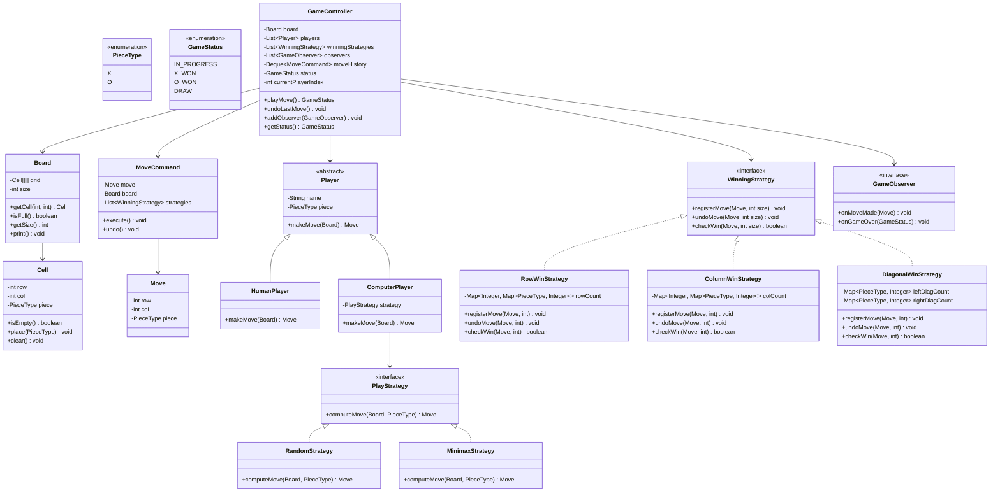
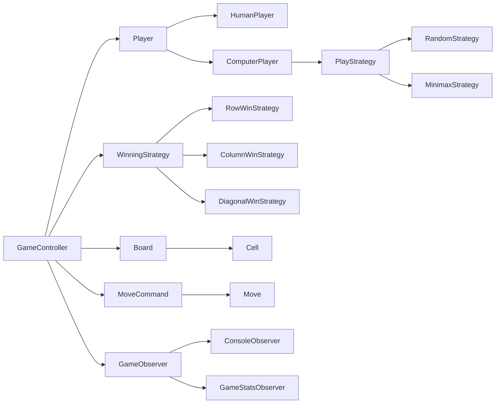

# Low-Level Design: Tic-Tac-Toe (NxN)

## 1. Problem Statement

Design a flexible Tic-Tac-Toe game that:
- Supports an NxN board (not just 3x3)
- Supports Human vs Human, Human vs Computer, Computer vs Computer
- Detects wins in O(1) time per move using counter-based approach
- Supports undo functionality (Command Pattern)
- Is extensible for different AI strategies (Strategy Pattern)
- Notifies observers on game state changes (Observer Pattern)

---

## 2. UML Class Diagram



---

## 3. Design Patterns Used

| Pattern | Where | Why |
|---------|-------|-----|
| **Strategy** | `PlayStrategy` for AI players | Swap AI algorithms without changing `ComputerPlayer` |
| **Observer** | `GameObserver` interface | Decouple UI/logging from game logic |
| **Command** | `MoveCommand` | Enable undo/redo of moves |
| **Factory** | `PlayerFactory` | Encapsulate player creation logic |
| **Template Method** | `Player.makeMove()` | Common interface, different implementations |

---

## 4. SOLID Principles Applied

| Principle | Application |
|-----------|-------------|
| **S** - Single Responsibility | `Board` manages grid, `GameController` manages flow, `WinningStrategy` checks wins |
| **O** - Open/Closed | New winning strategies or AI strategies added without modifying existing code |
| **L** - Liskov Substitution | `HumanPlayer` and `ComputerPlayer` are interchangeable via `Player` |
| **I** - Interface Segregation | `WinningStrategy` and `PlayStrategy` are small, focused interfaces |
| **D** - Dependency Inversion | `GameController` depends on abstractions (`Player`, `WinningStrategy`), not concretions |

---

## 5. Complete Java Implementation

### 5.1 Enums

```java
public enum PieceType {
    X(1), O(-1);

    private final int value;

    PieceType(int value) {
        this.value = value;
    }

    public int getValue() {
        return value;
    }
}

public enum GameStatus {
    IN_PROGRESS,
    X_WON,
    O_WON,
    DRAW
}
```

### 5.2 Cell

```java
public class Cell {
    private final int row;
    private final int col;
    private PieceType piece;

    public Cell(int row, int col) {
        this.row = row;
        this.col = col;
        this.piece = null;
    }

    public boolean isEmpty() {
        return piece == null;
    }

    public void place(PieceType piece) {
        if (!isEmpty()) {
            throw new IllegalStateException("Cell already occupied");
        }
        this.piece = piece;
    }

    public void clear() {
        this.piece = null;
    }

    public int getRow() { return row; }
    public int getCol() { return col; }
    public PieceType getPiece() { return piece; }
}
```

### 5.3 Board

```java
public class Board {
    private final Cell[][] grid;
    private final int size;
    private int filledCells;

    public Board(int size) {
        this.size = size;
        this.grid = new Cell[size][size];
        this.filledCells = 0;
        for (int i = 0; i < size; i++) {
            for (int j = 0; j < size; j++) {
                grid[i][j] = new Cell(i, j);
            }
        }
    }

    public Cell getCell(int row, int col) {
        validateBounds(row, col);
        return grid[row][col];
    }

    public void placePiece(int row, int col, PieceType piece) {
        validateBounds(row, col);
        grid[row][col].place(piece);
        filledCells++;
    }

    public void removePiece(int row, int col) {
        validateBounds(row, col);
        grid[row][col].clear();
        filledCells--;
    }

    public boolean isFull() {
        return filledCells == size * size;
    }

    public int getSize() { return size; }

    public void print() {
        for (int i = 0; i < size; i++) {
            for (int j = 0; j < size; j++) {
                PieceType p = grid[i][j].getPiece();
                System.out.print(p == null ? "." : p.name());
                if (j < size - 1) System.out.print(" | ");
            }
            System.out.println();
            if (i < size - 1) {
                System.out.println("-".repeat(size * 4 - 3));
            }
        }
        System.out.println();
    }

    private void validateBounds(int row, int col) {
        if (row < 0 || row >= size || col < 0 || col >= size) {
            throw new IllegalArgumentException("Position out of bounds");
        }
    }
}
```

### 5.4 Move

```java
public record Move(int row, int col, PieceType piece) {
    public Move {
        if (piece == null) throw new IllegalArgumentException("Piece cannot be null");
    }
}
```

### 5.5 Player Hierarchy

```java
public abstract class Player {
    protected final String name;
    protected final PieceType piece;

    protected Player(String name, PieceType piece) {
        this.name = name;
        this.piece = piece;
    }

    public abstract Move makeMove(Board board);

    public String getName() { return name; }
    public PieceType getPiece() { return piece; }
}

public class HumanPlayer extends Player {
    private final Scanner scanner;

    public HumanPlayer(String name, PieceType piece) {
        super(name, piece);
        this.scanner = new Scanner(System.in);
    }

    @Override
    public Move makeMove(Board board) {
        System.out.printf("%s (%s) - Enter row and col (0-indexed): ", name, piece);
        int row = scanner.nextInt();
        int col = scanner.nextInt();
        return new Move(row, col, piece);
    }
}

public class ComputerPlayer extends Player {
    private final PlayStrategy strategy;

    public ComputerPlayer(String name, PieceType piece, PlayStrategy strategy) {
        super(name, piece);
        this.strategy = strategy;
    }

    @Override
    public Move makeMove(Board board) {
        Move move = strategy.computeMove(board, piece);
        System.out.printf("%s (%s) plays at (%d, %d)%n", name, piece, move.row(), move.col());
        return move;
    }
}
```

### 5.6 Play Strategy (Strategy Pattern)

```java
public interface PlayStrategy {
    Move computeMove(Board board, PieceType piece);
}

public class RandomStrategy implements PlayStrategy {
    private final Random random = new Random();

    @Override
    public Move computeMove(Board board, PieceType piece) {
        int size = board.getSize();
        List<int[]> emptyCells = new ArrayList<>();
        for (int i = 0; i < size; i++) {
            for (int j = 0; j < size; j++) {
                if (board.getCell(i, j).isEmpty()) {
                    emptyCells.add(new int[]{i, j});
                }
            }
        }
        int[] chosen = emptyCells.get(random.nextInt(emptyCells.size()));
        return new Move(chosen[0], chosen[1], piece);
    }
}

public class MinimaxStrategy implements PlayStrategy {
    // Simplified minimax for small boards (3x3)
    @Override
    public Move computeMove(Board board, PieceType piece) {
        int[] bestMove = minimax(board, piece, piece, true);
        return new Move(bestMove[1], bestMove[2], piece);
    }

    private int[] minimax(Board board, PieceType currentPiece, PieceType maximizingPiece, boolean isMaximizing) {
        // Base cases: check terminal state
        // Returns [score, row, col]
        int size = board.getSize();
        int bestScore = isMaximizing ? Integer.MIN_VALUE : Integer.MAX_VALUE;
        int bestRow = -1, bestCol = -1;

        for (int i = 0; i < size; i++) {
            for (int j = 0; j < size; j++) {
                if (board.getCell(i, j).isEmpty()) {
                    board.placePiece(i, j, currentPiece);
                    PieceType next = (currentPiece == PieceType.X) ? PieceType.O : PieceType.X;
                    int[] result = minimax(board, next, maximizingPiece, !isMaximizing);
                    board.removePiece(i, j);

                    if (isMaximizing && result[0] > bestScore) {
                        bestScore = result[0];
                        bestRow = i;
                        bestCol = j;
                    } else if (!isMaximizing && result[0] < bestScore) {
                        bestScore = result[0];
                        bestRow = i;
                        bestCol = j;
                    }
                }
            }
        }

        if (bestRow == -1) { // No moves available (draw)
            return new int[]{0, -1, -1};
        }
        return new int[]{bestScore, bestRow, bestCol};
    }
}
```

### 5.7 Winning Strategy (O(1) Win Detection)

```java
public interface WinningStrategy {
    void registerMove(Move move, int boardSize);
    void undoMove(Move move, int boardSize);
    boolean checkWin(Move move, int boardSize);
}

public class RowWinStrategy implements WinningStrategy {
    // rowCount[row][pieceType] = count of pieces in that row
    private final Map<Integer, Map<PieceType, Integer>> rowCount = new HashMap<>();

    @Override
    public void registerMove(Move move, int boardSize) {
        rowCount.computeIfAbsent(move.row(), k -> new EnumMap<>(PieceType.class))
                .merge(move.piece(), 1, Integer::sum);
    }

    @Override
    public void undoMove(Move move, int boardSize) {
        Map<PieceType, Integer> counts = rowCount.get(move.row());
        if (counts != null) {
            counts.merge(move.piece(), -1, Integer::sum);
        }
    }

    @Override
    public boolean checkWin(Move move, int boardSize) {
        Map<PieceType, Integer> counts = rowCount.get(move.row());
        return counts != null && counts.getOrDefault(move.piece(), 0) == boardSize;
    }
}

public class ColumnWinStrategy implements WinningStrategy {
    private final Map<Integer, Map<PieceType, Integer>> colCount = new HashMap<>();

    @Override
    public void registerMove(Move move, int boardSize) {
        colCount.computeIfAbsent(move.col(), k -> new EnumMap<>(PieceType.class))
                .merge(move.piece(), 1, Integer::sum);
    }

    @Override
    public void undoMove(Move move, int boardSize) {
        Map<PieceType, Integer> counts = colCount.get(move.col());
        if (counts != null) {
            counts.merge(move.piece(), -1, Integer::sum);
        }
    }

    @Override
    public boolean checkWin(Move move, int boardSize) {
        Map<PieceType, Integer> counts = colCount.get(move.col());
        return counts != null && counts.getOrDefault(move.piece(), 0) == boardSize;
    }
}

public class DiagonalWinStrategy implements WinningStrategy {
    // Left diagonal: row == col
    // Right diagonal: row + col == size - 1
    private final Map<PieceType, Integer> leftDiagCount = new EnumMap<>(PieceType.class);
    private final Map<PieceType, Integer> rightDiagCount = new EnumMap<>(PieceType.class);

    @Override
    public void registerMove(Move move, int boardSize) {
        if (move.row() == move.col()) {
            leftDiagCount.merge(move.piece(), 1, Integer::sum);
        }
        if (move.row() + move.col() == boardSize - 1) {
            rightDiagCount.merge(move.piece(), 1, Integer::sum);
        }
    }

    @Override
    public void undoMove(Move move, int boardSize) {
        if (move.row() == move.col()) {
            leftDiagCount.merge(move.piece(), -1, Integer::sum);
        }
        if (move.row() + move.col() == boardSize - 1) {
            rightDiagCount.merge(move.piece(), -1, Integer::sum);
        }
    }

    @Override
    public boolean checkWin(Move move, int boardSize) {
        if (move.row() == move.col() &&
            leftDiagCount.getOrDefault(move.piece(), 0) == boardSize) {
            return true;
        }
        if (move.row() + move.col() == boardSize - 1 &&
            rightDiagCount.getOrDefault(move.piece(), 0) == boardSize) {
            return true;
        }
        return false;
    }
}
```

### 5.8 Command Pattern (Undo Support)

```java
public class MoveCommand {
    private final Move move;
    private final Board board;
    private final List<WinningStrategy> strategies;

    public MoveCommand(Move move, Board board, List<WinningStrategy> strategies) {
        this.move = move;
        this.board = board;
        this.strategies = strategies;
    }

    public void execute() {
        board.placePiece(move.row(), move.col(), move.piece());
        for (WinningStrategy strategy : strategies) {
            strategy.registerMove(move, board.getSize());
        }
    }

    public void undo() {
        board.removePiece(move.row(), move.col());
        for (WinningStrategy strategy : strategies) {
            strategy.undoMove(move, board.getSize());
        }
    }

    public Move getMove() { return move; }
}
```

### 5.9 Observer Pattern

```java
public interface GameObserver {
    void onMoveMade(Move move);
    void onGameOver(GameStatus status);
}

public class ConsoleObserver implements GameObserver {
    @Override
    public void onMoveMade(Move move) {
        System.out.printf("Move: %s placed at (%d, %d)%n", move.piece(), move.row(), move.col());
    }

    @Override
    public void onGameOver(GameStatus status) {
        System.out.println("Game Over! Result: " + status);
    }
}

public class GameStatsObserver implements GameObserver {
    private int totalMoves = 0;

    @Override
    public void onMoveMade(Move move) {
        totalMoves++;
    }

    @Override
    public void onGameOver(GameStatus status) {
        System.out.println("Total moves played: " + totalMoves);
    }
}
```

### 5.10 Player Factory

```java
public class PlayerFactory {
    public static Player createPlayer(String type, String name, PieceType piece, PlayStrategy strategy) {
        return switch (type.toLowerCase()) {
            case "human" -> new HumanPlayer(name, piece);
            case "computer" -> new ComputerPlayer(name, piece, strategy);
            default -> throw new IllegalArgumentException("Unknown player type: " + type);
        };
    }
}
```

### 5.11 Game Controller

```java
public class GameController {
    private final Board board;
    private final List<Player> players;
    private final List<WinningStrategy> winningStrategies;
    private final List<GameObserver> observers;
    private final Deque<MoveCommand> moveHistory;
    private GameStatus status;
    private int currentPlayerIndex;

    public GameController(Board board, List<Player> players) {
        this.board = board;
        this.players = players;
        this.winningStrategies = List.of(
            new RowWinStrategy(),
            new ColumnWinStrategy(),
            new DiagonalWinStrategy()
        );
        this.observers = new ArrayList<>();
        this.moveHistory = new ArrayDeque<>();
        this.status = GameStatus.IN_PROGRESS;
        this.currentPlayerIndex = 0;
    }

    public GameStatus playMove() {
        if (status != GameStatus.IN_PROGRESS) {
            throw new IllegalStateException("Game is already over: " + status);
        }

        Player currentPlayer = players.get(currentPlayerIndex);
        Move move = currentPlayer.makeMove(board);

        // Validate move
        if (!board.getCell(move.row(), move.col()).isEmpty()) {
            throw new IllegalArgumentException("Cell is not empty!");
        }

        // Execute command
        MoveCommand command = new MoveCommand(move, board, winningStrategies);
        command.execute();
        moveHistory.push(command);

        // Notify observers
        notifyMoveMade(move);

        // Check win
        if (checkWin(move)) {
            status = (move.piece() == PieceType.X) ? GameStatus.X_WON : GameStatus.O_WON;
            notifyGameOver(status);
            return status;
        }

        // Check draw
        if (board.isFull()) {
            status = GameStatus.DRAW;
            notifyGameOver(status);
            return status;
        }

        // Next player
        currentPlayerIndex = (currentPlayerIndex + 1) % players.size();
        return GameStatus.IN_PROGRESS;
    }

    public void undoLastMove() {
        if (moveHistory.isEmpty()) {
            throw new IllegalStateException("No moves to undo");
        }
        MoveCommand lastCommand = moveHistory.pop();
        lastCommand.undo();
        currentPlayerIndex = (currentPlayerIndex - 1 + players.size()) % players.size();
        status = GameStatus.IN_PROGRESS;
    }

    private boolean checkWin(Move move) {
        for (WinningStrategy strategy : winningStrategies) {
            if (strategy.checkWin(move, board.getSize())) {
                return true;
            }
        }
        return false;
    }

    public void addObserver(GameObserver observer) {
        observers.add(observer);
    }

    private void notifyMoveMade(Move move) {
        observers.forEach(o -> o.onMoveMade(move));
    }

    private void notifyGameOver(GameStatus status) {
        observers.forEach(o -> o.onGameOver(status));
    }

    public GameStatus getStatus() { return status; }
    public Board getBoard() { return board; }
}
```

### 5.12 Main Application

```java
public class TicTacToeApp {
    public static void main(String[] args) {
        int size = 3;
        Board board = new Board(size);

        Player p1 = PlayerFactory.createPlayer("human", "Alice", PieceType.X, null);
        Player p2 = PlayerFactory.createPlayer("computer", "Bot", PieceType.O, new RandomStrategy());

        GameController controller = new GameController(board, List.of(p1, p2));
        controller.addObserver(new ConsoleObserver());
        controller.addObserver(new GameStatsObserver());

        while (controller.getStatus() == GameStatus.IN_PROGRESS) {
            board.print();
            try {
                controller.playMove();
            } catch (IllegalArgumentException e) {
                System.out.println("Invalid move: " + e.getMessage());
            }
        }

        board.print();
    }
}
```

---

## 6. Key Algorithm: O(1) Win Detection

### Traditional Approach (O(N))
After each move, scan the entire row, column, and both diagonals — **O(N)** per check.

### Optimized Approach (O(1))
Maintain counters per row, column, and diagonal for each piece type:

```
rowCount[row][piece]++  on each move
colCount[col][piece]++  on each move
leftDiag[piece]++       if row == col
rightDiag[piece]++      if row + col == N-1
```

**Win condition**: After incrementing, check if any counter equals N.

| Operation | Time | Space |
|-----------|------|-------|
| Place move | O(1) | O(N) for row/col counters |
| Check win | O(1) | O(1) for diagonal counters |
| Undo move | O(1) | - |

**Why it works**: A player wins row `r` only when they have exactly N pieces in that row. Instead of scanning all N cells, we track the count incrementally.

---

## 7. Relationship Diagram



---

## 8. Key Interview Points

### Why O(1) win checking?
- Naive scan is O(N) per move. For large boards, this adds up.
- Counter approach: O(1) per move, O(N) total space — optimal tradeoff.

### Why Strategy Pattern for AI?
- Open/Closed: add `AlphaBetaStrategy`, `NeuralNetStrategy` without changing `ComputerPlayer`.
- Runtime swappable: difficulty levels via different strategies.

### Why Command Pattern?
- Encapsulates move as object → enables undo/redo.
- Stores history → replay, analysis features.

### Why separate WinningStrategy from Board?
- SRP: Board manages state, WinningStrategy manages logic.
- Extensibility: add "corner win" or "anti-diagonal" rules without touching Board.

### Edge Cases to Discuss
1. **Invalid moves**: occupied cell, out of bounds
2. **Undo on empty history**: throw exception
3. **Game already over**: reject further moves
4. **NxN with K-in-a-row**: modify counter threshold from N to K

### Scalability Considerations
| Aspect | Solution |
|--------|----------|
| Large N | O(1) win check scales perfectly |
| Multiple players | Generalize PieceType enum, adjust turn logic |
| Persistent games | Serialize move history (Command objects) |
| Concurrent access | Synchronize GameController methods |

### Common Follow-ups
- **How to add K-in-a-row on NxN?** — Use sliding window counters or segment-based approach.
- **How to add network multiplayer?** — Extract `Player.makeMove()` to async, add event-driven architecture.
- **How to add replay?** — Iterate `moveHistory` and re-execute commands.
- **How to detect draws early?** — Track if any row/col/diag can still be completed by a single player.

---

## 9. Time & Space Complexity Summary

| Operation | Time | Space |
|-----------|------|-------|
| Make a move | O(1) | O(1) |
| Check win | O(1) | O(N) total for counters |
| Undo move | O(1) | O(moves) for history |
| Board full check | O(1) | O(1) with counter |
| Print board | O(N²) | - |
