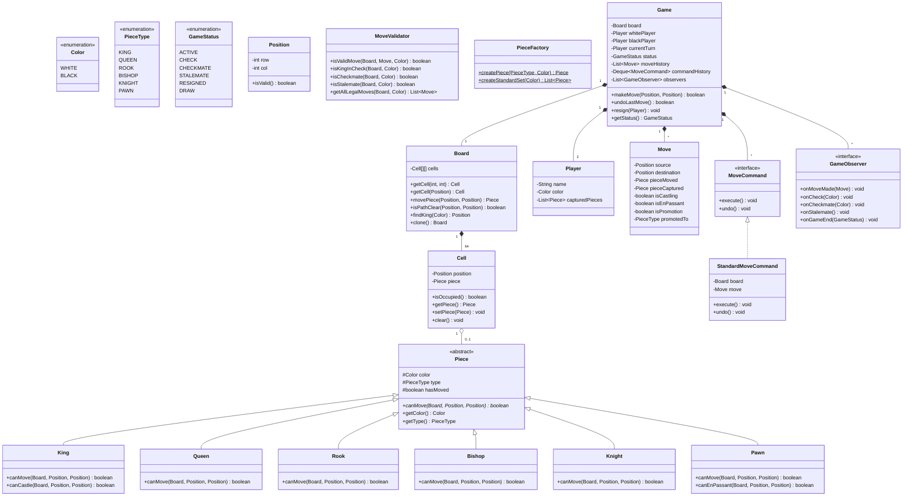

# Low-Level Design: Chess Game

## 1. Problem Statement

Design a two-player Chess game with complete rules including special moves (castling, en passant, pawn promotion), check/checkmate detection, move history with undo capability, and turn management.

**Requirements:**
- Standard 8x8 board with all pieces
- Turn-based gameplay (White moves first)
- Legal move validation per piece type
- Check, checkmate, and stalemate detection
- Special moves: Castling, En Passant, Pawn Promotion
- Move history and undo functionality
- Extensible design for future enhancements

---

## 2. UML Class Diagram



---

## 3. Design Patterns Used

| Pattern | Usage |
|---------|-------|
| **Strategy (Polymorphism)** | Each `Piece` subclass defines its own `canMove()` logic |
| **Factory** | `PieceFactory` creates pieces without exposing instantiation logic |
| **Command** | `MoveCommand` encapsulates moves for execute/undo |
| **Observer** | `GameObserver` notified on check, checkmate, move events |
| **Template Method** | Base validation in `Piece.canMove()` with specific logic in subclasses |

---

## 4. SOLID Principles Applied

| Principle | Application |
|-----------|-------------|
| **SRP** | Each class has one responsibility: `Board` manages grid, `MoveValidator` validates, `Game` orchestrates |
| **OCP** | New piece types can be added without modifying existing code (extend `Piece`) |
| **LSP** | All `Piece` subclasses are substitutable wherever `Piece` is expected |
| **ISP** | `GameObserver` can be split into finer interfaces if needed |
| **DIP** | `Game` depends on abstractions (`Piece`, `MoveCommand`) not concrete classes |

---

## 5. Complete Java Implementation

### Enums

```java
public enum Color {
    WHITE, BLACK;

    public Color opposite() {
        return this == WHITE ? BLACK : WHITE;
    }
}

public enum PieceType {
    KING, QUEEN, ROOK, BISHOP, KNIGHT, PAWN
}

public enum GameStatus {
    ACTIVE, CHECK, CHECKMATE, STALEMATE, RESIGNED, DRAW
}
```

### Position & Cell

```java
public record Position(int row, int col) {
    public boolean isValid() {
        return row >= 0 && row < 8 && col >= 0 && col < 8;
    }

    public static Position of(int row, int col) {
        return new Position(row, col);
    }

    public String toAlgebraic() {
        return "" + (char) ('a' + col) + (row + 1);
    }
}

public class Cell {
    private final Position position;
    private Piece piece;

    public Cell(Position position) {
        this.position = position;
    }

    public boolean isOccupied() {
        return piece != null;
    }

    public Piece getPiece() {
        return piece;
    }

    public void setPiece(Piece piece) {
        this.piece = piece;
    }

    public Piece clear() {
        Piece removed = this.piece;
        this.piece = null;
        return removed;
    }

    public Position getPosition() {
        return position;
    }
}
```

### Board

```java
public class Board {
    private final Cell[][] cells = new Cell[8][8];

    public Board() {
        for (int row = 0; row < 8; row++) {
            for (int col = 0; col < 8; col++) {
                cells[row][col] = new Cell(Position.of(row, col));
            }
        }
    }

    public Cell getCell(int row, int col) {
        return cells[row][col];
    }

    public Cell getCell(Position pos) {
        if (!pos.isValid()) throw new IllegalArgumentException("Invalid position: " + pos);
        return cells[pos.row()][pos.col()];
    }

    public Piece movePiece(Position source, Position dest) {
        Cell srcCell = getCell(source);
        Cell destCell = getCell(dest);
        Piece captured = destCell.clear();
        destCell.setPiece(srcCell.getPiece());
        srcCell.clear();
        return captured;
    }

    public boolean isPathClear(Position source, Position dest) {
        int rowDir = Integer.signum(dest.row() - source.row());
        int colDir = Integer.signum(dest.col() - source.col());

        int currentRow = source.row() + rowDir;
        int currentCol = source.col() + colDir;

        while (currentRow != dest.row() || currentCol != dest.col()) {
            if (cells[currentRow][currentCol].isOccupied()) {
                return false;
            }
            currentRow += rowDir;
            currentCol += colDir;
        }
        return true;
    }

    public Position findKing(Color color) {
        for (int row = 0; row < 8; row++) {
            for (int col = 0; col < 8; col++) {
                Piece piece = cells[row][col].getPiece();
                if (piece != null && piece.getType() == PieceType.KING && piece.getColor() == color) {
                    return Position.of(row, col);
                }
            }
        }
        throw new IllegalStateException("King not found for " + color);
    }

    public Board deepCopy() {
        Board copy = new Board();
        for (int row = 0; row < 8; row++) {
            for (int col = 0; col < 8; col++) {
                Piece piece = cells[row][col].getPiece();
                if (piece != null) {
                    copy.cells[row][col].setPiece(piece.copy());
                }
            }
        }
        return copy;
    }
}
```

### Piece Hierarchy

```java
public abstract class Piece {
    protected final Color color;
    protected final PieceType type;
    protected boolean hasMoved = false;

    protected Piece(Color color, PieceType type) {
        this.color = color;
        this.type = type;
    }

    public abstract boolean canMove(Board board, Position source, Position destination);

    public abstract Piece copy();

    public Color getColor() { return color; }
    public PieceType getType() { return type; }
    public boolean hasMoved() { return hasMoved; }
    public void setMoved(boolean moved) { this.hasMoved = moved; }

    protected boolean isValidDestination(Board board, Position dest) {
        if (!dest.isValid()) return false;
        Cell destCell = board.getCell(dest);
        return !destCell.isOccupied() || destCell.getPiece().getColor() != this.color;
    }
}

public class King extends Piece {
    public King(Color color) {
        super(color, PieceType.KING);
    }

    @Override
    public boolean canMove(Board board, Position source, Position dest) {
        if (!isValidDestination(board, dest)) return false;

        int rowDiff = Math.abs(dest.row() - source.row());
        int colDiff = Math.abs(dest.col() - source.col());

        // Standard king move: one square in any direction
        if (rowDiff <= 1 && colDiff <= 1 && (rowDiff + colDiff > 0)) {
            return true;
        }

        // Castling: king moves two squares horizontally
        if (rowDiff == 0 && colDiff == 2 && !hasMoved) {
            return canCastle(board, source, dest);
        }

        return false;
    }

    public boolean canCastle(Board board, Position source, Position dest) {
        if (hasMoved) return false;

        int direction = dest.col() > source.col() ? 1 : -1;
        int rookCol = direction == 1 ? 7 : 0;
        Cell rookCell = board.getCell(source.row(), rookCol);

        if (!rookCell.isOccupied() || rookCell.getPiece().getType() != PieceType.ROOK) return false;
        if (rookCell.getPiece().hasMoved()) return false;

        // Check path is clear
        if (!board.isPathClear(source, Position.of(source.row(), rookCol))) return false;

        // King cannot castle through or into check (validated externally by MoveValidator)
        return true;
    }

    @Override
    public Piece copy() {
        King k = new King(color);
        k.hasMoved = this.hasMoved;
        return k;
    }
}

public class Queen extends Piece {
    public Queen(Color color) {
        super(color, PieceType.QUEEN);
    }

    @Override
    public boolean canMove(Board board, Position source, Position dest) {
        if (!isValidDestination(board, dest)) return false;

        int rowDiff = Math.abs(dest.row() - source.row());
        int colDiff = Math.abs(dest.col() - source.col());

        // Moves like rook or bishop
        boolean straightLine = (rowDiff == 0 || colDiff == 0);
        boolean diagonal = (rowDiff == colDiff);

        if (!straightLine && !diagonal) return false;

        return board.isPathClear(source, dest);
    }

    @Override
    public Piece copy() {
        Queen q = new Queen(color);
        q.hasMoved = this.hasMoved;
        return q;
    }
}

public class Rook extends Piece {
    public Rook(Color color) {
        super(color, PieceType.ROOK);
    }

    @Override
    public boolean canMove(Board board, Position source, Position dest) {
        if (!isValidDestination(board, dest)) return false;

        int rowDiff = Math.abs(dest.row() - source.row());
        int colDiff = Math.abs(dest.col() - source.col());

        // Rook moves in straight lines only
        if (rowDiff != 0 && colDiff != 0) return false;

        return board.isPathClear(source, dest);
    }

    @Override
    public Piece copy() {
        Rook r = new Rook(color);
        r.hasMoved = this.hasMoved;
        return r;
    }
}

public class Bishop extends Piece {
    public Bishop(Color color) {
        super(color, PieceType.BISHOP);
    }

    @Override
    public boolean canMove(Board board, Position source, Position dest) {
        if (!isValidDestination(board, dest)) return false;

        int rowDiff = Math.abs(dest.row() - source.row());
        int colDiff = Math.abs(dest.col() - source.col());

        // Bishop moves diagonally only
        if (rowDiff != colDiff || rowDiff == 0) return false;

        return board.isPathClear(source, dest);
    }

    @Override
    public Piece copy() {
        Bishop b = new Bishop(color);
        b.hasMoved = this.hasMoved;
        return b;
    }
}

public class Knight extends Piece {
    public Knight(Color color) {
        super(color, PieceType.KNIGHT);
    }

    @Override
    public boolean canMove(Board board, Position source, Position dest) {
        if (!isValidDestination(board, dest)) return false;

        int rowDiff = Math.abs(dest.row() - source.row());
        int colDiff = Math.abs(dest.col() - source.col());

        // L-shape: (2,1) or (1,2)
        return (rowDiff == 2 && colDiff == 1) || (rowDiff == 1 && colDiff == 2);
    }

    @Override
    public Piece copy() {
        Knight n = new Knight(color);
        n.hasMoved = this.hasMoved;
        return n;
    }
}

public class Pawn extends Piece {
    public Pawn(Color color) {
        super(color, PieceType.PAWN);
    }

    @Override
    public boolean canMove(Board board, Position source, Position dest) {
        if (!dest.isValid()) return false;

        int direction = (color == Color.WHITE) ? 1 : -1;
        int rowDiff = dest.row() - source.row();
        int colDiff = Math.abs(dest.col() - source.col());

        // Forward one square
        if (colDiff == 0 && rowDiff == direction) {
            return !board.getCell(dest).isOccupied();
        }

        // Forward two squares from starting position
        if (colDiff == 0 && rowDiff == 2 * direction && !hasMoved) {
            Position intermediate = Position.of(source.row() + direction, source.col());
            return !board.getCell(intermediate).isOccupied() && !board.getCell(dest).isOccupied();
        }

        // Diagonal capture
        if (colDiff == 1 && rowDiff == direction) {
            Cell destCell = board.getCell(dest);
            if (destCell.isOccupied() && destCell.getPiece().getColor() != this.color) {
                return true;
            }
            // En passant is validated externally
        }

        return false;
    }

    public boolean canEnPassant(Board board, Position source, Position dest, Move lastMove) {
        if (lastMove == null) return false;

        int direction = (color == Color.WHITE) ? 1 : -1;
        int rowDiff = dest.row() - source.row();
        int colDiff = Math.abs(dest.col() - source.col());

        if (colDiff != 1 || rowDiff != direction) return false;

        // Last move must be a pawn moving two squares to the adjacent column
        Piece lastPiece = lastMove.getPieceMoved();
        if (lastPiece.getType() != PieceType.PAWN) return false;
        if (Math.abs(lastMove.getDestination().row() - lastMove.getSource().row()) != 2) return false;
        if (lastMove.getDestination().col() != dest.col()) return false;
        if (lastMove.getDestination().row() != source.row()) return false;

        return true;
    }

    @Override
    public Piece copy() {
        Pawn p = new Pawn(color);
        p.hasMoved = this.hasMoved;
        return p;
    }
}
```

### Move

```java
public class Move {
    private final Position source;
    private final Position destination;
    private final Piece pieceMoved;
    private Piece pieceCaptured;
    private boolean isCastling;
    private boolean isEnPassant;
    private boolean isPromotion;
    private PieceType promotedTo;

    public Move(Position source, Position destination, Piece pieceMoved) {
        this.source = source;
        this.destination = destination;
        this.pieceMoved = pieceMoved;
    }

    // Getters and setters
    public Position getSource() { return source; }
    public Position getDestination() { return destination; }
    public Piece getPieceMoved() { return pieceMoved; }
    public Piece getPieceCaptured() { return pieceCaptured; }
    public void setPieceCaptured(Piece piece) { this.pieceCaptured = piece; }
    public boolean isCastling() { return isCastling; }
    public void setCastling(boolean castling) { this.isCastling = castling; }
    public boolean isEnPassant() { return isEnPassant; }
    public void setEnPassant(boolean enPassant) { this.isEnPassant = enPassant; }
    public boolean isPromotion() { return isPromotion; }
    public void setPromotion(boolean promotion) { this.isPromotion = promotion; }
    public PieceType getPromotedTo() { return promotedTo; }
    public void setPromotedTo(PieceType promotedTo) { this.promotedTo = promotedTo; }

    @Override
    public String toString() {
        return pieceMoved.getType() + " " + source.toAlgebraic() + " -> " + destination.toAlgebraic();
    }
}
```

### Player

```java
public class Player {
    private final String name;
    private final Color color;
    private final List<Piece> capturedPieces = new ArrayList<>();

    public Player(String name, Color color) {
        this.name = name;
        this.color = color;
    }

    public String getName() { return name; }
    public Color getColor() { return color; }
    public List<Piece> getCapturedPieces() { return Collections.unmodifiableList(capturedPieces); }
    public void addCapturedPiece(Piece piece) { capturedPieces.add(piece); }
}
```

### Command Pattern

```java
public interface MoveCommand {
    void execute();
    void undo();
    Move getMove();
}

public class StandardMoveCommand implements MoveCommand {
    private final Board board;
    private final Move move;
    private boolean previousHasMoved;

    public StandardMoveCommand(Board board, Move move) {
        this.board = board;
        this.move = move;
    }

    @Override
    public void execute() {
        Piece piece = move.getPieceMoved();
        previousHasMoved = piece.hasMoved();

        if (move.isCastling()) {
            executeCastling();
        } else if (move.isEnPassant()) {
            executeEnPassant();
        } else {
            Piece captured = board.movePiece(move.getSource(), move.getDestination());
            move.setPieceCaptured(captured);
        }

        piece.setMoved(true);

        if (move.isPromotion()) {
            executePromotion();
        }
    }

    @Override
    public void undo() {
        Piece piece = move.getPieceMoved();

        if (move.isPromotion()) {
            // Replace promoted piece with original pawn
            board.getCell(move.getDestination()).setPiece(piece);
        }

        if (move.isCastling()) {
            undoCastling();
        } else if (move.isEnPassant()) {
            undoEnPassant();
        } else {
            board.getCell(move.getSource()).setPiece(piece);
            board.getCell(move.getDestination()).setPiece(move.getPieceCaptured());
        }

        piece.setMoved(previousHasMoved);
    }

    @Override
    public Move getMove() { return move; }

    private void executeCastling() {
        board.movePiece(move.getSource(), move.getDestination());

        // Move rook
        int rookSourceCol = move.getDestination().col() > move.getSource().col() ? 7 : 0;
        int rookDestCol = move.getDestination().col() > move.getSource().col() ? 5 : 3;
        int row = move.getSource().row();

        Piece rook = board.getCell(row, rookSourceCol).getPiece();
        board.movePiece(Position.of(row, rookSourceCol), Position.of(row, rookDestCol));
        rook.setMoved(true);
    }

    private void undoCastling() {
        Piece piece = move.getPieceMoved();
        board.getCell(move.getSource()).setPiece(piece);
        board.getCell(move.getDestination()).clear();

        int rookSourceCol = move.getDestination().col() > move.getSource().col() ? 7 : 0;
        int rookDestCol = move.getDestination().col() > move.getSource().col() ? 5 : 3;
        int row = move.getSource().row();

        Piece rook = board.getCell(row, rookDestCol).getPiece();
        board.getCell(row, rookSourceCol).setPiece(rook);
        board.getCell(row, rookDestCol).clear();
        rook.setMoved(false);
    }

    private void executeEnPassant() {
        board.movePiece(move.getSource(), move.getDestination());
        // Remove the captured pawn (it's beside the moving pawn, not at destination)
        Position capturedPos = Position.of(move.getSource().row(), move.getDestination().col());
        Piece captured = board.getCell(capturedPos).clear();
        move.setPieceCaptured(captured);
    }

    private void undoEnPassant() {
        Piece piece = move.getPieceMoved();
        board.getCell(move.getSource()).setPiece(piece);
        board.getCell(move.getDestination()).clear();

        Position capturedPos = Position.of(move.getSource().row(), move.getDestination().col());
        board.getCell(capturedPos).setPiece(move.getPieceCaptured());
    }

    private void executePromotion() {
        Piece promoted = PieceFactory.createPiece(move.getPromotedTo(), move.getPieceMoved().getColor());
        promoted.setMoved(true);
        board.getCell(move.getDestination()).setPiece(promoted);
    }
}
```

### MoveValidator

```java
public class MoveValidator {

    public boolean isValidMove(Board board, Move move, Color currentTurn, Move lastMove) {
        Piece piece = move.getPieceMoved();
        if (piece == null || piece.getColor() != currentTurn) return false;

        Position source = move.getSource();
        Position dest = move.getDestination();

        // Check if piece can make this move
        boolean canMove = piece.canMove(board, source, dest);

        // Check en passant for pawns
        if (!canMove && piece.getType() == PieceType.PAWN) {
            Pawn pawn = (Pawn) piece;
            if (pawn.canEnPassant(board, source, dest, lastMove)) {
                move.setEnPassant(true);
                canMove = true;
            }
        }

        // Check castling
        if (!canMove && piece.getType() == PieceType.KING) {
            int colDiff = Math.abs(dest.col() - source.col());
            if (colDiff == 2) {
                King king = (King) piece;
                if (king.canCastle(board, source, dest)) {
                    // Verify king doesn't pass through check
                    if (!doesCastlingPassThroughCheck(board, source, dest, currentTurn)) {
                        move.setCastling(true);
                        canMove = true;
                    }
                }
            }
        }

        if (!canMove) return false;

        // Check pawn promotion
        if (piece.getType() == PieceType.PAWN) {
            int promotionRow = (piece.getColor() == Color.WHITE) ? 7 : 0;
            if (dest.row() == promotionRow) {
                move.setPromotion(true);
                if (move.getPromotedTo() == null) {
                    move.setPromotedTo(PieceType.QUEEN); // Default promotion
                }
            }
        }

        // Simulate move and check if own king is in check
        return !wouldLeaveKingInCheck(board, move, currentTurn);
    }

    public boolean isKingInCheck(Board board, Color color) {
        Position kingPos = board.findKing(color);
        Color opponent = color.opposite();

        for (int row = 0; row < 8; row++) {
            for (int col = 0; col < 8; col++) {
                Cell cell = board.getCell(row, col);
                if (cell.isOccupied() && cell.getPiece().getColor() == opponent) {
                    if (cell.getPiece().canMove(board, Position.of(row, col), kingPos)) {
                        return true;
                    }
                }
            }
        }
        return false;
    }

    public boolean isCheckmate(Board board, Color color, Move lastMove) {
        if (!isKingInCheck(board, color)) return false;
        return !hasAnyLegalMove(board, color, lastMove);
    }

    public boolean isStalemate(Board board, Color color, Move lastMove) {
        if (isKingInCheck(board, color)) return false;
        return !hasAnyLegalMove(board, color, lastMove);
    }

    private boolean hasAnyLegalMove(Board board, Color color, Move lastMove) {
        for (int row = 0; row < 8; row++) {
            for (int col = 0; col < 8; col++) {
                Cell cell = board.getCell(row, col);
                if (cell.isOccupied() && cell.getPiece().getColor() == color) {
                    Position source = Position.of(row, col);
                    if (hasLegalMoveFrom(board, source, color, lastMove)) {
                        return true;
                    }
                }
            }
        }
        return false;
    }

    private boolean hasLegalMoveFrom(Board board, Position source, Color color, Move lastMove) {
        Piece piece = board.getCell(source).getPiece();
        for (int row = 0; row < 8; row++) {
            for (int col = 0; col < 8; col++) {
                Position dest = Position.of(row, col);
                Move testMove = new Move(source, dest, piece);
                if (isValidMove(board, testMove, color, lastMove)) {
                    return true;
                }
            }
        }
        return false;
    }

    private boolean wouldLeaveKingInCheck(Board board, Move move, Color color) {
        Board simulated = board.deepCopy();
        simulated.movePiece(move.getSource(), move.getDestination());

        if (move.isEnPassant()) {
            Position capturedPos = Position.of(move.getSource().row(), move.getDestination().col());
            simulated.getCell(capturedPos).clear();
        }

        return isKingInCheck(simulated, color);
    }

    private boolean doesCastlingPassThroughCheck(Board board, Position source, Position dest, Color color) {
        int direction = dest.col() > source.col() ? 1 : -1;

        // Check if king is currently in check
        if (isKingInCheck(board, color)) return true;

        // Check intermediate square
        Position intermediate = Position.of(source.row(), source.col() + direction);
        Board sim = board.deepCopy();
        sim.movePiece(source, intermediate);
        if (isKingInCheck(sim, color)) return true;

        // Check destination
        Board sim2 = board.deepCopy();
        sim2.movePiece(source, dest);
        return isKingInCheck(sim2, color);
    }
}
```

### PieceFactory

```java
public class PieceFactory {

    public static Piece createPiece(PieceType type, Color color) {
        return switch (type) {
            case KING -> new King(color);
            case QUEEN -> new Queen(color);
            case ROOK -> new Rook(color);
            case BISHOP -> new Bishop(color);
            case KNIGHT -> new Knight(color);
            case PAWN -> new Pawn(color);
        };
    }

    public static void setupBoard(Board board) {
        // Place pawns
        for (int col = 0; col < 8; col++) {
            board.getCell(1, col).setPiece(new Pawn(Color.WHITE));
            board.getCell(6, col).setPiece(new Pawn(Color.BLACK));
        }

        // Place rooks
        board.getCell(0, 0).setPiece(new Rook(Color.WHITE));
        board.getCell(0, 7).setPiece(new Rook(Color.WHITE));
        board.getCell(7, 0).setPiece(new Rook(Color.BLACK));
        board.getCell(7, 7).setPiece(new Rook(Color.BLACK));

        // Place knights
        board.getCell(0, 1).setPiece(new Knight(Color.WHITE));
        board.getCell(0, 6).setPiece(new Knight(Color.WHITE));
        board.getCell(7, 1).setPiece(new Knight(Color.BLACK));
        board.getCell(7, 6).setPiece(new Knight(Color.BLACK));

        // Place bishops
        board.getCell(0, 2).setPiece(new Bishop(Color.WHITE));
        board.getCell(0, 5).setPiece(new Bishop(Color.WHITE));
        board.getCell(7, 2).setPiece(new Bishop(Color.BLACK));
        board.getCell(7, 5).setPiece(new Bishop(Color.BLACK));

        // Place queens
        board.getCell(0, 3).setPiece(new Queen(Color.WHITE));
        board.getCell(7, 3).setPiece(new Queen(Color.BLACK));

        // Place kings
        board.getCell(0, 4).setPiece(new King(Color.WHITE));
        board.getCell(7, 4).setPiece(new King(Color.BLACK));
    }
}
```

### Observer Interface

```java
public interface GameObserver {
    default void onMoveMade(Move move) {}
    default void onCheck(Color kingColor) {}
    default void onCheckmate(Color loserColor) {}
    default void onStalemate() {}
    default void onGameEnd(GameStatus status) {}
}

public class ConsoleGameObserver implements GameObserver {
    @Override
    public void onMoveMade(Move move) {
        System.out.println("Move: " + move);
    }

    @Override
    public void onCheck(Color kingColor) {
        System.out.println(kingColor + " king is in CHECK!");
    }

    @Override
    public void onCheckmate(Color loserColor) {
        System.out.println("CHECKMATE! " + loserColor.opposite() + " wins!");
    }

    @Override
    public void onStalemate() {
        System.out.println("STALEMATE! Game is a draw.");
    }
}
```

### Game Class

```java
public class Game {
    private final Board board;
    private final Player whitePlayer;
    private final Player blackPlayer;
    private Player currentTurn;
    private GameStatus status;
    private final List<Move> moveHistory;
    private final Deque<MoveCommand> commandHistory;
    private final List<GameObserver> observers;
    private final MoveValidator validator;

    public Game(String whiteName, String blackName) {
        this.board = new Board();
        this.whitePlayer = new Player(whiteName, Color.WHITE);
        this.blackPlayer = new Player(blackName, Color.BLACK);
        this.currentTurn = whitePlayer;
        this.status = GameStatus.ACTIVE;
        this.moveHistory = new ArrayList<>();
        this.commandHistory = new ArrayDeque<>();
        this.observers = new ArrayList<>();
        this.validator = new MoveValidator();

        PieceFactory.setupBoard(board);
    }

    public void addObserver(GameObserver observer) {
        observers.add(observer);
    }

    public boolean makeMove(Position source, Position destination) {
        return makeMove(source, destination, null);
    }

    public boolean makeMove(Position source, Position destination, PieceType promoteTo) {
        if (status == GameStatus.CHECKMATE || status == GameStatus.STALEMATE || status == GameStatus.RESIGNED) {
            return false;
        }

        Cell srcCell = board.getCell(source);
        if (!srcCell.isOccupied()) return false;

        Piece piece = srcCell.getPiece();
        if (piece.getColor() != currentTurn.getColor()) return false;

        Move move = new Move(source, destination, piece);
        if (promoteTo != null) {
            move.setPromotedTo(promoteTo);
        }

        Move lastMove = moveHistory.isEmpty() ? null : moveHistory.get(moveHistory.size() - 1);

        if (!validator.isValidMove(board, move, currentTurn.getColor(), lastMove)) {
            return false;
        }

        // Execute move via command
        MoveCommand command = new StandardMoveCommand(board, move);
        command.execute();
        commandHistory.push(command);
        moveHistory.add(move);

        // Track captured pieces
        if (move.getPieceCaptured() != null) {
            currentTurn == whitePlayer
                ? whitePlayer.addCapturedPiece(move.getPieceCaptured())
                : blackPlayer.addCapturedPiece(move.getPieceCaptured());
        }

        notifyMoveMade(move);

        // Switch turns and check game state
        switchTurn();
        updateGameStatus();

        return true;
    }

    public boolean undoLastMove() {
        if (commandHistory.isEmpty()) return false;

        MoveCommand lastCommand = commandHistory.pop();
        lastCommand.undo();

        Move lastMove = moveHistory.remove(moveHistory.size() - 1);

        // Remove captured piece from player's list
        if (lastMove.getPieceCaptured() != null) {
            Player opponent = currentTurn; // Already switched
            opponent.getCapturedPieces(); // immutable - need mutable access pattern
        }

        switchTurn();
        updateGameStatus();
        return true;
    }

    public void resign(Player player) {
        this.status = GameStatus.RESIGNED;
        notifyGameEnd(GameStatus.RESIGNED);
    }

    private void switchTurn() {
        currentTurn = (currentTurn == whitePlayer) ? blackPlayer : whitePlayer;
    }

    private void updateGameStatus() {
        Color color = currentTurn.getColor();
        Move lastMove = moveHistory.isEmpty() ? null : moveHistory.get(moveHistory.size() - 1);

        if (validator.isCheckmate(board, color, lastMove)) {
            status = GameStatus.CHECKMATE;
            notifyCheckmate(color);
        } else if (validator.isStalemate(board, color, lastMove)) {
            status = GameStatus.STALEMATE;
            notifyStalemate();
        } else if (validator.isKingInCheck(board, color)) {
            status = GameStatus.CHECK;
            notifyCheck(color);
        } else {
            status = GameStatus.ACTIVE;
        }
    }

    private void notifyMoveMade(Move move) {
        observers.forEach(o -> o.onMoveMade(move));
    }

    private void notifyCheck(Color color) {
        observers.forEach(o -> o.onCheck(color));
    }

    private void notifyCheckmate(Color color) {
        observers.forEach(o -> o.onCheckmate(color));
        notifyGameEnd(GameStatus.CHECKMATE);
    }

    private void notifyStalemate() {
        observers.forEach(o -> o.onStalemate());
        notifyGameEnd(GameStatus.STALEMATE);
    }

    private void notifyGameEnd(GameStatus status) {
        observers.forEach(o -> o.onGameEnd(status));
    }

    // Getters
    public Board getBoard() { return board; }
    public GameStatus getStatus() { return status; }
    public Player getCurrentTurn() { return currentTurn; }
    public List<Move> getMoveHistory() { return Collections.unmodifiableList(moveHistory); }
}
```

### Main / Demo

```java
public class ChessDemo {
    public static void main(String[] args) {
        Game game = new Game("Alice", "Bob");
        game.addObserver(new ConsoleGameObserver());

        // Scholar's Mate example
        game.makeMove(Position.of(1, 4), Position.of(3, 4)); // e4
        game.makeMove(Position.of(6, 4), Position.of(4, 4)); // e5
        game.makeMove(Position.of(0, 5), Position.of(3, 2)); // Bc4
        game.makeMove(Position.of(7, 1), Position.of(5, 2)); // Nc6
        game.makeMove(Position.of(0, 3), Position.of(4, 7)); // Qh5
        game.makeMove(Position.of(7, 6), Position.of(5, 5)); // Nf6
        game.makeMove(Position.of(4, 7), Position.of(6, 5)); // Qxf7#

        System.out.println("Game Status: " + game.getStatus()); // CHECKMATE
    }
}
```

---

## 6. Relationship Diagram

```
┌─────────────────────────────────────────────────────────────────┐
│                            Game                                   │
│  - manages turns, status, observers                              │
│  - delegates validation to MoveValidator                         │
│  - uses Command pattern for move execution                       │
├─────────────────────────────────────────────────────────────────┤
│         │              │              │             │             │
│    ┌────▼────┐   ┌─────▼─────┐  ┌────▼────┐  ┌────▼──────┐    │
│    │  Board  │   │MoveValidator│  │ Player  │  │MoveCommand│    │
│    │ (8x8)  │   │            │  │(x2)     │  │  Stack    │    │
│    └────┬────┘   └───────────┘  └─────────┘  └───────────┘    │
│         │                                                        │
│    ┌────▼────┐                                                   │
│    │  Cell   │ ◇── Piece (abstract)                             │
│    │  (64)   │         │                                         │
│    └─────────┘    ┌────┴─────────────────────┐                   │
│                   │    │    │    │    │    │                      │
│                  King Queen Rook Bishop Knight Pawn               │
│                   │                                              │
│              canCastle()                   canEnPassant()         │
└─────────────────────────────────────────────────────────────────┘
```

---

## 7. Key Interview Points

### Why Polymorphism over If-Else?
- Each piece encapsulates its own movement logic via `canMove()`
- Adding a new piece (e.g., custom fairy chess piece) requires ZERO changes to existing code
- No switch/case explosion in move validation

### Why Command Pattern?
- Encapsulates a move as an object with `execute()` and `undo()`
- Enables move history, replay, and undo with minimal coupling
- Each command stores the state needed to reverse itself

### Why Board.deepCopy()?
- Check detection requires simulating moves without mutating the real board
- Avoids complex state rollback logic in validation

### Special Moves Complexity
- **Castling**: Requires checking king hasn't moved, rook hasn't moved, path clear, and king doesn't pass through check
- **En Passant**: Context-dependent (only valid immediately after opponent's two-square pawn advance)
- **Pawn Promotion**: Triggers piece type transformation

### Time/Space Complexity
- Move validation: O(64) per piece for path checking
- Check detection: O(16 * 64) worst case (all opponent pieces checked)
- Checkmate detection: O(16 * 64 * 64) — for each own piece, try all destinations

### Common Follow-ups
1. **How to add timers?** — Add a `Clock` class with per-player countdown; observer pattern notifies on timeout
2. **How to support undo multiple moves?** — Command stack already supports this via repeated `pop()`
3. **How to add AI?** — Inject a `MoveStrategy` interface into `Player` with `minimax` or `alpha-beta` implementations
4. **Thread safety?** — Synchronize `makeMove()` or use a single-threaded event loop
5. **Persistence?** — Serialize move history (PGN format); replay to restore state
