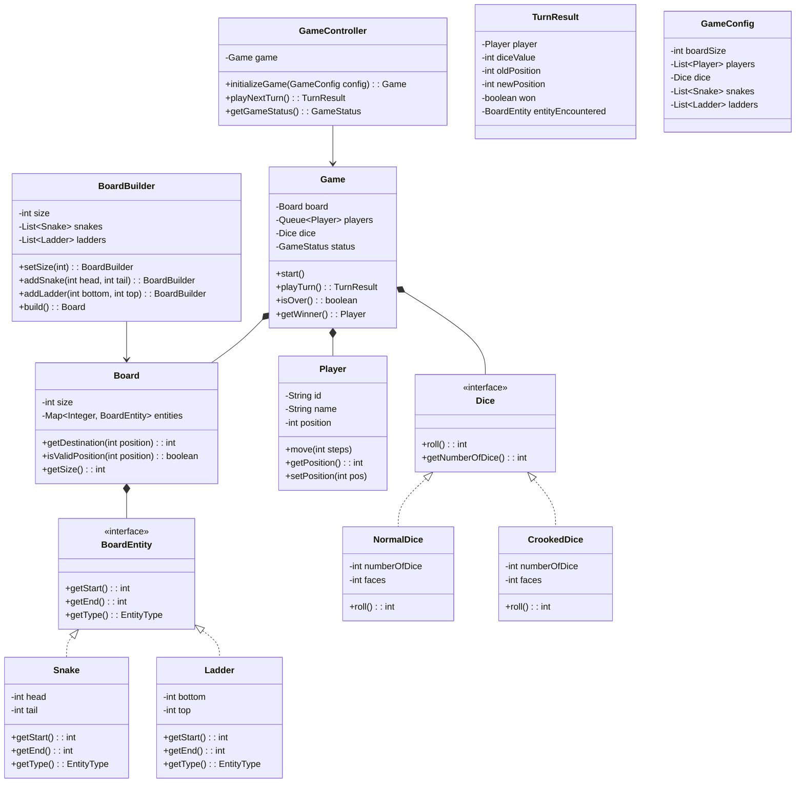
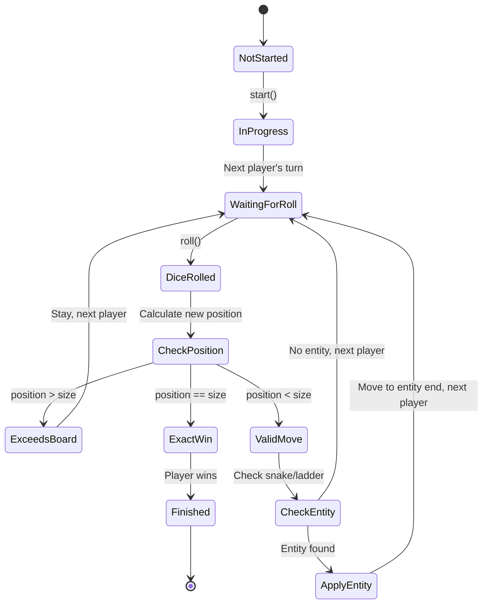
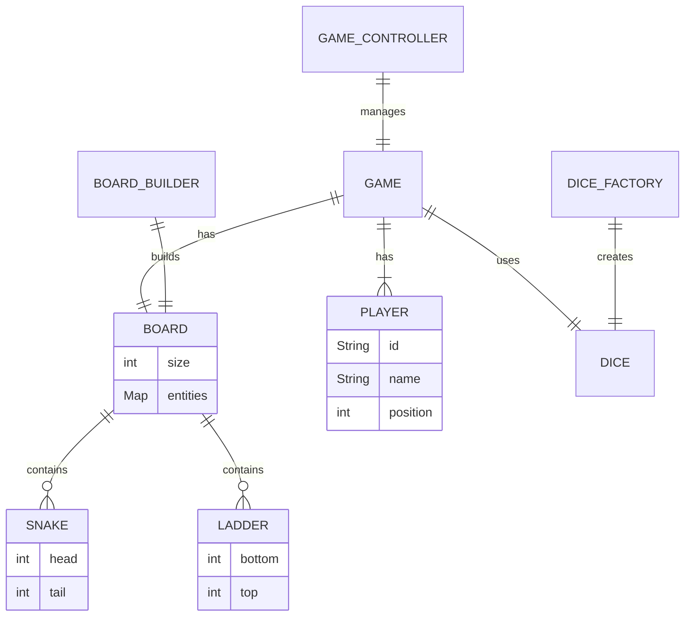

# Snake & Ladders - Low-Level Design

## 1. Problem Statement

Design a Snake & Ladders game that supports:
- Multiple players taking turns
- Configurable board size with snakes and ladders
- Different dice strategies (normal, crooked)
- Win condition when a player reaches the last cell
- Extensible design following SOLID principles

---

## 2. UML Class Diagram



---

## 3. Design Patterns Used

| Pattern | Where | Why |
|---------|-------|-----|
| **Strategy** | `Dice` interface with `NormalDice`, `CrookedDice` | Swap dice behavior without changing game logic |
| **Builder** | `BoardBuilder` | Complex board construction with validation |
| **Factory** | `DiceFactory` | Create dice instances based on type |
| **Template Method** | `BoardEntity` | Common interface for snakes/ladders |
| **Iterator** | Player turn queue | Cyclic iteration over players |

---

## 4. SOLID Principles Applied

| Principle | Application |
|-----------|-------------|
| **S** - Single Responsibility | `Board` manages positions, `Game` manages turns, `Dice` handles rolling |
| **O** - Open/Closed | New dice types or board entities added without modifying existing code |
| **L** - Liskov Substitution | `NormalDice` and `CrookedDice` are interchangeable via `Dice` interface |
| **I** - Interface Segregation | `BoardEntity` is minimal; `Dice` has only what's needed |
| **D** - Dependency Inversion | `Game` depends on `Dice` interface, not concrete implementations |

---

## 5. Complete Java Implementation

### 5.1 Enums

```java
public enum EntityType {
    SNAKE, LADDER
}

public enum GameStatus {
    NOT_STARTED, IN_PROGRESS, FINISHED
}
```

### 5.2 BoardEntity Interface

```java
public interface BoardEntity {
    int getStart();
    int getEnd();
    EntityType getType();

    default int getDelta() {
        return getEnd() - getStart();
    }
}
```

### 5.3 Snake

```java
public class Snake implements BoardEntity {
    private final int head;
    private final int tail;

    public Snake(int head, int tail) {
        if (tail >= head) {
            throw new IllegalArgumentException("Snake tail must be below head");
        }
        this.head = head;
        this.tail = tail;
    }

    @Override
    public int getStart() { return head; }

    @Override
    public int getEnd() { return tail; }

    @Override
    public EntityType getType() { return EntityType.SNAKE; }

    @Override
    public String toString() {
        return "Snake[%d -> %d]".formatted(head, tail);
    }
}
```

### 5.4 Ladder

```java
public class Ladder implements BoardEntity {
    private final int bottom;
    private final int top;

    public Ladder(int bottom, int top) {
        if (top <= bottom) {
            throw new IllegalArgumentException("Ladder top must be above bottom");
        }
        this.bottom = bottom;
        this.top = top;
    }

    @Override
    public int getStart() { return bottom; }

    @Override
    public int getEnd() { return top; }

    @Override
    public EntityType getType() { return EntityType.LADDER; }

    @Override
    public String toString() {
        return "Ladder[%d -> %d]".formatted(bottom, top);
    }
}
```

### 5.5 Dice Interface & Implementations

```java
public interface Dice {
    int roll();
    int getNumberOfDice();
    int getFaces();
}
```

```java
import java.util.concurrent.ThreadLocalRandom;

public class NormalDice implements Dice {
    private final int numberOfDice;
    private final int faces;

    public NormalDice(int numberOfDice, int faces) {
        this.numberOfDice = numberOfDice;
        this.faces = faces;
    }

    public NormalDice() {
        this(1, 6);
    }

    @Override
    public int roll() {
        int total = 0;
        for (int i = 0; i < numberOfDice; i++) {
            total += ThreadLocalRandom.current().nextInt(1, faces + 1);
        }
        return total;
    }

    @Override
    public int getNumberOfDice() { return numberOfDice; }

    @Override
    public int getFaces() { return faces; }
}
```

```java
import java.util.concurrent.ThreadLocalRandom;

public class CrookedDice implements Dice {
    private final int numberOfDice;
    private final int faces;

    public CrookedDice(int numberOfDice, int faces) {
        this.numberOfDice = numberOfDice;
        this.faces = faces;
    }

    public CrookedDice() {
        this(1, 6);
    }

    @Override
    public int roll() {
        // Always returns even numbers
        int total = 0;
        for (int i = 0; i < numberOfDice; i++) {
            int maxEven = faces / 2;
            int evenValue = ThreadLocalRandom.current().nextInt(1, maxEven + 1) * 2;
            total += evenValue;
        }
        return total;
    }

    @Override
    public int getNumberOfDice() { return numberOfDice; }

    @Override
    public int getFaces() { return faces; }
}
```

### 5.6 DiceFactory

```java
public class DiceFactory {

    public enum DiceType {
        NORMAL, CROOKED
    }

    public static Dice createDice(DiceType type, int numberOfDice, int faces) {
        return switch (type) {
            case NORMAL -> new NormalDice(numberOfDice, faces);
            case CROOKED -> new CrookedDice(numberOfDice, faces);
        };
    }

    public static Dice createDice(DiceType type) {
        return createDice(type, 1, 6);
    }
}
```

### 5.7 Player

```java
public class Player {
    private final String id;
    private final String name;
    private int position;

    public Player(String id, String name) {
        this.id = id;
        this.name = name;
        this.position = 0; // starts off the board
    }

    public String getId() { return id; }
    public String getName() { return name; }
    public int getPosition() { return position; }

    public void setPosition(int position) {
        this.position = position;
    }

    public void move(int steps) {
        this.position += steps;
    }

    @Override
    public String toString() {
        return "%s(pos=%d)".formatted(name, position);
    }
}
```

### 5.8 Board

```java
import java.util.*;

public class Board {
    private final int size;
    private final Map<Integer, BoardEntity> entities;

    Board(int size, Map<Integer, BoardEntity> entities) {
        this.size = size;
        this.entities = Collections.unmodifiableMap(entities);
    }

    public int getSize() { return size; }

    public int getWinningPosition() { return size; }

    public boolean isValidPosition(int position) {
        return position >= 1 && position <= size;
    }

    public int getDestination(int position) {
        BoardEntity entity = entities.get(position);
        if (entity != null) {
            return entity.getEnd();
        }
        return position;
    }

    public Optional<BoardEntity> getEntityAt(int position) {
        return Optional.ofNullable(entities.get(position));
    }
}
```

### 5.9 BoardBuilder

```java
import java.util.*;

public class BoardBuilder {
    private int size = 100;
    private final List<Snake> snakes = new ArrayList<>();
    private final List<Ladder> ladders = new ArrayList<>();

    public BoardBuilder setSize(int size) {
        if (size < 10) throw new IllegalArgumentException("Board size must be >= 10");
        this.size = size;
        return this;
    }

    public BoardBuilder addSnake(int head, int tail) {
        snakes.add(new Snake(head, tail));
        return this;
    }

    public BoardBuilder addLadder(int bottom, int top) {
        ladders.add(new Ladder(bottom, top));
        return this;
    }

    public Board build() {
        Map<Integer, BoardEntity> entities = new HashMap<>();

        for (Snake snake : snakes) {
            validateEntity(snake, entities);
            entities.put(snake.getStart(), snake);
        }

        for (Ladder ladder : ladders) {
            validateEntity(ladder, entities);
            entities.put(ladder.getStart(), ladder);
        }

        return new Board(size, entities);
    }

    private void validateEntity(BoardEntity entity, Map<Integer, BoardEntity> existing) {
        int start = entity.getStart();
        int end = entity.getEnd();

        if (start < 1 || start > size || end < 1 || end > size) {
            throw new IllegalArgumentException(
                "Entity positions must be within board: " + entity);
        }
        if (start == size || end == size) {
            throw new IllegalArgumentException(
                "Cannot place entity at winning position: " + entity);
        }
        if (existing.containsKey(start)) {
            throw new IllegalArgumentException(
                "Position %d already has an entity".formatted(start));
        }
        // Check for infinite loops: entity end should not land on another entity start
        // that leads back (simplified check)
        if (existing.containsKey(end)) {
            BoardEntity target = existing.get(end);
            if (target.getEnd() == start) {
                throw new IllegalArgumentException(
                    "Infinite loop detected between %d and %d".formatted(start, end));
            }
        }
    }
}
```

### 5.10 TurnResult

```java
import java.util.Optional;

public record TurnResult(
    Player player,
    int diceValue,
    int oldPosition,
    int newPosition,
    boolean won,
    Optional<BoardEntity> entityEncountered
) {
    @Override
    public String toString() {
        var sb = new StringBuilder();
        sb.append("%s rolled %d: %d -> %d".formatted(
            player.getName(), diceValue, oldPosition, newPosition));
        entityEncountered.ifPresent(e ->
            sb.append(" [Hit %s]".formatted(e)));
        if (won) sb.append(" *** WINNER! ***");
        return sb.toString();
    }
}
```

### 5.11 Game

```java
import java.util.*;

public class Game {
    private final Board board;
    private final Deque<Player> players;
    private final Dice dice;
    private GameStatus status;
    private Player winner;

    public Game(Board board, List<Player> players, Dice dice) {
        if (players == null || players.size() < 2) {
            throw new IllegalArgumentException("Need at least 2 players");
        }
        this.board = board;
        this.players = new ArrayDeque<>(players);
        this.dice = dice;
        this.status = GameStatus.NOT_STARTED;
    }

    public void start() {
        this.status = GameStatus.IN_PROGRESS;
    }

    public TurnResult playTurn() {
        if (status != GameStatus.IN_PROGRESS) {
            throw new IllegalStateException("Game is not in progress");
        }

        Player current = players.poll();
        int oldPosition = current.getPosition();
        int diceValue = dice.roll();
        int newPosition = oldPosition + diceValue;

        Optional<BoardEntity> entity = Optional.empty();

        if (newPosition > board.getSize()) {
            // Exceeds board, player stays
            newPosition = oldPosition;
        } else if (newPosition == board.getSize()) {
            // Exact landing on final cell — WIN
            current.setPosition(newPosition);
            this.winner = current;
            this.status = GameStatus.FINISHED;
            return new TurnResult(current, diceValue, oldPosition, newPosition, true, Optional.empty());
        } else {
            // Check for snake/ladder
            int destination = board.getDestination(newPosition);
            if (destination != newPosition) {
                entity = board.getEntityAt(newPosition);
                newPosition = destination;
            }
        }

        current.setPosition(newPosition);
        players.offer(current); // back in queue

        return new TurnResult(current, diceValue, oldPosition, newPosition, false, entity);
    }

    public boolean isOver() {
        return status == GameStatus.FINISHED;
    }

    public GameStatus getStatus() { return status; }

    public Optional<Player> getWinner() {
        return Optional.ofNullable(winner);
    }
}
```

### 5.12 GameConfig

```java
import java.util.List;

public record GameConfig(
    int boardSize,
    List<int[]> snakes,
    List<int[]> ladders,
    List<String> playerNames,
    DiceFactory.DiceType diceType
) {}
```

### 5.13 GameController

```java
import java.util.*;
import java.util.stream.*;

public class GameController {
    private Game game;

    public Game initializeGame(GameConfig config) {
        // Build the board
        BoardBuilder builder = new BoardBuilder().setSize(config.boardSize());

        for (int[] snake : config.snakes()) {
            builder.addSnake(snake[0], snake[1]);
        }
        for (int[] ladder : config.ladders()) {
            builder.addLadder(ladder[0], ladder[1]);
        }

        Board board = builder.build();

        // Create players
        List<Player> players = IntStream.range(0, config.playerNames().size())
            .mapToObj(i -> new Player(
                "P" + (i + 1),
                config.playerNames().get(i)))
            .collect(Collectors.toList());

        // Create dice
        Dice dice = DiceFactory.createDice(config.diceType());

        this.game = new Game(board, players, dice);
        this.game.start();
        return game;
    }

    public TurnResult playNextTurn() {
        if (game == null) throw new IllegalStateException("Game not initialized");
        return game.playTurn();
    }

    public GameStatus getGameStatus() {
        return game != null ? game.getStatus() : GameStatus.NOT_STARTED;
    }

    public void simulateFullGame() {
        if (game == null) throw new IllegalStateException("Game not initialized");
        int turnCount = 0;
        int maxTurns = 1000;

        while (!game.isOver() && turnCount < maxTurns) {
            TurnResult result = game.playTurn();
            System.out.println("Turn %d: %s".formatted(++turnCount, result));
        }

        game.getWinner().ifPresentOrElse(
            w -> System.out.println("\nGame Over! Winner: " + w.getName()),
            () -> System.out.println("\nGame ended without a winner (max turns reached)")
        );
    }
}
```

### 5.14 Main - Demo

```java
import java.util.List;

public class SnakeAndLadderApp {
    public static void main(String[] args) {
        GameConfig config = new GameConfig(
            100,
            List.of(
                new int[]{99, 10},
                new int[]{65, 25},
                new int[]{88, 45},
                new int[]{52, 11},
                new int[]{48, 9}
            ),
            List.of(
                new int[]{2, 38},
                new int[]{7, 14},
                new int[]{15, 31},
                new int[]{28, 84},
                new int[]{51, 67},
                new int[]{71, 91}
            ),
            List.of("Alice", "Bob", "Charlie"),
            DiceFactory.DiceType.NORMAL
        );

        GameController controller = new GameController();
        controller.initializeGame(config);
        controller.simulateFullGame();
    }
}
```

---

## 6. State Diagram



---

## 7. Relationship Diagram



---

## 8. Key Interview Points

### Design Decisions

| Decision | Rationale |
|----------|-----------|
| `BoardEntity` interface | Allows adding new entity types (e.g., PowerUp, Teleporter) without changing Board |
| `Dice` as Strategy | Easy to swap dice behavior; testable with deterministic dice |
| Builder for Board | Complex validation, prevents invalid boards |
| `Deque` for player turns | O(1) rotation, natural queue behavior |
| `record` for TurnResult | Immutable value object, clean API |
| Position 0 = off board | Clean start state, position 1..N is on board |

### Common Follow-Up Questions

1. **How to add multiplayer over network?**
   - Extract `GameController` into a service, add WebSocket/REST layer
   - Game state becomes server-authoritative

2. **How to make it thread-safe?**
   - `Game.playTurn()` synchronized or use `ReentrantLock`
   - Immutable `TurnResult` already safe to share

3. **How to add special rules (extra turn on 6)?**
   - Add `RuleEngine` with `Rule` interface
   - Rules evaluated after each turn: `List<Rule> rules`

4. **How to persist game state?**
   - Serialize `Game` state (player positions, turn order)
   - Use Memento pattern for save/load

5. **How to support undo?**
   - Command pattern: each turn is a command with `execute()`/`undo()`
   - Store command history stack

### Extensibility Points

```java
// Adding a new entity type
public class Teleporter implements BoardEntity {
    private final int from;
    private final int to; // can go up or down
    // ...
}

// Adding a new dice type
public class WeightedDice implements Dice {
    private final Map<Integer, Double> weights;
    // ...
}

// Deterministic dice for testing
public class FixedDice implements Dice {
    private final Queue<Integer> values;
    @Override
    public int roll() { return values.poll(); }
}
```

### Complexity Analysis

| Operation | Time | Space |
|-----------|------|-------|
| Roll dice | O(d) where d = number of dice | O(1) |
| Get destination | O(1) hash map lookup | O(1) |
| Play turn | O(1) | O(1) |
| Build board | O(S + L) snakes + ladders | O(S + L) |
| Full game | O(T) turns until win | O(N) players |

---

## 9. Testing Strategy

```java
public class GameTest {

    @Test
    void playerWinsOnExactLanding() {
        Board board = new BoardBuilder().setSize(10).build();
        Dice fixedDice = new FixedDice(List.of(5, 1, 5)); // P1: 0->5, P2: 0->1, P1: 5->10 WIN
        List<Player> players = List.of(new Player("1", "A"), new Player("2", "B"));

        Game game = new Game(board, players, fixedDice);
        game.start();

        game.playTurn(); // A moves to 5
        game.playTurn(); // B moves to 1
        TurnResult result = game.playTurn(); // A moves to 10

        assertTrue(result.won());
        assertEquals("A", game.getWinner().orElseThrow().getName());
    }

    @Test
    void playerStaysIfExceedsBoard() {
        Board board = new BoardBuilder().setSize(10).build();
        Dice fixedDice = new FixedDice(List.of(8, 1, 6)); // P1: 0->8, P2: 0->1, P1: stays at 8
        List<Player> players = List.of(new Player("1", "A"), new Player("2", "B"));

        Game game = new Game(board, players, fixedDice);
        game.start();

        game.playTurn(); // A to 8
        game.playTurn(); // B to 1
        TurnResult result = game.playTurn(); // A rolls 6, 8+6=14 > 10, stays

        assertEquals(8, result.newPosition());
        assertFalse(result.won());
    }

    @Test
    void snakeBitesPlayer() {
        Board board = new BoardBuilder().setSize(20).addSnake(15, 5).build();
        Dice fixedDice = new FixedDice(List.of(15)); // lands on snake head
        List<Player> players = List.of(new Player("1", "A"), new Player("2", "B"));

        Game game = new Game(board, players, fixedDice);
        game.start();
        TurnResult result = game.playTurn();

        assertEquals(5, result.newPosition());
        assertTrue(result.entityEncountered().isPresent());
        assertEquals(EntityType.SNAKE, result.entityEncountered().get().getType());
    }
}
```
