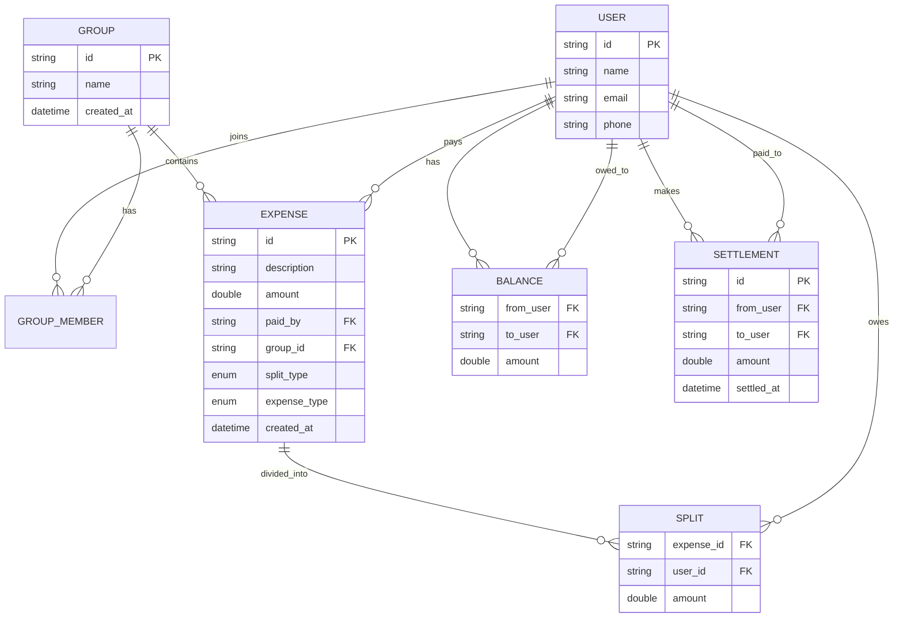

# Low-Level Design: Splitwise (Expense Sharing System)

## 1. Problem Statement

Design a Splitwise-like expense sharing application that allows:
- Users to create groups and add members
- Adding expenses with different split strategies (equal, exact, percentage, share-based)
- Tracking balances between users (who owes whom)
- Simplifying debts using minimum cash flow algorithm
- Settling up between users
- Notifications on balance updates

---

## 2. UML Class Diagram

```mermaid
classDiagram
    class User {
        -String id
        -String name
        -String email
        -String phone
        +getId() String
        +getName() String
        +getEmail() String
    }

    class Group {
        -String id
        -String name
        -List~User~ members
        -List~Expense~ expenses
        +addMember(User)
        +removeMember(User)
        +addExpense(Expense)
        +getExpenses() List~Expense~
    }

    class Expense {
        -String id
        -String description
        -double amount
        -User paidBy
        -List~Split~ splits
        -ExpenseType type
        -LocalDateTime createdAt
        +getId() String
        +getAmount() double
        +getPaidBy() User
        +getSplits() List~Split~
    }

    class Split {
        -User user
        -double amount
        +getUser() User
        +getAmount() double
    }

    class BalanceSheet {
        -Map~String, Map~String, Double~~ balanceMap
        +updateBalance(User, User, double)
        +getBalance(User, User) double
        +getAllBalances() Map
        +simplifyDebts() List~Transaction~
    }

    class Transaction {
        -User from
        -User to
        -double amount
    }

    class SplitStrategy {
        <<interface>>
        +split(double, List~User~, List~Double~) List~Split~
        +validate(double, List~User~, List~Double~) boolean
    }

    class EqualSplitStrategy {
        +split(double, List~User~, List~Double~) List~Split~
        +validate(double, List~User~, List~Double~) boolean
    }

    class ExactSplitStrategy {
        +split(double, List~User~, List~Double~) List~Split~
        +validate(double, List~User~, List~Double~) boolean
    }

    class PercentSplitStrategy {
        +split(double, List~User~, List~Double~) List~Split~
        +validate(double, List~User~, List~Double~) boolean
    }

    class ShareSplitStrategy {
        +split(double, List~User~, List~Double~) List~Split~
        +validate(double, List~User~, List~Double~) boolean
    }

    class ExpenseManager {
        -Map~String, Group~ groups
        -BalanceSheet balanceSheet
        -NotificationService notificationService
        +createGroup(String, List~User~) Group
        +addExpense(String, ExpenseRequest) Expense
        +getBalances(User) Map
        +settleUp(User, User, double)
        +simplifyDebts(String) List~Transaction~
    }

    class ExpenseFactory {
        +createExpense(ExpenseRequest) Expense
    }

    class SplitFactory {
        +getSplitStrategy(SplitType) SplitStrategy
    }

    class NotificationService {
        <<interface>>
        +notifyBalanceUpdate(User, User, double)
        +notifyExpenseAdded(Expense, Group)
        +notifySettlement(User, User, double)
    }

    class EmailNotificationService {
        +notifyBalanceUpdate(User, User, double)
        +notifyExpenseAdded(Expense, Group)
        +notifySettlement(User, User, double)
    }

    class BalanceObserver {
        <<interface>>
        +onBalanceUpdated(User, User, double)
    }

    SplitStrategy <|.. EqualSplitStrategy
    SplitStrategy <|.. ExactSplitStrategy
    SplitStrategy <|.. PercentSplitStrategy
    SplitStrategy <|.. ShareSplitStrategy
    NotificationService <|.. EmailNotificationService
    BalanceObserver <|.. NotificationService
    ExpenseManager --> BalanceSheet
    ExpenseManager --> SplitFactory
    ExpenseManager --> ExpenseFactory
    ExpenseManager --> NotificationService
    Group --> User
    Group --> Expense
    Expense --> Split
    Expense --> User
    Split --> User
    BalanceSheet --> Transaction
```



---

## 3. Design Patterns Used

| Pattern | Usage |
|---------|-------|
| **Strategy** | Different split algorithms (Equal, Exact, Percent, Share) |
| **Factory** | `ExpenseFactory` creates expenses, `SplitFactory` returns strategy |
| **Observer** | `NotificationService` observes balance changes |
| **Singleton** | `ExpenseManager` as the central service |

---

## 4. SOLID Principles Applied

| Principle | Application |
|-----------|------------|
| **SRP** | Each class has one responsibility — `BalanceSheet` only tracks balances, `SplitStrategy` only computes splits |
| **OCP** | New split types added by implementing `SplitStrategy` without modifying existing code |
| **LSP** | All `SplitStrategy` implementations are interchangeable |
| **ISP** | `NotificationService` and `BalanceObserver` are separate focused interfaces |
| **DIP** | `ExpenseManager` depends on `SplitStrategy` interface, not concrete implementations |

---

## 5. Complete Java Implementation

### 5.1 Enums

```java
public enum SplitType {
    EQUAL, EXACT, PERCENT, SHARE
}

public enum ExpenseType {
    FOOD, TRAVEL, SHOPPING, RENT, UTILITIES, OTHER
}
```

### 5.2 Models

```java
import java.time.LocalDateTime;
import java.util.*;

public class User {
    private final String id;
    private final String name;
    private final String email;
    private final String phone;

    public User(String id, String name, String email, String phone) {
        this.id = id;
        this.name = name;
        this.email = email;
        this.phone = phone;
    }

    public String getId() { return id; }
    public String getName() { return name; }
    public String getEmail() { return email; }
    public String getPhone() { return phone; }

    @Override
    public boolean equals(Object o) {
        if (this == o) return true;
        if (!(o instanceof User user)) return false;
        return Objects.equals(id, user.id);
    }

    @Override
    public int hashCode() { return Objects.hash(id); }

    @Override
    public String toString() { return name + "(" + id + ")"; }
}

public class Split {
    private final User user;
    private final double amount;

    public Split(User user, double amount) {
        this.user = user;
        this.amount = amount;
    }

    public User getUser() { return user; }
    public double getAmount() { return amount; }
}

public class Expense {
    private final String id;
    private final String description;
    private final double amount;
    private final User paidBy;
    private final List<Split> splits;
    private final ExpenseType type;
    private final SplitType splitType;
    private final LocalDateTime createdAt;

    public Expense(String id, String description, double amount, User paidBy,
                   List<Split> splits, ExpenseType type, SplitType splitType) {
        this.id = id;
        this.description = description;
        this.amount = amount;
        this.paidBy = paidBy;
        this.splits = Collections.unmodifiableList(splits);
        this.type = type;
        this.splitType = splitType;
        this.createdAt = LocalDateTime.now();
    }

    public String getId() { return id; }
    public String getDescription() { return description; }
    public double getAmount() { return amount; }
    public User getPaidBy() { return paidBy; }
    public List<Split> getSplits() { return splits; }
    public ExpenseType getType() { return type; }
    public SplitType getSplitType() { return splitType; }
    public LocalDateTime getCreatedAt() { return createdAt; }
}

public class Group {
    private final String id;
    private final String name;
    private final List<User> members;
    private final List<Expense> expenses;

    public Group(String id, String name) {
        this.id = id;
        this.name = name;
        this.members = new ArrayList<>();
        this.expenses = new ArrayList<>();
    }

    public void addMember(User user) {
        if (!members.contains(user)) {
            members.add(user);
        }
    }

    public void removeMember(User user) { members.remove(user); }
    public void addExpense(Expense expense) { expenses.add(expense); }
    public String getId() { return id; }
    public String getName() { return name; }
    public List<User> getMembers() { return Collections.unmodifiableList(members); }
    public List<Expense> getExpenses() { return Collections.unmodifiableList(expenses); }
}

public class Transaction {
    private final User from;
    private final User to;
    private final double amount;

    public Transaction(User from, User to, double amount) {
        this.from = from;
        this.to = to;
        this.amount = amount;
    }

    public User getFrom() { return from; }
    public User getTo() { return to; }
    public double getAmount() { return amount; }

    @Override
    public String toString() {
        return from.getName() + " pays " + to.getName() + ": ₹" + String.format("%.2f", amount);
    }
}
```

### 5.3 Strategy Pattern — Split Strategies

```java
public interface SplitStrategy {
    List<Split> split(double totalAmount, List<User> users, List<Double> values);
    boolean validate(double totalAmount, List<User> users, List<Double> values);
}

public class EqualSplitStrategy implements SplitStrategy {

    @Override
    public List<Split> split(double totalAmount, List<User> users, List<Double> values) {
        if (!validate(totalAmount, users, values)) {
            throw new IllegalArgumentException("Invalid equal split parameters");
        }
        double perHead = Math.round(totalAmount * 100.0 / users.size()) / 100.0;
        List<Split> splits = new ArrayList<>();
        double remaining = totalAmount;

        for (int i = 0; i < users.size(); i++) {
            if (i == users.size() - 1) {
                // Last person gets remainder to avoid rounding issues
                splits.add(new Split(users.get(i), Math.round(remaining * 100.0) / 100.0));
            } else {
                splits.add(new Split(users.get(i), perHead));
                remaining -= perHead;
            }
        }
        return splits;
    }

    @Override
    public boolean validate(double totalAmount, List<User> users, List<Double> values) {
        return totalAmount > 0 && users != null && !users.isEmpty();
    }
}

public class ExactSplitStrategy implements SplitStrategy {

    @Override
    public List<Split> split(double totalAmount, List<User> users, List<Double> values) {
        if (!validate(totalAmount, users, values)) {
            throw new IllegalArgumentException("Exact amounts don't sum to total");
        }
        List<Split> splits = new ArrayList<>();
        for (int i = 0; i < users.size(); i++) {
            splits.add(new Split(users.get(i), values.get(i)));
        }
        return splits;
    }

    @Override
    public boolean validate(double totalAmount, List<User> users, List<Double> values) {
        if (users == null || values == null || users.size() != values.size()) return false;
        double sum = values.stream().mapToDouble(Double::doubleValue).sum();
        return Math.abs(sum - totalAmount) < 0.01;
    }
}

public class PercentSplitStrategy implements SplitStrategy {

    @Override
    public List<Split> split(double totalAmount, List<User> users, List<Double> values) {
        if (!validate(totalAmount, users, values)) {
            throw new IllegalArgumentException("Percentages must sum to 100");
        }
        List<Split> splits = new ArrayList<>();
        double remaining = totalAmount;

        for (int i = 0; i < users.size(); i++) {
            if (i == users.size() - 1) {
                splits.add(new Split(users.get(i), Math.round(remaining * 100.0) / 100.0));
            } else {
                double amount = Math.round(totalAmount * values.get(i) / 100.0 * 100.0) / 100.0;
                splits.add(new Split(users.get(i), amount));
                remaining -= amount;
            }
        }
        return splits;
    }

    @Override
    public boolean validate(double totalAmount, List<User> users, List<Double> values) {
        if (users == null || values == null || users.size() != values.size()) return false;
        double sum = values.stream().mapToDouble(Double::doubleValue).sum();
        return Math.abs(sum - 100.0) < 0.01;
    }
}

public class ShareSplitStrategy implements SplitStrategy {

    @Override
    public List<Split> split(double totalAmount, List<User> users, List<Double> values) {
        if (!validate(totalAmount, users, values)) {
            throw new IllegalArgumentException("Invalid share split parameters");
        }
        double totalShares = values.stream().mapToDouble(Double::doubleValue).sum();
        List<Split> splits = new ArrayList<>();
        double remaining = totalAmount;

        for (int i = 0; i < users.size(); i++) {
            if (i == users.size() - 1) {
                splits.add(new Split(users.get(i), Math.round(remaining * 100.0) / 100.0));
            } else {
                double amount = Math.round(totalAmount * values.get(i) / totalShares * 100.0) / 100.0;
                splits.add(new Split(users.get(i), amount));
                remaining -= amount;
            }
        }
        return splits;
    }

    @Override
    public boolean validate(double totalAmount, List<User> users, List<Double> values) {
        if (users == null || values == null || users.size() != values.size()) return false;
        return values.stream().allMatch(v -> v > 0) && totalAmount > 0;
    }
}
```

### 5.4 Factory Pattern

```java
public class SplitFactory {
    private static final Map<SplitType, SplitStrategy> strategies = Map.of(
        SplitType.EQUAL, new EqualSplitStrategy(),
        SplitType.EXACT, new ExactSplitStrategy(),
        SplitType.PERCENT, new PercentSplitStrategy(),
        SplitType.SHARE, new ShareSplitStrategy()
    );

    public static SplitStrategy getSplitStrategy(SplitType type) {
        SplitStrategy strategy = strategies.get(type);
        if (strategy == null) {
            throw new IllegalArgumentException("Unknown split type: " + type);
        }
        return strategy;
    }
}

public record ExpenseRequest(
    String description,
    double amount,
    User paidBy,
    List<User> participants,
    List<Double> values,
    SplitType splitType,
    ExpenseType expenseType
) {}

public class ExpenseFactory {

    private static int counter = 0;

    public static Expense createExpense(ExpenseRequest request) {
        SplitStrategy strategy = SplitFactory.getSplitStrategy(request.splitType());

        if (!strategy.validate(request.amount(), request.participants(), request.values())) {
            throw new IllegalArgumentException("Invalid split parameters for type: " + request.splitType());
        }

        List<Split> splits = strategy.split(request.amount(), request.participants(), request.values());
        String id = "EXP_" + (++counter);

        return new Expense(
            id,
            request.description(),
            request.amount(),
            request.paidBy(),
            splits,
            request.expenseType(),
            request.splitType()
        );
    }
}
```

### 5.5 Observer Pattern — Notification Service

```java
public interface BalanceObserver {
    void onBalanceUpdated(User from, User to, double amount);
    void onExpenseAdded(Expense expense, Group group);
    void onSettlement(User from, User to, double amount);
}

public interface NotificationService extends BalanceObserver {
    void notifyUser(User user, String message);
}

public class EmailNotificationService implements NotificationService {

    @Override
    public void onBalanceUpdated(User from, User to, double amount) {
        if (amount > 0) {
            notifyUser(from, "You owe " + to.getName() + " ₹" + String.format("%.2f", amount));
            notifyUser(to, from.getName() + " owes you ₹" + String.format("%.2f", amount));
        }
    }

    @Override
    public void onExpenseAdded(Expense expense, Group group) {
        String msg = expense.getPaidBy().getName() + " added expense '" +
                     expense.getDescription() + "' of ₹" +
                     String.format("%.2f", expense.getAmount()) +
                     " in group " + group.getName();
        for (Split split : expense.getSplits()) {
            if (!split.getUser().equals(expense.getPaidBy())) {
                notifyUser(split.getUser(), msg);
            }
        }
    }

    @Override
    public void onSettlement(User from, User to, double amount) {
        notifyUser(from, "You paid ₹" + String.format("%.2f", amount) + " to " + to.getName());
        notifyUser(to, from.getName() + " paid you ₹" + String.format("%.2f", amount));
    }

    @Override
    public void notifyUser(User user, String message) {
        // In real app: send email/push notification
        System.out.println("[NOTIFICATION → " + user.getName() + "] " + message);
    }
}
```

### 5.6 Balance Sheet

```java
import java.util.*;
import java.util.concurrent.ConcurrentHashMap;

public class BalanceSheet {

    // balanceMap[A][B] > 0 means A owes B that amount
    private final Map<String, Map<String, Double>> balanceMap;
    private final Map<String, User> userRegistry;
    private final List<BalanceObserver> observers;

    public BalanceSheet() {
        this.balanceMap = new ConcurrentHashMap<>();
        this.userRegistry = new ConcurrentHashMap<>();
        this.observers = new ArrayList<>();
    }

    public void addObserver(BalanceObserver observer) {
        observers.add(observer);
    }

    public void registerUser(User user) {
        userRegistry.put(user.getId(), user);
        balanceMap.putIfAbsent(user.getId(), new ConcurrentHashMap<>());
    }

    /**
     * Updates balance: payer paid on behalf of debtor.
     * debtor now owes payer the given amount.
     */
    public void updateBalance(User debtor, User payer, double amount) {
        if (debtor.equals(payer) || amount == 0) return;

        balanceMap.putIfAbsent(debtor.getId(), new ConcurrentHashMap<>());
        balanceMap.putIfAbsent(payer.getId(), new ConcurrentHashMap<>());

        // Reduce net balance
        // If A owes B $10 and B owes A $3, net: A owes B $7
        double currentDebtorToPayer = balanceMap.get(debtor.getId()).getOrDefault(payer.getId(), 0.0);
        double currentPayerToDebtor = balanceMap.get(payer.getId()).getOrDefault(debtor.getId(), 0.0);

        double net = currentDebtorToPayer - currentPayerToDebtor + amount;

        if (net >= 0) {
            balanceMap.get(debtor.getId()).put(payer.getId(), net);
            balanceMap.get(payer.getId()).put(debtor.getId(), 0.0);
        } else {
            balanceMap.get(debtor.getId()).put(payer.getId(), 0.0);
            balanceMap.get(payer.getId()).put(debtor.getId(), -net);
        }

        // Notify observers
        double finalBalance = balanceMap.get(debtor.getId()).getOrDefault(payer.getId(), 0.0);
        for (BalanceObserver observer : observers) {
            observer.onBalanceUpdated(debtor, payer, finalBalance);
        }
    }

    public double getBalance(User from, User to) {
        return balanceMap.getOrDefault(from.getId(), Map.of()).getOrDefault(to.getId(), 0.0);
    }

    public Map<String, Double> getUserBalances(User user) {
        Map<String, Double> result = new HashMap<>();
        String userId = user.getId();

        // What user owes others
        balanceMap.getOrDefault(userId, Map.of()).forEach((otherId, amount) -> {
            if (amount > 0.01) result.put(otherId, -amount); // negative = user owes
        });

        // What others owe user
        for (var entry : balanceMap.entrySet()) {
            if (!entry.getKey().equals(userId)) {
                double owed = entry.getValue().getOrDefault(userId, 0.0);
                if (owed > 0.01) {
                    result.merge(entry.getKey(), owed, Double::sum);
                }
            }
        }
        return result;
    }

    public void settle(User from, User to, double amount) {
        double currentOwed = getBalance(from, to);
        if (amount > currentOwed + 0.01) {
            throw new IllegalArgumentException("Settlement amount exceeds balance owed");
        }
        double newBalance = currentOwed - amount;
        balanceMap.get(from.getId()).put(to.getId(), Math.max(0, newBalance));
    }

    /**
     * Minimum Cash Flow Algorithm — simplifies debts among all users.
     * Uses net amount approach with greedy matching.
     */
    public List<Transaction> simplifyDebts() {
        // Step 1: Compute net amount for each user
        Map<String, Double> netAmount = new HashMap<>();
        for (String userId : balanceMap.keySet()) {
            netAmount.put(userId, 0.0);
        }

        for (var entry : balanceMap.entrySet()) {
            String debtor = entry.getKey();
            for (var inner : entry.getValue().entrySet()) {
                String creditor = inner.getKey();
                double amount = inner.getValue();
                if (amount > 0.01) {
                    // debtor owes creditor
                    netAmount.merge(debtor, -amount, Double::sum);
                    netAmount.merge(creditor, amount, Double::sum);
                }
            }
        }

        // Step 2: Separate into creditors (positive) and debtors (negative)
        PriorityQueue<Map.Entry<String, Double>> creditors =
            new PriorityQueue<>((a, b) -> Double.compare(b.getValue(), a.getValue()));
        PriorityQueue<Map.Entry<String, Double>> debtors =
            new PriorityQueue<>(Comparator.comparingDouble(Map.Entry::getValue));

        for (var entry : netAmount.entrySet()) {
            if (entry.getValue() > 0.01) {
                creditors.add(entry);
            } else if (entry.getValue() < -0.01) {
                debtors.add(entry);
            }
        }

        // Step 3: Greedy matching
        List<Transaction> transactions = new ArrayList<>();

        while (!creditors.isEmpty() && !debtors.isEmpty()) {
            var creditor = creditors.poll();
            var debtor = debtors.poll();

            double creditAmt = creditor.getValue();
            double debtAmt = -debtor.getValue(); // make positive

            double settled = Math.min(creditAmt, debtAmt);
            transactions.add(new Transaction(
                userRegistry.get(debtor.getKey()),
                userRegistry.get(creditor.getKey()),
                Math.round(settled * 100.0) / 100.0
            ));

            double remainingCredit = creditAmt - settled;
            double remainingDebt = debtAmt - settled;

            if (remainingCredit > 0.01) {
                creditors.add(Map.entry(creditor.getKey(), remainingCredit));
            }
            if (remainingDebt > 0.01) {
                debtors.add(Map.entry(debtor.getKey(), -remainingDebt));
            }
        }

        return transactions;
    }
}
```

### 5.7 Expense Manager (Singleton, Facade)

```java
public class ExpenseManager {

    private static ExpenseManager instance;

    private final Map<String, Group> groups;
    private final Map<String, User> users;
    private final BalanceSheet balanceSheet;
    private final NotificationService notificationService;
    private int groupCounter = 0;

    private ExpenseManager() {
        this.groups = new HashMap<>();
        this.users = new HashMap<>();
        this.balanceSheet = new BalanceSheet();
        this.notificationService = new EmailNotificationService();
        this.balanceSheet.addObserver(notificationService);
    }

    public static synchronized ExpenseManager getInstance() {
        if (instance == null) {
            instance = new ExpenseManager();
        }
        return instance;
    }

    public User registerUser(String id, String name, String email, String phone) {
        User user = new User(id, name, email, phone);
        users.put(id, user);
        balanceSheet.registerUser(user);
        return user;
    }

    public Group createGroup(String name, List<User> members) {
        String groupId = "GRP_" + (++groupCounter);
        Group group = new Group(groupId, name);
        members.forEach(group::addMember);
        groups.put(groupId, group);
        return group;
    }

    public Expense addExpense(String groupId, ExpenseRequest request) {
        Group group = groups.get(groupId);
        if (group == null) {
            throw new IllegalArgumentException("Group not found: " + groupId);
        }

        Expense expense = ExpenseFactory.createExpense(request);
        group.addExpense(expense);

        // Update balances: each participant (except payer) owes payer their split
        for (Split split : expense.getSplits()) {
            if (!split.getUser().equals(expense.getPaidBy())) {
                balanceSheet.updateBalance(split.getUser(), expense.getPaidBy(), split.getAmount());
            }
        }

        // Notify
        notificationService.onExpenseAdded(expense, group);
        return expense;
    }

    public void settleUp(User from, User to, double amount) {
        balanceSheet.settle(from, to, amount);
        notificationService.onSettlement(from, to, amount);
    }

    public Map<String, Double> getUserBalances(User user) {
        return balanceSheet.getUserBalances(user);
    }

    public List<Transaction> simplifyDebts() {
        return balanceSheet.simplifyDebts();
    }

    public double getBalance(User from, User to) {
        return balanceSheet.getBalance(from, to);
    }

    public Group getGroup(String groupId) { return groups.get(groupId); }
    public User getUser(String userId) { return users.get(userId); }
}
```

### 5.8 Main — Demo

```java
public class SplitwiseDemo {

    public static void main(String[] args) {
        ExpenseManager manager = ExpenseManager.getInstance();

        // Register users
        User alice = manager.registerUser("U1", "Alice", "alice@mail.com", "9999999991");
        User bob = manager.registerUser("U2", "Bob", "bob@mail.com", "9999999992");
        User charlie = manager.registerUser("U3", "Charlie", "charlie@mail.com", "9999999993");
        User dave = manager.registerUser("U4", "Dave", "dave@mail.com", "9999999994");

        // Create group
        Group trip = manager.createGroup("Goa Trip", List.of(alice, bob, charlie, dave));
        System.out.println("Created group: " + trip.getName() + " [" + trip.getId() + "]");
        System.out.println("---");

        // Expense 1: Alice pays 1000, split equally among all 4
        manager.addExpense(trip.getId(), new ExpenseRequest(
            "Dinner", 1000.0, alice,
            List.of(alice, bob, charlie, dave),
            null, SplitType.EQUAL, ExpenseType.FOOD
        ));
        System.out.println("---");

        // Expense 2: Bob pays 500, exact split
        manager.addExpense(trip.getId(), new ExpenseRequest(
            "Cab fare", 500.0, bob,
            List.of(alice, bob, charlie, dave),
            List.of(100.0, 100.0, 200.0, 100.0),
            SplitType.EXACT, ExpenseType.TRAVEL
        ));
        System.out.println("---");

        // Expense 3: Charlie pays 1200, percent split
        manager.addExpense(trip.getId(), new ExpenseRequest(
            "Hotel", 1200.0, charlie,
            List.of(alice, bob, charlie, dave),
            List.of(25.0, 25.0, 25.0, 25.0),
            SplitType.PERCENT, ExpenseType.OTHER
        ));
        System.out.println("---");

        // Expense 4: Dave pays 800, share-based (2:1:1:2)
        manager.addExpense(trip.getId(), new ExpenseRequest(
            "Shopping", 800.0, dave,
            List.of(alice, bob, charlie, dave),
            List.of(2.0, 1.0, 1.0, 2.0),
            SplitType.SHARE, ExpenseType.SHOPPING
        ));
        System.out.println("---");

        // Print individual balances
        System.out.println("\n=== Balances ===");
        for (User user : List.of(alice, bob, charlie, dave)) {
            System.out.println(user.getName() + "'s balances: " + manager.getUserBalances(user));
        }

        // Simplify debts
        System.out.println("\n=== Simplified Transactions ===");
        List<Transaction> simplified = manager.simplifyDebts();
        simplified.forEach(System.out::println);

        // Settle up
        System.out.println("\n=== Settlement ===");
        if (!simplified.isEmpty()) {
            Transaction first = simplified.get(0);
            manager.settleUp(first.getFrom(), first.getTo(), first.getAmount());
            System.out.println("Settled: " + first);
        }
    }
}
```

---

## 6. Algorithm: Minimum Cash Flow (Debt Simplification)

### Concept

Given N people with various debts between them, minimize the number of transactions needed to settle all debts.

### Algorithm Steps

```
1. Compute NET amount for each person:
   net[i] = (total credits) - (total debits)

2. Separate into:
   - Creditors: net[i] > 0 (are owed money)
   - Debtors:   net[i] < 0 (owe money)

3. Greedy match:
   - Take the max creditor and max debtor
   - Settle min(credit, |debt|)
   - Reduce both accordingly
   - Repeat until all settled

4. Result: At most (N-1) transactions to settle all debts
```

### Complexity

| Aspect | Value |
|--------|-------|
| Time | O(N log N) using priority queues |
| Space | O(N) for net amounts |
| Transactions | At most N-1 (optimal) |

### Example

```
Before simplification (6 transactions):
  A owes B: 300
  B owes C: 200
  C owes A: 100
  A owes D: 150
  D owes B: 50

Net amounts:
  A: -350 (owes)
  B: +150 (owed)
  C: +100 (owed)
  D: +100 (owed)

After simplification (3 transactions):
  A pays B: 150
  A pays C: 100
  A pays D: 100
```

---

## 7. Relationship Diagram



---

## 8. Key Interview Points

### Frequently Asked Questions

1. **How do you handle rounding errors in splits?**
   - Last person gets the remainder: `totalAmount - sum(others)`
   - All amounts rounded to 2 decimal places

2. **How is the balance sheet thread-safe?**
   - Uses `ConcurrentHashMap` for concurrent access
   - In production: use database transactions or distributed locks

3. **Why Strategy Pattern for splits?**
   - OCP: Add new split types without modifying existing code
   - Clean separation of split logic from expense creation
   - Easy to test each strategy independently

4. **How does debt simplification work?**
   - Compute net amounts → greedy matching with heaps
   - Reduces O(N²) potential debts to at most N-1 transactions

5. **What about multiple payers for one expense?**
   - Model as multiple expenses or extend `Expense` with `Map<User, Double> paidBy`

6. **How to handle currencies?**
   - Use `BigDecimal` instead of `double` in production
   - Add currency field to Expense; conversion service for cross-currency

7. **How to scale this?**
   - Shard balance sheet by group
   - Event-driven architecture: expense events → balance updates
   - CQRS: separate read/write models for balances

### Design Trade-offs

| Decision | Rationale |
|----------|-----------|
| In-memory balance map | Simplicity for interview; production uses DB |
| Singleton ExpenseManager | Single entry point; in prod use DI |
| Observer for notifications | Decouples balance logic from notification logic |
| Greedy debt simplification | O(N log N) vs NP-hard optimal; good enough in practice |

### Extensions

- **Activity feed** per user/group
- **Recurring expenses** (cron-based)
- **Multi-currency** with exchange rates
- **Expense categories and analytics**
- **Payment integration** (UPI, bank transfer)
- **Image receipts** with OCR parsing
