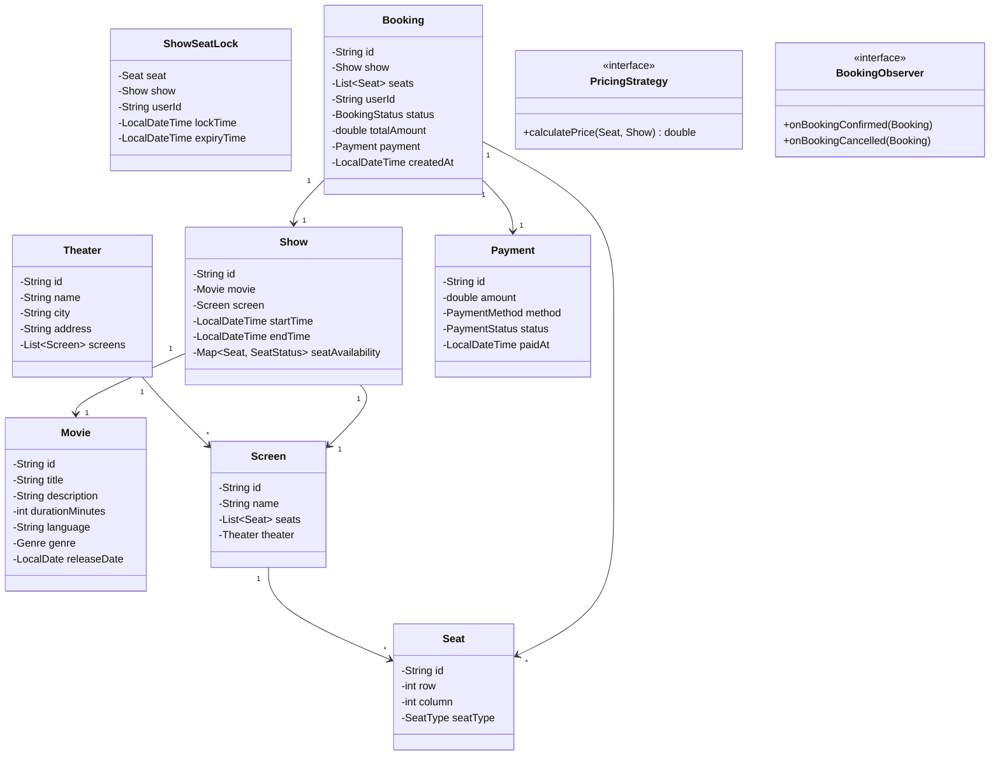
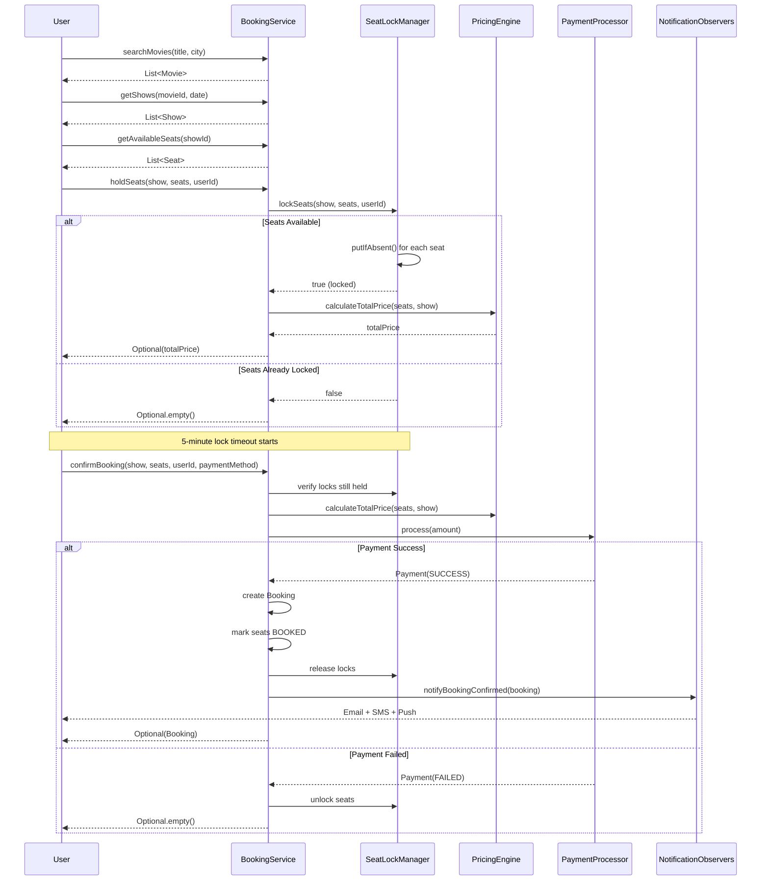

# Movie Ticket Booking System (BookMyShow) - Low-Level Design

## 1. Problem Statement

Design a movie ticket booking system that allows users to:
- Browse movies playing in their city
- View available shows across theaters
- Select seats and book tickets
- Handle concurrent seat bookings safely
- Process payments and send confirmations

### Requirements
- **Functional**: Search movies, view shows, select seats, book tickets, process payments, send notifications
- **Non-Functional**: Handle concurrent bookings, seat lock with timeout, consistency in seat allocation

---

## 2. UML Class Diagram



---

## 3. Design Patterns Used

| Pattern | Usage |
|---------|-------|
| **Strategy** | PricingStrategy for different pricing rules (base, weekend, peak hour) |
| **Observer** | Notifications on booking confirmation/cancellation |
| **Singleton** | BookingService, SeatLockManager |
| **Factory** | PaymentProcessor creation based on payment method |

---

## 4. SOLID Principles Applied

| Principle | Application |
|-----------|-------------|
| **SRP** | Each class has a single responsibility (Booking, Payment, SeatLock are separate) |
| **OCP** | PricingStrategy is open for extension (add new strategies without modifying existing) |
| **LSP** | All PricingStrategy implementations are interchangeable |
| **ISP** | BookingObserver has focused methods |
| **DIP** | Services depend on abstractions (PricingStrategy interface, PaymentProcessor interface) |

---

## 5. Complete Java Implementation

### Enums

```java
public enum SeatType {
    REGULAR, PREMIUM, VIP
}

public enum SeatStatus {
    AVAILABLE, LOCKED, BOOKED
}

public enum BookingStatus {
    PENDING, CONFIRMED, CANCELLED, EXPIRED
}

public enum PaymentStatus {
    PENDING, SUCCESS, FAILED, REFUNDED
}

public enum PaymentMethod {
    CREDIT_CARD, DEBIT_CARD, UPI, NET_BANKING, WALLET
}

public enum Genre {
    ACTION, COMEDY, DRAMA, HORROR, THRILLER, ROMANCE, SCI_FI
}
```

### Models

```java
import java.time.LocalDate;
import java.time.LocalDateTime;
import java.util.*;

public class Movie {
    private final String id;
    private final String title;
    private final String description;
    private final int durationMinutes;
    private final String language;
    private final Genre genre;
    private final LocalDate releaseDate;
    private final double rating;

    public Movie(String id, String title, String description, int durationMinutes,
                 String language, Genre genre, LocalDate releaseDate, double rating) {
        this.id = id;
        this.title = title;
        this.description = description;
        this.durationMinutes = durationMinutes;
        this.language = language;
        this.genre = genre;
        this.releaseDate = releaseDate;
        this.rating = rating;
    }

    // Getters
    public String getId() { return id; }
    public String getTitle() { return title; }
    public String getDescription() { return description; }
    public int getDurationMinutes() { return durationMinutes; }
    public String getLanguage() { return language; }
    public Genre getGenre() { return genre; }
    public LocalDate getReleaseDate() { return releaseDate; }
    public double getRating() { return rating; }
}

public class Seat {
    private final String id;
    private final int row;
    private final int column;
    private final SeatType seatType;

    public Seat(String id, int row, int column, SeatType seatType) {
        this.id = id;
        this.row = row;
        this.column = column;
        this.seatType = seatType;
    }

    public String getId() { return id; }
    public int getRow() { return row; }
    public int getColumn() { return column; }
    public SeatType getSeatType() { return seatType; }

    @Override
    public boolean equals(Object o) {
        if (this == o) return true;
        if (!(o instanceof Seat seat)) return false;
        return Objects.equals(id, seat.id);
    }

    @Override
    public int hashCode() { return Objects.hash(id); }
}

public class Screen {
    private final String id;
    private final String name;
    private final List<Seat> seats;

    public Screen(String id, String name, List<Seat> seats) {
        this.id = id;
        this.name = name;
        this.seats = Collections.unmodifiableList(seats);
    }

    public String getId() { return id; }
    public String getName() { return name; }
    public List<Seat> getSeats() { return seats; }
}

public class Theater {
    private final String id;
    private final String name;
    private final String city;
    private final String address;
    private final List<Screen> screens;

    public Theater(String id, String name, String city, String address, List<Screen> screens) {
        this.id = id;
        this.name = name;
        this.city = city;
        this.address = address;
        this.screens = new ArrayList<>(screens);
    }

    public String getId() { return id; }
    public String getName() { return name; }
    public String getCity() { return city; }
    public String getAddress() { return address; }
    public List<Screen> getScreens() { return Collections.unmodifiableList(screens); }
}

public class Show {
    private final String id;
    private final Movie movie;
    private final Screen screen;
    private final LocalDateTime startTime;
    private final LocalDateTime endTime;
    private final Map<Seat, SeatStatus> seatAvailability;

    public Show(String id, Movie movie, Screen screen, LocalDateTime startTime) {
        this.id = id;
        this.movie = movie;
        this.screen = screen;
        this.startTime = startTime;
        this.endTime = startTime.plusMinutes(movie.getDurationMinutes());
        this.seatAvailability = new HashMap<>();
        screen.getSeats().forEach(seat -> seatAvailability.put(seat, SeatStatus.AVAILABLE));
    }

    public String getId() { return id; }
    public Movie getMovie() { return movie; }
    public Screen getScreen() { return screen; }
    public LocalDateTime getStartTime() { return startTime; }
    public LocalDateTime getEndTime() { return endTime; }

    public Map<Seat, SeatStatus> getSeatAvailability() {
        return Collections.unmodifiableMap(seatAvailability);
    }

    public synchronized void setSeatStatus(Seat seat, SeatStatus status) {
        seatAvailability.put(seat, status);
    }

    public synchronized SeatStatus getSeatStatus(Seat seat) {
        return seatAvailability.getOrDefault(seat, SeatStatus.AVAILABLE);
    }

    public List<Seat> getAvailableSeats() {
        return seatAvailability.entrySet().stream()
                .filter(e -> e.getValue() == SeatStatus.AVAILABLE)
                .map(Map.Entry::getKey)
                .toList();
    }
}

public class Payment {
    private final String id;
    private final double amount;
    private final PaymentMethod method;
    private PaymentStatus status;
    private LocalDateTime paidAt;

    public Payment(String id, double amount, PaymentMethod method) {
        this.id = id;
        this.amount = amount;
        this.method = method;
        this.status = PaymentStatus.PENDING;
    }

    public String getId() { return id; }
    public double getAmount() { return amount; }
    public PaymentMethod getMethod() { return method; }
    public PaymentStatus getStatus() { return status; }
    public LocalDateTime getPaidAt() { return paidAt; }

    public void markSuccess() {
        this.status = PaymentStatus.SUCCESS;
        this.paidAt = LocalDateTime.now();
    }

    public void markFailed() {
        this.status = PaymentStatus.FAILED;
    }

    public void markRefunded() {
        this.status = PaymentStatus.REFUNDED;
    }
}

public class Booking {
    private final String id;
    private final Show show;
    private final List<Seat> seats;
    private final String userId;
    private BookingStatus status;
    private double totalAmount;
    private Payment payment;
    private final LocalDateTime createdAt;

    public Booking(String id, Show show, List<Seat> seats, String userId, double totalAmount) {
        this.id = id;
        this.show = show;
        this.seats = List.copyOf(seats);
        this.userId = userId;
        this.totalAmount = totalAmount;
        this.status = BookingStatus.PENDING;
        this.createdAt = LocalDateTime.now();
    }

    public String getId() { return id; }
    public Show getShow() { return show; }
    public List<Seat> getSeats() { return seats; }
    public String getUserId() { return userId; }
    public BookingStatus getStatus() { return status; }
    public double getTotalAmount() { return totalAmount; }
    public Payment getPayment() { return payment; }
    public LocalDateTime getCreatedAt() { return createdAt; }

    public void confirm(Payment payment) {
        this.payment = payment;
        this.status = BookingStatus.CONFIRMED;
    }

    public void cancel() {
        this.status = BookingStatus.CANCELLED;
    }

    public void expire() {
        this.status = BookingStatus.EXPIRED;
    }
}
```

### Seat Lock with Timeout

```java
import java.time.Duration;
import java.time.LocalDateTime;
import java.util.concurrent.*;

public class ShowSeatLock {
    private final Seat seat;
    private final Show show;
    private final String userId;
    private final LocalDateTime lockTime;
    private final LocalDateTime expiryTime;

    public ShowSeatLock(Seat seat, Show show, String userId, Duration lockDuration) {
        this.seat = seat;
        this.show = show;
        this.userId = userId;
        this.lockTime = LocalDateTime.now();
        this.expiryTime = lockTime.plus(lockDuration);
    }

    public boolean isExpired() {
        return LocalDateTime.now().isAfter(expiryTime);
    }

    public Seat getSeat() { return seat; }
    public Show getShow() { return show; }
    public String getUserId() { return userId; }
    public LocalDateTime getLockTime() { return lockTime; }
    public LocalDateTime getExpiryTime() { return expiryTime; }
}

/**
 * Manages temporary seat locks with automatic expiry.
 * Ensures only one user can hold a seat at a time.
 */
public class SeatLockManager {
    private static final Duration DEFAULT_LOCK_DURATION = Duration.ofMinutes(5);
    private static volatile SeatLockManager instance;

    // Key: "showId:seatId" -> Lock
    private final ConcurrentHashMap<String, ShowSeatLock> locks = new ConcurrentHashMap<>();
    private final ScheduledExecutorService scheduler = Executors.newScheduledThreadPool(1);

    private SeatLockManager() {
        // Periodic cleanup of expired locks
        scheduler.scheduleAtFixedRate(this::cleanupExpiredLocks, 1, 1, TimeUnit.MINUTES);
    }

    public static SeatLockManager getInstance() {
        if (instance == null) {
            synchronized (SeatLockManager.class) {
                if (instance == null) {
                    instance = new SeatLockManager();
                }
            }
        }
        return instance;
    }

    /**
     * Attempts to lock a seat for a user. Returns true if lock acquired.
     */
    public boolean lockSeat(Show show, Seat seat, String userId) {
        String key = getLockKey(show, seat);

        ShowSeatLock existingLock = locks.get(key);
        if (existingLock != null && !existingLock.isExpired()) {
            // Already locked by someone else
            return existingLock.getUserId().equals(userId);
        }

        ShowSeatLock newLock = new ShowSeatLock(seat, show, userId, DEFAULT_LOCK_DURATION);
        ShowSeatLock previousLock = locks.putIfAbsent(key, newLock);

        if (previousLock == null) {
            // Successfully acquired lock
            show.setSeatStatus(seat, SeatStatus.LOCKED);
            return true;
        }

        // Another thread beat us - check if their lock is expired
        if (previousLock.isExpired()) {
            if (locks.replace(key, previousLock, newLock)) {
                show.setSeatStatus(seat, SeatStatus.LOCKED);
                return true;
            }
        }

        return previousLock.getUserId().equals(userId);
    }

    /**
     * Locks multiple seats atomically - either all succeed or none.
     */
    public boolean lockSeats(Show show, List<Seat> seats, String userId) {
        List<Seat> lockedSeats = new ArrayList<>();

        for (Seat seat : seats) {
            if (lockSeat(show, seat, userId)) {
                lockedSeats.add(seat);
            } else {
                // Rollback: unlock all seats we locked
                lockedSeats.forEach(s -> unlockSeat(show, s, userId));
                return false;
            }
        }
        return true;
    }

    public void unlockSeat(Show show, Seat seat, String userId) {
        String key = getLockKey(show, seat);
        ShowSeatLock lock = locks.get(key);
        if (lock != null && lock.getUserId().equals(userId)) {
            locks.remove(key);
            show.setSeatStatus(seat, SeatStatus.AVAILABLE);
        }
    }

    public void unlockSeats(Show show, List<Seat> seats, String userId) {
        seats.forEach(seat -> unlockSeat(show, seat, userId));
    }

    public boolean isLocked(Show show, Seat seat) {
        String key = getLockKey(show, seat);
        ShowSeatLock lock = locks.get(key);
        return lock != null && !lock.isExpired();
    }

    private String getLockKey(Show show, Seat seat) {
        return show.getId() + ":" + seat.getId();
    }

    private void cleanupExpiredLocks() {
        locks.entrySet().removeIf(entry -> {
            if (entry.getValue().isExpired()) {
                ShowSeatLock lock = entry.getValue();
                lock.getShow().setSeatStatus(lock.getSeat(), SeatStatus.AVAILABLE);
                return true;
            }
            return false;
        });
    }
}
```

### Pricing Strategy (Strategy Pattern)

```java
public interface PricingStrategy {
    double calculatePrice(Seat seat, Show show);
}

public class BasePricingStrategy implements PricingStrategy {
    private static final Map<SeatType, Double> BASE_PRICES = Map.of(
            SeatType.REGULAR, 200.0,
            SeatType.PREMIUM, 350.0,
            SeatType.VIP, 500.0
    );

    @Override
    public double calculatePrice(Seat seat, Show show) {
        return BASE_PRICES.getOrDefault(seat.getSeatType(), 200.0);
    }
}

public class WeekendPricingStrategy implements PricingStrategy {
    private final PricingStrategy baseStrategy;
    private static final double WEEKEND_MULTIPLIER = 1.3;

    public WeekendPricingStrategy(PricingStrategy baseStrategy) {
        this.baseStrategy = baseStrategy;
    }

    @Override
    public double calculatePrice(Seat seat, Show show) {
        double basePrice = baseStrategy.calculatePrice(seat, show);
        var dayOfWeek = show.getStartTime().getDayOfWeek();
        if (dayOfWeek == java.time.DayOfWeek.SATURDAY || dayOfWeek == java.time.DayOfWeek.SUNDAY) {
            return basePrice * WEEKEND_MULTIPLIER;
        }
        return basePrice;
    }
}

public class PeakHourPricingStrategy implements PricingStrategy {
    private final PricingStrategy baseStrategy;
    private static final double PEAK_MULTIPLIER = 1.2;
    private static final int PEAK_START = 18; // 6 PM
    private static final int PEAK_END = 21;   // 9 PM

    public PeakHourPricingStrategy(PricingStrategy baseStrategy) {
        this.baseStrategy = baseStrategy;
    }

    @Override
    public double calculatePrice(Seat seat, Show show) {
        double basePrice = baseStrategy.calculatePrice(seat, show);
        int hour = show.getStartTime().getHour();
        if (hour >= PEAK_START && hour <= PEAK_END) {
            return basePrice * PEAK_MULTIPLIER;
        }
        return basePrice;
    }
}

/**
 * Composes multiple pricing strategies using Decorator pattern.
 */
public class PricingEngine {
    private PricingStrategy strategy;

    public PricingEngine() {
        // Default: base -> weekend -> peak hour (decorators)
        PricingStrategy base = new BasePricingStrategy();
        PricingStrategy weekend = new WeekendPricingStrategy(base);
        this.strategy = new PeakHourPricingStrategy(weekend);
    }

    public PricingEngine(PricingStrategy strategy) {
        this.strategy = strategy;
    }

    public double calculateTotalPrice(List<Seat> seats, Show show) {
        return seats.stream()
                .mapToDouble(seat -> strategy.calculatePrice(seat, show))
                .sum();
    }

    public void setStrategy(PricingStrategy strategy) {
        this.strategy = strategy;
    }
}
```

### Observer Pattern for Notifications

```java
public interface BookingObserver {
    void onBookingConfirmed(Booking booking);
    void onBookingCancelled(Booking booking);
}

public class EmailNotificationObserver implements BookingObserver {
    @Override
    public void onBookingConfirmed(Booking booking) {
        System.out.printf("[EMAIL] Booking %s confirmed for user %s. Movie: %s, Seats: %d%n",
                booking.getId(), booking.getUserId(),
                booking.getShow().getMovie().getTitle(), booking.getSeats().size());
    }

    @Override
    public void onBookingCancelled(Booking booking) {
        System.out.printf("[EMAIL] Booking %s cancelled for user %s.%n",
                booking.getId(), booking.getUserId());
    }
}

public class SMSNotificationObserver implements BookingObserver {
    @Override
    public void onBookingConfirmed(Booking booking) {
        System.out.printf("[SMS] Ticket booked! ID: %s, Movie: %s%n",
                booking.getId(), booking.getShow().getMovie().getTitle());
    }

    @Override
    public void onBookingCancelled(Booking booking) {
        System.out.printf("[SMS] Booking %s has been cancelled.%n", booking.getId());
    }
}

public class PushNotificationObserver implements BookingObserver {
    @Override
    public void onBookingConfirmed(Booking booking) {
        System.out.printf("[PUSH] Your tickets for '%s' are confirmed!%n",
                booking.getShow().getMovie().getTitle());
    }

    @Override
    public void onBookingCancelled(Booking booking) {
        System.out.printf("[PUSH] Your booking for '%s' was cancelled.%n",
                booking.getShow().getMovie().getTitle());
    }
}
```

### Payment Processing (Factory Pattern)

```java
public interface PaymentProcessor {
    Payment process(double amount);
}

public class CreditCardProcessor implements PaymentProcessor {
    @Override
    public Payment process(double amount) {
        Payment payment = new Payment(UUID.randomUUID().toString(), amount, PaymentMethod.CREDIT_CARD);
        // Simulate payment gateway call
        payment.markSuccess();
        return payment;
    }
}

public class UPIProcessor implements PaymentProcessor {
    @Override
    public Payment process(double amount) {
        Payment payment = new Payment(UUID.randomUUID().toString(), amount, PaymentMethod.UPI);
        payment.markSuccess();
        return payment;
    }
}

public class WalletProcessor implements PaymentProcessor {
    @Override
    public Payment process(double amount) {
        Payment payment = new Payment(UUID.randomUUID().toString(), amount, PaymentMethod.WALLET);
        payment.markSuccess();
        return payment;
    }
}

public class PaymentProcessorFactory {
    public static PaymentProcessor create(PaymentMethod method) {
        return switch (method) {
            case CREDIT_CARD, DEBIT_CARD -> new CreditCardProcessor();
            case UPI -> new UPIProcessor();
            case WALLET -> new WalletProcessor();
            case NET_BANKING -> new CreditCardProcessor(); // simplified
        };
    }
}
```

### Search & Filter Service

```java
public class MovieSearchService {
    private final List<Movie> movies;
    private final Map<String, List<Show>> movieShows; // movieId -> shows

    public MovieSearchService(List<Movie> movies, Map<String, List<Show>> movieShows) {
        this.movies = movies;
        this.movieShows = movieShows;
    }

    public List<Movie> searchByTitle(String title) {
        return movies.stream()
                .filter(m -> m.getTitle().toLowerCase().contains(title.toLowerCase()))
                .toList();
    }

    public List<Movie> filterByGenre(Genre genre) {
        return movies.stream()
                .filter(m -> m.getGenre() == genre)
                .toList();
    }

    public List<Movie> filterByLanguage(String language) {
        return movies.stream()
                .filter(m -> m.getLanguage().equalsIgnoreCase(language))
                .toList();
    }

    public List<Show> getShowsForMovie(String movieId, String city) {
        return movieShows.getOrDefault(movieId, List.of()).stream()
                .filter(show -> true) // In real system, filter by city via theater
                .toList();
    }

    public List<Show> getShowsByDate(String movieId, LocalDate date) {
        return movieShows.getOrDefault(movieId, List.of()).stream()
                .filter(show -> show.getStartTime().toLocalDate().equals(date))
                .toList();
    }
}
```

### Booking Service (Orchestrator)

```java
import java.util.*;
import java.util.concurrent.ConcurrentHashMap;

public class BookingService {
    private static volatile BookingService instance;

    private final SeatLockManager seatLockManager;
    private final PricingEngine pricingEngine;
    private final List<BookingObserver> observers;
    private final Map<String, Booking> bookings;

    private BookingService() {
        this.seatLockManager = SeatLockManager.getInstance();
        this.pricingEngine = new PricingEngine();
        this.observers = new ArrayList<>();
        this.bookings = new ConcurrentHashMap<>();
    }

    public static BookingService getInstance() {
        if (instance == null) {
            synchronized (BookingService.class) {
                if (instance == null) {
                    instance = new BookingService();
                }
            }
        }
        return instance;
    }

    public void addObserver(BookingObserver observer) {
        observers.add(observer);
    }

    public void removeObserver(BookingObserver observer) {
        observers.remove(observer);
    }

    /**
     * Step 1: Hold seats temporarily for the user.
     * Returns calculated total price if seats locked successfully.
     */
    public Optional<Double> holdSeats(Show show, List<Seat> seats, String userId) {
        // Validate seats are available
        for (Seat seat : seats) {
            SeatStatus status = show.getSeatStatus(seat);
            if (status == SeatStatus.BOOKED) {
                return Optional.empty();
            }
        }

        // Try to acquire locks
        boolean locked = seatLockManager.lockSeats(show, seats, userId);
        if (!locked) {
            return Optional.empty();
        }

        // Calculate price
        double totalPrice = pricingEngine.calculateTotalPrice(seats, show);
        return Optional.of(totalPrice);
    }

    /**
     * Step 2: Confirm booking after successful payment.
     */
    public Optional<Booking> confirmBooking(Show show, List<Seat> seats,
                                             String userId, PaymentMethod paymentMethod) {
        // Verify seats are still locked by this user
        for (Seat seat : seats) {
            if (!seatLockManager.isLocked(show, seat)) {
                return Optional.empty(); // Lock expired
            }
        }

        // Calculate final price
        double totalAmount = pricingEngine.calculateTotalPrice(seats, show);

        // Process payment
        PaymentProcessor processor = PaymentProcessorFactory.create(paymentMethod);
        Payment payment = processor.process(totalAmount);

        if (payment.getStatus() != PaymentStatus.SUCCESS) {
            seatLockManager.unlockSeats(show, seats, userId);
            return Optional.empty();
        }

        // Create booking
        String bookingId = "BKG-" + UUID.randomUUID().toString().substring(0, 8).toUpperCase();
        Booking booking = new Booking(bookingId, show, seats, userId, totalAmount);
        booking.confirm(payment);

        // Mark seats as booked permanently
        seats.forEach(seat -> show.setSeatStatus(seat, SeatStatus.BOOKED));

        // Release locks (seats are now booked, not locked)
        seatLockManager.unlockSeats(show, seats, userId);

        // Store booking
        bookings.put(bookingId, booking);

        // Notify observers
        notifyBookingConfirmed(booking);

        return Optional.of(booking);
    }

    /**
     * Cancel an existing booking.
     */
    public boolean cancelBooking(String bookingId) {
        Booking booking = bookings.get(bookingId);
        if (booking == null || booking.getStatus() != BookingStatus.CONFIRMED) {
            return false;
        }

        booking.cancel();

        // Release seats
        booking.getSeats().forEach(seat ->
                booking.getShow().setSeatStatus(seat, SeatStatus.AVAILABLE));

        // Refund payment
        if (booking.getPayment() != null) {
            booking.getPayment().markRefunded();
        }

        // Notify observers
        notifyBookingCancelled(booking);
        return true;
    }

    public Optional<Booking> getBooking(String bookingId) {
        return Optional.ofNullable(bookings.get(bookingId));
    }

    private void notifyBookingConfirmed(Booking booking) {
        observers.forEach(o -> o.onBookingConfirmed(booking));
    }

    private void notifyBookingCancelled(Booking booking) {
        observers.forEach(o -> o.onBookingCancelled(booking));
    }
}
```

### Main - Demo Usage

```java
public class MovieBookingDemo {
    public static void main(String[] args) {
        // Setup
        Movie movie = new Movie("M1", "Inception", "A mind-bending thriller",
                148, "English", Genre.SCI_FI, LocalDate.of(2024, 1, 15), 8.8);

        List<Seat> seats = List.of(
                new Seat("S1", 1, 1, SeatType.REGULAR),
                new Seat("S2", 1, 2, SeatType.REGULAR),
                new Seat("S3", 1, 3, SeatType.PREMIUM),
                new Seat("S4", 2, 1, SeatType.PREMIUM),
                new Seat("S5", 3, 1, SeatType.VIP)
        );

        Screen screen = new Screen("SCR1", "Screen 1", seats);
        Theater theater = new Theater("T1", "PVR Cinemas", "Mumbai",
                "Phoenix Mall", List.of(screen));

        Show show = new Show("SH1", movie, screen,
                LocalDateTime.of(2024, 6, 15, 19, 0)); // Saturday 7 PM

        // Configure booking service
        BookingService bookingService = BookingService.getInstance();
        bookingService.addObserver(new EmailNotificationObserver());
        bookingService.addObserver(new SMSNotificationObserver());
        bookingService.addObserver(new PushNotificationObserver());

        // === Booking Flow ===
        String userId = "USER-001";
        List<Seat> selectedSeats = List.of(seats.get(0), seats.get(2)); // S1 (Regular) + S3 (Premium)

        System.out.println("=== Available Seats ===");
        show.getAvailableSeats().forEach(s ->
                System.out.printf("  Seat %s [%s] - Row %d, Col %d%n",
                        s.getId(), s.getSeatType(), s.getRow(), s.getColumn()));

        // Step 1: Hold seats
        System.out.println("\n=== Holding Seats ===");
        Optional<Double> price = bookingService.holdSeats(show, selectedSeats, userId);
        if (price.isPresent()) {
            System.out.printf("Seats held! Total price: ₹%.2f%n", price.get());
        } else {
            System.out.println("Failed to hold seats - already taken!");
            return;
        }

        // Simulate concurrent user trying same seats
        String anotherUser = "USER-002";
        Optional<Double> concurrentAttempt = bookingService.holdSeats(show, selectedSeats, anotherUser);
        System.out.printf("Concurrent user attempt: %s%n",
                concurrentAttempt.isPresent() ? "SUCCESS" : "BLOCKED (seats locked)");

        // Step 2: Confirm booking with payment
        System.out.println("\n=== Confirming Booking ===");
        Optional<Booking> booking = bookingService.confirmBooking(
                show, selectedSeats, userId, PaymentMethod.UPI);

        if (booking.isPresent()) {
            Booking b = booking.get();
            System.out.printf("%nBooking Confirmed!%n");
            System.out.printf("  ID: %s%n", b.getId());
            System.out.printf("  Movie: %s%n", b.getShow().getMovie().getTitle());
            System.out.printf("  Seats: %d%n", b.getSeats().size());
            System.out.printf("  Amount: ₹%.2f%n", b.getTotalAmount());
            System.out.printf("  Status: %s%n", b.getStatus());
        }

        // Show remaining available seats
        System.out.println("\n=== Remaining Available Seats ===");
        show.getAvailableSeats().forEach(s ->
                System.out.printf("  Seat %s [%s]%n", s.getId(), s.getSeatType()));
    }
}
```

---

## 6. Concurrency Handling

### Strategy: Optimistic Locking with Timeout

```
┌─────────────────────────────────────────────────────┐
│              Seat Locking Mechanism                  │
├─────────────────────────────────────────────────────┤
│                                                     │
│  1. ConcurrentHashMap for lock storage              │
│  2. putIfAbsent() for atomic lock acquisition       │
│  3. 5-minute TTL on locks (auto-expire)             │
│  4. Scheduled cleanup of expired locks              │
│  5. All-or-nothing multi-seat locking               │
│                                                     │
│  Flow:                                              │
│  User A selects seats → locks acquired              │
│  User B selects same seats → BLOCKED                │
│  User A doesn't pay in 5 min → locks expire         │
│  User B retries → locks acquired                    │
│                                                     │
└─────────────────────────────────────────────────────┘
```

### Key Concurrency Decisions:

| Approach | Used Where |
|----------|-----------|
| `ConcurrentHashMap.putIfAbsent()` | Atomic lock acquisition |
| `synchronized` on Show methods | Seat status updates |
| Lock TTL (5 minutes) | Prevents indefinite holds |
| All-or-nothing locking | Multi-seat atomicity (rollback on failure) |
| Scheduled cleanup thread | Releases expired locks |

### Alternative: Database-Level Locking (Production)

```java
// In production, use database-level pessimistic locking:
// SELECT * FROM show_seats WHERE show_id=? AND seat_id=? FOR UPDATE;
// Or optimistic locking with version column:
// UPDATE show_seats SET status='LOCKED', version=version+1
//   WHERE show_id=? AND seat_id=? AND version=? AND status='AVAILABLE';
```

---

## 7. Sequence Diagram - Booking Flow



---

## 8. Key Interview Points

### Design Decisions

1. **Why ConcurrentHashMap over synchronized HashMap?**
   - Better concurrency (segment-level locking in Java 7, node-level in Java 8+)
   - `putIfAbsent()` provides atomic check-and-set

2. **Why Strategy Pattern for Pricing?**
   - Prices vary by day, time, occasion, demand
   - New pricing rules can be added without modifying existing code (OCP)
   - Strategies compose via Decorator pattern

3. **Why Observer for Notifications?**
   - Booking service shouldn't know about notification channels
   - Easy to add/remove notification types
   - Decouples booking logic from notification logic

4. **Why lock timeout instead of immediate release?**
   - Users need time to enter payment details
   - Prevents abandoned sessions from blocking seats permanently
   - Industry standard: 5-10 minute hold

### Scalability Considerations

| Concern | Solution |
|---------|----------|
| High concurrency on popular shows | Distributed locks (Redis SETNX with TTL) |
| Seat status consistency | Event sourcing / CQRS pattern |
| Payment failures | Saga pattern with compensating transactions |
| Search performance | Read replicas, Elasticsearch for movie search |
| Peak load (new releases) | Queue-based booking with virtual waiting room |

### Production Enhancements

- **Redis-based distributed locking** (SETNX + TTL) instead of in-memory ConcurrentHashMap
- **Idempotency keys** for payment retries
- **Event-driven architecture**: Booking events → notifications, analytics, loyalty points
- **Rate limiting** per user to prevent bot bookings
- **Waitlist** when show is fully booked

### Common Interview Follow-ups

1. **How to handle double-booking?** → Atomic lock with putIfAbsent + DB unique constraint
2. **What if payment gateway is slow?** → Async payment with status polling, lock extends
3. **How to scale for IPL-level traffic?** → Queue + virtual waiting room + distributed locks
4. **How to handle partial refunds?** → Track per-seat pricing, refund specific seats
5. **How to support dynamic pricing?** → Strategy pattern with real-time demand data input

### Time & Space Complexity

| Operation | Time | Space |
|-----------|------|-------|
| Lock seat | O(1) | O(S) per show where S = seats |
| Search movies | O(N) | O(1) |
| Calculate price | O(K) | O(1) where K = selected seats |
| Confirm booking | O(K) | O(1) |
| Cleanup expired locks | O(L) | O(1) where L = total locks |

---

## Class Responsibility Summary

| Class | Responsibility |
|-------|---------------|
| `Movie, Theater, Screen, Seat, Show` | Domain models |
| `SeatLockManager` | Concurrency-safe temporary seat holds |
| `PricingEngine` | Price calculation with composable strategies |
| `BookingService` | Orchestrates the entire booking workflow |
| `PaymentProcessorFactory` | Creates appropriate payment handler |
| `BookingObserver` implementations | Notification delivery |
