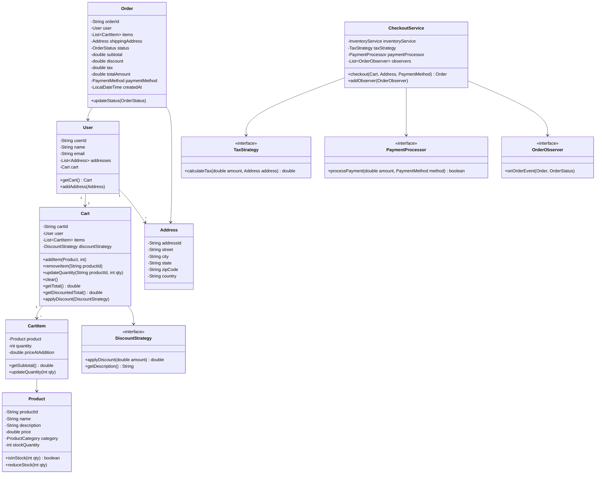
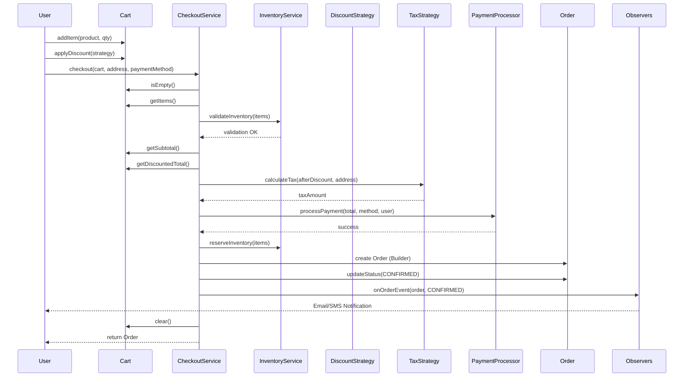
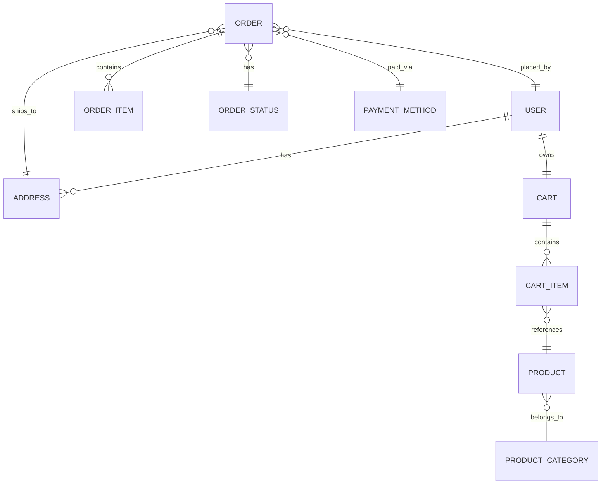

# Low-Level Design: Online Shopping Cart / E-Commerce System

## 1. Problem Statement

Design an online shopping cart system that supports:
- Adding/removing/updating products in cart
- Multiple discount strategies (percentage, flat, BOGO, coupon)
- Checkout flow with inventory validation, tax calculation, payment processing
- Order management with status tracking
- Notifications on order events (observer pattern)
- Extensible pricing and tax strategies

---

## 2. UML Class Diagram



---

## 3. Design Patterns Used

| Pattern | Where | Why |
|---------|-------|-----|
| **Strategy** | DiscountStrategy, TaxStrategy, PaymentProcessor | Interchangeable algorithms for pricing, tax, payment |
| **Observer** | OrderObserver (email, inventory, analytics) | Decouple order events from notification logic |
| **Factory** | OrderFactory | Centralize Order creation logic |
| **Decorator** | CartItemDecorator (gift wrap, express shipping) | Add responsibilities to cart items dynamically |

---

## 4. SOLID Principles Applied

| Principle | Application |
|-----------|-------------|
| **SRP** | Each class has one responsibility — Cart manages items, CheckoutService handles flow, DiscountStrategy handles discounts |
| **OCP** | New discounts/tax/payment added without modifying existing code (Strategy pattern) |
| **LSP** | All DiscountStrategy implementations are interchangeable |
| **ISP** | Small focused interfaces (DiscountStrategy, TaxStrategy, PaymentProcessor, OrderObserver) |
| **DIP** | CheckoutService depends on abstractions (interfaces), not concrete implementations |

---

## 5. Complete Java Implementation

### Enums

```java
public enum ProductCategory {
    ELECTRONICS, CLOTHING, BOOKS, FOOD, HOME, SPORTS, BEAUTY
}

public enum OrderStatus {
    CREATED, CONFIRMED, PROCESSING, SHIPPED, DELIVERED, CANCELLED, REFUNDED
}

public enum PaymentMethod {
    CREDIT_CARD, DEBIT_CARD, UPI, NET_BANKING, WALLET, COD
}
```

### Models

```java
import java.util.*;

public class Address {
    private final String addressId;
    private String street;
    private String city;
    private String state;
    private String zipCode;
    private String country;

    public Address(String addressId, String street, String city, String state, String zipCode, String country) {
        this.addressId = addressId;
        this.street = street;
        this.city = city;
        this.state = state;
        this.zipCode = zipCode;
        this.country = country;
    }

    // Getters
    public String getAddressId() { return addressId; }
    public String getState() { return state; }
    public String getCountry() { return country; }
    public String getZipCode() { return zipCode; }
}

public class Product {
    private final String productId;
    private String name;
    private String description;
    private double price;
    private ProductCategory category;
    private int stockQuantity;

    public Product(String productId, String name, String description, double price,
                   ProductCategory category, int stockQuantity) {
        this.productId = productId;
        this.name = name;
        this.description = description;
        this.price = price;
        this.category = category;
        this.stockQuantity = stockQuantity;
    }

    public boolean isInStock(int quantity) {
        return stockQuantity >= quantity;
    }

    public synchronized void reduceStock(int quantity) {
        if (!isInStock(quantity)) {
            throw new IllegalStateException("Insufficient stock for product: " + name);
        }
        this.stockQuantity -= quantity;
    }

    public synchronized void addStock(int quantity) {
        this.stockQuantity += quantity;
    }

    // Getters
    public String getProductId() { return productId; }
    public String getName() { return name; }
    public double getPrice() { return price; }
    public ProductCategory getCategory() { return category; }
    public int getStockQuantity() { return stockQuantity; }
}

public class CartItem {
    private final Product product;
    private int quantity;
    private final double priceAtAddition;

    public CartItem(Product product, int quantity) {
        this.product = product;
        this.quantity = quantity;
        this.priceAtAddition = product.getPrice();
    }

    public double getSubtotal() {
        return priceAtAddition * quantity;
    }

    public void updateQuantity(int quantity) {
        if (quantity <= 0) throw new IllegalArgumentException("Quantity must be positive");
        this.quantity = quantity;
    }

    public Product getProduct() { return product; }
    public int getQuantity() { return quantity; }
    public double getPriceAtAddition() { return priceAtAddition; }
}
```

### Cart

```java
import java.util.*;
import java.util.concurrent.ConcurrentHashMap;

public class Cart {
    private final String cartId;
    private final User user;
    private final Map<String, CartItem> items; // productId -> CartItem
    private DiscountStrategy discountStrategy;

    public Cart(String cartId, User user) {
        this.cartId = cartId;
        this.user = user;
        this.items = new ConcurrentHashMap<>();
    }

    public void addItem(Product product, int quantity) {
        if (quantity <= 0) throw new IllegalArgumentException("Quantity must be positive");
        if (!product.isInStock(quantity)) {
            throw new IllegalStateException("Product " + product.getName() + " is out of stock");
        }

        items.merge(product.getProductId(), new CartItem(product, quantity),
            (existing, newItem) -> {
                existing.updateQuantity(existing.getQuantity() + quantity);
                return existing;
            });
    }

    public void removeItem(String productId) {
        if (!items.containsKey(productId)) {
            throw new NoSuchElementException("Product not found in cart: " + productId);
        }
        items.remove(productId);
    }

    public void updateQuantity(String productId, int quantity) {
        CartItem item = items.get(productId);
        if (item == null) {
            throw new NoSuchElementException("Product not found in cart: " + productId);
        }
        if (quantity <= 0) {
            removeItem(productId);
        } else {
            item.updateQuantity(quantity);
        }
    }

    public void clear() {
        items.clear();
        discountStrategy = null;
    }

    public double getSubtotal() {
        return items.values().stream()
                .mapToDouble(CartItem::getSubtotal)
                .sum();
    }

    public double getDiscountedTotal() {
        double subtotal = getSubtotal();
        if (discountStrategy != null) {
            return subtotal - discountStrategy.applyDiscount(subtotal);
        }
        return subtotal;
    }

    public void applyDiscount(DiscountStrategy strategy) {
        this.discountStrategy = strategy;
    }

    public boolean isEmpty() {
        return items.isEmpty();
    }

    public List<CartItem> getItems() {
        return new ArrayList<>(items.values());
    }

    public String getCartId() { return cartId; }
    public User getUser() { return user; }
    public DiscountStrategy getDiscountStrategy() { return discountStrategy; }
}
```

### User

```java
import java.util.*;

public class User {
    private final String userId;
    private String name;
    private String email;
    private final List<Address> addresses;
    private final Cart cart;

    public User(String userId, String name, String email) {
        this.userId = userId;
        this.name = name;
        this.email = email;
        this.addresses = new ArrayList<>();
        this.cart = new Cart(UUID.randomUUID().toString(), this);
    }

    public void addAddress(Address address) {
        addresses.add(address);
    }

    public String getUserId() { return userId; }
    public String getName() { return name; }
    public String getEmail() { return email; }
    public Cart getCart() { return cart; }
    public List<Address> getAddresses() { return Collections.unmodifiableList(addresses); }
}
```

### Order

```java
import java.time.LocalDateTime;
import java.util.*;

public class Order {
    private final String orderId;
    private final User user;
    private final List<CartItem> items;
    private final Address shippingAddress;
    private OrderStatus status;
    private final double subtotal;
    private final double discount;
    private final double tax;
    private final double totalAmount;
    private final PaymentMethod paymentMethod;
    private final LocalDateTime createdAt;

    private Order(Builder builder) {
        this.orderId = builder.orderId;
        this.user = builder.user;
        this.items = Collections.unmodifiableList(builder.items);
        this.shippingAddress = builder.shippingAddress;
        this.status = OrderStatus.CREATED;
        this.subtotal = builder.subtotal;
        this.discount = builder.discount;
        this.tax = builder.tax;
        this.totalAmount = builder.totalAmount;
        this.paymentMethod = builder.paymentMethod;
        this.createdAt = LocalDateTime.now();
    }

    public void updateStatus(OrderStatus newStatus) {
        this.status = newStatus;
    }

    // Getters
    public String getOrderId() { return orderId; }
    public User getUser() { return user; }
    public List<CartItem> getItems() { return items; }
    public OrderStatus getStatus() { return status; }
    public double getTotalAmount() { return totalAmount; }
    public double getSubtotal() { return subtotal; }
    public double getDiscount() { return discount; }
    public double getTax() { return tax; }
    public PaymentMethod getPaymentMethod() { return paymentMethod; }
    public LocalDateTime getCreatedAt() { return createdAt; }

    // Builder Pattern
    public static class Builder {
        private String orderId;
        private User user;
        private List<CartItem> items;
        private Address shippingAddress;
        private double subtotal;
        private double discount;
        private double tax;
        private double totalAmount;
        private PaymentMethod paymentMethod;

        public Builder orderId(String orderId) { this.orderId = orderId; return this; }
        public Builder user(User user) { this.user = user; return this; }
        public Builder items(List<CartItem> items) { this.items = new ArrayList<>(items); return this; }
        public Builder shippingAddress(Address address) { this.shippingAddress = address; return this; }
        public Builder subtotal(double subtotal) { this.subtotal = subtotal; return this; }
        public Builder discount(double discount) { this.discount = discount; return this; }
        public Builder tax(double tax) { this.tax = tax; return this; }
        public Builder totalAmount(double total) { this.totalAmount = total; return this; }
        public Builder paymentMethod(PaymentMethod method) { this.paymentMethod = method; return this; }

        public Order build() {
            Objects.requireNonNull(orderId);
            Objects.requireNonNull(user);
            Objects.requireNonNull(items);
            Objects.requireNonNull(shippingAddress);
            return new Order(this);
        }
    }
}
```

### Discount Strategy (Strategy Pattern)

```java
public interface DiscountStrategy {
    double applyDiscount(double amount);
    String getDescription();
}

public class PercentageDiscount implements DiscountStrategy {
    private final double percentage;

    public PercentageDiscount(double percentage) {
        if (percentage < 0 || percentage > 100)
            throw new IllegalArgumentException("Percentage must be between 0 and 100");
        this.percentage = percentage;
    }

    @Override
    public double applyDiscount(double amount) {
        return amount * (percentage / 100.0);
    }

    @Override
    public String getDescription() {
        return percentage + "% off";
    }
}

public class FlatDiscount implements DiscountStrategy {
    private final double flatAmount;

    public FlatDiscount(double flatAmount) {
        if (flatAmount < 0) throw new IllegalArgumentException("Discount cannot be negative");
        this.flatAmount = flatAmount;
    }

    @Override
    public double applyDiscount(double amount) {
        return Math.min(flatAmount, amount); // discount can't exceed total
    }

    @Override
    public String getDescription() {
        return "Flat $" + flatAmount + " off";
    }
}

public class BuyOneGetOneFree implements DiscountStrategy {
    // Applies to the cheapest item — simplified as 50% off for pairs
    @Override
    public double applyDiscount(double amount) {
        return amount * 0.5; // simplified: 50% off
    }

    @Override
    public String getDescription() {
        return "Buy One Get One Free";
    }
}

public class CouponDiscount implements DiscountStrategy {
    private final String couponCode;
    private final double percentage;
    private final double maxDiscount;
    private boolean used;

    public CouponDiscount(String couponCode, double percentage, double maxDiscount) {
        this.couponCode = couponCode;
        this.percentage = percentage;
        this.maxDiscount = maxDiscount;
        this.used = false;
    }

    @Override
    public double applyDiscount(double amount) {
        if (used) throw new IllegalStateException("Coupon already used: " + couponCode);
        double discount = amount * (percentage / 100.0);
        return Math.min(discount, maxDiscount);
    }

    public void markUsed() { this.used = true; }

    @Override
    public String getDescription() {
        return "Coupon " + couponCode + ": " + percentage + "% off (max $" + maxDiscount + ")";
    }
}

// Composite discount — stack multiple discounts
public class CompositeDiscount implements DiscountStrategy {
    private final List<DiscountStrategy> strategies;

    public CompositeDiscount(List<DiscountStrategy> strategies) {
        this.strategies = new ArrayList<>(strategies);
    }

    @Override
    public double applyDiscount(double amount) {
        double totalDiscount = 0;
        double remaining = amount;
        for (DiscountStrategy strategy : strategies) {
            double discount = strategy.applyDiscount(remaining);
            totalDiscount += discount;
            remaining -= discount;
        }
        return totalDiscount;
    }

    @Override
    public String getDescription() {
        return strategies.stream()
                .map(DiscountStrategy::getDescription)
                .reduce((a, b) -> a + " + " + b)
                .orElse("No discount");
    }
}
```

### Tax Strategy

```java
public interface TaxStrategy {
    double calculateTax(double amount, Address shippingAddress);
    String getDescription();
}

public class DefaultTaxStrategy implements TaxStrategy {
    private static final Map<String, Double> STATE_TAX_RATES = Map.of(
        "CA", 0.0725,
        "NY", 0.08,
        "TX", 0.0625,
        "FL", 0.06,
        "WA", 0.065
    );
    private static final double DEFAULT_TAX_RATE = 0.05;

    @Override
    public double calculateTax(double amount, Address address) {
        double rate = STATE_TAX_RATES.getOrDefault(address.getState(), DEFAULT_TAX_RATE);
        return amount * rate;
    }

    @Override
    public String getDescription() {
        return "State-based tax calculation";
    }
}

public class GSTTaxStrategy implements TaxStrategy {
    private static final double GST_RATE = 0.18;

    @Override
    public double calculateTax(double amount, Address address) {
        return amount * GST_RATE;
    }

    @Override
    public String getDescription() {
        return "GST @ 18%";
    }
}
```

### Payment Processor

```java
public interface PaymentProcessor {
    boolean processPayment(double amount, PaymentMethod method, User user);
    boolean refund(String transactionId, double amount);
}

public class DefaultPaymentProcessor implements PaymentProcessor {
    @Override
    public boolean processPayment(double amount, PaymentMethod method, User user) {
        // Simulate payment gateway call
        System.out.println("Processing payment of $" + String.format("%.2f", amount)
                + " via " + method + " for user: " + user.getName());
        // In real system: call payment gateway API
        return true; // simulate success
    }

    @Override
    public boolean refund(String transactionId, double amount) {
        System.out.println("Refunding $" + String.format("%.2f", amount)
                + " for transaction: " + transactionId);
        return true;
    }
}
```

### Inventory Service

```java
public class InventoryService {

    public void validateInventory(List<CartItem> items) {
        List<String> outOfStock = new ArrayList<>();
        for (CartItem item : items) {
            if (!item.getProduct().isInStock(item.getQuantity())) {
                outOfStock.add(item.getProduct().getName()
                        + " (requested: " + item.getQuantity()
                        + ", available: " + item.getProduct().getStockQuantity() + ")");
            }
        }
        if (!outOfStock.isEmpty()) {
            throw new IllegalStateException("Items out of stock: " + String.join(", ", outOfStock));
        }
    }

    public void reserveInventory(List<CartItem> items) {
        for (CartItem item : items) {
            item.getProduct().reduceStock(item.getQuantity());
        }
    }

    public void releaseInventory(List<CartItem> items) {
        for (CartItem item : items) {
            item.getProduct().addStock(item.getQuantity());
        }
    }
}
```

### Observer Pattern — Order Notifications

```java
public interface OrderObserver {
    void onOrderEvent(Order order, OrderStatus status);
}

public class EmailNotificationObserver implements OrderObserver {
    @Override
    public void onOrderEvent(Order order, OrderStatus status) {
        System.out.println("[EMAIL] Order " + order.getOrderId()
                + " status: " + status + " | Sent to: " + order.getUser().getEmail());
    }
}

public class SMSNotificationObserver implements OrderObserver {
    @Override
    public void onOrderEvent(Order order, OrderStatus status) {
        System.out.println("[SMS] Order " + order.getOrderId() + " is now " + status);
    }
}

public class InventoryUpdateObserver implements OrderObserver {
    @Override
    public void onOrderEvent(Order order, OrderStatus status) {
        if (status == OrderStatus.CANCELLED) {
            System.out.println("[INVENTORY] Restoring stock for cancelled order: " + order.getOrderId());
            // In real system: release reserved inventory
        }
    }
}

public class AnalyticsObserver implements OrderObserver {
    @Override
    public void onOrderEvent(Order order, OrderStatus status) {
        System.out.println("[ANALYTICS] Order " + order.getOrderId()
                + " | Total: $" + String.format("%.2f", order.getTotalAmount())
                + " | Status: " + status);
    }
}
```

### Decorator Pattern — CartItem Modifications

```java
public abstract class CartItemDecorator extends CartItem {
    protected final CartItem wrappedItem;

    public CartItemDecorator(CartItem item) {
        super(item.getProduct(), item.getQuantity());
        this.wrappedItem = item;
    }

    @Override
    public abstract double getSubtotal();
}

public class GiftWrapDecorator extends CartItemDecorator {
    private static final double GIFT_WRAP_COST = 5.99;

    public GiftWrapDecorator(CartItem item) {
        super(item);
    }

    @Override
    public double getSubtotal() {
        return wrappedItem.getSubtotal() + GIFT_WRAP_COST;
    }
}

public class ExpressShippingDecorator extends CartItemDecorator {
    private static final double EXPRESS_COST = 9.99;

    public ExpressShippingDecorator(CartItem item) {
        super(item);
    }

    @Override
    public double getSubtotal() {
        return wrappedItem.getSubtotal() + EXPRESS_COST;
    }
}

public class InsuranceDecorator extends CartItemDecorator {
    private static final double INSURANCE_RATE = 0.02; // 2% of item value

    public InsuranceDecorator(CartItem item) {
        super(item);
    }

    @Override
    public double getSubtotal() {
        return wrappedItem.getSubtotal() * (1 + INSURANCE_RATE);
    }
}
```

### Checkout Service

```java
import java.util.*;

public class CheckoutService {
    private final InventoryService inventoryService;
    private final TaxStrategy taxStrategy;
    private final PaymentProcessor paymentProcessor;
    private final List<OrderObserver> observers;

    public CheckoutService(InventoryService inventoryService, TaxStrategy taxStrategy,
                           PaymentProcessor paymentProcessor) {
        this.inventoryService = inventoryService;
        this.taxStrategy = taxStrategy;
        this.paymentProcessor = paymentProcessor;
        this.observers = new ArrayList<>();
    }

    public void addObserver(OrderObserver observer) {
        observers.add(observer);
    }

    public void removeObserver(OrderObserver observer) {
        observers.remove(observer);
    }

    public Order checkout(Cart cart, Address shippingAddress, PaymentMethod paymentMethod) {
        // Step 1: Validate cart is not empty
        if (cart.isEmpty()) {
            throw new IllegalStateException("Cannot checkout with an empty cart");
        }

        List<CartItem> items = cart.getItems();

        // Step 2: Validate inventory
        inventoryService.validateInventory(items);

        // Step 3: Calculate pricing
        double subtotal = cart.getSubtotal();
        double discountAmount = subtotal - cart.getDiscountedTotal();
        double afterDiscount = subtotal - discountAmount;

        // Step 4: Calculate tax
        double tax = taxStrategy.calculateTax(afterDiscount, shippingAddress);
        double totalAmount = afterDiscount + tax;

        // Step 5: Process payment
        boolean paymentSuccess = paymentProcessor.processPayment(
                totalAmount, paymentMethod, cart.getUser());
        if (!paymentSuccess) {
            throw new IllegalStateException("Payment failed. Please try again.");
        }

        // Step 6: Reserve inventory
        inventoryService.reserveInventory(items);

        // Step 7: Create order
        Order order = new Order.Builder()
                .orderId(UUID.randomUUID().toString())
                .user(cart.getUser())
                .items(items)
                .shippingAddress(shippingAddress)
                .subtotal(subtotal)
                .discount(discountAmount)
                .tax(tax)
                .totalAmount(totalAmount)
                .paymentMethod(paymentMethod)
                .build();

        order.updateStatus(OrderStatus.CONFIRMED);

        // Step 8: Notify observers
        notifyObservers(order, OrderStatus.CONFIRMED);

        // Step 9: Clear cart
        cart.clear();

        return order;
    }

    public void cancelOrder(Order order) {
        order.updateStatus(OrderStatus.CANCELLED);
        inventoryService.releaseInventory(order.getItems());
        notifyObservers(order, OrderStatus.CANCELLED);
    }

    private void notifyObservers(Order order, OrderStatus status) {
        for (OrderObserver observer : observers) {
            try {
                observer.onOrderEvent(order, status);
            } catch (Exception e) {
                System.err.println("Observer failed: " + e.getMessage());
            }
        }
    }
}
```

### Order Management Service

```java
import java.util.*;
import java.util.concurrent.ConcurrentHashMap;

public class OrderManagementService {
    private final Map<String, Order> orders = new ConcurrentHashMap<>();
    private final Map<String, List<Order>> userOrders = new ConcurrentHashMap<>();

    public void saveOrder(Order order) {
        orders.put(order.getOrderId(), order);
        userOrders.computeIfAbsent(order.getUser().getUserId(), k -> new ArrayList<>())
                  .add(order);
    }

    public Optional<Order> getOrder(String orderId) {
        return Optional.ofNullable(orders.get(orderId));
    }

    public List<Order> getUserOrders(String userId) {
        return userOrders.getOrDefault(userId, Collections.emptyList());
    }

    public List<Order> getOrdersByStatus(OrderStatus status) {
        return orders.values().stream()
                .filter(o -> o.getStatus() == status)
                .toList();
    }
}
```

### Demo / Main

```java
public class ShoppingCartDemo {
    public static void main(String[] args) {
        // Setup
        User user = new User("U001", "John Doe", "john@example.com");
        Address address = new Address("A001", "123 Main St", "San Jose", "CA", "95112", "US");
        user.addAddress(address);

        // Create products
        Product laptop = new Product("P001", "MacBook Pro", "16-inch M3", 2499.99,
                ProductCategory.ELECTRONICS, 10);
        Product headphones = new Product("P002", "AirPods Pro", "Noise cancelling", 249.99,
                ProductCategory.ELECTRONICS, 50);
        Product book = new Product("P003", "Design Patterns", "GoF Book", 49.99,
                ProductCategory.BOOKS, 100);

        // Add to cart
        Cart cart = user.getCart();
        cart.addItem(laptop, 1);
        cart.addItem(headphones, 2);
        cart.addItem(book, 1);

        System.out.println("Cart subtotal: $" + String.format("%.2f", cart.getSubtotal()));

        // Apply coupon discount
        cart.applyDiscount(new CouponDiscount("SAVE20", 20, 200));
        System.out.println("After discount: $" + String.format("%.2f", cart.getDiscountedTotal()));

        // Setup checkout
        InventoryService inventoryService = new InventoryService();
        TaxStrategy taxStrategy = new DefaultTaxStrategy();
        PaymentProcessor paymentProcessor = new DefaultPaymentProcessor();

        CheckoutService checkoutService = new CheckoutService(
                inventoryService, taxStrategy, paymentProcessor);

        // Register observers
        checkoutService.addObserver(new EmailNotificationObserver());
        checkoutService.addObserver(new SMSNotificationObserver());
        checkoutService.addObserver(new InventoryUpdateObserver());
        checkoutService.addObserver(new AnalyticsObserver());

        // Checkout
        Order order = checkoutService.checkout(cart, address, PaymentMethod.CREDIT_CARD);

        System.out.println("\n--- Order Summary ---");
        System.out.println("Order ID: " + order.getOrderId());
        System.out.println("Subtotal: $" + String.format("%.2f", order.getSubtotal()));
        System.out.println("Discount: $" + String.format("%.2f", order.getDiscount()));
        System.out.println("Tax: $" + String.format("%.2f", order.getTax()));
        System.out.println("Total: $" + String.format("%.2f", order.getTotalAmount()));
        System.out.println("Status: " + order.getStatus());
        System.out.println("Payment: " + order.getPaymentMethod());
    }
}
```

---

## 6. Sequence Diagram — Checkout Flow



---

## 7. Relationship Diagram



---

## 8. Key Interview Points

### Why Strategy Pattern for Discounts?
- New discount types added without modifying Cart or CheckoutService
- Runtime switching of discount logic
- Easy to test each strategy independently

### Why Observer for Notifications?
- Decouples order lifecycle from side effects (email, SMS, analytics)
- New notification channels added without touching CheckoutService
- Observers can fail independently without affecting checkout

### Why Builder for Order?
- Order has many fields, many optional
- Immutable after creation (important for audit trail)
- Readable construction compared to telescoping constructors

### Thread Safety Considerations
- `Product.reduceStock()` is synchronized — prevents overselling
- `Cart.items` uses ConcurrentHashMap — safe for concurrent access
- In production: use distributed locks or optimistic locking for inventory

### How to Handle Concurrent Checkouts?
- Optimistic locking on inventory (version field)
- Two-phase: reserve → confirm (saga pattern for distributed)
- Idempotency keys for payment retries

### Extensibility Points
- New payment methods: implement `PaymentProcessor`
- New tax rules: implement `TaxStrategy`
- New discount types: implement `DiscountStrategy`
- New notifications: implement `OrderObserver`
- Cart item modifications: new `CartItemDecorator` subclass

### Production Enhancements
- Cart expiry / abandoned cart recovery
- Wishlist integration
- Price change detection (compare priceAtAddition vs current)
- Distributed inventory management (saga pattern)
- Event sourcing for order state transitions
- Rate limiting on checkout API
- Idempotent payment processing
