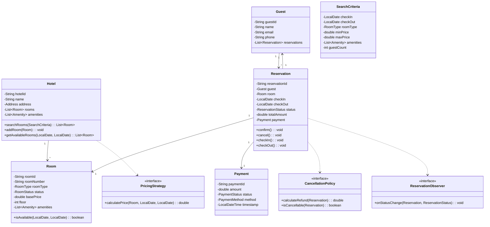
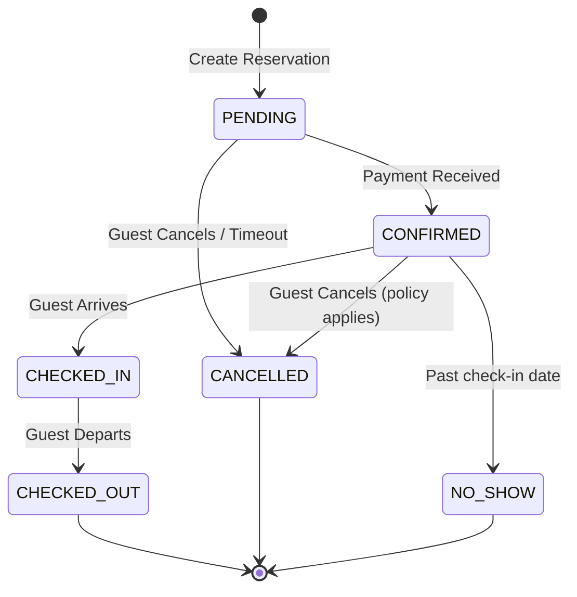

# Hotel Booking System - Low-Level Design

## 1. Problem Statement

Design a Hotel Reservation/Booking System that supports:
- Multiple hotels with different room types
- Room search with filters (date range, type, price, amenities)
- Reservation lifecycle management
- Dynamic pricing strategies (seasonal, weekend, demand-based)
- Cancellation policies
- Overbooking handling
- Payment processing

## 2. UML Class Diagram



## 3. Design Patterns Used

| Pattern | Usage |
|---------|-------|
| **Strategy** | PricingStrategy - swap pricing algorithms (seasonal, dynamic, weekend) |
| **Observer** | ReservationObserver - notify on status changes (email, SMS, analytics) |
| **Factory** | RoomFactory - create rooms based on type |
| **Builder** | RoomBuilder - configure complex room objects |
| **State** | ReservationStatus - manage reservation lifecycle transitions |

## 4. SOLID Principles

- **S**: Each class has single responsibility (Room manages room state, Reservation manages booking lifecycle)
- **O**: PricingStrategy is open for extension (add new strategies without modifying existing code)
- **L**: All PricingStrategy implementations are interchangeable
- **I**: Separate interfaces for CancellationPolicy, PricingStrategy, ReservationObserver
- **D**: HotelBookingService depends on abstractions (PricingStrategy interface, not concrete classes)

## 5. Complete Java Implementation

### Enums

```java
public enum RoomType {
    SINGLE(1, 100.0),
    DOUBLE(2, 150.0),
    SUITE(4, 350.0),
    DELUXE(2, 250.0);

    private final int maxOccupancy;
    private final double basePrice;

    RoomType(int maxOccupancy, double basePrice) {
        this.maxOccupancy = maxOccupancy;
        this.basePrice = basePrice;
    }

    public int getMaxOccupancy() { return maxOccupancy; }
    public double getBasePrice() { return basePrice; }
}

public enum RoomStatus {
    AVAILABLE, OCCUPIED, UNDER_MAINTENANCE, RESERVED, CLEANING
}

public enum ReservationStatus {
    PENDING, CONFIRMED, CHECKED_IN, CHECKED_OUT, CANCELLED, NO_SHOW
}

public enum PaymentStatus {
    PENDING, COMPLETED, REFUNDED, FAILED
}

public enum PaymentMethod {
    CREDIT_CARD, DEBIT_CARD, UPI, CASH, WALLET
}

public enum Amenity {
    WIFI, AC, TV, MINIBAR, BALCONY, SEA_VIEW, POOL_ACCESS, BREAKFAST, PARKING
}
```

### Models

```java
public record Address(String street, String city, String state, String zipCode, String country) {}

public class Guest {
    private final String guestId;
    private String name;
    private String email;
    private String phone;
    private final List<Reservation> reservations = new ArrayList<>();

    public Guest(String guestId, String name, String email, String phone) {
        this.guestId = guestId;
        this.name = name;
        this.email = email;
        this.phone = phone;
    }

    public void addReservation(Reservation reservation) {
        reservations.add(reservation);
    }

    // Getters
    public String getGuestId() { return guestId; }
    public String getName() { return name; }
    public String getEmail() { return email; }
    public String getPhone() { return phone; }
    public List<Reservation> getReservations() { return Collections.unmodifiableList(reservations); }
}

public class Room {
    private final String roomId;
    private final String roomNumber;
    private final RoomType roomType;
    private RoomStatus status;
    private final double basePrice;
    private final int floor;
    private final Set<Amenity> amenities;
    private final List<Reservation> reservations = new ArrayList<>();

    private Room(RoomBuilder builder) {
        this.roomId = builder.roomId;
        this.roomNumber = builder.roomNumber;
        this.roomType = builder.roomType;
        this.status = RoomStatus.AVAILABLE;
        this.basePrice = builder.basePrice;
        this.floor = builder.floor;
        this.amenities = builder.amenities;
    }

    public boolean isAvailable(LocalDate checkIn, LocalDate checkOut) {
        return reservations.stream()
            .filter(r -> r.getStatus() != ReservationStatus.CANCELLED)
            .noneMatch(r -> datesOverlap(r.getCheckIn(), r.getCheckOut(), checkIn, checkOut));
    }

    private boolean datesOverlap(LocalDate start1, LocalDate end1, LocalDate start2, LocalDate end2) {
        return !start1.isAfter(end2.minusDays(1)) && !end1.minusDays(1).isBefore(start2);
    }

    public void addReservation(Reservation reservation) {
        reservations.add(reservation);
    }

    // Getters
    public String getRoomId() { return roomId; }
    public String getRoomNumber() { return roomNumber; }
    public RoomType getRoomType() { return roomType; }
    public RoomStatus getStatus() { return status; }
    public void setStatus(RoomStatus status) { this.status = status; }
    public double getBasePrice() { return basePrice; }
    public int getFloor() { return floor; }
    public Set<Amenity> getAmenities() { return Collections.unmodifiableSet(amenities); }

    // Builder
    public static class RoomBuilder {
        private final String roomId;
        private String roomNumber;
        private RoomType roomType;
        private double basePrice;
        private int floor = 1;
        private Set<Amenity> amenities = EnumSet.noneOf(Amenity.class);

        public RoomBuilder(String roomId) {
            this.roomId = roomId;
        }

        public RoomBuilder roomNumber(String roomNumber) {
            this.roomNumber = roomNumber;
            return this;
        }

        public RoomBuilder roomType(RoomType roomType) {
            this.roomType = roomType;
            this.basePrice = roomType.getBasePrice();
            return this;
        }

        public RoomBuilder basePrice(double basePrice) {
            this.basePrice = basePrice;
            return this;
        }

        public RoomBuilder floor(int floor) {
            this.floor = floor;
            return this;
        }

        public RoomBuilder amenities(Amenity... amenities) {
            this.amenities = EnumSet.copyOf(Set.of(amenities));
            return this;
        }

        public Room build() {
            Objects.requireNonNull(roomNumber, "Room number is required");
            Objects.requireNonNull(roomType, "Room type is required");
            return new Room(this);
        }
    }
}

public class Hotel {
    private final String hotelId;
    private final String name;
    private final Address address;
    private final List<Room> rooms = new ArrayList<>();
    private final Set<Amenity> hotelAmenities;

    public Hotel(String hotelId, String name, Address address, Set<Amenity> amenities) {
        this.hotelId = hotelId;
        this.name = name;
        this.address = address;
        this.hotelAmenities = amenities;
    }

    public void addRoom(Room room) {
        rooms.add(room);
    }

    public List<Room> getAvailableRooms(LocalDate checkIn, LocalDate checkOut) {
        return rooms.stream()
            .filter(r -> r.getStatus() != RoomStatus.UNDER_MAINTENANCE)
            .filter(r -> r.isAvailable(checkIn, checkOut))
            .toList();
    }

    public List<Room> searchRooms(SearchCriteria criteria) {
        return rooms.stream()
            .filter(r -> r.isAvailable(criteria.getCheckIn(), criteria.getCheckOut()))
            .filter(r -> criteria.getRoomType() == null || r.getRoomType() == criteria.getRoomType())
            .filter(r -> r.getBasePrice() >= criteria.getMinPrice())
            .filter(r -> criteria.getMaxPrice() <= 0 || r.getBasePrice() <= criteria.getMaxPrice())
            .filter(r -> r.getAmenities().containsAll(criteria.getAmenities()))
            .toList();
    }

    // Getters
    public String getHotelId() { return hotelId; }
    public String getName() { return name; }
    public List<Room> getRooms() { return Collections.unmodifiableList(rooms); }
}
```

### Search Criteria

```java
public class SearchCriteria {
    private final LocalDate checkIn;
    private final LocalDate checkOut;
    private RoomType roomType;
    private double minPrice;
    private double maxPrice;
    private Set<Amenity> amenities = EnumSet.noneOf(Amenity.class);
    private int guestCount = 1;

    public SearchCriteria(LocalDate checkIn, LocalDate checkOut) {
        if (checkIn.isAfter(checkOut) || checkIn.isBefore(LocalDate.now())) {
            throw new IllegalArgumentException("Invalid date range");
        }
        this.checkIn = checkIn;
        this.checkOut = checkOut;
    }

    public SearchCriteria roomType(RoomType type) { this.roomType = type; return this; }
    public SearchCriteria priceRange(double min, double max) {
        this.minPrice = min;
        this.maxPrice = max;
        return this;
    }
    public SearchCriteria amenities(Amenity... amenities) {
        this.amenities = EnumSet.copyOf(Set.of(amenities));
        return this;
    }
    public SearchCriteria guestCount(int count) { this.guestCount = count; return this; }

    // Getters
    public LocalDate getCheckIn() { return checkIn; }
    public LocalDate getCheckOut() { return checkOut; }
    public RoomType getRoomType() { return roomType; }
    public double getMinPrice() { return minPrice; }
    public double getMaxPrice() { return maxPrice; }
    public Set<Amenity> getAmenities() { return amenities; }
    public int getGuestCount() { return guestCount; }
}
```

### Pricing Strategy (Strategy Pattern)

```java
public interface PricingStrategy {
    double calculatePrice(Room room, LocalDate checkIn, LocalDate checkOut);
}

public class BasePricing implements PricingStrategy {
    @Override
    public double calculatePrice(Room room, LocalDate checkIn, LocalDate checkOut) {
        long nights = ChronoUnit.DAYS.between(checkIn, checkOut);
        return room.getBasePrice() * nights;
    }
}

public class SeasonalPricing implements PricingStrategy {
    private final Map<Month, Double> seasonalMultipliers;

    public SeasonalPricing() {
        seasonalMultipliers = Map.of(
            Month.DECEMBER, 1.5,
            Month.JANUARY, 1.3,
            Month.JUNE, 1.4,
            Month.JULY, 1.4
        );
    }

    @Override
    public double calculatePrice(Room room, LocalDate checkIn, LocalDate checkOut) {
        double total = 0;
        LocalDate current = checkIn;
        while (current.isBefore(checkOut)) {
            double multiplier = seasonalMultipliers.getOrDefault(current.getMonth(), 1.0);
            total += room.getBasePrice() * multiplier;
            current = current.plusDays(1);
        }
        return total;
    }
}

public class WeekendPricing implements PricingStrategy {
    private static final double WEEKEND_MULTIPLIER = 1.25;

    @Override
    public double calculatePrice(Room room, LocalDate checkIn, LocalDate checkOut) {
        double total = 0;
        LocalDate current = checkIn;
        while (current.isBefore(checkOut)) {
            double multiplier = isWeekend(current) ? WEEKEND_MULTIPLIER : 1.0;
            total += room.getBasePrice() * multiplier;
            current = current.plusDays(1);
        }
        return total;
    }

    private boolean isWeekend(LocalDate date) {
        DayOfWeek day = date.getDayOfWeek();
        return day == DayOfWeek.FRIDAY || day == DayOfWeek.SATURDAY;
    }
}

public class DynamicPricing implements PricingStrategy {
    private final Hotel hotel;
    private static final double HIGH_DEMAND_THRESHOLD = 0.8;
    private static final double HIGH_DEMAND_MULTIPLIER = 1.4;
    private static final double LOW_DEMAND_MULTIPLIER = 0.9;

    public DynamicPricing(Hotel hotel) {
        this.hotel = hotel;
    }

    @Override
    public double calculatePrice(Room room, LocalDate checkIn, LocalDate checkOut) {
        double total = 0;
        LocalDate current = checkIn;
        while (current.isBefore(checkOut)) {
            double occupancyRate = getOccupancyRate(current);
            double multiplier = occupancyRate > HIGH_DEMAND_THRESHOLD
                ? HIGH_DEMAND_MULTIPLIER
                : (occupancyRate < 0.3 ? LOW_DEMAND_MULTIPLIER : 1.0);
            total += room.getBasePrice() * multiplier;
            current = current.plusDays(1);
        }
        return total;
    }

    private double getOccupancyRate(LocalDate date) {
        long totalRooms = hotel.getRooms().size();
        long occupiedRooms = hotel.getRooms().stream()
            .filter(r -> !r.isAvailable(date, date.plusDays(1)))
            .count();
        return (double) occupiedRooms / totalRooms;
    }
}

// Composite pricing - combines multiple strategies
public class CompositePricing implements PricingStrategy {
    private final List<PricingStrategy> strategies;

    public CompositePricing(PricingStrategy... strategies) {
        this.strategies = List.of(strategies);
    }

    @Override
    public double calculatePrice(Room room, LocalDate checkIn, LocalDate checkOut) {
        return strategies.stream()
            .mapToDouble(s -> s.calculatePrice(room, checkIn, checkOut))
            .max()
            .orElse(new BasePricing().calculatePrice(room, checkIn, checkOut));
    }
}
```

### Cancellation Policy

```java
public interface CancellationPolicy {
    double calculateRefund(Reservation reservation);
    boolean isCancellable(Reservation reservation);
}

public class FlexibleCancellationPolicy implements CancellationPolicy {
    // Full refund if cancelled 24h before check-in
    @Override
    public double calculateRefund(Reservation reservation) {
        if (!isCancellable(reservation)) return 0;
        long hoursUntilCheckIn = ChronoUnit.HOURS.between(
            LocalDateTime.now(), reservation.getCheckIn().atStartOfDay());
        if (hoursUntilCheckIn >= 24) return reservation.getTotalAmount();
        if (hoursUntilCheckIn >= 12) return reservation.getTotalAmount() * 0.5;
        return 0;
    }

    @Override
    public boolean isCancellable(Reservation reservation) {
        return reservation.getStatus() == ReservationStatus.CONFIRMED
            || reservation.getStatus() == ReservationStatus.PENDING;
    }
}

public class StrictCancellationPolicy implements CancellationPolicy {
    // 50% refund if cancelled 48h before, no refund otherwise
    @Override
    public double calculateRefund(Reservation reservation) {
        if (!isCancellable(reservation)) return 0;
        long hoursUntilCheckIn = ChronoUnit.HOURS.between(
            LocalDateTime.now(), reservation.getCheckIn().atStartOfDay());
        if (hoursUntilCheckIn >= 48) return reservation.getTotalAmount() * 0.5;
        return 0;
    }

    @Override
    public boolean isCancellable(Reservation reservation) {
        return reservation.getStatus() == ReservationStatus.CONFIRMED
            || reservation.getStatus() == ReservationStatus.PENDING;
    }
}

public class NonRefundableCancellationPolicy implements CancellationPolicy {
    @Override
    public double calculateRefund(Reservation reservation) { return 0; }

    @Override
    public boolean isCancellable(Reservation reservation) {
        return reservation.getStatus() == ReservationStatus.PENDING;
    }
}
```

### Observer Pattern for Reservation Events

```java
public interface ReservationObserver {
    void onStatusChange(Reservation reservation, ReservationStatus oldStatus, ReservationStatus newStatus);
}

public class EmailNotificationObserver implements ReservationObserver {
    @Override
    public void onStatusChange(Reservation reservation, ReservationStatus oldStatus, ReservationStatus newStatus) {
        String message = switch (newStatus) {
            case CONFIRMED -> "Your reservation %s is confirmed!".formatted(reservation.getReservationId());
            case CANCELLED -> "Your reservation %s has been cancelled.".formatted(reservation.getReservationId());
            case CHECKED_IN -> "Welcome! You've checked in for reservation %s.".formatted(reservation.getReservationId());
            case CHECKED_OUT -> "Thank you for staying! Reservation %s checked out.".formatted(reservation.getReservationId());
            default -> "Reservation %s status updated to %s.".formatted(reservation.getReservationId(), newStatus);
        };
        System.out.println("[EMAIL -> " + reservation.getGuest().getEmail() + "] " + message);
    }
}

public class SMSNotificationObserver implements ReservationObserver {
    @Override
    public void onStatusChange(Reservation reservation, ReservationStatus oldStatus, ReservationStatus newStatus) {
        System.out.println("[SMS -> " + reservation.getGuest().getPhone() + "] Reservation " +
            reservation.getReservationId() + " status: " + newStatus);
    }
}

public class AnalyticsObserver implements ReservationObserver {
    @Override
    public void onStatusChange(Reservation reservation, ReservationStatus oldStatus, ReservationStatus newStatus) {
        System.out.println("[ANALYTICS] Reservation " + reservation.getReservationId() +
            " transitioned: " + oldStatus + " -> " + newStatus);
    }
}
```

### Reservation (State Management)

```java
public class Reservation {
    private final String reservationId;
    private final Guest guest;
    private final Room room;
    private final LocalDate checkIn;
    private final LocalDate checkOut;
    private ReservationStatus status;
    private double totalAmount;
    private Payment payment;
    private final CancellationPolicy cancellationPolicy;
    private final List<ReservationObserver> observers = new ArrayList<>();
    private final LocalDateTime createdAt;

    public Reservation(String reservationId, Guest guest, Room room,
                       LocalDate checkIn, LocalDate checkOut, double totalAmount,
                       CancellationPolicy cancellationPolicy) {
        this.reservationId = reservationId;
        this.guest = guest;
        this.room = room;
        this.checkIn = checkIn;
        this.checkOut = checkOut;
        this.totalAmount = totalAmount;
        this.cancellationPolicy = cancellationPolicy;
        this.status = ReservationStatus.PENDING;
        this.createdAt = LocalDateTime.now();
    }

    public void addObserver(ReservationObserver observer) {
        observers.add(observer);
    }

    private void notifyObservers(ReservationStatus oldStatus) {
        observers.forEach(o -> o.onStatusChange(this, oldStatus, this.status));
    }

    public void confirm() {
        if (status != ReservationStatus.PENDING) {
            throw new IllegalStateException("Can only confirm PENDING reservations. Current: " + status);
        }
        ReservationStatus old = this.status;
        this.status = ReservationStatus.CONFIRMED;
        room.addReservation(this);
        notifyObservers(old);
    }

    public void checkIn() {
        if (status != ReservationStatus.CONFIRMED) {
            throw new IllegalStateException("Can only check in CONFIRMED reservations. Current: " + status);
        }
        if (LocalDate.now().isBefore(checkIn)) {
            throw new IllegalStateException("Cannot check in before check-in date");
        }
        ReservationStatus old = this.status;
        this.status = ReservationStatus.CHECKED_IN;
        room.setStatus(RoomStatus.OCCUPIED);
        notifyObservers(old);
    }

    public void checkOut() {
        if (status != ReservationStatus.CHECKED_IN) {
            throw new IllegalStateException("Can only check out CHECKED_IN reservations. Current: " + status);
        }
        ReservationStatus old = this.status;
        this.status = ReservationStatus.CHECKED_OUT;
        room.setStatus(RoomStatus.CLEANING);
        notifyObservers(old);
    }

    public double cancel() {
        if (!cancellationPolicy.isCancellable(this)) {
            throw new IllegalStateException("Reservation cannot be cancelled in state: " + status);
        }
        double refund = cancellationPolicy.calculateRefund(this);
        ReservationStatus old = this.status;
        this.status = ReservationStatus.CANCELLED;
        notifyObservers(old);
        return refund;
    }

    public void markNoShow() {
        if (status != ReservationStatus.CONFIRMED) {
            throw new IllegalStateException("Can only mark no-show for CONFIRMED reservations");
        }
        ReservationStatus old = this.status;
        this.status = ReservationStatus.NO_SHOW;
        notifyObservers(old);
    }

    // Getters
    public String getReservationId() { return reservationId; }
    public Guest getGuest() { return guest; }
    public Room getRoom() { return room; }
    public LocalDate getCheckIn() { return checkIn; }
    public LocalDate getCheckOut() { return checkOut; }
    public ReservationStatus getStatus() { return status; }
    public double getTotalAmount() { return totalAmount; }
    public Payment getPayment() { return payment; }
    public void setPayment(Payment payment) { this.payment = payment; }
}
```

### Payment

```java
public class Payment {
    private final String paymentId;
    private final double amount;
    private PaymentStatus status;
    private final PaymentMethod method;
    private final LocalDateTime timestamp;

    public Payment(String paymentId, double amount, PaymentMethod method) {
        this.paymentId = paymentId;
        this.amount = amount;
        this.method = method;
        this.status = PaymentStatus.PENDING;
        this.timestamp = LocalDateTime.now();
    }

    public void complete() {
        this.status = PaymentStatus.COMPLETED;
    }

    public void refund() {
        this.status = PaymentStatus.REFUNDED;
    }

    public void fail() {
        this.status = PaymentStatus.FAILED;
    }

    // Getters
    public String getPaymentId() { return paymentId; }
    public double getAmount() { return amount; }
    public PaymentStatus getStatus() { return status; }
    public PaymentMethod getMethod() { return method; }
}
```

### Room Allocation Strategy

```java
public interface RoomAllocationStrategy {
    Optional<Room> allocateRoom(List<Room> availableRooms, SearchCriteria criteria);
}

public class FirstAvailableStrategy implements RoomAllocationStrategy {
    @Override
    public Optional<Room> allocateRoom(List<Room> availableRooms, SearchCriteria criteria) {
        return availableRooms.stream().findFirst();
    }
}

public class LowestFloorFirstStrategy implements RoomAllocationStrategy {
    @Override
    public Optional<Room> allocateRoom(List<Room> availableRooms, SearchCriteria criteria) {
        return availableRooms.stream()
            .min(Comparator.comparingInt(Room::getFloor));
    }
}

public class BestValueStrategy implements RoomAllocationStrategy {
    @Override
    public Optional<Room> allocateRoom(List<Room> availableRooms, SearchCriteria criteria) {
        return availableRooms.stream()
            .max(Comparator.comparingInt(r -> r.getAmenities().size()))
            .or(() -> availableRooms.stream().findFirst());
    }
}
```

### Overbooking Handler

```java
public class OverbookingHandler {
    private static final double OVERBOOKING_RATIO = 1.1; // 10% overbooking allowed

    public boolean canAcceptBooking(Hotel hotel, LocalDate checkIn, LocalDate checkOut, RoomType type) {
        long totalRoomsOfType = hotel.getRooms().stream()
            .filter(r -> r.getRoomType() == type)
            .count();

        long bookedRooms = hotel.getRooms().stream()
            .filter(r -> r.getRoomType() == type)
            .filter(r -> !r.isAvailable(checkIn, checkOut))
            .count();

        long maxAllowed = (long) Math.ceil(totalRoomsOfType * OVERBOOKING_RATIO);
        return bookedRooms < maxAllowed;
    }

    public Optional<Room> handleOverbooking(Hotel hotel, Reservation overbooked) {
        // Try to upgrade the guest to a better room type
        RoomType[] upgradeOrder = { RoomType.DOUBLE, RoomType.DELUXE, RoomType.SUITE };
        for (RoomType upgrade : upgradeOrder) {
            if (upgrade.ordinal() > overbooked.getRoom().getRoomType().ordinal()) {
                Optional<Room> upgraded = hotel.getRooms().stream()
                    .filter(r -> r.getRoomType() == upgrade)
                    .filter(r -> r.isAvailable(overbooked.getCheckIn(), overbooked.getCheckOut()))
                    .findFirst();
                if (upgraded.isPresent()) {
                    System.out.println("[OVERBOOKING] Guest " + overbooked.getGuest().getName() +
                        " upgraded from " + overbooked.getRoom().getRoomType() + " to " + upgrade);
                    return upgraded;
                }
            }
        }
        return Optional.empty();
    }
}
```

### Room Factory

```java
public class RoomFactory {
    private static int roomCounter = 0;

    public static Room createRoom(RoomType type, int floor, String roomNumber) {
        Room.RoomBuilder builder = new Room.RoomBuilder("ROOM-" + (++roomCounter))
            .roomNumber(roomNumber)
            .roomType(type)
            .floor(floor);

        switch (type) {
            case SINGLE -> builder.amenities(Amenity.WIFI, Amenity.AC, Amenity.TV);
            case DOUBLE -> builder.amenities(Amenity.WIFI, Amenity.AC, Amenity.TV, Amenity.MINIBAR);
            case DELUXE -> builder.amenities(Amenity.WIFI, Amenity.AC, Amenity.TV, Amenity.MINIBAR,
                                            Amenity.BALCONY, Amenity.BREAKFAST);
            case SUITE -> builder.amenities(Amenity.WIFI, Amenity.AC, Amenity.TV, Amenity.MINIBAR,
                                           Amenity.BALCONY, Amenity.SEA_VIEW, Amenity.POOL_ACCESS,
                                           Amenity.BREAKFAST, Amenity.PARKING);
        }
        return builder.build();
    }
}
```

### Hotel Booking Service (Facade)

```java
public class HotelBookingService {
    private final Hotel hotel;
    private final PricingStrategy pricingStrategy;
    private final RoomAllocationStrategy allocationStrategy;
    private final CancellationPolicy cancellationPolicy;
    private final OverbookingHandler overbookingHandler;
    private final List<ReservationObserver> observers;
    private final Map<String, Reservation> reservations = new ConcurrentHashMap<>();
    private int reservationCounter = 0;

    public HotelBookingService(Hotel hotel, PricingStrategy pricingStrategy,
                                RoomAllocationStrategy allocationStrategy,
                                CancellationPolicy cancellationPolicy,
                                List<ReservationObserver> observers) {
        this.hotel = hotel;
        this.pricingStrategy = pricingStrategy;
        this.allocationStrategy = allocationStrategy;
        this.cancellationPolicy = cancellationPolicy;
        this.overbookingHandler = new OverbookingHandler();
        this.observers = observers;
    }

    public List<Room> searchRooms(SearchCriteria criteria) {
        return hotel.searchRooms(criteria);
    }

    public double getPrice(Room room, LocalDate checkIn, LocalDate checkOut) {
        return pricingStrategy.calculatePrice(room, checkIn, checkOut);
    }

    public synchronized Reservation createReservation(Guest guest, SearchCriteria criteria) {
        List<Room> available = hotel.searchRooms(criteria);
        if (available.isEmpty()) {
            // Check overbooking allowance
            if (!overbookingHandler.canAcceptBooking(hotel, criteria.getCheckIn(),
                    criteria.getCheckOut(), criteria.getRoomType())) {
                throw new IllegalStateException("No rooms available for the given criteria");
            }
        }

        Optional<Room> allocatedRoom = allocationStrategy.allocateRoom(available, criteria);
        if (allocatedRoom.isEmpty()) {
            throw new IllegalStateException("Could not allocate a room");
        }

        Room room = allocatedRoom.get();
        double price = pricingStrategy.calculatePrice(room, criteria.getCheckIn(), criteria.getCheckOut());

        String reservationId = "RES-" + (++reservationCounter);
        Reservation reservation = new Reservation(reservationId, guest, room,
            criteria.getCheckIn(), criteria.getCheckOut(), price, cancellationPolicy);

        observers.forEach(reservation::addObserver);
        reservations.put(reservationId, reservation);
        guest.addReservation(reservation);

        return reservation;
    }

    public void confirmReservation(String reservationId, PaymentMethod paymentMethod) {
        Reservation reservation = getReservation(reservationId);
        Payment payment = new Payment("PAY-" + reservationId, reservation.getTotalAmount(), paymentMethod);
        payment.complete();
        reservation.setPayment(payment);
        reservation.confirm();
    }

    public double cancelReservation(String reservationId) {
        Reservation reservation = getReservation(reservationId);
        return reservation.cancel();
    }

    public void checkIn(String reservationId) {
        getReservation(reservationId).checkIn();
    }

    public void checkOut(String reservationId) {
        getReservation(reservationId).checkOut();
    }

    private Reservation getReservation(String reservationId) {
        Reservation reservation = reservations.get(reservationId);
        if (reservation == null) throw new IllegalArgumentException("Reservation not found: " + reservationId);
        return reservation;
    }
}
```

### Demo / Main

```java
public class HotelBookingDemo {
    public static void main(String[] args) {
        // Setup hotel
        Address address = new Address("123 Beach Rd", "Goa", "Goa", "403001", "India");
        Hotel hotel = new Hotel("H001", "Ocean View Resort", address,
            EnumSet.of(Amenity.POOL_ACCESS, Amenity.WIFI, Amenity.PARKING));

        // Add rooms using factory
        for (int i = 1; i <= 5; i++) hotel.addRoom(RoomFactory.createRoom(RoomType.SINGLE, 1, "1" + String.format("%02d", i)));
        for (int i = 1; i <= 5; i++) hotel.addRoom(RoomFactory.createRoom(RoomType.DOUBLE, 2, "2" + String.format("%02d", i)));
        for (int i = 1; i <= 3; i++) hotel.addRoom(RoomFactory.createRoom(RoomType.DELUXE, 3, "3" + String.format("%02d", i)));
        for (int i = 1; i <= 2; i++) hotel.addRoom(RoomFactory.createRoom(RoomType.SUITE, 4, "4" + String.format("%02d", i)));

        // Setup service
        PricingStrategy pricing = new SeasonalPricing();
        List<ReservationObserver> observers = List.of(
            new EmailNotificationObserver(),
            new SMSNotificationObserver(),
            new AnalyticsObserver()
        );

        HotelBookingService service = new HotelBookingService(
            hotel, pricing, new BestValueStrategy(),
            new FlexibleCancellationPolicy(), observers
        );

        // Create guest and book
        Guest guest = new Guest("G001", "John Doe", "john@email.com", "+91-9876543210");

        SearchCriteria criteria = new SearchCriteria(
            LocalDate.now().plusDays(5), LocalDate.now().plusDays(8))
            .roomType(RoomType.DELUXE)
            .amenities(Amenity.WIFI, Amenity.BALCONY);

        // Search
        List<Room> results = service.searchRooms(criteria);
        System.out.println("Found " + results.size() + " rooms matching criteria");

        // Book
        Reservation reservation = service.createReservation(guest, criteria);
        System.out.println("Created: " + reservation.getReservationId() +
            " | Amount: $" + reservation.getTotalAmount());

        // Confirm with payment
        service.confirmReservation(reservation.getReservationId(), PaymentMethod.CREDIT_CARD);

        // Check-in (would work on actual check-in date)
        // service.checkIn(reservation.getReservationId());
        // service.checkOut(reservation.getReservationId());
    }
}
```

## 6. State Diagram



## 7. Key Interview Points

### Concurrency
- `ConcurrentHashMap` for reservations store
- `synchronized` on `createReservation` to prevent double-booking
- In production: use optimistic locking or distributed locks (Redis/Zookeeper)

### Scalability Considerations
- Partition reservations by hotel/region
- Cache frequently searched results
- Event-driven architecture for notifications (Kafka/RabbitMQ)
- CQRS: separate read (search) and write (booking) models

### Database Design
- `rooms` table with hotel_id FK
- `reservations` table with guest_id, room_id FKs and date range indexed
- Use date-range overlap query: `NOT (checkout <= :start OR checkin >= :end)`
- Index on `(hotel_id, room_type, check_in, check_out)` for search queries

### Overbooking Strategy
- Airlines/hotels overbook by 5-10% based on historical no-show rates
- Compensate with upgrades or partner hotel transfers
- Track no-show rate per segment to tune ratio

### Key Trade-offs
| Decision | Trade-off |
|----------|-----------|
| Pessimistic locking on booking | Consistency over throughput |
| Overbooking | Revenue vs. guest satisfaction |
| Composite pricing | Flexibility vs. complexity |
| Observer for notifications | Decoupling vs. debugging difficulty |

### Common Follow-up Questions
1. **How to handle concurrent bookings for the same room?** → Pessimistic lock on room during booking flow or optimistic lock with retry
2. **How to scale search?** → Elasticsearch for room availability, materialized views
3. **How to handle timezone issues?** → Store all dates in UTC, convert for display
4. **How to implement waitlist?** → Priority queue per room type, notify when cancellation occurs
5. **Rate limiting?** → Token bucket per user for search/booking APIs
