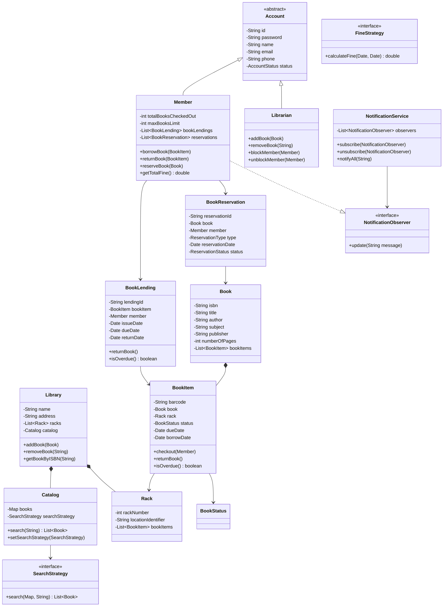
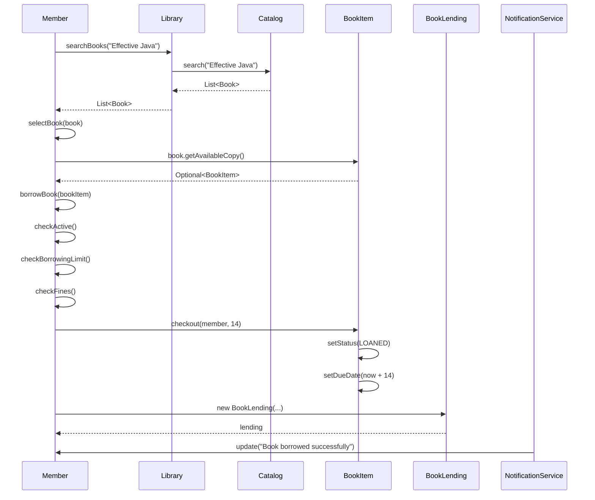
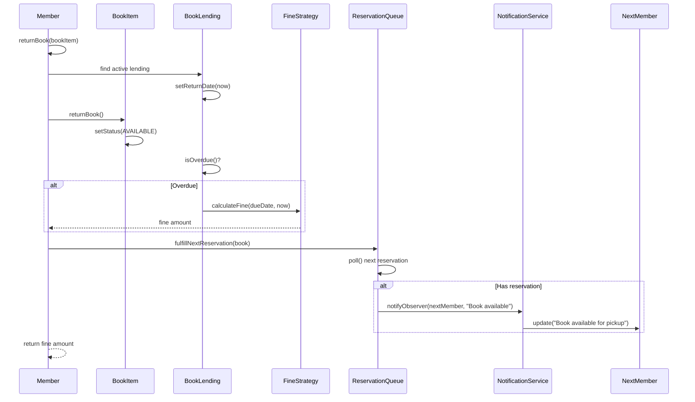

# Library Management System - Low-Level Design

## 1. Problem Statement

Design a Library Management System that supports:
- Managing books (add, remove, search, update)
- Member registration and management
- Book borrowing, returning, and reservation
- Fine calculation for overdue books
- Notifications for due dates and overdue books
- Search by title, author, ISBN, subject
- Librarian administrative actions
- Rack/location management for physical copies

---

## 2. UML Class Diagram



---

## 3. Design Patterns Used

| Pattern | Usage |
|---------|-------|
| **Strategy** | `SearchStrategy` for different search algorithms; `FineStrategy` for fine calculation |
| **Observer** | `NotificationService` notifies members about due dates, overdue, availability |
| **Singleton** | `Library` instance, `NotificationService` |
| **Factory** | `BookItemFactory` to create book items with barcode generation |

---

## 4. SOLID Principles Applied

- **S** - Each class has a single responsibility (Member manages borrowing, Catalog manages search, etc.)
- **O** - New search strategies or fine strategies can be added without modifying existing code
- **L** - Member and Librarian can substitute Account wherever needed
- **I** - `SearchStrategy` and `FineStrategy` are small, focused interfaces
- **D** - Catalog depends on `SearchStrategy` abstraction, not concrete implementations

---

## 5. Complete Java Implementation

### Enums

```java
public enum BookStatus {
    AVAILABLE, RESERVED, LOANED, LOST, DAMAGED
}

public enum AccountStatus {
    ACTIVE, BLOCKED, CLOSED
}

public enum ReservationType {
    WAITING, FULFILLED, CANCELLED
}

public enum ReservationStatus {
    PENDING, COMPLETED, CANCELLED
}
```

### Models

```java
import java.time.LocalDate;
import java.util.*;
import java.util.concurrent.ConcurrentLinkedQueue;

// ==================== Book ====================
public class Book {
    private final String isbn;
    private String title;
    private String author;
    private String subject;
    private String publisher;
    private int numberOfPages;
    private final List<BookItem> bookItems;

    public Book(String isbn, String title, String author, String subject, String publisher, int numberOfPages) {
        this.isbn = isbn;
        this.title = title;
        this.author = author;
        this.subject = subject;
        this.publisher = publisher;
        this.numberOfPages = numberOfPages;
        this.bookItems = new ArrayList<>();
    }

    public void addBookItem(BookItem item) {
        bookItems.add(item);
    }

    public void removeBookItem(BookItem item) {
        bookItems.remove(item);
    }

    public Optional<BookItem> getAvailableCopy() {
        return bookItems.stream()
                .filter(item -> item.getStatus() == BookStatus.AVAILABLE)
                .findFirst();
    }

    public boolean hasAvailableCopy() {
        return bookItems.stream().anyMatch(item -> item.getStatus() == BookStatus.AVAILABLE);
    }

    // Getters
    public String getIsbn() { return isbn; }
    public String getTitle() { return title; }
    public String getAuthor() { return author; }
    public String getSubject() { return subject; }
    public String getPublisher() { return publisher; }
    public int getNumberOfPages() { return numberOfPages; }
    public List<BookItem> getBookItems() { return Collections.unmodifiableList(bookItems); }
}

// ==================== Rack ====================
public class Rack {
    private final int rackNumber;
    private final String locationIdentifier;
    private final List<BookItem> bookItems;

    public Rack(int rackNumber, String locationIdentifier) {
        this.rackNumber = rackNumber;
        this.locationIdentifier = locationIdentifier;
        this.bookItems = new ArrayList<>();
    }

    public void addBookItem(BookItem item) {
        bookItems.add(item);
    }

    public void removeBookItem(BookItem item) {
        bookItems.remove(item);
    }

    public int getRackNumber() { return rackNumber; }
    public String getLocationIdentifier() { return locationIdentifier; }
    public List<BookItem> getBookItems() { return Collections.unmodifiableList(bookItems); }
}

// ==================== BookItem (Physical Copy) ====================
public class BookItem {
    private final String barcode;
    private final Book book;
    private Rack rack;
    private BookStatus status;
    private LocalDate dueDate;
    private LocalDate borrowDate;

    public BookItem(String barcode, Book book, Rack rack) {
        this.barcode = barcode;
        this.book = book;
        this.rack = rack;
        this.status = BookStatus.AVAILABLE;
        book.addBookItem(this);
        rack.addBookItem(this);
    }

    public void checkout(Member member, int lendingDays) {
        if (this.status != BookStatus.AVAILABLE) {
            throw new IllegalStateException("Book item is not available for checkout. Status: " + status);
        }
        this.status = BookStatus.LOANED;
        this.borrowDate = LocalDate.now();
        this.dueDate = LocalDate.now().plusDays(lendingDays);
    }

    public void returnBook() {
        this.status = BookStatus.AVAILABLE;
        this.borrowDate = null;
        this.dueDate = null;
    }

    public boolean isOverdue() {
        return dueDate != null && LocalDate.now().isAfter(dueDate);
    }

    public void markLost() {
        this.status = BookStatus.LOST;
    }

    public void markReserved() {
        this.status = BookStatus.RESERVED;
    }

    // Getters
    public String getBarcode() { return barcode; }
    public Book getBook() { return book; }
    public Rack getRack() { return rack; }
    public BookStatus getStatus() { return status; }
    public LocalDate getDueDate() { return dueDate; }
    public LocalDate getBorrowDate() { return borrowDate; }

    public void setRack(Rack rack) { this.rack = rack; }
    public void setStatus(BookStatus status) { this.status = status; }
}

// ==================== BookItem Factory ====================
public class BookItemFactory {
    private static int counter = 0;

    public static BookItem create(Book book, Rack rack) {
        String barcode = "LIB-" + book.getIsbn() + "-" + (++counter);
        return new BookItem(barcode, book, rack);
    }
}
```

### Account Hierarchy

```java
// ==================== Account (Abstract) ====================
public abstract class Account {
    private final String id;
    private String password;
    private String name;
    private String email;
    private String phone;
    private AccountStatus status;

    protected Account(String id, String name, String email, String phone) {
        this.id = id;
        this.name = name;
        this.email = email;
        this.phone = phone;
        this.status = AccountStatus.ACTIVE;
    }

    public boolean isActive() {
        return status == AccountStatus.ACTIVE;
    }

    // Getters and Setters
    public String getId() { return id; }
    public String getName() { return name; }
    public String getEmail() { return email; }
    public String getPhone() { return phone; }
    public AccountStatus getStatus() { return status; }
    public void setStatus(AccountStatus status) { this.status = status; }
    public void setName(String name) { this.name = name; }
    public void setEmail(String email) { this.email = email; }
    public void setPhone(String phone) { this.phone = phone; }
}

// ==================== Member ====================
public class Member extends Account implements NotificationObserver {
    private static final int DEFAULT_MAX_BOOKS = 5;
    private static final int LENDING_DAYS = 14;

    private int totalBooksCheckedOut;
    private final int maxBooksLimit;
    private final List<BookLending> bookLendings;
    private final List<BookReservation> reservations;
    private final List<String> notifications;
    private FineStrategy fineStrategy;

    public Member(String id, String name, String email, String phone) {
        super(id, name, email, phone);
        this.totalBooksCheckedOut = 0;
        this.maxBooksLimit = DEFAULT_MAX_BOOKS;
        this.bookLendings = new ArrayList<>();
        this.reservations = new ArrayList<>();
        this.notifications = new ArrayList<>();
        this.fineStrategy = new DailyFineStrategy(); // default
    }

    public Member(String id, String name, String email, String phone, int maxBooksLimit) {
        super(id, name, email, phone);
        this.totalBooksCheckedOut = 0;
        this.maxBooksLimit = maxBooksLimit;
        this.bookLendings = new ArrayList<>();
        this.reservations = new ArrayList<>();
        this.notifications = new ArrayList<>();
        this.fineStrategy = new DailyFineStrategy();
    }

    public BookLending borrowBook(BookItem bookItem) {
        if (!isActive()) {
            throw new IllegalStateException("Member account is not active.");
        }
        if (totalBooksCheckedOut >= maxBooksLimit) {
            throw new IllegalStateException("Member has reached maximum borrowing limit of " + maxBooksLimit);
        }
        if (getTotalFine() > 0) {
            throw new IllegalStateException("Member has outstanding fines. Please clear fines before borrowing.");
        }

        bookItem.checkout(this, LENDING_DAYS);
        totalBooksCheckedOut++;

        BookLending lending = new BookLending(
                UUID.randomUUID().toString(), bookItem, this,
                LocalDate.now(), LocalDate.now().plusDays(LENDING_DAYS)
        );
        bookLendings.add(lending);
        return lending;
    }

    public double returnBook(BookItem bookItem) {
        BookLending lending = bookLendings.stream()
                .filter(l -> l.getBookItem().equals(bookItem) && l.getReturnDate() == null)
                .findFirst()
                .orElseThrow(() -> new IllegalArgumentException("No active lending found for this book item."));

        lending.returnBook();
        bookItem.returnBook();
        totalBooksCheckedOut--;

        double fine = 0;
        if (lending.isOverdue()) {
            fine = fineStrategy.calculateFine(lending.getDueDate(), LocalDate.now());
        }

        // Check reservation queue and notify
        ReservationQueue.getInstance().fulfillNextReservation(bookItem.getBook());

        return fine;
    }

    public BookReservation reserveBook(Book book) {
        if (!isActive()) {
            throw new IllegalStateException("Member account is not active.");
        }
        if (book.hasAvailableCopy()) {
            throw new IllegalStateException("Book has available copies. Please borrow directly.");
        }

        BookReservation reservation = new BookReservation(
                UUID.randomUUID().toString(), book, this,
                ReservationType.WAITING, LocalDate.now()
        );
        reservations.add(reservation);
        ReservationQueue.getInstance().addReservation(book.getIsbn(), reservation);
        return reservation;
    }

    public double getTotalFine() {
        return bookLendings.stream()
                .filter(l -> l.getReturnDate() == null && l.isOverdue())
                .mapToDouble(l -> fineStrategy.calculateFine(l.getDueDate(), LocalDate.now()))
                .sum();
    }

    @Override
    public void update(String message) {
        notifications.add(message);
        System.out.println("[Notification for " + getName() + "]: " + message);
    }

    public void setFineStrategy(FineStrategy fineStrategy) {
        this.fineStrategy = fineStrategy;
    }

    // Getters
    public int getTotalBooksCheckedOut() { return totalBooksCheckedOut; }
    public int getMaxBooksLimit() { return maxBooksLimit; }
    public List<BookLending> getBookLendings() { return Collections.unmodifiableList(bookLendings); }
    public List<BookReservation> getReservations() { return Collections.unmodifiableList(reservations); }
    public List<String> getNotifications() { return Collections.unmodifiableList(notifications); }
}

// ==================== Librarian ====================
public class Librarian extends Account {
    public Librarian(String id, String name, String email, String phone) {
        super(id, name, email, phone);
    }

    public void addBook(Library library, Book book) {
        library.addBook(book);
        System.out.println("Librarian " + getName() + " added book: " + book.getTitle());
    }

    public void removeBook(Library library, String isbn) {
        library.removeBook(isbn);
        System.out.println("Librarian " + getName() + " removed book with ISBN: " + isbn);
    }

    public BookItem addBookItem(Book book, Rack rack) {
        BookItem item = BookItemFactory.create(book, rack);
        System.out.println("Librarian " + getName() + " added book item: " + item.getBarcode());
        return item;
    }

    public void blockMember(Member member) {
        member.setStatus(AccountStatus.BLOCKED);
        System.out.println("Librarian " + getName() + " blocked member: " + member.getName());
    }

    public void unblockMember(Member member) {
        member.setStatus(AccountStatus.ACTIVE);
        System.out.println("Librarian " + getName() + " unblocked member: " + member.getName());
    }

    public void markBookLost(BookItem bookItem) {
        bookItem.markLost();
        System.out.println("Book item " + bookItem.getBarcode() + " marked as LOST.");
    }
}
```

### BookLending & BookReservation

```java
// ==================== BookLending ====================
public class BookLending {
    private final String lendingId;
    private final BookItem bookItem;
    private final Member member;
    private final LocalDate issueDate;
    private final LocalDate dueDate;
    private LocalDate returnDate;

    public BookLending(String lendingId, BookItem bookItem, Member member,
                       LocalDate issueDate, LocalDate dueDate) {
        this.lendingId = lendingId;
        this.bookItem = bookItem;
        this.member = member;
        this.issueDate = issueDate;
        this.dueDate = dueDate;
    }

    public void returnBook() {
        this.returnDate = LocalDate.now();
    }

    public boolean isOverdue() {
        LocalDate checkDate = (returnDate != null) ? returnDate : LocalDate.now();
        return checkDate.isAfter(dueDate);
    }

    public long getOverdueDays() {
        if (!isOverdue()) return 0;
        LocalDate checkDate = (returnDate != null) ? returnDate : LocalDate.now();
        return java.time.temporal.ChronoUnit.DAYS.between(dueDate, checkDate);
    }

    // Getters
    public String getLendingId() { return lendingId; }
    public BookItem getBookItem() { return bookItem; }
    public Member getMember() { return member; }
    public LocalDate getIssueDate() { return issueDate; }
    public LocalDate getDueDate() { return dueDate; }
    public LocalDate getReturnDate() { return returnDate; }
}

// ==================== BookReservation ====================
public class BookReservation {
    private final String reservationId;
    private final Book book;
    private final Member member;
    private final ReservationType type;
    private final LocalDate reservationDate;
    private ReservationStatus status;

    public BookReservation(String reservationId, Book book, Member member,
                           ReservationType type, LocalDate reservationDate) {
        this.reservationId = reservationId;
        this.book = book;
        this.member = member;
        this.type = type;
        this.reservationDate = reservationDate;
        this.status = ReservationStatus.PENDING;
    }

    public void fulfill() {
        this.status = ReservationStatus.COMPLETED;
    }

    public void cancel() {
        this.status = ReservationStatus.CANCELLED;
    }

    // Getters
    public String getReservationId() { return reservationId; }
    public Book getBook() { return book; }
    public Member getMember() { return member; }
    public ReservationType getType() { return type; }
    public LocalDate getReservationDate() { return reservationDate; }
    public ReservationStatus getStatus() { return status; }
}

// ==================== Reservation Queue ====================
public class ReservationQueue {
    private static ReservationQueue instance;
    private final Map<String, Queue<BookReservation>> reservationMap; // ISBN -> Queue

    private ReservationQueue() {
        this.reservationMap = new HashMap<>();
    }

    public static synchronized ReservationQueue getInstance() {
        if (instance == null) {
            instance = new ReservationQueue();
        }
        return instance;
    }

    public void addReservation(String isbn, BookReservation reservation) {
        reservationMap.computeIfAbsent(isbn, k -> new ConcurrentLinkedQueue<>()).add(reservation);
        System.out.println("Reservation added for ISBN: " + isbn + " by member: " + reservation.getMember().getName());
    }

    public void fulfillNextReservation(Book book) {
        Queue<BookReservation> queue = reservationMap.get(book.getIsbn());
        if (queue != null && !queue.isEmpty()) {
            BookReservation nextReservation = queue.poll();
            nextReservation.fulfill();
            NotificationService.getInstance().notifyObserver(
                    nextReservation.getMember(),
                    "Book '" + book.getTitle() + "' is now available for you. Please pick it up within 2 days."
            );
        }
    }

    public int getQueueSize(String isbn) {
        Queue<BookReservation> queue = reservationMap.get(isbn);
        return queue == null ? 0 : queue.size();
    }
}
```

### Search Strategy (Strategy Pattern)

```java
// ==================== Search Strategy Interface ====================
public interface SearchStrategy {
    List<Book> search(Map<String, Book> books, String query);
}

// ==================== Search By Title ====================
public class SearchByTitle implements SearchStrategy {
    @Override
    public List<Book> search(Map<String, Book> books, String query) {
        String lowerQuery = query.toLowerCase();
        return books.values().stream()
                .filter(book -> book.getTitle().toLowerCase().contains(lowerQuery))
                .toList();
    }
}

// ==================== Search By Author ====================
public class SearchByAuthor implements SearchStrategy {
    @Override
    public List<Book> search(Map<String, Book> books, String query) {
        String lowerQuery = query.toLowerCase();
        return books.values().stream()
                .filter(book -> book.getAuthor().toLowerCase().contains(lowerQuery))
                .toList();
    }
}

// ==================== Search By ISBN ====================
public class SearchByISBN implements SearchStrategy {
    @Override
    public List<Book> search(Map<String, Book> books, String query) {
        Book book = books.get(query);
        return book != null ? List.of(book) : List.of();
    }
}

// ==================== Search By Subject ====================
public class SearchBySubject implements SearchStrategy {
    @Override
    public List<Book> search(Map<String, Book> books, String query) {
        String lowerQuery = query.toLowerCase();
        return books.values().stream()
                .filter(book -> book.getSubject().toLowerCase().contains(lowerQuery))
                .toList();
    }
}

// ==================== Catalog ====================
public class Catalog {
    private final Map<String, Book> books; // ISBN -> Book
    private SearchStrategy searchStrategy;

    public Catalog() {
        this.books = new HashMap<>();
        this.searchStrategy = new SearchByTitle(); // default
    }

    public void addBook(Book book) {
        books.put(book.getIsbn(), book);
    }

    public void removeBook(String isbn) {
        books.remove(isbn);
    }

    public Optional<Book> getBookByISBN(String isbn) {
        return Optional.ofNullable(books.get(isbn));
    }

    public void setSearchStrategy(SearchStrategy searchStrategy) {
        this.searchStrategy = searchStrategy;
    }

    public List<Book> search(String query) {
        return searchStrategy.search(books, query);
    }

    public Map<String, Book> getAllBooks() {
        return Collections.unmodifiableMap(books);
    }
}
```

### Fine Strategy (Strategy Pattern)

```java
// ==================== Fine Strategy Interface ====================
public interface FineStrategy {
    double calculateFine(LocalDate dueDate, LocalDate returnDate);
}

// ==================== Daily Fine (e.g., $1 per day) ====================
public class DailyFineStrategy implements FineStrategy {
    private static final double FINE_PER_DAY = 1.0;

    @Override
    public double calculateFine(LocalDate dueDate, LocalDate returnDate) {
        if (!returnDate.isAfter(dueDate)) return 0;
        long overdueDays = java.time.temporal.ChronoUnit.DAYS.between(dueDate, returnDate);
        return overdueDays * FINE_PER_DAY;
    }
}

// ==================== Weekly Fine (e.g., $5 per week) ====================
public class WeeklyFineStrategy implements FineStrategy {
    private static final double FINE_PER_WEEK = 5.0;

    @Override
    public double calculateFine(LocalDate dueDate, LocalDate returnDate) {
        if (!returnDate.isAfter(dueDate)) return 0;
        long overdueDays = java.time.temporal.ChronoUnit.DAYS.between(dueDate, returnDate);
        long weeks = (overdueDays + 6) / 7; // ceiling division
        return weeks * FINE_PER_WEEK;
    }
}

// ==================== Tiered Fine (escalating) ====================
public class TieredFineStrategy implements FineStrategy {
    @Override
    public double calculateFine(LocalDate dueDate, LocalDate returnDate) {
        if (!returnDate.isAfter(dueDate)) return 0;
        long overdueDays = java.time.temporal.ChronoUnit.DAYS.between(dueDate, returnDate);

        double fine = 0;
        if (overdueDays <= 7) {
            fine = overdueDays * 0.5;          // $0.50/day for first week
        } else if (overdueDays <= 30) {
            fine = 7 * 0.5 + (overdueDays - 7) * 1.0;  // $1/day after first week
        } else {
            fine = 7 * 0.5 + 23 * 1.0 + (overdueDays - 30) * 2.0; // $2/day after 30 days
        }
        return fine;
    }
}
```

### Notification (Observer Pattern)

```java
// ==================== Observer Interface ====================
public interface NotificationObserver {
    void update(String message);
}

// ==================== Notification Service (Singleton) ====================
public class NotificationService {
    private static NotificationService instance;
    private final List<NotificationObserver> observers;

    private NotificationService() {
        this.observers = new ArrayList<>();
    }

    public static synchronized NotificationService getInstance() {
        if (instance == null) {
            instance = new NotificationService();
        }
        return instance;
    }

    public void subscribe(NotificationObserver observer) {
        observers.add(observer);
    }

    public void unsubscribe(NotificationObserver observer) {
        observers.remove(observer);
    }

    public void notifyAll(String message) {
        observers.forEach(observer -> observer.update(message));
    }

    public void notifyObserver(NotificationObserver observer, String message) {
        observer.update(message);
    }

    public void sendDueDateReminders() {
        // This would be called by a scheduled job
        System.out.println("Sending due date reminders to all members with books due tomorrow...");
    }

    public void sendOverdueNotices(List<Member> members) {
        members.stream()
                .filter(m -> m.getTotalFine() > 0)
                .forEach(m -> notifyObserver(m,
                        "You have overdue books. Current fine: $" + m.getTotalFine()));
    }
}
```

### Library (Singleton)

```java
// ==================== Library (Singleton) ====================
public class Library {
    private static Library instance;
    private final String name;
    private final String address;
    private final List<Rack> racks;
    private final Catalog catalog;
    private final List<Member> members;
    private final List<Librarian> librarians;

    private Library(String name, String address) {
        this.name = name;
        this.address = address;
        this.racks = new ArrayList<>();
        this.catalog = new Catalog();
        this.members = new ArrayList<>();
        this.librarians = new ArrayList<>();
    }

    public static synchronized Library getInstance(String name, String address) {
        if (instance == null) {
            instance = new Library(name, address);
        }
        return instance;
    }

    public static Library getInstance() {
        if (instance == null) {
            throw new IllegalStateException("Library not initialized. Call getInstance(name, address) first.");
        }
        return instance;
    }

    public void addBook(Book book) {
        catalog.addBook(book);
    }

    public void removeBook(String isbn) {
        catalog.removeBook(isbn);
    }

    public Optional<Book> getBookByISBN(String isbn) {
        return catalog.getBookByISBN(isbn);
    }

    public List<Book> searchBooks(String query) {
        return catalog.search(query);
    }

    public void setSearchStrategy(SearchStrategy strategy) {
        catalog.setSearchStrategy(strategy);
    }

    public Rack addRack(int rackNumber, String location) {
        Rack rack = new Rack(rackNumber, location);
        racks.add(rack);
        return rack;
    }

    public void registerMember(Member member) {
        members.add(member);
        NotificationService.getInstance().subscribe(member);
    }

    public void addLibrarian(Librarian librarian) {
        librarians.add(librarian);
    }

    // Getters
    public String getName() { return name; }
    public String getAddress() { return address; }
    public List<Rack> getRacks() { return Collections.unmodifiableList(racks); }
    public Catalog getCatalog() { return catalog; }
    public List<Member> getMembers() { return Collections.unmodifiableList(members); }
}
```

### Main Demo

```java
public class LibraryManagementDemo {
    public static void main(String[] args) {
        // Initialize Library
        Library library = Library.getInstance("City Central Library", "123 Main St");

        // Add racks
        Rack rack1 = library.addRack(1, "Floor 1 - Section A");
        Rack rack2 = library.addRack(2, "Floor 1 - Section B");
        Rack rack3 = library.addRack(3, "Floor 2 - Section A");

        // Create librarian
        Librarian librarian = new Librarian("L001", "Alice Smith", "alice@library.com", "555-0001");
        library.addLibrarian(librarian);

        // Add books
        Book book1 = new Book("978-0134685991", "Effective Java", "Joshua Bloch",
                "Programming", "Addison-Wesley", 416);
        Book book2 = new Book("978-0201633610", "Design Patterns", "Gang of Four",
                "Software Engineering", "Addison-Wesley", 395);
        Book book3 = new Book("978-0596007126", "Head First Design Patterns", "Eric Freeman",
                "Programming", "O'Reilly", 694);

        librarian.addBook(library, book1);
        librarian.addBook(library, book2);
        librarian.addBook(library, book3);

        // Add physical copies
        BookItem item1 = librarian.addBookItem(book1, rack1);
        BookItem item2 = librarian.addBookItem(book1, rack1); // second copy
        BookItem item3 = librarian.addBookItem(book2, rack2);
        BookItem item4 = librarian.addBookItem(book3, rack3);

        // Register members
        Member member1 = new Member("M001", "Bob Johnson", "bob@email.com", "555-1001");
        Member member2 = new Member("M002", "Carol Williams", "carol@email.com", "555-1002");
        library.registerMember(member1);
        library.registerMember(member2);

        // Search books
        System.out.println("\n=== Search by Title ===");
        library.setSearchStrategy(new SearchByTitle());
        List<Book> results = library.searchBooks("Effective");
        results.forEach(b -> System.out.println("Found: " + b.getTitle()));

        System.out.println("\n=== Search by Author ===");
        library.setSearchStrategy(new SearchByAuthor());
        results = library.searchBooks("Joshua");
        results.forEach(b -> System.out.println("Found: " + b.getTitle() + " by " + b.getAuthor()));

        System.out.println("\n=== Search by Subject ===");
        library.setSearchStrategy(new SearchBySubject());
        results = library.searchBooks("Programming");
        results.forEach(b -> System.out.println("Found: " + b.getTitle()));

        // Borrow book
        System.out.println("\n=== Borrowing ===");
        BookLending lending1 = member1.borrowBook(item1);
        System.out.println(member1.getName() + " borrowed: " + item1.getBook().getTitle());
        System.out.println("Due date: " + lending1.getDueDate());

        // Try to borrow same unavailable book - member2 reserves
        System.out.println("\n=== Reservation ===");
        BookLending lending2 = member2.borrowBook(item2); // borrow second copy
        System.out.println(member2.getName() + " borrowed second copy of: " + item2.getBook().getTitle());

        // All copies gone, member2 cannot get another - simulate a third member reserving
        Member member3 = new Member("M003", "Dave Brown", "dave@email.com", "555-1003");
        library.registerMember(member3);

        // All copies of Effective Java are loaned out
        // member3 reserves it
        BookReservation reservation = member3.reserveBook(book1);
        System.out.println(member3.getName() + " reserved: " + book1.getTitle());

        // Return book - triggers reservation fulfillment
        System.out.println("\n=== Returning ===");
        double fine = member1.returnBook(item1);
        System.out.println(member1.getName() + " returned: " + item1.getBook().getTitle());
        System.out.println("Fine: $" + fine);

        // Block a member
        System.out.println("\n=== Admin Actions ===");
        librarian.blockMember(member2);
        try {
            member2.borrowBook(item4);
        } catch (IllegalStateException e) {
            System.out.println("Blocked member cannot borrow: " + e.getMessage());
        }
        librarian.unblockMember(member2);

        // Fine strategy demo
        System.out.println("\n=== Fine Strategies ===");
        member1.setFineStrategy(new DailyFineStrategy());
        System.out.println("Daily fine for 10 days overdue: $" +
                new DailyFineStrategy().calculateFine(LocalDate.now().minusDays(10), LocalDate.now()));

        member1.setFineStrategy(new WeeklyFineStrategy());
        System.out.println("Weekly fine for 10 days overdue: $" +
                new WeeklyFineStrategy().calculateFine(LocalDate.now().minusDays(10), LocalDate.now()));

        System.out.println("Tiered fine for 35 days overdue: $" +
                new TieredFineStrategy().calculateFine(LocalDate.now().minusDays(35), LocalDate.now()));

        System.out.println("\n=== System Complete ===");
    }
}
```

---

## 6. Sequence Diagrams

### Borrow Book Flow



### Return Book Flow



---

## 7. Key Interview Points

### Design Decisions

1. **BookItem vs Book separation**: `Book` represents metadata (title, author), `BookItem` represents a physical copy. A library may have multiple copies of the same book.

2. **Strategy Pattern for Search**: Allows runtime switching between search algorithms without modifying the catalog. Easy to add new search types (e.g., SearchByPublisher).

3. **Strategy Pattern for Fine**: Different fine policies can be applied per member type (student vs faculty) or changed library-wide.

4. **Observer Pattern for Notifications**: Decouples notification logic from business operations. Members automatically receive updates when subscribed.

5. **Singleton for Library**: Ensures single source of truth. In production, you might use DI framework instead.

6. **Reservation Queue (FIFO)**: Fair ordering for book reservations. When a book is returned, the first person who reserved gets notified.

### Concurrency Considerations

- `ReservationQueue` uses `ConcurrentLinkedQueue` for thread-safe queue operations
- `Library.getInstance()` uses `synchronized` for thread-safe singleton
- In production: use `ReentrantLock` or database-level locking for borrow/return operations

### Scalability Improvements

- Database-backed persistence (JPA entities)
- Event-driven architecture (publish BookReturned events)
- Caching for frequently searched books
- Microservice split: Catalog Service, Lending Service, Notification Service

### Edge Cases to Discuss

- What if a member loses a book? (`markLost()` + charge replacement fee)
- What if a reserved book isn't picked up? (Expiry timer on reservation)
- Concurrent borrow attempts for last copy? (Optimistic locking / CAS)
- Member tries to borrow while having overdue fines? (Blocked until cleared)
- Max renewal limit for borrowed books

### Extensibility

- New search strategies: implement `SearchStrategy`
- New fine policies: implement `FineStrategy`
- New notification channels (SMS, Push): implement `NotificationObserver`
- New account types (Student, Faculty with different limits): extend `Member`

### Comparison with Real Systems

| Feature | This Design | Production System |
|---------|-------------|-------------------|
| Persistence | In-memory | Database (PostgreSQL) |
| Search | Linear scan | Elasticsearch / Full-text index |
| Notifications | Synchronous | Async message queue (Kafka/RabbitMQ) |
| Concurrency | Basic sync | Distributed locks / SAGA pattern |
| Fine calculation | On-demand | Scheduled batch job |

---

## 8. Time & Space Complexity

| Operation | Time | Space |
|-----------|------|-------|
| Search by ISBN | O(1) | O(n) for catalog |
| Search by Title/Author | O(n) | O(k) results |
| Borrow Book | O(1) | O(1) per lending |
| Return Book | O(m) m=active lendings | O(1) |
| Reserve Book | O(1) amortized | O(1) per reservation |
| Calculate Fine | O(1) | O(1) |
| Fulfill Reservation | O(1) queue poll | O(1) |

---
