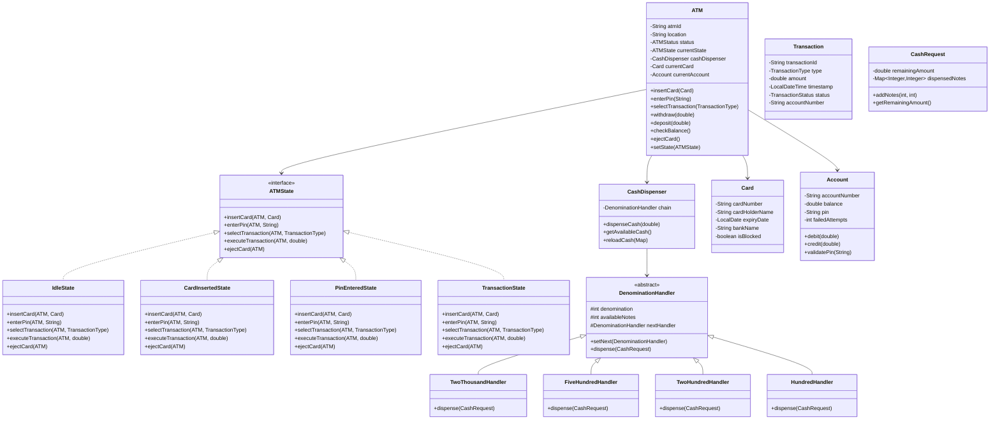
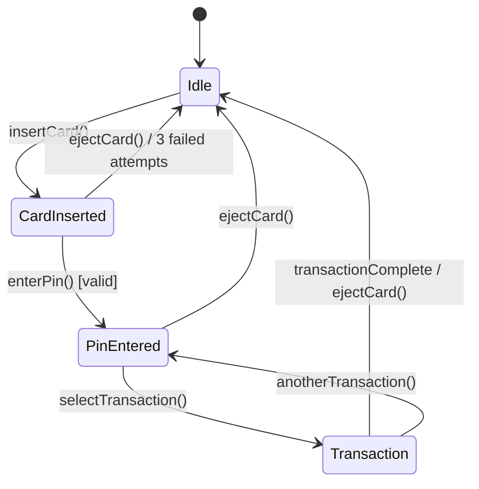

# Low-Level Design: ATM System

## 1. Problem Statement

Design an ATM (Automated Teller Machine) system that supports:
- Card insertion and PIN validation
- Balance inquiry
- Cash withdrawal with optimal denomination dispensing
- Cash deposit
- Fund transfer
- State management for ATM lifecycle
- Concurrent transaction handling

---

## 2. UML Class Diagram



---

## 3. State Machine Diagram



---

## 4. Design Patterns Applied

| Pattern | Where | Why |
|---------|-------|-----|
| **State** | ATM states (Idle, CardInserted, PinEntered, Transaction) | Cleanly manages ATM lifecycle without complex if-else |
| **Chain of Responsibility** | Cash dispensing (2000 → 500 → 200 → 100) | Each handler dispenses its denomination and passes remainder |
| **Strategy** | Transaction execution (Withdraw, Deposit, BalanceInquiry) | Different transaction types have different execution logic |
| **Singleton** | ATM instance per physical machine | One ATM object per machine |

---

## 5. SOLID Principles Applied

| Principle | Application |
|-----------|-------------|
| **SRP** | Each state handles only its own transitions; each handler only its denomination |
| **OCP** | Add new denominations by adding handlers; new states without modifying existing |
| **LSP** | All ATMState implementations are interchangeable in ATM context |
| **ISP** | ATMState interface is focused; CashDispenser has its own interface |
| **DIP** | ATM depends on ATMState interface, not concrete states |

---

## 6. Complete Java Implementation

### Enums

```java
public enum TransactionType {
    WITHDRAWAL, BALANCE_INQUIRY, TRANSFER, DEPOSIT
}

public enum ATMStatus {
    ACTIVE, OUT_OF_SERVICE, OUT_OF_CASH, MAINTENANCE
}

public enum TransactionStatus {
    SUCCESS, FAILED, PENDING, CANCELLED
}
```

### Models

```java
import java.time.LocalDate;
import java.time.LocalDateTime;
import java.util.*;
import java.util.concurrent.ConcurrentHashMap;

public class Card {
    private final String cardNumber;
    private final String cardHolderName;
    private final LocalDate expiryDate;
    private final String bankName;
    private boolean isBlocked;

    public Card(String cardNumber, String cardHolderName, LocalDate expiryDate, String bankName) {
        this.cardNumber = cardNumber;
        this.cardHolderName = cardHolderName;
        this.expiryDate = expiryDate;
        this.bankName = bankName;
        this.isBlocked = false;
    }

    public boolean isExpired() {
        return LocalDate.now().isAfter(expiryDate);
    }

    public boolean isBlocked() { return isBlocked; }
    public void block() { this.isBlocked = true; }
    public String getCardNumber() { return cardNumber; }
    public String getCardHolderName() { return cardHolderName; }
}

public class Account {
    private final String accountNumber;
    private double balance;
    private final String pin; // In reality, this would be hashed
    private int failedAttempts;
    private static final int MAX_FAILED_ATTEMPTS = 3;

    public Account(String accountNumber, double balance, String pin) {
        this.accountNumber = accountNumber;
        this.balance = balance;
        this.pin = pin;
        this.failedAttempts = 0;
    }

    public synchronized boolean validatePin(String enteredPin) {
        if (failedAttempts >= MAX_FAILED_ATTEMPTS) {
            throw new AccountLockedException("Account locked due to too many failed attempts");
        }
        if (pin.equals(enteredPin)) {
            failedAttempts = 0;
            return true;
        }
        failedAttempts++;
        if (failedAttempts >= MAX_FAILED_ATTEMPTS) {
            throw new AccountLockedException("Account locked. Contact bank.");
        }
        return false;
    }

    public synchronized boolean debit(double amount) {
        if (balance >= amount) {
            balance -= amount;
            return true;
        }
        return false;
    }

    public synchronized void credit(double amount) {
        if (amount <= 0) throw new IllegalArgumentException("Amount must be positive");
        balance += amount;
    }

    public double getBalance() { return balance; }
    public String getAccountNumber() { return accountNumber; }
    public int getRemainingAttempts() { return MAX_FAILED_ATTEMPTS - failedAttempts; }
}

public class Transaction {
    private final String transactionId;
    private final TransactionType type;
    private final double amount;
    private final LocalDateTime timestamp;
    private TransactionStatus status;
    private final String accountNumber;
    private final String atmId;

    public Transaction(TransactionType type, double amount, String accountNumber, String atmId) {
        this.transactionId = UUID.randomUUID().toString();
        this.type = type;
        this.amount = amount;
        this.timestamp = LocalDateTime.now();
        this.status = TransactionStatus.PENDING;
        this.accountNumber = accountNumber;
        this.atmId = atmId;
    }

    public void markSuccess() { this.status = TransactionStatus.SUCCESS; }
    public void markFailed() { this.status = TransactionStatus.FAILED; }

    public String getTransactionId() { return transactionId; }
    public TransactionType getType() { return type; }
    public double getAmount() { return amount; }
    public TransactionStatus getStatus() { return status; }

    @Override
    public String toString() {
        return String.format("[%s] %s | %s | Amount: %.2f | Status: %s",
                transactionId.substring(0, 8), timestamp, type, amount, status);
    }
}
```

### Custom Exceptions

```java
public class ATMException extends RuntimeException {
    public ATMException(String message) { super(message); }
}

public class InsufficientFundsException extends ATMException {
    public InsufficientFundsException(String message) { super(message); }
}

public class InvalidStateException extends ATMException {
    public InvalidStateException(String message) { super(message); }
}

public class AccountLockedException extends ATMException {
    public AccountLockedException(String message) { super(message); }
}

public class CashNotAvailableException extends ATMException {
    public CashNotAvailableException(String message) { super(message); }
}
```

### Chain of Responsibility - Cash Dispensing

```java
public class CashRequest {
    private double remainingAmount;
    private final Map<Integer, Integer> dispensedNotes;

    public CashRequest(double amount) {
        this.remainingAmount = amount;
        this.dispensedNotes = new LinkedHashMap<>();
    }

    public void addNotes(int denomination, int count) {
        dispensedNotes.merge(denomination, count, Integer::sum);
        remainingAmount -= (long) denomination * count;
    }

    public double getRemainingAmount() { return remainingAmount; }
    public Map<Integer, Integer> getDispensedNotes() { return Collections.unmodifiableMap(dispensedNotes); }
    public boolean isFullyDispensed() { return remainingAmount == 0; }
}

public abstract class DenominationHandler {
    protected final int denomination;
    protected int availableNotes;
    protected DenominationHandler nextHandler;

    protected DenominationHandler(int denomination, int availableNotes) {
        this.denomination = denomination;
        this.availableNotes = availableNotes;
    }

    public void setNext(DenominationHandler handler) {
        this.nextHandler = handler;
    }

    public void dispense(CashRequest request) {
        if (request.getRemainingAmount() >= denomination) {
            int notesNeeded = (int) (request.getRemainingAmount() / denomination);
            int notesToDispense = Math.min(notesNeeded, availableNotes);

            if (notesToDispense > 0) {
                request.addNotes(denomination, notesToDispense);
                availableNotes -= notesToDispense;
                System.out.printf("  Dispensing %d x ₹%d notes%n", notesToDispense, denomination);
            }
        }

        if (request.getRemainingAmount() > 0 && nextHandler != null) {
            nextHandler.dispense(request);
        }
    }

    public void reload(int count) {
        this.availableNotes += count;
    }

    public int getAvailableNotes() { return availableNotes; }
    public int getDenomination() { return denomination; }
    public long getTotalValue() { return (long) denomination * availableNotes; }
}

public class TwoThousandHandler extends DenominationHandler {
    public TwoThousandHandler(int availableNotes) {
        super(2000, availableNotes);
    }
}

public class FiveHundredHandler extends DenominationHandler {
    public FiveHundredHandler(int availableNotes) {
        super(500, availableNotes);
    }
}

public class TwoHundredHandler extends DenominationHandler {
    public TwoHundredHandler(int availableNotes) {
        super(200, availableNotes);
    }
}

public class HundredHandler extends DenominationHandler {
    public HundredHandler(int availableNotes) {
        super(100, availableNotes);
    }
}

public class CashDispenser {
    private final DenominationHandler chain;
    private final List<DenominationHandler> handlers;

    public CashDispenser(int twoThousand, int fiveHundred, int twoHundred, int hundred) {
        TwoThousandHandler h2000 = new TwoThousandHandler(twoThousand);
        FiveHundredHandler h500 = new FiveHundredHandler(fiveHundred);
        TwoHundredHandler h200 = new TwoHundredHandler(twoHundred);
        HundredHandler h100 = new HundredHandler(hundred);

        // Build chain: 2000 -> 500 -> 200 -> 100
        h2000.setNext(h500);
        h500.setNext(h200);
        h200.setNext(h100);

        this.chain = h2000;
        this.handlers = List.of(h2000, h500, h200, h100);
    }

    public CashRequest dispenseCash(double amount) {
        if (amount <= 0) throw new ATMException("Invalid amount");
        if (amount % 100 != 0) throw new ATMException("Amount must be multiple of 100");
        if (amount > getAvailableCash()) throw new CashNotAvailableException("ATM has insufficient cash");

        CashRequest request = new CashRequest(amount);
        chain.dispense(request);

        if (!request.isFullyDispensed()) {
            // Rollback - restore notes (simplified)
            throw new CashNotAvailableException(
                "Cannot dispense exact amount. Remaining: " + request.getRemainingAmount());
        }
        return request;
    }

    public double getAvailableCash() {
        return handlers.stream().mapToLong(DenominationHandler::getTotalValue).sum();
    }

    public void displayCashStatus() {
        System.out.println("=== ATM Cash Status ===");
        handlers.forEach(h -> System.out.printf("  ₹%d: %d notes (₹%d)%n",
                h.getDenomination(), h.getAvailableNotes(), h.getTotalValue()));
        System.out.printf("  Total: ₹%.0f%n", getAvailableCash());
    }

    public void reloadCash(Map<Integer, Integer> notes) {
        handlers.forEach(h -> {
            Integer count = notes.get(h.getDenomination());
            if (count != null) h.reload(count);
        });
    }
}
```

### State Pattern - ATM States

```java
public interface ATMState {
    void insertCard(ATM atm, Card card);
    void enterPin(ATM atm, String pin);
    void selectTransaction(ATM atm, TransactionType type);
    void executeTransaction(ATM atm, double amount);
    void ejectCard(ATM atm);
}

public class IdleState implements ATMState {

    @Override
    public void insertCard(ATM atm, Card card) {
        if (card.isExpired()) {
            System.out.println("ERROR: Card is expired.");
            return;
        }
        if (card.isBlocked()) {
            System.out.println("ERROR: Card is blocked. Contact your bank.");
            return;
        }
        System.out.println("Card inserted: " + card.getCardHolderName());
        atm.setCurrentCard(card);
        atm.setState(new CardInsertedState());
        System.out.println("Please enter your PIN.");
    }

    @Override
    public void enterPin(ATM atm, String pin) {
        throw new InvalidStateException("Please insert card first.");
    }

    @Override
    public void selectTransaction(ATM atm, TransactionType type) {
        throw new InvalidStateException("Please insert card first.");
    }

    @Override
    public void executeTransaction(ATM atm, double amount) {
        throw new InvalidStateException("Please insert card first.");
    }

    @Override
    public void ejectCard(ATM atm) {
        System.out.println("No card to eject.");
    }
}

public class CardInsertedState implements ATMState {

    @Override
    public void insertCard(ATM atm, Card card) {
        System.out.println("Card already inserted. Please enter PIN.");
    }

    @Override
    public void enterPin(ATM atm, String pin) {
        Account account = atm.getAccountForCard(atm.getCurrentCard());
        if (account == null) {
            System.out.println("ERROR: Account not found.");
            atm.ejectCard();
            return;
        }

        try {
            if (account.validatePin(pin)) {
                System.out.println("PIN verified successfully.");
                atm.setCurrentAccount(account);
                atm.setState(new PinEnteredState());
                System.out.println("Select transaction type.");
            } else {
                System.out.printf("Incorrect PIN. %d attempts remaining.%n",
                        account.getRemainingAttempts());
            }
        } catch (AccountLockedException e) {
            System.out.println("ERROR: " + e.getMessage());
            atm.getCurrentCard().block();
            atm.ejectCard();
        }
    }

    @Override
    public void selectTransaction(ATM atm, TransactionType type) {
        throw new InvalidStateException("Please enter PIN first.");
    }

    @Override
    public void executeTransaction(ATM atm, double amount) {
        throw new InvalidStateException("Please enter PIN first.");
    }

    @Override
    public void ejectCard(ATM atm) {
        System.out.println("Card ejected. Thank you.");
        atm.resetSession();
        atm.setState(new IdleState());
    }
}

public class PinEnteredState implements ATMState {

    @Override
    public void insertCard(ATM atm, Card card) {
        System.out.println("Card already inserted. Select transaction.");
    }

    @Override
    public void enterPin(ATM atm, String pin) {
        System.out.println("PIN already verified. Select transaction.");
    }

    @Override
    public void selectTransaction(ATM atm, TransactionType type) {
        System.out.println("Transaction selected: " + type);
        atm.setSelectedTransactionType(type);
        atm.setState(new TransactionState());

        if (type == TransactionType.BALANCE_INQUIRY) {
            atm.executeTransaction(0); // No amount needed
        } else {
            System.out.println("Enter amount:");
        }
    }

    @Override
    public void executeTransaction(ATM atm, double amount) {
        throw new InvalidStateException("Please select transaction type first.");
    }

    @Override
    public void ejectCard(ATM atm) {
        System.out.println("Card ejected. Thank you.");
        atm.resetSession();
        atm.setState(new IdleState());
    }
}

public class TransactionState implements ATMState {

    @Override
    public void insertCard(ATM atm, Card card) {
        System.out.println("Transaction in progress. Please wait.");
    }

    @Override
    public void enterPin(ATM atm, String pin) {
        System.out.println("Transaction in progress. Please wait.");
    }

    @Override
    public void selectTransaction(ATM atm, TransactionType type) {
        System.out.println("Transaction in progress. Please wait.");
    }

    @Override
    public void executeTransaction(ATM atm, double amount) {
        TransactionType type = atm.getSelectedTransactionType();
        Account account = atm.getCurrentAccount();
        Transaction transaction = new Transaction(type, amount, account.getAccountNumber(), atm.getAtmId());

        try {
            switch (type) {
                case WITHDRAWAL -> handleWithdrawal(atm, account, amount, transaction);
                case DEPOSIT -> handleDeposit(account, amount, transaction);
                case BALANCE_INQUIRY -> handleBalanceInquiry(account, transaction);
                case TRANSFER -> handleTransfer(atm, account, amount, transaction);
            }
            transaction.markSuccess();
        } catch (ATMException e) {
            transaction.markFailed();
            System.out.println("Transaction FAILED: " + e.getMessage());
        }

        atm.addTransaction(transaction);
        System.out.println(transaction);
        System.out.println("\nWould you like another transaction?");
        atm.setState(new PinEnteredState());
    }

    private void handleWithdrawal(ATM atm, Account account, double amount, Transaction txn) {
        if (amount <= 0) throw new ATMException("Amount must be positive");
        if (amount > account.getBalance()) {
            throw new InsufficientFundsException(
                    String.format("Insufficient funds. Available: ₹%.2f", account.getBalance()));
        }

        // Try to dispense cash first (Chain of Responsibility)
        System.out.println("Dispensing cash...");
        CashRequest cashRequest = atm.getCashDispenser().dispenseCash(amount);

        // Debit only after successful dispensing
        if (!account.debit(amount)) {
            throw new InsufficientFundsException("Debit failed.");
        }

        System.out.println("Cash dispensed successfully:");
        cashRequest.getDispensedNotes().forEach((denom, count) ->
                System.out.printf("  ₹%d x %d%n", denom, count));
        System.out.printf("  Total: ₹%.0f%n", amount);
    }

    private void handleDeposit(Account account, double amount, Transaction txn) {
        if (amount <= 0) throw new ATMException("Amount must be positive");
        account.credit(amount);
        System.out.printf("₹%.2f deposited successfully. New balance: ₹%.2f%n",
                amount, account.getBalance());
    }

    private void handleBalanceInquiry(Account account, Transaction txn) {
        System.out.printf("Current Balance: ₹%.2f%n", account.getBalance());
    }

    private void handleTransfer(ATM atm, Account fromAccount, double amount, Transaction txn) {
        // Simplified - in reality would need target account input
        if (amount <= 0) throw new ATMException("Amount must be positive");
        if (!fromAccount.debit(amount)) {
            throw new InsufficientFundsException("Insufficient funds for transfer.");
        }
        System.out.printf("₹%.2f transferred successfully.%n", amount);
    }

    @Override
    public void ejectCard(ATM atm) {
        System.out.println("Card ejected. Transaction cancelled.");
        atm.resetSession();
        atm.setState(new IdleState());
    }
}
```

### ATM Context Class

```java
public class ATM {
    private final String atmId;
    private final String location;
    private ATMStatus status;
    private ATMState currentState;
    private final CashDispenser cashDispenser;
    private Card currentCard;
    private Account currentAccount;
    private TransactionType selectedTransactionType;
    private final List<Transaction> transactionHistory;
    private final Map<String, Account> cardToAccountMap; // Simulated bank DB

    public ATM(String atmId, String location) {
        this.atmId = atmId;
        this.location = location;
        this.status = ATMStatus.ACTIVE;
        this.currentState = new IdleState();
        this.cashDispenser = new CashDispenser(20, 50, 30, 100); // Initial load
        this.transactionHistory = new ArrayList<>();
        this.cardToAccountMap = new ConcurrentHashMap<>();
    }

    // === State pattern delegations ===
    public void insertCard(Card card) {
        checkATMActive();
        currentState.insertCard(this, card);
    }

    public void enterPin(String pin) {
        checkATMActive();
        currentState.enterPin(this, pin);
    }

    public void selectTransaction(TransactionType type) {
        checkATMActive();
        currentState.selectTransaction(this, type);
    }

    public void executeTransaction(double amount) {
        checkATMActive();
        currentState.executeTransaction(this, amount);
    }

    public void ejectCard() {
        currentState.ejectCard(this);
    }

    // === Helpers ===
    private void checkATMActive() {
        if (status != ATMStatus.ACTIVE) {
            throw new ATMException("ATM is " + status + ". Please try another ATM.");
        }
    }

    public void resetSession() {
        this.currentCard = null;
        this.currentAccount = null;
        this.selectedTransactionType = null;
    }

    public Account getAccountForCard(Card card) {
        return cardToAccountMap.get(card.getCardNumber());
    }

    public void registerCardAccount(Card card, Account account) {
        cardToAccountMap.put(card.getCardNumber(), account);
    }

    public void addTransaction(Transaction transaction) {
        transactionHistory.add(transaction);
    }

    // === Getters and Setters ===
    public void setState(ATMState state) { this.currentState = state; }
    public void setCurrentCard(Card card) { this.currentCard = card; }
    public void setCurrentAccount(Account account) { this.currentAccount = account; }
    public void setSelectedTransactionType(TransactionType type) { this.selectedTransactionType = type; }
    public Card getCurrentCard() { return currentCard; }
    public Account getCurrentAccount() { return currentAccount; }
    public TransactionType getSelectedTransactionType() { return selectedTransactionType; }
    public CashDispenser getCashDispenser() { return cashDispenser; }
    public String getAtmId() { return atmId; }
    public ATMStatus getStatus() { return status; }
    public void setStatus(ATMStatus status) { this.status = status; }
    public List<Transaction> getTransactionHistory() { return Collections.unmodifiableList(transactionHistory); }
}
```

### Main - Demo

```java
public class ATMDemo {
    public static void main(String[] args) {
        // Setup ATM
        ATM atm = new ATM("ATM-001", "MG Road, Bangalore");

        // Setup test data
        Card card = new Card("4111-1111-1111-1111", "Harsh Kumar",
                LocalDate.of(2027, 12, 31), "HDFC");
        Account account = new Account("ACC-12345", 50000.00, "1234");
        atm.registerCardAccount(card, account);

        System.out.println("=== ATM System Demo ===\n");
        atm.getCashDispenser().displayCashStatus();

        // Flow 1: Successful Withdrawal
        System.out.println("\n--- Flow 1: Withdrawal ---");
        atm.insertCard(card);
        atm.enterPin("1234");
        atm.selectTransaction(TransactionType.WITHDRAWAL);
        atm.executeTransaction(4700);
        atm.ejectCard();

        // Flow 2: Balance Inquiry
        System.out.println("\n--- Flow 2: Balance Inquiry ---");
        atm.insertCard(card);
        atm.enterPin("1234");
        atm.selectTransaction(TransactionType.BALANCE_INQUIRY);
        atm.ejectCard();

        // Flow 3: Wrong PIN
        System.out.println("\n--- Flow 3: Wrong PIN ---");
        atm.insertCard(card);
        atm.enterPin("9999");
        atm.enterPin("9999");
        atm.enterPin("9999"); // Account locks
        // Card is ejected automatically

        // Show final cash status
        System.out.println("\n");
        atm.getCashDispenser().displayCashStatus();

        // Show transaction history
        System.out.println("\n=== Transaction History ===");
        atm.getTransactionHistory().forEach(System.out::println);
    }
}
```

---

## 7. Key Interview Points

### Why Chain of Responsibility is THE Differentiator

1. **Most candidates** just do `amount / 2000`, `remainder / 500` etc. inline — no pattern
2. **Using CoR** shows you understand:
   - Decoupling request from handler
   - Easy to add/remove denominations without touching existing code (OCP)
   - Each handler has single responsibility
   - Chain order can be reconfigured dynamically

### State Pattern Deep Dive

- **Why not if-else?** — State transitions are implicit in code; adding new states requires modifying every method
- **State pattern** — Each state knows only its valid transitions; invalid operations are cleanly handled
- **Context (ATM)** delegates all operations to current state — zero conditional logic

### Common Follow-up Questions

| Question | Answer |
|----------|--------|
| How to handle concurrent access? | Synchronized methods on Account; ATM serves one user at a time |
| How to add new denomination? | Create new handler class, insert into chain — zero change to existing handlers |
| How to add new transaction type? | Add enum value + handler in TransactionState switch |
| How to handle ATM running out of cash? | CashDispenser checks total before dispensing; ATM status changes to OUT_OF_CASH |
| How to handle network failure? | Transaction stays PENDING; compensating transaction on timeout |
| How to support UPI/contactless? | New initial state or IdleState accepting different card types (Strategy) |

### Complexity

- **State transitions**: O(1) — direct delegation
- **Cash dispensing**: O(n) where n = number of denominations (typically 4-5, so effectively O(1))
- **Space**: O(t) where t = transaction history size

---

## 8. Extensions for Senior-Level Discussion

1. **Observer Pattern** — Notify bank system on suspicious activity (multiple failed PINs)
2. **Command Pattern** — Transaction as command objects for undo/redo
3. **Decorator Pattern** — Add logging/audit to each state transition
4. **Event Sourcing** — Store all ATM events for reconstruction
5. **Circuit Breaker** — For bank API calls during transactions
