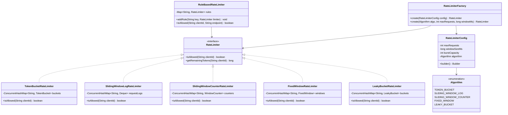
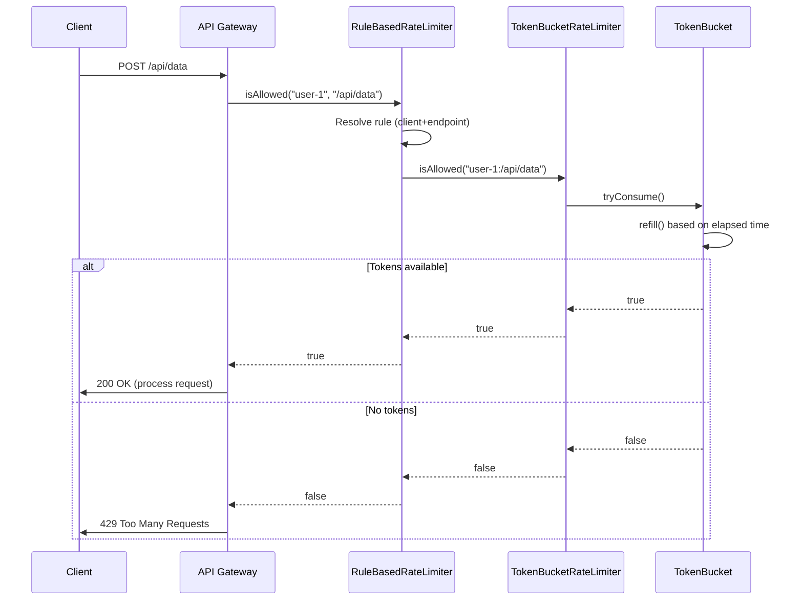

# Rate Limiter - Low-Level Design

## 1. Problem Statement

Design a rate limiter library that controls the rate of requests a client can make to an API. The system should:
- Support multiple rate limiting algorithms (Token Bucket, Sliding Window, Fixed Window, Leaky Bucket)
- Be thread-safe for concurrent access
- Allow different rate limits per client/API endpoint
- Be configurable and extensible
- Provide clear accept/reject decisions

---

## 2. UML Class Diagram



---

## 3. Design Patterns

| Pattern | Where Applied | Purpose |
|---------|--------------|---------|
| **Strategy** | Each algorithm is a strategy implementing `RateLimiter` | Swap algorithms without changing client code |
| **Factory** | `RateLimiterFactory` | Encapsulate object creation based on config |
| **Builder** | `RateLimiterConfig.Builder` | Fluent configuration construction |
| **Template Method** | `AbstractRateLimiter` base class | Common cleanup/eviction logic |

---

## 4. SOLID Principles

| Principle | Application |
|-----------|-------------|
| **S** - Single Responsibility | Each limiter class handles only one algorithm |
| **O** - Open/Closed | New algorithms added without modifying existing code |
| **L** - Liskov Substitution | All limiters are interchangeable via the interface |
| **I** - Interface Segregation | `RateLimiter` is minimal; `RuleBasedRateLimiter` adds endpoint awareness separately |
| **D** - Dependency Inversion | Clients depend on `RateLimiter` interface, not concrete classes |

---

## 5. Complete Java Implementation

### 5.1 Core Interface

```java
public interface RateLimiter {
    /**
     * Check if a request from the given client is allowed.
     * @return true if allowed, false if rate limited
     */
    boolean isAllowed(String clientId);

    /**
     * Returns remaining capacity for the client.
     */
    long getRemainingTokens(String clientId);
}
```

### 5.2 Configuration

```java
import java.time.Duration;

public record RateLimiterConfig(
        Algorithm algorithm,
        int maxRequests,
        long windowSizeMs,
        int burstCapacity,
        double leakRatePerSecond
) {
    public enum Algorithm {
        TOKEN_BUCKET,
        SLIDING_WINDOW_LOG,
        SLIDING_WINDOW_COUNTER,
        FIXED_WINDOW,
        LEAKY_BUCKET
    }

    public static Builder builder() {
        return new Builder();
    }

    public static class Builder {
        private Algorithm algorithm = Algorithm.TOKEN_BUCKET;
        private int maxRequests = 100;
        private long windowSizeMs = 1000; // 1 second
        private int burstCapacity = 10;
        private double leakRatePerSecond = 10.0;

        public Builder algorithm(Algorithm algorithm) {
            this.algorithm = algorithm;
            return this;
        }

        public Builder maxRequests(int maxRequests) {
            this.maxRequests = maxRequests;
            return this;
        }

        public Builder windowSize(Duration duration) {
            this.windowSizeMs = duration.toMillis();
            return this;
        }

        public Builder burstCapacity(int burstCapacity) {
            this.burstCapacity = burstCapacity;
            return this;
        }

        public Builder leakRatePerSecond(double rate) {
            this.leakRatePerSecond = rate;
            return this;
        }

        public RateLimiterConfig build() {
            return new RateLimiterConfig(algorithm, maxRequests, windowSizeMs, burstCapacity, leakRatePerSecond);
        }
    }
}
```

### 5.3 Token Bucket Rate Limiter

**How it works:** Each client has a bucket with tokens. Tokens are added at a fixed rate. Each request consumes one token. If bucket is empty, request is rejected.

**Pros:** Allows bursts, smooth rate limiting, memory efficient.
**Cons:** Requires tuning of refill rate and bucket size.

```java
import java.util.concurrent.ConcurrentHashMap;
import java.util.concurrent.atomic.AtomicLong;

public class TokenBucketRateLimiter implements RateLimiter {

    private final int maxTokens;          // bucket capacity
    private final double refillRatePerMs; // tokens added per millisecond
    private final ConcurrentHashMap<String, TokenBucket> buckets = new ConcurrentHashMap<>();

    public TokenBucketRateLimiter(int maxTokens, double refillRatePerSecond) {
        this.maxTokens = maxTokens;
        this.refillRatePerMs = refillRatePerSecond / 1000.0;
    }

    public TokenBucketRateLimiter(RateLimiterConfig config) {
        this(config.burstCapacity(), (double) config.maxRequests() / (config.windowSizeMs() / 1000.0));
    }

    @Override
    public boolean isAllowed(String clientId) {
        TokenBucket bucket = buckets.computeIfAbsent(clientId, k -> new TokenBucket(maxTokens));
        return bucket.tryConsume();
    }

    @Override
    public long getRemainingTokens(String clientId) {
        TokenBucket bucket = buckets.get(clientId);
        return bucket == null ? maxTokens : bucket.getAvailableTokens();
    }

    private class TokenBucket {
        private double tokens;
        private long lastRefillTimestamp;
        private final Object lock = new Object();

        TokenBucket(int initialTokens) {
            this.tokens = initialTokens;
            this.lastRefillTimestamp = System.currentTimeMillis();
        }

        boolean tryConsume() {
            synchronized (lock) {
                refill();
                if (tokens >= 1.0) {
                    tokens -= 1.0;
                    return true;
                }
                return false;
            }
        }

        long getAvailableTokens() {
            synchronized (lock) {
                refill();
                return (long) tokens;
            }
        }

        private void refill() {
            long now = System.currentTimeMillis();
            long elapsed = now - lastRefillTimestamp;
            if (elapsed > 0) {
                tokens = Math.min(maxTokens, tokens + elapsed * refillRatePerMs);
                lastRefillTimestamp = now;
            }
        }
    }
}
```

### 5.4 Fixed Window Rate Limiter

**How it works:** Time is divided into fixed windows (e.g., 1-second intervals). A counter tracks requests per window. Resets when window expires.

**Pros:** Simple, memory efficient.
**Cons:** Burst at window boundaries (2x allowed rate if requests cluster at edge of two windows).

```java
import java.util.concurrent.ConcurrentHashMap;
import java.util.concurrent.atomic.AtomicLong;

public class FixedWindowRateLimiter implements RateLimiter {

    private final int maxRequests;
    private final long windowSizeMs;
    private final ConcurrentHashMap<String, FixedWindow> windows = new ConcurrentHashMap<>();

    public FixedWindowRateLimiter(int maxRequests, long windowSizeMs) {
        this.maxRequests = maxRequests;
        this.windowSizeMs = windowSizeMs;
    }

    public FixedWindowRateLimiter(RateLimiterConfig config) {
        this(config.maxRequests(), config.windowSizeMs());
    }

    @Override
    public boolean isAllowed(String clientId) {
        FixedWindow window = windows.computeIfAbsent(clientId, k -> new FixedWindow());
        return window.tryAcquire();
    }

    @Override
    public long getRemainingTokens(String clientId) {
        FixedWindow window = windows.get(clientId);
        if (window == null) return maxRequests;
        return window.getRemaining();
    }

    private class FixedWindow {
        private final AtomicLong counter = new AtomicLong(0);
        private volatile long windowStart = System.currentTimeMillis();
        private final Object lock = new Object();

        boolean tryAcquire() {
            long now = System.currentTimeMillis();
            synchronized (lock) {
                if (now - windowStart >= windowSizeMs) {
                    // New window
                    counter.set(0);
                    windowStart = now;
                }
                if (counter.get() < maxRequests) {
                    counter.incrementAndGet();
                    return true;
                }
                return false;
            }
        }

        long getRemaining() {
            long now = System.currentTimeMillis();
            if (now - windowStart >= windowSizeMs) return maxRequests;
            return Math.max(0, maxRequests - counter.get());
        }
    }
}
```

### 5.5 Sliding Window Log Rate Limiter

**How it works:** Stores timestamp of each request. Counts requests within the current sliding window by removing old entries.

**Pros:** Very accurate, no boundary issues.
**Cons:** High memory usage (stores every request timestamp).

```java
import java.util.concurrent.ConcurrentHashMap;
import java.util.concurrent.ConcurrentLinkedDeque;

public class SlidingWindowLogRateLimiter implements RateLimiter {

    private final int maxRequests;
    private final long windowSizeMs;
    private final ConcurrentHashMap<String, RequestLog> logs = new ConcurrentHashMap<>();

    public SlidingWindowLogRateLimiter(int maxRequests, long windowSizeMs) {
        this.maxRequests = maxRequests;
        this.windowSizeMs = windowSizeMs;
    }

    public SlidingWindowLogRateLimiter(RateLimiterConfig config) {
        this(config.maxRequests(), config.windowSizeMs());
    }

    @Override
    public boolean isAllowed(String clientId) {
        RequestLog log = logs.computeIfAbsent(clientId, k -> new RequestLog());
        return log.tryAcquire();
    }

    @Override
    public long getRemainingTokens(String clientId) {
        RequestLog log = logs.get(clientId);
        if (log == null) return maxRequests;
        return log.getRemaining();
    }

    private class RequestLog {
        private final ConcurrentLinkedDeque<Long> timestamps = new ConcurrentLinkedDeque<>();
        private final Object lock = new Object();

        boolean tryAcquire() {
            long now = System.currentTimeMillis();
            synchronized (lock) {
                evictExpired(now);
                if (timestamps.size() < maxRequests) {
                    timestamps.addLast(now);
                    return true;
                }
                return false;
            }
        }

        long getRemaining() {
            long now = System.currentTimeMillis();
            synchronized (lock) {
                evictExpired(now);
                return Math.max(0, maxRequests - timestamps.size());
            }
        }

        private void evictExpired(long now) {
            long cutoff = now - windowSizeMs;
            while (!timestamps.isEmpty() && timestamps.peekFirst() <= cutoff) {
                timestamps.pollFirst();
            }
        }
    }
}
```

### 5.6 Sliding Window Counter Rate Limiter

**How it works:** Combines fixed window and sliding window. Uses weighted count from current and previous windows based on overlap.

**Pros:** Low memory (only 2 counters), better accuracy than fixed window.
**Cons:** Approximate (not exact like log-based).

```java
import java.util.concurrent.ConcurrentHashMap;

public class SlidingWindowCounterRateLimiter implements RateLimiter {

    private final int maxRequests;
    private final long windowSizeMs;
    private final ConcurrentHashMap<String, SlidingWindowCounter> counters = new ConcurrentHashMap<>();

    public SlidingWindowCounterRateLimiter(int maxRequests, long windowSizeMs) {
        this.maxRequests = maxRequests;
        this.windowSizeMs = windowSizeMs;
    }

    public SlidingWindowCounterRateLimiter(RateLimiterConfig config) {
        this(config.maxRequests(), config.windowSizeMs());
    }

    @Override
    public boolean isAllowed(String clientId) {
        SlidingWindowCounter counter = counters.computeIfAbsent(clientId, k -> new SlidingWindowCounter());
        return counter.tryAcquire();
    }

    @Override
    public long getRemainingTokens(String clientId) {
        SlidingWindowCounter counter = counters.get(clientId);
        if (counter == null) return maxRequests;
        return counter.getRemaining();
    }

    private class SlidingWindowCounter {
        private long currentWindowStart;
        private long currentCount;
        private long previousCount;
        private final Object lock = new Object();

        SlidingWindowCounter() {
            this.currentWindowStart = System.currentTimeMillis();
            this.currentCount = 0;
            this.previousCount = 0;
        }

        boolean tryAcquire() {
            long now = System.currentTimeMillis();
            synchronized (lock) {
                advanceWindow(now);
                double weight = getWeightedCount(now);
                if (weight < maxRequests) {
                    currentCount++;
                    return true;
                }
                return false;
            }
        }

        long getRemaining() {
            long now = System.currentTimeMillis();
            synchronized (lock) {
                advanceWindow(now);
                double weight = getWeightedCount(now);
                return Math.max(0, (long) (maxRequests - weight));
            }
        }

        private double getWeightedCount(long now) {
            double elapsedInCurrentWindow = now - currentWindowStart;
            double previousWindowWeight = 1.0 - (elapsedInCurrentWindow / windowSizeMs);
            previousWindowWeight = Math.max(0, previousWindowWeight);
            return (previousCount * previousWindowWeight) + currentCount;
        }

        private void advanceWindow(long now) {
            long elapsed = now - currentWindowStart;
            if (elapsed >= windowSizeMs) {
                long windowsElapsed = elapsed / windowSizeMs;
                if (windowsElapsed == 1) {
                    previousCount = currentCount;
                } else {
                    previousCount = 0; // more than one window passed
                }
                currentCount = 0;
                currentWindowStart = currentWindowStart + (windowsElapsed * windowSizeMs);
            }
        }
    }
}
```

### 5.7 Leaky Bucket Rate Limiter

**How it works:** Requests enter a queue (bucket). Processed at a fixed rate. If queue is full, request is rejected. Ensures constant output rate.

**Pros:** Smooth output rate, good for APIs that need steady processing.
**Cons:** Bursts are queued (higher latency), old requests may become stale.

```java
import java.util.concurrent.ConcurrentHashMap;

public class LeakyBucketRateLimiter implements RateLimiter {

    private final int bucketCapacity;
    private final double leakRatePerMs; // requests leaked per millisecond
    private final ConcurrentHashMap<String, LeakyBucket> buckets = new ConcurrentHashMap<>();

    public LeakyBucketRateLimiter(int bucketCapacity, double leakRatePerSecond) {
        this.bucketCapacity = bucketCapacity;
        this.leakRatePerMs = leakRatePerSecond / 1000.0;
    }

    public LeakyBucketRateLimiter(RateLimiterConfig config) {
        this(config.burstCapacity(), config.leakRatePerSecond());
    }

    @Override
    public boolean isAllowed(String clientId) {
        LeakyBucket bucket = buckets.computeIfAbsent(clientId, k -> new LeakyBucket());
        return bucket.tryAcquire();
    }

    @Override
    public long getRemainingTokens(String clientId) {
        LeakyBucket bucket = buckets.get(clientId);
        if (bucket == null) return bucketCapacity;
        return bucket.getRemaining();
    }

    private class LeakyBucket {
        private double waterLevel; // current number of requests in bucket
        private long lastLeakTimestamp;
        private final Object lock = new Object();

        LeakyBucket() {
            this.waterLevel = 0;
            this.lastLeakTimestamp = System.currentTimeMillis();
        }

        boolean tryAcquire() {
            long now = System.currentTimeMillis();
            synchronized (lock) {
                leak(now);
                if (waterLevel < bucketCapacity) {
                    waterLevel += 1.0;
                    return true;
                }
                return false;
            }
        }

        long getRemaining() {
            long now = System.currentTimeMillis();
            synchronized (lock) {
                leak(now);
                return Math.max(0, (long) (bucketCapacity - waterLevel));
            }
        }

        private void leak(long now) {
            long elapsed = now - lastLeakTimestamp;
            if (elapsed > 0) {
                double leaked = elapsed * leakRatePerMs;
                waterLevel = Math.max(0, waterLevel - leaked);
                lastLeakTimestamp = now;
            }
        }
    }
}
```

### 5.8 Factory

```java
public class RateLimiterFactory {

    public static RateLimiter create(RateLimiterConfig config) {
        return switch (config.algorithm()) {
            case TOKEN_BUCKET -> new TokenBucketRateLimiter(config);
            case FIXED_WINDOW -> new FixedWindowRateLimiter(config);
            case SLIDING_WINDOW_LOG -> new SlidingWindowLogRateLimiter(config);
            case SLIDING_WINDOW_COUNTER -> new SlidingWindowCounterRateLimiter(config);
            case LEAKY_BUCKET -> new LeakyBucketRateLimiter(config);
        };
    }

    public static RateLimiter create(RateLimiterConfig.Algorithm algorithm, int maxRequests, long windowMs) {
        RateLimiterConfig config = RateLimiterConfig.builder()
                .algorithm(algorithm)
                .maxRequests(maxRequests)
                .windowSize(java.time.Duration.ofMillis(windowMs))
                .burstCapacity(maxRequests)
                .build();
        return create(config);
    }
}
```

### 5.9 Rule-Based Rate Limiter (Per-API/Per-User)

```java
import java.util.concurrent.ConcurrentHashMap;

public class RuleBasedRateLimiter {

    private final ConcurrentHashMap<String, RateLimiter> rules = new ConcurrentHashMap<>();
    private final RateLimiter defaultLimiter;

    public RuleBasedRateLimiter(RateLimiter defaultLimiter) {
        this.defaultLimiter = defaultLimiter;
    }

    /**
     * Add a specific rate limit rule for a client+endpoint combination.
     * Key format: "clientId:endpoint" or just "clientId" or "endpoint"
     */
    public void addRule(String ruleKey, RateLimiter limiter) {
        rules.put(ruleKey, limiter);
    }

    public boolean isAllowed(String clientId, String endpoint) {
        // Priority: client+endpoint > client > endpoint > default
        String compositeKey = clientId + ":" + endpoint;
        RateLimiter limiter = rules.getOrDefault(compositeKey,
                rules.getOrDefault(clientId,
                        rules.getOrDefault(endpoint, defaultLimiter)));
        return limiter.isAllowed(compositeKey);
    }

    public boolean isAllowed(String clientId) {
        RateLimiter limiter = rules.getOrDefault(clientId, defaultLimiter);
        return limiter.isAllowed(clientId);
    }
}
```

### 5.10 Usage Example

```java
public class RateLimiterDemo {
    public static void main(String[] args) throws InterruptedException {
        // --- Token Bucket ---
        RateLimiter tokenBucket = RateLimiterFactory.create(
                RateLimiterConfig.builder()
                        .algorithm(RateLimiterConfig.Algorithm.TOKEN_BUCKET)
                        .maxRequests(10)
                        .windowSize(java.time.Duration.ofSeconds(1))
                        .burstCapacity(5)
                        .build()
        );

        // --- Rule-based limiter ---
        RuleBasedRateLimiter ruleLimiter = new RuleBasedRateLimiter(tokenBucket);

        // Premium users get higher limits
        ruleLimiter.addRule("premium-user-1", RateLimiterFactory.create(
                RateLimiterConfig.Algorithm.TOKEN_BUCKET, 100, 1000));

        // Sensitive endpoint gets stricter limits
        ruleLimiter.addRule("/api/login", RateLimiterFactory.create(
                RateLimiterConfig.Algorithm.SLIDING_WINDOW_LOG, 5, 60000));

        // Simulate requests
        for (int i = 0; i < 15; i++) {
            boolean allowed = ruleLimiter.isAllowed("user-123", "/api/data");
            System.out.printf("Request %d: %s%n", i + 1, allowed ? "ALLOWED" : "REJECTED");
        }
    }
}
```

---

## 6. Algorithm Comparison Table

| Algorithm | Memory | Accuracy | Burst Handling | Complexity | Best For |
|-----------|--------|----------|----------------|------------|----------|
| **Token Bucket** | O(1) per client | High | Allows controlled bursts | Low | API gateways, general purpose |
| **Fixed Window** | O(1) per client | Low (boundary issue) | 2x burst at edges | Very Low | Simple use cases |
| **Sliding Window Log** | O(n) per client | Exact | No burst at boundary | Medium | When precision matters |
| **Sliding Window Counter** | O(1) per client | Approximate | Minimal boundary burst | Low | Balance of accuracy & memory |
| **Leaky Bucket** | O(1) per client | High | Smooths bursts out | Low | Steady-rate processing |

---

## 7. Sequence Diagram



---

## 8. Key Interview Points

### Why Token Bucket is the Most Asked
- Used by AWS, Stripe, and most cloud providers
- Allows bursts (real-world traffic is bursty)
- Simple to implement and explain
- Memory efficient O(1) per client

### Thread Safety Approach
- `ConcurrentHashMap` for client-to-bucket mapping (lock-free reads)
- `synchronized` block on individual bucket (fine-grained locking per client)
- Alternative: `AtomicLong` with CAS loops for lock-free implementation

### Distributed Rate Limiting (Follow-up)
- Use Redis with Lua scripts (atomic operations)
- Redis `INCR` + `EXPIRE` for fixed window
- Redis sorted sets for sliding window log
- Trade-off: network latency vs centralized accuracy

### Common Follow-up Questions
1. **How to handle distributed systems?** → Redis + Lua scripts, or local rate limiter with sync
2. **What happens when rate limiter itself is slow?** → Fail-open vs fail-closed policy
3. **How to notify clients?** → `X-RateLimit-Remaining`, `X-RateLimit-Reset`, `Retry-After` headers
4. **Race conditions?** → Synchronized per-bucket, not global lock (scalable)
5. **How to test?** → Inject a `Clock` interface for deterministic testing

### Design Trade-offs
| Decision | Choice | Rationale |
|----------|--------|-----------|
| Per-client lock vs global lock | Per-client | Clients don't contend with each other |
| `synchronized` vs `ReentrantLock` | `synchronized` | Simpler, JVM-optimized, sufficient here |
| Exact vs approximate | Depends on algo | Sliding window counter is good enough for 99% of cases |
| Eager vs lazy cleanup | Lazy (on access) | Avoids background threads, good for library use |

### Memory Cleanup (Production)
```java
// Periodically evict idle clients to prevent memory leaks
ScheduledExecutorService scheduler = Executors.newSingleThreadScheduledExecutor();
scheduler.scheduleAtFixedRate(() -> {
    long cutoff = System.currentTimeMillis() - TimeUnit.HOURS.toMillis(1);
    buckets.entrySet().removeIf(e -> e.getValue().getLastAccessTime() < cutoff);
}, 1, 1, TimeUnit.HOURS);
```

### HTTP Response Headers
```
HTTP/1.1 429 Too Many Requests
X-RateLimit-Limit: 100
X-RateLimit-Remaining: 0
X-RateLimit-Reset: 1672531200
Retry-After: 30
```

---

## 9. Quick Reference: When to Use Which

- **Token Bucket** → Default choice. Allows bursts, simple, production-proven.
- **Leaky Bucket** → When you need constant output rate (e.g., task queue processing).
- **Fixed Window** → Simplest; acceptable when boundary bursts are tolerable.
- **Sliding Window Counter** → Better than fixed window, almost no extra cost.
- **Sliding Window Log** → When exact precision is required and memory is not a concern.
