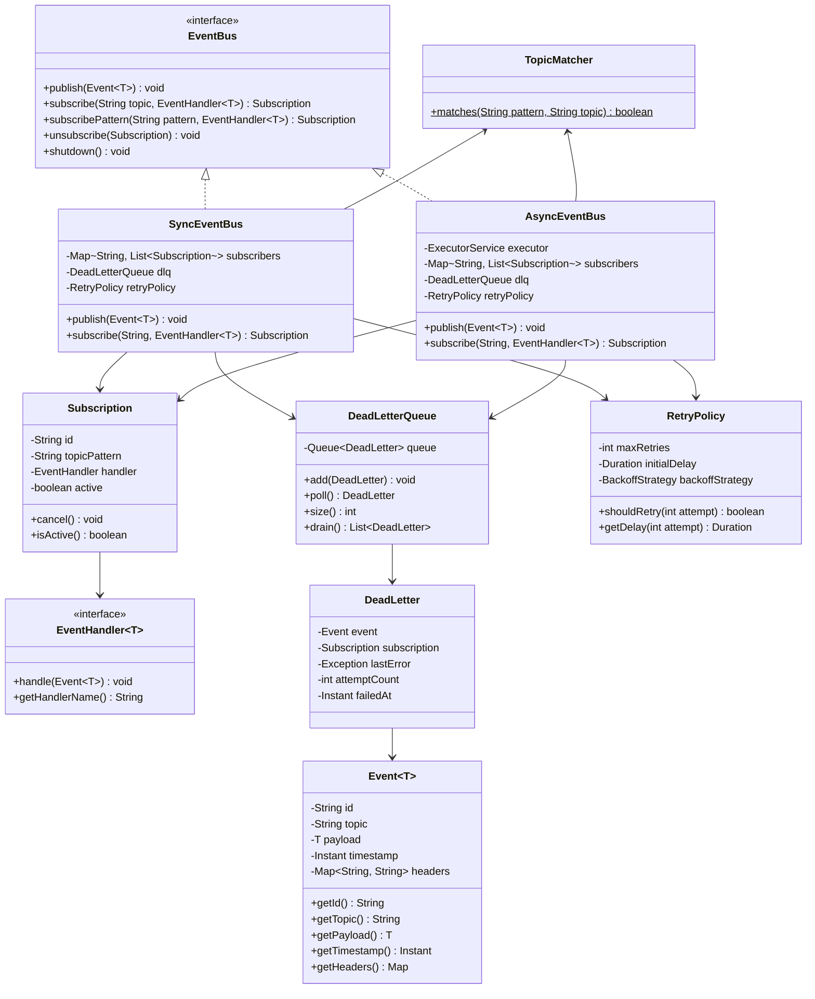

# Low-Level Design: Pub/Sub Event Bus (Java 17+)

## 1. Problem Statement

Design an in-memory publish-subscribe event bus that allows decoupled components to communicate through events. The system should support:
- Topic-based publish/subscribe messaging
- Synchronous and asynchronous event delivery
- Wildcard/pattern-based topic subscriptions
- Dead letter queue for failed messages
- Retry mechanism with configurable policies
- Thread-safe operations
- Message ordering guarantees per topic
- Generic type support for type-safe event handling

---

## 2. UML Class Diagram



---

## 3. Design Patterns

| Pattern | Usage |
|---------|-------|
| **Observer** | Core pub/sub mechanism — subscribers observe topics |
| **Mediator** | EventBus acts as central mediator between publishers and subscribers |
| **Strategy** | RetryPolicy uses pluggable backoff strategies |
| **Builder** | Event construction via builder pattern |
| **Template Method** | Abstract base class for event bus implementations |

---

## 4. SOLID Principles Applied

| Principle | Application |
|-----------|-------------|
| **SRP** | Each class has one responsibility — Event holds data, EventBus routes, RetryPolicy handles retries |
| **OCP** | New delivery strategies (sync/async/batched) without modifying existing code |
| **LSP** | SyncEventBus and AsyncEventBus are interchangeable via EventBus interface |
| **ISP** | EventHandler is a focused single-method interface |
| **DIP** | EventBus depends on EventHandler abstraction, not concrete handlers |

---

## 5. Complete Java Implementation

### 5.1 Event Class

```java
import java.time.Instant;
import java.util.*;

public record Event<T>(
    String id,
    String topic,
    T payload,
    Instant timestamp,
    Map<String, String> headers
) {
    public Event {
        Objects.requireNonNull(topic, "topic cannot be null");
        Objects.requireNonNull(payload, "payload cannot be null");
        if (id == null) id = UUID.randomUUID().toString();
        if (timestamp == null) timestamp = Instant.now();
        if (headers == null) headers = Map.of();
        else headers = Collections.unmodifiableMap(new HashMap<>(headers));
    }

    public static <T> Builder<T> builder(String topic, T payload) {
        return new Builder<>(topic, payload);
    }

    public static class Builder<T> {
        private String id;
        private final String topic;
        private final T payload;
        private Instant timestamp;
        private final Map<String, String> headers = new HashMap<>();

        private Builder(String topic, T payload) {
            this.topic = topic;
            this.payload = payload;
        }

        public Builder<T> id(String id) { this.id = id; return this; }
        public Builder<T> timestamp(Instant ts) { this.timestamp = ts; return this; }
        public Builder<T> header(String key, String value) {
            headers.put(key, value);
            return this;
        }

        public Event<T> build() {
            return new Event<>(id, topic, payload, timestamp, headers);
        }
    }
}
```

### 5.2 EventHandler Interface

```java
@FunctionalInterface
public interface EventHandler<T> {
    void handle(Event<T> event) throws Exception;

    default String getHandlerName() {
        return this.getClass().getSimpleName();
    }

    default int priority() {
        return 0; // higher = executed first
    }
}
```

### 5.3 Subscription

```java
import java.util.concurrent.atomic.AtomicBoolean;

public class Subscription {
    private final String id;
    private final String topicPattern;
    private final EventHandler<?> handler;
    private final AtomicBoolean active;
    private final boolean isPatternBased;
    private final Runnable onCancel;

    public Subscription(String topicPattern, EventHandler<?> handler,
                        boolean isPatternBased, Runnable onCancel) {
        this.id = UUID.randomUUID().toString();
        this.topicPattern = topicPattern;
        this.handler = handler;
        this.isPatternBased = isPatternBased;
        this.active = new AtomicBoolean(true);
        this.onCancel = onCancel;
    }

    public void cancel() {
        if (active.compareAndSet(true, false)) {
            onCancel.run();
        }
    }

    public boolean isActive() { return active.get(); }
    public String getId() { return id; }
    public String getTopicPattern() { return topicPattern; }
    public EventHandler<?> getHandler() { return handler; }
    public boolean isPatternBased() { return isPatternBased; }
}
```

### 5.4 Topic Matcher (Wildcard Support)

```java
/**
 * Supports patterns:
 *   "orders.*"       -> matches "orders.created", "orders.shipped"
 *   "orders.>"       -> matches "orders.created", "orders.us.created" (multi-level)
 *   "orders.created" -> exact match
 */
public final class TopicMatcher {

    private TopicMatcher() {}

    public static boolean matches(String pattern, String topic) {
        if (pattern.equals(topic)) return true;

        String[] patternParts = pattern.split("\\.");
        String[] topicParts = topic.split("\\.");

        int pi = 0, ti = 0;
        while (pi < patternParts.length && ti < topicParts.length) {
            String pp = patternParts[pi];
            if (pp.equals(">")) {
                return true; // matches all remaining levels
            }
            if (pp.equals("*")) {
                pi++;
                ti++;
                continue; // matches exactly one level
            }
            if (!pp.equals(topicParts[ti])) {
                return false;
            }
            pi++;
            ti++;
        }
        return pi == patternParts.length && ti == topicParts.length;
    }
}
```

### 5.5 RetryPolicy & BackoffStrategy

```java
import java.time.Duration;

public enum BackoffStrategy {
    FIXED,
    EXPONENTIAL,
    LINEAR;
}

public record RetryPolicy(
    int maxRetries,
    Duration initialDelay,
    BackoffStrategy backoffStrategy
) {
    public static final RetryPolicy NO_RETRY = new RetryPolicy(0, Duration.ZERO, BackoffStrategy.FIXED);
    public static final RetryPolicy DEFAULT = new RetryPolicy(3, Duration.ofMillis(100), BackoffStrategy.EXPONENTIAL);

    public boolean shouldRetry(int attempt) {
        return attempt < maxRetries;
    }

    public Duration getDelay(int attempt) {
        return switch (backoffStrategy) {
            case FIXED -> initialDelay;
            case LINEAR -> initialDelay.multipliedBy(attempt + 1);
            case EXPONENTIAL -> initialDelay.multipliedBy((long) Math.pow(2, attempt));
        };
    }
}
```

### 5.6 Dead Letter Queue

```java
import java.time.Instant;
import java.util.ArrayList;
import java.util.List;
import java.util.concurrent.ConcurrentLinkedQueue;

public record DeadLetter(
    Event<?> event,
    Subscription subscription,
    Exception lastError,
    int attemptCount,
    Instant failedAt
) {}

public class DeadLetterQueue {
    private final ConcurrentLinkedQueue<DeadLetter> queue = new ConcurrentLinkedQueue<>();
    private final int maxSize;

    public DeadLetterQueue(int maxSize) {
        this.maxSize = maxSize;
    }

    public DeadLetterQueue() {
        this(10_000);
    }

    public void add(DeadLetter deadLetter) {
        if (queue.size() >= maxSize) {
            queue.poll(); // evict oldest
        }
        queue.offer(deadLetter);
    }

    public DeadLetter poll() { return queue.poll(); }
    public int size() { return queue.size(); }
    public boolean isEmpty() { return queue.isEmpty(); }

    public List<DeadLetter> drain() {
        List<DeadLetter> items = new ArrayList<>();
        DeadLetter dl;
        while ((dl = queue.poll()) != null) {
            items.add(dl);
        }
        return items;
    }
}
```

### 5.7 EventBus Interface

```java
public interface EventBus {
    <T> void publish(Event<T> event);
    <T> Subscription subscribe(String topic, EventHandler<T> handler);
    <T> Subscription subscribePattern(String pattern, EventHandler<T> handler);
    void unsubscribe(Subscription subscription);
    DeadLetterQueue getDeadLetterQueue();
    void shutdown();
}
```

### 5.8 Abstract Base Event Bus

```java
import java.util.*;
import java.util.concurrent.ConcurrentHashMap;
import java.util.concurrent.CopyOnWriteArrayList;
import java.util.logging.Logger;

public abstract class AbstractEventBus implements EventBus {
    private static final Logger LOG = Logger.getLogger(AbstractEventBus.class.getName());

    protected final Map<String, CopyOnWriteArrayList<Subscription>> exactSubscribers = new ConcurrentHashMap<>();
    protected final CopyOnWriteArrayList<Subscription> patternSubscribers = new CopyOnWriteArrayList<>();
    protected final DeadLetterQueue deadLetterQueue;
    protected final RetryPolicy retryPolicy;

    protected AbstractEventBus(DeadLetterQueue dlq, RetryPolicy retryPolicy) {
        this.deadLetterQueue = dlq != null ? dlq : new DeadLetterQueue();
        this.retryPolicy = retryPolicy != null ? retryPolicy : RetryPolicy.DEFAULT;
    }

    @Override
    public <T> Subscription subscribe(String topic, EventHandler<T> handler) {
        Objects.requireNonNull(topic);
        Objects.requireNonNull(handler);

        Subscription sub = new Subscription(topic, handler, false, () -> removeSubscription(topic, null));
        exactSubscribers.computeIfAbsent(topic, k -> new CopyOnWriteArrayList<>()).add(sub);

        // Fix the onCancel to reference the actual subscription
        Subscription finalSub = new Subscription(topic, handler, false, () -> removeExactSubscription(topic, sub));
        exactSubscribers.get(topic).remove(sub);
        exactSubscribers.get(topic).add(finalSub);

        LOG.fine(() -> "Subscribed handler [%s] to topic [%s]".formatted(handler.getHandlerName(), topic));
        return finalSub;
    }

    @Override
    public <T> Subscription subscribePattern(String pattern, EventHandler<T> handler) {
        Objects.requireNonNull(pattern);
        Objects.requireNonNull(handler);

        Subscription sub = new Subscription(pattern, handler, true, () -> patternSubscribers.remove(sub));
        // Self-referencing fix
        Subscription finalSub = new Subscription(pattern, handler, true, () -> {});
        Subscription realSub = new Subscription(pattern, handler, true, () -> patternSubscribers.remove(finalSub));
        patternSubscribers.add(realSub);

        LOG.fine(() -> "Subscribed handler [%s] to pattern [%s]".formatted(handler.getHandlerName(), pattern));
        return realSub;
    }

    @Override
    public void unsubscribe(Subscription subscription) {
        if (subscription != null) {
            subscription.cancel();
        }
    }

    @Override
    public DeadLetterQueue getDeadLetterQueue() {
        return deadLetterQueue;
    }

    protected List<Subscription> resolveSubscribers(String topic) {
        List<Subscription> result = new ArrayList<>();

        // Exact match subscribers
        CopyOnWriteArrayList<Subscription> exact = exactSubscribers.get(topic);
        if (exact != null) {
            for (Subscription sub : exact) {
                if (sub.isActive()) result.add(sub);
            }
        }

        // Pattern-based subscribers
        for (Subscription sub : patternSubscribers) {
            if (sub.isActive() && TopicMatcher.matches(sub.getTopicPattern(), topic)) {
                result.add(sub);
            }
        }

        // Sort by priority (higher first)
        result.sort(Comparator.comparingInt(s -> -((EventHandler<?>) s.getHandler()).priority()));
        return result;
    }

    @SuppressWarnings("unchecked")
    protected <T> void deliverWithRetry(Event<T> event, Subscription subscription) {
        EventHandler<T> handler = (EventHandler<T>) subscription.getHandler();
        int attempt = 0;
        Exception lastError = null;

        while (true) {
            try {
                handler.handle(event);
                return; // success
            } catch (Exception e) {
                lastError = e;
                if (!retryPolicy.shouldRetry(attempt)) {
                    break;
                }
                attempt++;
                Duration delay = retryPolicy.getDelay(attempt);
                try {
                    Thread.sleep(delay.toMillis());
                } catch (InterruptedException ie) {
                    Thread.currentThread().interrupt();
                    break;
                }
            }
        }

        // All retries exhausted — send to DLQ
        deadLetterQueue.add(new DeadLetter(
            event, subscription, lastError, attempt + 1, Instant.now()
        ));
        LOG.warning(() -> "Event [%s] failed for handler [%s] after %d attempts. Sent to DLQ."
            .formatted(event.id(), handler.getHandlerName(), attempt + 1));
    }

    private void removeExactSubscription(String topic, Subscription sub) {
        CopyOnWriteArrayList<Subscription> list = exactSubscribers.get(topic);
        if (list != null) {
            list.remove(sub);
            if (list.isEmpty()) {
                exactSubscribers.remove(topic);
            }
        }
    }
}
```

### 5.9 Synchronous EventBus

```java
public class SyncEventBus extends AbstractEventBus {

    public SyncEventBus() {
        super(null, null);
    }

    public SyncEventBus(DeadLetterQueue dlq, RetryPolicy retryPolicy) {
        super(dlq, retryPolicy);
    }

    @Override
    public <T> void publish(Event<T> event) {
        Objects.requireNonNull(event, "event cannot be null");
        List<Subscription> subscribers = resolveSubscribers(event.topic());

        for (Subscription sub : subscribers) {
            if (sub.isActive()) {
                deliverWithRetry(event, sub);
            }
        }
    }

    @Override
    public void shutdown() {
        exactSubscribers.clear();
        patternSubscribers.clear();
    }
}
```

### 5.10 Asynchronous EventBus

```java
import java.util.concurrent.*;
import java.util.logging.Logger;

public class AsyncEventBus extends AbstractEventBus {
    private static final Logger LOG = Logger.getLogger(AsyncEventBus.class.getName());

    private final ExecutorService executor;
    private final Map<String, ExecutorService> topicExecutors; // for ordering guarantee
    private final boolean perTopicOrdering;

    public AsyncEventBus(int threadPoolSize) {
        this(threadPoolSize, null, null, false);
    }

    public AsyncEventBus(int threadPoolSize, DeadLetterQueue dlq,
                         RetryPolicy retryPolicy, boolean perTopicOrdering) {
        super(dlq, retryPolicy);
        this.executor = Executors.newFixedThreadPool(threadPoolSize, new ThreadFactory() {
            private int count = 0;
            @Override
            public Thread newThread(Runnable r) {
                Thread t = new Thread(r, "eventbus-worker-" + count++);
                t.setDaemon(true);
                return t;
            }
        });
        this.perTopicOrdering = perTopicOrdering;
        this.topicExecutors = perTopicOrdering ? new ConcurrentHashMap<>() : null;
    }

    @Override
    public <T> void publish(Event<T> event) {
        Objects.requireNonNull(event, "event cannot be null");
        List<Subscription> subscribers = resolveSubscribers(event.topic());

        if (perTopicOrdering) {
            // Single-threaded executor per topic guarantees ordering
            ExecutorService topicExec = topicExecutors.computeIfAbsent(
                event.topic(),
                t -> Executors.newSingleThreadExecutor(r -> {
                    Thread th = new Thread(r, "eventbus-topic-" + t);
                    th.setDaemon(true);
                    return th;
                })
            );
            for (Subscription sub : subscribers) {
                if (sub.isActive()) {
                    topicExec.submit(() -> deliverWithRetry(event, sub));
                }
            }
        } else {
            for (Subscription sub : subscribers) {
                if (sub.isActive()) {
                    executor.submit(() -> deliverWithRetry(event, sub));
                }
            }
        }
    }

    @Override
    public void shutdown() {
        executor.shutdown();
        if (topicExecutors != null) {
            topicExecutors.values().forEach(ExecutorService::shutdown);
        }
        try {
            if (!executor.awaitTermination(5, TimeUnit.SECONDS)) {
                executor.shutdownNow();
            }
        } catch (InterruptedException e) {
            executor.shutdownNow();
            Thread.currentThread().interrupt();
        }
        exactSubscribers.clear();
        patternSubscribers.clear();
    }

    /**
     * Publish and wait for all handlers to complete.
     */
    public <T> CompletableFuture<Void> publishAndWait(Event<T> event) {
        Objects.requireNonNull(event);
        List<Subscription> subscribers = resolveSubscribers(event.topic());

        CompletableFuture<?>[] futures = subscribers.stream()
            .filter(Subscription::isActive)
            .map(sub -> CompletableFuture.runAsync(
                () -> deliverWithRetry(event, sub), executor))
            .toArray(CompletableFuture[]::new);

        return CompletableFuture.allOf(futures);
    }
}
```

### 5.11 Usage Example

```java
public class EventBusDemo {
    public static void main(String[] args) throws Exception {
        // --- Synchronous usage ---
        EventBus syncBus = new SyncEventBus();

        Subscription sub1 = syncBus.subscribe("orders.created", event -> {
            System.out.println("Handler1 received: " + event.payload());
        });

        syncBus.publish(Event.builder("orders.created", Map.of("orderId", "123", "amount", 99.99)).build());

        // --- Async with ordering ---
        AsyncEventBus asyncBus = new AsyncEventBus(4, new DeadLetterQueue(), RetryPolicy.DEFAULT, true);

        asyncBus.subscribePattern("orders.>", event -> {
            System.out.println("[Async] " + event.topic() + " -> " + event.payload());
        });

        asyncBus.publish(Event.builder("orders.created", "Order A").build());
        asyncBus.publish(Event.builder("orders.shipped", "Order A shipped").build());
        asyncBus.publish(Event.builder("orders.us.created", "US Order B").build());

        // Wait and shutdown
        Thread.sleep(1000);
        asyncBus.shutdown();
        syncBus.shutdown();

        // --- Check DLQ ---
        System.out.println("DLQ size: " + asyncBus.getDeadLetterQueue().size());
    }
}
```

### 5.12 Typed Event Bus Extension (Generics)

```java
/**
 * Type-safe event bus using class-based topics.
 */
public class TypedEventBus {
    private final Map<Class<?>, CopyOnWriteArrayList<EventHandler<?>>> handlers = new ConcurrentHashMap<>();

    public <T> void subscribe(Class<T> eventType, EventHandler<T> handler) {
        handlers.computeIfAbsent(eventType, k -> new CopyOnWriteArrayList<>()).add(handler);
    }

    @SuppressWarnings("unchecked")
    public <T> void publish(T payload) {
        Event<T> event = Event.builder(payload.getClass().getSimpleName(), payload).build();
        CopyOnWriteArrayList<EventHandler<?>> list = handlers.get(payload.getClass());
        if (list != null) {
            for (EventHandler<?> h : list) {
                try {
                    ((EventHandler<T>) h).handle(event);
                } catch (Exception e) {
                    // handle error
                }
            }
        }
    }
}

// Usage:
// TypedEventBus bus = new TypedEventBus();
// bus.subscribe(OrderCreatedEvent.class, e -> process(e.payload()));
// bus.publish(new OrderCreatedEvent("123", 99.99));
```

---

## 6. Comparison: Sync vs Async

| Aspect | SyncEventBus | AsyncEventBus |
|--------|--------------|---------------|
| **Delivery** | Blocking, in caller's thread | Non-blocking, worker threads |
| **Ordering** | Guaranteed (sequential) | Guaranteed only with per-topic executor |
| **Latency** | Higher for publisher (waits) | Lower for publisher |
| **Error Propagation** | Immediate visibility | Via DLQ / CompletableFuture |
| **Use Case** | Simple in-process events, testing | High-throughput, I/O-bound handlers |
| **Throughput** | Limited by slowest handler | Scales with thread pool |
| **Complexity** | Low | Medium (thread management) |

---

## 7. Key Interview Points

### Must-Know Concepts

1. **Thread Safety**: `ConcurrentHashMap` + `CopyOnWriteArrayList` for subscriber management — optimized for read-heavy (many publishes) vs write-light (rare subscribe/unsubscribe).

2. **Ordering Guarantee**: Per-topic single-threaded executor ensures FIFO within a topic while allowing parallelism across topics.

3. **Wildcard Matching**: `*` matches one level, `>` matches remaining levels — inspired by NATS/Redis pub/sub patterns.

4. **Dead Letter Queue**: Events that exhaust retries go to DLQ for manual inspection/replay — prevents silent message loss.

5. **Backpressure**: In production, bounded queues + rejection policies (caller-runs, discard-oldest) prevent OOM.

### Common Follow-up Questions

- **Q: How to handle slow subscribers?**
  A: Timeout per handler, circuit breaker pattern, or move to async with bounded queue.

- **Q: How to guarantee at-least-once delivery?**
  A: Persist events before dispatch, track ACKs, replay unACKed from DLQ.

- **Q: How to scale beyond single JVM?**
  A: Replace in-memory with Kafka/Redis Streams/RabbitMQ. Same interface, different implementation (DIP).

- **Q: Memory management for high-throughput?**
  A: Ring buffer (like Disruptor), object pooling, off-heap storage for payloads.

- **Q: How does this differ from Java's `Flow` API?**
  A: `Flow` is reactive streams with backpressure built-in. This is simpler pub/sub without backpressure semantics.

### Complexity Analysis

| Operation | Time Complexity |
|-----------|----------------|
| `publish` (exact) | O(S) where S = subscribers for topic |
| `publish` (pattern) | O(P * L) where P = pattern subs, L = topic levels |
| `subscribe` (exact) | O(1) amortized |
| `subscribe` (pattern) | O(1) |
| `unsubscribe` | O(S) for CopyOnWriteArrayList removal |

### Production Enhancements

- Event sourcing with persistent log
- Metrics (publish rate, handler latency, DLQ depth)
- Circuit breaker per handler
- Priority queues for critical events
- Event schema validation/versioning
- Distributed tracing (correlation IDs in headers)
