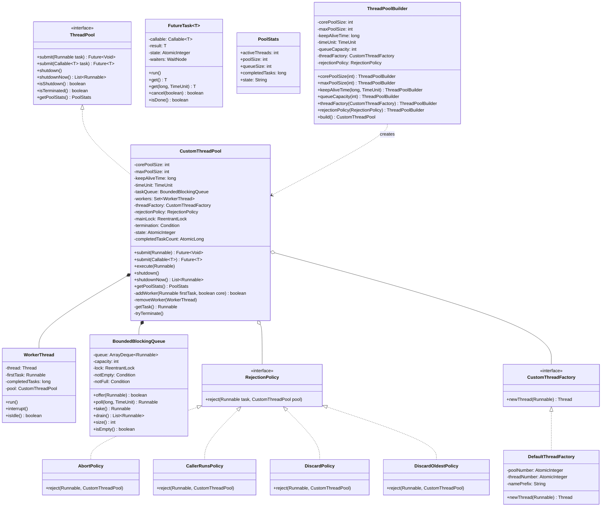
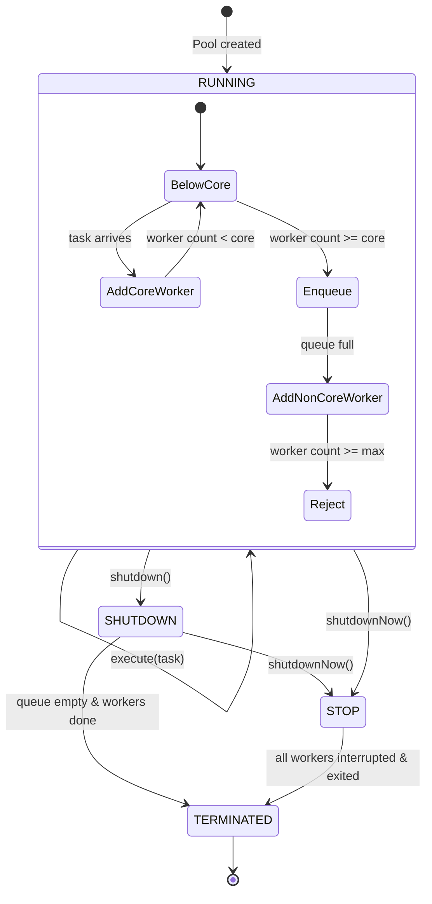
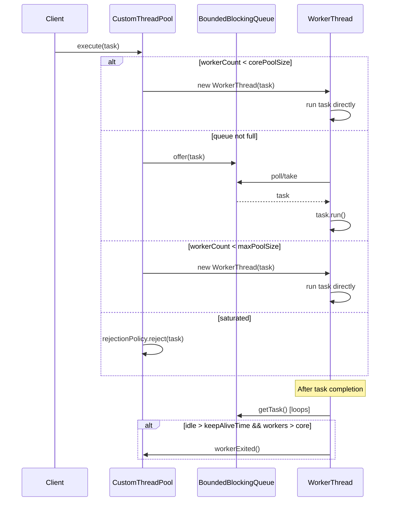

# Low-Level Design: Thread Pool Executor

## 1. Problem Statement

Design a custom thread pool executor that manages a pool of worker threads to execute submitted tasks efficiently. The pool should support dynamic sizing, multiple rejection policies, graceful shutdown, and provide Future-based task submission.

**Requirements:**
- Configurable core and max pool sizes
- Bounded task queue with configurable capacity
- Dynamic scaling: spawn threads up to max when queue is full, shrink idle threads after keep-alive timeout
- Multiple rejection policies when pool and queue are saturated
- Graceful and forced shutdown mechanisms
- Future support for Callable/Runnable submissions
- Thread-safe operations throughout
- Custom ThreadFactory support
- Pool statistics and monitoring

---

## 2. UML Class Diagram



---

## 3. Design Patterns

| Pattern | Application |
|---------|-------------|
| **Producer-Consumer** | Submitting threads produce tasks into the queue; worker threads consume them |
| **Strategy** | `RejectionPolicy` interface with interchangeable implementations |
| **Builder** | `ThreadPoolBuilder` for flexible pool configuration |
| **Observer** | Workers observe pool state for shutdown signals |
| **Template Method** | `WorkerThread.run()` defines the task execution lifecycle |
| **Object Pool** | Thread reuse — the core pattern of thread pooling |

---

## 4. SOLID Principles Applied

| Principle | Application |
|-----------|-------------|
| **SRP** | `WorkerThread` handles execution, `BoundedBlockingQueue` handles queuing, `RejectionPolicy` handles overflow |
| **OCP** | New rejection policies added without modifying pool; new thread factories pluggable |
| **LSP** | All `RejectionPolicy` implementations are substitutable |
| **ISP** | `ThreadPool` interface exposes only submission/lifecycle; internals hidden |
| **DIP** | Pool depends on `RejectionPolicy` and `CustomThreadFactory` abstractions, not concretions |

---

## 5. Complete Java Implementation

### 5.1 ThreadPool Interface

```java
import java.util.List;
import java.util.concurrent.Callable;
import java.util.concurrent.Future;

public interface ThreadPool {
    Future<?> submit(Runnable task);
    <T> Future<T> submit(Callable<T> task);
    void execute(Runnable task);
    void shutdown();
    List<Runnable> shutdownNow();
    boolean isShutdown();
    boolean isTerminated();
    boolean awaitTermination(long timeout, java.util.concurrent.TimeUnit unit) throws InterruptedException;
    PoolStats getPoolStats();
}
```

### 5.2 BoundedBlockingQueue

```java
import java.util.*;
import java.util.concurrent.TimeUnit;
import java.util.concurrent.locks.*;

public class BoundedBlockingQueue {
    private final ArrayDeque<Runnable> queue;
    private final int capacity;
    private final ReentrantLock lock = new ReentrantLock();
    private final Condition notEmpty = lock.newCondition();
    private final Condition notFull = lock.newCondition();

    public BoundedBlockingQueue(int capacity) {
        if (capacity <= 0) throw new IllegalArgumentException("Capacity must be positive");
        this.capacity = capacity;
        this.queue = new ArrayDeque<>(capacity);
    }

    public boolean offer(Runnable task) {
        lock.lock();
        try {
            if (queue.size() >= capacity) return false;
            queue.addLast(task);
            notEmpty.signal();
            return true;
        } finally {
            lock.unlock();
        }
    }

    public Runnable poll(long timeout, TimeUnit unit) throws InterruptedException {
        long nanos = unit.toNanos(timeout);
        lock.lockInterruptibly();
        try {
            while (queue.isEmpty()) {
                if (nanos <= 0) return null;
                nanos = notEmpty.awaitNanos(nanos);
            }
            Runnable task = queue.pollFirst();
            notFull.signal();
            return task;
        } finally {
            lock.unlock();
        }
    }

    public Runnable take() throws InterruptedException {
        lock.lockInterruptibly();
        try {
            while (queue.isEmpty()) {
                notEmpty.await();
            }
            Runnable task = queue.pollFirst();
            notFull.signal();
            return task;
        } finally {
            lock.unlock();
        }
    }

    public Runnable pollFirst() {
        lock.lock();
        try {
            return queue.pollFirst();
        } finally {
            lock.unlock();
        }
    }

    public List<Runnable> drain() {
        lock.lock();
        try {
            List<Runnable> drained = new ArrayList<>(queue);
            queue.clear();
            notFull.signalAll();
            return drained;
        } finally {
            lock.unlock();
        }
    }

    public int size() {
        lock.lock();
        try {
            return queue.size();
        } finally {
            lock.unlock();
        }
    }

    public boolean isEmpty() {
        lock.lock();
        try {
            return queue.isEmpty();
        } finally {
            lock.unlock();
        }
    }

    public boolean isFull() {
        lock.lock();
        try {
            return queue.size() >= capacity;
        } finally {
            lock.unlock();
        }
    }

    public void interruptWaiters() {
        lock.lock();
        try {
            notEmpty.signalAll();
        } finally {
            lock.unlock();
        }
    }
}
```

### 5.3 RejectionPolicy (Strategy Pattern)

```java
@FunctionalInterface
public interface RejectionPolicy {
    void reject(Runnable task, CustomThreadPool pool);
}

public class AbortPolicy implements RejectionPolicy {
    @Override
    public void reject(Runnable task, CustomThreadPool pool) {
        throw new RejectedExecutionException(
            "Task " + task + " rejected from " + pool);
    }
}

public class CallerRunsPolicy implements RejectionPolicy {
    @Override
    public void reject(Runnable task, CustomThreadPool pool) {
        if (!pool.isShutdown()) {
            task.run(); // Execute in the caller's thread
        }
    }
}

public class DiscardPolicy implements RejectionPolicy {
    @Override
    public void reject(Runnable task, CustomThreadPool pool) {
        // Silently discard the task
    }
}

public class DiscardOldestPolicy implements RejectionPolicy {
    @Override
    public void reject(Runnable task, CustomThreadPool pool) {
        if (!pool.isShutdown()) {
            pool.getTaskQueue().pollFirst(); // Remove oldest
            pool.execute(task);              // Re-submit current
        }
    }
}

public class RejectedExecutionException extends RuntimeException {
    public RejectedExecutionException(String message) {
        super(message);
    }
}
```

### 5.4 CustomThreadFactory

```java
import java.util.concurrent.atomic.AtomicInteger;

@FunctionalInterface
public interface CustomThreadFactory {
    Thread newThread(Runnable r);
}

public class DefaultThreadFactory implements CustomThreadFactory {
    private static final AtomicInteger POOL_NUMBER = new AtomicInteger(1);
    private final AtomicInteger threadNumber = new AtomicInteger(1);
    private final String namePrefix;
    private final boolean daemon;

    public DefaultThreadFactory() {
        this("pool-" + POOL_NUMBER.getAndIncrement(), false);
    }

    public DefaultThreadFactory(String poolName, boolean daemon) {
        this.namePrefix = poolName + "-thread-";
        this.daemon = daemon;
    }

    @Override
    public Thread newThread(Runnable r) {
        Thread t = new Thread(r, namePrefix + threadNumber.getAndIncrement());
        t.setDaemon(daemon);
        t.setPriority(Thread.NORM_PRIORITY);
        return t;
    }
}
```

### 5.5 CustomFutureTask

```java
import java.util.concurrent.*;
import java.util.concurrent.atomic.AtomicInteger;
import java.util.concurrent.locks.LockSupport;

public class CustomFutureTask<T> implements Future<T>, Runnable {

    private static final int NEW        = 0;
    private static final int RUNNING    = 1;
    private static final int COMPLETED  = 2;
    private static final int EXCEPTIONAL = 3;
    private static final int CANCELLED  = 4;

    private final AtomicInteger state = new AtomicInteger(NEW);
    private final Callable<T> callable;
    private volatile T result;
    private volatile Throwable exception;
    private volatile Thread runner;
    private volatile WaitNode waiters;

    public CustomFutureTask(Callable<T> callable) {
        this.callable = callable;
    }

    public CustomFutureTask(Runnable runnable, T result) {
        this.callable = () -> { runnable.run(); return result; };
    }

    @Override
    public void run() {
        if (!state.compareAndSet(NEW, RUNNING)) return;
        runner = Thread.currentThread();
        try {
            T res = callable.call();
            if (state.compareAndSet(RUNNING, COMPLETED)) {
                result = res;
                finishCompletion();
            }
        } catch (Throwable t) {
            if (state.compareAndSet(RUNNING, EXCEPTIONAL)) {
                exception = t;
                finishCompletion();
            }
        } finally {
            runner = null;
        }
    }

    @Override
    public T get() throws InterruptedException, ExecutionException {
        int s = state.get();
        if (s <= RUNNING) s = awaitDone(0L);
        return report(s);
    }

    @Override
    public T get(long timeout, TimeUnit unit)
            throws InterruptedException, ExecutionException, TimeoutException {
        int s = state.get();
        if (s <= RUNNING) {
            s = awaitDone(unit.toNanos(timeout));
            if (s <= RUNNING) throw new TimeoutException();
        }
        return report(s);
    }

    @Override
    public boolean cancel(boolean mayInterruptIfRunning) {
        if (state.get() != NEW && state.get() != RUNNING) return false;
        if (mayInterruptIfRunning) {
            Thread t = runner;
            if (t != null) t.interrupt();
        }
        if (state.compareAndSet(NEW, CANCELLED) || state.compareAndSet(RUNNING, CANCELLED)) {
            finishCompletion();
            return true;
        }
        return false;
    }

    @Override
    public boolean isCancelled() { return state.get() == CANCELLED; }

    @Override
    public boolean isDone() { return state.get() > RUNNING; }

    private T report(int s) throws ExecutionException {
        if (s == COMPLETED) return result;
        if (s == CANCELLED) throw new CancellationException();
        throw new ExecutionException(exception);
    }

    private int awaitDone(long nanos) throws InterruptedException {
        WaitNode node = new WaitNode();
        node.thread = Thread.currentThread();
        // Spin-wait with park
        for (;;) {
            if (Thread.interrupted()) throw new InterruptedException();
            int s = state.get();
            if (s > RUNNING) return s;
            // Add to waiters (simplified — single waiter for brevity)
            waiters = node;
            if (nanos > 0) {
                LockSupport.parkNanos(this, nanos);
                nanos = 0; // simplified — one shot
            } else {
                LockSupport.park(this);
            }
        }
    }

    private void finishCompletion() {
        WaitNode w = waiters;
        if (w != null && w.thread != null) {
            LockSupport.unpark(w.thread);
        }
    }

    private static class WaitNode {
        volatile Thread thread;
    }
}
```

### 5.6 PoolStats

```java
public record PoolStats(
    int activeThreads,
    int poolSize,
    int corePoolSize,
    int maxPoolSize,
    int queueSize,
    long completedTasks,
    String state
) {
    @Override
    public String toString() {
        return """
            PoolStats {
                activeThreads=%d, poolSize=%d,
                core=%d, max=%d,
                queueSize=%d, completedTasks=%d,
                state=%s
            }""".formatted(activeThreads, poolSize, corePoolSize, maxPoolSize,
                          queueSize, completedTasks, state);
    }
}
```

### 5.7 WorkerThread

```java
public class WorkerThread implements Runnable {
    private final Thread thread;
    private Runnable firstTask;
    private long completedTasks;
    private final CustomThreadPool pool;
    private volatile boolean idle = true;

    public WorkerThread(CustomThreadPool pool, Runnable firstTask) {
        this.pool = pool;
        this.firstTask = firstTask;
        this.thread = pool.getThreadFactory().newThread(this);
    }

    @Override
    public void run() {
        runWorker();
    }

    private void runWorker() {
        Runnable task = firstTask;
        firstTask = null;
        try {
            while (task != null || (task = pool.getTask(this)) != null) {
                idle = false;
                try {
                    task.run();
                } catch (RuntimeException | Error ex) {
                    // Log but don't kill the worker
                    System.err.println("Task threw exception: " + ex.getMessage());
                } finally {
                    task = null;
                    completedTasks++;
                    idle = true;
                }
            }
        } finally {
            pool.workerExited(this);
        }
    }

    public void start() { thread.start(); }
    public void interrupt() { thread.interrupt(); }
    public boolean isIdle() { return idle; }
    public long getCompletedTasks() { return completedTasks; }
    public Thread getThread() { return thread; }
    public boolean isAlive() { return thread.isAlive(); }
}
```

### 5.8 CustomThreadPool (Core Implementation)

```java
import java.util.*;
import java.util.concurrent.*;
import java.util.concurrent.atomic.*;
import java.util.concurrent.locks.*;

public class CustomThreadPool implements ThreadPool {

    // Pool states
    private static final int RUNNING    = 0;
    private static final int SHUTDOWN   = 1;
    private static final int STOP       = 2;
    private static final int TERMINATED = 3;

    private final AtomicInteger state = new AtomicInteger(RUNNING);
    private final AtomicLong completedTaskCount = new AtomicLong(0);

    private final int corePoolSize;
    private final int maxPoolSize;
    private final long keepAliveTimeNanos;
    private final BoundedBlockingQueue taskQueue;
    private final CustomThreadFactory threadFactory;
    private final RejectionPolicy rejectionPolicy;

    private final Set<WorkerThread> workers = new HashSet<>();
    private final ReentrantLock mainLock = new ReentrantLock();
    private final Condition termination = mainLock.newCondition();

    CustomThreadPool(int corePoolSize, int maxPoolSize, long keepAliveTime,
                     TimeUnit unit, int queueCapacity,
                     CustomThreadFactory threadFactory,
                     RejectionPolicy rejectionPolicy) {
        if (corePoolSize < 0 || maxPoolSize <= 0 || maxPoolSize < corePoolSize || keepAliveTime < 0)
            throw new IllegalArgumentException("Invalid pool configuration");

        this.corePoolSize = corePoolSize;
        this.maxPoolSize = maxPoolSize;
        this.keepAliveTimeNanos = unit.toNanos(keepAliveTime);
        this.taskQueue = new BoundedBlockingQueue(queueCapacity);
        this.threadFactory = threadFactory;
        this.rejectionPolicy = rejectionPolicy;
    }

    // --- Public API ---

    @Override
    public Future<?> submit(Runnable task) {
        Objects.requireNonNull(task);
        CustomFutureTask<Void> future = new CustomFutureTask<>(task, null);
        execute(future);
        return future;
    }

    @Override
    public <T> Future<T> submit(Callable<T> task) {
        Objects.requireNonNull(task);
        CustomFutureTask<T> future = new CustomFutureTask<>(task);
        execute(future);
        return future;
    }

    @Override
    public void execute(Runnable task) {
        Objects.requireNonNull(task);

        if (state.get() >= SHUTDOWN) {
            rejectionPolicy.reject(task, this);
            return;
        }

        int workerCount = getWorkerCount();

        // Step 1: If below core size, add a core worker
        if (workerCount < corePoolSize) {
            if (addWorker(task, true)) return;
            workerCount = getWorkerCount();
        }

        // Step 2: Try to enqueue
        if (taskQueue.offer(task)) {
            // Double-check: if pool shut down after enqueue, remove and reject
            if (state.get() >= SHUTDOWN && taskQueue.pollFirst() == task) {
                rejectionPolicy.reject(task, this);
            }
            // If all workers died, add one
            else if (getWorkerCount() == 0) {
                addWorker(null, false);
            }
            return;
        }

        // Step 3: Queue full — try to add non-core worker up to max
        if (!addWorker(task, false)) {
            // Cannot add worker (at max) — reject
            rejectionPolicy.reject(task, this);
        }
    }

    @Override
    public void shutdown() {
        mainLock.lock();
        try {
            if (state.compareAndSet(RUNNING, SHUTDOWN)) {
                // Don't interrupt workers — let them finish current tasks
                taskQueue.interruptWaiters(); // Wake blocked workers to check state
            }
        } finally {
            mainLock.unlock();
        }
        tryTerminate();
    }

    @Override
    public List<Runnable> shutdownNow() {
        List<Runnable> remainingTasks;
        mainLock.lock();
        try {
            state.set(STOP);
            // Interrupt all workers
            for (WorkerThread w : workers) {
                w.interrupt();
            }
            remainingTasks = taskQueue.drain();
        } finally {
            mainLock.unlock();
        }
        tryTerminate();
        return remainingTasks;
    }

    @Override
    public boolean isShutdown() { return state.get() >= SHUTDOWN; }

    @Override
    public boolean isTerminated() { return state.get() == TERMINATED; }

    @Override
    public boolean awaitTermination(long timeout, TimeUnit unit) throws InterruptedException {
        long nanos = unit.toNanos(timeout);
        mainLock.lock();
        try {
            while (state.get() != TERMINATED) {
                if (nanos <= 0) return false;
                nanos = termination.awaitNanos(nanos);
            }
            return true;
        } finally {
            mainLock.unlock();
        }
    }

    @Override
    public PoolStats getPoolStats() {
        mainLock.lock();
        try {
            int active = (int) workers.stream().filter(w -> !w.isIdle()).count();
            String stateStr = switch (state.get()) {
                case RUNNING    -> "RUNNING";
                case SHUTDOWN   -> "SHUTDOWN";
                case STOP       -> "STOP";
                case TERMINATED -> "TERMINATED";
                default         -> "UNKNOWN";
            };
            return new PoolStats(active, workers.size(), corePoolSize, maxPoolSize,
                                taskQueue.size(), completedTaskCount.get(), stateStr);
        } finally {
            mainLock.unlock();
        }
    }

    // --- Internal methods used by WorkerThread ---

    Runnable getTask(WorkerThread worker) {
        boolean timedOut = false;

        for (;;) {
            int s = state.get();

            // If STOP, or SHUTDOWN with empty queue — worker should exit
            if (s >= STOP || (s == SHUTDOWN && taskQueue.isEmpty())) {
                return null;
            }

            int wc = getWorkerCount();
            // Should this worker use timed poll (non-core)?
            boolean timed = wc > corePoolSize;

            // If timed out and we're above core size, let worker die
            if (timedOut && timed) {
                return null;
            }

            try {
                Runnable task = timed
                    ? taskQueue.poll(keepAliveTimeNanos, TimeUnit.NANOSECONDS)
                    : taskQueue.take();

                if (task != null) return task;
                timedOut = true;
            } catch (InterruptedException e) {
                timedOut = true; // Re-check loop conditions
            }
        }
    }

    void workerExited(WorkerThread worker) {
        mainLock.lock();
        try {
            completedTaskCount.addAndGet(worker.getCompletedTasks());
            workers.remove(worker);
        } finally {
            mainLock.unlock();
        }
        tryTerminate();
    }

    BoundedBlockingQueue getTaskQueue() { return taskQueue; }
    CustomThreadFactory getThreadFactory() { return threadFactory; }

    // --- Private helpers ---

    private boolean addWorker(Runnable firstTask, boolean core) {
        mainLock.lock();
        try {
            int s = state.get();
            if (s >= STOP) return false;
            if (s >= SHUTDOWN && firstTask != null) return false;

            int wc = workers.size();
            int limit = core ? corePoolSize : maxPoolSize;
            if (wc >= limit) return false;

            WorkerThread worker = new WorkerThread(this, firstTask);
            workers.add(worker);
            worker.start();
            return true;
        } finally {
            mainLock.unlock();
        }
    }

    private int getWorkerCount() {
        mainLock.lock();
        try {
            return workers.size();
        } finally {
            mainLock.unlock();
        }
    }

    private void tryTerminate() {
        mainLock.lock();
        try {
            int s = state.get();
            if (s == TERMINATED) return;
            if (s == SHUTDOWN && !workers.isEmpty()) return;
            if (s == SHUTDOWN && !taskQueue.isEmpty()) return;

            if (workers.isEmpty()) {
                state.set(TERMINATED);
                termination.signalAll();
            }
        } finally {
            mainLock.unlock();
        }
    }
}
```

### 5.9 ThreadPoolBuilder

```java
import java.util.concurrent.TimeUnit;

public class ThreadPoolBuilder {
    private int corePoolSize = 2;
    private int maxPoolSize = 4;
    private long keepAliveTime = 60;
    private TimeUnit timeUnit = TimeUnit.SECONDS;
    private int queueCapacity = 100;
    private CustomThreadFactory threadFactory = new DefaultThreadFactory();
    private RejectionPolicy rejectionPolicy = new AbortPolicy();

    public ThreadPoolBuilder corePoolSize(int size) {
        this.corePoolSize = size;
        return this;
    }

    public ThreadPoolBuilder maxPoolSize(int size) {
        this.maxPoolSize = size;
        return this;
    }

    public ThreadPoolBuilder keepAliveTime(long time, TimeUnit unit) {
        this.keepAliveTime = time;
        this.timeUnit = unit;
        return this;
    }

    public ThreadPoolBuilder queueCapacity(int capacity) {
        this.queueCapacity = capacity;
        return this;
    }

    public ThreadPoolBuilder threadFactory(CustomThreadFactory factory) {
        this.threadFactory = factory;
        return this;
    }

    public ThreadPoolBuilder rejectionPolicy(RejectionPolicy policy) {
        this.rejectionPolicy = policy;
        return this;
    }

    public CustomThreadPool build() {
        return new CustomThreadPool(corePoolSize, maxPoolSize, keepAliveTime,
                                    timeUnit, queueCapacity, threadFactory, rejectionPolicy);
    }
}
```

### 5.10 Demo / Main

```java
import java.util.concurrent.*;

public class ThreadPoolDemo {
    public static void main(String[] args) throws Exception {
        CustomThreadPool pool = new ThreadPoolBuilder()
            .corePoolSize(2)
            .maxPoolSize(5)
            .keepAliveTime(30, TimeUnit.SECONDS)
            .queueCapacity(10)
            .threadFactory(new DefaultThreadFactory("demo-pool", false))
            .rejectionPolicy(new CallerRunsPolicy())
            .build();

        // Submit Runnable tasks
        for (int i = 0; i < 20; i++) {
            final int taskId = i;
            pool.submit(() -> {
                System.out.println(Thread.currentThread().getName()
                    + " executing task-" + taskId);
                try { Thread.sleep(100); } catch (InterruptedException ignored) {}
            });
        }

        // Submit Callable tasks with Future
        Future<String> future = pool.submit(() -> {
            Thread.sleep(200);
            return "Result from Callable";
        });
        System.out.println("Future result: " + future.get(5, TimeUnit.SECONDS));

        // Print stats
        System.out.println(pool.getPoolStats());

        // Graceful shutdown
        pool.shutdown();
        boolean terminated = pool.awaitTermination(10, TimeUnit.SECONDS);
        System.out.println("Pool terminated: " + terminated);
        System.out.println(pool.getPoolStats());
    }
}
```

---

## 6. Lifecycle Diagram





---

## 7. Key Interview Points

### Producer-Consumer Pattern
- **Producers**: Caller threads invoking `execute()`/`submit()`
- **Consumers**: `WorkerThread` instances calling `getTask()` which blocks on the queue
- **Buffer**: `BoundedBlockingQueue` decouples producers from consumers
- Bounded queue provides **backpressure** — when full, triggers rejection or scaling

### Thread Safety Mechanisms
- `ReentrantLock` + `Condition` in queue for wait/signal semantics
- `mainLock` in pool protects the `workers` set and state transitions
- `AtomicInteger` for pool state — enables lock-free state checks
- `AtomicLong` for completed task counter — no contention on hot path
- `volatile` fields in `WorkerThread` for visibility across threads

### Dynamic Scaling Logic
1. Tasks arrive → spawn core threads first (up to `corePoolSize`)
2. Core threads busy → enqueue tasks (up to `queueCapacity`)
3. Queue full → spawn non-core threads (up to `maxPoolSize`)
4. Max reached + queue full → apply rejection policy
5. Non-core threads idle beyond `keepAliveTime` → terminate themselves

### Shutdown Semantics
| Method | Behavior |
|--------|----------|
| `shutdown()` | No new tasks accepted; existing queued tasks complete; workers finish current work |
| `shutdownNow()` | No new tasks; drain queue (returned); interrupt all workers immediately |

### Common Interview Questions

**Q: Why not use `synchronized` instead of `ReentrantLock`?**
A: `ReentrantLock` supports `Condition` objects (multiple wait-sets), timed waits, and try-lock — essential for timed poll in `getTask()`.

**Q: How do you prevent a worker from taking a task after shutdown?**
A: `getTask()` checks pool state on every iteration. In SHUTDOWN state it returns null when queue is empty. In STOP it returns null immediately.

**Q: Why separate core and max pool sizes?**
A: Core threads are long-lived (block indefinitely on queue). Non-core threads are transient — they die after `keepAliveTime` idle, allowing the pool to shrink under low load.

**Q: How does `CallerRunsPolicy` provide backpressure?**
A: It runs the task in the submitting thread, slowing down the producer naturally. This prevents OOM from unbounded task accumulation.

**Q: Race condition in execute() — what if pool shuts down between state check and addWorker?**
A: `addWorker()` re-checks state under `mainLock`. If shutdown occurred, it returns false and the task is rejected.
