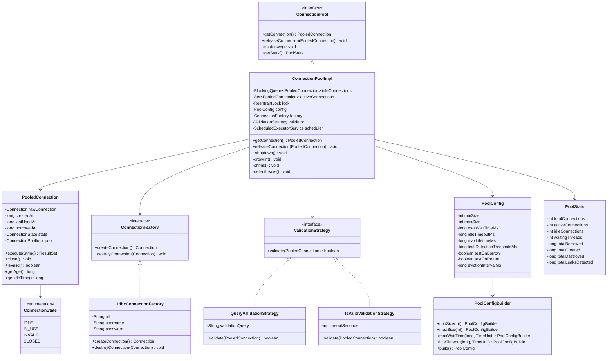
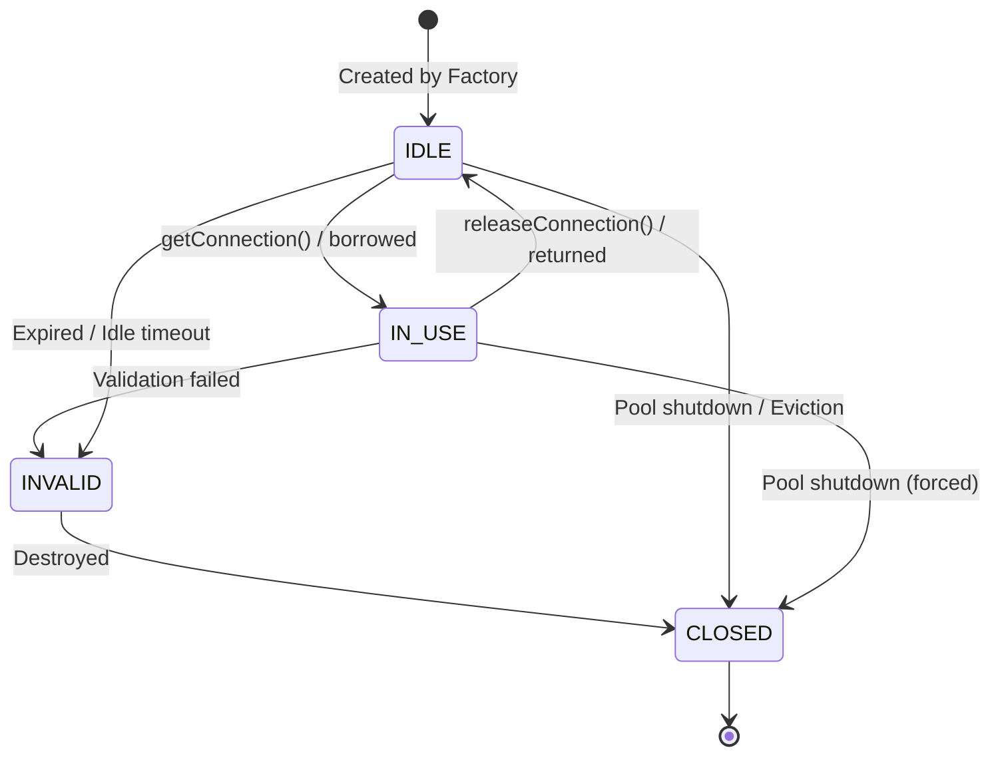

# Low-Level Design: Connection Pool

## 1. Problem Statement

Design a thread-safe, configurable database connection pool that:
- Manages a pool of reusable database connections
- Supports min/max pool sizing with auto-scaling
- Validates connections before use and on return
- Detects connection leaks (unreturned connections)
- Provides pool statistics and health monitoring
- Handles graceful shutdown

---

## 2. UML Class Diagram



---

## 3. Design Patterns

| Pattern | Usage |
|---------|-------|
| **Object Pool** | Core pattern — reuse expensive connection objects |
| **Singleton** | Single pool instance per data source |
| **Factory** | `ConnectionFactory` abstracts connection creation |
| **Strategy** | `ValidationStrategy` for pluggable validation |
| **Builder** | `PoolConfig.Builder` for readable configuration |
| **Wrapper/Decorator** | `PooledConnection` wraps raw `Connection` |

---

## 4. SOLID Principles

| Principle | Application |
|-----------|-------------|
| **SRP** | `ConnectionFactory` creates, `ValidationStrategy` validates, `PooledConnection` wraps |
| **OCP** | New validation strategies without modifying pool |
| **LSP** | All `ValidationStrategy` implementations are interchangeable |
| **ISP** | `ConnectionPool` interface exposes only pool operations |
| **DIP** | Pool depends on `ConnectionFactory` and `ValidationStrategy` abstractions |

---

## 5. Complete Java Implementation

### 5.1 Pool Configuration

```java
import java.util.concurrent.TimeUnit;

public record PoolConfig(
    int minSize,
    int maxSize,
    long maxWaitTimeMs,
    long idleTimeoutMs,
    long maxLifetimeMs,
    long leakDetectionThresholdMs,
    boolean testOnBorrow,
    boolean testOnReturn,
    long evictionIntervalMs
) {
    public PoolConfig {
        if (minSize < 0) throw new IllegalArgumentException("minSize must be >= 0");
        if (maxSize < minSize) throw new IllegalArgumentException("maxSize must be >= minSize");
        if (maxWaitTimeMs <= 0) throw new IllegalArgumentException("maxWaitTime must be > 0");
    }

    public static Builder builder() {
        return new Builder();
    }

    public static class Builder {
        private int minSize = 5;
        private int maxSize = 20;
        private long maxWaitTimeMs = 30_000;
        private long idleTimeoutMs = 600_000;      // 10 min
        private long maxLifetimeMs = 1_800_000;    // 30 min
        private long leakDetectionThresholdMs = 60_000; // 1 min
        private boolean testOnBorrow = true;
        private boolean testOnReturn = false;
        private long evictionIntervalMs = 30_000;  // 30 sec

        public Builder minSize(int minSize) { this.minSize = minSize; return this; }
        public Builder maxSize(int maxSize) { this.maxSize = maxSize; return this; }
        public Builder maxWaitTime(long time, TimeUnit unit) {
            this.maxWaitTimeMs = unit.toMillis(time); return this;
        }
        public Builder idleTimeout(long time, TimeUnit unit) {
            this.idleTimeoutMs = unit.toMillis(time); return this;
        }
        public Builder maxLifetime(long time, TimeUnit unit) {
            this.maxLifetimeMs = unit.toMillis(time); return this;
        }
        public Builder leakDetectionThreshold(long time, TimeUnit unit) {
            this.leakDetectionThresholdMs = unit.toMillis(time); return this;
        }
        public Builder testOnBorrow(boolean test) { this.testOnBorrow = test; return this; }
        public Builder testOnReturn(boolean test) { this.testOnReturn = test; return this; }
        public Builder evictionInterval(long time, TimeUnit unit) {
            this.evictionIntervalMs = unit.toMillis(time); return this;
        }

        public PoolConfig build() {
            return new PoolConfig(minSize, maxSize, maxWaitTimeMs, idleTimeoutMs,
                maxLifetimeMs, leakDetectionThresholdMs, testOnBorrow, testOnReturn,
                evictionIntervalMs);
        }
    }
}
```

### 5.2 Connection State & Pool Stats

```java
public enum ConnectionState {
    IDLE, IN_USE, INVALID, CLOSED
}

public record PoolStats(
    int totalConnections,
    int activeConnections,
    int idleConnections,
    int waitingThreads,
    long totalBorrowed,
    long totalCreated,
    long totalDestroyed,
    long totalLeaksDetected
) {
    @Override
    public String toString() {
        return "PoolStats{total=%d, active=%d, idle=%d, waiters=%d, borrowed=%d, created=%d, destroyed=%d, leaks=%d}"
            .formatted(totalConnections, activeConnections, idleConnections,
                waitingThreads, totalBorrowed, totalCreated, totalDestroyed, totalLeaksDetected);
    }
}
```

### 5.3 Connection Factory

```java
import java.sql.Connection;
import java.sql.DriverManager;
import java.sql.SQLException;

public interface ConnectionFactory {
    Connection createConnection() throws SQLException;
    void destroyConnection(Connection connection);
}

public class JdbcConnectionFactory implements ConnectionFactory {
    private final String url;
    private final String username;
    private final String password;

    public JdbcConnectionFactory(String url, String username, String password) {
        this.url = url;
        this.username = username;
        this.password = password;
    }

    @Override
    public Connection createConnection() throws SQLException {
        return DriverManager.getConnection(url, username, password);
    }

    @Override
    public void destroyConnection(Connection connection) {
        try {
            if (connection != null && !connection.isClosed()) {
                connection.close();
            }
        } catch (SQLException e) {
            // Log and swallow
        }
    }
}
```

### 5.4 Validation Strategy

```java
public interface ValidationStrategy {
    boolean validate(PooledConnection connection);
}

public class QueryValidationStrategy implements ValidationStrategy {
    private final String validationQuery;

    public QueryValidationStrategy(String validationQuery) {
        this.validationQuery = validationQuery;
    }

    @Override
    public boolean validate(PooledConnection connection) {
        try {
            var stmt = connection.getRawConnection().createStatement();
            stmt.execute(validationQuery);
            stmt.close();
            return true;
        } catch (SQLException e) {
            return false;
        }
    }
}

public class IsValidValidationStrategy implements ValidationStrategy {
    private final int timeoutSeconds;

    public IsValidValidationStrategy(int timeoutSeconds) {
        this.timeoutSeconds = timeoutSeconds;
    }

    @Override
    public boolean validate(PooledConnection connection) {
        try {
            return connection.getRawConnection().isValid(timeoutSeconds);
        } catch (SQLException e) {
            return false;
        }
    }
}
```

### 5.5 Pooled Connection (Wrapper)

```java
import java.sql.Connection;
import java.sql.SQLException;

public class PooledConnection implements AutoCloseable {
    private final Connection rawConnection;
    private final long createdAt;
    private volatile long lastUsedAt;
    private volatile long borrowedAt;
    private volatile ConnectionState state;
    private final ConnectionPoolImpl pool;
    private volatile Thread ownerThread;
    private volatile Exception borrowStackTrace;

    public PooledConnection(Connection rawConnection, ConnectionPoolImpl pool) {
        this.rawConnection = rawConnection;
        this.pool = pool;
        this.createdAt = System.currentTimeMillis();
        this.lastUsedAt = createdAt;
        this.state = ConnectionState.IDLE;
    }

    public Connection getRawConnection() {
        return rawConnection;
    }

    public void markBorrowed() {
        this.state = ConnectionState.IN_USE;
        this.borrowedAt = System.currentTimeMillis();
        this.lastUsedAt = borrowedAt;
        this.ownerThread = Thread.currentThread();
        this.borrowStackTrace = new Exception("Connection borrowed at");
    }

    public void markReturned() {
        this.state = ConnectionState.IDLE;
        this.lastUsedAt = System.currentTimeMillis();
        this.ownerThread = null;
        this.borrowStackTrace = null;
    }

    public void markInvalid() {
        this.state = ConnectionState.INVALID;
    }

    public void markClosed() {
        this.state = ConnectionState.CLOSED;
    }

    public boolean isValid() {
        try {
            return rawConnection != null && !rawConnection.isClosed();
        } catch (SQLException e) {
            return false;
        }
    }

    public boolean isExpired(long maxLifetimeMs) {
        return System.currentTimeMillis() - createdAt > maxLifetimeMs;
    }

    public boolean isIdle(long idleTimeoutMs) {
        return state == ConnectionState.IDLE &&
               System.currentTimeMillis() - lastUsedAt > idleTimeoutMs;
    }

    public long getBorrowedDuration() {
        if (state != ConnectionState.IN_USE) return 0;
        return System.currentTimeMillis() - borrowedAt;
    }

    public ConnectionState getState() { return state; }
    public long getCreatedAt() { return createdAt; }
    public long getLastUsedAt() { return lastUsedAt; }
    public Thread getOwnerThread() { return ownerThread; }
    public Exception getBorrowStackTrace() { return borrowStackTrace; }

    @Override
    public void close() {
        pool.releaseConnection(this);
    }
}
```

### 5.6 Connection Pool Interface

```java
public interface ConnectionPool {
    PooledConnection getConnection() throws SQLException, InterruptedException;
    void releaseConnection(PooledConnection connection);
    void shutdown();
    PoolStats getStats();
}
```

### 5.7 Connection Pool Implementation

```java
import java.sql.SQLException;
import java.util.*;
import java.util.concurrent.*;
import java.util.concurrent.atomic.*;
import java.util.concurrent.locks.*;

public class ConnectionPoolImpl implements ConnectionPool {

    private final PoolConfig config;
    private final ConnectionFactory factory;
    private final ValidationStrategy validator;

    private final BlockingQueue<PooledConnection> idleQueue;
    private final Set<PooledConnection> allConnections;
    private final Set<PooledConnection> activeConnections;

    private final ReentrantLock lock = new ReentrantLock(true); // fair lock
    private final AtomicInteger totalSize = new AtomicInteger(0);
    private final AtomicInteger waitingThreads = new AtomicInteger(0);
    private final AtomicLong totalBorrowed = new AtomicLong(0);
    private final AtomicLong totalCreated = new AtomicLong(0);
    private final AtomicLong totalDestroyed = new AtomicLong(0);
    private final AtomicLong totalLeaksDetected = new AtomicLong(0);

    private final ScheduledExecutorService scheduler;
    private volatile boolean shutdownRequested = false;

    public ConnectionPoolImpl(PoolConfig config, ConnectionFactory factory,
                              ValidationStrategy validator) throws SQLException {
        this.config = config;
        this.factory = factory;
        this.validator = validator;
        this.idleQueue = new LinkedBlockingQueue<>();
        this.allConnections = ConcurrentHashMap.newKeySet();
        this.activeConnections = ConcurrentHashMap.newKeySet();
        this.scheduler = Executors.newScheduledThreadPool(2, r -> {
            Thread t = new Thread(r, "pool-maintenance");
            t.setDaemon(true);
            return t;
        });

        // Initialize minimum connections
        initializePool();

        // Schedule maintenance tasks
        scheduler.scheduleAtFixedRate(this::evictIdleConnections,
            config.evictionIntervalMs(), config.evictionIntervalMs(), TimeUnit.MILLISECONDS);
        scheduler.scheduleAtFixedRate(this::detectLeaks,
            config.leakDetectionThresholdMs(), config.leakDetectionThresholdMs(), TimeUnit.MILLISECONDS);
    }

    private void initializePool() throws SQLException {
        for (int i = 0; i < config.minSize(); i++) {
            PooledConnection conn = createNewConnection();
            idleQueue.offer(conn);
        }
    }

    private PooledConnection createNewConnection() throws SQLException {
        var rawConn = factory.createConnection();
        var pooled = new PooledConnection(rawConn, this);
        allConnections.add(pooled);
        totalSize.incrementAndGet();
        totalCreated.incrementAndGet();
        return pooled;
    }

    private void destroyConnection(PooledConnection conn) {
        conn.markClosed();
        allConnections.remove(conn);
        activeConnections.remove(conn);
        totalSize.decrementAndGet();
        totalDestroyed.incrementAndGet();
        factory.destroyConnection(conn.getRawConnection());
    }

    @Override
    public PooledConnection getConnection() throws SQLException, InterruptedException {
        if (shutdownRequested) {
            throw new SQLException("Pool has been shut down");
        }

        long startTime = System.currentTimeMillis();
        long remaining = config.maxWaitTimeMs();

        while (remaining > 0) {
            // Try to get from idle queue
            PooledConnection conn = idleQueue.poll();

            if (conn != null) {
                // Validate if required
                if (isConnectionUsable(conn)) {
                    conn.markBorrowed();
                    activeConnections.add(conn);
                    totalBorrowed.incrementAndGet();
                    return conn;
                } else {
                    // Connection is stale, destroy and try again
                    destroyConnection(conn);
                    continue;
                }
            }

            // No idle connection available — try to grow
            lock.lock();
            try {
                if (totalSize.get() < config.maxSize()) {
                    PooledConnection newConn = createNewConnection();
                    newConn.markBorrowed();
                    activeConnections.add(newConn);
                    totalBorrowed.incrementAndGet();
                    return newConn;
                }
            } finally {
                lock.unlock();
            }

            // Pool at max capacity — wait for a connection to be returned
            waitingThreads.incrementAndGet();
            try {
                conn = idleQueue.poll(remaining, TimeUnit.MILLISECONDS);
            } finally {
                waitingThreads.decrementAndGet();
            }

            if (conn != null && isConnectionUsable(conn)) {
                conn.markBorrowed();
                activeConnections.add(conn);
                totalBorrowed.incrementAndGet();
                return conn;
            } else if (conn != null) {
                destroyConnection(conn);
            }

            remaining = config.maxWaitTimeMs() - (System.currentTimeMillis() - startTime);
        }

        throw new SQLException("Timeout waiting for connection after " + config.maxWaitTimeMs() + "ms");
    }

    private boolean isConnectionUsable(PooledConnection conn) {
        if (!conn.isValid()) return false;
        if (conn.isExpired(config.maxLifetimeMs())) return false;
        if (config.testOnBorrow() && !validator.validate(conn)) return false;
        return true;
    }

    @Override
    public void releaseConnection(PooledConnection connection) {
        if (connection == null || shutdownRequested) return;

        activeConnections.remove(connection);

        if (connection.getState() == ConnectionState.INVALID || !connection.isValid()) {
            destroyConnection(connection);
            ensureMinSize();
            return;
        }

        if (config.testOnReturn() && !validator.validate(connection)) {
            destroyConnection(connection);
            ensureMinSize();
            return;
        }

        connection.markReturned();

        if (!idleQueue.offer(connection)) {
            // Queue full (shouldn't happen with unbounded queue)
            destroyConnection(connection);
        }
    }

    private void ensureMinSize() {
        lock.lock();
        try {
            while (totalSize.get() < config.minSize()) {
                try {
                    PooledConnection conn = createNewConnection();
                    idleQueue.offer(conn);
                } catch (SQLException e) {
                    break; // Can't create more right now
                }
            }
        } finally {
            lock.unlock();
        }
    }

    /**
     * Evict idle connections that exceed idle timeout or max lifetime.
     * Maintains at least minSize connections.
     */
    private void evictIdleConnections() {
        if (shutdownRequested) return;

        List<PooledConnection> toEvict = new ArrayList<>();
        int currentSize = totalSize.get();

        for (PooledConnection conn : idleQueue) {
            if (currentSize <= config.minSize()) break;

            if (conn.isIdle(config.idleTimeoutMs()) || conn.isExpired(config.maxLifetimeMs())) {
                if (idleQueue.remove(conn)) {
                    toEvict.add(conn);
                    currentSize--;
                }
            }
        }

        for (PooledConnection conn : toEvict) {
            destroyConnection(conn);
        }
    }

    /**
     * Detect leaked connections — borrowed for too long.
     */
    private void detectLeaks() {
        if (shutdownRequested) return;

        for (PooledConnection conn : activeConnections) {
            if (conn.getBorrowedDuration() > config.leakDetectionThresholdMs()) {
                totalLeaksDetected.incrementAndGet();
                System.err.println("[LEAK DETECTED] Connection borrowed for " +
                    conn.getBorrowedDuration() + "ms by thread: " + conn.getOwnerThread());
                if (conn.getBorrowStackTrace() != null) {
                    conn.getBorrowStackTrace().printStackTrace(System.err);
                }
            }
        }
    }

    @Override
    public PoolStats getStats() {
        return new PoolStats(
            totalSize.get(),
            activeConnections.size(),
            idleQueue.size(),
            waitingThreads.get(),
            totalBorrowed.get(),
            totalCreated.get(),
            totalDestroyed.get(),
            totalLeaksDetected.get()
        );
    }

    @Override
    public void shutdown() {
        shutdownRequested = true;
        scheduler.shutdownNow();

        // Drain idle connections
        PooledConnection conn;
        while ((conn = idleQueue.poll()) != null) {
            destroyConnection(conn);
        }

        // Force-close active connections
        for (PooledConnection active : activeConnections) {
            destroyConnection(active);
        }

        System.out.println("Connection pool shut down. Final stats: " + getStats());
    }
}
```

### 5.8 Singleton Pool Manager

```java
import java.sql.SQLException;
import java.util.concurrent.ConcurrentHashMap;

public class ConnectionPoolManager {
    private static final ConcurrentHashMap<String, ConnectionPool> pools = new ConcurrentHashMap<>();

    public static ConnectionPool getPool(String name, PoolConfig config,
                                         ConnectionFactory factory,
                                         ValidationStrategy validator) throws SQLException {
        return pools.computeIfAbsent(name, k -> {
            try {
                return new ConnectionPoolImpl(config, factory, validator);
            } catch (SQLException e) {
                throw new RuntimeException("Failed to create pool: " + k, e);
            }
        });
    }

    public static void shutdownAll() {
        pools.values().forEach(ConnectionPool::shutdown);
        pools.clear();
    }
}
```

### 5.9 Usage Example

```java
public class Main {
    public static void main(String[] args) throws Exception {
        PoolConfig config = PoolConfig.builder()
            .minSize(5)
            .maxSize(20)
            .maxWaitTime(10, TimeUnit.SECONDS)
            .idleTimeout(5, TimeUnit.MINUTES)
            .maxLifetime(30, TimeUnit.MINUTES)
            .leakDetectionThreshold(2, TimeUnit.MINUTES)
            .testOnBorrow(true)
            .testOnReturn(false)
            .evictionInterval(30, TimeUnit.SECONDS)
            .build();

        ConnectionFactory factory = new JdbcConnectionFactory(
            "jdbc:mysql://localhost:3306/mydb", "user", "pass");
        ValidationStrategy validator = new IsValidValidationStrategy(5);

        ConnectionPool pool = new ConnectionPoolImpl(config, factory, validator);

        // Use try-with-resources (PooledConnection is AutoCloseable)
        try (PooledConnection conn = pool.getConnection()) {
            var stmt = conn.getRawConnection().createStatement();
            var rs = stmt.executeQuery("SELECT 1");
            while (rs.next()) {
                System.out.println(rs.getInt(1));
            }
        }

        // Check stats
        System.out.println(pool.getStats());

        // Shutdown
        pool.shutdown();
    }
}
```

---

## 6. Connection Lifecycle Diagram



```
┌─────────────────────────────────────────────────────┐
│                  Connection Pool                      │
│                                                       │
│  ┌─────────┐   getConnection()   ┌──────────┐       │
│  │  IDLE   │ ──────────────────► │  IN_USE  │       │
│  │  Queue  │ ◄────────────────── │   Set    │       │
│  └────┬────┘  releaseConnection()└─────┬────┘       │
│       │                                 │            │
│       │ evict/expire                    │ leak       │
│       ▼                                 ▼            │
│  ┌─────────┐                     ┌──────────┐       │
│  │DESTROYED│                     │  LEAKED  │       │
│  └─────────┘                     │ (logged) │       │
│                                  └──────────┘       │
└─────────────────────────────────────────────────────┘
```

---

## 7. Key Interview Points

### Why Object Pool Pattern?
- Database connections are **expensive to create** (TCP handshake, auth, TLS)
- Reuse amortizes creation cost across many requests
- Bounded pool prevents resource exhaustion on the DB server

### Thread Safety Mechanisms
| Mechanism | Purpose |
|-----------|---------|
| `BlockingQueue` | Thread-safe idle connection storage; `poll(timeout)` for waiting |
| `ReentrantLock(fair)` | Protects pool growth decisions; fair ordering prevents starvation |
| `ConcurrentHashMap.newKeySet()` | Lock-free tracking of active/all connections |
| `AtomicInteger/Long` | Lock-free counters for stats |
| `volatile` fields | Visibility of state changes in `PooledConnection` |

### Auto-Scaling Strategy
- **Grow**: When idle queue empty AND `totalSize < maxSize`, create new connection under lock
- **Shrink**: Periodic eviction task removes idle connections exceeding `idleTimeoutMs`, maintaining `minSize`

### Leak Detection
- Track `borrowedAt` timestamp and `ownerThread`
- Periodic task flags connections held longer than threshold
- Capture borrow stack trace for debugging

### Key Metrics to Expose
- Active vs idle ratio (saturation)
- Wait time percentiles (latency)
- Connection creation rate (churn)
- Leak count (application bugs)

### Comparison with HikariCP
| Feature | Our Design | HikariCP |
|---------|-----------|----------|
| Idle queue | `LinkedBlockingQueue` | `ConcurrentBag` (lock-free) |
| Validation | Strategy pattern | `Connection.isValid()` + query |
| Leak detection | Stack trace capture | Same |
| Metrics | Custom `PoolStats` | Micrometer/Dropwizard |

### Common Interview Questions
1. **How do you handle connection leaks?** — Track borrow time, periodic detection, log stack trace
2. **What happens when pool is exhausted?** — Block with timeout, throw `SQLException` on timeout
3. **How to ensure fairness?** — Fair `ReentrantLock`, FIFO `BlockingQueue`
4. **How to handle DB restart?** — `testOnBorrow` validates, stale connections evicted
5. **Why not just create connections on demand?** — Latency spike, unbounded resource usage, DB overload

### Time & Space Complexity
| Operation | Time |
|-----------|------|
| `getConnection()` (idle available) | O(1) |
| `getConnection()` (need to create) | O(1) + network I/O |
| `getConnection()` (pool full) | O(1) + wait time |
| `releaseConnection()` | O(1) |
| Eviction scan | O(n) where n = idle count |
| Space | O(maxSize) connections |
