# Low-Level Design: URL Shortener (like bit.ly)

## 1. Problem Statement

Design a URL shortening service that converts long URLs into short, unique aliases. The system should:
- Generate short URLs (6-8 characters) from long URLs
- Redirect short URLs to original URLs efficiently
- Support custom aliases
- Track click analytics (count, referrer, timestamp)
- Handle URL expiration
- Rate limit users
- Handle hash collisions gracefully

---

## 2. UML Class Diagram

```mermaid
classDiagram
    class URL {
        -String shortUrl
        -String longUrl
        -LocalDateTime createdAt
        -LocalDateTime expiresAt
        -String userId
        -AtomicLong clickCount
        +isExpired() boolean
        +incrementClick() void
    }

    class EncodingStrategy {
        <<interface>>
        +encode(String input) String
        +decode(String shortUrl) String
    }

    class Base62Encoding {
        -char[] ALPHABET
        +encode(String input) String
        +decode(String shortUrl) String
        +encodeNumber(long num) String
        +decodeToNumber(String str) long
    }

    class MD5HashEncoding {
        +encode(String input) String
        +decode(String shortUrl) String
    }

    class CounterBasedEncoding {
        -AtomicLong counter
        -Base62Encoding base62
        +encode(String input) String
        +decode(String shortUrl) String
    }

    class URLRepository {
        <<interface>>
        +save(URL url) void
        +findByShortUrl(String shortUrl) Optional~URL~
        +findByLongUrl(String longUrl) Optional~URL~
        +delete(String shortUrl) void
        +existsByShortUrl(String shortUrl) boolean
    }

    class InMemoryURLRepository {
        -Map~String, URL~ shortToUrl
        -Map~String, String~ longToShort
    }

    class ClickEvent {
        -String shortUrl
        -LocalDateTime timestamp
        -String referrer
        -String ipAddress
        -String userAgent
    }

    class AnalyticsService {
        -List~ClickEvent~ events
        +recordClick(ClickEvent event) void
        +getClickCount(String shortUrl) long
        +getClicksByTimeRange(String shortUrl, LocalDateTime start, LocalDateTime end) List~ClickEvent~
    }

    class RateLimiter {
        -Map~String, Deque~Long~~ requestLog
        -int maxRequests
        -long windowMillis
        +isAllowed(String userId) boolean
    }

    class URLShortenerService {
        -URLRepository repository
        -EncodingStrategy encodingStrategy
        -AnalyticsService analyticsService
        -RateLimiter rateLimiter
        +shorten(String longUrl, String userId) String
        +shortenWithAlias(String longUrl, String alias, String userId) String
        +redirect(String shortUrl, ClickEvent event) String
        +getAnalytics(String shortUrl) URLAnalytics
        +delete(String shortUrl, String userId) void
    }

    class URLAnalytics {
        -String shortUrl
        -long totalClicks
        -List~ClickEvent~ recentClicks
    }

    class URLShortenerObserver {
        <<interface>>
        +onUrlCreated(URL url) void
        +onUrlAccessed(URL url, ClickEvent event) void
        +onUrlExpired(URL url) void
    }

    EncodingStrategy <|.. Base62Encoding
    EncodingStrategy <|.. MD5HashEncoding
    EncodingStrategy <|.. CounterBasedEncoding
    URLRepository <|.. InMemoryURLRepository
    URLShortenerService --> URLRepository
    URLShortenerService --> EncodingStrategy
    URLShortenerService --> AnalyticsService
    URLShortenerService --> RateLimiter
    URLShortenerService --> URLShortenerObserver
    AnalyticsService --> ClickEvent
    URLShortenerService --> URL
    URLShortenerService --> URLAnalytics
```



---

## 3. Design Patterns Used

| Pattern | Usage |
|---------|-------|
| **Strategy** | `EncodingStrategy` interface with Base62, MD5, Counter-based implementations |
| **Factory** | `EncodingStrategyFactory` to create encoding strategies |
| **Singleton** | `URLShortenerService` single instance |
| **Observer** | Notify subscribers on URL creation, access, expiration |
| **Repository** | Abstraction over data storage |

---

## 4. SOLID Principles Applied

| Principle | Application |
|-----------|-------------|
| **SRP** | Each class has one responsibility (URL model, encoding, analytics, rate limiting) |
| **OCP** | New encoding strategies can be added without modifying existing code |
| **LSP** | All encoding strategies are interchangeable via the interface |
| **ISP** | `URLRepository` has minimal focused methods |
| **DIP** | Service depends on abstractions (EncodingStrategy, URLRepository), not concrete classes |

---

## 5. Complete Java Implementation

### 5.1 URL Model

```java
import java.time.LocalDateTime;
import java.util.concurrent.atomic.AtomicLong;

public class URL {
    private final String shortUrl;
    private final String longUrl;
    private final LocalDateTime createdAt;
    private final LocalDateTime expiresAt;
    private final String userId;
    private final AtomicLong clickCount;

    public URL(String shortUrl, String longUrl, String userId, LocalDateTime expiresAt) {
        this.shortUrl = shortUrl;
        this.longUrl = longUrl;
        this.userId = userId;
        this.createdAt = LocalDateTime.now();
        this.expiresAt = expiresAt;
        this.clickCount = new AtomicLong(0);
    }

    public boolean isExpired() {
        return expiresAt != null && LocalDateTime.now().isAfter(expiresAt);
    }

    public void incrementClick() {
        clickCount.incrementAndGet();
    }

    // Getters
    public String getShortUrl() { return shortUrl; }
    public String getLongUrl() { return longUrl; }
    public LocalDateTime getCreatedAt() { return createdAt; }
    public LocalDateTime getExpiresAt() { return expiresAt; }
    public String getUserId() { return userId; }
    public long getClickCount() { return clickCount.get(); }
}
```

### 5.2 Encoding Strategy Interface

```java
public interface EncodingStrategy {
    String encode(String input);
    String decode(String shortUrl);
}
```

### 5.3 Base62 Encoding (From Scratch)

```java
public class Base62Encoding implements EncodingStrategy {

    private static final String ALPHABET = "0123456789abcdefghijklmnopqrstuvwxyzABCDEFGHIJKLMNOPQRSTUVWXYZ";
    private static final int BASE = 62;
    private static final int SHORT_URL_LENGTH = 7;

    @Override
    public String encode(String input) {
        // Convert input string to a numeric hash, then base62 encode
        long hash = generateHash(input);
        return encodeNumber(Math.abs(hash));
    }

    @Override
    public String decode(String shortUrl) {
        // Base62 decode is only meaningful for counter-based approach
        return String.valueOf(decodeToNumber(shortUrl));
    }

    /**
     * Core Base62 encoding: converts a number to base62 string.
     * 62^7 = ~3.5 trillion possible combinations.
     */
    public String encodeNumber(long number) {
        if (number == 0) return String.valueOf(ALPHABET.charAt(0));

        StringBuilder sb = new StringBuilder();
        while (number > 0) {
            int remainder = (int) (number % BASE);
            sb.append(ALPHABET.charAt(remainder));
            number /= BASE;
        }

        // Pad to SHORT_URL_LENGTH if necessary
        while (sb.length() < SHORT_URL_LENGTH) {
            sb.append(ALPHABET.charAt(0));
        }

        return sb.reverse().toString().substring(0, SHORT_URL_LENGTH);
    }

    /**
     * Decodes a base62 string back to a number.
     */
    public long decodeToNumber(String str) {
        long number = 0;
        for (int i = 0; i < str.length(); i++) {
            char c = str.charAt(i);
            int value = ALPHABET.indexOf(c);
            if (value == -1) throw new IllegalArgumentException("Invalid character: " + c);
            number = number * BASE + value;
        }
        return number;
    }

    /**
     * Generates a numeric hash from input string using FNV-1a variant.
     * Better distribution than simple hashCode().
     */
    private long generateHash(String input) {
        long hash = 0xcbf29ce484222325L; // FNV offset basis
        for (int i = 0; i < input.length(); i++) {
            hash ^= input.charAt(i);
            hash *= 0x100000001b3L; // FNV prime
        }
        return hash;
    }
}
```

### 5.4 MD5 Hash Encoding

```java
import java.security.MessageDigest;
import java.security.NoSuchAlgorithmException;

public class MD5HashEncoding implements EncodingStrategy {

    private static final int SHORT_URL_LENGTH = 7;

    @Override
    public String encode(String input) {
        try {
            MessageDigest md = MessageDigest.getInstance("MD5");
            byte[] digest = md.digest(input.getBytes());

            // Take first 7 characters of hex representation
            StringBuilder hex = new StringBuilder();
            for (byte b : digest) {
                hex.append(String.format("%02x", b));
            }

            // Use Base62 encoding on the first 12 hex chars (48 bits)
            long numericValue = Long.parseLong(hex.substring(0, 12), 16);
            Base62Encoding base62 = new Base62Encoding();
            return base62.encodeNumber(Math.abs(numericValue));

        } catch (NoSuchAlgorithmException e) {
            throw new RuntimeException("MD5 algorithm not available", e);
        }
    }

    @Override
    public String decode(String shortUrl) {
        // MD5 is a one-way hash, cannot decode
        throw new UnsupportedOperationException("MD5 encoding is one-way, cannot decode");
    }
}
```

### 5.5 Counter-Based Encoding

```java
import java.util.concurrent.atomic.AtomicLong;

public class CounterBasedEncoding implements EncodingStrategy {

    private final AtomicLong counter;
    private final Base62Encoding base62;

    public CounterBasedEncoding() {
        this(100000L); // Start from a higher number for shorter URLs
    }

    public CounterBasedEncoding(long startValue) {
        this.counter = new AtomicLong(startValue);
        this.base62 = new Base62Encoding();
    }

    @Override
    public String encode(String input) {
        // Ignore input, just use incrementing counter
        long id = counter.getAndIncrement();
        return base62.encodeNumber(id);
    }

    @Override
    public String decode(String shortUrl) {
        long id = base62.decodeToNumber(shortUrl);
        return String.valueOf(id);
    }
}
```

### 5.6 Encoding Strategy Factory

```java
public class EncodingStrategyFactory {

    public enum StrategyType {
        BASE62, MD5, COUNTER_BASED
    }

    public static EncodingStrategy create(StrategyType type) {
        return switch (type) {
            case BASE62 -> new Base62Encoding();
            case MD5 -> new MD5HashEncoding();
            case COUNTER_BASED -> new CounterBasedEncoding();
        };
    }
}
```

### 5.7 Click Event & Analytics

```java
import java.time.LocalDateTime;

public record ClickEvent(
    String shortUrl,
    LocalDateTime timestamp,
    String referrer,
    String ipAddress,
    String userAgent
) {
    public ClickEvent(String shortUrl, String referrer, String ipAddress, String userAgent) {
        this(shortUrl, LocalDateTime.now(), referrer, ipAddress, userAgent);
    }
}
```

```java
import java.time.LocalDateTime;
import java.util.*;
import java.util.concurrent.ConcurrentHashMap;
import java.util.concurrent.CopyOnWriteArrayList;
import java.util.stream.Collectors;

public class AnalyticsService {

    private final Map<String, List<ClickEvent>> eventsByUrl = new ConcurrentHashMap<>();

    public void recordClick(ClickEvent event) {
        eventsByUrl.computeIfAbsent(event.shortUrl(), k -> new CopyOnWriteArrayList<>())
                   .add(event);
    }

    public long getClickCount(String shortUrl) {
        return eventsByUrl.getOrDefault(shortUrl, Collections.emptyList()).size();
    }

    public List<ClickEvent> getClicksByTimeRange(String shortUrl, LocalDateTime start, LocalDateTime end) {
        return eventsByUrl.getOrDefault(shortUrl, Collections.emptyList())
                .stream()
                .filter(e -> !e.timestamp().isBefore(start) && !e.timestamp().isAfter(end))
                .collect(Collectors.toList());
    }

    public Map<String, Long> getTopReferrers(String shortUrl, int limit) {
        return eventsByUrl.getOrDefault(shortUrl, Collections.emptyList())
                .stream()
                .filter(e -> e.referrer() != null && !e.referrer().isEmpty())
                .collect(Collectors.groupingBy(ClickEvent::referrer, Collectors.counting()))
                .entrySet().stream()
                .sorted(Map.Entry.<String, Long>comparingByValue().reversed())
                .limit(limit)
                .collect(Collectors.toMap(Map.Entry::getKey, Map.Entry::getValue,
                        (a, b) -> a, LinkedHashMap::new));
    }
}
```

### 5.8 URL Analytics DTO

```java
import java.util.List;
import java.util.Map;

public record URLAnalytics(
    String shortUrl,
    String longUrl,
    long totalClicks,
    List<ClickEvent> recentClicks,
    Map<String, Long> topReferrers
) {}
```

### 5.9 URL Repository

```java
import java.util.Optional;

public interface URLRepository {
    void save(URL url);
    Optional<URL> findByShortUrl(String shortUrl);
    Optional<URL> findByLongUrl(String longUrl);
    void delete(String shortUrl);
    boolean existsByShortUrl(String shortUrl);
}
```

```java
import java.util.Map;
import java.util.Optional;
import java.util.concurrent.ConcurrentHashMap;

public class InMemoryURLRepository implements URLRepository {

    private final Map<String, URL> shortToUrl = new ConcurrentHashMap<>();
    private final Map<String, String> longToShort = new ConcurrentHashMap<>();

    @Override
    public void save(URL url) {
        shortToUrl.put(url.getShortUrl(), url);
        longToShort.put(url.getLongUrl(), url.getShortUrl());
    }

    @Override
    public Optional<URL> findByShortUrl(String shortUrl) {
        return Optional.ofNullable(shortToUrl.get(shortUrl));
    }

    @Override
    public Optional<URL> findByLongUrl(String longUrl) {
        String shortUrl = longToShort.get(longUrl);
        if (shortUrl == null) return Optional.empty();
        return findByShortUrl(shortUrl);
    }

    @Override
    public void delete(String shortUrl) {
        URL url = shortToUrl.remove(shortUrl);
        if (url != null) {
            longToShort.remove(url.getLongUrl());
        }
    }

    @Override
    public boolean existsByShortUrl(String shortUrl) {
        return shortToUrl.containsKey(shortUrl);
    }
}
```

### 5.10 Rate Limiter (Sliding Window)

```java
import java.util.Deque;
import java.util.LinkedList;
import java.util.Map;
import java.util.concurrent.ConcurrentHashMap;

public class RateLimiter {

    private final int maxRequests;
    private final long windowMillis;
    private final Map<String, Deque<Long>> requestLog = new ConcurrentHashMap<>();

    public RateLimiter(int maxRequests, long windowMillis) {
        this.maxRequests = maxRequests;
        this.windowMillis = windowMillis;
    }

    public synchronized boolean isAllowed(String userId) {
        long now = System.currentTimeMillis();
        Deque<Long> timestamps = requestLog.computeIfAbsent(userId, k -> new LinkedList<>());

        // Remove expired entries
        while (!timestamps.isEmpty() && now - timestamps.peekFirst() > windowMillis) {
            timestamps.pollFirst();
        }

        if (timestamps.size() < maxRequests) {
            timestamps.addLast(now);
            return true;
        }
        return false;
    }
}
```

### 5.11 Observer Interface

```java
public interface URLShortenerObserver {
    void onUrlCreated(URL url);
    void onUrlAccessed(URL url, ClickEvent event);
    void onUrlExpired(URL url);
}
```

```java
public class LoggingObserver implements URLShortenerObserver {

    @Override
    public void onUrlCreated(URL url) {
        System.out.printf("[LOG] URL created: %s -> %s by user %s%n",
                url.getShortUrl(), url.getLongUrl(), url.getUserId());
    }

    @Override
    public void onUrlAccessed(URL url, ClickEvent event) {
        System.out.printf("[LOG] URL accessed: %s from %s (referrer: %s)%n",
                url.getShortUrl(), event.ipAddress(), event.referrer());
    }

    @Override
    public void onUrlExpired(URL url) {
        System.out.printf("[LOG] URL expired: %s%n", url.getShortUrl());
    }
}
```

### 5.12 URL Shortener Service (Singleton)

```java
import java.time.LocalDateTime;
import java.util.*;
import java.util.concurrent.CopyOnWriteArrayList;

public class URLShortenerService {

    private static volatile URLShortenerService instance;

    private final URLRepository repository;
    private final EncodingStrategy encodingStrategy;
    private final AnalyticsService analyticsService;
    private final RateLimiter rateLimiter;
    private final List<URLShortenerObserver> observers = new CopyOnWriteArrayList<>();

    private static final String BASE_URL = "https://short.ly/";
    private static final int MAX_COLLISION_RETRIES = 5;
    private static final int DEFAULT_EXPIRY_DAYS = 365;

    private URLShortenerService(URLRepository repository, EncodingStrategy encodingStrategy,
                                 AnalyticsService analyticsService, RateLimiter rateLimiter) {
        this.repository = repository;
        this.encodingStrategy = encodingStrategy;
        this.analyticsService = analyticsService;
        this.rateLimiter = rateLimiter;
    }

    public static URLShortenerService getInstance(URLRepository repository,
                                                   EncodingStrategy encodingStrategy,
                                                   AnalyticsService analyticsService,
                                                   RateLimiter rateLimiter) {
        if (instance == null) {
            synchronized (URLShortenerService.class) {
                if (instance == null) {
                    instance = new URLShortenerService(repository, encodingStrategy,
                            analyticsService, rateLimiter);
                }
            }
        }
        return instance;
    }

    // --- Core Operations ---

    public String shorten(String longUrl, String userId) {
        return shorten(longUrl, userId, null, DEFAULT_EXPIRY_DAYS);
    }

    public String shorten(String longUrl, String userId, String customAlias, int expiryDays) {
        // Rate limiting check
        if (!rateLimiter.isAllowed(userId)) {
            throw new RateLimitExceededException("Rate limit exceeded for user: " + userId);
        }

        // Validate URL
        if (!isValidUrl(longUrl)) {
            throw new IllegalArgumentException("Invalid URL: " + longUrl);
        }

        // Check if URL already shortened (idempotency)
        Optional<URL> existing = repository.findByLongUrl(longUrl);
        if (existing.isPresent() && !existing.get().isExpired()) {
            return BASE_URL + existing.get().getShortUrl();
        }

        // Generate short URL
        String shortCode;
        if (customAlias != null && !customAlias.isBlank()) {
            shortCode = handleCustomAlias(customAlias);
        } else {
            shortCode = generateWithCollisionHandling(longUrl);
        }

        // Create and save URL entity
        LocalDateTime expiresAt = LocalDateTime.now().plusDays(expiryDays);
        URL url = new URL(shortCode, longUrl, userId, expiresAt);
        repository.save(url);

        // Notify observers
        notifyCreated(url);

        return BASE_URL + shortCode;
    }

    public String shortenWithAlias(String longUrl, String alias, String userId) {
        return shorten(longUrl, userId, alias, DEFAULT_EXPIRY_DAYS);
    }

    public String redirect(String shortCode, ClickEvent event) {
        URL url = repository.findByShortUrl(shortCode)
                .orElseThrow(() -> new URLNotFoundException("Short URL not found: " + shortCode));

        // Check expiration
        if (url.isExpired()) {
            notifyExpired(url);
            repository.delete(shortCode);
            throw new URLExpiredException("URL has expired: " + shortCode);
        }

        // Track analytics
        url.incrementClick();
        analyticsService.recordClick(event);
        notifyAccessed(url, event);

        return url.getLongUrl();
    }

    public URLAnalytics getAnalytics(String shortCode) {
        URL url = repository.findByShortUrl(shortCode)
                .orElseThrow(() -> new URLNotFoundException("Short URL not found: " + shortCode));

        List<ClickEvent> recentClicks = analyticsService.getClicksByTimeRange(
                shortCode,
                LocalDateTime.now().minusDays(7),
                LocalDateTime.now()
        );

        Map<String, Long> topReferrers = analyticsService.getTopReferrers(shortCode, 5);

        return new URLAnalytics(shortCode, url.getLongUrl(), url.getClickCount(),
                recentClicks, topReferrers);
    }

    public void delete(String shortCode, String userId) {
        URL url = repository.findByShortUrl(shortCode)
                .orElseThrow(() -> new URLNotFoundException("Short URL not found: " + shortCode));

        if (!url.getUserId().equals(userId)) {
            throw new UnauthorizedException("User not authorized to delete this URL");
        }

        repository.delete(shortCode);
    }

    // --- Collision Handling ---

    private String generateWithCollisionHandling(String longUrl) {
        String shortCode = encodingStrategy.encode(longUrl);

        int attempts = 0;
        while (repository.existsByShortUrl(shortCode)) {
            attempts++;
            if (attempts >= MAX_COLLISION_RETRIES) {
                throw new CollisionException("Failed to generate unique short URL after "
                        + MAX_COLLISION_RETRIES + " attempts");
            }
            // Append attempt number to input to generate different hash
            shortCode = encodingStrategy.encode(longUrl + System.nanoTime() + attempts);
        }

        return shortCode;
    }

    private String handleCustomAlias(String alias) {
        if (alias.length() < 3 || alias.length() > 15) {
            throw new IllegalArgumentException("Custom alias must be 3-15 characters");
        }
        if (!alias.matches("[a-zA-Z0-9_-]+")) {
            throw new IllegalArgumentException("Custom alias can only contain alphanumeric, _ and -");
        }
        if (repository.existsByShortUrl(alias)) {
            throw new AliasAlreadyExistsException("Alias already taken: " + alias);
        }
        return alias;
    }

    // --- Validation ---

    private boolean isValidUrl(String url) {
        try {
            new java.net.URI(url).toURL();
            return url.startsWith("http://") || url.startsWith("https://");
        } catch (Exception e) {
            return false;
        }
    }

    // --- Observer Management ---

    public void addObserver(URLShortenerObserver observer) {
        observers.add(observer);
    }

    public void removeObserver(URLShortenerObserver observer) {
        observers.remove(observer);
    }

    private void notifyCreated(URL url) {
        observers.forEach(o -> o.onUrlCreated(url));
    }

    private void notifyAccessed(URL url, ClickEvent event) {
        observers.forEach(o -> o.onUrlAccessed(url, event));
    }

    private void notifyExpired(URL url) {
        observers.forEach(o -> o.onUrlExpired(url));
    }
}
```

### 5.13 Custom Exceptions

```java
public class URLNotFoundException extends RuntimeException {
    public URLNotFoundException(String message) { super(message); }
}

public class URLExpiredException extends RuntimeException {
    public URLExpiredException(String message) { super(message); }
}

public class RateLimitExceededException extends RuntimeException {
    public RateLimitExceededException(String message) { super(message); }
}

public class CollisionException extends RuntimeException {
    public CollisionException(String message) { super(message); }
}

public class AliasAlreadyExistsException extends RuntimeException {
    public AliasAlreadyExistsException(String message) { super(message); }
}

public class UnauthorizedException extends RuntimeException {
    public UnauthorizedException(String message) { super(message); }
}
```

### 5.14 Demo / Main

```java
public class URLShortenerDemo {

    public static void main(String[] args) {
        // Setup
        URLRepository repository = new InMemoryURLRepository();
        EncodingStrategy strategy = EncodingStrategyFactory.create(
                EncodingStrategyFactory.StrategyType.COUNTER_BASED);
        AnalyticsService analytics = new AnalyticsService();
        RateLimiter rateLimiter = new RateLimiter(10, 60_000); // 10 req/min

        URLShortenerService service = URLShortenerService.getInstance(
                repository, strategy, analytics, rateLimiter);

        // Add observer
        service.addObserver(new LoggingObserver());

        // Shorten URLs
        String short1 = service.shorten("https://www.example.com/very/long/path/to/resource", "user1");
        System.out.println("Shortened: " + short1);

        String short2 = service.shortenWithAlias("https://docs.google.com/document/d/abc123", "my-doc", "user1");
        System.out.println("Custom alias: " + short2);

        // Simulate redirect with click tracking
        String shortCode = short1.replace("https://short.ly/", "");
        ClickEvent click = new ClickEvent(shortCode, "https://twitter.com", "192.168.1.1", "Mozilla/5.0");
        String redirectUrl = service.redirect(shortCode, click);
        System.out.println("Redirected to: " + redirectUrl);

        // Get analytics
        URLAnalytics analyticsResult = service.getAnalytics(shortCode);
        System.out.println("Total clicks: " + analyticsResult.totalClicks());

        // Demonstrate Base62 encoding
        Base62Encoding base62 = new Base62Encoding();
        System.out.println("\n--- Base62 Demo ---");
        System.out.println("Encode 123456789: " + base62.encodeNumber(123456789));
        System.out.println("Decode '8M0kX': " + base62.decodeToNumber("8M0kX"));
    }
}
```

---

## 6. Algorithm Deep Dive: Base62 Encoding

### How It Works

```
Characters: 0-9 (10) + a-z (26) + A-Z (26) = 62 characters
Short URL length: 7 characters
Total combinations: 62^7 = 3,521,614,606,208 (~3.5 trillion)
```

### Encoding Process (Number → Base62 String)

```
Input: 123456789

Step 1: 123456789 % 62 = 11 → 'b'    remainder
Step 2: 123456789 / 62 = 1991077
Step 3: 1991077 % 62 = 55 → 'T'
Step 4: 1991077 / 62 = 32114
Step 5: 32114 % 62 = 4 → '4'
Step 6: 32114 / 62 = 518
Step 7: 518 % 62 = 22 → 'm'
Step 8: 518 / 62 = 8
Step 9: 8 % 62 = 8 → '8'

Result (reversed): "8m4Tb" (padded to 7 chars)
```

### Why Base62 Over Others?

| Approach | Pros | Cons |
|----------|------|------|
| **Base62** | URL-safe, readable, compact | Requires collision handling for hash-based |
| **Base64** | Slightly more compact | Contains `+`, `/` which need URL encoding |
| **UUID** | No collision | Too long (36 chars) |
| **Auto-increment** | Simple, no collision | Predictable, sequential |
| **MD5/SHA** | Deterministic | Long output needs truncation, collisions |

### Collision Handling Strategies

1. **Append timestamp/nonce** — re-hash with extra entropy
2. **Counter-based** — eliminates collisions entirely (recommended for high scale)
3. **Pre-generate pool** — generate short codes ahead of time in background

---

## 7. Key Interview Points

### Frequently Asked Questions

1. **How do you handle collisions?**
   - Counter-based encoding eliminates collisions entirely
   - For hash-based: retry with modified input (append nonce/timestamp)
   - Set a max retry limit, fail gracefully

2. **How to scale reads?**
   - Cache hot URLs in Redis (short → long mapping)
   - Database read replicas
   - CDN for popular redirects (301 vs 302 matters)

3. **301 vs 302 redirect?**
   - 301 (Permanent): Browser caches, faster but no analytics on repeat visits
   - 302 (Temporary): Always hits server, enables click tracking

4. **How to handle expiration?**
   - Lazy deletion: check on access
   - Background job: periodically scan and delete expired URLs

5. **Custom alias vs generated?**
   - Custom: validate uniqueness, length, allowed characters
   - Generated: use counter-based for guaranteed uniqueness at scale

6. **Rate limiting approach?**
   - Sliding window per user
   - Token bucket for burst tolerance
   - Distributed: Redis-based rate limiter

### Capacity Estimation

```
Assumptions:
- 100M URLs/month shortened
- 10:1 read/write ratio → 1B redirects/month
- Each URL record: ~500 bytes
- Storage: 100M * 500B * 12 months = ~600 GB/year

QPS:
- Write: 100M / (30 * 86400) ≈ 40 URLs/sec
- Read: 400 redirects/sec (peak: 4000/sec)
```

### Database Schema (Production)

```sql
CREATE TABLE urls (
    id BIGINT PRIMARY KEY AUTO_INCREMENT,
    short_code VARCHAR(15) UNIQUE NOT NULL,
    long_url TEXT NOT NULL,
    user_id VARCHAR(64),
    created_at TIMESTAMP DEFAULT CURRENT_TIMESTAMP,
    expires_at TIMESTAMP,
    click_count BIGINT DEFAULT 0,
    INDEX idx_long_url (long_url(255)),
    INDEX idx_user_id (user_id),
    INDEX idx_expires_at (expires_at)
);

CREATE TABLE click_events (
    id BIGINT PRIMARY KEY AUTO_INCREMENT,
    short_code VARCHAR(15) NOT NULL,
    clicked_at TIMESTAMP DEFAULT CURRENT_TIMESTAMP,
    referrer VARCHAR(512),
    ip_address VARCHAR(45),
    user_agent VARCHAR(512),
    INDEX idx_short_code_time (short_code, clicked_at)
);
```

### Trade-offs to Discuss

| Decision | Option A | Option B |
|----------|----------|----------|
| Encoding | Counter-based (no collision) | Hash-based (stateless) |
| Storage | SQL (ACID, joins) | NoSQL (scale, speed) |
| Cache | Write-through | Write-around + lazy load |
| ID generation | Single counter | Range-based distributed |
| Redirect | 302 (analytics) | 301 (performance) |
