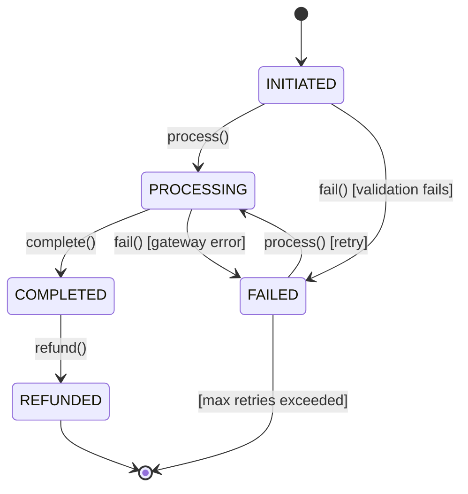
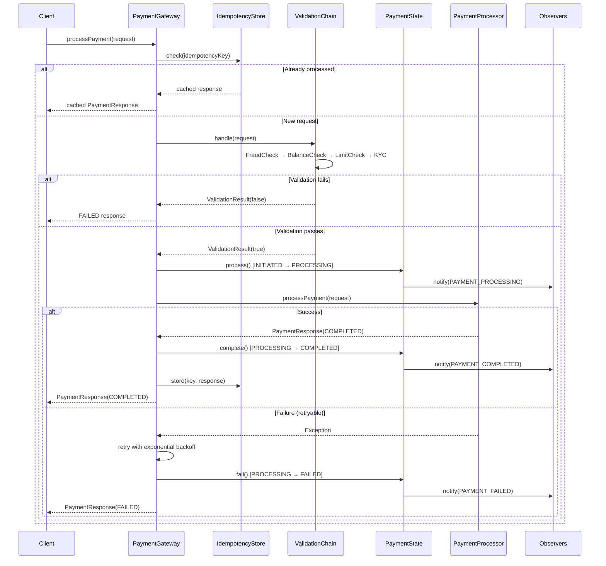

# Payment Processing System - Low-Level Design

## 1. Problem Statement

Design a payment processing system that supports multiple payment methods (credit card, debit card, UPI, wallet, net banking), handles payment lifecycle with proper state transitions, validates transactions through a chain of checks (fraud, balance, limit, KYC), ensures idempotency to prevent double charging, supports retry with exponential backoff, and provides refund workflows with observer-based notifications and audit logging.

---

## 2. UML Class Diagram

```mermaid
classDiagram
    class Payment {
        -String paymentId
        -String orderId
        -BigDecimal amount
        -Currency currency
        -PaymentMethod method
        -PaymentStatus status
        -String idempotencyKey
        -LocalDateTime createdAt
        -LocalDateTime updatedAt
        -List~Transaction~ transactions
    }

    class PaymentProcessor {
        <<interface>>
        +processPayment(PaymentRequest): PaymentResponse
        +refund(String paymentId, BigDecimal amount): PaymentResponse
        +supports(PaymentMethod): boolean
    }

    class PaymentState {
        <<interface>>
        +process(PaymentContext): void
        +fail(PaymentContext, String reason): void
        +complete(PaymentContext): void
        +refund(PaymentContext): void
    }

    class ValidationHandler {
        <<abstract>>
        #ValidationHandler next
        +setNext(ValidationHandler): ValidationHandler
        +handle(PaymentRequest): ValidationResult
        #validate(PaymentRequest): ValidationResult
    }

    class PaymentGateway {
        -Map~PaymentMethod, PaymentProcessor~ processors
        -ValidationHandler validationChain
        -IdempotencyStore idempotencyStore
        -List~PaymentObserver~ observers
        +processPayment(PaymentRequest): PaymentResponse
        +refundPayment(String, BigDecimal): PaymentResponse
    }

    class PaymentObserver {
        <<interface>>
        +onPaymentEvent(PaymentEvent): void
    }

    PaymentGateway --> PaymentProcessor
    PaymentGateway --> ValidationHandler
    PaymentGateway --> PaymentObserver
    Payment --> PaymentState
    Payment --> PaymentStatus
    ValidationHandler <|-- FraudCheckHandler
    ValidationHandler <|-- BalanceCheckHandler
    ValidationHandler <|-- LimitCheckHandler
    ValidationHandler <|-- KYCCheckHandler
    PaymentProcessor <|.. CreditCardProcessor
    PaymentProcessor <|.. DebitCardProcessor
    PaymentProcessor <|.. UPIProcessor
    PaymentProcessor <|.. WalletProcessor
    PaymentProcessor <|.. NetBankingProcessor
    PaymentState <|.. InitiatedState
    PaymentState <|.. ProcessingState
    PaymentState <|.. CompletedState
    PaymentState <|.. FailedState
    PaymentState <|.. RefundedState
    PaymentObserver <|.. NotificationObserver
    PaymentObserver <|.. AuditLogObserver
```



---

## 3. Design Patterns

| Pattern | Usage |
|---------|-------|
| **Strategy** | Different payment processors (credit card, UPI, wallet, etc.) |
| **State** | Payment lifecycle transitions (initiated → processing → completed/failed → refunded) |
| **Chain of Responsibility** | Validation pipeline (fraud, balance, limit, KYC) |
| **Observer** | Notifications and audit logging on payment events |
| **Factory** | Creating appropriate processor based on payment method |

---

## 4. SOLID Principles Applied

- **S** - Each class has a single responsibility (processor processes, validator validates, observer observes)
- **O** - New payment methods added without modifying existing code (new Strategy impl)
- **L** - All PaymentProcessor implementations are substitutable
- **I** - Small interfaces (PaymentProcessor, PaymentState, PaymentObserver)
- **D** - PaymentGateway depends on abstractions, not concrete processors

---

## 5. Complete Java Implementation

### Enums

```java
public enum PaymentStatus {
    INITIATED, PROCESSING, COMPLETED, FAILED, REFUNDED
}

public enum PaymentMethod {
    CREDIT_CARD, DEBIT_CARD, UPI, WALLET, NET_BANKING
}

public enum Currency {
    INR, USD, EUR, GBP
}

public enum PaymentEventType {
    PAYMENT_INITIATED, PAYMENT_PROCESSING, PAYMENT_COMPLETED,
    PAYMENT_FAILED, REFUND_INITIATED, REFUND_COMPLETED
}
```

### Models

```java
import java.math.BigDecimal;
import java.time.LocalDateTime;
import java.util.*;

public record PaymentRequest(
    String orderId,
    BigDecimal amount,
    Currency currency,
    PaymentMethod method,
    String customerId,
    String idempotencyKey,
    Map<String, String> metadata
) {}

public record PaymentResponse(
    String paymentId,
    PaymentStatus status,
    String message,
    String transactionId,
    LocalDateTime timestamp
) {}

public record Transaction(
    String transactionId,
    String paymentId,
    BigDecimal amount,
    String type, // DEBIT, CREDIT, REFUND
    PaymentStatus status,
    LocalDateTime timestamp,
    String gatewayReference
) {}

public class Payment {
    private String paymentId;
    private String orderId;
    private BigDecimal amount;
    private Currency currency;
    private PaymentMethod method;
    private PaymentStatus status;
    private String customerId;
    private String idempotencyKey;
    private LocalDateTime createdAt;
    private LocalDateTime updatedAt;
    private List<Transaction> transactions;
    private PaymentState currentState;
    private String failureReason;
    private int retryCount;

    public Payment(PaymentRequest request) {
        this.paymentId = UUID.randomUUID().toString();
        this.orderId = request.orderId();
        this.amount = request.amount();
        this.currency = request.currency();
        this.method = request.method();
        this.customerId = request.customerId();
        this.idempotencyKey = request.idempotencyKey();
        this.status = PaymentStatus.INITIATED;
        this.createdAt = LocalDateTime.now();
        this.updatedAt = LocalDateTime.now();
        this.transactions = new ArrayList<>();
        this.currentState = new InitiatedState();
        this.retryCount = 0;
    }

    // Getters and setters
    public String getPaymentId() { return paymentId; }
    public String getOrderId() { return orderId; }
    public BigDecimal getAmount() { return amount; }
    public Currency getCurrency() { return currency; }
    public PaymentMethod getMethod() { return method; }
    public PaymentStatus getStatus() { return status; }
    public String getCustomerId() { return customerId; }
    public String getIdempotencyKey() { return idempotencyKey; }
    public List<Transaction> getTransactions() { return transactions; }
    public PaymentState getCurrentState() { return currentState; }
    public int getRetryCount() { return retryCount; }
    public String getFailureReason() { return failureReason; }

    public void setStatus(PaymentStatus status) {
        this.status = status;
        this.updatedAt = LocalDateTime.now();
    }

    public void setCurrentState(PaymentState state) { this.currentState = state; }
    public void setFailureReason(String reason) { this.failureReason = reason; }
    public void incrementRetryCount() { this.retryCount++; }

    public void addTransaction(Transaction txn) { this.transactions.add(txn); }
}
```

### Strategy Pattern - Payment Processors

```java
public interface PaymentProcessor {
    PaymentResponse processPayment(PaymentRequest request, Payment payment);
    PaymentResponse refund(Payment payment, BigDecimal amount);
    boolean supports(PaymentMethod method);
}

public class CreditCardProcessor implements PaymentProcessor {

    @Override
    public PaymentResponse processPayment(PaymentRequest request, Payment payment) {
        // Simulate credit card gateway interaction
        String gatewayRef = "CC-" + UUID.randomUUID().toString().substring(0, 8);
        Transaction txn = new Transaction(
            UUID.randomUUID().toString(),
            payment.getPaymentId(),
            request.amount(),
            "DEBIT",
            PaymentStatus.COMPLETED,
            LocalDateTime.now(),
            gatewayRef
        );
        payment.addTransaction(txn);

        return new PaymentResponse(
            payment.getPaymentId(),
            PaymentStatus.COMPLETED,
            "Credit card payment successful",
            txn.transactionId(),
            LocalDateTime.now()
        );
    }

    @Override
    public PaymentResponse refund(Payment payment, BigDecimal amount) {
        String gatewayRef = "CC-REF-" + UUID.randomUUID().toString().substring(0, 8);
        Transaction txn = new Transaction(
            UUID.randomUUID().toString(),
            payment.getPaymentId(),
            amount,
            "REFUND",
            PaymentStatus.REFUNDED,
            LocalDateTime.now(),
            gatewayRef
        );
        payment.addTransaction(txn);

        return new PaymentResponse(
            payment.getPaymentId(),
            PaymentStatus.REFUNDED,
            "Credit card refund processed",
            txn.transactionId(),
            LocalDateTime.now()
        );
    }

    @Override
    public boolean supports(PaymentMethod method) {
        return method == PaymentMethod.CREDIT_CARD;
    }
}

public class DebitCardProcessor implements PaymentProcessor {

    @Override
    public PaymentResponse processPayment(PaymentRequest request, Payment payment) {
        String gatewayRef = "DC-" + UUID.randomUUID().toString().substring(0, 8);
        Transaction txn = new Transaction(
            UUID.randomUUID().toString(),
            payment.getPaymentId(),
            request.amount(),
            "DEBIT",
            PaymentStatus.COMPLETED,
            LocalDateTime.now(),
            gatewayRef
        );
        payment.addTransaction(txn);

        return new PaymentResponse(
            payment.getPaymentId(),
            PaymentStatus.COMPLETED,
            "Debit card payment successful",
            txn.transactionId(),
            LocalDateTime.now()
        );
    }

    @Override
    public PaymentResponse refund(Payment payment, BigDecimal amount) {
        Transaction txn = new Transaction(
            UUID.randomUUID().toString(),
            payment.getPaymentId(),
            amount,
            "REFUND",
            PaymentStatus.REFUNDED,
            LocalDateTime.now(),
            "DC-REF-" + UUID.randomUUID().toString().substring(0, 8)
        );
        payment.addTransaction(txn);

        return new PaymentResponse(
            payment.getPaymentId(), PaymentStatus.REFUNDED,
            "Debit card refund processed", txn.transactionId(), LocalDateTime.now()
        );
    }

    @Override
    public boolean supports(PaymentMethod method) {
        return method == PaymentMethod.DEBIT_CARD;
    }
}

public class UPIProcessor implements PaymentProcessor {

    @Override
    public PaymentResponse processPayment(PaymentRequest request, Payment payment) {
        String gatewayRef = "UPI-" + UUID.randomUUID().toString().substring(0, 8);
        Transaction txn = new Transaction(
            UUID.randomUUID().toString(),
            payment.getPaymentId(),
            request.amount(),
            "DEBIT",
            PaymentStatus.COMPLETED,
            LocalDateTime.now(),
            gatewayRef
        );
        payment.addTransaction(txn);

        return new PaymentResponse(
            payment.getPaymentId(), PaymentStatus.COMPLETED,
            "UPI payment successful", txn.transactionId(), LocalDateTime.now()
        );
    }

    @Override
    public PaymentResponse refund(Payment payment, BigDecimal amount) {
        Transaction txn = new Transaction(
            UUID.randomUUID().toString(),
            payment.getPaymentId(),
            amount,
            "REFUND",
            PaymentStatus.REFUNDED,
            LocalDateTime.now(),
            "UPI-REF-" + UUID.randomUUID().toString().substring(0, 8)
        );
        payment.addTransaction(txn);

        return new PaymentResponse(
            payment.getPaymentId(), PaymentStatus.REFUNDED,
            "UPI refund processed", txn.transactionId(), LocalDateTime.now()
        );
    }

    @Override
    public boolean supports(PaymentMethod method) {
        return method == PaymentMethod.UPI;
    }
}

public class WalletProcessor implements PaymentProcessor {

    @Override
    public PaymentResponse processPayment(PaymentRequest request, Payment payment) {
        String gatewayRef = "WAL-" + UUID.randomUUID().toString().substring(0, 8);
        Transaction txn = new Transaction(
            UUID.randomUUID().toString(),
            payment.getPaymentId(),
            request.amount(),
            "DEBIT",
            PaymentStatus.COMPLETED,
            LocalDateTime.now(),
            gatewayRef
        );
        payment.addTransaction(txn);

        return new PaymentResponse(
            payment.getPaymentId(), PaymentStatus.COMPLETED,
            "Wallet payment successful", txn.transactionId(), LocalDateTime.now()
        );
    }

    @Override
    public PaymentResponse refund(Payment payment, BigDecimal amount) {
        Transaction txn = new Transaction(
            UUID.randomUUID().toString(),
            payment.getPaymentId(),
            amount,
            "REFUND",
            PaymentStatus.REFUNDED,
            LocalDateTime.now(),
            "WAL-REF-" + UUID.randomUUID().toString().substring(0, 8)
        );
        payment.addTransaction(txn);

        return new PaymentResponse(
            payment.getPaymentId(), PaymentStatus.REFUNDED,
            "Wallet refund processed", txn.transactionId(), LocalDateTime.now()
        );
    }

    @Override
    public boolean supports(PaymentMethod method) {
        return method == PaymentMethod.WALLET;
    }
}

public class NetBankingProcessor implements PaymentProcessor {

    @Override
    public PaymentResponse processPayment(PaymentRequest request, Payment payment) {
        String gatewayRef = "NB-" + UUID.randomUUID().toString().substring(0, 8);
        Transaction txn = new Transaction(
            UUID.randomUUID().toString(),
            payment.getPaymentId(),
            request.amount(),
            "DEBIT",
            PaymentStatus.COMPLETED,
            LocalDateTime.now(),
            gatewayRef
        );
        payment.addTransaction(txn);

        return new PaymentResponse(
            payment.getPaymentId(), PaymentStatus.COMPLETED,
            "Net banking payment successful", txn.transactionId(), LocalDateTime.now()
        );
    }

    @Override
    public PaymentResponse refund(Payment payment, BigDecimal amount) {
        Transaction txn = new Transaction(
            UUID.randomUUID().toString(),
            payment.getPaymentId(),
            amount,
            "REFUND",
            PaymentStatus.REFUNDED,
            LocalDateTime.now(),
            "NB-REF-" + UUID.randomUUID().toString().substring(0, 8)
        );
        payment.addTransaction(txn);

        return new PaymentResponse(
            payment.getPaymentId(), PaymentStatus.REFUNDED,
            "Net banking refund processed", txn.transactionId(), LocalDateTime.now()
        );
    }

    @Override
    public boolean supports(PaymentMethod method) {
        return method == PaymentMethod.NET_BANKING;
    }
}
```

### State Pattern - Payment Lifecycle

```java
public interface PaymentState {
    void process(PaymentContext context);
    void complete(PaymentContext context);
    void fail(PaymentContext context, String reason);
    void refund(PaymentContext context);
}

public class PaymentContext {
    private Payment payment;
    private List<PaymentObserver> observers;

    public PaymentContext(Payment payment, List<PaymentObserver> observers) {
        this.payment = payment;
        this.observers = observers;
    }

    public Payment getPayment() { return payment; }

    public void setState(PaymentState state) {
        payment.setCurrentState(state);
    }

    public void notifyObservers(PaymentEventType eventType, String message) {
        PaymentEvent event = new PaymentEvent(
            payment.getPaymentId(), eventType, message, LocalDateTime.now()
        );
        observers.forEach(obs -> obs.onPaymentEvent(event));
    }
}

public class InitiatedState implements PaymentState {

    @Override
    public void process(PaymentContext context) {
        context.getPayment().setStatus(PaymentStatus.PROCESSING);
        context.setState(new ProcessingState());
        context.notifyObservers(PaymentEventType.PAYMENT_PROCESSING,
            "Payment " + context.getPayment().getPaymentId() + " is now processing");
    }

    @Override
    public void complete(PaymentContext context) {
        throw new IllegalStateException("Cannot complete payment directly from INITIATED state");
    }

    @Override
    public void fail(PaymentContext context, String reason) {
        context.getPayment().setStatus(PaymentStatus.FAILED);
        context.getPayment().setFailureReason(reason);
        context.setState(new FailedState());
        context.notifyObservers(PaymentEventType.PAYMENT_FAILED,
            "Payment failed: " + reason);
    }

    @Override
    public void refund(PaymentContext context) {
        throw new IllegalStateException("Cannot refund from INITIATED state");
    }
}

public class ProcessingState implements PaymentState {

    @Override
    public void process(PaymentContext context) {
        throw new IllegalStateException("Payment is already processing");
    }

    @Override
    public void complete(PaymentContext context) {
        context.getPayment().setStatus(PaymentStatus.COMPLETED);
        context.setState(new CompletedState());
        context.notifyObservers(PaymentEventType.PAYMENT_COMPLETED,
            "Payment " + context.getPayment().getPaymentId() + " completed successfully");
    }

    @Override
    public void fail(PaymentContext context, String reason) {
        context.getPayment().setStatus(PaymentStatus.FAILED);
        context.getPayment().setFailureReason(reason);
        context.setState(new FailedState());
        context.notifyObservers(PaymentEventType.PAYMENT_FAILED,
            "Payment failed during processing: " + reason);
    }

    @Override
    public void refund(PaymentContext context) {
        throw new IllegalStateException("Cannot refund while still processing");
    }
}

public class CompletedState implements PaymentState {

    @Override
    public void process(PaymentContext context) {
        throw new IllegalStateException("Payment already completed");
    }

    @Override
    public void complete(PaymentContext context) {
        throw new IllegalStateException("Payment already completed");
    }

    @Override
    public void fail(PaymentContext context, String reason) {
        throw new IllegalStateException("Cannot fail a completed payment");
    }

    @Override
    public void refund(PaymentContext context) {
        context.getPayment().setStatus(PaymentStatus.REFUNDED);
        context.setState(new RefundedState());
        context.notifyObservers(PaymentEventType.REFUND_COMPLETED,
            "Payment " + context.getPayment().getPaymentId() + " refunded");
    }
}

public class FailedState implements PaymentState {

    @Override
    public void process(PaymentContext context) {
        // Allow retry from failed state
        context.getPayment().setStatus(PaymentStatus.PROCESSING);
        context.getPayment().incrementRetryCount();
        context.setState(new ProcessingState());
        context.notifyObservers(PaymentEventType.PAYMENT_PROCESSING,
            "Retrying payment " + context.getPayment().getPaymentId());
    }

    @Override
    public void complete(PaymentContext context) {
        throw new IllegalStateException("Cannot complete a failed payment without retrying");
    }

    @Override
    public void fail(PaymentContext context, String reason) {
        context.getPayment().setFailureReason(reason);
    }

    @Override
    public void refund(PaymentContext context) {
        throw new IllegalStateException("Cannot refund a failed payment");
    }
}

public class RefundedState implements PaymentState {

    @Override
    public void process(PaymentContext context) {
        throw new IllegalStateException("Cannot process a refunded payment");
    }

    @Override
    public void complete(PaymentContext context) {
        throw new IllegalStateException("Cannot complete a refunded payment");
    }

    @Override
    public void fail(PaymentContext context, String reason) {
        throw new IllegalStateException("Cannot fail a refunded payment");
    }

    @Override
    public void refund(PaymentContext context) {
        throw new IllegalStateException("Payment already refunded");
    }
}
```

### Chain of Responsibility - Validators

```java
public record ValidationResult(boolean valid, String message) {
    public static ValidationResult success() {
        return new ValidationResult(true, "Validation passed");
    }

    public static ValidationResult failure(String message) {
        return new ValidationResult(false, message);
    }
}

public abstract class ValidationHandler {
    protected ValidationHandler next;

    public ValidationHandler setNext(ValidationHandler next) {
        this.next = next;
        return next;
    }

    public ValidationResult handle(PaymentRequest request) {
        ValidationResult result = validate(request);
        if (!result.valid()) {
            return result;
        }
        if (next != null) {
            return next.handle(request);
        }
        return ValidationResult.success();
    }

    protected abstract ValidationResult validate(PaymentRequest request);
}

public class FraudCheckHandler extends ValidationHandler {
    private static final Set<String> BLOCKED_CUSTOMERS = Set.of("BLOCKED_001", "BLOCKED_002");
    private static final BigDecimal SUSPICIOUS_AMOUNT = new BigDecimal("500000");

    @Override
    protected ValidationResult validate(PaymentRequest request) {
        if (BLOCKED_CUSTOMERS.contains(request.customerId())) {
            return ValidationResult.failure("Customer flagged for fraud");
        }
        if (request.amount().compareTo(SUSPICIOUS_AMOUNT) > 0) {
            return ValidationResult.failure("Amount exceeds fraud threshold, manual review required");
        }
        return ValidationResult.success();
    }
}

public class BalanceCheckHandler extends ValidationHandler {
    private final Map<String, BigDecimal> customerBalances;

    public BalanceCheckHandler(Map<String, BigDecimal> customerBalances) {
        this.customerBalances = customerBalances;
    }

    @Override
    protected ValidationResult validate(PaymentRequest request) {
        BigDecimal balance = customerBalances.getOrDefault(request.customerId(), BigDecimal.ZERO);
        if (balance.compareTo(request.amount()) < 0) {
            return ValidationResult.failure("Insufficient balance");
        }
        return ValidationResult.success();
    }
}

public class LimitCheckHandler extends ValidationHandler {
    private static final BigDecimal DAILY_LIMIT = new BigDecimal("200000");
    private final Map<String, BigDecimal> dailySpend; // customerId -> today's total

    public LimitCheckHandler(Map<String, BigDecimal> dailySpend) {
        this.dailySpend = dailySpend;
    }

    @Override
    protected ValidationResult validate(PaymentRequest request) {
        BigDecimal spent = dailySpend.getOrDefault(request.customerId(), BigDecimal.ZERO);
        if (spent.add(request.amount()).compareTo(DAILY_LIMIT) > 0) {
            return ValidationResult.failure("Daily transaction limit exceeded");
        }
        return ValidationResult.success();
    }
}

public class KYCCheckHandler extends ValidationHandler {
    private final Set<String> verifiedCustomers;

    public KYCCheckHandler(Set<String> verifiedCustomers) {
        this.verifiedCustomers = verifiedCustomers;
    }

    @Override
    protected ValidationResult validate(PaymentRequest request) {
        if (!verifiedCustomers.contains(request.customerId())) {
            return ValidationResult.failure("KYC verification pending");
        }
        return ValidationResult.success();
    }
}
```

### Observer Pattern - Notifications & Audit

```java
public record PaymentEvent(
    String paymentId,
    PaymentEventType eventType,
    String message,
    LocalDateTime timestamp
) {}

public interface PaymentObserver {
    void onPaymentEvent(PaymentEvent event);
}

public class NotificationObserver implements PaymentObserver {

    @Override
    public void onPaymentEvent(PaymentEvent event) {
        switch (event.eventType()) {
            case PAYMENT_COMPLETED -> sendNotification(
                "Payment Successful", "Your payment " + event.paymentId() + " was successful");
            case PAYMENT_FAILED -> sendNotification(
                "Payment Failed", "Your payment " + event.paymentId() + " failed: " + event.message());
            case REFUND_COMPLETED -> sendNotification(
                "Refund Processed", "Refund for payment " + event.paymentId() + " has been processed");
            default -> {} // No notification for intermediate states
        }
    }

    private void sendNotification(String title, String body) {
        System.out.println("[NOTIFICATION] " + title + ": " + body);
    }
}

public class AuditLogObserver implements PaymentObserver {
    private final List<PaymentEvent> auditLog = Collections.synchronizedList(new ArrayList<>());

    @Override
    public void onPaymentEvent(PaymentEvent event) {
        auditLog.add(event);
        System.out.printf("[AUDIT] %s | %s | %s | %s%n",
            event.timestamp(), event.paymentId(), event.eventType(), event.message());
    }

    public List<PaymentEvent> getAuditLog() {
        return Collections.unmodifiableList(auditLog);
    }
}
```

### Idempotency Store

```java
public class IdempotencyStore {
    private final ConcurrentHashMap<String, PaymentResponse> store = new ConcurrentHashMap<>();

    public Optional<PaymentResponse> get(String idempotencyKey) {
        return Optional.ofNullable(store.get(idempotencyKey));
    }

    public void put(String idempotencyKey, PaymentResponse response) {
        store.put(idempotencyKey, response);
    }

    public boolean exists(String idempotencyKey) {
        return store.containsKey(idempotencyKey);
    }
}
```

### Retry Mechanism

```java
public class RetryPolicy {
    private final int maxRetries;
    private final long baseDelayMs;
    private final double multiplier;

    public RetryPolicy(int maxRetries, long baseDelayMs, double multiplier) {
        this.maxRetries = maxRetries;
        this.baseDelayMs = baseDelayMs;
        this.multiplier = multiplier;
    }

    public <T> T executeWithRetry(Supplier<T> operation, Predicate<Exception> retryable) {
        int attempt = 0;
        Exception lastException = null;

        while (attempt < maxRetries) {
            try {
                return operation.get();
            } catch (Exception e) {
                lastException = e;
                if (!retryable.test(e) || attempt >= maxRetries - 1) {
                    break;
                }
                long delay = (long) (baseDelayMs * Math.pow(multiplier, attempt));
                // Add jitter to prevent thundering herd
                delay += ThreadLocalRandom.current().nextLong(0, delay / 2);
                try {
                    Thread.sleep(delay);
                } catch (InterruptedException ie) {
                    Thread.currentThread().interrupt();
                    throw new RuntimeException("Retry interrupted", ie);
                }
                attempt++;
            }
        }
        throw new RuntimeException("All retries exhausted", lastException);
    }

    public static RetryPolicy defaultPolicy() {
        return new RetryPolicy(3, 1000, 2.0);
    }
}
```

### Payment Gateway - Orchestrator

```java
import java.util.concurrent.ConcurrentHashMap;

public class PaymentGateway {
    private final Map<PaymentMethod, PaymentProcessor> processors;
    private final ValidationHandler validationChain;
    private final IdempotencyStore idempotencyStore;
    private final List<PaymentObserver> observers;
    private final RetryPolicy retryPolicy;
    private final ConcurrentHashMap<String, Payment> paymentStore;

    public PaymentGateway(
            List<PaymentProcessor> processorList,
            ValidationHandler validationChain,
            IdempotencyStore idempotencyStore,
            List<PaymentObserver> observers,
            RetryPolicy retryPolicy) {
        this.processors = new EnumMap<>(PaymentMethod.class);
        processorList.forEach(p -> {
            for (PaymentMethod method : PaymentMethod.values()) {
                if (p.supports(method)) processors.put(method, p);
            }
        });
        this.validationChain = validationChain;
        this.idempotencyStore = idempotencyStore;
        this.observers = observers;
        this.retryPolicy = retryPolicy;
        this.paymentStore = new ConcurrentHashMap<>();
    }

    public PaymentResponse processPayment(PaymentRequest request) {
        // 1. Idempotency check
        if (request.idempotencyKey() != null) {
            Optional<PaymentResponse> cached = idempotencyStore.get(request.idempotencyKey());
            if (cached.isPresent()) {
                System.out.println("[IDEMPOTENCY] Returning cached response for key: " + request.idempotencyKey());
                return cached.get();
            }
        }

        // 2. Validation chain
        ValidationResult validationResult = validationChain.handle(request);
        if (!validationResult.valid()) {
            PaymentResponse failResponse = new PaymentResponse(
                null, PaymentStatus.FAILED, validationResult.message(), null, LocalDateTime.now()
            );
            return failResponse;
        }

        // 3. Create payment and context
        Payment payment = new Payment(request);
        PaymentContext context = new PaymentContext(payment, observers);
        paymentStore.put(payment.getPaymentId(), payment);

        // 4. Transition to PROCESSING
        payment.getCurrentState().process(context);

        // 5. Get appropriate processor
        PaymentProcessor processor = processors.get(request.method());
        if (processor == null) {
            payment.getCurrentState().fail(context, "Unsupported payment method: " + request.method());
            return new PaymentResponse(
                payment.getPaymentId(), PaymentStatus.FAILED,
                "Unsupported payment method", null, LocalDateTime.now()
            );
        }

        // 6. Process with retry
        try {
            PaymentResponse response = retryPolicy.executeWithRetry(
                () -> processor.processPayment(request, payment),
                e -> e instanceof RuntimeException // Retry on transient failures
            );

            // 7. Complete state
            payment.getCurrentState().complete(context);

            // 8. Store for idempotency
            if (request.idempotencyKey() != null) {
                idempotencyStore.put(request.idempotencyKey(), response);
            }

            return response;
        } catch (Exception e) {
            payment.getCurrentState().fail(context, e.getMessage());
            return new PaymentResponse(
                payment.getPaymentId(), PaymentStatus.FAILED,
                "Payment processing failed: " + e.getMessage(), null, LocalDateTime.now()
            );
        }
    }

    public PaymentResponse refundPayment(String paymentId, BigDecimal amount) {
        Payment payment = paymentStore.get(paymentId);
        if (payment == null) {
            return new PaymentResponse(null, PaymentStatus.FAILED,
                "Payment not found", null, LocalDateTime.now());
        }

        PaymentContext context = new PaymentContext(payment, observers);

        // Validate refund is allowed (only COMPLETED payments)
        if (payment.getStatus() != PaymentStatus.COMPLETED) {
            return new PaymentResponse(paymentId, PaymentStatus.FAILED,
                "Cannot refund payment in " + payment.getStatus() + " state",
                null, LocalDateTime.now());
        }

        // Validate refund amount
        if (amount.compareTo(payment.getAmount()) > 0) {
            return new PaymentResponse(paymentId, PaymentStatus.FAILED,
                "Refund amount exceeds original payment", null, LocalDateTime.now());
        }

        PaymentProcessor processor = processors.get(payment.getMethod());
        PaymentResponse refundResponse = processor.refund(payment, amount);

        // Transition to REFUNDED
        payment.getCurrentState().refund(context);

        return refundResponse;
    }

    public Optional<Payment> getPayment(String paymentId) {
        return Optional.ofNullable(paymentStore.get(paymentId));
    }
}
```

### Demo / Main

```java
public class PaymentSystemDemo {
    public static void main(String[] args) {
        // Setup observers
        List<PaymentObserver> observers = List.of(
            new NotificationObserver(),
            new AuditLogObserver()
        );

        // Setup validation chain
        Map<String, BigDecimal> balances = Map.of("CUST_001", new BigDecimal("100000"));
        Map<String, BigDecimal> dailySpend = new HashMap<>();
        Set<String> kycVerified = Set.of("CUST_001", "CUST_002");

        FraudCheckHandler fraudCheck = new FraudCheckHandler();
        BalanceCheckHandler balanceCheck = new BalanceCheckHandler(balances);
        LimitCheckHandler limitCheck = new LimitCheckHandler(dailySpend);
        KYCCheckHandler kycCheck = new KYCCheckHandler(kycVerified);

        fraudCheck.setNext(balanceCheck).setNext(limitCheck).setNext(kycCheck);

        // Setup processors
        List<PaymentProcessor> processors = List.of(
            new CreditCardProcessor(),
            new DebitCardProcessor(),
            new UPIProcessor(),
            new WalletProcessor(),
            new NetBankingProcessor()
        );

        // Create gateway
        PaymentGateway gateway = new PaymentGateway(
            processors, fraudCheck, new IdempotencyStore(), observers, RetryPolicy.defaultPolicy()
        );

        // Process a payment
        PaymentRequest request = new PaymentRequest(
            "ORDER_123", new BigDecimal("5000"), Currency.INR,
            PaymentMethod.UPI, "CUST_001", "IDEM_KEY_001", Map.of()
        );

        System.out.println("=== Processing Payment ===");
        PaymentResponse response = gateway.processPayment(request);
        System.out.println("Response: " + response);

        // Test idempotency - same request again
        System.out.println("\n=== Idempotency Test (same key) ===");
        PaymentResponse duplicateResponse = gateway.processPayment(request);
        System.out.println("Duplicate Response: " + duplicateResponse);

        // Process refund
        System.out.println("\n=== Processing Refund ===");
        PaymentResponse refundResponse = gateway.refundPayment(
            response.paymentId(), new BigDecimal("5000"));
        System.out.println("Refund Response: " + refundResponse);

        // Test validation failure
        System.out.println("\n=== Fraud Check Failure ===");
        PaymentRequest blockedRequest = new PaymentRequest(
            "ORDER_456", new BigDecimal("1000"), Currency.INR,
            PaymentMethod.CREDIT_CARD, "BLOCKED_001", "IDEM_KEY_002", Map.of()
        );
        PaymentResponse blockedResponse = gateway.processPayment(blockedRequest);
        System.out.println("Blocked Response: " + blockedResponse);
    }
}
```

---

## 6. State Machine Diagram



---

## 7. Sequence Diagram



---

## 8. Key Interview Points

### Why These Patterns?

| Pattern | Benefit |
|---------|---------|
| Strategy | Add new payment methods without modifying gateway code |
| State | Enforce valid transitions; prevent illegal operations (e.g., refunding a failed payment) |
| Chain of Responsibility | Add/remove/reorder validations independently |
| Observer | Decouple notifications/audit from core flow |

### Idempotency

- Client sends `idempotencyKey` with every request
- Gateway checks store before processing
- Prevents double charges on network retries or client retries
- Real systems use TTL (e.g., 24 hours) to expire keys

### Retry with Exponential Backoff

- Delay: `baseDelay * multiplier^attempt + jitter`
- Jitter prevents thundering herd on gateway recovery
- Only retry transient failures (timeout, 5xx), not business errors (insufficient funds)

### Concurrency Considerations

- `ConcurrentHashMap` for payment store and idempotency
- State transitions should be synchronized per payment (in production, use distributed locks)
- Consider optimistic locking with version field for DB-backed stores

### Production Enhancements

- **Distributed idempotency**: Redis with TTL
- **Event sourcing**: Store all state transitions as events
- **Saga pattern**: For multi-step payments (authorize → capture)
- **Circuit breaker**: Around external gateway calls
- **Dead letter queue**: For failed notifications
- **Webhooks**: Async status updates to merchants
- **PCI DSS compliance**: Tokenize card data, never store raw PAN

### Common Interview Questions

1. **How do you handle partial refunds?** — Track refunded amount, allow multiple refunds up to original amount
2. **How to handle timeout from payment gateway?** — Mark as UNKNOWN, reconcile via webhook/polling
3. **How to scale?** — Stateless gateway + distributed store (Redis) + async processing (Kafka)
4. **How to ensure exactly-once processing?** — Idempotency key + transactional outbox pattern
5. **Two-phase payments?** — Authorize (hold funds) → Capture (settle) with separate states

### Time/Space Complexity

| Operation | Time | Space |
|-----------|------|-------|
| Process payment | O(V) where V = validators in chain | O(1) per payment |
| Idempotency check | O(1) HashMap lookup | O(N) stored responses |
| Retry | O(R) where R = max retries | O(1) |
| Observer notification | O(O) where O = observer count | O(E) audit events |
