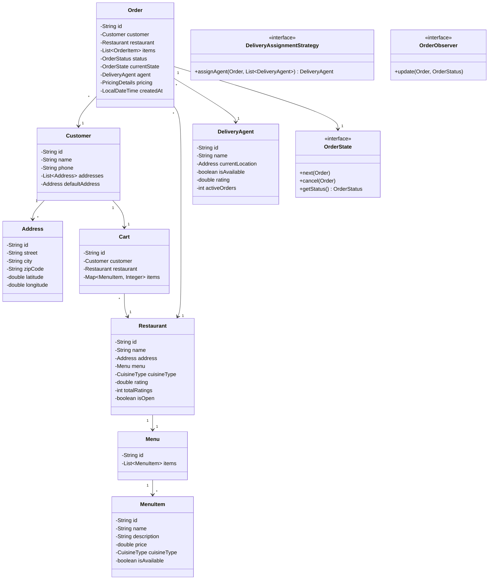
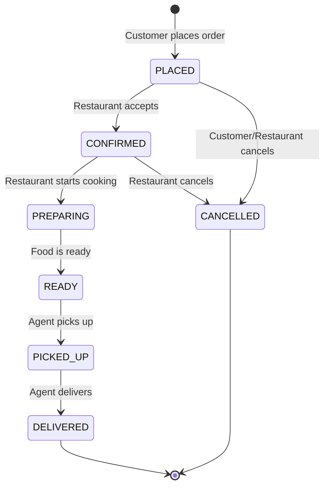

# Food Ordering System (Swiggy/Zomato) - Low-Level Design

## 1. Problem Statement

Design a food ordering system like Swiggy/Zomato that allows customers to browse restaurants, add items to cart, place orders, track delivery, and rate their experience. The system should handle order lifecycle management, delivery agent assignment, pricing calculations, and real-time notifications.

### Core Requirements
- Restaurant and menu management
- Search with filters (cuisine, rating, distance, price)
- Cart management and order placement
- Order lifecycle with state transitions
- Delivery agent assignment strategies
- Real-time notifications to customers and restaurants
- Pricing: base price + delivery fee + taxes + discounts
- Rating system for restaurants and delivery agents
- ETA calculation

---

## 2. UML Class Diagram



---

## 3. State Diagram - Order Lifecycle



---

## 4. Design Patterns Used

| Pattern | Usage |
|---------|-------|
| **State** | Order lifecycle transitions (PlacedState, ConfirmedState, etc.) |
| **Strategy** | Delivery agent assignment (Nearest, LeastBusy, HighestRated) |
| **Observer** | Notifications to customer, restaurant, agent on status change |
| **Builder** | Order and PricingDetails construction |
| **Singleton** | FoodOrderingService, RestaurantSearchService |

---

## 5. SOLID Principles Applied

| Principle | Application |
|-----------|-------------|
| **SRP** | Each class has one responsibility — Cart manages items, Order manages lifecycle |
| **OCP** | New delivery strategies or order states can be added without modifying existing code |
| **LSP** | All OrderState implementations are interchangeable |
| **ISP** | OrderObserver is a focused interface; strategies are separate interfaces |
| **DIP** | Order depends on OrderState interface, not concrete states; service depends on Strategy interface |

---

## 6. Complete Java Implementation

### 6.1 Enums

```java
public enum OrderStatus {
    PLACED, CONFIRMED, PREPARING, READY, PICKED_UP, DELIVERED, CANCELLED
}

public enum CuisineType {
    INDIAN, CHINESE, ITALIAN, MEXICAN, JAPANESE, THAI, AMERICAN, CONTINENTAL
}

public enum PaymentMethod {
    CREDIT_CARD, DEBIT_CARD, UPI, WALLET, CASH_ON_DELIVERY
}
```

### 6.2 Models

```java
import java.util.*;
import java.time.LocalDateTime;

public record Address(
    String id,
    String street,
    String city,
    String zipCode,
    double latitude,
    double longitude
) {
    public double distanceTo(Address other) {
        // Haversine formula simplified
        double latDiff = Math.toRadians(other.latitude - this.latitude);
        double lonDiff = Math.toRadians(other.longitude - this.longitude);
        double a = Math.sin(latDiff / 2) * Math.sin(latDiff / 2)
                 + Math.cos(Math.toRadians(this.latitude))
                 * Math.cos(Math.toRadians(other.latitude))
                 * Math.sin(lonDiff / 2) * Math.sin(lonDiff / 2);
        double c = 2 * Math.atan2(Math.sqrt(a), Math.sqrt(1 - a));
        return 6371 * c; // km
    }
}

public class Customer {
    private final String id;
    private String name;
    private String phone;
    private String email;
    private List<Address> addresses;
    private Address defaultAddress;

    public Customer(String id, String name, String phone, String email) {
        this.id = id;
        this.name = name;
        this.phone = phone;
        this.email = email;
        this.addresses = new ArrayList<>();
    }

    public void addAddress(Address address) {
        addresses.add(address);
        if (defaultAddress == null) defaultAddress = address;
    }

    // Getters
    public String getId() { return id; }
    public String getName() { return name; }
    public String getPhone() { return phone; }
    public Address getDefaultAddress() { return defaultAddress; }
    public List<Address> getAddresses() { return Collections.unmodifiableList(addresses); }
}

public class MenuItem {
    private final String id;
    private String name;
    private String description;
    private double price;
    private CuisineType cuisineType;
    private boolean isVegetarian;
    private boolean isAvailable;

    public MenuItem(String id, String name, String description, double price,
                    CuisineType cuisineType, boolean isVegetarian) {
        this.id = id;
        this.name = name;
        this.description = description;
        this.price = price;
        this.cuisineType = cuisineType;
        this.isVegetarian = isVegetarian;
        this.isAvailable = true;
    }

    public String getId() { return id; }
    public String getName() { return name; }
    public double getPrice() { return price; }
    public CuisineType getCuisineType() { return cuisineType; }
    public boolean isAvailable() { return isAvailable; }
    public boolean isVegetarian() { return isVegetarian; }
    public void setAvailable(boolean available) { this.isAvailable = available; }
}

public class Menu {
    private final String id;
    private final List<MenuItem> items;

    public Menu(String id) {
        this.id = id;
        this.items = new ArrayList<>();
    }

    public void addItem(MenuItem item) { items.add(item); }
    public void removeItem(String itemId) { items.removeIf(i -> i.getId().equals(itemId)); }
    public List<MenuItem> getAvailableItems() {
        return items.stream().filter(MenuItem::isAvailable).toList();
    }
    public List<MenuItem> getItems() { return Collections.unmodifiableList(items); }
}

public class Restaurant {
    private final String id;
    private String name;
    private Address address;
    private Menu menu;
    private CuisineType primaryCuisine;
    private double rating;
    private int totalRatings;
    private int ratingSum;
    private boolean isOpen;
    private double avgPriceForTwo;

    public Restaurant(String id, String name, Address address, CuisineType primaryCuisine, double avgPriceForTwo) {
        this.id = id;
        this.name = name;
        this.address = address;
        this.primaryCuisine = primaryCuisine;
        this.avgPriceForTwo = avgPriceForTwo;
        this.menu = new Menu(UUID.randomUUID().toString());
        this.rating = 0.0;
        this.totalRatings = 0;
        this.ratingSum = 0;
        this.isOpen = true;
    }

    public void addRating(int stars) {
        if (stars < 1 || stars > 5) throw new IllegalArgumentException("Rating must be 1-5");
        ratingSum += stars;
        totalRatings++;
        rating = (double) ratingSum / totalRatings;
    }

    // Getters
    public String getId() { return id; }
    public String getName() { return name; }
    public Address getAddress() { return address; }
    public Menu getMenu() { return menu; }
    public CuisineType getPrimaryCuisine() { return primaryCuisine; }
    public double getRating() { return rating; }
    public boolean isOpen() { return isOpen; }
    public double getAvgPriceForTwo() { return avgPriceForTwo; }
    public void setOpen(boolean open) { this.isOpen = open; }
}

public class DeliveryAgent {
    private final String id;
    private String name;
    private String phone;
    private Address currentLocation;
    private boolean isAvailable;
    private double rating;
    private int totalRatings;
    private int ratingSum;
    private int activeOrders;

    public DeliveryAgent(String id, String name, String phone, Address currentLocation) {
        this.id = id;
        this.name = name;
        this.phone = phone;
        this.currentLocation = currentLocation;
        this.isAvailable = true;
        this.rating = 0.0;
        this.activeOrders = 0;
    }

    public void addRating(int stars) {
        if (stars < 1 || stars > 5) throw new IllegalArgumentException("Rating must be 1-5");
        ratingSum += stars;
        totalRatings++;
        rating = (double) ratingSum / totalRatings;
    }

    public void assignOrder() { activeOrders++; isAvailable = activeOrders < 3; }
    public void completeOrder() { activeOrders--; isAvailable = true; }

    // Getters
    public String getId() { return id; }
    public String getName() { return name; }
    public Address getCurrentLocation() { return currentLocation; }
    public void setCurrentLocation(Address location) { this.currentLocation = location; }
    public boolean isAvailable() { return isAvailable; }
    public double getRating() { return rating; }
    public int getActiveOrders() { return activeOrders; }
}

public record OrderItem(MenuItem menuItem, int quantity) {
    public double getSubtotal() { return menuItem.getPrice() * quantity; }
}
```

### 6.3 Pricing (Builder Pattern)

```java
public class PricingDetails {
    private final double itemsTotal;
    private final double deliveryFee;
    private final double taxAmount;
    private final double discount;
    private final double totalAmount;

    private PricingDetails(Builder builder) {
        this.itemsTotal = builder.itemsTotal;
        this.deliveryFee = builder.deliveryFee;
        this.taxAmount = builder.taxAmount;
        this.discount = builder.discount;
        this.totalAmount = itemsTotal + deliveryFee + taxAmount - discount;
    }

    public double getItemsTotal() { return itemsTotal; }
    public double getDeliveryFee() { return deliveryFee; }
    public double getTaxAmount() { return taxAmount; }
    public double getDiscount() { return discount; }
    public double getTotalAmount() { return totalAmount; }

    @Override
    public String toString() {
        return String.format("Items: ₹%.2f | Delivery: ₹%.2f | Tax: ₹%.2f | Discount: -₹%.2f | Total: ₹%.2f",
                itemsTotal, deliveryFee, taxAmount, discount, totalAmount);
    }

    public static class Builder {
        private double itemsTotal;
        private double deliveryFee;
        private double taxAmount;
        private double discount;

        public Builder itemsTotal(double itemsTotal) { this.itemsTotal = itemsTotal; return this; }
        public Builder deliveryFee(double deliveryFee) { this.deliveryFee = deliveryFee; return this; }
        public Builder taxAmount(double taxAmount) { this.taxAmount = taxAmount; return this; }
        public Builder discount(double discount) { this.discount = discount; return this; }
        public PricingDetails build() { return new PricingDetails(this); }
    }
}

public class PricingCalculator {
    private static final double TAX_RATE = 0.05; // 5% GST
    private static final double BASE_DELIVERY_FEE = 30.0;
    private static final double PER_KM_CHARGE = 5.0;
    private static final double FREE_DELIVERY_THRESHOLD = 500.0;

    public PricingDetails calculate(List<OrderItem> items, double distanceKm, double discountPercent) {
        double itemsTotal = items.stream().mapToDouble(OrderItem::getSubtotal).sum();

        double deliveryFee = itemsTotal >= FREE_DELIVERY_THRESHOLD ? 0 :
                BASE_DELIVERY_FEE + (distanceKm * PER_KM_CHARGE);

        double taxAmount = itemsTotal * TAX_RATE;
        double discount = itemsTotal * (discountPercent / 100.0);

        return new PricingDetails.Builder()
                .itemsTotal(itemsTotal)
                .deliveryFee(deliveryFee)
                .taxAmount(taxAmount)
                .discount(discount)
                .build();
    }
}
```

### 6.4 Cart Management

```java
public class Cart {
    private final String id;
    private final Customer customer;
    private Restaurant restaurant;
    private final Map<MenuItem, Integer> items;

    public Cart(String id, Customer customer) {
        this.id = id;
        this.customer = customer;
        this.items = new LinkedHashMap<>();
    }

    public void addItem(MenuItem item, int quantity, Restaurant restaurant) {
        if (this.restaurant != null && !this.restaurant.getId().equals(restaurant.getId())) {
            throw new IllegalStateException("Cannot add items from different restaurants. Clear cart first.");
        }
        this.restaurant = restaurant;
        items.merge(item, quantity, Integer::sum);
    }

    public void removeItem(MenuItem item) {
        items.remove(item);
        if (items.isEmpty()) restaurant = null;
    }

    public void updateQuantity(MenuItem item, int quantity) {
        if (quantity <= 0) { removeItem(item); return; }
        if (!items.containsKey(item)) throw new IllegalArgumentException("Item not in cart");
        items.put(item, quantity);
    }

    public void clear() {
        items.clear();
        restaurant = null;
    }

    public List<OrderItem> getOrderItems() {
        return items.entrySet().stream()
                .map(e -> new OrderItem(e.getKey(), e.getValue()))
                .toList();
    }

    public double getTotal() {
        return items.entrySet().stream()
                .mapToDouble(e -> e.getKey().getPrice() * e.getValue())
                .sum();
    }

    public boolean isEmpty() { return items.isEmpty(); }
    public Restaurant getRestaurant() { return restaurant; }
    public Customer getCustomer() { return customer; }
    public Map<MenuItem, Integer> getItems() { return Collections.unmodifiableMap(items); }
}
```

### 6.5 Order State Pattern

```java
public interface OrderState {
    void next(Order order);
    void cancel(Order order);
    OrderStatus getStatus();
}

public class PlacedState implements OrderState {
    @Override
    public void next(Order order) {
        order.setState(new ConfirmedState());
    }

    @Override
    public void cancel(Order order) {
        order.setState(new CancelledState());
    }

    @Override
    public OrderStatus getStatus() { return OrderStatus.PLACED; }
}

public class ConfirmedState implements OrderState {
    @Override
    public void next(Order order) {
        order.setState(new PreparingState());
    }

    @Override
    public void cancel(Order order) {
        order.setState(new CancelledState());
    }

    @Override
    public OrderStatus getStatus() { return OrderStatus.CONFIRMED; }
}

public class PreparingState implements OrderState {
    @Override
    public void next(Order order) {
        order.setState(new ReadyState());
    }

    @Override
    public void cancel(Order order) {
        throw new IllegalStateException("Cannot cancel order while being prepared");
    }

    @Override
    public OrderStatus getStatus() { return OrderStatus.PREPARING; }
}

public class ReadyState implements OrderState {
    @Override
    public void next(Order order) {
        order.setState(new PickedUpState());
    }

    @Override
    public void cancel(Order order) {
        throw new IllegalStateException("Cannot cancel order that is ready");
    }

    @Override
    public OrderStatus getStatus() { return OrderStatus.READY; }
}

public class PickedUpState implements OrderState {
    @Override
    public void next(Order order) {
        order.setState(new DeliveredState());
    }

    @Override
    public void cancel(Order order) {
        throw new IllegalStateException("Cannot cancel order in transit");
    }

    @Override
    public OrderStatus getStatus() { return OrderStatus.PICKED_UP; }
}

public class DeliveredState implements OrderState {
    @Override
    public void next(Order order) {
        throw new IllegalStateException("Order already delivered");
    }

    @Override
    public void cancel(Order order) {
        throw new IllegalStateException("Cannot cancel delivered order");
    }

    @Override
    public OrderStatus getStatus() { return OrderStatus.DELIVERED; }
}

public class CancelledState implements OrderState {
    @Override
    public void next(Order order) {
        throw new IllegalStateException("Cannot advance a cancelled order");
    }

    @Override
    public void cancel(Order order) {
        throw new IllegalStateException("Order already cancelled");
    }

    @Override
    public OrderStatus getStatus() { return OrderStatus.CANCELLED; }
}
```

### 6.6 Order Class

```java
public class Order {
    private final String id;
    private final Customer customer;
    private final Restaurant restaurant;
    private final List<OrderItem> items;
    private OrderState currentState;
    private DeliveryAgent agent;
    private PricingDetails pricing;
    private final LocalDateTime createdAt;
    private LocalDateTime deliveredAt;
    private final List<OrderObserver> observers;
    private Address deliveryAddress;

    public Order(String id, Customer customer, Restaurant restaurant,
                 List<OrderItem> items, PricingDetails pricing, Address deliveryAddress) {
        this.id = id;
        this.customer = customer;
        this.restaurant = restaurant;
        this.items = List.copyOf(items);
        this.pricing = pricing;
        this.deliveryAddress = deliveryAddress;
        this.currentState = new PlacedState();
        this.createdAt = LocalDateTime.now();
        this.observers = new ArrayList<>();
    }

    public void addObserver(OrderObserver observer) { observers.add(observer); }
    public void removeObserver(OrderObserver observer) { observers.remove(observer); }

    private void notifyObservers() {
        OrderStatus status = currentState.getStatus();
        observers.forEach(o -> o.update(this, status));
    }

    public void setState(OrderState state) {
        this.currentState = state;
        if (state.getStatus() == OrderStatus.DELIVERED) {
            this.deliveredAt = LocalDateTime.now();
            if (agent != null) agent.completeOrder();
        }
        notifyObservers();
    }

    public void nextState() { currentState.next(this); }
    public void cancel() { currentState.cancel(this); }

    public void assignAgent(DeliveryAgent agent) {
        this.agent = agent;
        agent.assignOrder();
    }

    public int getEstimatedETAMinutes() {
        double distance = restaurant.getAddress().distanceTo(deliveryAddress);
        int prepTime = switch (currentState.getStatus()) {
            case PLACED, CONFIRMED -> 15;
            case PREPARING -> 10;
            case READY -> 5;
            default -> 0;
        };
        int travelTime = (int) (distance / 0.5); // ~30 km/h avg speed -> 0.5 km/min
        return prepTime + travelTime;
    }

    // Getters
    public String getId() { return id; }
    public Customer getCustomer() { return customer; }
    public Restaurant getRestaurant() { return restaurant; }
    public List<OrderItem> getItems() { return items; }
    public OrderStatus getStatus() { return currentState.getStatus(); }
    public DeliveryAgent getAgent() { return agent; }
    public PricingDetails getPricing() { return pricing; }
    public LocalDateTime getCreatedAt() { return createdAt; }
    public Address getDeliveryAddress() { return deliveryAddress; }
}
```

### 6.7 Observer Pattern - Notifications

```java
public interface OrderObserver {
    void update(Order order, OrderStatus status);
}

public class CustomerNotificationObserver implements OrderObserver {
    @Override
    public void update(Order order, OrderStatus status) {
        String message = switch (status) {
            case CONFIRMED -> "Your order #%s has been confirmed by %s!";
            case PREPARING -> "Your food is being prepared at %s";
            case READY -> "Your food is ready! Agent %s is on the way to pick it up";
            case PICKED_UP -> "Your order has been picked up by %s. ETA: %d mins";
            case DELIVERED -> "Your order #%s has been delivered. Enjoy your meal!";
            case CANCELLED -> "Your order #%s has been cancelled.";
            default -> "Order #%s status updated to %s";
        };
        String formatted = switch (status) {
            case CONFIRMED, PREPARING -> String.format(message, order.getId(), order.getRestaurant().getName());
            case READY -> String.format(message, order.getAgent() != null ? order.getAgent().getName() : "agent");
            case PICKED_UP -> String.format(message, order.getAgent().getName(), order.getEstimatedETAMinutes());
            case DELIVERED, CANCELLED -> String.format(message, order.getId());
            default -> String.format(message, order.getId(), status);
        };
        System.out.println("[CUSTOMER NOTIFICATION] " + order.getCustomer().getName() + ": " + formatted);
    }
}

public class RestaurantNotificationObserver implements OrderObserver {
    @Override
    public void update(Order order, OrderStatus status) {
        if (status == OrderStatus.PLACED) {
            System.out.println("[RESTAURANT NOTIFICATION] " + order.getRestaurant().getName()
                    + ": New order #" + order.getId() + " received! Items: " + order.getItems().size());
        } else if (status == OrderStatus.CANCELLED) {
            System.out.println("[RESTAURANT NOTIFICATION] " + order.getRestaurant().getName()
                    + ": Order #" + order.getId() + " has been cancelled.");
        }
    }
}

public class AgentNotificationObserver implements OrderObserver {
    @Override
    public void update(Order order, OrderStatus status) {
        if (status == OrderStatus.READY && order.getAgent() != null) {
            System.out.println("[AGENT NOTIFICATION] " + order.getAgent().getName()
                    + ": Order #" + order.getId() + " is ready for pickup at "
                    + order.getRestaurant().getName());
        }
    }
}
```

### 6.8 Strategy Pattern - Delivery Assignment

```java
public interface DeliveryAssignmentStrategy {
    Optional<DeliveryAgent> assignAgent(Order order, List<DeliveryAgent> availableAgents);
}

public class NearestAgentStrategy implements DeliveryAssignmentStrategy {
    @Override
    public Optional<DeliveryAgent> assignAgent(Order order, List<DeliveryAgent> agents) {
        Address restaurantAddress = order.getRestaurant().getAddress();
        return agents.stream()
                .filter(DeliveryAgent::isAvailable)
                .min(Comparator.comparingDouble(agent ->
                        agent.getCurrentLocation().distanceTo(restaurantAddress)));
    }
}

public class LeastBusyAgentStrategy implements DeliveryAssignmentStrategy {
    @Override
    public Optional<DeliveryAgent> assignAgent(Order order, List<DeliveryAgent> agents) {
        return agents.stream()
                .filter(DeliveryAgent::isAvailable)
                .min(Comparator.comparingInt(DeliveryAgent::getActiveOrders));
    }
}

public class HighestRatedAgentStrategy implements DeliveryAssignmentStrategy {
    @Override
    public Optional<DeliveryAgent> assignAgent(Order order, List<DeliveryAgent> agents) {
        return agents.stream()
                .filter(DeliveryAgent::isAvailable)
                .max(Comparator.comparingDouble(DeliveryAgent::getRating));
    }
}
```

### 6.9 Restaurant Search Service

```java
public class RestaurantSearchService {
    private static RestaurantSearchService instance;
    private final List<Restaurant> restaurants;

    private RestaurantSearchService() {
        restaurants = new ArrayList<>();
    }

    public static synchronized RestaurantSearchService getInstance() {
        if (instance == null) instance = new RestaurantSearchService();
        return instance;
    }

    public void registerRestaurant(Restaurant restaurant) { restaurants.add(restaurant); }

    public List<Restaurant> search(SearchFilter filter) {
        return restaurants.stream()
                .filter(Restaurant::isOpen)
                .filter(r -> filter.cuisine() == null || r.getPrimaryCuisine() == filter.cuisine())
                .filter(r -> filter.minRating() <= 0 || r.getRating() >= filter.minRating())
                .filter(r -> filter.maxDistance() <= 0 || filter.userLocation() == null ||
                        r.getAddress().distanceTo(filter.userLocation()) <= filter.maxDistance())
                .filter(r -> filter.maxPriceForTwo() <= 0 || r.getAvgPriceForTwo() <= filter.maxPriceForTwo())
                .sorted(Comparator.comparingDouble(Restaurant::getRating).reversed())
                .toList();
    }

    public record SearchFilter(
        CuisineType cuisine,
        double minRating,
        double maxDistance,
        double maxPriceForTwo,
        Address userLocation
    ) {
        public static Builder builder() { return new Builder(); }

        public static class Builder {
            private CuisineType cuisine;
            private double minRating;
            private double maxDistance;
            private double maxPriceForTwo;
            private Address userLocation;

            public Builder cuisine(CuisineType c) { this.cuisine = c; return this; }
            public Builder minRating(double r) { this.minRating = r; return this; }
            public Builder maxDistance(double d) { this.maxDistance = d; return this; }
            public Builder maxPriceForTwo(double p) { this.maxPriceForTwo = p; return this; }
            public Builder userLocation(Address a) { this.userLocation = a; return this; }
            public SearchFilter build() {
                return new SearchFilter(cuisine, minRating, maxDistance, maxPriceForTwo, userLocation);
            }
        }
    }
}
```

### 6.10 Main Service (Facade)

```java
public class FoodOrderingService {
    private static FoodOrderingService instance;
    private final RestaurantSearchService searchService;
    private final PricingCalculator pricingCalculator;
    private final List<DeliveryAgent> deliveryAgents;
    private final Map<String, Order> orders;
    private DeliveryAssignmentStrategy assignmentStrategy;

    private FoodOrderingService() {
        this.searchService = RestaurantSearchService.getInstance();
        this.pricingCalculator = new PricingCalculator();
        this.deliveryAgents = new ArrayList<>();
        this.orders = new ConcurrentHashMap<>();
        this.assignmentStrategy = new NearestAgentStrategy(); // default
    }

    public static synchronized FoodOrderingService getInstance() {
        if (instance == null) instance = new FoodOrderingService();
        return instance;
    }

    public void setAssignmentStrategy(DeliveryAssignmentStrategy strategy) {
        this.assignmentStrategy = strategy;
    }

    public void registerAgent(DeliveryAgent agent) { deliveryAgents.add(agent); }

    public Order placeOrder(Cart cart, Address deliveryAddress, double discountPercent) {
        if (cart.isEmpty()) throw new IllegalStateException("Cart is empty");

        List<OrderItem> orderItems = cart.getOrderItems();
        double distance = cart.getRestaurant().getAddress().distanceTo(deliveryAddress);
        PricingDetails pricing = pricingCalculator.calculate(orderItems, distance, discountPercent);

        Order order = new Order(
                UUID.randomUUID().toString(),
                cart.getCustomer(),
                cart.getRestaurant(),
                orderItems,
                pricing,
                deliveryAddress
        );

        // Register observers
        order.addObserver(new CustomerNotificationObserver());
        order.addObserver(new RestaurantNotificationObserver());
        order.addObserver(new AgentNotificationObserver());

        // Assign delivery agent
        assignmentStrategy.assignAgent(order, deliveryAgents)
                .ifPresent(order::assignAgent);

        orders.put(order.getId(), order);
        cart.clear();

        // Notify placed
        order.setState(new PlacedState()); // triggers notification

        return order;
    }

    public void advanceOrder(String orderId) {
        Order order = orders.get(orderId);
        if (order == null) throw new IllegalArgumentException("Order not found: " + orderId);
        order.nextState();
    }

    public void cancelOrder(String orderId) {
        Order order = orders.get(orderId);
        if (order == null) throw new IllegalArgumentException("Order not found: " + orderId);
        order.cancel();
    }

    public Order getOrder(String orderId) { return orders.get(orderId); }

    public void rateRestaurant(String orderId, int stars) {
        Order order = orders.get(orderId);
        if (order == null || order.getStatus() != OrderStatus.DELIVERED)
            throw new IllegalStateException("Can only rate delivered orders");
        order.getRestaurant().addRating(stars);
    }

    public void rateAgent(String orderId, int stars) {
        Order order = orders.get(orderId);
        if (order == null || order.getStatus() != OrderStatus.DELIVERED || order.getAgent() == null)
            throw new IllegalStateException("Can only rate agent of delivered orders");
        order.getAgent().addRating(stars);
    }
}
```

### 6.11 Demo / Main

```java
public class FoodOrderingDemo {
    public static void main(String[] args) {
        FoodOrderingService service = FoodOrderingService.getInstance();
        RestaurantSearchService searchService = RestaurantSearchService.getInstance();

        // Setup addresses
        Address restaurantAddr = new Address("a1", "MG Road", "Bangalore", "560001", 12.9716, 77.5946);
        Address customerAddr = new Address("a2", "Koramangala", "Bangalore", "560034", 12.9352, 77.6245);
        Address agentAddr = new Address("a3", "Indiranagar", "Bangalore", "560038", 12.9784, 77.6408);

        // Create restaurant
        Restaurant restaurant = new Restaurant("r1", "Biryani House", restaurantAddr, CuisineType.INDIAN, 600.0);
        MenuItem biryani = new MenuItem("m1", "Chicken Biryani", "Hyderabadi style", 350.0, CuisineType.INDIAN, false);
        MenuItem paneer = new MenuItem("m2", "Paneer Butter Masala", "Rich creamy gravy", 250.0, CuisineType.INDIAN, true);
        restaurant.getMenu().addItem(biryani);
        restaurant.getMenu().addItem(paneer);
        restaurant.addRating(4);
        restaurant.addRating(5);
        searchService.registerRestaurant(restaurant);

        // Create customer
        Customer customer = new Customer("c1", "Harsh", "9876543210", "harsh@email.com");
        customer.addAddress(customerAddr);

        // Create delivery agent
        DeliveryAgent agent = new DeliveryAgent("d1", "Ravi", "9988776655", agentAddr);
        agent.addRating(4);
        service.registerAgent(agent);

        // Search restaurants
        System.out.println("=== Searching Restaurants ===");
        var filter = RestaurantSearchService.SearchFilter.builder()
                .cuisine(CuisineType.INDIAN)
                .minRating(4.0)
                .maxDistance(10)
                .userLocation(customerAddr)
                .build();
        var results = searchService.search(filter);
        results.forEach(r -> System.out.println("Found: " + r.getName() + " (" + r.getRating() + "★)"));

        // Add to cart and order
        System.out.println("\n=== Placing Order ===");
        Cart cart = new Cart("cart1", customer);
        cart.addItem(biryani, 2, restaurant);
        cart.addItem(paneer, 1, restaurant);
        System.out.println("Cart total: ₹" + cart.getTotal());

        Order order = service.placeOrder(cart, customerAddr, 10); // 10% discount
        System.out.println("Order placed: " + order.getId());
        System.out.println("Pricing: " + order.getPricing());
        System.out.println("ETA: " + order.getEstimatedETAMinutes() + " mins");

        // Simulate lifecycle
        System.out.println("\n=== Order Lifecycle ===");
        service.advanceOrder(order.getId()); // CONFIRMED
        service.advanceOrder(order.getId()); // PREPARING
        service.advanceOrder(order.getId()); // READY
        service.advanceOrder(order.getId()); // PICKED_UP
        service.advanceOrder(order.getId()); // DELIVERED

        // Rate
        service.rateRestaurant(order.getId(), 5);
        service.rateAgent(order.getId(), 5);
        System.out.println("\nRestaurant rating: " + restaurant.getRating() + "★");
        System.out.println("Agent rating: " + agent.getRating() + "★");
    }
}
```

---

## 7. Key Interview Points

### Why State Pattern for Order Lifecycle?
- Eliminates complex if-else/switch for status transitions
- Each state encapsulates valid transitions and prevents illegal ones
- Adding new states (e.g., `REFUNDED`) requires no changes to existing states
- Clean separation of transition logic

### Why Strategy for Delivery Assignment?
- Algorithm can change at runtime (peak hours → nearest, normal → highest rated)
- Easy to A/B test different assignment strategies
- New strategies added without modifying service code

### Why Observer for Notifications?
- Decouples order state changes from notification logic
- Multiple notification channels (push, SMS, email) as separate observers
- Restaurant, customer, and agent get independent notifications

### Concurrency Considerations
- `ConcurrentHashMap` for order storage
- Agent availability needs atomic operations in production
- Consider optimistic locking for cart operations

### Scalability Discussion
- Restaurant search → Elasticsearch/Geospatial index
- Order events → Event sourcing with Kafka
- Agent tracking → Redis with geospatial commands (GEOADD/GEORADIUS)
- Notifications → Async message queue (SQS/RabbitMQ)
- Cart → Redis for fast access, TTL for abandoned carts

### Common Follow-ups
| Question | Answer |
|----------|--------|
| How to handle surge pricing? | Strategy pattern for pricing; add `SurgePricingCalculator` |
| How to handle restaurant going offline mid-order? | Cancel + refund state; notify customer with alternatives |
| How to handle agent not accepting? | Timeout → reassign using next strategy; circuit breaker |
| How to support scheduled orders? | Add `scheduledAt` field; scheduler service picks up orders at time |
| How to split orders from multiple restaurants? | Create separate Order per restaurant; group in `OrderGroup` |

### Time & Space Complexity
| Operation | Time |
|-----------|------|
| Place order | O(A) where A = available agents |
| Search restaurants | O(R) where R = total restaurants (optimize with spatial index) |
| State transition | O(O) where O = observers |
| Cart add/remove | O(1) with HashMap |

---

## 8. Extensions for Production

```java
// Coupon system
public interface Coupon {
    boolean isApplicable(Order order);
    double calculateDiscount(double total);
}

public class PercentageCoupon implements Coupon {
    private final String code;
    private final double percent;
    private final double maxDiscount;

    public PercentageCoupon(String code, double percent, double maxDiscount) {
        this.code = code;
        this.percent = percent;
        this.maxDiscount = maxDiscount;
    }

    @Override
    public boolean isApplicable(Order order) { return true; }

    @Override
    public double calculateDiscount(double total) {
        return Math.min(total * percent / 100, maxDiscount);
    }
}

// ETA Service
public class ETAService {
    private static final double AVG_SPEED_KMPH = 25.0;
    private static final int AVG_PREP_TIME_MINS = 15;

    public int calculateETA(Restaurant restaurant, Address deliveryAddress, OrderStatus status) {
        double distance = restaurant.getAddress().distanceTo(deliveryAddress);
        int travelMins = (int) Math.ceil((distance / AVG_SPEED_KMPH) * 60);

        return switch (status) {
            case PLACED, CONFIRMED -> AVG_PREP_TIME_MINS + travelMins;
            case PREPARING -> 10 + travelMins;
            case READY, PICKED_UP -> travelMins;
            default -> 0;
        };
    }
}
```
