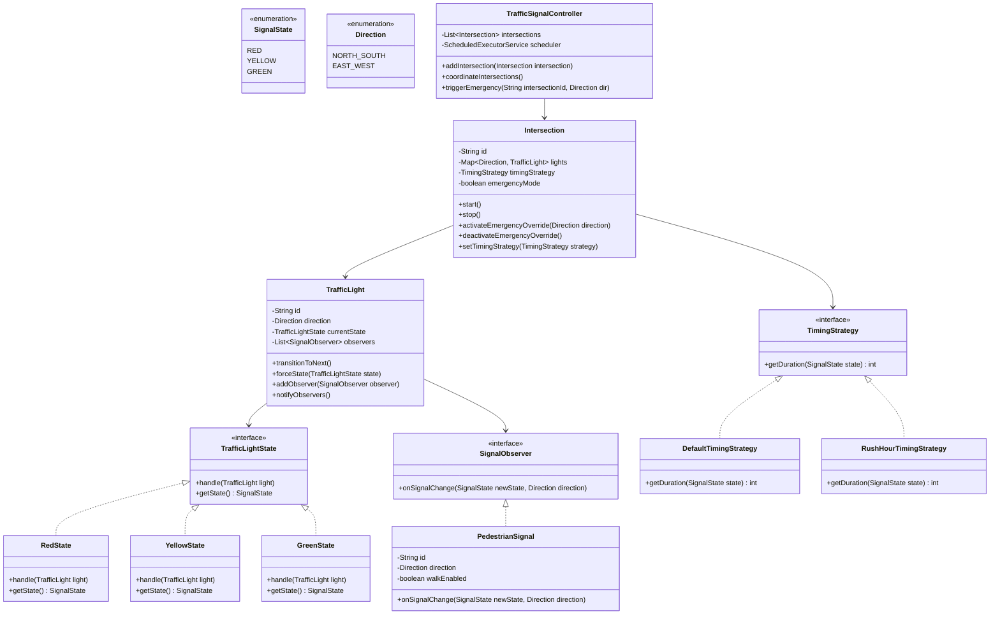
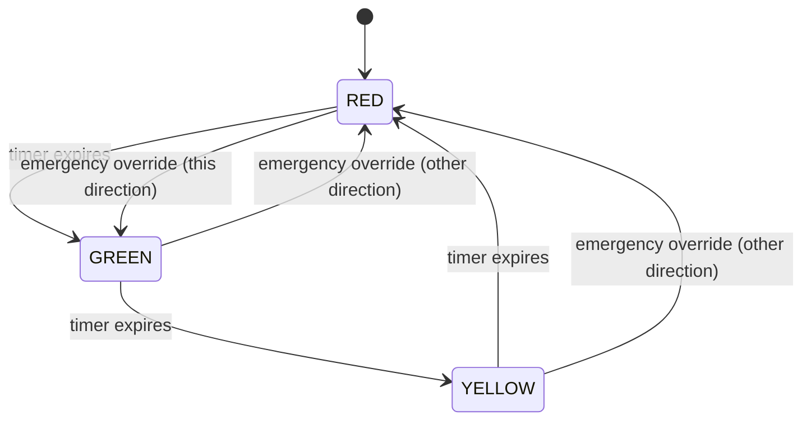

# Traffic Signal Controller - Low-Level Design

## 1. Problem Statement
Design a Traffic Signal Controller system that manages traffic lights at intersections with automatic timer-based transitions, emergency vehicle override, pedestrian signal coordination, and configurable timing strategies.

## 2. UML Class Diagram



## 3. State Machine Diagram



## 4. Design Patterns

| Pattern | Usage |
|---------|-------|
| **State** | TrafficLightState — each signal state encapsulates transition logic |
| **Observer** | PedestrianSignal observes TrafficLight state changes |
| **Strategy** | TimingStrategy — swappable duration logic (default, rush hour) |
| **Singleton** | TrafficSignalController as central coordinator |

## 5. SOLID Principles

- **SRP**: Each state class handles only its own transition logic
- **OCP**: New timing strategies without modifying existing code
- **LSP**: All states are interchangeable via TrafficLightState interface
- **ISP**: SignalObserver is a focused single-method interface
- **DIP**: Intersection depends on TimingStrategy abstraction, not concrete classes

## 6. Complete Java Implementation

```java
// ============ Enums ============
public enum SignalState {
    RED, YELLOW, GREEN;
}

public enum Direction {
    NORTH_SOUTH, EAST_WEST;

    public Direction opposite() {
        return this == NORTH_SOUTH ? EAST_WEST : NORTH_SOUTH;
    }
}

// ============ Observer Interface ============
public interface SignalObserver {
    void onSignalChange(SignalState newState, Direction direction);
}

// ============ Strategy Interface ============
public interface TimingStrategy {
    int getDuration(SignalState state); // seconds
}

public class DefaultTimingStrategy implements TimingStrategy {
    @Override
    public int getDuration(SignalState state) {
        return switch (state) {
            case RED -> 30;
            case GREEN -> 25;
            case YELLOW -> 5;
        };
    }
}

public class RushHourTimingStrategy implements TimingStrategy {
    private final Direction priorityDirection;

    public RushHourTimingStrategy(Direction priorityDirection) {
        this.priorityDirection = priorityDirection;
    }

    @Override
    public int getDuration(SignalState state) {
        return switch (state) {
            case RED -> 20;
            case GREEN -> 45; // longer green for priority
            case YELLOW -> 5;
        };
    }

    public Direction getPriorityDirection() { return priorityDirection; }
}

// ============ State Pattern ============
public interface TrafficLightState {
    void handle(TrafficLight light);
    SignalState getState();
}

public class RedState implements TrafficLightState {
    @Override
    public void handle(TrafficLight light) {
        light.setState(new GreenState());
    }

    @Override
    public SignalState getState() { return SignalState.RED; }
}

public class GreenState implements TrafficLightState {
    @Override
    public void handle(TrafficLight light) {
        light.setState(new YellowState());
    }

    @Override
    public SignalState getState() { return SignalState.GREEN; }
}

public class YellowState implements TrafficLightState {
    @Override
    public void handle(TrafficLight light) {
        light.setState(new RedState());
    }

    @Override
    public SignalState getState() { return SignalState.YELLOW; }
}

// ============ Traffic Light ============
public class TrafficLight {
    private final String id;
    private final Direction direction;
    private TrafficLightState currentState;
    private final List<SignalObserver> observers = new ArrayList<>();

    public TrafficLight(String id, Direction direction) {
        this.id = id;
        this.direction = direction;
        this.currentState = new RedState();
    }

    public void transitionToNext() {
        currentState.handle(this);
        notifyObservers();
        System.out.printf("[%s] %s -> %s%n", id, direction, currentState.getState());
    }

    public void forceState(TrafficLightState state) {
        this.currentState = state;
        notifyObservers();
        System.out.printf("[%s] FORCED -> %s%n", id, state.getState());
    }

    public void setState(TrafficLightState state) {
        this.currentState = state;
    }

    public void addObserver(SignalObserver observer) {
        observers.add(observer);
    }

    private void notifyObservers() {
        for (SignalObserver obs : observers) {
            obs.onSignalChange(currentState.getState(), direction);
        }
    }

    public SignalState getCurrentState() { return currentState.getState(); }
    public Direction getDirection() { return direction; }
    public String getId() { return id; }
}

// ============ Pedestrian Signal (Observer) ============
public class PedestrianSignal implements SignalObserver {
    private final String id;
    private final Direction crossingDirection; // direction pedestrians cross
    private boolean walkEnabled;

    public PedestrianSignal(String id, Direction crossingDirection) {
        this.id = id;
        this.crossingDirection = crossingDirection;
        this.walkEnabled = false;
    }

    @Override
    public void onSignalChange(SignalState newState, Direction direction) {
        // Pedestrians can walk when perpendicular traffic is RED
        if (direction == crossingDirection) {
            this.walkEnabled = (newState == SignalState.RED);
            System.out.printf("  [Pedestrian %s] %s%n", id, walkEnabled ? "WALK" : "STOP");
        }
    }

    public boolean isWalkEnabled() { return walkEnabled; }
}

// ============ Intersection ============
public class Intersection {
    private final String id;
    private final Map<Direction, TrafficLight> lights = new EnumMap<>(Direction.class);
    private TimingStrategy timingStrategy;
    private boolean emergencyMode = false;
    private ScheduledExecutorService scheduler;
    private volatile boolean running = false;

    public Intersection(String id, TimingStrategy timingStrategy) {
        this.id = id;
        this.timingStrategy = timingStrategy;

        // Initialize lights for each direction
        for (Direction dir : Direction.values()) {
            lights.put(dir, new TrafficLight(id + "-" + dir, dir));
        }
        // Start NS green, EW red
        lights.get(Direction.NORTH_SOUTH).forceState(new GreenState());
        lights.get(Direction.EAST_WEST).forceState(new RedState());
    }

    public void start() {
        running = true;
        scheduler = Executors.newSingleThreadScheduledExecutor();
        scheduleNextTransition();
        System.out.printf("Intersection [%s] started%n", id);
    }

    public void stop() {
        running = false;
        if (scheduler != null) scheduler.shutdown();
    }

    private void scheduleNextTransition() {
        if (!running || emergencyMode) return;

        TrafficLight activeLight = getGreenLight();
        int duration = timingStrategy.getDuration(activeLight.getCurrentState());

        scheduler.schedule(() -> {
            performTransition();
            scheduleNextTransition();
        }, duration, TimeUnit.SECONDS);
    }

    private synchronized void performTransition() {
        // Transition the green light to yellow, then to red, then opposite to green
        TrafficLight greenLight = getGreenLight();
        if (greenLight == null) return;

        greenLight.transitionToNext(); // GREEN -> YELLOW
        // Schedule yellow->red and opposite green after yellow duration
        try {
            Thread.sleep(timingStrategy.getDuration(SignalState.YELLOW) * 1000L);
        } catch (InterruptedException e) {
            Thread.currentThread().interrupt();
        }
        greenLight.transitionToNext(); // YELLOW -> RED

        // Turn opposite direction green
        TrafficLight oppositeLight = lights.get(greenLight.getDirection().opposite());
        oppositeLight.transitionToNext(); // RED -> GREEN
    }

    private TrafficLight getGreenLight() {
        return lights.values().stream()
                .filter(l -> l.getCurrentState() == SignalState.GREEN)
                .findFirst().orElse(null);
    }

    // ---- Emergency Override ----
    public synchronized void activateEmergencyOverride(Direction emergencyDirection) {
        emergencyMode = true;
        System.out.printf("*** EMERGENCY OVERRIDE at [%s] for %s ***%n", id, emergencyDirection);

        // Force all to red, then set emergency direction green
        for (TrafficLight light : lights.values()) {
            light.forceState(new RedState());
        }
        lights.get(emergencyDirection).forceState(new GreenState());
    }

    public synchronized void deactivateEmergencyOverride() {
        emergencyMode = false;
        System.out.printf("*** Emergency cleared at [%s] ***%n", id);
        scheduleNextTransition();
    }

    public void setTimingStrategy(TimingStrategy strategy) {
        this.timingStrategy = strategy;
    }

    public void addPedestrianSignal(Direction crossDir, PedestrianSignal signal) {
        // Attach observer to the light in crossing direction
        lights.get(crossDir).addObserver(signal);
    }

    public TrafficLight getLight(Direction direction) { return lights.get(direction); }
    public String getId() { return id; }
}

// ============ Traffic Signal Controller (Coordinator) ============
public class TrafficSignalController {
    private static TrafficSignalController instance;
    private final Map<String, Intersection> intersections = new ConcurrentHashMap<>();

    private TrafficSignalController() {}

    public static synchronized TrafficSignalController getInstance() {
        if (instance == null) instance = new TrafficSignalController();
        return instance;
    }

    public void addIntersection(Intersection intersection) {
        intersections.put(intersection.getId(), intersection);
    }

    public void startAll() {
        intersections.values().forEach(Intersection::start);
    }

    public void stopAll() {
        intersections.values().forEach(Intersection::stop);
    }

    public void triggerEmergency(String intersectionId, Direction direction) {
        Intersection intersection = intersections.get(intersectionId);
        if (intersection != null) {
            intersection.activateEmergencyOverride(direction);
        }
    }

    public void clearEmergency(String intersectionId) {
        Intersection intersection = intersections.get(intersectionId);
        if (intersection != null) {
            intersection.deactivateEmergencyOverride();
        }
    }

    public void setGlobalStrategy(TimingStrategy strategy) {
        intersections.values().forEach(i -> i.setTimingStrategy(strategy));
    }
}

// ============ Demo ============
public class TrafficSignalDemo {
    public static void main(String[] args) throws InterruptedException {
        TrafficSignalController controller = TrafficSignalController.getInstance();

        // Create intersection with default timing
        Intersection intersection1 = new Intersection("INT-1", new DefaultTimingStrategy());

        // Add pedestrian signals
        PedestrianSignal pedNS = new PedestrianSignal("PED-NS", Direction.NORTH_SOUTH);
        PedestrianSignal pedEW = new PedestrianSignal("PED-EW", Direction.EAST_WEST);
        intersection1.addPedestrianSignal(Direction.NORTH_SOUTH, pedNS);
        intersection1.addPedestrianSignal(Direction.EAST_WEST, pedEW);

        controller.addIntersection(intersection1);
        controller.startAll();

        // Simulate emergency after 10 seconds
        Thread.sleep(10000);
        controller.triggerEmergency("INT-1", Direction.EAST_WEST);

        Thread.sleep(5000);
        controller.clearEmergency("INT-1");

        // Switch to rush hour strategy
        controller.setGlobalStrategy(new RushHourTimingStrategy(Direction.NORTH_SOUTH));

        Thread.sleep(15000);
        controller.stopAll();
    }
}
```

## 7. Key Interview Points

1. **State Pattern** eliminates complex if-else chains for signal transitions — each state knows its successor
2. **Thread safety**: `synchronized` on transition methods, `volatile` for running flag, `ConcurrentHashMap` for intersections
3. **Emergency override** breaks normal cycle — forces all RED then one GREEN; resumes normal after clearing
4. **Strategy pattern** for timing allows runtime switching (rush hour, night mode, adaptive) without code changes
5. **Observer pattern** decouples pedestrian signals from traffic lights — easily add countdown displays, sensors
6. **Coordination**: Controller can implement green-wave by staggering start times across intersections
7. **Extensibility**: Add sensor-based adaptive timing, left-turn arrows, or countdown timers as new strategies/observers
8. **Trade-offs**: Simplified model uses direction pairs; real systems have phases with protected turns and all-red intervals
