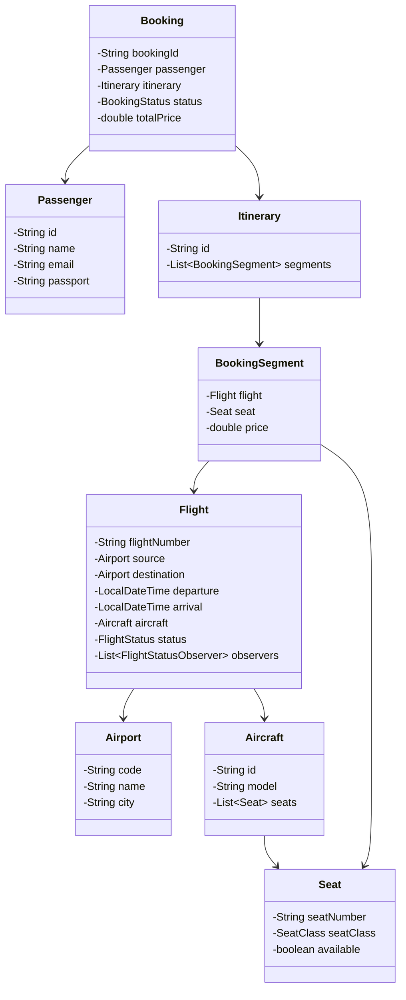
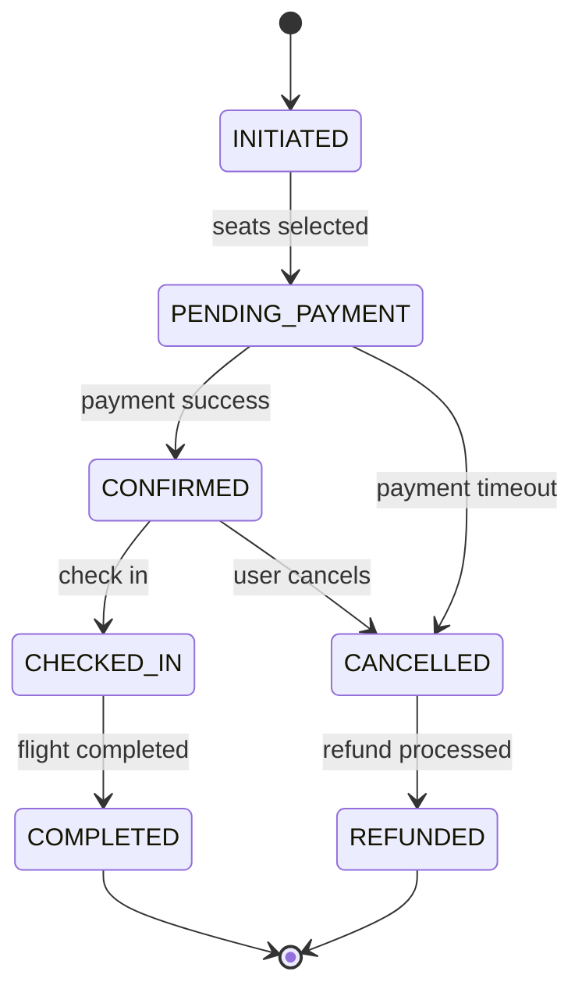

# Airline Reservation System - Low-Level Design

## 1. Problem Statement

Design an airline reservation system that supports flight search, seat selection, booking management, dynamic pricing, multi-leg itineraries, and real-time flight status notifications.

## 2. UML Class Diagram



## 3. State Diagram



## 4. Design Patterns

| Pattern | Usage |
|---------|-------|
| **Strategy** | PricingStrategy, SeatAssignmentStrategy |
| **Observer** | FlightStatusObserver for notifications |
| **State** | BookingState for lifecycle transitions |
| **Factory** | BookingFactory for creating bookings |

## 5. Java Implementation

### Enums

```java
public enum SeatClass {
    ECONOMY, BUSINESS, FIRST
}

public enum BookingStatus {
    INITIATED, PENDING_PAYMENT, CONFIRMED, CHECKED_IN, CANCELLED, REFUNDED, COMPLETED
}

public enum FlightStatus {
    SCHEDULED, BOARDING, DEPARTED, IN_AIR, LANDED, CANCELLED, DELAYED
}
```

### Models

```java
public class Airport {
    private String code;
    private String name;
    private String city;

    public Airport(String code, String name, String city) {
        this.code = code; this.name = name; this.city = city;
    }
    public String getCode() { return code; }
    public String getCity() { return city; }
}

public class Seat {
    private String seatNumber;
    private SeatClass seatClass;
    private boolean available;

    public Seat(String seatNumber, SeatClass seatClass) {
        this.seatNumber = seatNumber;
        this.seatClass = seatClass;
        this.available = true;
    }
    public String getSeatNumber() { return seatNumber; }
    public SeatClass getSeatClass() { return seatClass; }
    public boolean isAvailable() { return available; }
    public synchronized void reserve() {
        if (!available) throw new IllegalStateException("Seat already taken");
        this.available = false;
    }
    public void release() { this.available = true; }
}

public class Aircraft {
    private String id;
    private String model;
    private List<Seat> seats;

    public Aircraft(String id, String model, List<Seat> seats) {
        this.id = id; this.model = model; this.seats = seats;
    }
    public List<Seat> getAvailableSeats(SeatClass seatClass) {
        return seats.stream()
            .filter(s -> s.getSeatClass() == seatClass && s.isAvailable())
            .collect(Collectors.toList());
    }
    public List<Seat> getSeats() { return seats; }
}

public class Passenger {
    private String id;
    private String name;
    private String email;
    private String passport;

    public Passenger(String id, String name, String email, String passport) {
        this.id = id; this.name = name; this.email = email; this.passport = passport;
    }
    public String getId() { return id; }
    public String getName() { return name; }
    public String getEmail() { return email; }
}

public class BookingSegment {
    private Flight flight;
    private Seat seat;
    private double price;

    public BookingSegment(Flight flight, Seat seat, double price) {
        this.flight = flight; this.seat = seat; this.price = price;
    }
    public Flight getFlight() { return flight; }
    public Seat getSeat() { return seat; }
    public double getPrice() { return price; }
}

public class Itinerary {
    private String id;
    private List<BookingSegment> segments;

    public Itinerary(String id, List<BookingSegment> segments) {
        this.id = id; this.segments = segments;
    }
    public List<BookingSegment> getSegments() { return segments; }
    public double getTotalPrice() {
        return segments.stream().mapToDouble(BookingSegment::getPrice).sum();
    }
}
```

### Observer Pattern - Flight Status

```java
public interface FlightStatusObserver {
    void onStatusChange(Flight flight, FlightStatus oldStatus, FlightStatus newStatus);
}

public class EmailNotifier implements FlightStatusObserver {
    @Override
    public void onStatusChange(Flight flight, FlightStatus oldStatus, FlightStatus newStatus) {
        System.out.println("Email: Flight " + flight.getFlightNumber() +
            " status changed from " + oldStatus + " to " + newStatus);
    }
}

public class SMSNotifier implements FlightStatusObserver {
    @Override
    public void onStatusChange(Flight flight, FlightStatus oldStatus, FlightStatus newStatus) {
        System.out.println("SMS: Flight " + flight.getFlightNumber() + " is now " + newStatus);
    }
}

public class Flight {
    private String flightNumber;
    private Airport source;
    private Airport destination;
    private LocalDateTime departure;
    private LocalDateTime arrival;
    private Aircraft aircraft;
    private FlightStatus status;
    private List<FlightStatusObserver> observers = new ArrayList<>();

    public Flight(String flightNumber, Airport source, Airport destination,
                  LocalDateTime departure, LocalDateTime arrival, Aircraft aircraft) {
        this.flightNumber = flightNumber;
        this.source = source; this.destination = destination;
        this.departure = departure; this.arrival = arrival;
        this.aircraft = aircraft; this.status = FlightStatus.SCHEDULED;
    }

    public void addObserver(FlightStatusObserver observer) { observers.add(observer); }
    public void removeObserver(FlightStatusObserver observer) { observers.remove(observer); }

    public void updateStatus(FlightStatus newStatus) {
        FlightStatus old = this.status;
        this.status = newStatus;
        observers.forEach(o -> o.onStatusChange(this, old, newStatus));
    }

    public String getFlightNumber() { return flightNumber; }
    public Airport getSource() { return source; }
    public Airport getDestination() { return destination; }
    public LocalDateTime getDeparture() { return departure; }
    public Aircraft getAircraft() { return aircraft; }
    public FlightStatus getStatus() { return status; }
}
```

### Strategy Pattern - Pricing

```java
public interface PricingStrategy {
    double calculatePrice(Flight flight, Seat seat, LocalDate bookingDate);
}

public class DynamicPricingStrategy implements PricingStrategy {
    @Override
    public double calculatePrice(Flight flight, Seat seat, LocalDate bookingDate) {
        double basePrice = getBasePrice(seat.getSeatClass());
        long daysUntilFlight = ChronoUnit.DAYS.between(bookingDate, flight.getDeparture().toLocalDate());
        // Higher price as departure approaches
        double demandMultiplier = daysUntilFlight < 7 ? 2.0 : daysUntilFlight < 14 ? 1.5 : 1.0;
        // Occupancy factor
        List<Seat> available = flight.getAircraft().getAvailableSeats(seat.getSeatClass());
        int total = (int) flight.getAircraft().getSeats().stream()
            .filter(s -> s.getSeatClass() == seat.getSeatClass()).count();
        double occupancy = 1.0 - ((double) available.size() / total);
        double occupancyMultiplier = 1.0 + (occupancy * 0.5);
        return basePrice * demandMultiplier * occupancyMultiplier;
    }

    private double getBasePrice(SeatClass sc) {
        return switch (sc) { case ECONOMY -> 200; case BUSINESS -> 600; case FIRST -> 1200; };
    }
}

public class EarlyBirdPricingStrategy implements PricingStrategy {
    @Override
    public double calculatePrice(Flight flight, Seat seat, LocalDate bookingDate) {
        double basePrice = switch (seat.getSeatClass()) {
            case ECONOMY -> 200; case BUSINESS -> 600; case FIRST -> 1200;
        };
        long daysUntilFlight = ChronoUnit.DAYS.between(bookingDate, flight.getDeparture().toLocalDate());
        if (daysUntilFlight > 60) return basePrice * 0.7;  // 30% discount
        if (daysUntilFlight > 30) return basePrice * 0.85; // 15% discount
        return basePrice;
    }
}
```

### Strategy Pattern - Seat Assignment

```java
public interface SeatAssignmentStrategy {
    Seat assignSeat(Flight flight, SeatClass seatClass);
}

public class WindowFirstStrategy implements SeatAssignmentStrategy {
    @Override
    public Seat assignSeat(Flight flight, SeatClass seatClass) {
        return flight.getAircraft().getAvailableSeats(seatClass).stream()
            .filter(s -> s.getSeatNumber().endsWith("A") || s.getSeatNumber().endsWith("F"))
            .findFirst()
            .orElse(flight.getAircraft().getAvailableSeats(seatClass).stream()
                .findFirst().orElseThrow(() -> new RuntimeException("No seats available")));
    }
}

public class RandomAssignmentStrategy implements SeatAssignmentStrategy {
    @Override
    public Seat assignSeat(Flight flight, SeatClass seatClass) {
        List<Seat> available = flight.getAircraft().getAvailableSeats(seatClass);
        if (available.isEmpty()) throw new RuntimeException("No seats available");
        return available.get(new Random().nextInt(available.size()));
    }
}
```

### State Pattern - Booking Lifecycle

```java
public interface BookingState {
    void next(Booking booking);
    void cancel(Booking booking);
    BookingStatus getStatus();
}

public class InitiatedState implements BookingState {
    public void next(Booking booking) { booking.setState(new PendingPaymentState()); }
    public void cancel(Booking booking) { booking.setState(new CancelledState()); }
    public BookingStatus getStatus() { return BookingStatus.INITIATED; }
}

public class PendingPaymentState implements BookingState {
    public void next(Booking booking) { booking.setState(new ConfirmedState()); }
    public void cancel(Booking booking) {
        booking.releaseSeats();
        booking.setState(new CancelledState());
    }
    public BookingStatus getStatus() { return BookingStatus.PENDING_PAYMENT; }
}

public class ConfirmedState implements BookingState {
    public void next(Booking booking) { booking.setState(new CheckedInState()); }
    public void cancel(Booking booking) {
        booking.releaseSeats();
        booking.setState(new CancelledState());
        booking.processRefund();
    }
    public BookingStatus getStatus() { return BookingStatus.CONFIRMED; }
}

public class CheckedInState implements BookingState {
    public void next(Booking booking) { booking.setState(new CompletedState()); }
    public void cancel(Booking booking) { throw new IllegalStateException("Cannot cancel after check-in"); }
    public BookingStatus getStatus() { return BookingStatus.CHECKED_IN; }
}

public class CancelledState implements BookingState {
    public void next(Booking booking) { booking.setState(new RefundedState()); }
    public void cancel(Booking booking) { throw new IllegalStateException("Already cancelled"); }
    public BookingStatus getStatus() { return BookingStatus.CANCELLED; }
}

public class RefundedState implements BookingState {
    public void next(Booking booking) { throw new IllegalStateException("Terminal state"); }
    public void cancel(Booking booking) { throw new IllegalStateException("Terminal state"); }
    public BookingStatus getStatus() { return BookingStatus.REFUNDED; }
}

public class CompletedState implements BookingState {
    public void next(Booking booking) { throw new IllegalStateException("Terminal state"); }
    public void cancel(Booking booking) { throw new IllegalStateException("Cannot cancel completed"); }
    public BookingStatus getStatus() { return BookingStatus.COMPLETED; }
}
```

### Booking

```java
public class Booking {
    private String bookingId;
    private Passenger passenger;
    private Itinerary itinerary;
    private BookingState state;
    private double totalPrice;
    private LocalDateTime createdAt;

    public Booking(String bookingId, Passenger passenger, Itinerary itinerary) {
        this.bookingId = bookingId;
        this.passenger = passenger;
        this.itinerary = itinerary;
        this.totalPrice = itinerary.getTotalPrice();
        this.state = new InitiatedState();
        this.createdAt = LocalDateTime.now();
    }

    public void setState(BookingState state) { this.state = state; }
    public BookingStatus getStatus() { return state.getStatus(); }
    public void proceed() { state.next(this); }
    public void cancel() { state.cancel(this); }

    public void releaseSeats() {
        itinerary.getSegments().forEach(seg -> seg.getSeat().release());
    }

    public void processRefund() {
        // Refund logic based on cancellation policy
        long hoursUntil = ChronoUnit.HOURS.between(LocalDateTime.now(),
            itinerary.getSegments().get(0).getFlight().getDeparture());
        double refundPercent = hoursUntil > 48 ? 0.9 : hoursUntil > 24 ? 0.5 : 0.0;
        System.out.println("Refund: $" + (totalPrice * refundPercent));
    }

    public String getBookingId() { return bookingId; }
    public double getTotalPrice() { return totalPrice; }
}
```

### Flight Search Service

```java
public class FlightSearchService {
    private List<Flight> flights = new ArrayList<>();

    public void addFlight(Flight flight) { flights.add(flight); }

    public List<Flight> search(String sourceCode, String destCode,
                               LocalDate date, SeatClass seatClass) {
        return flights.stream()
            .filter(f -> f.getSource().getCode().equals(sourceCode))
            .filter(f -> f.getDestination().getCode().equals(destCode))
            .filter(f -> f.getDeparture().toLocalDate().equals(date))
            .filter(f -> !f.getAircraft().getAvailableSeats(seatClass).isEmpty())
            .filter(f -> f.getStatus() != FlightStatus.CANCELLED)
            .sorted(Comparator.comparing(Flight::getDeparture))
            .collect(Collectors.toList());
    }

    public List<List<Flight>> searchMultiLeg(String source, String dest,
                                              LocalDate date, SeatClass seatClass) {
        List<List<Flight>> results = new ArrayList<>();
        // Direct flights
        List<Flight> direct = search(source, dest, date, seatClass);
        direct.forEach(f -> results.add(List.of(f)));
        // One-stop connections
        List<Flight> firstLegs = flights.stream()
            .filter(f -> f.getSource().getCode().equals(source))
            .filter(f -> f.getDeparture().toLocalDate().equals(date))
            .filter(f -> !f.getAircraft().getAvailableSeats(seatClass).isEmpty())
            .collect(Collectors.toList());
        for (Flight first : firstLegs) {
            String connectCity = first.getDestination().getCode();
            if (connectCity.equals(dest)) continue;
            flights.stream()
                .filter(f -> f.getSource().getCode().equals(connectCity))
                .filter(f -> f.getDestination().getCode().equals(dest))
                .filter(f -> f.getDeparture().isAfter(first.getArrival().plusHours(1)))
                .filter(f -> f.getDeparture().isBefore(first.getArrival().plusHours(8)))
                .filter(f -> !f.getAircraft().getAvailableSeats(seatClass).isEmpty())
                .forEach(second -> results.add(List.of(first, second)));
        }
        return results;
    }
}
```

### Booking Factory & Service

```java
public class BookingFactory {
    private static final AtomicInteger counter = new AtomicInteger(1);

    public static Booking createBooking(Passenger passenger, List<BookingSegment> segments) {
        String bookingId = "BK" + String.format("%06d", counter.getAndIncrement());
        Itinerary itinerary = new Itinerary(UUID.randomUUID().toString(), segments);
        return new Booking(bookingId, passenger, itinerary);
    }
}

public class ReservationService {
    private final PricingStrategy pricingStrategy;
    private final SeatAssignmentStrategy seatStrategy;
    private final Map<String, Booking> bookings = new ConcurrentHashMap<>();

    public ReservationService(PricingStrategy pricingStrategy,
                              SeatAssignmentStrategy seatStrategy) {
        this.pricingStrategy = pricingStrategy;
        this.seatStrategy = seatStrategy;
    }

    public Booking bookFlight(Passenger passenger, Flight flight,
                              Seat seat, SeatClass seatClass) {
        Seat selected = (seat != null) ? seat : seatStrategy.assignSeat(flight, seatClass);
        synchronized (selected) {
            selected.reserve();
        }
        double price = pricingStrategy.calculatePrice(flight, selected, LocalDate.now());
        BookingSegment segment = new BookingSegment(flight, selected, price);
        Booking booking = BookingFactory.createBooking(passenger, List.of(segment));
        booking.proceed(); // INITIATED -> PENDING_PAYMENT
        bookings.put(booking.getBookingId(), booking);
        return booking;
    }

    public Booking bookMultiLeg(Passenger passenger, List<Flight> flights,
                                SeatClass seatClass) {
        List<BookingSegment> segments = new ArrayList<>();
        for (Flight flight : flights) {
            Seat seat = seatStrategy.assignSeat(flight, seatClass);
            synchronized (seat) { seat.reserve(); }
            double price = pricingStrategy.calculatePrice(flight, seat, LocalDate.now());
            segments.add(new BookingSegment(flight, seat, price));
        }
        Booking booking = BookingFactory.createBooking(passenger, segments);
        booking.proceed();
        bookings.put(booking.getBookingId(), booking);
        return booking;
    }

    public void confirmPayment(String bookingId) {
        Booking booking = bookings.get(bookingId);
        if (booking == null) throw new RuntimeException("Booking not found");
        booking.proceed(); // PENDING_PAYMENT -> CONFIRMED
    }

    public void cancelBooking(String bookingId) {
        Booking booking = bookings.get(bookingId);
        if (booking == null) throw new RuntimeException("Booking not found");
        booking.cancel();
    }

    public Booking getBooking(String bookingId) { return bookings.get(bookingId); }
}
```

### Demo

```java
public class AirlineReservationDemo {
    public static void main(String[] args) {
        // Setup airports
        Airport jfk = new Airport("JFK", "John F Kennedy", "New York");
        Airport lax = new Airport("LAX", "Los Angeles Intl", "Los Angeles");
        Airport ord = new Airport("ORD", "O'Hare", "Chicago");

        // Setup aircraft with seats
        List<Seat> seats = new ArrayList<>();
        for (int i = 1; i <= 5; i++) seats.add(new Seat(i + "A", SeatClass.FIRST));
        for (int i = 6; i <= 15; i++) seats.add(new Seat(i + "A", SeatClass.BUSINESS));
        for (int i = 16; i <= 30; i++) seats.add(new Seat(i + "A", SeatClass.ECONOMY));
        Aircraft aircraft = new Aircraft("AC001", "Boeing 737", seats);

        // Create flights
        Flight f1 = new Flight("AA100", jfk, lax,
            LocalDateTime.of(2025, 3, 15, 8, 0),
            LocalDateTime.of(2025, 3, 15, 11, 30), aircraft);
        f1.addObserver(new EmailNotifier());
        f1.addObserver(new SMSNotifier());

        // Search
        FlightSearchService searchService = new FlightSearchService();
        searchService.addFlight(f1);
        List<Flight> results = searchService.search("JFK", "LAX",
            LocalDate.of(2025, 3, 15), SeatClass.ECONOMY);
        System.out.println("Found " + results.size() + " flights");

        // Book
        ReservationService resService = new ReservationService(
            new DynamicPricingStrategy(), new WindowFirstStrategy());
        Passenger p = new Passenger("P1", "John Doe", "john@email.com", "US123456");
        Booking booking = resService.bookFlight(p, f1, null, SeatClass.ECONOMY);
        System.out.println("Booking: " + booking.getBookingId() +
            " Status: " + booking.getStatus() + " Price: $" + booking.getTotalPrice());

        // Confirm payment
        resService.confirmPayment(booking.getBookingId());
        System.out.println("After payment: " + booking.getStatus());

        // Flight status update
        f1.updateStatus(FlightStatus.BOARDING);

        // Cancel another booking scenario
        Booking b2 = resService.bookFlight(p, f1, null, SeatClass.BUSINESS);
        resService.confirmPayment(b2.getBookingId());
        resService.cancelBooking(b2.getBookingId());
        System.out.println("Cancelled booking: " + b2.getStatus());
    }
}
```

## 6. SOLID Principles Applied

| Principle | Application |
|-----------|-------------|
| **SRP** | Each class has one responsibility (Booking manages state, PricingStrategy calculates price) |
| **OCP** | New pricing/seat strategies added without modifying existing code |
| **LSP** | All BookingState implementations are interchangeable |
| **ISP** | FlightStatusObserver is a focused interface |
| **DIP** | ReservationService depends on PricingStrategy/SeatAssignmentStrategy abstractions |

## 7. Key Interview Points

1. **Thread Safety**: `synchronized` on seat reservation prevents double-booking
2. **State Pattern**: Clean booking lifecycle without complex if-else chains
3. **Strategy Pattern**: Pricing and seat assignment are pluggable at runtime
4. **Observer Pattern**: Decoupled notification system for flight status changes
5. **Multi-leg Support**: Search and booking support connecting flights with layover validation
6. **Refund Policy**: Time-based cancellation refund calculation
7. **Concurrency**: ConcurrentHashMap for bookings, synchronized seat operations
8. **Factory Pattern**: Consistent booking creation with auto-generated IDs
9. **Extensibility**: Add new seat classes, pricing tiers, or notification channels without core changes
10. **Real-world Considerations**: Payment timeout handling, overbooking strategy, loyalty integration
