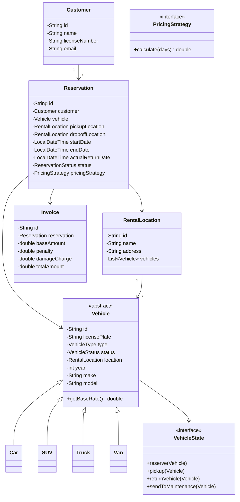
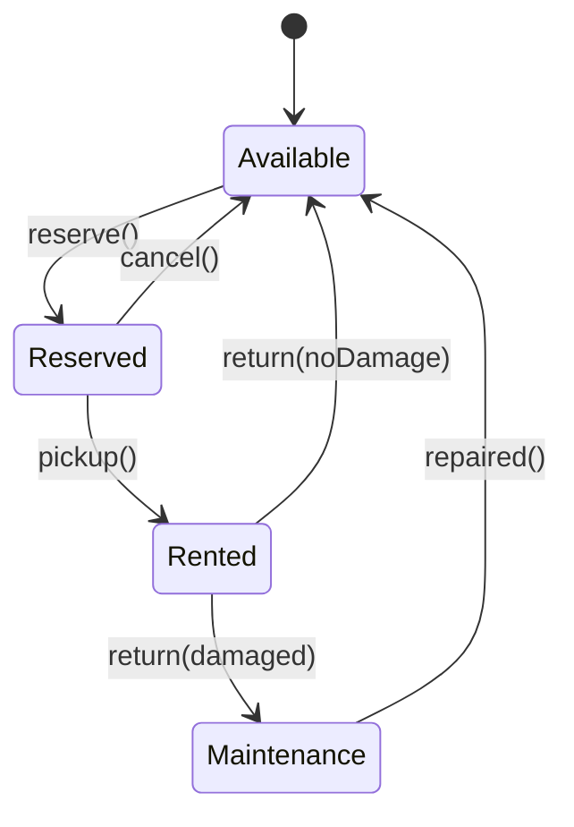

# Car Rental System - Low-Level Design

## 1. Problem Statement
Design a car rental system that supports multiple vehicle types, locations, reservation workflows, flexible pricing strategies, late return penalties, damage assessment, and one-way rentals.

## 2. UML Class Diagram



## 3. State Diagram - Vehicle Lifecycle



## 4. Design Patterns Used
- **Strategy**: Pricing (Daily, Weekly, Insurance addon)
- **State**: Vehicle status transitions
- **Factory**: Vehicle creation
- **Builder**: Vehicle configuration
- **Observer**: Notifications on reservation events
- **Decorator**: Insurance/addon pricing layers

## 5. Complete Java Implementation

```java
// ==================== ENUMS ====================
public enum VehicleType { CAR, SUV, TRUCK, VAN }

public enum VehicleStatus { AVAILABLE, RESERVED, RENTED, MAINTENANCE }

public enum ReservationStatus { PENDING, CONFIRMED, ACTIVE, COMPLETED, CANCELLED }

// ==================== MODELS ====================
public abstract class Vehicle {
    private String id;
    private String licensePlate;
    private VehicleType type;
    private VehicleStatus status;
    private RentalLocation location;
    private int year;
    private String make;
    private String model;
    private VehicleState state;

    public Vehicle(String id, VehicleType type, String make, String model, int year) {
        this.id = id;
        this.type = type;
        this.make = make;
        this.model = model;
        this.year = year;
        this.status = VehicleStatus.AVAILABLE;
        this.state = new AvailableState();
    }

    public abstract double getBaseRate();

    public void setState(VehicleState state) { this.state = state; }
    public VehicleState getState() { return state; }
    public void setStatus(VehicleStatus status) { this.status = status; }
    public VehicleStatus getStatus() { return status; }
    public VehicleType getType() { return type; }
    public RentalLocation getLocation() { return location; }
    public void setLocation(RentalLocation loc) { this.location = loc; }
    public String getId() { return id; }
    public String getMake() { return make; }
    public String getModel() { return model; }
}

public class Car extends Vehicle {
    public Car(String id, String make, String model, int year) {
        super(id, VehicleType.CAR, make, model, year);
    }
    public double getBaseRate() { return 40.0; }
}

public class SUV extends Vehicle {
    public SUV(String id, String make, String model, int year) {
        super(id, VehicleType.SUV, make, model, year);
    }
    public double getBaseRate() { return 60.0; }
}

public class Truck extends Vehicle {
    public Truck(String id, String make, String model, int year) {
        super(id, VehicleType.TRUCK, make, model, year);
    }
    public double getBaseRate() { return 70.0; }
}

public class Van extends Vehicle {
    public Van(String id, String make, String model, int year) {
        super(id, VehicleType.VAN, make, model, year);
    }
    public double getBaseRate() { return 55.0; }
}

// ==================== STATE PATTERN ====================
public interface VehicleState {
    void reserve(Vehicle vehicle);
    void pickup(Vehicle vehicle);
    void returnVehicle(Vehicle vehicle);
    void sendToMaintenance(Vehicle vehicle);
}

public class AvailableState implements VehicleState {
    public void reserve(Vehicle v) {
        v.setStatus(VehicleStatus.RESERVED);
        v.setState(new ReservedState());
    }
    public void pickup(Vehicle v) { throw new IllegalStateException("Must reserve first"); }
    public void returnVehicle(Vehicle v) { throw new IllegalStateException("Not rented"); }
    public void sendToMaintenance(Vehicle v) {
        v.setStatus(VehicleStatus.MAINTENANCE);
        v.setState(new MaintenanceState());
    }
}

public class ReservedState implements VehicleState {
    public void reserve(Vehicle v) { throw new IllegalStateException("Already reserved"); }
    public void pickup(Vehicle v) {
        v.setStatus(VehicleStatus.RENTED);
        v.setState(new RentedState());
    }
    public void returnVehicle(Vehicle v) { throw new IllegalStateException("Not picked up"); }
    public void sendToMaintenance(Vehicle v) { throw new IllegalStateException("Currently reserved"); }
}

public class RentedState implements VehicleState {
    public void reserve(Vehicle v) { throw new IllegalStateException("Currently rented"); }
    public void pickup(Vehicle v) { throw new IllegalStateException("Already picked up"); }
    public void returnVehicle(Vehicle v) {
        v.setStatus(VehicleStatus.AVAILABLE);
        v.setState(new AvailableState());
    }
    public void sendToMaintenance(Vehicle v) {
        v.setStatus(VehicleStatus.MAINTENANCE);
        v.setState(new MaintenanceState());
    }
}

public class MaintenanceState implements VehicleState {
    public void reserve(Vehicle v) { throw new IllegalStateException("Under maintenance"); }
    public void pickup(Vehicle v) { throw new IllegalStateException("Under maintenance"); }
    public void returnVehicle(Vehicle v) { throw new IllegalStateException("Under maintenance"); }
    public void sendToMaintenance(Vehicle v) { throw new IllegalStateException("Already in maintenance"); }
    public void markRepaired(Vehicle v) {
        v.setStatus(VehicleStatus.AVAILABLE);
        v.setState(new AvailableState());
    }
}

// ==================== STRATEGY PATTERN - PRICING ====================
public interface PricingStrategy {
    double calculate(int days, double baseRate);
}

public class DailyRate implements PricingStrategy {
    public double calculate(int days, double baseRate) {
        return days * baseRate;
    }
}

public class WeeklyRate implements PricingStrategy {
    public double calculate(int days, double baseRate) {
        int weeks = days / 7;
        int remainingDays = days % 7;
        return (weeks * baseRate * 5.5) + (remainingDays * baseRate);
    }
}

// ==================== DECORATOR PATTERN - ADDONS ====================
public abstract class PricingDecorator implements PricingStrategy {
    protected PricingStrategy wrapped;
    public PricingDecorator(PricingStrategy wrapped) { this.wrapped = wrapped; }
}

public class InsuranceAddon extends PricingDecorator {
    private double dailyInsuranceRate;
    public InsuranceAddon(PricingStrategy wrapped, double dailyRate) {
        super(wrapped);
        this.dailyInsuranceRate = dailyRate;
    }
    public double calculate(int days, double baseRate) {
        return wrapped.calculate(days, baseRate) + (days * dailyInsuranceRate);
    }
}

public class GPSAddon extends PricingDecorator {
    public GPSAddon(PricingStrategy wrapped) { super(wrapped); }
    public double calculate(int days, double baseRate) {
        return wrapped.calculate(days, baseRate) + (days * 5.0);
    }
}

// ==================== FACTORY PATTERN ====================
public class VehicleFactory {
    public static Vehicle createVehicle(VehicleType type, String id, String make, String model, int year) {
        return switch (type) {
            case CAR -> new Car(id, make, model, year);
            case SUV -> new SUV(id, make, model, year);
            case TRUCK -> new Truck(id, make, model, year);
            case VAN -> new Van(id, make, model, year);
        };
    }
}

// ==================== BUILDER PATTERN ====================
public class VehicleBuilder {
    private String id;
    private VehicleType type;
    private String make;
    private String model;
    private int year;
    private String licensePlate;
    private RentalLocation location;

    public VehicleBuilder setId(String id) { this.id = id; return this; }
    public VehicleBuilder setType(VehicleType type) { this.type = type; return this; }
    public VehicleBuilder setMake(String make) { this.make = make; return this; }
    public VehicleBuilder setModel(String model) { this.model = model; return this; }
    public VehicleBuilder setYear(int year) { this.year = year; return this; }
    public VehicleBuilder setLicensePlate(String plate) { this.licensePlate = plate; return this; }
    public VehicleBuilder setLocation(RentalLocation loc) { this.location = loc; return this; }

    public Vehicle build() {
        Vehicle v = VehicleFactory.createVehicle(type, id, make, model, year);
        v.setLocation(location);
        return v;
    }
}

// ==================== OBSERVER PATTERN ====================
public interface RentalObserver {
    void onReservationCreated(Reservation reservation);
    void onVehiclePickedUp(Reservation reservation);
    void onVehicleReturned(Reservation reservation);
}

public class EmailNotificationService implements RentalObserver {
    public void onReservationCreated(Reservation r) {
        System.out.println("Email: Reservation " + r.getId() + " confirmed for " + r.getCustomer().getName());
    }
    public void onVehiclePickedUp(Reservation r) {
        System.out.println("Email: Vehicle picked up for reservation " + r.getId());
    }
    public void onVehicleReturned(Reservation r) {
        System.out.println("Email: Vehicle returned for reservation " + r.getId());
    }
}

public class SMSNotificationService implements RentalObserver {
    public void onReservationCreated(Reservation r) {
        System.out.println("SMS: Reservation confirmed - " + r.getId());
    }
    public void onVehiclePickedUp(Reservation r) {
        System.out.println("SMS: Pickup confirmed - " + r.getId());
    }
    public void onVehicleReturned(Reservation r) {
        System.out.println("SMS: Return confirmed - " + r.getId());
    }
}

// ==================== CORE MODELS ====================
public class Customer {
    private String id;
    private String name;
    private String email;
    private String licenseNumber;

    public Customer(String id, String name, String email, String licenseNumber) {
        this.id = id; this.name = name; this.email = email; this.licenseNumber = licenseNumber;
    }
    public String getId() { return id; }
    public String getName() { return name; }
    public String getEmail() { return email; }
}

public class RentalLocation {
    private String id;
    private String name;
    private String address;
    private List<Vehicle> vehicles = new ArrayList<>();

    public RentalLocation(String id, String name, String address) {
        this.id = id; this.name = name; this.address = address;
    }
    public void addVehicle(Vehicle v) { vehicles.add(v); v.setLocation(this); }
    public void removeVehicle(Vehicle v) { vehicles.remove(v); }
    public List<Vehicle> getVehicles() { return vehicles; }
    public String getId() { return id; }
    public String getName() { return name; }
}

public class Reservation {
    private String id;
    private Customer customer;
    private Vehicle vehicle;
    private RentalLocation pickupLocation;
    private RentalLocation dropoffLocation;
    private LocalDateTime startDate;
    private LocalDateTime endDate;
    private LocalDateTime actualReturnDate;
    private ReservationStatus status;
    private PricingStrategy pricingStrategy;

    public Reservation(String id, Customer customer, Vehicle vehicle,
                       RentalLocation pickup, RentalLocation dropoff,
                       LocalDateTime start, LocalDateTime end, PricingStrategy pricing) {
        this.id = id; this.customer = customer; this.vehicle = vehicle;
        this.pickupLocation = pickup; this.dropoffLocation = dropoff;
        this.startDate = start; this.endDate = end;
        this.pricingStrategy = pricing;
        this.status = ReservationStatus.CONFIRMED;
    }

    public String getId() { return id; }
    public Customer getCustomer() { return customer; }
    public Vehicle getVehicle() { return vehicle; }
    public ReservationStatus getStatus() { return status; }
    public void setStatus(ReservationStatus s) { this.status = s; }
    public LocalDateTime getEndDate() { return endDate; }
    public void setActualReturnDate(LocalDateTime d) { this.actualReturnDate = d; }
    public LocalDateTime getActualReturnDate() { return actualReturnDate; }
    public RentalLocation getDropoffLocation() { return dropoffLocation; }
    public PricingStrategy getPricingStrategy() { return pricingStrategy; }

    public int getRentalDays() {
        return (int) ChronoUnit.DAYS.between(startDate, endDate);
    }
}

public class Invoice {
    private String id;
    private Reservation reservation;
    private double baseAmount;
    private double latePenalty;
    private double damageCharge;
    private double totalAmount;

    public Invoice(String id, Reservation reservation, double baseAmount,
                   double latePenalty, double damageCharge) {
        this.id = id; this.reservation = reservation;
        this.baseAmount = baseAmount; this.latePenalty = latePenalty;
        this.damageCharge = damageCharge;
        this.totalAmount = baseAmount + latePenalty + damageCharge;
    }
    public double getTotalAmount() { return totalAmount; }
}

// ==================== PENALTY & DAMAGE ====================
public class PenaltyCalculator {
    private static final double LATE_FEE_PER_DAY = 1.5; // 1.5x daily rate

    public double calculateLatePenalty(Reservation reservation) {
        if (reservation.getActualReturnDate() == null) return 0;
        long lateDays = ChronoUnit.DAYS.between(reservation.getEndDate(), reservation.getActualReturnDate());
        if (lateDays <= 0) return 0;
        return lateDays * reservation.getVehicle().getBaseRate() * LATE_FEE_PER_DAY;
    }
}

public class DamageAssessment {
    public enum DamageLevel { NONE, MINOR, MODERATE, SEVERE }

    public double assessDamageCharge(DamageLevel level, Vehicle vehicle) {
        return switch (level) {
            case NONE -> 0;
            case MINOR -> vehicle.getBaseRate() * 2;
            case MODERATE -> vehicle.getBaseRate() * 5;
            case SEVERE -> vehicle.getBaseRate() * 15;
        };
    }
}

// ==================== VEHICLE CATALOG ====================
public class VehicleCatalog {
    private List<Vehicle> allVehicles = new ArrayList<>();

    public void addVehicle(Vehicle v) { allVehicles.add(v); }

    public List<Vehicle> search(VehicleType type, RentalLocation location,
                                LocalDateTime start, LocalDateTime end) {
        return allVehicles.stream()
            .filter(v -> v.getType() == type)
            .filter(v -> v.getStatus() == VehicleStatus.AVAILABLE)
            .filter(v -> v.getLocation().equals(location))
            .collect(Collectors.toList());
    }

    public List<Vehicle> filterByMake(List<Vehicle> vehicles, String make) {
        return vehicles.stream()
            .filter(v -> v.getMake().equalsIgnoreCase(make))
            .collect(Collectors.toList());
    }
}

// ==================== RENTAL SERVICE (FACADE) ====================
public class RentalService {
    private VehicleCatalog catalog;
    private List<Reservation> reservations = new ArrayList<>();
    private List<RentalObserver> observers = new ArrayList<>();
    private PenaltyCalculator penaltyCalculator = new PenaltyCalculator();
    private DamageAssessment damageAssessment = new DamageAssessment();

    public RentalService(VehicleCatalog catalog) { this.catalog = catalog; }

    public void addObserver(RentalObserver observer) { observers.add(observer); }

    // Step 1: Search
    public List<Vehicle> searchVehicles(VehicleType type, RentalLocation loc,
                                         LocalDateTime start, LocalDateTime end) {
        return catalog.search(type, loc, start, end);
    }

    // Step 2: Reserve
    public Reservation createReservation(Customer customer, Vehicle vehicle,
                                          RentalLocation pickup, RentalLocation dropoff,
                                          LocalDateTime start, LocalDateTime end,
                                          PricingStrategy pricing) {
        if (vehicle.getStatus() != VehicleStatus.AVAILABLE)
            throw new IllegalStateException("Vehicle not available");

        vehicle.getState().reserve(vehicle);
        String id = "RES-" + UUID.randomUUID().toString().substring(0, 8);
        Reservation res = new Reservation(id, customer, vehicle, pickup, dropoff, start, end, pricing);
        reservations.add(res);
        observers.forEach(o -> o.onReservationCreated(res));
        return res;
    }

    // Step 3: Pickup
    public void pickupVehicle(Reservation reservation) {
        reservation.getVehicle().getState().pickup(reservation.getVehicle());
        reservation.setStatus(ReservationStatus.ACTIVE);
        observers.forEach(o -> o.onVehiclePickedUp(reservation));
    }

    // Step 4: Return
    public Invoice returnVehicle(Reservation reservation, LocalDateTime returnDate,
                                  DamageAssessment.DamageLevel damage) {
        Vehicle vehicle = reservation.getVehicle();
        reservation.setActualReturnDate(returnDate);

        // Calculate costs
        int days = reservation.getRentalDays();
        double baseAmount = reservation.getPricingStrategy().calculate(days, vehicle.getBaseRate());
        double penalty = penaltyCalculator.calculateLatePenalty(reservation);
        double damageCharge = damageAssessment.assessDamageCharge(damage, vehicle);

        // State transition
        if (damage == DamageAssessment.DamageLevel.NONE || damage == DamageAssessment.DamageLevel.MINOR) {
            vehicle.getState().returnVehicle(vehicle);
        } else {
            vehicle.getState().sendToMaintenance(vehicle);
        }

        // Handle one-way rental: move vehicle to dropoff location
        RentalLocation dropoff = reservation.getDropoffLocation();
        vehicle.getLocation().removeVehicle(vehicle);
        dropoff.addVehicle(vehicle);

        reservation.setStatus(ReservationStatus.COMPLETED);
        observers.forEach(o -> o.onVehicleReturned(reservation));

        String invoiceId = "INV-" + UUID.randomUUID().toString().substring(0, 8);
        return new Invoice(invoiceId, reservation, baseAmount, penalty, damageCharge);
    }
}

// ==================== DEMO ====================
public class CarRentalDemo {
    public static void main(String[] args) {
        // Setup locations
        RentalLocation airport = new RentalLocation("LOC1", "Airport", "123 Airport Rd");
        RentalLocation downtown = new RentalLocation("LOC2", "Downtown", "456 Main St");

        // Build vehicles
        Vehicle car = new VehicleBuilder()
            .setId("V1").setType(VehicleType.CAR)
            .setMake("Toyota").setModel("Camry").setYear(2023)
            .setLocation(airport).build();
        airport.addVehicle(car);

        // Setup service
        VehicleCatalog catalog = new VehicleCatalog();
        catalog.addVehicle(car);
        RentalService service = new RentalService(catalog);
        service.addObserver(new EmailNotificationService());

        // Customer
        Customer customer = new Customer("C1", "John Doe", "john@email.com", "DL123");

        // Workflow: Search -> Reserve -> Pickup -> Return
        LocalDateTime start = LocalDateTime.now();
        LocalDateTime end = start.plusDays(5);

        List<Vehicle> results = service.searchVehicles(VehicleType.CAR, airport, start, end);
        PricingStrategy pricing = new InsuranceAddon(new DailyRate(), 15.0); // daily + insurance
        Reservation res = service.createReservation(customer, results.get(0), airport, downtown, start, end, pricing);
        service.pickupVehicle(res);

        // Return late with no damage (one-way to downtown)
        Invoice invoice = service.returnVehicle(res, end.plusDays(2), DamageAssessment.DamageLevel.NONE);
        System.out.println("Total: $" + invoice.getTotalAmount());
    }
}
```

## 6. SOLID Principles Applied

| Principle | Application |
|-----------|-------------|
| **SRP** | Each class has one responsibility (PenaltyCalculator, DamageAssessment, VehicleCatalog) |
| **OCP** | New vehicle types, pricing strategies, addons added without modifying existing code |
| **LSP** | All Vehicle subclasses substitutable; all PricingStrategy implementations interchangeable |
| **ISP** | RentalObserver methods are cohesive; VehicleState interface is focused |
| **DIP** | RentalService depends on PricingStrategy interface, not concrete implementations |

## 7. Key Interview Points

1. **State Pattern** prevents invalid transitions (can't pickup without reserving first)
2. **Decorator Pattern** allows composable pricing (base + insurance + GPS stacks cleanly)
3. **One-way rentals** handled by separating pickup/dropoff locations and moving vehicle on return
4. **Late penalty** uses 1.5x multiplier per late day against base rate
5. **Damage assessment** triggers maintenance state for moderate/severe damage
6. **Observer** decouples notification logic from core business workflow
7. **Thread safety**: In production, add synchronization on vehicle status changes and reservation creation
8. **Scalability**: VehicleCatalog search can be backed by database with indexed queries
9. **Concurrency**: Use optimistic locking on vehicle status to prevent double-booking
10. **Extensions**: Loyalty programs, dynamic pricing, fleet management, payment integration
