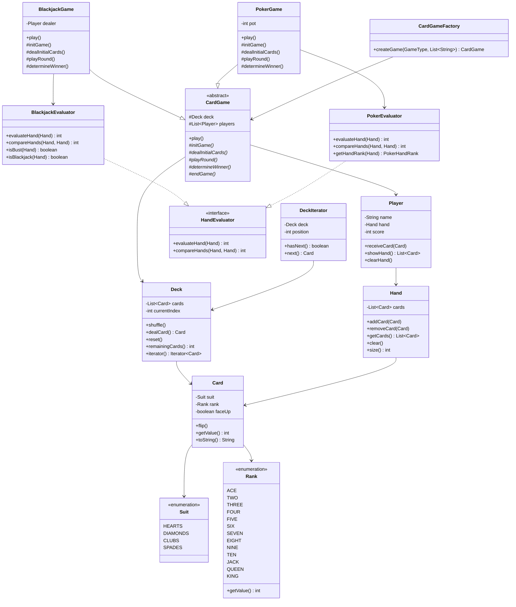

# Low-Level Design: Deck of Cards / Card Game Framework

## 1. Problem Statement

Design a generic, extensible card game library that supports multiple card games (Blackjack, Poker, etc.) using a standard 52-card deck. The framework should allow easy addition of new games without modifying existing code.

**Requirements:**
- Standard 52-card deck with shuffle, deal, reset operations
- Support multiple card games with different rules
- Extensible hand evaluation for different games
- Player management with hand and score tracking
- Clean separation between game framework and specific game logic

---

## 2. UML Class Diagram



---

## 3. Design Patterns

| Pattern | Usage |
|---------|-------|
| **Template Method** | `CardGame.play()` defines skeleton; subclasses implement steps |
| **Strategy** | `HandEvaluator` interface — swap evaluation logic per game |
| **Factory** | `CardGameFactory` creates game instances by type |
| **Iterator** | `DeckIterator` for traversing deck without exposing internals |

---

## 4. SOLID Principles

| Principle | Application |
|-----------|-------------|
| **SRP** | Card holds data, Deck manages collection, Hand evaluators score |
| **OCP** | New games extend `CardGame`; new evaluators implement `HandEvaluator` |
| **LSP** | Any `CardGame` subclass works where `CardGame` is expected |
| **ISP** | `HandEvaluator` is focused; games only depend on what they need |
| **DIP** | Games depend on `HandEvaluator` interface, not concrete evaluators |

---

## 5. Complete Java Implementation

### Enums

```java
public enum Suit {
    HEARTS("♥"), DIAMONDS("♦"), CLUBS("♣"), SPADES("♠");

    private final String symbol;

    Suit(String symbol) { this.symbol = symbol; }
    public String getSymbol() { return symbol; }
}

public enum Rank {
    ACE(1), TWO(2), THREE(3), FOUR(4), FIVE(5), SIX(6),
    SEVEN(7), EIGHT(8), NINE(9), TEN(10),
    JACK(10), QUEEN(10), KING(10);

    private final int value;

    Rank(int value) { this.value = value; }
    public int getValue() { return value; }
}
```

### Card

```java
public class Card {
    private final Suit suit;
    private final Rank rank;
    private boolean faceUp;

    public Card(Suit suit, Rank rank) {
        this.suit = suit;
        this.rank = rank;
        this.faceUp = true;
    }

    public Suit getSuit() { return suit; }
    public Rank getRank() { return rank; }
    public boolean isFaceUp() { return faceUp; }
    public void flip() { this.faceUp = !this.faceUp; }
    public int getValue() { return rank.getValue(); }

    @Override
    public String toString() {
        if (!faceUp) return "[Hidden]";
        return rank + " of " + suit;
    }
}
```

### Deck with Fisher-Yates Shuffle & Iterator

```java
import java.util.*;

public class Deck implements Iterable<Card> {
    private List<Card> cards;
    private int currentIndex;

    public Deck() {
        reset();
    }

    public void reset() {
        cards = new ArrayList<>();
        for (Suit suit : Suit.values()) {
            for (Rank rank : Rank.values()) {
                cards.add(new Card(suit, rank));
            }
        }
        currentIndex = 0;
    }

    // Fisher-Yates Shuffle
    public void shuffle() {
        Random random = new Random();
        for (int i = cards.size() - 1; i > 0; i--) {
            int j = random.nextInt(i + 1);
            Collections.swap(cards, i, j);
        }
        currentIndex = 0;
    }

    public Card dealCard() {
        if (currentIndex >= cards.size()) {
            throw new IllegalStateException("No cards remaining in deck");
        }
        return cards.get(currentIndex++);
    }

    public int remainingCards() {
        return cards.size() - currentIndex;
    }

    @Override
    public Iterator<Card> iterator() {
        return new DeckIterator();
    }

    // Iterator Pattern
    private class DeckIterator implements Iterator<Card> {
        private int position = currentIndex;

        @Override
        public boolean hasNext() {
            return position < cards.size();
        }

        @Override
        public Card next() {
            if (!hasNext()) throw new NoSuchElementException();
            return cards.get(position++);
        }
    }
}
```

### Hand & Player

```java
public class Hand {
    private final List<Card> cards = new ArrayList<>();

    public void addCard(Card card) { cards.add(card); }
    public void removeCard(Card card) { cards.remove(card); }
    public List<Card> getCards() { return Collections.unmodifiableList(cards); }
    public void clear() { cards.clear(); }
    public int size() { return cards.size(); }

    @Override
    public String toString() {
        return cards.toString();
    }
}

public class Player {
    private final String name;
    private final Hand hand;
    private int score;

    public Player(String name) {
        this.name = name;
        this.hand = new Hand();
        this.score = 0;
    }

    public String getName() { return name; }
    public Hand getHand() { return hand; }
    public int getScore() { return score; }
    public void setScore(int score) { this.score = score; }

    public void receiveCard(Card card) { hand.addCard(card); }
    public List<Card> showHand() { return hand.getCards(); }
    public void clearHand() { hand.clear(); }
}
```

### Strategy: HandEvaluator Interface

```java
public interface HandEvaluator {
    int evaluateHand(Hand hand);
    int compareHands(Hand hand1, Hand hand2);
}
```

### BlackjackEvaluator

```java
public class BlackjackEvaluator implements HandEvaluator {

    @Override
    public int evaluateHand(Hand hand) {
        int total = 0;
        int aces = 0;
        for (Card card : hand.getCards()) {
            if (card.getRank() == Rank.ACE) {
                aces++;
                total += 11;
            } else {
                total += card.getValue();
            }
        }
        // Downgrade aces from 11 to 1 if bust
        while (total > 21 && aces > 0) {
            total -= 10;
            aces--;
        }
        return total;
    }

    @Override
    public int compareHands(Hand hand1, Hand hand2) {
        int score1 = evaluateHand(hand1);
        int score2 = evaluateHand(hand2);
        boolean bust1 = isBust(hand1);
        boolean bust2 = isBust(hand2);

        if (bust1 && bust2) return 0;
        if (bust1) return -1;
        if (bust2) return 1;
        return Integer.compare(score1, score2);
    }

    public boolean isBust(Hand hand) {
        return evaluateHand(hand) > 21;
    }

    public boolean isBlackjack(Hand hand) {
        return hand.size() == 2 && evaluateHand(hand) == 21;
    }
}
```

### PokerEvaluator (Simplified)

```java
public class PokerEvaluator implements HandEvaluator {

    public enum PokerHandRank {
        HIGH_CARD, ONE_PAIR, TWO_PAIR, THREE_OF_A_KIND,
        STRAIGHT, FLUSH, FULL_HOUSE, FOUR_OF_A_KIND,
        STRAIGHT_FLUSH, ROYAL_FLUSH
    }

    @Override
    public int evaluateHand(Hand hand) {
        return getHandRank(hand).ordinal();
    }

    @Override
    public int compareHands(Hand hand1, Hand hand2) {
        int rank1 = evaluateHand(hand1);
        int rank2 = evaluateHand(hand2);
        if (rank1 != rank2) return Integer.compare(rank1, rank2);
        // Tie-break by highest card
        return Integer.compare(getHighCard(hand1), getHighCard(hand2));
    }

    public PokerHandRank getHandRank(Hand hand) {
        List<Card> cards = hand.getCards();
        if (isFlush(cards) && isStraight(cards)) {
            if (getHighCard(hand) == 10) return PokerHandRank.ROYAL_FLUSH;
            return PokerHandRank.STRAIGHT_FLUSH;
        }
        Map<Integer, Integer> freq = getFrequencyMap(cards);
        if (freq.containsValue(4)) return PokerHandRank.FOUR_OF_A_KIND;
        if (freq.containsValue(3) && freq.containsValue(2)) return PokerHandRank.FULL_HOUSE;
        if (isFlush(cards)) return PokerHandRank.FLUSH;
        if (isStraight(cards)) return PokerHandRank.STRAIGHT;
        if (freq.containsValue(3)) return PokerHandRank.THREE_OF_A_KIND;
        if (Collections.frequency(freq.values(), 2) == 2) return PokerHandRank.TWO_PAIR;
        if (freq.containsValue(2)) return PokerHandRank.ONE_PAIR;
        return PokerHandRank.HIGH_CARD;
    }

    private boolean isFlush(List<Card> cards) {
        Suit first = cards.get(0).getSuit();
        return cards.stream().allMatch(c -> c.getSuit() == first);
    }

    private boolean isStraight(List<Card> cards) {
        List<Integer> values = cards.stream()
            .map(c -> c.getRank().ordinal())
            .sorted().collect(Collectors.toList());
        for (int i = 1; i < values.size(); i++) {
            if (values.get(i) - values.get(i - 1) != 1) return false;
        }
        return true;
    }

    private int getHighCard(Hand hand) {
        return hand.getCards().stream()
            .mapToInt(c -> c.getRank().ordinal())
            .max().orElse(0);
    }

    private Map<Integer, Integer> getFrequencyMap(List<Card> cards) {
        Map<Integer, Integer> freq = new HashMap<>();
        for (Card card : cards) {
            freq.merge(card.getRank().ordinal(), 1, Integer::sum);
        }
        return freq;
    }
}
```

### Template Method: Abstract CardGame

```java
public abstract class CardGame {
    protected Deck deck;
    protected List<Player> players;
    protected HandEvaluator evaluator;

    public CardGame(List<String> playerNames) {
        this.deck = new Deck();
        this.players = new ArrayList<>();
        for (String name : playerNames) {
            players.add(new Player(name));
        }
    }

    // Template Method — defines the game skeleton
    public final void play() {
        initGame();
        dealInitialCards();
        playRound();
        determineWinner();
        endGame();
    }

    protected abstract void initGame();
    protected abstract void dealInitialCards();
    protected abstract void playRound();
    protected abstract void determineWinner();

    protected void endGame() {
        System.out.println("Game over. Clearing hands.");
        for (Player player : players) {
            player.clearHand();
        }
    }
}
```

### BlackjackGame

```java
public class BlackjackGame extends CardGame {
    private Player dealer;
    private BlackjackEvaluator bjEvaluator;

    public BlackjackGame(List<String> playerNames) {
        super(playerNames);
        this.dealer = new Player("Dealer");
        this.bjEvaluator = new BlackjackEvaluator();
        this.evaluator = bjEvaluator;
    }

    @Override
    protected void initGame() {
        deck.shuffle();
        System.out.println("=== Blackjack Started ===");
    }

    @Override
    protected void dealInitialCards() {
        // Deal 2 cards to each player and dealer
        for (int i = 0; i < 2; i++) {
            for (Player player : players) {
                player.receiveCard(deck.dealCard());
            }
            Card dealerCard = deck.dealCard();
            if (i == 0) dealerCard.flip(); // First dealer card face-down
            dealer.receiveCard(dealerCard);
        }
    }

    @Override
    protected void playRound() {
        // Player turns: hit until stand or bust
        for (Player player : players) {
            playerTurn(player);
        }
        // Dealer turn
        dealerTurn();
    }

    private void playerTurn(Player player) {
        System.out.println(player.getName() + "'s turn. Hand: " + player.showHand());
        // Simplified: dealer hits below 17, players hit below 16
        while (bjEvaluator.evaluateHand(player.getHand()) < 16) {
            hit(player);
            if (bjEvaluator.isBust(player.getHand())) {
                System.out.println(player.getName() + " BUSTS with " +
                    bjEvaluator.evaluateHand(player.getHand()));
                return;
            }
        }
        stand(player);
    }

    private void dealerTurn() {
        // Flip hidden card
        dealer.getHand().getCards().get(0).flip();
        System.out.println("Dealer reveals: " + dealer.showHand());
        // Dealer must hit on 16, stand on 17+
        while (bjEvaluator.evaluateHand(dealer.getHand()) < 17) {
            hit(dealer);
        }
        if (bjEvaluator.isBust(dealer.getHand())) {
            System.out.println("Dealer BUSTS!");
        }
    }

    public void hit(Player player) {
        Card card = deck.dealCard();
        player.receiveCard(card);
        System.out.println(player.getName() + " hits: " + card);
    }

    public void stand(Player player) {
        System.out.println(player.getName() + " stands with " +
            bjEvaluator.evaluateHand(player.getHand()));
    }

    @Override
    protected void determineWinner() {
        int dealerScore = bjEvaluator.evaluateHand(dealer.getHand());
        boolean dealerBust = bjEvaluator.isBust(dealer.getHand());

        for (Player player : players) {
            int result = bjEvaluator.compareHands(player.getHand(), dealer.getHand());
            if (result > 0) {
                System.out.println(player.getName() + " WINS!");
            } else if (result < 0) {
                System.out.println(player.getName() + " LOSES.");
            } else {
                System.out.println(player.getName() + " PUSHES.");
            }
        }
    }
}
```

### PokerGame (Simplified 5-Card Draw)

```java
public class PokerGame extends CardGame {
    private int pot;
    private PokerEvaluator pokerEvaluator;

    public PokerGame(List<String> playerNames) {
        super(playerNames);
        this.pokerEvaluator = new PokerEvaluator();
        this.evaluator = pokerEvaluator;
        this.pot = 0;
    }

    @Override
    protected void initGame() {
        deck.shuffle();
        pot = 0;
        System.out.println("=== 5-Card Poker Started ===");
    }

    @Override
    protected void dealInitialCards() {
        for (int i = 0; i < 5; i++) {
            for (Player player : players) {
                player.receiveCard(deck.dealCard());
            }
        }
    }

    @Override
    protected void playRound() {
        // Simplified: show hands and evaluate
        for (Player player : players) {
            System.out.println(player.getName() + ": " + player.showHand() +
                " -> " + pokerEvaluator.getHandRank(player.getHand()));
        }
    }

    @Override
    protected void determineWinner() {
        Player winner = players.get(0);
        for (int i = 1; i < players.size(); i++) {
            if (pokerEvaluator.compareHands(
                    players.get(i).getHand(), winner.getHand()) > 0) {
                winner = players.get(i);
            }
        }
        System.out.println("Winner: " + winner.getName() +
            " with " + pokerEvaluator.getHandRank(winner.getHand()));
    }
}
```

### Factory Pattern

```java
public enum GameType {
    BLACKJACK, POKER
}

public class CardGameFactory {
    public static CardGame createGame(GameType type, List<String> playerNames) {
        switch (type) {
            case BLACKJACK: return new BlackjackGame(playerNames);
            case POKER:     return new PokerGame(playerNames);
            default: throw new IllegalArgumentException("Unknown game: " + type);
        }
    }
}
```

### Usage

```java
public class Main {
    public static void main(String[] args) {
        List<String> players = Arrays.asList("Alice", "Bob");

        // Factory creates game, Template Method drives play
        CardGame blackjack = CardGameFactory.createGame(GameType.BLACKJACK, players);
        blackjack.play();

        System.out.println();

        CardGame poker = CardGameFactory.createGame(GameType.POKER, players);
        poker.play();

        // Iterator usage
        Deck deck = new Deck();
        deck.shuffle();
        for (Card card : deck) {
            System.out.println(card);
        }
    }
}
```

---

## 6. Key Interview Points

| Topic | Highlight |
|-------|-----------|
| **Template Method** | `play()` is final — defines skeleton; subclasses override steps |
| **Strategy** | `HandEvaluator` swaps scoring logic without changing game code |
| **Factory** | Centralizes game creation; easy to add new game types |
| **Iterator** | Deck traversal without exposing internal `List<Card>` |
| **Inheritance** | `BlackjackGame extends CardGame` — polymorphic game execution |
| **Encapsulation** | Card internals hidden; Hand returns unmodifiable list |
| **Fisher-Yates** | O(n) in-place shuffle — standard interview algorithm |
| **Ace handling** | Blackjack ace logic (11→1) demonstrates practical design thinking |
| **Extensibility** | Add new game: extend `CardGame` + implement `HandEvaluator` |
| **Immutability** | Card's suit/rank are final; Hand exposes unmodifiable view |
