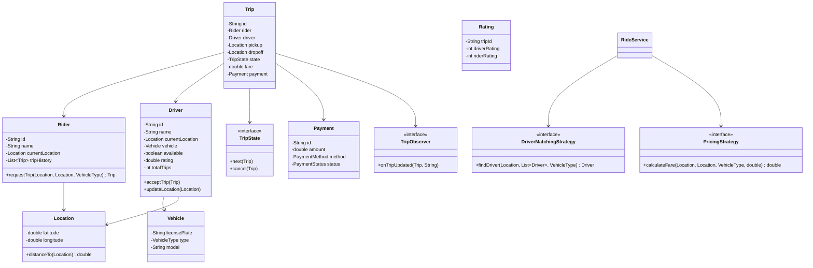
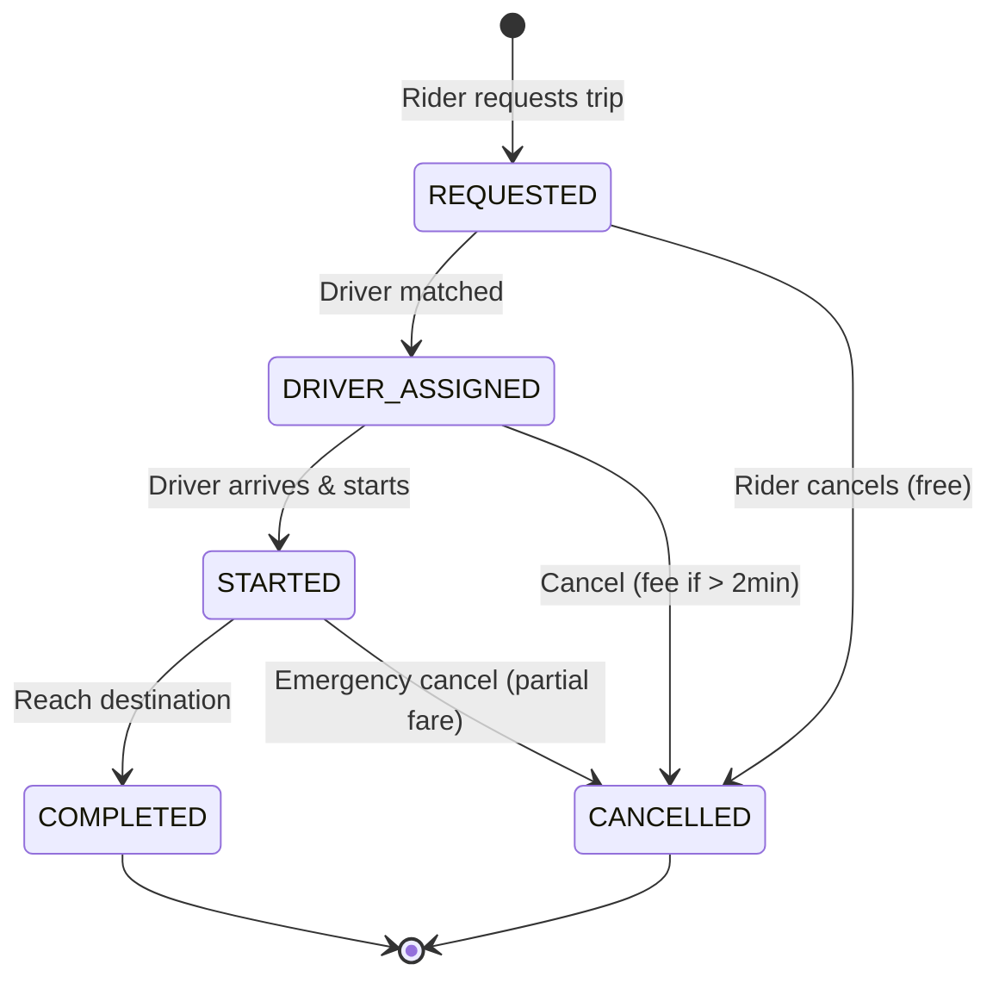
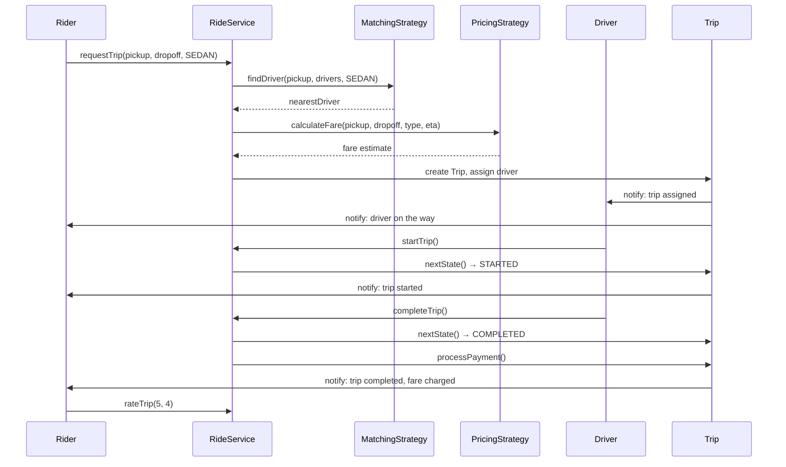

# Low-Level Design: Ride Sharing System (Uber/Ola)

## 1. Problem Statement

Design a ride-sharing platform where riders can request trips, drivers are matched based on configurable strategies, pricing adapts dynamically, and trips follow a well-defined state machine lifecycle.

## 2. UML Class Diagram



## 3. Design Patterns

| Pattern | Usage |
|---------|-------|
| **Strategy** | Driver matching (Nearest, HighestRated, LeastBusy), Pricing (Base, Surge) |
| **State** | Trip lifecycle (Requested → Assigned → Started → Completed/Cancelled) |
| **Observer** | Real-time location updates, trip status notifications |
| **Factory** | Vehicle and trip creation |

## 4. SOLID Principles

- **S**: Each class has single responsibility (Trip manages state, PricingStrategy calculates fare)
- **O**: New matching/pricing strategies without modifying existing code
- **L**: All strategies are interchangeable via interfaces
- **I**: Separate interfaces for matching, pricing, observing
- **D**: RideService depends on abstractions (Strategy interfaces), not concrete implementations

## 5. Complete Java Implementation

```java
// ==================== ENUMS ====================
enum TripStatus { REQUESTED, DRIVER_ASSIGNED, STARTED, COMPLETED, CANCELLED }
enum VehicleType { MINI, SEDAN, SUV, PREMIUM }
enum PaymentMethod { CASH, CARD, WALLET }
enum PaymentStatus { PENDING, COMPLETED, REFUNDED }

// ==================== MODELS ====================
class Location {
    private double latitude;
    private double longitude;

    public Location(double latitude, double longitude) {
        this.latitude = latitude;
        this.longitude = longitude;
    }

    public double distanceTo(Location other) {
        double R = 6371; // km
        double dLat = Math.toRadians(other.latitude - this.latitude);
        double dLon = Math.toRadians(other.longitude - this.longitude);
        double a = Math.sin(dLat/2) * Math.sin(dLat/2) +
                   Math.cos(Math.toRadians(this.latitude)) * Math.cos(Math.toRadians(other.latitude)) *
                   Math.sin(dLon/2) * Math.sin(dLon/2);
        return R * 2 * Math.atan2(Math.sqrt(a), Math.sqrt(1-a));
    }

    // getters
    public double getLatitude() { return latitude; }
    public double getLongitude() { return longitude; }
}

class Vehicle {
    private String licensePlate;
    private VehicleType type;
    private String model;

    public Vehicle(String licensePlate, VehicleType type, String model) {
        this.licensePlate = licensePlate;
        this.type = type;
        this.model = model;
    }

    public VehicleType getType() { return type; }
}

class Rating {
    private String tripId;
    private int driverRating; // 1-5
    private int riderRating;  // 1-5

    public Rating(String tripId, int driverRating, int riderRating) {
        this.tripId = tripId;
        this.driverRating = driverRating;
        this.riderRating = riderRating;
    }

    public int getDriverRating() { return driverRating; }
    public int getRiderRating() { return riderRating; }
}

class Payment {
    private String id;
    private double amount;
    private PaymentMethod method;
    private PaymentStatus status;

    public Payment(String id, double amount, PaymentMethod method) {
        this.id = id;
        this.amount = amount;
        this.method = method;
        this.status = PaymentStatus.PENDING;
    }

    public void complete() { this.status = PaymentStatus.COMPLETED; }
    public void refund() { this.status = PaymentStatus.REFUNDED; }
    public double getAmount() { return amount; }
    public PaymentStatus getStatus() { return status; }
}

class Rider {
    private String id;
    private String name;
    private Location currentLocation;
    private List<Trip> tripHistory = new ArrayList<>();
    private double rating = 5.0;

    public Rider(String id, String name, Location location) {
        this.id = id;
        this.name = name;
        this.currentLocation = location;
    }

    public String getId() { return id; }
    public String getName() { return name; }
    public Location getCurrentLocation() { return currentLocation; }
    public void addTrip(Trip trip) { tripHistory.add(trip); }
}

class Driver {
    private String id;
    private String name;
    private Location currentLocation;
    private Vehicle vehicle;
    private boolean available;
    private double rating = 5.0;
    private int totalTrips = 0;
    private int activeTrips = 0;

    public Driver(String id, String name, Location location, Vehicle vehicle) {
        this.id = id;
        this.name = name;
        this.currentLocation = location;
        this.vehicle = vehicle;
        this.available = true;
    }

    public void updateLocation(Location location) { this.currentLocation = location; }
    public void setAvailable(boolean available) { this.available = available; }
    public void incrementTrips() { totalTrips++; activeTrips++; }
    public void decrementActiveTrips() { activeTrips--; }
    public void updateRating(int newRating) {
        this.rating = (this.rating * totalTrips + newRating) / (totalTrips + 1);
    }

    public String getId() { return id; }
    public Location getCurrentLocation() { return currentLocation; }
    public Vehicle getVehicle() { return vehicle; }
    public boolean isAvailable() { return available; }
    public double getRating() { return rating; }
    public int getTotalTrips() { return totalTrips; }
    public int getActiveTrips() { return activeTrips; }
}

// ==================== OBSERVER PATTERN ====================
interface TripObserver {
    void onTripUpdated(Trip trip, String event);
}

class RiderNotificationObserver implements TripObserver {
    @Override
    public void onTripUpdated(Trip trip, String event) {
        System.out.println("[Rider Notification] Trip " + trip.getId() + ": " + event);
    }
}

class DriverNotificationObserver implements TripObserver {
    @Override
    public void onTripUpdated(Trip trip, String event) {
        System.out.println("[Driver Notification] Trip " + trip.getId() + ": " + event);
    }
}

class LocationTrackingObserver implements TripObserver {
    @Override
    public void onTripUpdated(Trip trip, String event) {
        if (event.startsWith("LOCATION_UPDATE")) {
            System.out.println("[Location Tracking] Trip " + trip.getId() + " location updated");
        }
    }
}

// ==================== STATE PATTERN (Trip Lifecycle) ====================
interface TripState {
    void next(Trip trip);
    void cancel(Trip trip);
    TripStatus getStatus();
}

class RequestedState implements TripState {
    @Override
    public void next(Trip trip) {
        trip.setState(new DriverAssignedState());
        trip.notifyObservers("Driver assigned");
    }
    @Override
    public void cancel(Trip trip) {
        trip.setState(new CancelledState());
        trip.notifyObservers("Trip cancelled by rider (no charge)");
    }
    @Override
    public TripStatus getStatus() { return TripStatus.REQUESTED; }
}

class DriverAssignedState implements TripState {
    @Override
    public void next(Trip trip) {
        trip.setState(new StartedState());
        trip.setStartTime(System.currentTimeMillis());
        trip.notifyObservers("Trip started");
    }
    @Override
    public void cancel(Trip trip) {
        trip.setState(new CancelledState());
        trip.getDriver().setAvailable(true);
        trip.notifyObservers("Trip cancelled (cancellation fee may apply)");
    }
    @Override
    public TripStatus getStatus() { return TripStatus.DRIVER_ASSIGNED; }
}

class StartedState implements TripState {
    @Override
    public void next(Trip trip) {
        trip.setState(new CompletedState());
        trip.setEndTime(System.currentTimeMillis());
        trip.notifyObservers("Trip completed. Fare: $" + trip.getFare());
    }
    @Override
    public void cancel(Trip trip) {
        // Cannot cancel mid-trip, charge partial fare
        trip.setState(new CancelledState());
        trip.notifyObservers("Trip cancelled mid-ride (partial fare charged)");
    }
    @Override
    public TripStatus getStatus() { return TripStatus.STARTED; }
}

class CompletedState implements TripState {
    @Override
    public void next(Trip trip) {
        throw new IllegalStateException("Trip already completed");
    }
    @Override
    public void cancel(Trip trip) {
        throw new IllegalStateException("Cannot cancel a completed trip");
    }
    @Override
    public TripStatus getStatus() { return TripStatus.COMPLETED; }
}

class CancelledState implements TripState {
    @Override
    public void next(Trip trip) {
        throw new IllegalStateException("Trip is cancelled");
    }
    @Override
    public void cancel(Trip trip) {
        throw new IllegalStateException("Trip already cancelled");
    }
    @Override
    public TripStatus getStatus() { return TripStatus.CANCELLED; }
}

// ==================== TRIP ====================
class Trip {
    private String id;
    private Rider rider;
    private Driver driver;
    private Location pickup;
    private Location dropoff;
    private TripState state;
    private double fare;
    private Payment payment;
    private long startTime;
    private long endTime;
    private Rating rating;
    private List<TripObserver> observers = new ArrayList<>();

    public Trip(String id, Rider rider, Location pickup, Location dropoff) {
        this.id = id;
        this.rider = rider;
        this.pickup = pickup;
        this.dropoff = dropoff;
        this.state = new RequestedState();
    }

    public void addObserver(TripObserver observer) { observers.add(observer); }
    public void notifyObservers(String event) {
        observers.forEach(o -> o.onTripUpdated(this, event));
    }

    public void nextState() { state.next(this); }
    public void cancel() { state.cancel(this); }

    public void setState(TripState state) { this.state = state; }
    public void setDriver(Driver driver) { this.driver = driver; }
    public void setFare(double fare) { this.fare = fare; }
    public void setStartTime(long t) { this.startTime = t; }
    public void setEndTime(long t) { this.endTime = t; }
    public void setPayment(Payment payment) { this.payment = payment; }
    public void setRating(Rating rating) { this.rating = rating; }

    public String getId() { return id; }
    public Rider getRider() { return rider; }
    public Driver getDriver() { return driver; }
    public Location getPickup() { return pickup; }
    public Location getDropoff() { return dropoff; }
    public TripStatus getStatus() { return state.getStatus(); }
    public double getFare() { return fare; }
    public long getStartTime() { return startTime; }
    public long getEndTime() { return endTime; }
}

// ==================== STRATEGY: DRIVER MATCHING ====================
interface DriverMatchingStrategy {
    Driver findDriver(Location pickup, List<Driver> drivers, VehicleType type);
}

class NearestDriverStrategy implements DriverMatchingStrategy {
    @Override
    public Driver findDriver(Location pickup, List<Driver> drivers, VehicleType type) {
        return drivers.stream()
            .filter(d -> d.isAvailable() && d.getVehicle().getType() == type)
            .min(Comparator.comparingDouble(d -> d.getCurrentLocation().distanceTo(pickup)))
            .orElseThrow(() -> new RuntimeException("No drivers available"));
    }
}

class HighestRatedDriverStrategy implements DriverMatchingStrategy {
    @Override
    public Driver findDriver(Location pickup, List<Driver> drivers, VehicleType type) {
        return drivers.stream()
            .filter(d -> d.isAvailable() && d.getVehicle().getType() == type)
            .filter(d -> d.getCurrentLocation().distanceTo(pickup) < 10) // within 10km
            .max(Comparator.comparingDouble(Driver::getRating))
            .orElseThrow(() -> new RuntimeException("No drivers available"));
    }
}

class LeastBusyDriverStrategy implements DriverMatchingStrategy {
    @Override
    public Driver findDriver(Location pickup, List<Driver> drivers, VehicleType type) {
        return drivers.stream()
            .filter(d -> d.isAvailable() && d.getVehicle().getType() == type)
            .filter(d -> d.getCurrentLocation().distanceTo(pickup) < 15)
            .min(Comparator.comparingInt(Driver::getActiveTrips))
            .orElseThrow(() -> new RuntimeException("No drivers available"));
    }
}

// ==================== STRATEGY: PRICING ====================
interface PricingStrategy {
    double calculateFare(Location pickup, Location dropoff, VehicleType type, double durationMinutes);
}

class StandardPricingStrategy implements PricingStrategy {
    private static final Map<VehicleType, Double> BASE_FARE = Map.of(
        VehicleType.MINI, 30.0, VehicleType.SEDAN, 50.0,
        VehicleType.SUV, 80.0, VehicleType.PREMIUM, 120.0
    );
    private static final Map<VehicleType, Double> PER_KM = Map.of(
        VehicleType.MINI, 8.0, VehicleType.SEDAN, 12.0,
        VehicleType.SUV, 16.0, VehicleType.PREMIUM, 22.0
    );
    private static final double PER_MINUTE = 1.5;

    @Override
    public double calculateFare(Location pickup, Location dropoff, VehicleType type, double durationMinutes) {
        double distance = pickup.distanceTo(dropoff);
        return BASE_FARE.get(type) + (PER_KM.get(type) * distance) + (PER_MINUTE * durationMinutes);
    }
}

class SurgePricingStrategy implements PricingStrategy {
    private final PricingStrategy baseStrategy;
    private final double surgeMultiplier;

    public SurgePricingStrategy(PricingStrategy baseStrategy, double surgeMultiplier) {
        this.baseStrategy = baseStrategy;
        this.surgeMultiplier = surgeMultiplier;
    }

    @Override
    public double calculateFare(Location pickup, Location dropoff, VehicleType type, double durationMinutes) {
        return baseStrategy.calculateFare(pickup, dropoff, type, durationMinutes) * surgeMultiplier;
    }
}

// ==================== ETA CALCULATOR ====================
class ETACalculator {
    private static final double AVG_SPEED_KMH = 30.0;

    public static double calculateETA(Location from, Location to) {
        double distance = from.distanceTo(to);
        return (distance / AVG_SPEED_KMH) * 60; // minutes
    }
}

// ==================== CANCELLATION POLICY ====================
class CancellationPolicy {
    private static final long FREE_CANCEL_WINDOW_MS = 2 * 60 * 1000; // 2 minutes
    private static final double CANCELLATION_FEE = 50.0;

    public double getCancellationFee(Trip trip) {
        if (trip.getStatus() == TripStatus.REQUESTED) return 0;
        if (trip.getStatus() == TripStatus.DRIVER_ASSIGNED) {
            long elapsed = System.currentTimeMillis() - trip.getStartTime();
            return elapsed < FREE_CANCEL_WINDOW_MS ? 0 : CANCELLATION_FEE;
        }
        if (trip.getStatus() == TripStatus.STARTED) {
            // Partial fare based on distance covered
            return trip.getFare() * 0.5;
        }
        return 0;
    }
}

// ==================== RIDE SERVICE (Main Orchestrator) ====================
class RideService {
    private List<Driver> drivers = new ArrayList<>();
    private List<Trip> trips = new ArrayList<>();
    private DriverMatchingStrategy matchingStrategy;
    private PricingStrategy pricingStrategy;
    private CancellationPolicy cancellationPolicy = new CancellationPolicy();
    private int tripCounter = 0;

    public RideService(DriverMatchingStrategy matchingStrategy, PricingStrategy pricingStrategy) {
        this.matchingStrategy = matchingStrategy;
        this.pricingStrategy = pricingStrategy;
    }

    public void registerDriver(Driver driver) { drivers.add(driver); }

    public void setMatchingStrategy(DriverMatchingStrategy strategy) { this.matchingStrategy = strategy; }
    public void setPricingStrategy(PricingStrategy strategy) { this.pricingStrategy = strategy; }

    public Trip requestTrip(Rider rider, Location pickup, Location dropoff, VehicleType type) {
        Trip trip = new Trip("TRIP-" + (++tripCounter), rider, pickup, dropoff);
        trip.addObserver(new RiderNotificationObserver());
        trip.addObserver(new DriverNotificationObserver());
        trip.addObserver(new LocationTrackingObserver());

        // Find and assign driver
        Driver driver = matchingStrategy.findDriver(pickup, drivers, type);
        trip.setDriver(driver);
        driver.setAvailable(false);
        driver.incrementTrips();

        // Calculate fare estimate
        double eta = ETACalculator.calculateETA(pickup, dropoff);
        double fare = pricingStrategy.calculateFare(pickup, dropoff, type, eta);
        trip.setFare(fare);

        // Advance state: REQUESTED -> DRIVER_ASSIGNED
        trip.nextState();
        trips.add(trip);
        rider.addTrip(trip);
        return trip;
    }

    public void startTrip(Trip trip) { trip.nextState(); }

    public void completeTrip(Trip trip, PaymentMethod method) {
        trip.nextState();
        Payment payment = new Payment("PAY-" + trip.getId(), trip.getFare(), method);
        payment.complete();
        trip.setPayment(payment);
        trip.getDriver().setAvailable(true);
        trip.getDriver().decrementActiveTrips();
    }

    public void cancelTrip(Trip trip) {
        double fee = cancellationPolicy.getCancellationFee(trip);
        trip.cancel();
        if (fee > 0) {
            System.out.println("Cancellation fee: $" + fee);
        }
    }

    public void rateTrip(Trip trip, int driverRating, int riderRating) {
        Rating rating = new Rating(trip.getId(), driverRating, riderRating);
        trip.setRating(rating);
        trip.getDriver().updateRating(driverRating);
        trip.notifyObservers("Rated: Driver=" + driverRating + "/5");
    }

    public double getETA(Location from, Location to) {
        return ETACalculator.calculateETA(from, to);
    }
}

// ==================== DEMO ====================
class RideSharingDemo {
    public static void main(String[] args) {
        RideService service = new RideService(
            new NearestDriverStrategy(),
            new StandardPricingStrategy()
        );

        // Register drivers
        service.registerDriver(new Driver("D1", "Alice", new Location(12.97, 77.59),
            new Vehicle("KA01AB1234", VehicleType.SEDAN, "Honda City")));
        service.registerDriver(new Driver("D2", "Bob", new Location(12.95, 77.60),
            new Vehicle("KA01CD5678", VehicleType.MINI, "Maruti Swift")));

        // Rider requests trip
        Rider rider = new Rider("R1", "Charlie", new Location(12.96, 77.58));
        Location pickup = new Location(12.96, 77.58);
        Location dropoff = new Location(12.93, 77.63);

        Trip trip = service.requestTrip(rider, pickup, dropoff, VehicleType.SEDAN);
        System.out.println("Trip created: " + trip.getId() + " | Fare: $" + trip.getFare());
        System.out.println("ETA: " + service.getETA(trip.getDriver().getCurrentLocation(), pickup) + " min");

        // Start and complete trip
        service.startTrip(trip);
        service.completeTrip(trip, PaymentMethod.CARD);
        service.rateTrip(trip, 5, 4);

        // Surge pricing example
        service.setPricingStrategy(new SurgePricingStrategy(new StandardPricingStrategy(), 1.8));
        System.out.println("\n--- Surge pricing active (1.8x) ---");
    }
}
```

## 6. State Diagram



## 7. Sequence Diagram



## 8. Key Interview Points

| Topic | Discussion Point |
|-------|-----------------|
| **Strategy Pattern** | Easily swap matching/pricing algorithms at runtime; supports A/B testing |
| **State Pattern** | Enforces valid transitions; prevents illegal operations (e.g., cancel after complete) |
| **Observer Pattern** | Decouples notification logic from trip logic; extensible for SMS, push, email |
| **Surge Pricing** | Decorator over base pricing; multiplier driven by demand/supply ratio |
| **Concurrency** | Real system needs thread-safe driver pool, optimistic locking on trip state |
| **Geo-indexing** | Production uses QuadTree/GeoHash for O(log n) nearest driver queries |
| **Scalability** | Partition by city/zone; separate read/write paths for location updates |
| **Cancellation** | Time-window-based policy prevents abuse while remaining fair |
| **ETA** | Simple distance/speed here; production integrates map APIs (Google, OSRM) |
| **Rating** | Rolling average; low-rated drivers deprioritized in matching |
| **Idempotency** | Trip creation must be idempotent to handle network retries |
| **Event Sourcing** | Trip state transitions ideal for event-sourced architecture |
