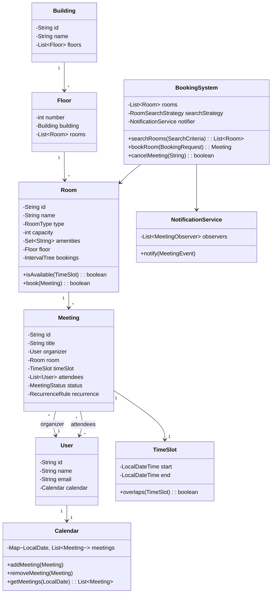

# Meeting Room Booking System - Low-Level Design

## 1. Problem Statement
Design a meeting room booking system that allows users to search available rooms, book meetings, handle recurring meetings, detect conflicts, and send notifications.

## 2. UML Class Diagram



## 3. Design Patterns

| Pattern | Usage |
|---------|-------|
| **Strategy** | Room search algorithms (by capacity, amenities, availability) |
| **Observer** | Notifications on booking, cancellation, reminders |
| **Builder** | Complex Meeting object construction |
| **Singleton** | BookingSystem instance |

## 4. SOLID Principles
- **S**: Each class has single responsibility (Room manages availability, Calendar manages schedule)
- **O**: New search strategies added without modifying BookingSystem
- **L**: All RoomSearchStrategy implementations are interchangeable
- **I**: Separate interfaces for Searchable, Bookable, Observable
- **D**: BookingSystem depends on abstractions (Strategy, Observer interfaces)

## 5. Complete Java Implementation

```java
// ========== ENUMS ==========
public enum RoomType {
    SMALL(4), MEDIUM(8), LARGE(16), CONFERENCE(30);
    private final int defaultCapacity;
    RoomType(int capacity) { this.defaultCapacity = capacity; }
    public int getDefaultCapacity() { return defaultCapacity; }
}

public enum MeetingStatus {
    SCHEDULED, IN_PROGRESS, COMPLETED, CANCELLED
}

public enum RecurrenceType {
    DAILY, WEEKLY, BIWEEKLY, MONTHLY
}

// ========== MODELS ==========
public class TimeSlot {
    private final LocalDateTime start;
    private final LocalDateTime end;

    public TimeSlot(LocalDateTime start, LocalDateTime end) {
        if (!start.isBefore(end)) throw new IllegalArgumentException("Start must be before end");
        this.start = start;
        this.end = end;
    }

    public boolean overlaps(TimeSlot other) {
        return this.start.isBefore(other.end) && other.start.isBefore(this.end);
    }

    public LocalDateTime getStart() { return start; }
    public LocalDateTime getEnd() { return end; }
}

public class User {
    private final String id;
    private final String name;
    private final String email;
    private final Calendar calendar;

    public User(String id, String name, String email) {
        this.id = id; this.name = name; this.email = email;
        this.calendar = new Calendar();
    }
    // getters
    public String getId() { return id; }
    public String getName() { return name; }
    public String getEmail() { return email; }
    public Calendar getCalendar() { return calendar; }
}

public class RecurrenceRule {
    private final RecurrenceType type;
    private final LocalDate endDate;
    private final int occurrences;

    public RecurrenceRule(RecurrenceType type, LocalDate endDate, int occurrences) {
        this.type = type; this.endDate = endDate; this.occurrences = occurrences;
    }

    public List<TimeSlot> generateSlots(TimeSlot baseSlot) {
        List<TimeSlot> slots = new ArrayList<>();
        LocalDateTime current = baseSlot.getStart();
        int count = 0;
        while (current.toLocalDate().isBefore(endDate) && count < occurrences) {
            slots.add(new TimeSlot(current, current.plus(
                Duration.between(baseSlot.getStart(), baseSlot.getEnd()))));
            current = switch (type) {
                case DAILY -> current.plusDays(1);
                case WEEKLY -> current.plusWeeks(1);
                case BIWEEKLY -> current.plusWeeks(2);
                case MONTHLY -> current.plusMonths(1);
            };
            count++;
        }
        return slots;
    }
}

// ========== MEETING BUILDER ==========
public class Meeting {
    private final String id;
    private final String title;
    private final User organizer;
    private Room room;
    private final TimeSlot timeSlot;
    private final List<User> attendees;
    private MeetingStatus status;
    private final RecurrenceRule recurrence;

    private Meeting(Builder builder) {
        this.id = builder.id; this.title = builder.title;
        this.organizer = builder.organizer; this.room = builder.room;
        this.timeSlot = builder.timeSlot; this.attendees = builder.attendees;
        this.status = MeetingStatus.SCHEDULED; this.recurrence = builder.recurrence;
    }

    public void cancel() { this.status = MeetingStatus.CANCELLED; }
    // getters omitted for brevity
    public String getId() { return id; }
    public TimeSlot getTimeSlot() { return timeSlot; }
    public Room getRoom() { return room; }
    public User getOrganizer() { return organizer; }
    public List<User> getAttendees() { return attendees; }
    public MeetingStatus getStatus() { return status; }
    public RecurrenceRule getRecurrence() { return recurrence; }

    public static class Builder {
        private String id;
        private String title;
        private User organizer;
        private Room room;
        private TimeSlot timeSlot;
        private List<User> attendees = new ArrayList<>();
        private RecurrenceRule recurrence;

        public Builder(String id, String title, User organizer, TimeSlot timeSlot) {
            this.id = id; this.title = title;
            this.organizer = organizer; this.timeSlot = timeSlot;
        }
        public Builder room(Room room) { this.room = room; return this; }
        public Builder attendees(List<User> attendees) { this.attendees = attendees; return this; }
        public Builder recurrence(RecurrenceRule rule) { this.recurrence = rule; return this; }
        public Meeting build() { return new Meeting(this); }
    }
}

// ========== INTERVAL TREE FOR EFFICIENT AVAILABILITY ==========
public class IntervalTree {
    private TreeMap<LocalDateTime, Integer> timeline = new TreeMap<>();

    public synchronized boolean isAvailable(TimeSlot slot) {
        // Check if any existing booking overlaps with the given slot
        Map.Entry<LocalDateTime, Integer> entry = timeline.floorEntry(slot.getStart());
        if (entry != null && entry.getValue() > 0) {
            // Find the end of this booking
            LocalDateTime next = timeline.higherKey(entry.getKey());
            if (next != null && next.isAfter(slot.getStart())) return false;
        }
        // Check entries within the slot range
        NavigableMap<LocalDateTime, Integer> sub = timeline.subMap(
            slot.getStart(), false, slot.getEnd(), false);
        return sub.isEmpty();
    }

    public synchronized void addBooking(TimeSlot slot) {
        timeline.put(slot.getStart(), timeline.getOrDefault(slot.getStart(), 0) + 1);
        timeline.put(slot.getEnd(), timeline.getOrDefault(slot.getEnd(), 0) - 1);
    }

    public synchronized void removeBooking(TimeSlot slot) {
        timeline.put(slot.getStart(), timeline.getOrDefault(slot.getStart(), 0) - 1);
        timeline.put(slot.getEnd(), timeline.getOrDefault(slot.getEnd(), 0) + 1);
    }
}

// ========== ROOM ==========
public class Room {
    private final String id;
    private final String name;
    private final RoomType type;
    private final int capacity;
    private final Set<String> amenities;
    private final Floor floor;
    private final IntervalTree bookingTree;
    private final List<Meeting> meetings;

    public Room(String id, String name, RoomType type, int capacity,
                Set<String> amenities, Floor floor) {
        this.id = id; this.name = name; this.type = type;
        this.capacity = capacity; this.amenities = amenities;
        this.floor = floor; this.bookingTree = new IntervalTree();
        this.meetings = new CopyOnWriteArrayList<>();
    }

    public boolean isAvailable(TimeSlot slot) {
        return bookingTree.isAvailable(slot);
    }

    public synchronized boolean book(Meeting meeting) {
        if (!isAvailable(meeting.getTimeSlot())) return false;
        bookingTree.addBooking(meeting.getTimeSlot());
        meetings.add(meeting);
        return true;
    }

    public synchronized void cancelBooking(Meeting meeting) {
        bookingTree.removeBooking(meeting.getTimeSlot());
        meetings.remove(meeting);
    }

    // getters
    public String getId() { return id; }
    public int getCapacity() { return capacity; }
    public Set<String> getAmenities() { return amenities; }
    public Floor getFloor() { return floor; }
    public RoomType getType() { return type; }
}

public class Floor {
    private final int number;
    private final Building building;
    private final List<Room> rooms = new ArrayList<>();

    public Floor(int number, Building building) {
        this.number = number; this.building = building;
    }
    public void addRoom(Room room) { rooms.add(room); }
    public int getNumber() { return number; }
    public List<Room> getRooms() { return rooms; }
    public Building getBuilding() { return building; }
}

public class Building {
    private final String id;
    private final String name;
    private final List<Floor> floors = new ArrayList<>();

    public Building(String id, String name) { this.id = id; this.name = name; }
    public void addFloor(Floor floor) { floors.add(floor); }
    public List<Floor> getFloors() { return floors; }
}

public class Calendar {
    private final Map<LocalDate, List<Meeting>> meetings = new ConcurrentHashMap<>();

    public void addMeeting(Meeting meeting) {
        LocalDate date = meeting.getTimeSlot().getStart().toLocalDate();
        meetings.computeIfAbsent(date, k -> new CopyOnWriteArrayList<>()).add(meeting);
    }

    public void removeMeeting(Meeting meeting) {
        LocalDate date = meeting.getTimeSlot().getStart().toLocalDate();
        meetings.getOrDefault(date, Collections.emptyList()).remove(meeting);
    }

    public List<Meeting> getMeetings(LocalDate date) {
        return meetings.getOrDefault(date, Collections.emptyList());
    }
}

// ========== STRATEGY PATTERN: ROOM SEARCH ==========
public class SearchCriteria {
    private int minCapacity;
    private Set<String> requiredAmenities;
    private Integer floorNumber;
    private TimeSlot timeSlot;
    private RoomType roomType;
    // getters/setters + builder pattern
}

public interface RoomSearchStrategy {
    List<Room> search(List<Room> rooms, SearchCriteria criteria);
}

public class CapacitySearchStrategy implements RoomSearchStrategy {
    @Override
    public List<Room> search(List<Room> rooms, SearchCriteria criteria) {
        return rooms.stream()
            .filter(r -> r.getCapacity() >= criteria.getMinCapacity())
            .sorted(Comparator.comparingInt(Room::getCapacity))
            .collect(Collectors.toList());
    }
}

public class AmenitySearchStrategy implements RoomSearchStrategy {
    @Override
    public List<Room> search(List<Room> rooms, SearchCriteria criteria) {
        return rooms.stream()
            .filter(r -> r.getAmenities().containsAll(criteria.getRequiredAmenities()))
            .collect(Collectors.toList());
    }
}

public class CompositeSearchStrategy implements RoomSearchStrategy {
    private final List<RoomSearchStrategy> strategies;

    public CompositeSearchStrategy(List<RoomSearchStrategy> strategies) {
        this.strategies = strategies;
    }

    @Override
    public List<Room> search(List<Room> rooms, SearchCriteria criteria) {
        List<Room> result = new ArrayList<>(rooms);
        for (RoomSearchStrategy strategy : strategies) {
            result = strategy.search(result, criteria);
        }
        return result;
    }
}

public class AvailabilitySearchStrategy implements RoomSearchStrategy {
    @Override
    public List<Room> search(List<Room> rooms, SearchCriteria criteria) {
        return rooms.stream()
            .filter(r -> r.isAvailable(criteria.getTimeSlot()))
            .collect(Collectors.toList());
    }
}

// ========== OBSERVER PATTERN: NOTIFICATIONS ==========
public enum MeetingEventType {
    INVITED, REMINDER, CANCELLED, UPDATED, STARTED
}

public class MeetingEvent {
    private final Meeting meeting;
    private final MeetingEventType type;
    private final String message;

    public MeetingEvent(Meeting meeting, MeetingEventType type, String message) {
        this.meeting = meeting; this.type = type; this.message = message;
    }
    public Meeting getMeeting() { return meeting; }
    public MeetingEventType getType() { return type; }
    public String getMessage() { return message; }
}

public interface MeetingObserver {
    void onEvent(MeetingEvent event);
}

public class EmailNotifier implements MeetingObserver {
    @Override
    public void onEvent(MeetingEvent event) {
        Meeting m = event.getMeeting();
        List<User> recipients = new ArrayList<>(m.getAttendees());
        recipients.add(m.getOrganizer());
        for (User user : recipients) {
            System.out.printf("[EMAIL] To: %s | %s: %s%n",
                user.getEmail(), event.getType(), event.getMessage());
        }
    }
}

public class SlackNotifier implements MeetingObserver {
    @Override
    public void onEvent(MeetingEvent event) {
        System.out.printf("[SLACK] %s: %s%n", event.getType(), event.getMessage());
    }
}

public class NotificationService {
    private final List<MeetingObserver> observers = new CopyOnWriteArrayList<>();

    public void addObserver(MeetingObserver observer) { observers.add(observer); }
    public void removeObserver(MeetingObserver observer) { observers.remove(observer); }

    public void notify(MeetingEvent event) {
        observers.forEach(o -> o.onEvent(event));
    }
}

// ========== SINGLETON: BOOKING SYSTEM ==========
public class BookingSystem {
    private static volatile BookingSystem instance;
    private final List<Room> rooms = new CopyOnWriteArrayList<>();
    private final Map<String, Meeting> meetingRegistry = new ConcurrentHashMap<>();
    private final NotificationService notificationService;
    private RoomSearchStrategy searchStrategy;

    private BookingSystem() {
        this.notificationService = new NotificationService();
        this.searchStrategy = new CompositeSearchStrategy(List.of(
            new CapacitySearchStrategy(),
            new AmenitySearchStrategy(),
            new AvailabilitySearchStrategy()
        ));
    }

    public static BookingSystem getInstance() {
        if (instance == null) {
            synchronized (BookingSystem.class) {
                if (instance == null) instance = new BookingSystem();
            }
        }
        return instance;
    }

    public void setSearchStrategy(RoomSearchStrategy strategy) {
        this.searchStrategy = strategy;
    }

    public void addRoom(Room room) { rooms.add(room); }

    public List<Room> searchRooms(SearchCriteria criteria) {
        return searchStrategy.search(rooms, criteria);
    }

    public Meeting bookRoom(Meeting.Builder builder, Room room) {
        Meeting meeting = builder.room(room).build();

        // Handle recurring meetings
        if (meeting.getRecurrence() != null) {
            return bookRecurringMeeting(meeting, room);
        }

        if (!room.book(meeting)) {
            throw new ConflictException("Room not available for the requested time slot");
        }

        meetingRegistry.put(meeting.getId(), meeting);
        updateCalendars(meeting);
        notificationService.notify(new MeetingEvent(
            meeting, MeetingEventType.INVITED,
            "You have been invited to: " + meeting.getId()));
        return meeting;
    }

    private Meeting bookRecurringMeeting(Meeting baseMeeting, Room room) {
        List<TimeSlot> slots = baseMeeting.getRecurrence()
            .generateSlots(baseMeeting.getTimeSlot());

        for (TimeSlot slot : slots) {
            if (!room.isAvailable(slot)) {
                throw new ConflictException("Conflict at: " + slot.getStart());
            }
        }
        // All slots available, book them all
        for (TimeSlot slot : slots) {
            Meeting occurrence = new Meeting.Builder(
                UUID.randomUUID().toString(), baseMeeting.getId(),
                baseMeeting.getOrganizer(), slot)
                .room(room)
                .attendees(baseMeeting.getAttendees())
                .build();
            room.book(occurrence);
            meetingRegistry.put(occurrence.getId(), occurrence);
            updateCalendars(occurrence);
        }
        notificationService.notify(new MeetingEvent(
            baseMeeting, MeetingEventType.INVITED,
            "Recurring meeting scheduled: " + baseMeeting.getId()));
        return baseMeeting;
    }

    public boolean cancelMeeting(String meetingId) {
        Meeting meeting = meetingRegistry.get(meetingId);
        if (meeting == null) return false;

        meeting.cancel();
        meeting.getRoom().cancelBooking(meeting);
        removeFromCalendars(meeting);
        notificationService.notify(new MeetingEvent(
            meeting, MeetingEventType.CANCELLED,
            "Meeting cancelled: " + meetingId));
        return true;
    }

    private void updateCalendars(Meeting meeting) {
        meeting.getOrganizer().getCalendar().addMeeting(meeting);
        meeting.getAttendees().forEach(u -> u.getCalendar().addMeeting(meeting));
    }

    private void removeFromCalendars(Meeting meeting) {
        meeting.getOrganizer().getCalendar().removeMeeting(meeting);
        meeting.getAttendees().forEach(u -> u.getCalendar().removeMeeting(meeting));
    }

    public NotificationService getNotificationService() { return notificationService; }
}

public class ConflictException extends RuntimeException {
    public ConflictException(String message) { super(message); }
}

// ========== DEMO ==========
public class MeetingRoomDemo {
    public static void main(String[] args) {
        BookingSystem system = BookingSystem.getInstance();
        system.getNotificationService().addObserver(new EmailNotifier());
        system.getNotificationService().addObserver(new SlackNotifier());

        Building hq = new Building("B1", "HQ");
        Floor floor1 = new Floor(1, hq);
        hq.addFloor(floor1);

        Room room1 = new Room("R1", "Alpha", RoomType.MEDIUM, 8,
            Set.of("PROJECTOR", "WHITEBOARD"), floor1);
        Room room2 = new Room("R2", "Beta", RoomType.LARGE, 20,
            Set.of("PROJECTOR", "VIDEO_CONF", "WHITEBOARD"), floor1);
        floor1.addRoom(room1);
        floor1.addRoom(room2);
        system.addRoom(room1);
        system.addRoom(room2);

        User alice = new User("U1", "Alice", "alice@company.com");
        User bob = new User("U2", "Bob", "bob@company.com");

        // Book a meeting
        TimeSlot slot = new TimeSlot(
            LocalDateTime.of(2024, 3, 15, 10, 0),
            LocalDateTime.of(2024, 3, 15, 11, 0));

        Meeting meeting = system.bookRoom(
            new Meeting.Builder("M1", "Sprint Planning", alice, slot)
                .attendees(List.of(bob)),
            room1);

        // Search rooms
        SearchCriteria criteria = new SearchCriteria();
        criteria.setMinCapacity(10);
        criteria.setRequiredAmenities(Set.of("VIDEO_CONF"));
        List<Room> available = system.searchRooms(criteria);
        System.out.println("Available rooms: " + available.size());

        // Cancel meeting
        system.cancelMeeting("M1");
    }
}
```

## 6. Key Interview Points

| Topic | Detail |
|-------|--------|
| **Conflict Detection** | IntervalTree using TreeMap provides O(log n) overlap checking |
| **Thread Safety** | synchronized booking, ConcurrentHashMap, CopyOnWriteArrayList |
| **Recurring Meetings** | Generate all time slots upfront, validate all before committing |
| **Scalability** | Partition rooms by building/floor; shard by region in distributed setup |
| **Strategy Pattern** | Swap search algorithms at runtime; composite for multi-criteria |
| **Observer Pattern** | Decouple notification channels from booking logic |
| **Builder Pattern** | Complex Meeting construction with optional fields |
| **Trade-offs** | IntervalTree vs simple list scan — tree wins at scale (>100 bookings/room) |
| **Extensions** | Waitlist, auto-suggest alternate rooms, analytics, admin override |
