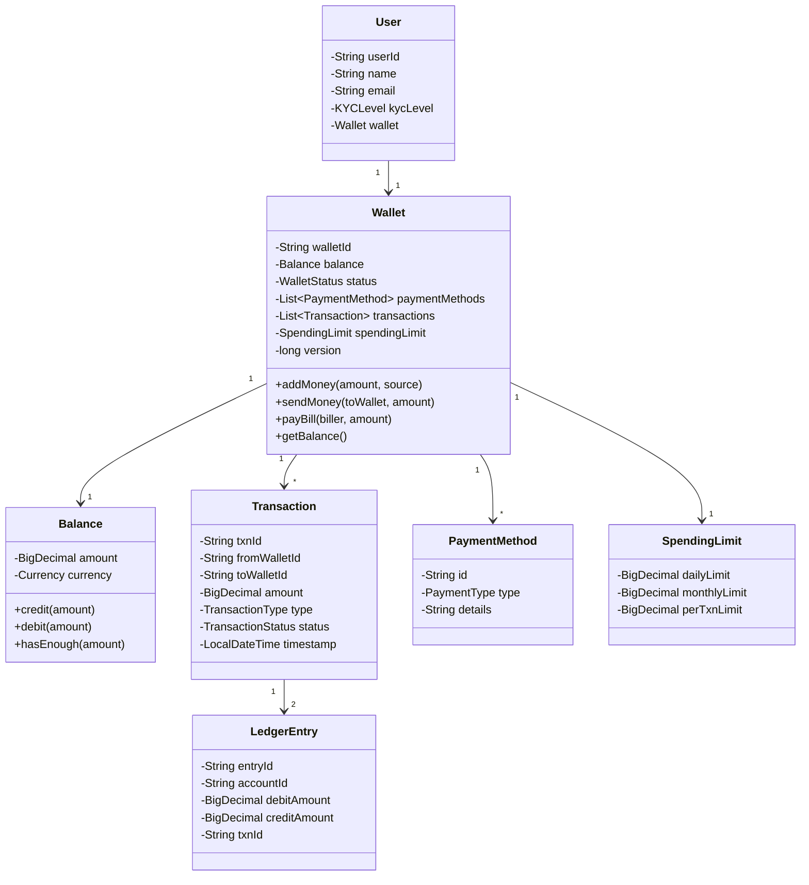

# Digital Wallet - Low-Level Design

## 1. Problem Statement
Design a digital wallet system (like Paytm/PhonePe) supporting add money, send/receive money, pay bills, transaction history, spending limits, and KYC-based restrictions with ACID guarantees.

## 2. UML Class Diagram



## 3. Design Patterns

| Pattern | Usage |
|---------|-------|
| **Strategy** | Payment method selection (UPI, Card, Bank) |
| **State** | Wallet status transitions (ACTIVE, FROZEN, CLOSED) |
| **Observer** | Notifications on transactions (SMS, Email, Push) |
| **Command** | Transaction execution and undo/refund |

## 4. SOLID Principles
- **SRP**: Wallet handles balance; TransactionService handles txn logic
- **OCP**: New payment strategies without modifying existing code
- **LSP**: All PaymentStrategy implementations are interchangeable
- **ISP**: Separate interfaces for Notifiable, Refundable, Auditable
- **DIP**: WalletService depends on abstractions (PaymentStrategy, NotificationObserver)

## 5. Complete Java Implementation

```java
import java.math.*;
import java.time.*;
import java.util.*;
import java.util.concurrent.*;
import java.util.concurrent.atomic.*;

// ============ ENUMS ============

enum TransactionType { CREDIT, DEBIT, TRANSFER, REFUND }
enum TransactionStatus { PENDING, SUCCESS, FAILED, REVERSED }
enum WalletStatus { ACTIVE, FROZEN, CLOSED, KYC_PENDING }
enum KYCLevel { NONE, MINIMUM, FULL }
enum PaymentType { UPI, CARD, BANK_ACCOUNT, WALLET }

// ============ MODELS ============

class Balance {
    private BigDecimal amount;
    private final Currency currency;

    public Balance(Currency currency) {
        this.amount = BigDecimal.ZERO;
        this.currency = currency;
    }

    public synchronized void credit(BigDecimal value) {
        if (value.compareTo(BigDecimal.ZERO) <= 0) throw new IllegalArgumentException("Credit must be positive");
        this.amount = this.amount.add(value);
    }

    public synchronized void debit(BigDecimal value) {
        if (value.compareTo(BigDecimal.ZERO) <= 0) throw new IllegalArgumentException("Debit must be positive");
        if (!hasEnough(value)) throw new InsufficientBalanceException("Insufficient balance");
        this.amount = this.amount.subtract(value);
    }

    public boolean hasEnough(BigDecimal value) { return this.amount.compareTo(value) >= 0; }
    public BigDecimal getAmount() { return amount; }
}

class SpendingLimit {
    private final BigDecimal dailyLimit;
    private final BigDecimal monthlyLimit;
    private final BigDecimal perTxnLimit;
    private BigDecimal dailySpent = BigDecimal.ZERO;
    private BigDecimal monthlySpent = BigDecimal.ZERO;
    private LocalDate lastResetDate = LocalDate.now();

    public SpendingLimit(BigDecimal daily, BigDecimal monthly, BigDecimal perTxn) {
        this.dailyLimit = daily;
        this.monthlyLimit = monthly;
        this.perTxnLimit = perTxn;
    }

    public synchronized void validate(BigDecimal amount) {
        resetIfNeeded();
        if (amount.compareTo(perTxnLimit) > 0)
            throw new LimitExceededException("Per-transaction limit exceeded");
        if (dailySpent.add(amount).compareTo(dailyLimit) > 0)
            throw new LimitExceededException("Daily limit exceeded");
        if (monthlySpent.add(amount).compareTo(monthlyLimit) > 0)
            throw new LimitExceededException("Monthly limit exceeded");
    }

    public synchronized void recordSpend(BigDecimal amount) {
        dailySpent = dailySpent.add(amount);
        monthlySpent = monthlySpent.add(amount);
    }

    private void resetIfNeeded() {
        LocalDate today = LocalDate.now();
        if (!today.equals(lastResetDate)) { dailySpent = BigDecimal.ZERO; lastResetDate = today; }
        if (today.getMonthValue() != lastResetDate.getMonthValue()) monthlySpent = BigDecimal.ZERO;
    }

    public static SpendingLimit forKYC(KYCLevel level) {
        return switch (level) {
            case NONE -> new SpendingLimit(bd(1000), bd(5000), bd(500));
            case MINIMUM -> new SpendingLimit(bd(10000), bd(100000), bd(5000));
            case FULL -> new SpendingLimit(bd(100000), bd(1000000), bd(50000));
        };
    }

    private static BigDecimal bd(long v) { return BigDecimal.valueOf(v); }
}

class PaymentMethod {
    private final String id;
    private final PaymentType type;
    private final String details;

    public PaymentMethod(String id, PaymentType type, String details) {
        this.id = id; this.type = type; this.details = details;
    }
    public PaymentType getType() { return type; }
}

class Transaction {
    private final String txnId;
    private final String fromWalletId;
    private final String toWalletId;
    private final BigDecimal amount;
    private final TransactionType type;
    private TransactionStatus status;
    private final LocalDateTime timestamp;
    private String description;

    public Transaction(String from, String to, BigDecimal amount, TransactionType type) {
        this.txnId = UUID.randomUUID().toString();
        this.fromWalletId = from;
        this.toWalletId = to;
        this.amount = amount;
        this.type = type;
        this.status = TransactionStatus.PENDING;
        this.timestamp = LocalDateTime.now();
    }

    public void markSuccess() { this.status = TransactionStatus.SUCCESS; }
    public void markFailed() { this.status = TransactionStatus.FAILED; }
    public void markReversed() { this.status = TransactionStatus.REVERSED; }

    // Getters
    public String getTxnId() { return txnId; }
    public String getFromWalletId() { return fromWalletId; }
    public String getToWalletId() { return toWalletId; }
    public BigDecimal getAmount() { return amount; }
    public TransactionType getType() { return type; }
    public TransactionStatus getStatus() { return status; }
    public LocalDateTime getTimestamp() { return timestamp; }
}

// Double-entry ledger
class LedgerEntry {
    private final String entryId;
    private final String accountId;
    private final BigDecimal debitAmount;
    private final BigDecimal creditAmount;
    private final String txnId;
    private final LocalDateTime timestamp;

    public LedgerEntry(String accountId, BigDecimal debit, BigDecimal credit, String txnId) {
        this.entryId = UUID.randomUUID().toString();
        this.accountId = accountId;
        this.debitAmount = debit;
        this.creditAmount = credit;
        this.txnId = txnId;
        this.timestamp = LocalDateTime.now();
    }
}

class Wallet {
    private final String walletId;
    private final String userId;
    private final Balance balance;
    private WalletStatus status;
    private final List<PaymentMethod> paymentMethods;
    private final List<Transaction> transactions;
    private SpendingLimit spendingLimit;
    private AtomicLong version = new AtomicLong(0); // Optimistic locking

    public Wallet(String userId, KYCLevel kycLevel) {
        this.walletId = UUID.randomUUID().toString();
        this.userId = userId;
        this.balance = new Balance(Currency.getInstance("INR"));
        this.status = WalletStatus.ACTIVE;
        this.paymentMethods = new CopyOnWriteArrayList<>();
        this.transactions = new CopyOnWriteArrayList<>();
        this.spendingLimit = SpendingLimit.forKYC(kycLevel);
    }

    public String getWalletId() { return walletId; }
    public Balance getBalance() { return balance; }
    public WalletStatus getStatus() { return status; }
    public List<Transaction> getTransactions() { return Collections.unmodifiableList(transactions); }
    public long getVersion() { return version.get(); }

    public boolean compareAndIncrementVersion(long expected) {
        return version.compareAndSet(expected, expected + 1);
    }

    public void addTransaction(Transaction txn) { transactions.add(txn); }
    public void setStatus(WalletStatus s) { this.status = s; }
    public SpendingLimit getSpendingLimit() { return spendingLimit; }
    public void updateKYC(KYCLevel level) { this.spendingLimit = SpendingLimit.forKYC(level); }
}

class User {
    private final String userId;
    private final String name;
    private final String email;
    private KYCLevel kycLevel;
    private final Wallet wallet;

    public User(String name, String email) {
        this.userId = UUID.randomUUID().toString();
        this.name = name;
        this.email = email;
        this.kycLevel = KYCLevel.NONE;
        this.wallet = new Wallet(userId, kycLevel);
    }

    public Wallet getWallet() { return wallet; }
    public String getUserId() { return userId; }
    public KYCLevel getKycLevel() { return kycLevel; }
}

// ============ STRATEGY PATTERN - Payment Processing ============

interface PaymentStrategy {
    boolean processPayment(BigDecimal amount, PaymentMethod method);
    boolean processRefund(BigDecimal amount, String originalTxnId);
}

class UPIPaymentStrategy implements PaymentStrategy {
    public boolean processPayment(BigDecimal amount, PaymentMethod method) {
        System.out.println("Processing UPI payment: " + amount);
        return true; // simulate success
    }
    public boolean processRefund(BigDecimal amount, String txnId) {
        System.out.println("UPI refund: " + amount);
        return true;
    }
}

class CardPaymentStrategy implements PaymentStrategy {
    public boolean processPayment(BigDecimal amount, PaymentMethod method) {
        System.out.println("Processing Card payment: " + amount);
        return true;
    }
    public boolean processRefund(BigDecimal amount, String txnId) {
        System.out.println("Card refund: " + amount);
        return true;
    }
}

class BankTransferStrategy implements PaymentStrategy {
    public boolean processPayment(BigDecimal amount, PaymentMethod method) {
        System.out.println("Processing Bank transfer: " + amount);
        return true;
    }
    public boolean processRefund(BigDecimal amount, String txnId) {
        System.out.println("Bank refund: " + amount);
        return true;
    }
}

// ============ STATE PATTERN - Wallet Status ============

interface WalletState {
    void addMoney(Wallet wallet, BigDecimal amount);
    void sendMoney(Wallet wallet, BigDecimal amount);
    void freeze(Wallet wallet);
    void activate(Wallet wallet);
}

class ActiveState implements WalletState {
    public void addMoney(Wallet w, BigDecimal amt) { w.getBalance().credit(amt); }
    public void sendMoney(Wallet w, BigDecimal amt) { w.getBalance().debit(amt); }
    public void freeze(Wallet w) { w.setStatus(WalletStatus.FROZEN); }
    public void activate(Wallet w) { /* already active */ }
}

class FrozenState implements WalletState {
    public void addMoney(Wallet w, BigDecimal amt) { throw new WalletFrozenException("Wallet frozen"); }
    public void sendMoney(Wallet w, BigDecimal amt) { throw new WalletFrozenException("Wallet frozen"); }
    public void freeze(Wallet w) { /* already frozen */ }
    public void activate(Wallet w) { w.setStatus(WalletStatus.ACTIVE); }
}

// ============ OBSERVER PATTERN - Notifications ============

interface TransactionObserver {
    void onTransactionComplete(Transaction txn);
}

class SMSNotificationObserver implements TransactionObserver {
    public void onTransactionComplete(Transaction txn) {
        System.out.println("[SMS] Txn " + txn.getTxnId() + ": " + txn.getType() + " of " + txn.getAmount());
    }
}

class EmailNotificationObserver implements TransactionObserver {
    public void onTransactionComplete(Transaction txn) {
        System.out.println("[Email] Txn " + txn.getTxnId() + " completed with status: " + txn.getStatus());
    }
}

class FraudDetectionObserver implements TransactionObserver {
    public void onTransactionComplete(Transaction txn) {
        if (txn.getAmount().compareTo(BigDecimal.valueOf(50000)) > 0) {
            System.out.println("[FRAUD ALERT] High-value txn: " + txn.getTxnId());
        }
    }
}

// ============ COMMAND PATTERN - Transaction Execution & Undo ============

interface TransactionCommand {
    Transaction execute();
    void undo();
}

class TransferCommand implements TransactionCommand {
    private final Wallet sender;
    private final Wallet receiver;
    private final BigDecimal amount;
    private Transaction transaction;

    public TransferCommand(Wallet sender, Wallet receiver, BigDecimal amount) {
        this.sender = sender; this.receiver = receiver; this.amount = amount;
    }

    public Transaction execute() {
        transaction = new Transaction(sender.getWalletId(), receiver.getWalletId(), amount, TransactionType.TRANSFER);
        sender.getBalance().debit(amount);
        receiver.getBalance().credit(amount);
        transaction.markSuccess();
        sender.addTransaction(transaction);
        receiver.addTransaction(transaction);
        return transaction;
    }

    public void undo() {
        if (transaction != null && transaction.getStatus() == TransactionStatus.SUCCESS) {
            receiver.getBalance().debit(amount);
            sender.getBalance().credit(amount);
            transaction.markReversed();
            Transaction refund = new Transaction(receiver.getWalletId(), sender.getWalletId(), amount, TransactionType.REFUND);
            refund.markSuccess();
            sender.addTransaction(refund);
            receiver.addTransaction(refund);
        }
    }
}

class AddMoneyCommand implements TransactionCommand {
    private final Wallet wallet;
    private final BigDecimal amount;
    private Transaction transaction;

    public AddMoneyCommand(Wallet wallet, BigDecimal amount) {
        this.wallet = wallet; this.amount = amount;
    }

    public Transaction execute() {
        transaction = new Transaction("EXTERNAL", wallet.getWalletId(), amount, TransactionType.CREDIT);
        wallet.getBalance().credit(amount);
        transaction.markSuccess();
        wallet.addTransaction(transaction);
        return transaction;
    }

    public void undo() {
        if (transaction != null && transaction.getStatus() == TransactionStatus.SUCCESS) {
            wallet.getBalance().debit(amount);
            transaction.markReversed();
        }
    }
}

// ============ SERVICE LAYER ============

class Ledger {
    private final List<LedgerEntry> entries = new CopyOnWriteArrayList<>();

    // Double-entry: every txn creates a debit entry and a credit entry
    public void record(Transaction txn) {
        entries.add(new LedgerEntry(txn.getFromWalletId(), txn.getAmount(), BigDecimal.ZERO, txn.getTxnId()));
        entries.add(new LedgerEntry(txn.getToWalletId(), BigDecimal.ZERO, txn.getAmount(), txn.getTxnId()));
    }

    // Invariant: sum of all debits == sum of all credits
    public boolean isBalanced() {
        BigDecimal totalDebits = entries.stream().map(e -> e.debitAmount).reduce(BigDecimal.ZERO, BigDecimal::add);
        BigDecimal totalCredits = entries.stream().map(e -> e.creditAmount).reduce(BigDecimal.ZERO, BigDecimal::add);
        return totalDebits.compareTo(totalCredits) == 0;
    }
}

class WalletService {
    private final Map<String, Wallet> wallets = new ConcurrentHashMap<>();
    private final List<TransactionObserver> observers = new CopyOnWriteArrayList<>();
    private final Ledger ledger = new Ledger();
    private final Map<PaymentType, PaymentStrategy> strategies = new EnumMap<>(PaymentType.class);
    private final Deque<TransactionCommand> commandHistory = new ConcurrentLinkedDeque<>();

    public WalletService() {
        strategies.put(PaymentType.UPI, new UPIPaymentStrategy());
        strategies.put(PaymentType.CARD, new CardPaymentStrategy());
        strategies.put(PaymentType.BANK_ACCOUNT, new BankTransferStrategy());
    }

    public void registerWallet(Wallet wallet) { wallets.put(wallet.getWalletId(), wallet); }
    public void addObserver(TransactionObserver obs) { observers.add(obs); }

    // Add money with optimistic locking
    public Transaction addMoney(String walletId, BigDecimal amount) {
        Wallet wallet = getWallet(walletId);
        validateWalletActive(wallet);

        long currentVersion = wallet.getVersion();
        AddMoneyCommand cmd = new AddMoneyCommand(wallet, amount);
        Transaction txn = cmd.execute();

        if (!wallet.compareAndIncrementVersion(currentVersion)) {
            cmd.undo();
            throw new OptimisticLockException("Concurrent modification, retry");
        }

        ledger.record(txn);
        commandHistory.push(cmd);
        notifyObservers(txn);
        return txn;
    }

    // Transfer with spending limit validation
    public Transaction sendMoney(String fromWalletId, String toWalletId, BigDecimal amount) {
        Wallet sender = getWallet(fromWalletId);
        Wallet receiver = getWallet(toWalletId);
        validateWalletActive(sender);
        validateWalletActive(receiver);
        sender.getSpendingLimit().validate(amount);

        long senderVersion = sender.getVersion();
        long receiverVersion = receiver.getVersion();

        TransferCommand cmd = new TransferCommand(sender, receiver, amount);
        Transaction txn = cmd.execute();

        if (!sender.compareAndIncrementVersion(senderVersion) ||
            !receiver.compareAndIncrementVersion(receiverVersion)) {
            cmd.undo();
            throw new OptimisticLockException("Concurrent modification, retry");
        }

        sender.getSpendingLimit().recordSpend(amount);
        ledger.record(txn);
        commandHistory.push(cmd);
        notifyObservers(txn);
        return txn;
    }

    public BigDecimal checkBalance(String walletId) {
        return getWallet(walletId).getBalance().getAmount();
    }

    public List<Transaction> getHistory(String walletId) {
        return getWallet(walletId).getTransactions();
    }

    public void undoLastTransaction() {
        TransactionCommand cmd = commandHistory.poll();
        if (cmd != null) cmd.undo();
    }

    private Wallet getWallet(String id) {
        Wallet w = wallets.get(id);
        if (w == null) throw new WalletNotFoundException("Wallet not found: " + id);
        return w;
    }

    private void validateWalletActive(Wallet w) {
        if (w.getStatus() != WalletStatus.ACTIVE) throw new WalletFrozenException("Wallet not active");
    }

    private void notifyObservers(Transaction txn) {
        observers.forEach(obs -> obs.onTransactionComplete(txn));
    }
}

// ============ EXCEPTIONS ============

class InsufficientBalanceException extends RuntimeException {
    public InsufficientBalanceException(String msg) { super(msg); }
}
class WalletFrozenException extends RuntimeException {
    public WalletFrozenException(String msg) { super(msg); }
}
class WalletNotFoundException extends RuntimeException {
    public WalletNotFoundException(String msg) { super(msg); }
}
class LimitExceededException extends RuntimeException {
    public LimitExceededException(String msg) { super(msg); }
}
class OptimisticLockException extends RuntimeException {
    public OptimisticLockException(String msg) { super(msg); }
}

// ============ DEMO ============

class DigitalWalletDemo {
    public static void main(String[] args) {
        WalletService service = new WalletService();
        service.addObserver(new SMSNotificationObserver());
        service.addObserver(new EmailNotificationObserver());
        service.addObserver(new FraudDetectionObserver());

        User alice = new User("Alice", "alice@example.com");
        User bob = new User("Bob", "bob@example.com");
        alice.getWallet().updateKYC(KYCLevel.FULL);
        bob.getWallet().updateKYC(KYCLevel.MINIMUM);

        service.registerWallet(alice.getWallet());
        service.registerWallet(bob.getWallet());

        // Add money
        service.addMoney(alice.getWallet().getWalletId(), BigDecimal.valueOf(10000));
        System.out.println("Alice balance: " + service.checkBalance(alice.getWallet().getWalletId()));

        // Transfer
        service.sendMoney(alice.getWallet().getWalletId(), bob.getWallet().getWalletId(), BigDecimal.valueOf(3000));
        System.out.println("Alice balance: " + service.checkBalance(alice.getWallet().getWalletId()));
        System.out.println("Bob balance: " + service.checkBalance(bob.getWallet().getWalletId()));

        // Undo last transfer
        service.undoLastTransaction();
        System.out.println("After undo - Alice: " + service.checkBalance(alice.getWallet().getWalletId()));
        System.out.println("After undo - Bob: " + service.checkBalance(bob.getWallet().getWalletId()));
    }
}
```

## 6. Key Interview Points

### Financial System Invariants
- **Conservation of money**: Total money in system = sum of all wallet balances + float account (double-entry ledger ensures this)
- **No negative balances**: Debit rejected if insufficient funds
- **Idempotency**: Each transaction has a unique ID; retries don't duplicate effects
- **Audit trail**: Every state change is recorded; no mutation without a ledger entry

### ACID Properties
| Property | Implementation |
|----------|---------------|
| **Atomicity** | Command pattern - execute/undo as atomic unit; both wallets updated or neither |
| **Consistency** | Spending limits, balance checks, KYC validation before every operation |
| **Isolation** | Optimistic locking with version check prevents lost updates |
| **Durability** | Ledger entries persist (in production: WAL + DB transactions) |

### Concurrency Approach
- **Optimistic Locking**: `AtomicLong` version on each wallet; CAS before commit
- **CopyOnWriteArrayList**: Thread-safe transaction history reads
- **Synchronized balance ops**: Prevent race in credit/debit at object level
- **Retry semantics**: On version mismatch, undo and throw for caller retry

### Why Double-Entry Bookkeeping?
Every transaction creates two entries (debit from source, credit to destination). This ensures:
- Sum of all debits always equals sum of all credits
- Easy reconciliation and auditing
- Errors are detectable by checking the invariant

### Production Considerations
- Distributed locks (Redis/Zookeeper) for cross-service wallet operations
- Event sourcing for complete audit trail
- Saga pattern for multi-step transactions (wallet + bank)
- Rate limiting to prevent abuse
- PCI-DSS compliance for card data
