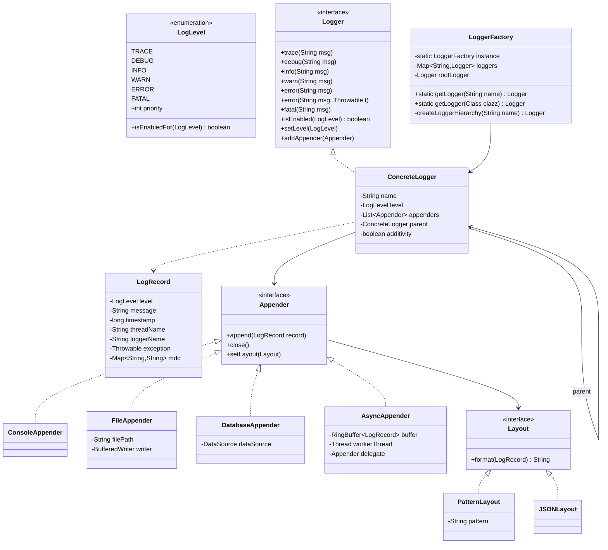

# Low-Level Design: Logging Framework (Log4j/SLF4J Style)

## 1. Problem Statement

Design a flexible, thread-safe logging framework that supports multiple log levels, configurable appenders (console, file, database), formatters, logger hierarchy, and async logging — similar to Log4j/SLF4J.

## 2. UML Class Diagram



## 3. Design Patterns

| Pattern | Usage |
|---------|-------|
| **Singleton** | LoggerFactory — single registry of all loggers |
| **Factory Method** | LoggerFactory.getLogger() creates/retrieves loggers |
| **Chain of Responsibility** | Logger hierarchy — log propagates to parent loggers |
| **Strategy** | Appender interface — swap console/file/DB at runtime |
| **Builder** | LogRecord construction, Configuration builder |
| **Observer** | Appenders observe log events from logger |
| **Template Method** | Base appender with common filtering logic |

## 4. SOLID Principles

- **SRP**: Logger logs, Appender writes, Layout formats, LogRecord holds data
- **OCP**: New appenders/layouts added without modifying existing code
- **LSP**: Any Appender substitutable wherever Appender interface is used
- **ISP**: Separate Logger, Appender, Layout interfaces — focused contracts
- **DIP**: Logger depends on Appender interface, not concrete implementations

## 5. Complete Java Implementation

### LogLevel Enum

```java
public enum LogLevel {
    TRACE(0), DEBUG(1), INFO(2), WARN(3), ERROR(4), FATAL(5);

    private final int priority;

    LogLevel(int priority) { this.priority = priority; }

    public int getPriority() { return priority; }

    public boolean isEnabledFor(LogLevel threshold) {
        return this.priority >= threshold.priority;
    }
}
```

### LogRecord

```java
public class LogRecord {
    private final LogLevel level;
    private final String message;
    private final long timestamp;
    private final String threadName;
    private final String loggerName;
    private final Throwable exception;
    private final Map<String, String> mdc;

    private LogRecord(Builder builder) {
        this.level = builder.level;
        this.message = builder.message;
        this.timestamp = builder.timestamp;
        this.threadName = builder.threadName;
        this.loggerName = builder.loggerName;
        this.exception = builder.exception;
        this.mdc = builder.mdc;
    }

    // Getters omitted for brevity

    public LogLevel getLevel() { return level; }
    public String getMessage() { return message; }
    public long getTimestamp() { return timestamp; }
    public String getThreadName() { return threadName; }
    public String getLoggerName() { return loggerName; }
    public Throwable getException() { return exception; }
    public Map<String, String> getMdc() { return mdc; }

    public static class Builder {
        private LogLevel level;
        private String message;
        private long timestamp = System.currentTimeMillis();
        private String threadName = Thread.currentThread().getName();
        private String loggerName;
        private Throwable exception;
        private Map<String, String> mdc = Collections.emptyMap();

        public Builder level(LogLevel level) { this.level = level; return this; }
        public Builder message(String msg) { this.message = msg; return this; }
        public Builder loggerName(String name) { this.loggerName = name; return this; }
        public Builder exception(Throwable t) { this.exception = t; return this; }
        public Builder mdc(Map<String, String> mdc) { this.mdc = mdc; return this; }

        public LogRecord build() { return new LogRecord(this); }
    }
}
```

### Layout Interface & Implementations (Strategy)

```java
public interface Layout {
    String format(LogRecord record);
}

public class PatternLayout implements Layout {
    // Pattern: %d{timestamp} %t{thread} %l{level} %c{logger} - %m{message}%n
    private final String pattern;

    public PatternLayout(String pattern) { this.pattern = pattern; }

    public PatternLayout() { this("%d [%t] %-5l %c - %m%n"); }

    @Override
    public String format(LogRecord record) {
        SimpleDateFormat sdf = new SimpleDateFormat("yyyy-MM-dd HH:mm:ss.SSS");
        StringBuilder sb = new StringBuilder();

        String result = pattern
            .replace("%d", sdf.format(new Date(record.getTimestamp())))
            .replace("%t", record.getThreadName())
            .replace("%-5l", String.format("%-5s", record.getLevel()))
            .replace("%l", record.getLevel().toString())
            .replace("%c", record.getLoggerName())
            .replace("%m", record.getMessage())
            .replace("%n", System.lineSeparator());

        if (record.getException() != null) {
            StringWriter sw = new StringWriter();
            record.getException().printStackTrace(new PrintWriter(sw));
            result += sw.toString();
        }
        return result;
    }
}

public class JSONLayout implements Layout {
    @Override
    public String format(LogRecord record) {
        StringBuilder sb = new StringBuilder();
        sb.append("{");
        sb.append("\"timestamp\":\"").append(Instant.ofEpochMilli(record.getTimestamp())).append("\",");
        sb.append("\"level\":\"").append(record.getLevel()).append("\",");
        sb.append("\"thread\":\"").append(record.getThreadName()).append("\",");
        sb.append("\"logger\":\"").append(record.getLoggerName()).append("\",");
        sb.append("\"message\":\"").append(escapeJson(record.getMessage())).append("\"");
        if (record.getException() != null) {
            StringWriter sw = new StringWriter();
            record.getException().printStackTrace(new PrintWriter(sw));
            sb.append(",\"exception\":\"").append(escapeJson(sw.toString())).append("\"");
        }
        sb.append("}").append(System.lineSeparator());
        return sb.toString();
    }

    private String escapeJson(String s) {
        return s.replace("\\", "\\\\").replace("\"", "\\\"")
                .replace("\n", "\\n").replace("\r", "\\r");
    }
}
```

### Appender Interface & Implementations (Strategy)

```java
public interface Appender {
    void append(LogRecord record);
    void close();
    void setLayout(Layout layout);
    String getName();
}

public abstract class AbstractAppender implements Appender {
    protected String name;
    protected Layout layout = new PatternLayout();
    protected LogLevel threshold = LogLevel.TRACE;

    public AbstractAppender(String name) { this.name = name; }

    @Override
    public void setLayout(Layout layout) { this.layout = layout; }

    @Override
    public String getName() { return name; }

    public void setThreshold(LogLevel threshold) { this.threshold = threshold; }

    @Override
    public void append(LogRecord record) {
        if (record.getLevel().isEnabledFor(threshold)) {
            doAppend(record);
        }
    }

    protected abstract void doAppend(LogRecord record);
}

public class ConsoleAppender extends AbstractAppender {
    private final PrintStream stream;

    public ConsoleAppender() { this("Console", System.out); }

    public ConsoleAppender(String name, PrintStream stream) {
        super(name);
        this.stream = stream;
    }

    @Override
    protected void doAppend(LogRecord record) {
        stream.print(layout.format(record));
    }

    @Override
    public void close() { /* no-op for console */ }
}

public class FileAppender extends AbstractAppender {
    private final String filePath;
    private BufferedWriter writer;
    private final ReentrantLock lock = new ReentrantLock();

    public FileAppender(String name, String filePath) {
        super(name);
        this.filePath = filePath;
        try {
            this.writer = new BufferedWriter(new FileWriter(filePath, true));
        } catch (IOException e) {
            throw new RuntimeException("Cannot open log file: " + filePath, e);
        }
    }

    @Override
    protected void doAppend(LogRecord record) {
        lock.lock();
        try {
            writer.write(layout.format(record));
            writer.flush();
        } catch (IOException e) {
            System.err.println("Failed to write log: " + e.getMessage());
        } finally {
            lock.unlock();
        }
    }

    @Override
    public void close() {
        lock.lock();
        try { writer.close(); } catch (IOException e) { /* ignore */ }
        finally { lock.unlock(); }
    }
}

public class DatabaseAppender extends AbstractAppender {
    private final DataSource dataSource;
    private final String tableName;

    public DatabaseAppender(String name, DataSource dataSource, String tableName) {
        super(name);
        this.dataSource = dataSource;
        this.tableName = tableName;
    }

    @Override
    protected void doAppend(LogRecord record) {
        String sql = "INSERT INTO " + tableName +
            " (timestamp, level, thread, logger, message, exception) VALUES (?,?,?,?,?,?)";
        try (Connection conn = dataSource.getConnection();
             PreparedStatement ps = conn.prepareStatement(sql)) {
            ps.setTimestamp(1, new Timestamp(record.getTimestamp()));
            ps.setString(2, record.getLevel().name());
            ps.setString(3, record.getThreadName());
            ps.setString(4, record.getLoggerName());
            ps.setString(5, record.getMessage());
            ps.setString(6, record.getException() != null ?
                record.getException().toString() : null);
            ps.executeUpdate();
        } catch (SQLException e) {
            System.err.println("DB log failed: " + e.getMessage());
        }
    }

    @Override
    public void close() { /* DataSource managed externally */ }
}
```

### AsyncAppender with Ring Buffer

```java
public class AsyncAppender extends AbstractAppender {
    private final Appender delegate;
    private final ArrayBlockingQueue<LogRecord> ringBuffer;
    private final Thread workerThread;
    private volatile boolean running = true;

    public AsyncAppender(String name, Appender delegate, int bufferSize) {
        super(name);
        this.delegate = delegate;
        this.ringBuffer = new ArrayBlockingQueue<>(bufferSize);
        this.workerThread = new Thread(this::processLogs, "AsyncLogger-" + name);
        this.workerThread.setDaemon(true);
        this.workerThread.start();
    }

    public AsyncAppender(String name, Appender delegate) {
        this(name, delegate, 1024);
    }

    @Override
    protected void doAppend(LogRecord record) {
        if (!ringBuffer.offer(record)) {
            // Buffer full — drop or fallback to sync
            System.err.println("WARN: Async log buffer full, dropping message");
        }
    }

    private void processLogs() {
        while (running || !ringBuffer.isEmpty()) {
            try {
                LogRecord record = ringBuffer.poll(100, TimeUnit.MILLISECONDS);
                if (record != null) {
                    delegate.append(record);
                }
            } catch (InterruptedException e) {
                Thread.currentThread().interrupt();
                break;
            }
        }
        // Drain remaining
        LogRecord record;
        while ((record = ringBuffer.poll()) != null) {
            delegate.append(record);
        }
    }

    @Override
    public void close() {
        running = false;
        try { workerThread.join(5000); } catch (InterruptedException e) { /* ignore */ }
        delegate.close();
    }
}
```

### Logger Interface & ConcreteLogger (Chain of Responsibility)

```java
public interface Logger {
    void trace(String msg);
    void debug(String msg);
    void info(String msg);
    void warn(String msg);
    void error(String msg);
    void error(String msg, Throwable t);
    void fatal(String msg);
    void log(LogLevel level, String msg);
    void log(LogLevel level, String msg, Throwable t);
    boolean isEnabled(LogLevel level);
    void setLevel(LogLevel level);
    void addAppender(Appender appender);
    String getName();
}

public class ConcreteLogger implements Logger {
    private final String name;
    private volatile LogLevel level;  // null means inherit from parent
    private final List<Appender> appenders = new CopyOnWriteArrayList<>();
    private ConcreteLogger parent;
    private boolean additivity = true; // propagate to parent (Chain of Responsibility)

    public ConcreteLogger(String name) {
        this.name = name;
    }

    public ConcreteLogger(String name, LogLevel level) {
        this.name = name;
        this.level = level;
    }

    public void setParent(ConcreteLogger parent) { this.parent = parent; }
    public void setAdditivity(boolean additivity) { this.additivity = additivity; }

    @Override
    public String getName() { return name; }

    @Override
    public void setLevel(LogLevel level) { this.level = level; }

    @Override
    public void addAppender(Appender appender) { appenders.add(appender); }

    // Effective level: walk up hierarchy until a level is found
    public LogLevel getEffectiveLevel() {
        if (level != null) return level;
        if (parent != null) return parent.getEffectiveLevel();
        return LogLevel.DEBUG; // default
    }

    @Override
    public boolean isEnabled(LogLevel level) {
        return level.isEnabledFor(getEffectiveLevel());
    }

    @Override
    public void log(LogLevel level, String msg) { log(level, msg, null); }

    @Override
    public void log(LogLevel level, String msg, Throwable t) {
        if (!isEnabled(level)) return;

        LogRecord record = new LogRecord.Builder()
            .level(level)
            .message(msg)
            .loggerName(name)
            .exception(t)
            .build();

        // Dispatch to own appenders
        for (Appender appender : appenders) {
            appender.append(record);
        }

        // Chain of Responsibility: propagate to parent
        if (additivity && parent != null) {
            parent.appendFromChild(record);
        }
    }

    // Called by child loggers — no level check needed (already passed)
    void appendFromChild(LogRecord record) {
        for (Appender appender : appenders) {
            appender.append(record);
        }
        if (additivity && parent != null) {
            parent.appendFromChild(record);
        }
    }

    @Override
    public void trace(String msg) { log(LogLevel.TRACE, msg); }
    @Override
    public void debug(String msg) { log(LogLevel.DEBUG, msg); }
    @Override
    public void info(String msg) { log(LogLevel.INFO, msg); }
    @Override
    public void warn(String msg) { log(LogLevel.WARN, msg); }
    @Override
    public void error(String msg) { log(LogLevel.ERROR, msg); }
    @Override
    public void error(String msg, Throwable t) { log(LogLevel.ERROR, msg, t); }
    @Override
    public void fatal(String msg) { log(LogLevel.FATAL, msg); }
}
```

### LoggerFactory (Singleton + Factory)

```java
public class LoggerFactory {
    private static volatile LoggerFactory instance;
    private final ConcurrentHashMap<String, ConcreteLogger> loggers = new ConcurrentHashMap<>();
    private final ConcreteLogger rootLogger;

    private LoggerFactory() {
        rootLogger = new ConcreteLogger("ROOT", LogLevel.DEBUG);
        rootLogger.addAppender(new ConsoleAppender());
        loggers.put("ROOT", rootLogger);
    }

    public static LoggerFactory getInstance() {
        if (instance == null) {
            synchronized (LoggerFactory.class) {
                if (instance == null) {
                    instance = new LoggerFactory();
                }
            }
        }
        return instance;
    }

    public static Logger getLogger(String name) {
        return getInstance().getOrCreateLogger(name);
    }

    public static Logger getLogger(Class<?> clazz) {
        return getLogger(clazz.getName());
    }

    private Logger getOrCreateLogger(String name) {
        return loggers.computeIfAbsent(name, this::createLogger);
    }

    // Creates logger hierarchy: com.app.Service -> com.app -> com -> ROOT
    private ConcreteLogger createLogger(String name) {
        ConcreteLogger logger = new ConcreteLogger(name);
        ConcreteLogger parent = findParent(name);
        logger.setParent(parent);
        return logger;
    }

    private ConcreteLogger findParent(String name) {
        int lastDot = name.lastIndexOf('.');
        while (lastDot > 0) {
            String parentName = name.substring(0, lastDot);
            ConcreteLogger parent = loggers.get(parentName);
            if (parent != null) return parent;
            lastDot = parentName.lastIndexOf('.');
        }
        return rootLogger;
    }

    public ConcreteLogger getRootLogger() { return rootLogger; }

    // Configuration API
    public void configure(LoggingConfig config) {
        config.apply(this);
    }
}
```

### Configuration

```java
public class LoggingConfig {
    private LogLevel rootLevel = LogLevel.DEBUG;
    private final List<Appender> rootAppenders = new ArrayList<>();
    private final Map<String, LogLevel> loggerLevels = new HashMap<>();

    public static LoggingConfig builder() { return new LoggingConfig(); }

    public LoggingConfig rootLevel(LogLevel level) {
        this.rootLevel = level; return this;
    }

    public LoggingConfig addRootAppender(Appender appender) {
        rootAppenders.add(appender); return this;
    }

    public LoggingConfig setLoggerLevel(String name, LogLevel level) {
        loggerLevels.put(name, level); return this;
    }

    public void apply(LoggerFactory factory) {
        ConcreteLogger root = factory.getRootLogger();
        root.setLevel(rootLevel);
        rootAppenders.forEach(root::addAppender);
        loggerLevels.forEach((name, level) -> {
            Logger logger = LoggerFactory.getLogger(name);
            logger.setLevel(level);
        });
    }
}
```

### Usage Example

```java
public class Application {
    public static void main(String[] args) {
        // Programmatic configuration
        FileAppender fileAppender = new FileAppender("File", "/var/log/app.log");
        fileAppender.setLayout(new JSONLayout());

        AsyncAppender asyncFile = new AsyncAppender("AsyncFile", fileAppender);

        LoggingConfig.builder()
            .rootLevel(LogLevel.INFO)
            .addRootAppender(new ConsoleAppender())
            .addRootAppender(asyncFile)
            .setLoggerLevel("com.app.db", LogLevel.DEBUG)
            .apply(LoggerFactory.getInstance());

        // Usage
        Logger logger = LoggerFactory.getLogger(Application.class);
        logger.info("Application started");
        logger.debug("This won't print — root level is INFO");

        Logger dbLogger = LoggerFactory.getLogger("com.app.db");
        dbLogger.debug("This WILL print — specific level is DEBUG");

        try {
            riskyOperation();
        } catch (Exception e) {
            logger.error("Operation failed", e);
        }
    }
}
```

## 6. Key Interview Points

| Topic | Insight |
|-------|---------|
| **Chain of Responsibility** | Logger hierarchy propagates log events upward (child → parent → root) via `additivity` flag |
| **Strategy** | Appenders are interchangeable output strategies; Layouts are formatting strategies |
| **Thread Safety** | `ConcurrentHashMap` for logger registry, `CopyOnWriteArrayList` for appenders, `volatile` for level, `ReentrantLock` in FileAppender |
| **Async** | Ring buffer (bounded queue) decouples logging from I/O; daemon thread drains buffer |
| **Hierarchy** | `com.app.Service` inherits level from `com.app` → `com` → ROOT — avoids per-logger config |
| **Performance** | `isEnabled()` short-circuits before LogRecord allocation; async avoids I/O on hot path |
| **Extensibility** | Add new Appender (Kafka, ElasticSearch) or Layout (XML) without changing core |
| **Real-world parallel** | Mirrors SLF4J facade + Logback/Log4j2 implementation split |
