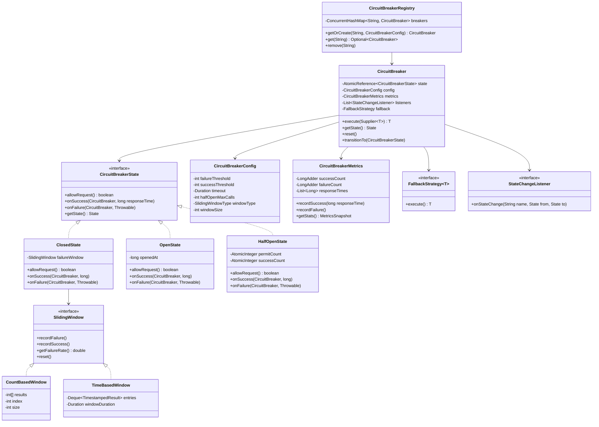
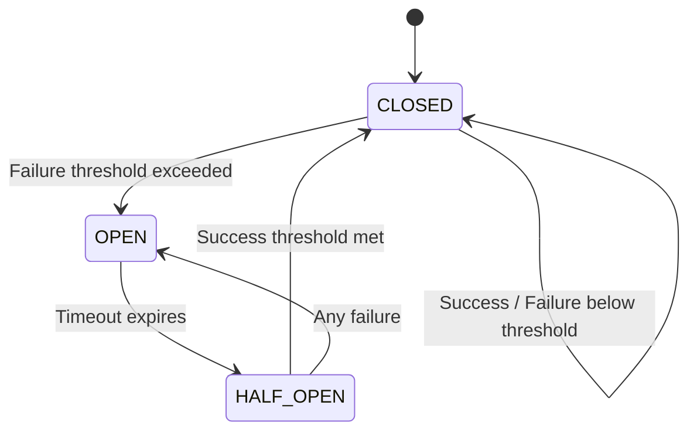

# Circuit Breaker Pattern - Low-Level Design

## 1. Problem Statement
Design a Circuit Breaker pattern that prevents cascading failures in distributed systems by wrapping calls to external services, monitoring failures, and short-circuiting requests when a service is unhealthy.

## 2. UML Class Diagram



## 3. State Machine Diagram



## 4. Design Patterns Used
- **State Pattern**: CLOSED, OPEN, HALF_OPEN states with polymorphic behavior
- **Strategy Pattern**: SlidingWindow (count-based vs time-based), FallbackStrategy
- **Observer Pattern**: StateChangeListener for notifications
- **Registry Pattern**: CircuitBreakerRegistry for managing named breakers

## 5. SOLID Principles
- **SRP**: Each state handles its own logic; Metrics tracks stats separately
- **OCP**: New window types or states can be added without modifying CircuitBreaker
- **LSP**: All states are interchangeable via CircuitBreakerState interface
- **ISP**: Separate interfaces for SlidingWindow, FallbackStrategy, StateChangeListener
- **DIP**: CircuitBreaker depends on abstractions (interfaces), not concrete states

## 6. Complete Java Implementation

```java
import java.time.*;
import java.util.*;
import java.util.concurrent.*;
import java.util.concurrent.atomic.*;
import java.util.function.Supplier;

// ─── Enums & Config ───────────────────────────────────────────────
enum State { CLOSED, OPEN, HALF_OPEN }
enum SlidingWindowType { COUNT_BASED, TIME_BASED }

class CircuitBreakerConfig {
    private final int failureThreshold;
    private final int successThreshold;
    private final Duration timeout;
    private final int halfOpenMaxCalls;
    private final SlidingWindowType windowType;
    private final int windowSize;

    private CircuitBreakerConfig(Builder b) {
        this.failureThreshold = b.failureThreshold;
        this.successThreshold = b.successThreshold;
        this.timeout = b.timeout;
        this.halfOpenMaxCalls = b.halfOpenMaxCalls;
        this.windowType = b.windowType;
        this.windowSize = b.windowSize;
    }

    public int getFailureThreshold() { return failureThreshold; }
    public int getSuccessThreshold() { return successThreshold; }
    public Duration getTimeout() { return timeout; }
    public int getHalfOpenMaxCalls() { return halfOpenMaxCalls; }
    public SlidingWindowType getWindowType() { return windowType; }
    public int getWindowSize() { return windowSize; }

    static class Builder {
        private int failureThreshold = 5;
        private int successThreshold = 3;
        private Duration timeout = Duration.ofSeconds(30);
        private int halfOpenMaxCalls = 3;
        private SlidingWindowType windowType = SlidingWindowType.COUNT_BASED;
        private int windowSize = 10;

        public Builder failureThreshold(int v) { failureThreshold = v; return this; }
        public Builder successThreshold(int v) { successThreshold = v; return this; }
        public Builder timeout(Duration v) { timeout = v; return this; }
        public Builder halfOpenMaxCalls(int v) { halfOpenMaxCalls = v; return this; }
        public Builder windowType(SlidingWindowType v) { windowType = v; return this; }
        public Builder windowSize(int v) { windowSize = v; return this; }
        public CircuitBreakerConfig build() { return new CircuitBreakerConfig(this); }
    }
}

// ─── Sliding Window ───────────────────────────────────────────────
interface SlidingWindow {
    void recordFailure();
    void recordSuccess();
    double getFailureRate();
    void reset();
}

class CountBasedWindow implements SlidingWindow {
    private final int size;
    private final boolean[] results; // true = failure
    private int index = 0;
    private int totalRecorded = 0;

    public CountBasedWindow(int size) {
        this.size = size;
        this.results = new boolean[size];
    }

    public synchronized void recordFailure() {
        results[index % size] = true;
        index++;
        totalRecorded++;
    }

    public synchronized void recordSuccess() {
        results[index % size] = false;
        index++;
        totalRecorded++;
    }

    public synchronized double getFailureRate() {
        int count = Math.min(totalRecorded, size);
        if (count == 0) return 0.0;
        int failures = 0;
        for (int i = 0; i < count; i++) {
            if (results[i]) failures++;
        }
        return (double) failures / count * 100;
    }

    public synchronized void reset() {
        Arrays.fill(results, false);
        index = 0;
        totalRecorded = 0;
    }
}

class TimeBasedWindow implements SlidingWindow {
    private final Duration windowDuration;
    private final Deque<Map.Entry<Instant, Boolean>> entries = new ConcurrentLinkedDeque<>();

    public TimeBasedWindow(Duration windowDuration) {
        this.windowDuration = windowDuration;
    }

    public void recordFailure() {
        entries.addLast(Map.entry(Instant.now(), true));
        evict();
    }

    public void recordSuccess() {
        entries.addLast(Map.entry(Instant.now(), false));
        evict();
    }

    public double getFailureRate() {
        evict();
        if (entries.isEmpty()) return 0.0;
        long failures = entries.stream().filter(Map.Entry::getValue).count();
        return (double) failures / entries.size() * 100;
    }

    public void reset() { entries.clear(); }

    private void evict() {
        Instant cutoff = Instant.now().minus(windowDuration);
        while (!entries.isEmpty() && entries.peekFirst().getKey().isBefore(cutoff)) {
            entries.pollFirst();
        }
    }
}

// ─── Metrics ──────────────────────────────────────────────────────
class CircuitBreakerMetrics {
    private final LongAdder successCount = new LongAdder();
    private final LongAdder failureCount = new LongAdder();
    private final List<Long> responseTimes = Collections.synchronizedList(new ArrayList<>());

    public void recordSuccess(long responseTimeMs) {
        successCount.increment();
        responseTimes.add(responseTimeMs);
    }

    public void recordFailure() { failureCount.increment(); }

    public long getSuccessCount() { return successCount.sum(); }
    public long getFailureCount() { return failureCount.sum(); }

    public double getAverageResponseTime() {
        synchronized (responseTimes) {
            return responseTimes.stream().mapToLong(Long::longValue).average().orElse(0);
        }
    }

    public void reset() {
        successCount.reset();
        failureCount.reset();
        responseTimes.clear();
    }
}

// ─── Fallback & Observer ──────────────────────────────────────────
@FunctionalInterface
interface FallbackStrategy<T> {
    T execute();
}

@FunctionalInterface
interface StateChangeListener {
    void onStateChange(String name, State from, State to);
}

// ─── State Pattern ────────────────────────────────────────────────
interface CircuitBreakerState {
    boolean allowRequest();
    void onSuccess(CircuitBreaker cb, long responseTimeMs);
    void onFailure(CircuitBreaker cb, Throwable error);
    State getState();
}

class ClosedState implements CircuitBreakerState {
    private final SlidingWindow window;
    private final int failureThreshold;

    public ClosedState(CircuitBreakerConfig config) {
        this.failureThreshold = config.getFailureThreshold();
        this.window = config.getWindowType() == SlidingWindowType.COUNT_BASED
            ? new CountBasedWindow(config.getWindowSize())
            : new TimeBasedWindow(Duration.ofSeconds(config.getWindowSize()));
    }

    public boolean allowRequest() { return true; }

    public void onSuccess(CircuitBreaker cb, long responseTimeMs) {
        window.recordSuccess();
    }

    public void onFailure(CircuitBreaker cb, Throwable error) {
        window.recordFailure();
        if (window.getFailureRate() >= failureThreshold) {
            cb.transitionTo(new OpenState(cb.getConfig()));
        }
    }

    public State getState() { return State.CLOSED; }
}

class OpenState implements CircuitBreakerState {
    private final long openedAt;
    private final Duration timeout;

    public OpenState(CircuitBreakerConfig config) {
        this.openedAt = System.currentTimeMillis();
        this.timeout = config.getTimeout();
    }

    public boolean allowRequest() {
        return System.currentTimeMillis() - openedAt >= timeout.toMillis();
    }

    public void onSuccess(CircuitBreaker cb, long responseTimeMs) {
        // Timeout expired, transition to half-open
        cb.transitionTo(new HalfOpenState(cb.getConfig()));
    }

    public void onFailure(CircuitBreaker cb, Throwable error) {
        // Stay open, reset timer
        cb.transitionTo(new OpenState(cb.getConfig()));
    }

    public State getState() { return State.OPEN; }
}

class HalfOpenState implements CircuitBreakerState {
    private final AtomicInteger permitCount;
    private final AtomicInteger successCount = new AtomicInteger(0);
    private final int successThreshold;
    private final int maxCalls;

    public HalfOpenState(CircuitBreakerConfig config) {
        this.maxCalls = config.getHalfOpenMaxCalls();
        this.permitCount = new AtomicInteger(maxCalls);
        this.successThreshold = config.getSuccessThreshold();
    }

    public boolean allowRequest() {
        return permitCount.getAndDecrement() > 0;
    }

    public void onSuccess(CircuitBreaker cb, long responseTimeMs) {
        if (successCount.incrementAndGet() >= successThreshold) {
            cb.transitionTo(new ClosedState(cb.getConfig()));
        }
    }

    public void onFailure(CircuitBreaker cb, Throwable error) {
        cb.transitionTo(new OpenState(cb.getConfig()));
    }

    public State getState() { return State.HALF_OPEN; }
}

// ─── Circuit Breaker ──────────────────────────────────────────────
class CircuitBreaker {
    private final String name;
    private final CircuitBreakerConfig config;
    private final AtomicReference<CircuitBreakerState> state;
    private final CircuitBreakerMetrics metrics;
    private final List<StateChangeListener> listeners = new CopyOnWriteArrayList<>();
    private volatile FallbackStrategy<?> fallback;

    public CircuitBreaker(String name, CircuitBreakerConfig config) {
        this.name = name;
        this.config = config;
        this.state = new AtomicReference<>(new ClosedState(config));
        this.metrics = new CircuitBreakerMetrics();
    }

    public <T> T execute(Supplier<T> supplier) {
        return execute(supplier, null);
    }

    @SuppressWarnings("unchecked")
    public <T> T execute(Supplier<T> supplier, FallbackStrategy<T> fallback) {
        CircuitBreakerState currentState = state.get();

        if (!currentState.allowRequest()) {
            if (fallback != null) return fallback.execute();
            if (this.fallback != null) return (T) this.fallback.execute();
            throw new CircuitBreakerOpenException(name);
        }

        long start = System.currentTimeMillis();
        try {
            T result = supplier.get();
            long elapsed = System.currentTimeMillis() - start;
            metrics.recordSuccess(elapsed);
            currentState.onSuccess(this, elapsed);
            return result;
        } catch (Exception e) {
            metrics.recordFailure();
            currentState.onFailure(this, e);
            throw e;
        }
    }

    public void transitionTo(CircuitBreakerState newState) {
        CircuitBreakerState old = state.getAndSet(newState);
        if (old.getState() != newState.getState()) {
            listeners.forEach(l -> l.onStateChange(name, old.getState(), newState.getState()));
        }
    }

    public State getState() { return state.get().getState(); }
    public CircuitBreakerConfig getConfig() { return config; }
    public CircuitBreakerMetrics getMetrics() { return metrics; }
    public String getName() { return name; }

    public void addListener(StateChangeListener listener) { listeners.add(listener); }
    public void setFallback(FallbackStrategy<?> fallback) { this.fallback = fallback; }

    public void reset() {
        state.set(new ClosedState(config));
        metrics.reset();
    }
}

class CircuitBreakerOpenException extends RuntimeException {
    public CircuitBreakerOpenException(String name) {
        super("Circuit breaker '" + name + "' is OPEN");
    }
}

// ─── Registry ─────────────────────────────────────────────────────
class CircuitBreakerRegistry {
    private final ConcurrentHashMap<String, CircuitBreaker> breakers = new ConcurrentHashMap<>();
    private final CircuitBreakerConfig defaultConfig;

    public CircuitBreakerRegistry(CircuitBreakerConfig defaultConfig) {
        this.defaultConfig = defaultConfig;
    }

    public CircuitBreaker getOrCreate(String name) {
        return getOrCreate(name, defaultConfig);
    }

    public CircuitBreaker getOrCreate(String name, CircuitBreakerConfig config) {
        return breakers.computeIfAbsent(name, k -> new CircuitBreaker(k, config));
    }

    public Optional<CircuitBreaker> get(String name) {
        return Optional.ofNullable(breakers.get(name));
    }

    public void remove(String name) { breakers.remove(name); }

    public Map<String, State> getAllStates() {
        Map<String, State> states = new HashMap<>();
        breakers.forEach((k, v) -> states.put(k, v.getState()));
        return states;
    }
}

// ─── Health Check ─────────────────────────────────────────────────
class HealthCheckService {
    private final ScheduledExecutorService scheduler = Executors.newScheduledThreadPool(1);
    private final CircuitBreakerRegistry registry;

    public HealthCheckService(CircuitBreakerRegistry registry) {
        this.registry = registry;
    }

    public void startPeriodicCheck(String name, Runnable healthCheck, Duration interval) {
        scheduler.scheduleAtFixedRate(() -> {
            registry.get(name).ifPresent(cb -> {
                if (cb.getState() == State.OPEN) {
                    try {
                        healthCheck.run();
                        // If health check passes, allow transition to half-open
                    } catch (Exception e) {
                        // Service still unhealthy
                    }
                }
            });
        }, 0, interval.toMillis(), TimeUnit.MILLISECONDS);
    }

    public void shutdown() { scheduler.shutdown(); }
}

// ─── Usage Example ────────────────────────────────────────────────
class Demo {
    public static void main(String[] args) {
        CircuitBreakerConfig config = new CircuitBreakerConfig.Builder()
            .failureThreshold(50)  // 50% failure rate
            .successThreshold(3)
            .timeout(Duration.ofSeconds(10))
            .halfOpenMaxCalls(3)
            .windowType(SlidingWindowType.COUNT_BASED)
            .windowSize(10)
            .build();

        CircuitBreakerRegistry registry = new CircuitBreakerRegistry(config);
        CircuitBreaker cb = registry.getOrCreate("payment-service");

        cb.addListener((name, from, to) ->
            System.out.printf("[%s] State: %s -> %s%n", name, from, to));

        cb.setFallback(() -> "Cached payment result");

        // Execute with circuit breaker protection
        try {
            String result = cb.execute(() -> callPaymentService());
            System.out.println("Result: " + result);
        } catch (CircuitBreakerOpenException e) {
            System.out.println("Service unavailable: " + e.getMessage());
        }
    }

    static String callPaymentService() {
        // Simulated external call
        if (Math.random() > 0.5) throw new RuntimeException("Service timeout");
        return "Payment processed";
    }
}
```

## 7. Key Interview Points

| Topic | Detail |
|-------|--------|
| **Thread Safety** | AtomicReference for state transitions; CAS ensures no lost updates |
| **Sliding Window** | Count-based (fixed array, O(1)) vs Time-based (deque, eviction by timestamp) |
| **State Pattern** | Each state encapsulates transition logic — no switch/case in CircuitBreaker |
| **Fallback** | Strategy pattern allows pluggable degraded responses |
| **Half-Open** | Limited permits prevent thundering herd on recovery |
| **Metrics** | LongAdder for high-throughput concurrent counting |
| **Registry** | ConcurrentHashMap + computeIfAbsent for thread-safe lazy creation |
| **vs Retry** | Circuit breaker fails fast; retry re-attempts — complementary patterns |
| **Real-world** | Resilience4j, Hystrix (deprecated), Spring Cloud Circuit Breaker |
| **Failure Rate** | Percentage-based threshold more robust than absolute count |
