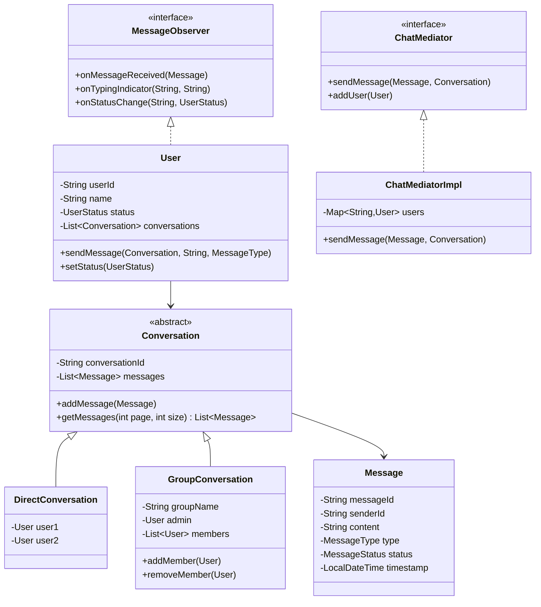
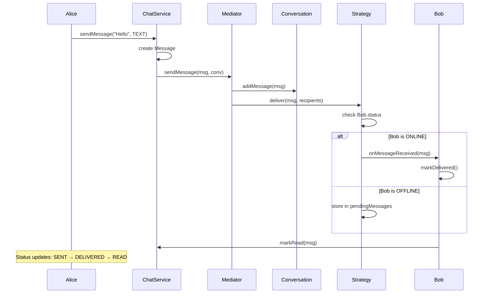

# Chat Application - Low-Level Design

## 1. Problem Statement
Design a chat application supporting 1-to-1 and group messaging with real-time delivery, read receipts, presence management, and message history.

## 2. UML Class Diagram


## 3. Design Patterns
- **Observer**: Real-time message delivery, typing indicators, online status notifications
- **Mediator**: ChatMediator routes messages between users without direct coupling
- **Strategy**: Message delivery strategies (push, pull, store-and-forward)
- **Factory**: MessageFactory creates different message types

## 4. SOLID Principles
- **SRP**: Separate classes for User, Message, Conversation, Mediator
- **OCP**: New message types/conversation types without modifying existing code
- **LSP**: DirectConversation and GroupConversation substitutable for Conversation
- **ISP**: Separate observer interfaces for messages, typing, presence
- **DIP**: Depend on ChatMediator interface, not concrete implementation

## 5. Java Implementation

```java
// ===== Enums =====
public enum MessageType { TEXT, IMAGE, FILE, AUDIO }
public enum MessageStatus { SENT, DELIVERED, READ }
public enum UserStatus { ONLINE, OFFLINE, AWAY }

// ===== Observer Interface =====
public interface MessageObserver {
    void onMessageReceived(Message message);
    void onTypingIndicator(String conversationId, String userId);
    void onStatusChange(String userId, UserStatus status);
}

// ===== Message =====
public class Message {
    private final String messageId;
    private final String senderId;
    private final String conversationId;
    private final String content;
    private final MessageType type;
    private MessageStatus status;
    private final LocalDateTime timestamp;
    private Map<String, MessageStatus> recipientStatus; // per-user status

    public Message(String senderId, String conversationId, String content, MessageType type) {
        this.messageId = UUID.randomUUID().toString();
        this.senderId = senderId;
        this.conversationId = conversationId;
        this.content = content;
        this.type = type;
        this.status = MessageStatus.SENT;
        this.timestamp = LocalDateTime.now();
        this.recipientStatus = new ConcurrentHashMap<>();
    }

    public void markDelivered(String userId) {
        recipientStatus.put(userId, MessageStatus.DELIVERED);
        updateOverallStatus();
    }

    public void markRead(String userId) {
        recipientStatus.put(userId, MessageStatus.READ);
        updateOverallStatus();
    }

    private void updateOverallStatus() {
        if (recipientStatus.values().stream().allMatch(s -> s == MessageStatus.READ))
            this.status = MessageStatus.READ;
        else if (recipientStatus.values().stream().allMatch(s -> s != MessageStatus.SENT))
            this.status = MessageStatus.DELIVERED;
    }

    // Getters
    public String getMessageId() { return messageId; }
    public String getSenderId() { return senderId; }
    public String getConversationId() { return conversationId; }
    public String getContent() { return content; }
    public MessageType getType() { return type; }
    public MessageStatus getStatus() { return status; }
    public LocalDateTime getTimestamp() { return timestamp; }
    public Map<String, MessageStatus> getRecipientStatus() { return recipientStatus; }
}

// ===== MessageFactory =====
public class MessageFactory {
    public static Message createTextMessage(String senderId, String convId, String text) {
        return new Message(senderId, convId, text, MessageType.TEXT);
    }
    public static Message createImageMessage(String senderId, String convId, String url) {
        return new Message(senderId, convId, url, MessageType.IMAGE);
    }
    public static Message createFileMessage(String senderId, String convId, String fileUrl) {
        return new Message(senderId, convId, fileUrl, MessageType.FILE);
    }
}

// ===== Conversation (Abstract) =====
public abstract class Conversation {
    protected final String conversationId;
    protected final List<Message> messages;
    private static final int DEFAULT_PAGE_SIZE = 20;

    public Conversation() {
        this.conversationId = UUID.randomUUID().toString();
        this.messages = Collections.synchronizedList(new ArrayList<>());
    }

    public void addMessage(Message message) { messages.add(message); }

    public List<Message> getMessages(int page, int size) {
        int start = Math.max(0, messages.size() - (page * size));
        int end = Math.max(0, messages.size() - ((page - 1) * size));
        return new ArrayList<>(messages.subList(start, end));
    }

    public List<Message> searchMessages(String keyword) {
        return messages.stream()
            .filter(m -> m.getContent().toLowerCase().contains(keyword.toLowerCase()))
            .collect(Collectors.toList());
    }

    public abstract List<User> getParticipants();
    public String getConversationId() { return conversationId; }
}

// ===== DirectConversation =====
public class DirectConversation extends Conversation {
    private final User user1;
    private final User user2;

    public DirectConversation(User user1, User user2) {
        super();
        this.user1 = user1;
        this.user2 = user2;
    }

    @Override
    public List<User> getParticipants() { return List.of(user1, user2); }
}

// ===== GroupConversation =====
public class GroupConversation extends Conversation {
    private final String groupName;
    private User admin;
    private final List<User> members;

    public GroupConversation(String groupName, User admin) {
        super();
        this.groupName = groupName;
        this.admin = admin;
        this.members = Collections.synchronizedList(new ArrayList<>());
        this.members.add(admin);
    }

    public void addMember(User requester, User newMember) {
        if (!requester.equals(admin)) throw new IllegalStateException("Only admin can add members");
        if (!members.contains(newMember)) {
            members.add(newMember);
            newMember.addConversation(this);
        }
    }

    public void removeMember(User requester, User member) {
        if (!requester.equals(admin)) throw new IllegalStateException("Only admin can remove members");
        if (member.equals(admin)) throw new IllegalStateException("Admin cannot be removed");
        members.remove(member);
        member.removeConversation(this);
    }

    public void transferAdmin(User newAdmin) {
        if (members.contains(newAdmin)) this.admin = newAdmin;
    }

    @Override
    public List<User> getParticipants() { return new ArrayList<>(members); }
    public String getGroupName() { return groupName; }
    public User getAdmin() { return admin; }
}

// ===== User =====
public class User implements MessageObserver {
    private final String userId;
    private final String name;
    private UserStatus status;
    private final List<Conversation> conversations;
    private final List<Message> inbox;

    public User(String userId, String name) {
        this.userId = userId;
        this.name = name;
        this.status = UserStatus.OFFLINE;
        this.conversations = new ArrayList<>();
        this.inbox = new ArrayList<>();
    }

    public void setStatus(UserStatus status) { this.status = status; }
    public void addConversation(Conversation c) { conversations.add(c); }
    public void removeConversation(Conversation c) { conversations.remove(c); }

    @Override
    public void onMessageReceived(Message message) {
        inbox.add(message);
        message.markDelivered(userId);
        System.out.println("[" + name + "] received: " + message.getContent());
    }

    @Override
    public void onTypingIndicator(String conversationId, String userId) {
        System.out.println("[" + name + "] " + userId + " is typing...");
    }

    @Override
    public void onStatusChange(String userId, UserStatus newStatus) {
        System.out.println("[" + name + "] " + userId + " is now " + newStatus);
    }

    public void markMessageRead(Message message) { message.markRead(userId); }

    // Getters
    public String getUserId() { return userId; }
    public String getName() { return name; }
    public UserStatus getStatus() { return status; }
    public List<Conversation> getConversations() { return conversations; }
}

// ===== ChatMediator =====
public interface ChatMediator {
    void sendMessage(Message message, Conversation conversation);
    void registerUser(User user);
    void notifyTyping(String conversationId, User typingUser);
    void updatePresence(User user, UserStatus status);
}

// ===== ChatMediatorImpl =====
public class ChatMediatorImpl implements ChatMediator {
    private final Map<String, User> users = new ConcurrentHashMap<>();
    private final Map<String, Conversation> conversations = new ConcurrentHashMap<>();
    private final DeliveryStrategy deliveryStrategy;

    public ChatMediatorImpl(DeliveryStrategy strategy) {
        this.deliveryStrategy = strategy;
    }

    @Override
    public void registerUser(User user) {
        users.put(user.getUserId(), user);
    }

    @Override
    public void sendMessage(Message message, Conversation conversation) {
        conversation.addMessage(message);
        conversations.putIfAbsent(conversation.getConversationId(), conversation);

        List<User> recipients = conversation.getParticipants().stream()
            .filter(u -> !u.getUserId().equals(message.getSenderId()))
            .collect(Collectors.toList());

        deliveryStrategy.deliver(message, recipients);
    }

    @Override
    public void notifyTyping(String conversationId, User typingUser) {
        Conversation conv = conversations.get(conversationId);
        if (conv != null) {
            conv.getParticipants().stream()
                .filter(u -> !u.getUserId().equals(typingUser.getUserId()))
                .forEach(u -> u.onTypingIndicator(conversationId, typingUser.getUserId()));
        }
    }

    @Override
    public void updatePresence(User user, UserStatus status) {
        user.setStatus(status);
        users.values().stream()
            .filter(u -> !u.getUserId().equals(user.getUserId()))
            .forEach(u -> u.onStatusChange(user.getUserId(), status));
    }
}

// ===== Strategy Pattern: Delivery =====
public interface DeliveryStrategy {
    void deliver(Message message, List<User> recipients);
}

public class PushDeliveryStrategy implements DeliveryStrategy {
    @Override
    public void deliver(Message message, List<User> recipients) {
        recipients.stream()
            .filter(u -> u.getStatus() == UserStatus.ONLINE)
            .forEach(u -> u.onMessageReceived(message));
    }
}

public class StoreAndForwardStrategy implements DeliveryStrategy {
    private final Map<String, Queue<Message>> pendingMessages = new ConcurrentHashMap<>();

    @Override
    public void deliver(Message message, List<User> recipients) {
        for (User user : recipients) {
            if (user.getStatus() == UserStatus.ONLINE) {
                user.onMessageReceived(message);
            } else {
                pendingMessages.computeIfAbsent(user.getUserId(), k -> new LinkedList<>()).add(message);
            }
        }
    }

    public void deliverPending(User user) {
        Queue<Message> pending = pendingMessages.remove(user.getUserId());
        if (pending != null) {
            pending.forEach(user::onMessageReceived);
        }
    }
}

// ===== ChatService (Facade) =====
public class ChatService {
    private final ChatMediator mediator;
    private final Map<String, Conversation> conversations = new ConcurrentHashMap<>();

    public ChatService(ChatMediator mediator) {
        this.mediator = mediator;
    }

    public DirectConversation createDirectConversation(User u1, User u2) {
        DirectConversation conv = new DirectConversation(u1, u2);
        conversations.put(conv.getConversationId(), conv);
        u1.addConversation(conv);
        u2.addConversation(conv);
        return conv;
    }

    public GroupConversation createGroup(String name, User admin) {
        GroupConversation group = new GroupConversation(name, admin);
        conversations.put(group.getConversationId(), group);
        admin.addConversation(group);
        return group;
    }

    public void sendMessage(User sender, Conversation conv, String content, MessageType type) {
        Message msg = new Message(sender.getUserId(), conv.getConversationId(), content, type);
        mediator.sendMessage(msg, conv);
    }

    public void sendTypingIndicator(User user, Conversation conv) {
        mediator.notifyTyping(conv.getConversationId(), user);
    }

    public void userGoesOnline(User user) { mediator.updatePresence(user, UserStatus.ONLINE); }
    public void userGoesOffline(User user) { mediator.updatePresence(user, UserStatus.OFFLINE); }

    public List<Message> getHistory(Conversation conv, int page) {
        return conv.getMessages(page, 20);
    }

    public List<Message> search(Conversation conv, String keyword) {
        return conv.searchMessages(keyword);
    }
}

// ===== Demo =====
public class ChatAppDemo {
    public static void main(String[] args) {
        DeliveryStrategy strategy = new StoreAndForwardStrategy();
        ChatMediator mediator = new ChatMediatorImpl(strategy);
        ChatService chatService = new ChatService(mediator);

        User alice = new User("u1", "Alice");
        User bob = new User("u2", "Bob");
        User charlie = new User("u3", "Charlie");

        mediator.registerUser(alice);
        mediator.registerUser(bob);
        mediator.registerUser(charlie);

        chatService.userGoesOnline(alice);
        chatService.userGoesOnline(bob);
        chatService.userGoesOnline(charlie);

        // Direct message
        DirectConversation dm = chatService.createDirectConversation(alice, bob);
        chatService.sendMessage(alice, dm, "Hey Bob!", MessageType.TEXT);
        chatService.sendTypingIndicator(bob, dm);
        chatService.sendMessage(bob, dm, "Hi Alice!", MessageType.TEXT);

        // Group chat
        GroupConversation group = chatService.createGroup("Project Team", alice);
        group.addMember(alice, bob);
        group.addMember(alice, charlie);
        chatService.sendMessage(alice, group, "Welcome everyone!", MessageType.TEXT);

        // Search
        List<Message> results = chatService.search(dm, "Hey");
        System.out.println("Search results: " + results.size());
    }
}
```

## 6. Sequence Diagram


## 7. Key Interview Points

| Topic | Key Point |
|-------|-----------|
| **Mediator** | Decouples users; all messaging routes through ChatMediator |
| **Observer** | Users observe messages, typing, presence without polling |
| **Strategy** | Swappable delivery (push vs store-and-forward) |
| **Thread Safety** | ConcurrentHashMap, synchronized lists for multi-user access |
| **Pagination** | getMessages(page, size) for chat history |
| **Read Receipts** | Per-recipient status tracking with aggregate rollup |
| **Presence** | Mediator broadcasts status changes to all registered users |
| **Group Admin** | Only admin can add/remove; transferable admin role |
| **Scalability** | Mediator can be distributed; strategy enables offline delivery |
| **Search** | In-memory keyword search; production would use Elasticsearch |
