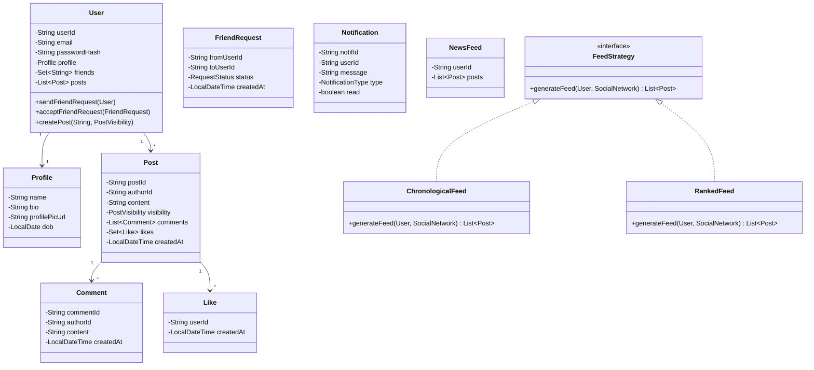

# Low-Level Design: Social Network (Facebook-like)

## 1. Problem Statement
Design a social networking platform supporting user profiles, friend connections, posts, news feed generation, notifications, and privacy controls.

## 2. UML Class Diagram


## 3. Design Patterns
| Pattern | Usage |
|---------|-------|
| **Observer** | Notification system - notify on friend request, like, comment |
| **Strategy** | News feed generation (chronological vs ranked) |
| **Factory** | Notification creation |
| **Iterator** | Feed pagination |

## 4. SOLID Principles
- **SRP**: Separate classes for User, Post, Feed, Notification
- **OCP**: FeedStrategy interface allows new feed algorithms without modification
- **LSP**: Any FeedStrategy implementation is substitutable
- **ISP**: Small focused interfaces (FeedStrategy, NotificationObserver)
- **DIP**: SocialNetwork depends on FeedStrategy abstraction, not concrete classes

## 5. Complete Java Implementation

```java
import java.util.*;
import java.time.LocalDateTime;
import java.time.LocalDate;
import java.util.stream.*;

// ==================== ENUMS ====================
enum PostVisibility { PUBLIC, FRIENDS, PRIVATE }
enum RequestStatus { PENDING, ACCEPTED, REJECTED }
enum NotificationType { FRIEND_REQUEST, LIKE, COMMENT, SHARE }

// ==================== MODELS ====================
class Profile {
    private String name;
    private String bio;
    private String profilePicUrl;
    private LocalDate dob;

    public Profile(String name, String bio, LocalDate dob) {
        this.name = name;
        this.bio = bio;
        this.dob = dob;
    }

    public String getName() { return name; }
    public void setName(String name) { this.name = name; }
    public void setBio(String bio) { this.bio = bio; }
    public String getBio() { return bio; }
}

class Like {
    private final String userId;
    private final LocalDateTime createdAt;

    public Like(String userId) {
        this.userId = userId;
        this.createdAt = LocalDateTime.now();
    }
    public String getUserId() { return userId; }
}

class Comment {
    private final String commentId;
    private final String authorId;
    private final String content;
    private final LocalDateTime createdAt;

    public Comment(String authorId, String content) {
        this.commentId = UUID.randomUUID().toString();
        this.authorId = authorId;
        this.content = content;
        this.createdAt = LocalDateTime.now();
    }
    public String getAuthorId() { return authorId; }
    public String getContent() { return content; }
}

class Post {
    private final String postId;
    private final String authorId;
    private String content;
    private PostVisibility visibility;
    private final List<Comment> comments;
    private final Set<Like> likes;
    private final LocalDateTime createdAt;

    public Post(String authorId, String content, PostVisibility visibility) {
        this.postId = UUID.randomUUID().toString();
        this.authorId = authorId;
        this.content = content;
        this.visibility = visibility;
        this.comments = new ArrayList<>();
        this.likes = new HashSet<>();
        this.createdAt = LocalDateTime.now();
    }

    public String getPostId() { return postId; }
    public String getAuthorId() { return authorId; }
    public String getContent() { return content; }
    public PostVisibility getVisibility() { return visibility; }
    public List<Comment> getComments() { return comments; }
    public Set<Like> getLikes() { return likes; }
    public LocalDateTime getCreatedAt() { return createdAt; }
    public int getEngagementScore() { return likes.size() * 2 + comments.size() * 3; }

    public void addLike(String userId) { likes.add(new Like(userId)); }
    public void addComment(String authorId, String content) {
        comments.add(new Comment(authorId, content));
    }
}

class FriendRequest {
    private final String fromUserId;
    private final String toUserId;
    private RequestStatus status;
    private final LocalDateTime createdAt;

    public FriendRequest(String from, String to) {
        this.fromUserId = from;
        this.toUserId = to;
        this.status = RequestStatus.PENDING;
        this.createdAt = LocalDateTime.now();
    }

    public String getFromUserId() { return fromUserId; }
    public String getToUserId() { return toUserId; }
    public RequestStatus getStatus() { return status; }
    public void setStatus(RequestStatus status) { this.status = status; }
}

class Notification {
    private final String notifId;
    private final String userId;
    private final String message;
    private final NotificationType type;
    private boolean read;

    public Notification(String userId, String message, NotificationType type) {
        this.notifId = UUID.randomUUID().toString();
        this.userId = userId;
        this.message = message;
        this.type = type;
        this.read = false;
    }

    public String getUserId() { return userId; }
    public String getMessage() { return message; }
    public void markRead() { this.read = true; }
}

class User {
    private final String userId;
    private final String email;
    private String passwordHash;
    private Profile profile;
    private final Set<String> friends; // adjacency list
    private final List<Post> posts;
    private final List<Notification> notifications;

    public User(String email, String passwordHash, Profile profile) {
        this.userId = UUID.randomUUID().toString();
        this.email = email;
        this.passwordHash = passwordHash;
        this.profile = profile;
        this.friends = new HashSet<>();
        this.posts = new ArrayList<>();
        this.notifications = new ArrayList<>();
    }

    public String getUserId() { return userId; }
    public String getEmail() { return email; }
    public Profile getProfile() { return profile; }
    public Set<String> getFriends() { return friends; }
    public List<Post> getPosts() { return posts; }
    public List<Notification> getNotifications() { return notifications; }
    public boolean verifyPassword(String hash) { return passwordHash.equals(hash); }

    public void addFriend(String friendId) { friends.add(friendId); }
    public void addPost(Post post) { posts.add(post); }
    public void addNotification(Notification n) { notifications.add(n); }
    public void updateProfile(String name, String bio) {
        profile.setName(name);
        profile.setBio(bio);
    }
}

// ==================== OBSERVER PATTERN ====================
interface NotificationObserver {
    void onEvent(String userId, String message, NotificationType type);
}

class NotificationService implements NotificationObserver {
    private final Map<String, User> userStore;

    public NotificationService(Map<String, User> userStore) {
        this.userStore = userStore;
    }

    @Override
    public void onEvent(String userId, String message, NotificationType type) {
        User user = userStore.get(userId);
        if (user != null) {
            user.addNotification(new Notification(userId, message, type));
        }
    }
}

// ==================== STRATEGY PATTERN ====================
interface FeedStrategy {
    List<Post> generateFeed(User user, Map<String, User> users);
}

class ChronologicalFeed implements FeedStrategy {
    @Override
    public List<Post> generateFeed(User user, Map<String, User> users) {
        List<Post> feed = new ArrayList<>();
        for (String friendId : user.getFriends()) {
            User friend = users.get(friendId);
            if (friend != null) {
                for (Post p : friend.getPosts()) {
                    if (canView(p, user, friend)) feed.add(p);
                }
            }
        }
        feed.sort((a, b) -> b.getCreatedAt().compareTo(a.getCreatedAt()));
        return feed;
    }

    private boolean canView(Post post, User viewer, User author) {
        if (post.getVisibility() == PostVisibility.PUBLIC) return true;
        if (post.getVisibility() == PostVisibility.FRIENDS)
            return author.getFriends().contains(viewer.getUserId());
        return false;
    }
}

class RankedFeed implements FeedStrategy {
    @Override
    public List<Post> generateFeed(User user, Map<String, User> users) {
        List<Post> feed = new ChronologicalFeed().generateFeed(user, users);
        feed.sort((a, b) -> b.getEngagementScore() - a.getEngagementScore());
        return feed;
    }
}

// ==================== ITERATOR PATTERN (Pagination) ====================
class FeedIterator implements Iterator<List<Post>> {
    private final List<Post> allPosts;
    private int currentIndex;
    private final int pageSize;

    public FeedIterator(List<Post> posts, int pageSize) {
        this.allPosts = posts;
        this.pageSize = pageSize;
        this.currentIndex = 0;
    }

    @Override
    public boolean hasNext() { return currentIndex < allPosts.size(); }

    @Override
    public List<Post> next() {
        if (!hasNext()) throw new NoSuchElementException();
        int end = Math.min(currentIndex + pageSize, allPosts.size());
        List<Post> page = allPosts.subList(currentIndex, end);
        currentIndex = end;
        return page;
    }
}

// ==================== SOCIAL NETWORK SERVICE ====================
class SocialNetwork {
    private final Map<String, User> users; // userId -> User
    private final Map<String, User> emailIndex; // email -> User
    private final List<FriendRequest> friendRequests;
    private FeedStrategy feedStrategy;
    private final NotificationObserver notificationObserver;

    public SocialNetwork() {
        this.users = new HashMap<>();
        this.emailIndex = new HashMap<>();
        this.friendRequests = new ArrayList<>();
        this.feedStrategy = new ChronologicalFeed();
        this.notificationObserver = new NotificationService(users);
    }

    public void setFeedStrategy(FeedStrategy strategy) {
        this.feedStrategy = strategy;
    }

    // --- User Operations ---
    public User register(String email, String password, String name, LocalDate dob) {
        if (emailIndex.containsKey(email)) throw new RuntimeException("Email exists");
        Profile profile = new Profile(name, "", dob);
        User user = new User(email, password, profile);
        users.put(user.getUserId(), user);
        emailIndex.put(email, user);
        return user;
    }

    public User login(String email, String password) {
        User user = emailIndex.get(email);
        if (user == null || !user.verifyPassword(password)) throw new RuntimeException("Invalid credentials");
        return user;
    }

    public void updateProfile(String userId, String name, String bio) {
        User user = users.get(userId);
        if (user != null) user.updateProfile(name, bio);
    }

    // --- Friend Operations (Graph) ---
    public FriendRequest sendFriendRequest(String fromId, String toId) {
        if (!users.containsKey(fromId) || !users.containsKey(toId))
            throw new RuntimeException("User not found");
        FriendRequest req = new FriendRequest(fromId, toId);
        friendRequests.add(req);
        notificationObserver.onEvent(toId,
            users.get(fromId).getProfile().getName() + " sent you a friend request",
            NotificationType.FRIEND_REQUEST);
        return req;
    }

    public void acceptFriendRequest(FriendRequest request) {
        request.setStatus(RequestStatus.ACCEPTED);
        users.get(request.getFromUserId()).addFriend(request.getToUserId());
        users.get(request.getToUserId()).addFriend(request.getFromUserId());
    }

    // --- Post Operations ---
    public Post createPost(String userId, String content, PostVisibility visibility) {
        User user = users.get(userId);
        Post post = new Post(userId, content, visibility);
        user.addPost(post);
        return post;
    }

    public void likePost(String userId, Post post) {
        post.addLike(userId);
        if (!post.getAuthorId().equals(userId)) {
            notificationObserver.onEvent(post.getAuthorId(),
                users.get(userId).getProfile().getName() + " liked your post",
                NotificationType.LIKE);
        }
    }

    public void commentOnPost(String userId, Post post, String content) {
        post.addComment(userId, content);
        if (!post.getAuthorId().equals(userId)) {
            notificationObserver.onEvent(post.getAuthorId(),
                users.get(userId).getProfile().getName() + " commented on your post",
                NotificationType.COMMENT);
        }
    }

    // --- News Feed ---
    public List<Post> getNewsFeed(String userId) {
        User user = users.get(userId);
        return feedStrategy.generateFeed(user, users);
    }

    public FeedIterator getPaginatedFeed(String userId, int pageSize) {
        List<Post> feed = getNewsFeed(userId);
        return new FeedIterator(feed, pageSize);
    }

    // --- Search ---
    public List<User> searchUsers(String query) {
        String q = query.toLowerCase();
        return users.values().stream()
            .filter(u -> u.getProfile().getName().toLowerCase().contains(q))
            .collect(Collectors.toList());
    }

    public List<Post> searchPosts(String keyword) {
        String k = keyword.toLowerCase();
        return users.values().stream()
            .flatMap(u -> u.getPosts().stream())
            .filter(p -> p.getVisibility() == PostVisibility.PUBLIC
                && p.getContent().toLowerCase().contains(k))
            .collect(Collectors.toList());
    }
}

// ==================== DEMO ====================
class SocialNetworkDemo {
    public static void main(String[] args) {
        SocialNetwork network = new SocialNetwork();

        User alice = network.register("alice@example.com", "pass1", "Alice", LocalDate.of(1990, 1, 1));
        User bob = network.register("bob@example.com", "pass2", "Bob", LocalDate.of(1992, 5, 15));

        FriendRequest req = network.sendFriendRequest(alice.getUserId(), bob.getUserId());
        network.acceptFriendRequest(req);

        Post post = network.createPost(alice.getUserId(), "Hello World!", PostVisibility.FRIENDS);
        network.likePost(bob.getUserId(), post);
        network.commentOnPost(bob.getUserId(), post, "Nice post!");

        // Chronological feed
        List<Post> feed = network.getNewsFeed(bob.getUserId());
        System.out.println("Bob's feed size: " + feed.size());

        // Switch to ranked feed
        network.setFeedStrategy(new RankedFeed());
        feed = network.getNewsFeed(bob.getUserId());

        // Paginated feed
        FeedIterator iter = network.getPaginatedFeed(bob.getUserId(), 10);
        while (iter.hasNext()) {
            List<Post> page = iter.next();
            System.out.println("Page with " + page.size() + " posts");
        }

        // Notifications
        System.out.println("Alice notifications: " + alice.getNotifications().size());
    }
}
```

## 6. Key Interview Points

| Topic | Detail |
|-------|--------|
| **Friend Graph** | Adjacency list via `Set<String> friends` in each User; bidirectional on accept |
| **Feed Strategy** | Strategy pattern allows swapping chronological/ranked without changing client code |
| **Privacy** | PostVisibility enum checked during feed generation; PRIVATE posts never in others' feeds |
| **Notifications** | Observer pattern decouples post/like/comment actions from notification delivery |
| **Pagination** | Iterator pattern with configurable page size; lazy page fetching |
| **Search** | Stream-based filtering; in production use Elasticsearch/inverted index |
| **Scalability** | Fan-out on write (precompute feeds) vs fan-out on read (compute at request time) |
| **Concurrency** | Use ConcurrentHashMap, synchronized blocks for thread safety in production |
| **Database** | Users/Posts in RDBMS, friend graph in graph DB (Neo4j), feeds in Redis |
| **Caching** | Cache computed feeds in Redis with TTL; invalidate on new post from friend |
