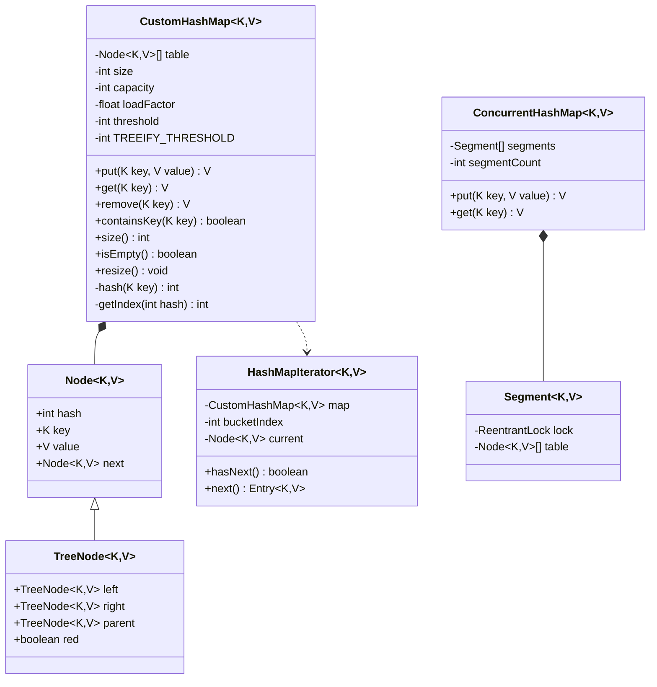

# Low-Level Design: Custom HashMap Implementation

## 1. Problem Statement

Implement a HashMap data structure from scratch supporting O(1) average-case operations for put, get, and remove. Handle hash collisions via separate chaining with treeification for long chains (Java 8+ approach).

---

## 2. UML Class Diagram



---

## 3. Design Patterns

| Pattern | Application |
|---------|-------------|
| **Strategy** | Hash function and collision resolution are pluggable strategies |
| **Iterator** | Custom iterator for traversing entries |
| **Template Method** | resize() defines skeleton, subclasses can override rehash logic |

---

## 4. SOLID Principles

- **S**: Node class only holds data; HashMap handles operations
- **O**: Collision strategy extensible (chaining → treeification) without modifying core logic
- **L**: TreeNode extends Node, substitutable in bucket chains
- **I**: Separate Map interface from Iterable concerns
- **D**: Hash function abstracted; can inject custom hash strategies

---

## 5. Complete Java Implementation

```java
import java.util.*;
import java.util.concurrent.locks.ReentrantLock;

// ============ Node Class ============
class Node<K, V> {
    final int hash;
    final K key;
    V value;
    Node<K, V> next;

    Node(int hash, K key, V value, Node<K, V> next) {
        this.hash = hash;
        this.key = key;
        this.value = value;
        this.next = next;
    }
}

// ============ TreeNode Class (Simplified Red-Black) ============
class TreeNode<K, V> extends Node<K, V> {
    TreeNode<K, V> parent, left, right;
    boolean red;

    TreeNode(int hash, K key, V value, Node<K, V> next) {
        super(hash, key, value, next);
        this.red = true;
    }

    // Simplified tree insertion (full RB-tree rotation omitted for brevity)
    TreeNode<K, V> putTreeVal(int hash, K key, V value) {
        TreeNode<K, V> current = this;
        while (true) {
            int cmp = Integer.compare(hash, current.hash);
            if (cmp == 0 && Objects.equals(key, current.key)) {
                current.value = value;
                return current;
            }
            if (cmp < 0) {
                if (current.left == null) {
                    current.left = new TreeNode<>(hash, key, value, null);
                    current.left.parent = current;
                    return current.left;
                }
                current = current.left;
            } else {
                if (current.right == null) {
                    current.right = new TreeNode<>(hash, key, value, null);
                    current.right.parent = current;
                    return current.right;
                }
                current = current.right;
            }
        }
    }

    TreeNode<K, V> getTreeNode(int hash, K key) {
        TreeNode<K, V> current = this;
        while (current != null) {
            int cmp = Integer.compare(hash, current.hash);
            if (cmp == 0 && Objects.equals(key, current.key)) return current;
            current = (cmp < 0) ? current.left : current.right;
        }
        return null;
    }
}

// ============ Custom HashMap ============
public class CustomHashMap<K, V> implements Iterable<Node<K, V>> {

    private static final int DEFAULT_CAPACITY = 16;
    private static final float DEFAULT_LOAD_FACTOR = 0.75f;
    private static final int TREEIFY_THRESHOLD = 8;
    private static final int UNTREEIFY_THRESHOLD = 6;
    private static final int MAX_CAPACITY = 1 << 30;

    private Node<K, V>[] table;
    private int size;
    private int capacity;
    private float loadFactor;
    private int threshold;

    @SuppressWarnings("unchecked")
    public CustomHashMap(int initialCapacity, float loadFactor) {
        this.capacity = tableSizeFor(initialCapacity);
        this.loadFactor = loadFactor;
        this.threshold = (int) (capacity * loadFactor);
        this.table = new Node[capacity];
        this.size = 0;
    }

    public CustomHashMap() {
        this(DEFAULT_CAPACITY, DEFAULT_LOAD_FACTOR);
    }

    // ---- Hash Function ----
    // Spreads higher bits to lower bits (perturbation)
    private int hash(K key) {
        if (key == null) return 0;
        int h = key.hashCode();
        return h ^ (h >>> 16); // XOR spread
    }

    private int getIndex(int hash) {
        return hash & (capacity - 1); // Bitwise AND (capacity is power of 2)
    }

    // Ensure capacity is power of 2
    private int tableSizeFor(int cap) {
        int n = cap - 1;
        n |= n >>> 1;
        n |= n >>> 2;
        n |= n >>> 4;
        n |= n >>> 8;
        n |= n >>> 16;
        return (n < 0) ? 1 : (n >= MAX_CAPACITY) ? MAX_CAPACITY : n + 1;
    }

    // ---- PUT ----
    public V put(K key, V value) {
        int hash = hash(key);
        int index = getIndex(hash);

        // Null key always at index 0
        if (table[index] == null) {
            table[index] = new Node<>(hash, key, value, null);
            size++;
            if (size > threshold) resize();
            return null;
        }

        Node<K, V> current = table[index];
        int chainLength = 0;

        // If bucket is a tree
        if (current instanceof TreeNode) {
            TreeNode<K, V> treeNode = ((TreeNode<K, V>) current).putTreeVal(hash, key, value);
            return treeNode.value;
        }

        // Traverse linked list
        Node<K, V> prev = null;
        while (current != null) {
            if (current.hash == hash && Objects.equals(current.key, key)) {
                V oldValue = current.value;
                current.value = value;
                return oldValue; // Update existing
            }
            prev = current;
            current = current.next;
            chainLength++;
        }

        // Append new node
        prev.next = new Node<>(hash, key, value, null);
        size++;

        // Treeify if chain exceeds threshold
        if (chainLength >= TREEIFY_THRESHOLD) {
            treeifyBin(index);
        }

        if (size > threshold) resize();
        return null;
    }

    // ---- GET ----
    public V get(K key) {
        int hash = hash(key);
        int index = getIndex(hash);
        Node<K, V> current = table[index];

        if (current instanceof TreeNode) {
            TreeNode<K, V> result = ((TreeNode<K, V>) current).getTreeNode(hash, key);
            return result != null ? result.value : null;
        }

        while (current != null) {
            if (current.hash == hash && Objects.equals(current.key, key)) {
                return current.value;
            }
            current = current.next;
        }
        return null;
    }

    // ---- REMOVE ----
    public V remove(K key) {
        int hash = hash(key);
        int index = getIndex(hash);
        Node<K, V> current = table[index];
        Node<K, V> prev = null;

        while (current != null) {
            if (current.hash == hash && Objects.equals(current.key, key)) {
                V oldValue = current.value;
                if (prev == null) {
                    table[index] = current.next;
                } else {
                    prev.next = current.next;
                }
                size--;
                return oldValue;
            }
            prev = current;
            current = current.next;
        }
        return null;
    }

    // ---- CONTAINS KEY ----
    public boolean containsKey(K key) {
        return get(key) != null;
    }

    public int size() { return size; }
    public boolean isEmpty() { return size == 0; }

    // ---- RESIZE / REHASH ----
    @SuppressWarnings("unchecked")
    private void resize() {
        int newCapacity = capacity << 1; // Double
        if (newCapacity > MAX_CAPACITY) return;

        Node<K, V>[] oldTable = table;
        table = new Node[newCapacity];
        capacity = newCapacity;
        threshold = (int) (capacity * loadFactor);
        size = 0;

        // Rehash all entries
        for (Node<K, V> head : oldTable) {
            Node<K, V> current = head;
            while (current != null) {
                put(current.key, current.value); // Re-insert
                current = current.next;
            }
        }
    }

    // ---- TREEIFY ----
    private void treeifyBin(int index) {
        Node<K, V> current = table[index];
        TreeNode<K, V> root = new TreeNode<>(current.hash, current.key, current.value, null);
        current = current.next;

        while (current != null) {
            root.putTreeVal(current.hash, current.key, current.value);
            current = current.next;
        }
        table[index] = root;
    }

    // ---- ITERATOR ----
    @Override
    public Iterator<Node<K, V>> iterator() {
        return new HashMapIterator();
    }

    private class HashMapIterator implements Iterator<Node<K, V>> {
        private int bucketIndex = 0;
        private Node<K, V> current = null;

        HashMapIterator() {
            advanceToNextBucket();
        }

        private void advanceToNextBucket() {
            while (bucketIndex < capacity && table[bucketIndex] == null) {
                bucketIndex++;
            }
            current = (bucketIndex < capacity) ? table[bucketIndex] : null;
        }

        @Override
        public boolean hasNext() {
            return current != null;
        }

        @Override
        public Node<K, V> next() {
            if (!hasNext()) throw new NoSuchElementException();
            Node<K, V> result = current;
            current = current.next;
            if (current == null) {
                bucketIndex++;
                advanceToNextBucket();
            }
            return result;
        }
    }
}

// ============ Thread-Safe: ConcurrentHashMap (Segment Locking) ============
class ConcurrentHashMap<K, V> {

    private static final int SEGMENT_COUNT = 16;

    private static class Segment<K, V> {
        private final ReentrantLock lock = new ReentrantLock();
        private final CustomHashMap<K, V> map = new CustomHashMap<>();

        V put(K key, V value) {
            lock.lock();
            try {
                return map.put(key, value);
            } finally {
                lock.unlock();
            }
        }

        V get(K key) {
            lock.lock();
            try {
                return map.get(key);
            } finally {
                lock.unlock();
            }
        }

        V remove(K key) {
            lock.lock();
            try {
                return map.remove(key);
            } finally {
                lock.unlock();
            }
        }
    }

    @SuppressWarnings("unchecked")
    private final Segment<K, V>[] segments = new Segment[SEGMENT_COUNT];

    public ConcurrentHashMap() {
        for (int i = 0; i < SEGMENT_COUNT; i++) {
            segments[i] = new Segment<>();
        }
    }

    private int segmentIndex(K key) {
        int hash = (key == null) ? 0 : key.hashCode();
        return (hash >>> 16) & (SEGMENT_COUNT - 1);
    }

    public V put(K key, V value) {
        return segments[segmentIndex(key)].put(key, value);
    }

    public V get(K key) {
        return segments[segmentIndex(key)].get(key);
    }

    public V remove(K key) {
        return segments[segmentIndex(key)].remove(key);
    }
}

// ============ equals/hashCode Contract Demo ============
class Employee {
    private int id;
    private String name;

    Employee(int id, String name) {
        this.id = id;
        this.name = name;
    }

    @Override
    public boolean equals(Object o) {
        if (this == o) return true;
        if (o == null || getClass() != o.getClass()) return false;
        Employee e = (Employee) o;
        return id == e.id && Objects.equals(name, e.name);
    }

    @Override
    public int hashCode() {
        return Objects.hash(id, name);
    }
}
```

---

## 6. Time Complexity Analysis

| Operation | Average | Worst (List) | Worst (Tree) |
|-----------|---------|--------------|--------------|
| `put` | O(1) | O(n) | O(log n) |
| `get` | O(1) | O(n) | O(log n) |
| `remove` | O(1) | O(n) | O(log n) |
| `containsKey` | O(1) | O(n) | O(log n) |
| `resize` | O(n) | O(n) | O(n) |
| `iteration` | O(n + capacity) | — | — |

**Space Complexity**: O(n + capacity)

---

## 7. Key Interview Points

### Hash Collisions
- **Separate Chaining**: Linked list per bucket; treeifies at threshold 8
- **Open Addressing** (alternative): Linear probing, quadratic probing, double hashing
- Java 8+ converts chains > 8 nodes to Red-Black Trees (O(log n) worst case)

### Load Factor & Resizing
- Default load factor: 0.75 (balance between space and time)
- When `size > capacity * loadFactor`, resize to 2x capacity
- All entries are rehashed (index changes because `hash & (newCap - 1)`)
- Capacity always power of 2 → enables bitwise AND for index

### Hash Function Design
- `h ^ (h >>> 16)` spreads higher bits into lower bits
- Prevents clustering when table size is small
- Power-of-2 capacity means only lower bits determine index

### equals/hashCode Contract
- If `a.equals(b)` → `a.hashCode() == b.hashCode()` (MUST)
- If `hashCode` equal → `equals` may or may not be true
- Breaking this contract causes HashMap to malfunction

### Java 8+ HashMap Internals
- Bucket: LinkedList (≤8 nodes) → TreeNode (>8 nodes) → back to list (≤6 nodes)
- TREEIFY_THRESHOLD = 8, UNTREEIFY_THRESHOLD = 6 (hysteresis)
- TreeNode is ~2x memory of Node; only treeify when truly needed

### ConcurrentHashMap Evolution
- Java 7: Segment-based locking (fixed segments)
- Java 8+: CAS + synchronized on individual bins (finer granularity)
- Read operations mostly lock-free via volatile reads

### Common Interview Questions
1. Why is capacity always power of 2? → Enables `hash & (n-1)` instead of `hash % n`
2. Why XOR with upper 16 bits? → Spreads hash for small tables
3. What if all keys collide? → Degrades to O(n) or O(log n) with treeification
4. HashMap vs Hashtable? → Hashtable is synchronized, no nulls, legacy
5. How does resize work? → Double capacity, rehash all entries to new indices
