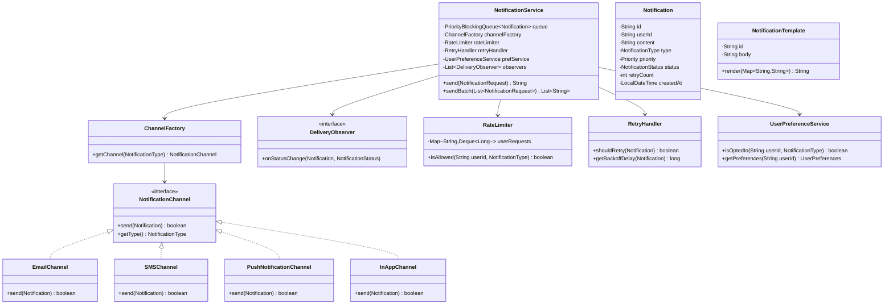
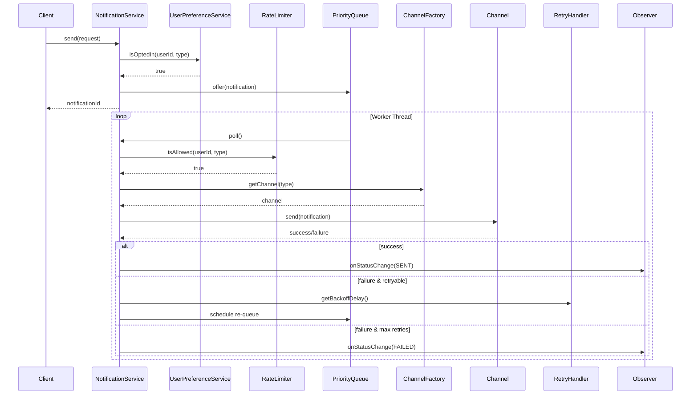

# Notification Service - Low-Level Design

## 1. Problem Statement
Design a scalable notification service that sends notifications across multiple channels (Email, SMS, Push, In-App) with support for templating, priority queuing, rate limiting, retry with exponential backoff, batch processing, and user preference management.

## 2. UML Class Diagram



## 3. Design Patterns
- **Strategy**: `NotificationChannel` interface with channel-specific implementations
- **Observer**: `DeliveryObserver` for status tracking
- **Factory**: `ChannelFactory` creates appropriate channel instances
- **Template Method**: `AbstractNotificationChannel` defines send skeleton
- **Builder**: `NotificationRequest.Builder` for constructing requests

## 4. SOLID Principles
- **SRP**: Each channel handles only its delivery logic
- **OCP**: New channels added without modifying existing code
- **LSP**: All channels substitutable via `NotificationChannel` interface
- **ISP**: Focused interfaces (Channel, Observer, RateLimiter)
- **DIP**: Service depends on abstractions, not concrete channels

## 5. Java Implementation

```java
// ==================== Enums ====================
public enum NotificationType { EMAIL, SMS, PUSH, IN_APP }
public enum Priority { HIGH, MEDIUM, LOW }
public enum NotificationStatus { PENDING, SENT, DELIVERED, FAILED, RETRYING }

// ==================== Models ====================
public class Notification implements Comparable<Notification> {
    private final String id;
    private final String userId;
    private final String content;
    private final String subject;
    private final NotificationType type;
    private final Priority priority;
    private NotificationStatus status;
    private int retryCount;
    private final LocalDateTime createdAt;
    private final Map<String, String> metadata;

    private Notification(Builder builder) {
        this.id = UUID.randomUUID().toString();
        this.userId = builder.userId;
        this.content = builder.content;
        this.subject = builder.subject;
        this.type = builder.type;
        this.priority = builder.priority;
        this.status = NotificationStatus.PENDING;
        this.retryCount = 0;
        this.createdAt = LocalDateTime.now();
        this.metadata = builder.metadata;
    }

    @Override
    public int compareTo(Notification other) {
        return this.priority.compareTo(other.priority); // HIGH < MEDIUM < LOW
    }

    // Getters, setters for status/retryCount
    public void incrementRetry() { this.retryCount++; }
    public void setStatus(NotificationStatus s) { this.status = s; }

    public static class Builder {
        private String userId, content, subject;
        private NotificationType type;
        private Priority priority = Priority.MEDIUM;
        private Map<String, String> metadata = new HashMap<>();

        public Builder userId(String v) { this.userId = v; return this; }
        public Builder content(String v) { this.content = v; return this; }
        public Builder subject(String v) { this.subject = v; return this; }
        public Builder type(NotificationType v) { this.type = v; return this; }
        public Builder priority(Priority v) { this.priority = v; return this; }
        public Builder metadata(String k, String v) { this.metadata.put(k, v); return this; }
        public Notification build() { return new Notification(this); }
    }
}

public class NotificationRequest {
    private final String userId;
    private final String templateId;
    private final Map<String, String> placeholders;
    private final List<NotificationType> channels;
    private final Priority priority;

    // Constructor, getters (Builder pattern similar to above)
}

public class NotificationTemplate {
    private final String id;
    private final String subject;
    private final String body; // "Hello {{name}}, your order {{orderId}} is confirmed."

    public String render(Map<String, String> placeholders) {
        String rendered = body;
        for (Map.Entry<String, String> entry : placeholders.entrySet()) {
            rendered = rendered.replace("{{" + entry.getKey() + "}}", entry.getValue());
        }
        return rendered;
    }

    public String renderSubject(Map<String, String> placeholders) {
        String rendered = subject;
        for (Map.Entry<String, String> entry : placeholders.entrySet()) {
            rendered = rendered.replace("{{" + entry.getKey() + "}}", entry.getValue());
        }
        return rendered;
    }
}

// ==================== Channel Strategy ====================
public interface NotificationChannel {
    boolean send(Notification notification);
    NotificationType getType();
}

public abstract class AbstractNotificationChannel implements NotificationChannel {
    // Template Method pattern
    public boolean send(Notification notification) {
        if (!validate(notification)) return false;
        boolean result = doSend(notification);
        logResult(notification, result);
        return result;
    }

    protected boolean validate(Notification n) {
        return n != null && n.getContent() != null && !n.getContent().isEmpty();
    }

    protected abstract boolean doSend(Notification notification);

    protected void logResult(Notification n, boolean success) {
        System.out.printf("[%s] Notification %s: %s%n", getType(), n.getId(),
            success ? "SENT" : "FAILED");
    }
}

public class EmailChannel extends AbstractNotificationChannel {
    @Override
    protected boolean doSend(Notification notification) {
        // Integrate with SMTP/SES
        System.out.println("Sending email to user: " + notification.getUserId());
        return true; // simulate success
    }

    @Override
    public NotificationType getType() { return NotificationType.EMAIL; }
}

public class SMSChannel extends AbstractNotificationChannel {
    @Override
    protected boolean doSend(Notification notification) {
        System.out.println("Sending SMS to user: " + notification.getUserId());
        return true;
    }

    @Override
    public NotificationType getType() { return NotificationType.SMS; }
}

public class PushNotificationChannel extends AbstractNotificationChannel {
    @Override
    protected boolean doSend(Notification notification) {
        System.out.println("Sending push to user: " + notification.getUserId());
        return true;
    }

    @Override
    public NotificationType getType() { return NotificationType.PUSH; }
}

public class InAppChannel extends AbstractNotificationChannel {
    @Override
    protected boolean doSend(Notification notification) {
        System.out.println("Storing in-app notification for user: " + notification.getUserId());
        return true;
    }

    @Override
    public NotificationType getType() { return NotificationType.IN_APP; }
}

// ==================== Factory ====================
public class ChannelFactory {
    private final Map<NotificationType, NotificationChannel> channels = new EnumMap<>(NotificationType.class);

    public ChannelFactory() {
        channels.put(NotificationType.EMAIL, new EmailChannel());
        channels.put(NotificationType.SMS, new SMSChannel());
        channels.put(NotificationType.PUSH, new PushNotificationChannel());
        channels.put(NotificationType.IN_APP, new InAppChannel());
    }

    public NotificationChannel getChannel(NotificationType type) {
        NotificationChannel channel = channels.get(type);
        if (channel == null) throw new IllegalArgumentException("Unsupported channel: " + type);
        return channel;
    }
}

// ==================== Observer ====================
public interface DeliveryObserver {
    void onStatusChange(Notification notification, NotificationStatus newStatus);
}

public class DeliveryTracker implements DeliveryObserver {
    private final Map<String, NotificationStatus> statusMap = new ConcurrentHashMap<>();

    @Override
    public void onStatusChange(Notification notification, NotificationStatus newStatus) {
        statusMap.put(notification.getId(), newStatus);
        System.out.printf("Notification %s status -> %s%n", notification.getId(), newStatus);
    }

    public NotificationStatus getStatus(String notificationId) {
        return statusMap.getOrDefault(notificationId, NotificationStatus.PENDING);
    }
}

public class AnalyticsObserver implements DeliveryObserver {
    private final AtomicInteger sent = new AtomicInteger();
    private final AtomicInteger failed = new AtomicInteger();

    @Override
    public void onStatusChange(Notification notification, NotificationStatus newStatus) {
        if (newStatus == NotificationStatus.SENT) sent.incrementAndGet();
        else if (newStatus == NotificationStatus.FAILED) failed.incrementAndGet();
    }
}

// ==================== Rate Limiter ====================
public class RateLimiter {
    private final int maxRequests;
    private final long windowMillis;
    private final Map<String, Deque<Long>> requestLog = new ConcurrentHashMap<>();

    public RateLimiter(int maxRequests, long windowMillis) {
        this.maxRequests = maxRequests;
        this.windowMillis = windowMillis;
    }

    public synchronized boolean isAllowed(String userId, NotificationType type) {
        String key = userId + ":" + type;
        requestLog.putIfAbsent(key, new ArrayDeque<>());
        Deque<Long> timestamps = requestLog.get(key);
        long now = System.currentTimeMillis();

        while (!timestamps.isEmpty() && now - timestamps.peekFirst() > windowMillis) {
            timestamps.pollFirst();
        }

        if (timestamps.size() >= maxRequests) return false;
        timestamps.addLast(now);
        return true;
    }
}

// ==================== Retry Handler ====================
public class RetryHandler {
    private static final int MAX_RETRIES = 3;
    private static final long BASE_DELAY_MS = 1000;

    public boolean shouldRetry(Notification notification) {
        return notification.getRetryCount() < MAX_RETRIES;
    }

    public long getBackoffDelay(Notification notification) {
        // Exponential backoff: 1s, 2s, 4s
        return BASE_DELAY_MS * (long) Math.pow(2, notification.getRetryCount());
    }
}

// ==================== User Preferences ====================
public class UserPreferences {
    private final String userId;
    private final Set<NotificationType> optedInChannels;
    private boolean doNotDisturb;
    private LocalTime quietStart;
    private LocalTime quietEnd;

    public UserPreferences(String userId) {
        this.userId = userId;
        this.optedInChannels = EnumSet.allOf(NotificationType.class); // default all
    }

    public void optOut(NotificationType type) { optedInChannels.remove(type); }
    public void optIn(NotificationType type) { optedInChannels.add(type); }
    public boolean isOptedIn(NotificationType type) { return optedInChannels.contains(type); }
}

public class UserPreferenceService {
    private final Map<String, UserPreferences> store = new ConcurrentHashMap<>();

    public boolean isOptedIn(String userId, NotificationType type) {
        UserPreferences prefs = store.get(userId);
        return prefs == null || prefs.isOptedIn(type);
    }

    public void updatePreference(String userId, NotificationType type, boolean optIn) {
        store.putIfAbsent(userId, new UserPreferences(userId));
        if (optIn) store.get(userId).optIn(type);
        else store.get(userId).optOut(type);
    }
}

// ==================== Core Service ====================
public class NotificationService {
    private final PriorityBlockingQueue<Notification> queue = new PriorityBlockingQueue<>();
    private final ChannelFactory channelFactory;
    private final RateLimiter rateLimiter;
    private final RetryHandler retryHandler;
    private final UserPreferenceService prefService;
    private final List<DeliveryObserver> observers = new CopyOnWriteArrayList<>();
    private final Map<String, NotificationTemplate> templates = new ConcurrentHashMap<>();
    private final ScheduledExecutorService scheduler = Executors.newScheduledThreadPool(4);
    private volatile boolean running = true;

    public NotificationService() {
        this.channelFactory = new ChannelFactory();
        this.rateLimiter = new RateLimiter(10, 60_000); // 10 per minute per user/channel
        this.retryHandler = new RetryHandler();
        this.prefService = new UserPreferenceService();
        startWorkers();
    }

    public void addObserver(DeliveryObserver observer) { observers.add(observer); }

    public void registerTemplate(String id, NotificationTemplate template) {
        templates.put(id, template);
    }

    public String send(NotificationRequest request) {
        NotificationTemplate template = templates.get(request.getTemplateId());
        String content = template != null ? template.render(request.getPlaceholders()) : "";
        String subject = template != null ? template.renderSubject(request.getPlaceholders()) : "";

        List<String> ids = new ArrayList<>();
        for (NotificationType type : request.getChannels()) {
            if (!prefService.isOptedIn(request.getUserId(), type)) continue;

            Notification notification = new Notification.Builder()
                .userId(request.getUserId())
                .content(content)
                .subject(subject)
                .type(type)
                .priority(request.getPriority())
                .build();

            queue.offer(notification);
            ids.add(notification.getId());
        }
        return String.join(",", ids);
    }

    public List<String> sendBatch(List<NotificationRequest> requests) {
        return requests.stream().map(this::send).collect(Collectors.toList());
    }

    private void startWorkers() {
        for (int i = 0; i < 4; i++) {
            scheduler.submit(this::processQueue);
        }
    }

    private void processQueue() {
        while (running) {
            try {
                Notification notification = queue.poll(1, TimeUnit.SECONDS);
                if (notification == null) continue;

                if (!rateLimiter.isAllowed(notification.getUserId(), notification.getType())) {
                    // Re-queue with delay
                    scheduler.schedule(() -> queue.offer(notification), 5, TimeUnit.SECONDS);
                    continue;
                }

                NotificationChannel channel = channelFactory.getChannel(notification.getType());
                boolean success = channel.send(notification);

                if (success) {
                    updateStatus(notification, NotificationStatus.SENT);
                } else {
                    handleFailure(notification);
                }
            } catch (InterruptedException e) {
                Thread.currentThread().interrupt();
                break;
            }
        }
    }

    private void handleFailure(Notification notification) {
        if (retryHandler.shouldRetry(notification)) {
            notification.incrementRetry();
            updateStatus(notification, NotificationStatus.RETRYING);
            long delay = retryHandler.getBackoffDelay(notification);
            scheduler.schedule(() -> queue.offer(notification), delay, TimeUnit.MILLISECONDS);
        } else {
            updateStatus(notification, NotificationStatus.FAILED);
        }
    }

    private void updateStatus(Notification notification, NotificationStatus status) {
        notification.setStatus(status);
        for (DeliveryObserver observer : observers) {
            observer.onStatusChange(notification, status);
        }
    }

    public void shutdown() {
        running = false;
        scheduler.shutdown();
    }
}
```

## 6. Sequence Diagram



## 7. Key Interview Points

| Topic | Discussion Point |
|-------|-----------------|
| **Scalability** | Priority queue + thread pool workers; horizontally scale workers |
| **Rate Limiting** | Sliding window per user/channel prevents spam |
| **Retry Strategy** | Exponential backoff (1s, 2s, 4s) with max retries avoids thundering herd |
| **User Preferences** | Respects opt-in/opt-out before queueing; reduces wasted sends |
| **Extensibility** | New channel = implement interface + register in factory |
| **Template Engine** | Placeholder substitution decouples content from delivery |
| **Observability** | Observer pattern for status tracking + analytics |
| **Batch Processing** | `sendBatch()` for bulk; each decomposed into individual queued items |
| **Thread Safety** | ConcurrentHashMap, CopyOnWriteArrayList, PriorityBlockingQueue |
| **Production Enhancements** | DLQ for permanent failures, idempotency keys, circuit breakers per channel |
